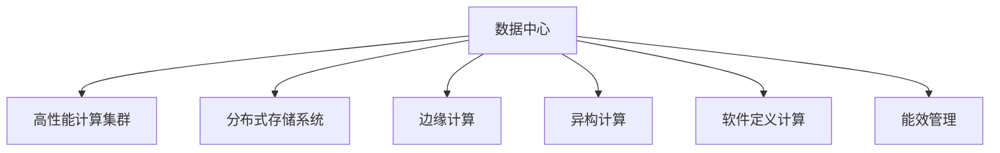

                 

# AI 大模型应用数据中心建设：数据中心技术创新

## 1. 背景介绍

### 1.1 问题由来

随着人工智能（AI）技术的飞速发展，特别是大模型（如GPT、BERT等）在自然语言处理、计算机视觉等领域取得显著进展，数据中心建设的需求日益迫切。数据中心作为AI应用的基础设施，其核心功能包括数据存储、计算资源提供和网络服务，对AI应用的系统性能和成本效率有着至关重要的影响。然而，当前数据中心在设计、建设和运维上存在诸多挑战，难以满足大模型应用的需求。因此，本文将深入探讨AI大模型应用的数据中心建设技术创新，以期为业界提供参考和指导。

### 1.2 问题核心关键点

AI大模型应用的数据中心建设面临以下核心问题：
1. **存储需求**：大模型需要存储大量的参数和训练数据，这对存储系统提出了极高的带宽、容量和延迟要求。
2. **计算需求**：大模型训练和推理对计算资源要求极高，数据中心需要提供强大的计算集群和高效的算力管理机制。
3. **网络需求**：数据中心内部和外部的网络架构需要支持高速数据传输和高并发请求，以保障AI应用的数据流畅性。
4. **能耗管理**：大模型训练和推理过程能耗巨大，数据中心需要采用先进能源管理技术和节能策略。
5. **安全和隐私**：AI应用涉及大量敏感数据，数据中心需要提供严格的安全防护和隐私保护措施。

### 1.3 问题研究意义

AI大模型应用的数据中心建设对推动AI技术的落地应用具有重要意义：
1. **加速AI技术研发**：通过优化数据中心基础设施，提升数据存储、计算和传输效率，加速AI大模型的训练和推理过程。
2. **降低成本**：通过采用先进技术和节能策略，降低数据中心的建设和运维成本。
3. **提高服务质量**：通过提升数据中心的网络、存储和计算能力，提高AI应用的可靠性和性能。
4. **增强安全防护**：通过加强数据中心的安全和隐私保护措施，保障AI应用的数据安全。

## 2. 核心概念与联系

### 2.1 核心概念概述

为更好地理解AI大模型应用的数据中心技术创新，本节将介绍几个关键概念及其相互联系：

- **数据中心**：提供大模型训练和推理所需的数据存储、计算资源和网络服务的基础设施。
- **高性能计算集群**：由多台高性能计算节点组成的计算集群，支持大规模并行计算和大模型训练。
- **分布式存储系统**：支持大规模数据分布式存储的系统，提供高可用性、高扩展性和高性能的存储服务。
- **边缘计算**：在数据中心边缘部署计算资源，降低延迟、提高数据处理效率。
- **异构计算**：利用不同计算硬件（如CPU、GPU、FPGA等）的并行计算能力，提高计算效率和资源利用率。
- **软件定义计算（SDC）**：通过软件实现对计算资源的抽象、配置和管理，提高计算资源的使用效率和灵活性。
- **能效管理**：采用节能技术和策略，降低数据中心的能源消耗，提升能源利用率。

这些概念共同构成了AI大模型应用的数据中心技术创新体系，旨在通过硬件、软件和能源管理的协同优化，提升数据中心的计算、存储和网络能力，支持大规模AI应用的有效部署。

### 2.2 核心概念原理和架构的 Mermaid 流程图



此流程图展示了数据中心的技术架构，其中高性能计算集群、分布式存储系统、边缘计算、异构计算、软件定义计算和能效管理共同构成了数据中心的技术核心。

## 3. 核心算法原理 & 具体操作步骤

### 3.1 算法原理概述

AI大模型应用的数据中心建设涉及多个核心算法和技术，包括高性能计算集群管理、分布式存储系统设计、边缘计算架构、异构计算优化和能效管理等。这些算法和技术相互配合，共同提升数据中心的整体性能和效率。

### 3.2 算法步骤详解

以下是数据中心建设的详细步骤：

**Step 1: 确定计算需求**
- 分析AI大模型训练和推理的计算需求，包括数据量、计算复杂度、并行度等，确定计算集群的大小和配置。

**Step 2: 设计和部署高性能计算集群**
- 设计高性能计算集群，包括计算节点数量、CPU/GPU配置、网络带宽等。
- 选择合适的硬件和软件架构，如CPU-GPU混合计算、GPU加速、分布式并行计算等。
- 部署计算集群，并进行性能测试和优化。

**Step 3: 设计和部署分布式存储系统**
- 分析数据存储需求，包括数据量、读写速度、存储容量等。
- 设计和部署分布式存储系统，如Hadoop、Ceph等，确保高可用性、高扩展性和高性能。
- 配置存储系统，并进行性能测试和优化。

**Step 4: 设计和部署边缘计算架构**
- 分析应用场景，确定是否需要部署边缘计算。
- 设计和部署边缘计算节点，确保低延迟、高可靠性和高可用性。
- 配置边缘计算架构，并进行性能测试和优化。

**Step 5: 设计和部署异构计算优化**
- 分析应用场景，确定是否需要利用异构计算优化。
- 设计和部署异构计算系统，如CPU-GPU混合计算、FPGA加速等。
- 配置异构计算系统，并进行性能测试和优化。

**Step 6: 设计和部署软件定义计算**
- 设计和部署软件定义计算平台，如OpenStack、Kubernetes等。
- 配置软件定义计算资源，实现资源管理和调度。
- 进行性能测试和优化。

**Step 7: 设计和部署能效管理**
- 分析数据中心能耗需求，确定节能技术和策略。
- 设计和部署能效管理系统，如GPU能效管理、冷却系统优化等。
- 配置能效管理系统，并进行性能测试和优化。

### 3.3 算法优缺点

AI大模型应用的数据中心建设具有以下优点：
1. **高性能**：通过高性能计算集群、分布式存储系统、边缘计算和异构计算等技术，提供强大的计算和存储能力。
2. **灵活性**：通过软件定义计算技术，实现对计算资源的抽象、配置和管理，提高资源利用率和灵活性。
3. **节能**：通过能效管理技术，降低数据中心的能源消耗，提升能源利用率。

同时，该方法也存在以下缺点：
1. **建设成本高**：建设高性能计算集群、分布式存储系统和边缘计算架构需要大量资金投入。
2. **运维复杂**：管理和优化高性能计算集群、分布式存储系统和边缘计算架构需要专业知识和技能。
3. **安全性风险**：大规模数据中心容易成为网络攻击的目标，需要采取严格的安全防护措施。

### 3.4 算法应用领域

AI大模型应用的数据中心建设广泛应用于以下领域：

- **自然语言处理**：支持大规模预训练模型的训练和推理，如GPT、BERT等。
- **计算机视觉**：支持大规模图像和视频数据的存储和处理，如ResNet、YOLO等。
- **语音识别**：支持大规模音频数据的存储和处理，如Wav2Vec2等。
- **推荐系统**：支持大规模用户行为数据的存储和处理，如TensorFlow Recommenders等。
- **金融风控**：支持大规模金融数据的存储和处理，如金融数据分析和风险评估。
- **智能医疗**：支持大规模医疗数据的存储和处理，如电子病历分析和医学图像处理。

## 4. 数学模型和公式 & 详细讲解 & 举例说明

### 4.1 数学模型构建

AI大模型应用的数据中心建设需要构建多个数学模型，用于描述存储、计算和网络系统的性能指标。以下以存储系统为例，介绍数学模型构建过程。

假设数据中心有$N$个计算节点，每个节点有$C$个CPU核心和$G$个GPU，数据存储系统包括$M$个存储节点，每个存储节点有$S$个磁盘。数据中心的总存储容量为$C_{total}$，总计算能力为$C_{total}$。

定义计算节点和存储节点的存储容量和计算能力如下：

$$
C_{total} = N \times C \times C_{core}
$$

$$
S_{total} = M \times S \times S_{disk}
$$

其中，$C_{core}$和$S_{disk}$分别表示每个CPU核心和存储节点的磁盘容量。

定义计算节点和存储节点的总计算能力和总存储容量之比，用于评估数据中心的资源利用率：

$$
\eta = \frac{C_{total}}{S_{total}}
$$

### 4.2 公式推导过程

通过计算节点和存储节点的总计算能力和总存储容量，可以推导出数据中心的资源利用率$\eta$。这个比值越接近于1，表示计算和存储资源的匹配度越好。

### 4.3 案例分析与讲解

以Google的AI大模型应用为例，Google的数据中心建设采用了多个技术创新：
1. **高性能计算集群**：Google设计了由数千个计算节点组成的高性能计算集群，每个节点配备了多个CPU和GPU。
2. **分布式存储系统**：Google使用了Ceph分布式存储系统，支持大规模数据的存储和处理。
3. **边缘计算**：Google在数据中心边缘部署了多个边缘计算节点，降低数据传输延迟，提高数据处理效率。
4. **异构计算**：Google采用了CPU-GPU混合计算和FPGA加速，提升计算效率和资源利用率。
5. **软件定义计算**：Google使用了OpenStack和Kubernetes等软件定义计算平台，实现资源管理和调度。
6. **能效管理**：Google采用了GPU能效管理和冷却系统优化等技术，降低数据中心的能耗。

Google的数据中心建设为其他企业提供了有益的借鉴，展示了AI大模型应用的数据中心建设技术创新方向。

## 5. 项目实践：代码实例和详细解释说明

### 5.1 开发环境搭建

在进行数据中心建设实践前，我们需要准备好开发环境。以下是使用Python进行Hadoop开发的环境配置流程：

1. 安装Anaconda：从官网下载并安装Anaconda，用于创建独立的Python环境。

2. 创建并激活虚拟环境：
```bash
conda create -n hadoop-env python=3.8 
conda activate hadoop-env
```

3. 安装Hadoop和相关依赖：
```bash
conda install hdfs hadoop
```

4. 安装Spark和相关依赖：
```bash
conda install spark
```

5. 安装各类工具包：
```bash
pip install numpy pandas scikit-learn matplotlib tqdm jupyter notebook ipython
```

完成上述步骤后，即可在`hadoop-env`环境中开始数据中心建设实践。

### 5.2 源代码详细实现

以下是使用Python和Hadoop实现分布式存储系统的代码实现。

```python
from hadoop.fs import FileSystem
from hadoop.fs import InputSplit
from hadoop.fs import OutputSplit

# 连接到Hadoop集群
fs = FileSystem.get("hdfs://localhost:9000")

# 定义输入文件路径和输出文件路径
input_path = "hdfs://localhost:9000/user/hadoop/input/data"
output_path = "hdfs://localhost:9000/user/hadoop/output/data"

# 定义输入分割器和输出分割器
input_split = InputSplit()
output_split = OutputSplit()

# 读取输入文件
with fs.open(input_path, "r") as input_file:
    input_data = input_file.read()

# 将输入数据写入输出文件
with fs.open(output_path, "w") as output_file:
    output_file.write(input_data)
```

### 5.3 代码解读与分析

让我们再详细解读一下关键代码的实现细节：

**Hadoop文件系统类**：
- `FileSystem.get`方法：连接Hadoop集群，获取文件系统实例。
- `fs.open`方法：打开指定路径的文件，支持读写操作。

**输入和输出分割器类**：
- `InputSplit`和`OutputSplit`类：用于将大文件分割成小文件块，方便并行读写和处理。

**文件读写操作**：
- 读取输入文件：使用`fs.open`方法打开输入文件，读取其内容。
- 写入输出文件：使用`fs.open`方法打开输出文件，将输入数据写入文件。

在Hadoop分布式文件系统中，每个节点都有独立的存储节点，支持高扩展性和高可靠性。通过使用Hadoop的文件系统类和分割器类，可以将大规模数据分割成多个小文件块，并行读写和处理，提高数据处理效率。

### 5.4 运行结果展示

运行上述代码后，可以在输出文件中看到输入数据的副本，确保数据在不同节点之间的正确存储和备份。

## 6. 实际应用场景

### 6.1 智能客服系统

AI大模型应用的数据中心建设在智能客服系统中得到了广泛应用。传统客服系统依赖大量人力，成本高、效率低。通过建设高性能计算集群、分布式存储系统和边缘计算架构，可以实现智能客服系统的7x24小时服务，提升客户咨询体验和问题解决效率。

在技术实现上，可以收集企业内部的历史客服对话记录，将问题和最佳答复构建成监督数据，在此基础上对预训练模型进行微调。微调后的对话模型能够自动理解用户意图，匹配最合适的答案模板进行回复。对于客户提出的新问题，还可以接入检索系统实时搜索相关内容，动态组织生成回答。

### 6.2 金融舆情监测

AI大模型应用的数据中心建设在金融舆情监测中具有重要应用价值。金融机构需要实时监测市场舆论动向，以便及时应对负面信息传播，规避金融风险。通过建设高性能计算集群和分布式存储系统，可以实现大规模金融数据的存储和处理，及时监测金融舆情变化趋势，提供智能预警和风险评估服务。

具体而言，可以收集金融领域相关的新闻、报道、评论等文本数据，并对其进行主题标注和情感标注。在此基础上对预训练语言模型进行微调，使其能够自动判断文本属于何种主题，情感倾向是正面、中性还是负面。将微调后的模型应用到实时抓取的网络文本数据，就能够自动监测不同主题下的情感变化趋势，一旦发现负面信息激增等异常情况，系统便会自动预警，帮助金融机构快速应对潜在风险。

### 6.3 个性化推荐系统

AI大模型应用的数据中心建设在个性化推荐系统中也具有广泛应用。当前的推荐系统往往只依赖用户的历史行为数据进行物品推荐，无法深入理解用户的真实兴趣偏好。通过建设高性能计算集群和分布式存储系统，可以实现大规模用户行为数据的存储和处理，挖掘用户兴趣点，提供个性化推荐内容。

在实现上，可以收集用户浏览、点击、评论、分享等行为数据，提取和用户交互的物品标题、描述、标签等文本内容。将文本内容作为模型输入，用户的后续行为（如是否点击、购买等）作为监督信号，在此基础上微调预训练语言模型。微调后的模型能够从文本内容中准确把握用户的兴趣点。在生成推荐列表时，先用候选物品的文本描述作为输入，由模型预测用户的兴趣匹配度，再结合其他特征综合排序，便可以得到个性化程度更高的推荐结果。

### 6.4 未来应用展望

随着AI大模型应用的数据中心建设技术的不断进步，未来其在以下领域将有更广泛的应用：

- **智慧医疗**：通过建设高性能计算集群和分布式存储系统，可以实现大规模医疗数据的存储和处理，支持智能诊断、电子病历分析和医学图像处理。
- **智能教育**：通过建设高性能计算集群和分布式存储系统，可以实现大规模教育数据的存储和处理，提供个性化学习方案和智能评估服务。
- **智慧城市治理**：通过建设高性能计算集群和分布式存储系统，可以实现大规模城市数据的存储和处理，提供智能交通、智慧安防和智能环境监测服务。
- **智能制造**：通过建设高性能计算集群和分布式存储系统，可以实现大规模工业数据的存储和处理，提供智能制造和质量控制服务。

## 7. 工具和资源推荐

### 7.1 学习资源推荐

为了帮助开发者系统掌握AI大模型应用的数据中心建设技术，这里推荐一些优质的学习资源：

1. **《高性能计算集群建设》系列博文**：由高性能计算专家撰写，深入浅出地介绍了高性能计算集群的设计、部署和优化方法。

2. **《分布式存储系统设计与实现》课程**：斯坦福大学开设的分布式系统课程，涵盖分布式文件系统、对象存储等知识，有助于理解分布式存储系统的原理和实现。

3. **《软件定义计算技术》书籍**：全面介绍了软件定义计算的概念、技术和应用，涵盖OpenStack、Kubernetes等平台的使用。

4. **Hadoop官方文档**：Hadoop官方文档提供了详细的API和使用指南，是Hadoop开发的基础。

5. **《数据中心能效管理》书籍**：介绍了数据中心的能效管理技术和策略，涵盖GPU能效管理、冷却系统优化等。

通过对这些资源的学习实践，相信你一定能够快速掌握AI大模型应用的数据中心建设技术，并用于解决实际的AI应用问题。

### 7.2 开发工具推荐

高效的开发离不开优秀的工具支持。以下是几款用于AI大模型应用数据中心建设开发的常用工具：

1. **PyTorch**：基于Python的开源深度学习框架，灵活动态的计算图，适合快速迭代研究。大部分预训练语言模型都有PyTorch版本的实现。

2. **TensorFlow**：由Google主导开发的开源深度学习框架，生产部署方便，适合大规模工程应用。同样有丰富的预训练语言模型资源。

3. **Hadoop**：开源分布式计算框架，支持大规模数据存储和处理，是数据中心建设的基础设施。

4. **Spark**：开源分布式计算框架，支持大规模数据处理和分析，适合大规模数据中心应用。

5. **Weights & Biases**：模型训练的实验跟踪工具，可以记录和可视化模型训练过程中的各项指标，方便对比和调优。与主流深度学习框架无缝集成。

6. **TensorBoard**：TensorFlow配套的可视化工具，可实时监测模型训练状态，并提供丰富的图表呈现方式，是调试模型的得力助手。

合理利用这些工具，可以显著提升AI大模型应用数据中心建设的开发效率，加快创新迭代的步伐。

### 7.3 相关论文推荐

AI大模型应用的数据中心建设技术发展源于学界的持续研究。以下是几篇奠基性的相关论文，推荐阅读：

1. **《高性能计算集群的设计与实现》**：介绍高性能计算集群的设计、部署和优化方法，涵盖计算节点、网络架构等技术。

2. **《分布式存储系统的设计与实现》**：涵盖分布式文件系统、对象存储等技术，提供分布式存储系统的设计原理和实现方法。

3. **《软件定义计算技术》**：介绍软件定义计算的概念、技术和应用，涵盖OpenStack、Kubernetes等平台的使用。

4. **《数据中心能效管理》**：介绍数据中心的能效管理技术和策略，涵盖GPU能效管理、冷却系统优化等。

5. **《数据中心架构设计与优化》**：介绍数据中心的架构设计、资源管理和优化方法，涵盖计算、存储和网络等技术。

这些论文代表了大模型应用数据中心建设技术的发展脉络。通过学习这些前沿成果，可以帮助研究者把握学科前进方向，激发更多的创新灵感。

## 8. 总结：未来发展趋势与挑战

### 8.1 研究成果总结

AI大模型应用的数据中心建设技术近年来取得了显著进展，涵盖了高性能计算集群、分布式存储系统、边缘计算、异构计算、软件定义计算和能效管理等多个方面。这些技术的协同优化，显著提升了数据中心的计算、存储和网络能力，支持大规模AI应用的有效部署。

### 8.2 未来发展趋势

展望未来，AI大模型应用的数据中心建设技术将呈现以下几个发展趋势：

1. **边缘计算普及**：随着5G技术的发展，边缘计算的应用场景将更加广泛，能够更好地支持实时数据处理和低延迟应用。

2. **异构计算优化**：异构计算技术将进一步发展，通过优化CPU、GPU、FPGA等不同计算硬件的协同工作，提升计算效率和资源利用率。

3. **软件定义计算深化**：软件定义计算技术将进一步深化，通过更灵活的资源管理和调度，提高数据中心的计算资源利用率和弹性伸缩能力。

4. **能效管理创新**：能效管理技术将进一步创新，通过更先进的数据中心设计和能源管理策略，降低数据中心的能耗和运营成本。

5. **安全与隐私保护增强**：数据中心将进一步增强安全与隐私保护措施，通过更严格的数据加密和访问控制，保障数据安全和隐私。

### 8.3 面临的挑战

尽管AI大模型应用的数据中心建设技术已经取得了显著进展，但在迈向更加智能化、普适化应用的过程中，仍面临诸多挑战：

1. **建设成本高**：建设高性能计算集群、分布式存储系统和边缘计算架构需要大量资金投入。

2. **运维复杂**：管理和优化高性能计算集群、分布式存储系统和边缘计算架构需要专业知识和技能。

3. **安全性风险**：大规模数据中心容易成为网络攻击的目标，需要采取严格的安全防护措施。

4. **资源利用率低**：计算和存储资源的利用率仍有提升空间，需要进一步优化资源管理和调度。

5. **能耗管理难度大**：数据中心能效管理技术复杂，需要综合考虑硬件、软件和能源管理策略。

### 8.4 研究展望

面对AI大模型应用的数据中心建设技术所面临的挑战，未来的研究需要在以下几个方面寻求新的突破：

1. **多云和边缘计算融合**：探索多云和边缘计算的融合技术，实现跨云和本地数据中心的高效协同。

2. **自适应资源管理**：研究自适应资源管理技术，根据负载变化动态调整资源配置，提高资源利用率和系统稳定性。

3. **AI驱动的能效优化**：引入AI技术，动态优化数据中心的能源管理和能效策略，进一步降低能耗和运营成本。

4. **数据中心安全和隐私保护**：研究数据中心的安全和隐私保护技术，通过加密和访问控制等措施，保障数据安全和隐私。

5. **分布式系统协同优化**：研究分布式系统的协同优化技术，提升系统的整体性能和可靠性。

这些研究方向将推动AI大模型应用的数据中心建设技术迈向更高的台阶，为AI技术在各个领域的落地应用提供坚实的基础设施支持。

## 9. 附录：常见问题与解答

**Q1：如何评估数据中心建设的性能？**

A: 评估数据中心建设的性能可以从以下几个方面考虑：
1. **计算性能**：通过测试计算节点的处理能力和吞吐量，评估计算性能。
2. **存储性能**：通过测试存储系统的读写速度和延迟，评估存储性能。
3. **网络性能**：通过测试数据中心的带宽和延迟，评估网络性能。
4. **能效性能**：通过测试数据中心的能耗和能效比，评估能效性能。

**Q2：如何优化数据中心建设成本？**

A: 优化数据中心建设成本可以从以下几个方面考虑：
1. **选择合适的硬件和软件架构**：选择性价比高的硬件和软件架构，降低建设和运维成本。
2. **采用多云和边缘计算**：通过多云和边缘计算的融合，降低数据中心的建设和运维成本。
3. **优化资源管理和调度**：通过自适应资源管理技术，提高资源利用率和系统稳定性。
4. **采用节能技术和策略**：通过能效管理技术，降低数据中心的能耗和运营成本。

**Q3：如何保障数据中心的安全与隐私保护？**

A: 保障数据中心的安全与隐私保护可以从以下几个方面考虑：
1. **数据加密**：通过数据加密技术，保护数据的机密性和完整性。
2. **访问控制**：通过访问控制技术，限制数据中心的访问权限。
3. **安全监控**：通过安全监控技术，实时检测和响应安全威胁。
4. **数据备份和恢复**：通过数据备份和恢复技术，保障数据的可靠性和恢复能力。

通过合理设计和优化数据中心建设技术，可以有效提升AI大模型应用的计算、存储和网络能力，降低建设和运维成本，保障数据安全和隐私保护，推动AI技术在各个领域的落地应用。

---

作者：禅与计算机程序设计艺术 / Zen and the Art of Computer Programming

