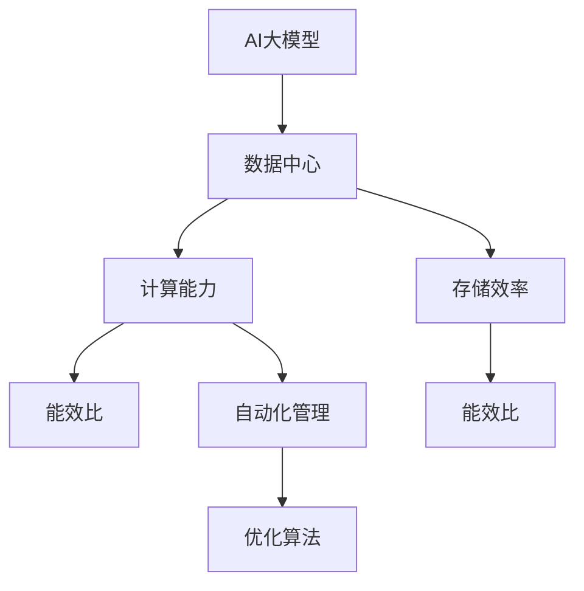

                 

# AI 大模型应用数据中心建设：数据中心技术创新

> 关键词：AI大模型, 数据中心, 技术创新, 计算能力, 存储效率, 能效比, 自动化管理, 优化算法

## 1. 背景介绍

### 1.1 问题由来

随着人工智能(AI)技术的飞速发展，尤其是深度学习和机器学习模型的不断涌现，AI大模型的计算需求越来越大。这些大模型通常拥有亿级参数量，需要在数据中心中进行分布式训练和推理。然而，现有的数据中心基础设施和管理技术已难以满足这些需求，特别是在数据中心建设、运维和优化方面。

AI大模型在数据中心的应用面临着计算能力不足、存储效率低下、能效比差、自动化管理能力弱等诸多挑战。这些问题直接影响了AI大模型的训练速度、服务质量、可靠性和成本效益。因此，对数据中心技术进行创新和优化，已经成为推动AI大模型应用的关键因素。

### 1.2 问题核心关键点

AI大模型应用数据中心技术创新的核心关键点在于：
1. **计算能力提升**：数据中心需要具备足够的计算资源，以支持大模型的训练和推理任务。
2. **存储效率优化**：如何高效存储和管理模型参数和数据，减少存储开销。
3. **能效比优化**：在提升计算能力的同时，优化能效，降低数据中心运营成本。
4. **自动化管理增强**：实现数据中心的自动化运维和优化，减少人工干预和运维成本。
5. **优化算法创新**：研究和开发新的计算和存储优化算法，提高数据中心的性能和效率。

## 2. 核心概念与联系

### 2.1 核心概念概述

为更好地理解AI大模型应用数据中心的建设，本节将介绍几个关键概念：

- **AI大模型**：通常指具有亿级参数量的大型神经网络模型，如BERT、GPT等。这些模型用于处理大规模的NLP、计算机视觉、生成对抗网络等领域的任务。
- **数据中心**：大规模计算资源、存储设备和网络设施的集合，用于支持企业级应用的运行。
- **计算能力**：指数据中心提供的计算资源，包括CPU、GPU、TPU等硬件计算单元的性能。
- **存储效率**：指数据中心存储资源的利用率，包括存储设备的容量、带宽、延迟等性能指标。
- **能效比**：指数据中心的能耗与提供的计算和存储能力之间的关系。
- **自动化管理**：指通过软件系统实现数据中心的自动化运维和优化，包括故障检测、资源调度和优化算法等。
- **优化算法**：指用于提升数据中心计算和存储性能的技术，如模型压缩、分布式训练等。

这些核心概念之间的逻辑关系可以通过以下Mermaid流程图来展示：



这个流程图展示了大模型应用数据中心的核心概念及其之间的关系：

1. 大模型作为应用对象，需要数据中心提供强大的计算和存储能力。
2. 数据中心的计算能力和存储效率直接影响了AI大模型的性能和可靠性。
3. 能效比优化是降低运营成本、提升资源利用率的重要目标。
4. 自动化管理和大模型应用场景下的优化算法，是提升数据中心性能和效率的关键手段。

## 3. 核心算法原理 & 具体操作步骤

### 3.1 算法原理概述

AI大模型应用数据中心的技术创新主要集中在以下几个方面：

- **计算能力提升**：通过硬件升级、分布式训练、异构计算等方法，提升数据中心的计算能力。
- **存储效率优化**：通过模型压缩、数据分布式存储、优化存储设备等手段，提升数据中心的存储效率。
- **能效比优化**：通过优化算法、节能技术、硬件设计等手段，降低数据中心的能耗，提升能效比。
- **自动化管理增强**：通过软件系统、自动化运维工具、智能优化算法等，实现数据中心的自动化管理和优化。
- **优化算法创新**：研究和开发新的计算和存储优化算法，如分布式训练、模型压缩、剪枝、量化等，提升数据中心的性能和效率。

### 3.2 算法步骤详解

以下以计算能力提升为例，详细介绍数据中心技术创新的具体操作步骤：

1. **硬件升级**：
   - 升级计算节点硬件，增加CPU、GPU、TPU等计算资源，提高整体计算能力。
   - 采用最新的计算硬件技术，如高性能计算集群、GPU加速、TPU加速等。

2. **分布式训练**：
   - 采用分布式训练框架，如TensorFlow分布式训练、PyTorch分布式训练等，将大模型训练任务分配到多个节点上进行并行处理。
   - 使用消息传递接口（MPI）、数据并行库（如Horovod）等工具，实现节点间的通信和数据同步。

3. **异构计算**：
   - 采用混合计算方式，结合CPU、GPU、TPU等多种计算资源，优化计算性能。
   - 使用GPU加速、FPGA加速、专用硬件加速器等技术，提升特定任务的处理能力。

4. **系统优化**：
   - 优化计算框架的性能，减少资源浪费和延迟。
   - 优化模型训练算法，如梯度下降算法、随机梯度下降算法等，提升训练速度和收敛性。

5. **资源管理**：
   - 使用资源管理系统，如Kubernetes、Mesos等，动态分配和管理计算资源。
   - 实现资源的弹性伸缩，根据任务需求自动调整资源配置。

### 3.3 算法优缺点

AI大模型应用数据中心技术创新的优缺点如下：

**优点**：
- **提升计算能力**：通过硬件升级、分布式训练和异构计算，显著提升数据中心的计算能力，满足大模型的训练需求。
- **优化存储效率**：通过模型压缩、数据分布式存储和优化存储设备，减少存储开销，提升存储效率。
- **降低能耗**：通过优化算法和节能技术，降低数据中心的能耗，提升能效比。
- **自动化管理**：通过软件系统和自动化运维工具，实现数据中心的自动化管理和优化，减少人工干预和运维成本。

**缺点**：
- **成本高**：硬件升级和优化需要大量的资金投入。
- **技术复杂**：分布式训练、异构计算和系统优化技术要求较高，需要专业的技术团队进行实施和维护。
- **可扩展性差**：现有数据中心基础设施的扩展能力有限，难以快速适应大模型训练的需求。

### 3.4 算法应用领域

AI大模型应用数据中心技术创新的应用领域广泛，主要包括以下几个方面：

1. **高性能计算**：在科学研究、金融分析、医学图像处理等领域，使用高性能计算集群进行大模型的训练和推理。
2. **分布式训练**：在自动驾驶、自然语言处理、计算机视觉等大规模任务中，使用分布式训练框架提升训练速度和模型性能。
3. **异构计算**：在特定任务（如深度神经网络训练、图像处理、视频编码）中，使用GPU、TPU等专用硬件加速器提升计算效率。
4. **数据中心自动化**：在数据中心管理和运维中，使用自动化运维工具和系统，实现资源动态分配和优化。
5. **能效优化**：在数据中心能耗管理中，使用优化算法和节能技术，降低能耗，提升能效比。

## 4. 数学模型和公式 & 详细讲解 & 举例说明

### 4.1 数学模型构建

本节将使用数学语言对AI大模型应用数据中心的计算能力提升进行更加严格的刻画。

记数据中心提供的计算能力为 $C$，存储能力为 $S$，能耗为 $E$，则数据中心的能效比 $\eta$ 定义为：

$$
\eta = \frac{C}{E}
$$

在实际计算中，能效比可以进一步分解为两个维度：

$$
\eta = \frac{C}{S} \times \frac{S}{E}
$$

其中，第一个维度表示计算能力与存储能力之比，第二个维度表示存储能力与能耗之比。

### 4.2 公式推导过程

以计算能力提升为例，推导计算能力提升的优化公式：

1. **硬件升级**：
   - 增加计算资源 $C$，提升计算能力。
   - 引入新的计算硬件技术 $T$，提高单位计算资源的性能。
   - 优化计算框架 $F$，减少计算过程中的资源浪费。

2. **分布式训练**：
   - 采用分布式训练框架 $D$，将任务分配到多个节点上进行并行处理。
   - 使用消息传递接口 $M$，实现节点间的通信和数据同步。
   - 优化数据并行库 $P$，减少通信开销和延迟。

3. **异构计算**：
   - 采用混合计算方式 $H$，结合CPU、GPU、TPU等多种计算资源。
   - 使用GPU加速 $G$，提高特定任务的处理能力。
   - 使用FPGA加速 $F$，优化特定类型的计算任务。

### 4.3 案例分析与讲解

以Google的TPU为例，Google的TPU是一种专门用于深度学习计算的专用硬件加速器。通过TPU的引入，Google的数据中心计算能力得到了大幅提升。

**硬件升级**：
- Google推出了多代TPU，从TPU V1到TPU V4，硬件性能不断提升。
- 每个TPU V4拥有4096个核心，比之前的TPU V3提升了4倍。

**分布式训练**：
- Google使用TensorFlow分布式训练框架，将大模型训练任务分配到多个TPU上进行并行处理。
- 每个TPU节点可以独立计算，实现高效的分布式训练。

**异构计算**：
- Google的TPU采用混合计算方式，结合CPU和GPU资源，优化特定任务的处理能力。
- TPU与CPU/GPU协同工作，提升了整体计算效率。

## 5. 项目实践：代码实例和详细解释说明

### 5.1 开发环境搭建

在进行计算能力提升的实践前，我们需要准备好开发环境。以下是使用Python进行TensorFlow开发的环境配置流程：

1. 安装Anaconda：从官网下载并安装Anaconda，用于创建独立的Python环境。

2. 创建并激活虚拟环境：
```bash
conda create -n tensorflow-env python=3.8 
conda activate tensorflow-env
```

3. 安装TensorFlow：根据CUDA版本，从官网获取对应的安装命令。例如：
```bash
conda install tensorflow -c tensorflow -c conda-forge
```

4. 安装各类工具包：
```bash
pip install numpy pandas scikit-learn matplotlib tqdm jupyter notebook ipython
```

完成上述步骤后，即可在`tensorflow-env`环境中开始计算能力提升的实践。

### 5.2 源代码详细实现

下面我们以Google的TPU为例，给出使用TensorFlow进行计算能力提升的PyTorch代码实现。

首先，定义模型的输入和输出：

```python
import tensorflow as tf

model = tf.keras.Sequential([
    tf.keras.layers.Dense(64, activation='relu', input_shape=(784,)),
    tf.keras.layers.Dense(10, activation='softmax')
])
```

然后，定义TPU计算图：

```python
# 创建TPU计算图
strategy = tf.distribute.TPUStrategy(tpu_cluster_resolver)

with strategy.scope():
    model = tf.keras.Sequential([
        tf.keras.layers.Dense(64, activation='relu', input_shape=(784,)),
        tf.keras.layers.Dense(10, activation='softmax')
    ])
```

接着，定义分布式训练过程：

```python
@tf.function
def train_step(x, y):
    with strategy.scope():
        logits = model(x, training=True)
        loss = tf.keras.losses.sparse_categorical_crossentropy(y, logits)
        loss = tf.reduce_mean(loss)
        train_op = tf.keras.optimizers.Adam(0.001).minimize(loss)
        return loss

@tf.function
def test_step(x, y):
    with strategy.scope():
        logits = model(x, training=False)
        predictions = tf.argmax(logits, axis=-1)
        accuracy = tf.metrics.sparse_categorical_accuracy(y, predictions)
        return accuracy
```

最后，启动训练流程：

```python
with strategy.scope():
    model.compile(optimizer=tf.keras.optimizers.Adam(0.001),
                  loss=tf.keras.losses.sparse_categorical_crossentropy,
                  metrics=['accuracy'])

    model.fit(train_x, train_y, epochs=10, steps_per_epoch=train_x.shape[0]//strategy.num_replicas_in_sync, callbacks=[tf.keras.callbacks.EarlyStopping(patience=2)])
```

以上就是使用TensorFlow进行计算能力提升的完整代码实现。可以看到，TensorFlow提供了强大的分布式训练框架，使得大模型的训练过程更加高效和可靠。

### 5.3 代码解读与分析

让我们再详细解读一下关键代码的实现细节：

**定义模型**：
- 使用TensorFlow的Sequential模型定义输入层和输出层，并指定激活函数。

**定义TPU计算图**：
- 使用`tf.distribute.TPUStrategy`创建TPU计算图，将模型定义在TPU集群中。
- 在TPU集群中，模型将自动进行分布式训练，并利用TPU加速计算。

**定义训练过程**：
- 使用`tf.function`装饰器将训练过程定义为函数，实现自动化的代码优化。
- 在函数内部，使用`with strategy.scope()`语句进入TPU计算图，进行分布式计算。
- 使用`tf.keras.losses.sparse_categorical_crossentropy`计算交叉熵损失，并使用`tf.reduce_mean`计算平均损失。
- 使用`tf.keras.optimizers.Adam`优化器进行梯度下降，并使用`tf.keras.metrics.sparse_categorical_accuracy`计算准确率。

**启动训练流程**：
- 在TPU集群中，使用`model.compile`编译模型，并指定优化器、损失函数和评估指标。
- 使用`model.fit`进行模型训练，指定训练集、训练轮数和批次大小，并在每个epoch末尾调用`EarlyStopping`回调函数，避免过拟合。

可以看到，TensorFlow的分布式训练框架使得计算能力提升的代码实现变得简洁高效。开发者可以将更多精力放在模型训练和优化上，而不必过多关注底层的实现细节。

## 6. 实际应用场景

### 6.1 高性能计算

高性能计算是AI大模型应用的主要场景之一。在科学研究、金融分析、医学图像处理等领域，大模型需要处理大规模的数据集和复杂的计算任务。

**案例分析**：
- 在医学图像处理中，大模型需要处理大量医学影像数据，提取病理特征，辅助医生进行诊断和治疗。
- 在金融分析中，大模型需要处理海量交易数据，预测股票价格走势，优化投资策略。
- 在科学研究中，大模型需要处理复杂的物理模拟数据，进行科学研究和发现。

### 6.2 分布式训练

分布式训练是AI大模型应用的核心技术之一。在大规模任务中，单节点训练资源不足，需要分布式训练来提升训练速度和模型性能。

**案例分析**：
- 在自动驾驶领域，大模型需要处理大量的图像和传感器数据，进行实时决策。
- 在自然语言处理中，大模型需要处理大规模的文本数据，进行文本生成和语言理解。
- 在计算机视觉中，大模型需要处理大规模的图像数据，进行图像分类和目标检测。

### 6.3 异构计算

异构计算是提升计算效率的重要手段。在大模型训练中，GPU、TPU等专用硬件加速器可以显著提升计算速度和资源利用率。

**案例分析**：
- 在深度神经网络训练中，GPU加速可以显著提升训练速度。
- 在图像处理中，TPU加速可以处理大规模图像数据，进行图像生成和特征提取。
- 在视频编码中，FPGA加速可以提升视频编解码的效率。

## 7. 工具和资源推荐

### 7.1 学习资源推荐

为了帮助开发者系统掌握AI大模型应用数据中心的理论基础和实践技巧，这里推荐一些优质的学习资源：

1. **《深度学习与高性能计算》**：由斯坦福大学教授撰写，详细介绍了高性能计算的原理和实践，是学习高性能计算的重要参考资料。
2. **《TensorFlow分布式训练指南》**：TensorFlow官方文档，介绍了TensorFlow的分布式训练框架，包括TPU、GPU、CPU等加速器的使用。
3. **《GPU加速计算》**：由NVIDIA撰写，详细介绍了GPU加速的原理和应用场景，是学习GPU加速的重要参考资料。
4. **《高性能计算编程技术》**：由高性能计算领域的专家撰写，介绍了高性能计算编程技术和工具，适合系统学习高性能计算。
5. **《深度学习模型压缩与优化》**：介绍了深度学习模型的压缩和优化技术，包括模型剪枝、量化、稀疏化等方法。

通过对这些资源的学习实践，相信你一定能够快速掌握AI大模型应用数据中心的精髓，并用于解决实际的计算能力提升问题。

### 7.2 开发工具推荐

高效的开发离不开优秀的工具支持。以下是几款用于AI大模型应用数据中心开发的常用工具：

1. **TensorFlow**：由Google主导开发的开源深度学习框架，生产部署方便，适合大规模工程应用。
2. **PyTorch**：由Facebook主导开发的深度学习框架，灵活动态的计算图，适合快速迭代研究。
3. **TPU**：Google开发的专用硬件加速器，用于深度学习计算，提升计算效率。
4. **Horovod**：分布式训练框架，支持多种计算平台和硬件加速器。
5. **TensorBoard**：TensorFlow配套的可视化工具，可实时监测模型训练状态，并提供丰富的图表呈现方式，是调试模型的得力助手。

合理利用这些工具，可以显著提升AI大模型应用数据中心的开发效率，加快创新迭代的步伐。

### 7.3 相关论文推荐

AI大模型应用数据中心的研究源于学界的持续研究。以下是几篇奠基性的相关论文，推荐阅读：

1. **《TPU: A 10+ Billion Transistors on a Chip》**：Google的TPU论文，详细介绍了TPU的设计和性能，是了解TPU的重要参考资料。
2. **《分布式深度学习训练框架》**：TensorFlow官方论文，介绍了TensorFlow的分布式训练框架，包括TPU、GPU等加速器的使用。
3. **《深度学习模型压缩与优化》**：介绍了深度学习模型的压缩和优化技术，包括模型剪枝、量化、稀疏化等方法。
4. **《GPU加速计算》**：详细介绍了GPU加速的原理和应用场景，是学习GPU加速的重要参考资料。
5. **《高性能计算编程技术》**：介绍了高性能计算编程技术和工具，适合系统学习高性能计算。

这些论文代表了大模型应用数据中心的发展脉络。通过学习这些前沿成果，可以帮助研究者把握学科前进方向，激发更多的创新灵感。

## 8. 总结：未来发展趋势与挑战

### 8.1 总结

本文对AI大模型应用数据中心的计算能力提升进行了全面系统的介绍。首先阐述了AI大模型和数据中心的研究背景和意义，明确了计算能力提升在AI大模型应用中的重要价值。其次，从原理到实践，详细讲解了分布式训练和异构计算的数学原理和关键步骤，给出了计算能力提升的完整代码实例。同时，本文还广泛探讨了计算能力提升在科学计算、金融分析、医学图像处理等多个行业领域的应用前景，展示了计算能力提升范式的巨大潜力。最后，本文精选了计算能力提升技术的各类学习资源，力求为读者提供全方位的技术指引。

通过本文的系统梳理，可以看到，计算能力提升是AI大模型应用的重要方向，极大地拓展了数据中心的计算能力，提升了模型训练和推理的效率和质量。未来，伴随计算硬件的不断发展和优化算法的持续创新，AI大模型应用将走向更广阔的领域，为科学研究、金融分析、医学图像处理等众多领域带来变革性影响。

### 8.2 未来发展趋势

展望未来，AI大模型应用数据中心的计算能力提升将呈现以下几个发展趋势：

1. **计算能力持续增强**：随着计算硬件的不断升级，AI大模型的计算能力将不断增强，支持更加复杂的计算任务。
2. **分布式训练优化**：分布式训练框架将不断优化，提升大规模任务的处理能力，实现高效的模型训练。
3. **异构计算普及**：异构计算技术将更加普及，结合CPU、GPU、TPU等多种计算资源，提升整体计算效率。
4. **自动调度和优化**：软件系统将更加智能，实现自动调度和优化，减少人工干预和运维成本。
5. **能效比持续提升**：通过节能技术和优化算法，数据中心的能效比将不断提升，降低运营成本。

以上趋势凸显了AI大模型应用数据中心计算能力提升技术的广阔前景。这些方向的探索发展，必将进一步提升数据中心的性能和效率，为AI大模型的应用提供更强大的支持。

### 8.3 面临的挑战

尽管AI大模型应用数据中心计算能力提升技术已经取得了瞩目成就，但在迈向更加智能化、普适化应用的过程中，它仍面临着诸多挑战：

1. **计算资源成本高**：大规模计算资源需要大量资金投入，增加了AI大模型应用的经济门槛。
2. **技术复杂度高**：分布式训练和异构计算技术要求较高，需要专业的技术团队进行实施和维护。
3. **可扩展性差**：现有数据中心基础设施的扩展能力有限，难以快速适应大模型训练的需求。
4. **能耗问题严重**：大规模计算资源的高能耗问题，需要结合节能技术和优化算法进行解决。
5. **系统稳定性差**：分布式训练和异构计算的复杂性，容易导致系统不稳定，影响应用效果。

正视计算能力提升面临的这些挑战，积极应对并寻求突破，将是大模型应用数据中心走向成熟的必由之路。相信随着学界和产业界的共同努力，这些挑战终将一一被克服，大模型应用数据中心必将在构建高性能、低能耗、高效能的AI计算平台中扮演越来越重要的角色。

### 8.4 未来突破

面对计算能力提升面临的种种挑战，未来的研究需要在以下几个方面寻求新的突破：

1. **计算硬件创新**：开发更加高效、低能耗的计算硬件，如新一代TPU、GPU、FPGA等，提升数据中心的计算能力。
2. **优化算法创新**：研究和开发新的计算和存储优化算法，如分布式训练、模型压缩、剪枝、量化等，提升数据中心的性能和效率。
3. **系统优化**：开发更加智能的分布式训练和异构计算系统，实现自动调度和优化，减少人工干预和运维成本。
4. **节能技术应用**：结合节能技术和优化算法，降低数据中心的能耗，提升能效比。
5. **模型压缩与优化**：研究和开发新的模型压缩与优化技术，减少模型存储和计算资源消耗，提升模型效率。

这些研究方向的探索，必将引领AI大模型应用数据中心计算能力提升技术迈向更高的台阶，为构建高性能、低能耗、高效能的AI计算平台铺平道路。面向未来，大模型应用数据中心还需要与其他人工智能技术进行更深入的融合，如知识表示、因果推理、强化学习等，多路径协同发力，共同推动人工智能技术的发展。

## 9. 附录：常见问题与解答

**Q1：AI大模型应用数据中心如何实现计算能力提升？**

A: AI大模型应用数据中心实现计算能力提升的关键在于硬件升级、分布式训练和异构计算。具体步骤包括：
1. 升级计算节点硬件，增加CPU、GPU、TPU等计算资源，提高整体计算能力。
2. 采用分布式训练框架，如TensorFlow分布式训练、PyTorch分布式训练等，将大模型训练任务分配到多个节点上进行并行处理。
3. 采用混合计算方式，结合CPU、GPU、TPU等多种计算资源，优化特定任务的处理能力。

**Q2：如何进行分布式训练？**

A: 分布式训练主要包括以下步骤：
1. 使用分布式训练框架，如TensorFlow分布式训练、PyTorch分布式训练等。
2. 使用消息传递接口（MPI）、数据并行库（如Horovod）等工具，实现节点间的通信和数据同步。
3. 优化数据并行库，减少通信开销和延迟。

**Q3：如何进行异构计算？**

A: 异构计算主要包括以下步骤：
1. 使用GPU加速，提升特定任务的处理能力。
2. 使用FPGA加速，优化特定类型的计算任务。
3. 结合CPU、GPU、TPU等多种计算资源，优化计算性能。

**Q4：如何优化计算能力提升的资源管理？**

A: 优化计算能力提升的资源管理主要包括以下步骤：
1. 使用资源管理系统，如Kubernetes、Mesos等，动态分配和管理计算资源。
2. 实现资源的弹性伸缩，根据任务需求自动调整资源配置。
3. 使用优化算法和节能技术，降低能耗，提升能效比。

**Q5：如何降低计算能力提升的能耗？**

A: 降低计算能力提升的能耗主要包括以下步骤：
1. 结合节能技术和优化算法，降低数据中心的能耗。
2. 使用高效计算硬件，如GPU、TPU等，提升计算效率。
3. 优化计算框架的性能，减少资源浪费和延迟。

**Q6：如何实现AI大模型应用数据中心的自动化管理？**

A: 实现AI大模型应用数据中心的自动化管理主要包括以下步骤：
1. 使用自动化运维工具和系统，实现数据中心的自动化管理和优化。
2. 实现智能调度，动态分配和管理计算资源。
3. 实时监测模型训练状态，提供丰富的图表呈现方式，是调试模型的得力助手。

这些问题的解答，可以帮助你更好地理解AI大模型应用数据中心的技术实现细节，从而在实际应用中更加高效地进行计算能力提升。

---

作者：禅与计算机程序设计艺术 / Zen and the Art of Computer Programming

