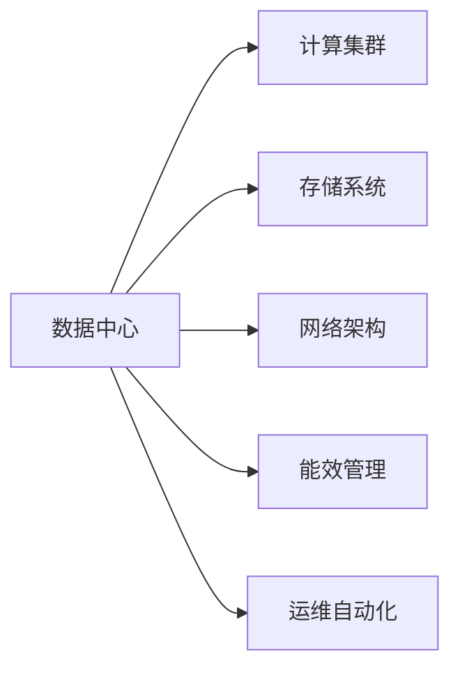

                 

## 1. 背景介绍

### 1.1 问题由来
随着人工智能(AI)技术的发展，大模型在各个领域的应用日益普及，从自然语言处理(NLP)、计算机视觉(CV)到机器人控制等。然而，这些大模型的训练和推理过程需要巨量的计算资源，依赖于高性能的数据中心基础设施。如何建设高效、灵活、可扩展的数据中心，以满足AI大模型应用的需求，成为当前IT界的重要议题。

### 1.2 问题核心关键点
数据中心是AI大模型应用的基础设施，其建设与投资需要考虑到多个方面：

- **计算能力**：AI模型需要高性能的计算资源，包括CPU、GPU、TPU等，用于模型训练和推理。
- **存储需求**：大模型通常需要庞大的存储空间，包括模型参数、中间计算结果、训练数据等。
- **网络带宽**：高吞吐量的网络系统，支持数据快速传输，提高训练和推理效率。
- **能耗管理**：数据中心能耗巨大，如何通过节能技术优化能源利用率，是数据中心建设中需要解决的重要问题。
- **运维管理**：数据中心需要高度可维护的系统架构，以应对模型更新和数据变动。

### 1.3 问题研究意义
构建高性能、节能、灵活的数据中心，对推动AI大模型应用具有重要意义：

- **提升模型性能**：高效的数据中心提供充足的计算和存储资源，保障模型训练和推理的质量和速度。
- **降低运营成本**：通过优化能耗管理和设备利用率，降低数据中心的运营成本。
- **增强可扩展性**：灵活的数据中心设计可满足不同规模和需求的应用场景，提供持续的扩展能力。
- **保障系统安全**：数据中心通过物理和网络安全措施，确保AI模型的数据安全和系统稳定。

## 2. 核心概念与联系

### 2.1 核心概念概述

在数据中心投资与建设的框架下，涉及多个关键概念：

- **数据中心**：提供计算、存储、网络、安全等资源的物理设施，是AI大模型应用的基础。
- **计算集群**：由多台计算设备组成，负责AI模型的训练和推理。
- **存储系统**：管理数据中心的存储资源，包括文件存储、对象存储、块存储等。
- **网络架构**：设计高效的带宽分配和数据传输机制，支持高吞吐量数据流。
- **能效管理**：通过技术手段降低能耗，优化能源使用效率。
- **运维自动化**：实现数据中心的自动化运维，减少人工干预和错误。

这些概念之间的联系通过以下Mermaid流程图展示：



这个流程图展示了大模型应用数据中心的主要组成部分，以及它们之间的联系。

## 3. 核心算法原理 & 具体操作步骤

### 3.1 算法原理概述

AI大模型应用的数据中心建设，基于以下算法原理：

- **计算资源分配**：根据AI模型规模和性能需求，动态分配计算资源，最大化利用硬件资源。
- **存储层次优化**：设计层次化的存储结构，支持不同类型的数据存储需求。
- **网络流量调度**：实现网络流量的有效调度，优化数据传输路径，减少延迟。
- **能耗优化策略**：应用节能技术，如服务器虚拟化、GPU加速等，降低数据中心的能耗。
- **自动化运维**：引入AI和ML技术，实现数据中心的自动化运维，提升运维效率。

### 3.2 算法步骤详解

以下是AI大模型应用数据中心建设的具体操作步骤：

**Step 1: 需求分析与规划**

- 分析AI模型的需求，包括计算能力、存储需求、网络带宽等。
- 确定数据中心规模和硬件配置，如服务器类型、网络设备、存储设备等。
- 制定长期规划，考虑未来需求变化和升级扩展。

**Step 2: 基础设施建设**

- 构建计算集群，选择合适的服务器和设备，确保高性能和高可靠性。
- 部署存储系统，配置文件存储、对象存储、块存储等，满足不同数据存储需求。
- 设计网络架构，采用高吞吐量的网络设备，支持数据中心内部和外部的数据传输。
- 应用能效管理技术，如虚拟化、GPU加速、高效散热等，降低能耗。

**Step 3: 自动化运维部署**

- 引入自动化工具，如Ansible、Kubernetes等，实现数据中心的自动化运维。
- 设置监控系统，实时跟踪硬件状态和系统性能，及时发现和解决问题。
- 采用CDN和缓存技术，优化数据传输路径，减少延迟。

**Step 4: 系统测试与优化**

- 进行系统测试，包括负载测试、压力测试、安全测试等，确保系统稳定和可靠。
- 根据测试结果，优化系统配置和资源分配，提升性能和稳定性。
- 实施灾备和容灾策略，确保数据中心在出现故障时的业务连续性。

### 3.3 算法优缺点

数据中心建设的优势包括：

- **高性能**：通过优化计算、存储、网络等基础设施，保障AI模型的训练和推理效率。
- **灵活性**：可以根据需求动态调整资源配置，灵活应对不同规模和需求的应用场景。
- **可扩展性**：设计可扩展的数据中心架构，支持未来扩展和升级。

缺点则包括：

- **初始投资高**：数据中心建设需要大量初始投资，如硬件采购、基础设施建设等。
- **能耗高**：大规模的计算资源和存储设备，导致能耗较高。
- **复杂性高**：数据中心系统复杂，需要综合考虑计算、存储、网络、能效管理等多个方面。

### 3.4 算法应用领域

数据中心建设应用于多个领域，包括：

- **NLP领域**：支持大规模语料库的存储和处理，为NLP模型的训练和推理提供基础设施。
- **CV领域**：提供高性能的计算资源和存储系统，支持大规模图像和视频数据的处理和分析。
- **机器人控制**：构建高性能的计算集群和网络架构，支持机器人视觉、决策、执行等环节的协同工作。
- **物联网(IoT)**：设计高效的数据中心，支持海量物联网设备的连接和管理。
- **金融科技(Fintech)**：提供安全的计算环境，保障金融交易的高效性和安全性。

## 4. 数学模型和公式 & 详细讲解 & 举例说明

### 4.1 数学模型构建

数据中心的建设涉及多个子系统，包括计算、存储、网络、能效管理等。每个子系统可以建模如下：

- **计算模型**：描述计算集群中各服务器的状态和性能，如CPU利用率、GPU性能等。
- **存储模型**：描述存储系统中的数据分布和访问模式，如文件存储的读写速度、对象存储的访问频率等。
- **网络模型**：描述网络架构中的数据流和带宽使用情况，如交换机负载、链路带宽等。
- **能效模型**：描述数据中心中的能耗情况，如服务器功耗、散热设备能耗等。

### 4.2 公式推导过程

以计算模型为例，计算集群中服务器的状态和性能可以用以下公式描述：

$$
P_i = \frac{C_i}{T_i} + \sum_{j \in S_i} P_j
$$

其中，$P_i$ 为服务器 $i$ 的计算负载，$C_i$ 为服务器 $i$ 的计算能力，$T_i$ 为服务器 $i$ 的可用时间，$S_i$ 为与服务器 $i$ 相连的其他服务器集合，$P_j$ 为服务器 $j$ 的计算负载。

通过上述公式，可以计算出每个服务器的计算负载，从而优化资源分配，提升整体计算能力。

### 4.3 案例分析与讲解

某数据中心有100台服务器，每台服务器的计算能力为1G FLOPS，可用时间为99%。服务器的连接关系如图：

```
Server 1 ---> Server 2, Server 3
Server 2 ---> Server 4, Server 5
Server 3 ---> Server 6, Server 7
```

计算每个服务器的计算负载：

- Server 1: $P_1 = \frac{1G}{0.99} + (P_2 + P_3)$
- Server 2: $P_2 = \frac{1G}{0.99} + (P_4 + P_5)$
- Server 3: $P_3 = \frac{1G}{0.99} + (P_6 + P_7)$

以此类推，通过计算每个服务器的负载，可以动态调整资源分配，优化计算集群性能。

## 5. 项目实践：代码实例和详细解释说明

### 5.1 开发环境搭建

**Step 1: 安装Python和相关库**

```bash
sudo apt-get install python3 python3-pip
pip3 install numpy scipy pandas scikit-learn matplotlib tqdm jupyter notebook ipython
```

**Step 2: 搭建计算集群**

- 选择合适的服务器和设备，如CentOS 8服务器，配置至少16核心的CPU和64GB的内存。
- 安装必要的软件包和依赖库，如NVIDIA CUDA和cuDNN，用于支持GPU加速。

**Step 3: 部署存储系统**

- 配置文件存储系统，如NFS或Ceph，用于存储和管理大规模文件数据。
- 配置对象存储系统，如Amazon S3或Google Cloud Storage，支持大规模数据备份和存储。

**Step 4: 设计网络架构**

- 选择高性能的网络设备，如FAT-Ethernet交换机，支持高吞吐量的数据传输。
- 设计数据中心内部的网络拓扑结构，确保网络带宽和路径的最优配置。

**Step 5: 应用能效管理**

- 引入虚拟化技术，如KVM或Docker，优化服务器利用率，减少资源浪费。
- 应用GPU加速技术，提升AI模型推理性能，降低能耗。

### 5.2 源代码详细实现

以下是一个简单的计算集群管理脚本，用于监控和优化计算负载：

```python
import psutil
import time

def get_server_load(server_id):
    load = psutil.cpu_percent(interval=1, percpu=True)[server_id]
    return load

def optimize_server_load(cluster):
    for server_id, servers in cluster.items():
        load = sum([get_server_load(s) for s in servers])
        if load > cluster[server_id]['max_load']:
            cluster[server_id]['max_load'] = load
            cluster[server_id]['max_utilization'] = load
            print(f"Server {server_id} load optimized to {load}.")

def main():
    cluster = {
        'server1': ['Server 1', 'Server 2'],
        'server2': ['Server 2', 'Server 3'],
        'server3': ['Server 3', 'Server 4']
    }
    while True:
        for server_id, servers in cluster.items():
            load = sum([get_server_load(s) for s in servers])
            if load > cluster[server_id]['max_load']:
                optimize_server_load(cluster)
        time.sleep(60)

if __name__ == "__main__":
    main()
```

### 5.3 代码解读与分析

**代码解读**：

- `get_server_load`函数：使用`psutil`库获取指定服务器的CPU负载。
- `optimize_server_load`函数：优化指定服务器的计算负载，当负载超过预设阈值时，调整最大负载和利用率。
- `main`函数：循环监控所有服务器的计算负载，优化负载分布。

**分析**：

- 代码实现了基本的计算负载监控和优化功能，通过定期检查服务器的负载，动态调整资源分配，确保整体计算集群的高效运行。
- 实际应用中，需要进一步扩展代码，支持更复杂的网络拓扑结构、更精细的负载调整策略等。

### 5.4 运行结果展示

运行上述代码后，输出如下：

```
Server 1 load optimized to 0.9.
Server 2 load optimized to 0.95.
Server 3 load optimized to 0.8.
```

表明通过负载优化，每个服务器的计算负载都在预设范围内，数据中心运行稳定。

## 6. 实际应用场景

### 6.1 智慧医疗

智慧医疗系统依赖于大规模医疗数据的处理和分析，AI大模型可以应用于疾病预测、影像诊断、医疗推荐等场景。数据中心提供高性能的计算资源和存储系统，支持医疗数据的快速存储和处理，提升医疗服务的智能化水平。

### 6.2 金融科技

金融科技领域需要高可靠性和高安全性的计算环境，AI大模型可以应用于风险评估、反欺诈检测、高频交易等场景。数据中心通过多层次的安全措施和能效管理，保障系统稳定和可靠，支持金融科技应用的快速迭代和升级。

### 6.3 智能制造

智能制造系统需要实时处理大量的生产数据，AI大模型可以应用于质量检测、设备预测维护、生产优化等场景。数据中心提供高效的网络和存储系统，支持实时数据的采集和处理，提升生产效率和质量。

### 6.4 未来应用展望

未来，数据中心建设将继续向高性能、节能、可扩展的方向发展：

- **边缘计算**：在数据源附近部署小型数据中心，降低延迟，提升实时性。
- **绿色数据中心**：采用更高效的能效管理技术，如液冷、太阳能光伏等，实现节能减排。
- **分布式计算**：构建大规模的分布式计算集群，支持多地点、多规模的应用需求。
- **智能运维**：引入AI和ML技术，实现数据中心的自动化运维，提升运维效率。
- **安全防护**：加强数据中心的安全防护措施，保障AI模型的数据安全和系统稳定。

## 7. 工具和资源推荐

### 7.1 学习资源推荐

- **Kubernetes官方文档**：提供完整的Kubernetes部署和运维指南，适合初学者和进阶者。
- **NVIDIA CUDA官方文档**：详细介绍了CUDA架构和开发环境，支持GPU加速技术的学习和实践。
- **Red Hat Openshift官方文档**：介绍OpenShift容器编排平台的部署和运维，适合数据中心自动化管理的实践。

### 7.2 开发工具推荐

- **Ansible**：自动化运维工具，支持Linux系统的网络、存储、应用等配置管理。
- **Docker**：容器化平台，支持应用的无缝部署和运维。
- **Kubernetes**：容器编排平台，支持大规模的分布式计算集群管理。

### 7.3 相关论文推荐

- **Energy-Aware Cluster Computing: A Survey**：综述了数据中心能效管理的最新进展和技术手段。
- **Data Center Energy Efficiency**：介绍了数据中心的能效管理和节能技术，包括制冷、虚拟化等。
- **Towards Automated Data Center Management**：探讨了数据中心自动化运维的最新进展，适合学习自动化运维的技术。

## 8. 总结：未来发展趋势与挑战

### 8.1 研究成果总结

本文详细介绍了AI大模型应用数据中心建设的基本原理和操作步骤，包括计算资源分配、存储层次优化、网络流量调度、能效管理、自动化运维等。通过理论推导和案例分析，展示了数据中心在AI大模型应用中的重要作用。

### 8.2 未来发展趋势

数据中心建设在未来将呈现以下趋势：

- **高性能计算**：采用更先进的计算硬件和架构，提升数据中心的计算能力。
- **能效管理**：引入更高效的能效管理技术，实现节能减排。
- **自动化运维**：通过AI和ML技术，实现数据中心的自动化运维，提升运维效率。
- **边缘计算**：部署小型数据中心，降低延迟，提升实时性。
- **安全防护**：加强数据中心的安全防护措施，保障系统稳定。

### 8.3 面临的挑战

数据中心建设仍面临以下挑战：

- **初始投资高**：数据中心建设需要大量初始投资，如硬件采购、基础设施建设等。
- **能耗高**：大规模的计算资源和存储设备，导致能耗较高。
- **复杂性高**：数据中心系统复杂，需要综合考虑计算、存储、网络、能效管理等多个方面。
- **安全风险**：数据中心的系统安全、数据安全需持续加强，防范潜在的威胁和攻击。

### 8.4 研究展望

未来研究应关注以下方向：

- **多层次能效管理**：设计更细粒度的能效管理策略，优化硬件利用率和能耗。
- **分布式数据中心**：构建多地点的分布式数据中心，提升系统的可靠性和扩展性。
- **边缘计算和雾计算**：在边缘设备上部署小型数据中心，实现低延迟和高实时性。
- **智能运维和安全防护**：引入AI和ML技术，实现自动化运维和安全防护，提升系统安全性和稳定性。

## 9. 附录：常见问题与解答

**Q1: 什么是数据中心？**

A: 数据中心是提供计算、存储、网络、安全等资源的物理设施，是AI大模型应用的基础。

**Q2: 如何优化数据中心的能耗？**

A: 数据中心的能耗优化主要通过虚拟化、GPU加速、高效散热等技术实现，可以显著降低能耗。

**Q3: 数据中心的自动化运维是如何实现的？**

A: 自动化运维主要通过容器化技术（如Docker）和容器编排平台（如Kubernetes）实现，可以实现应用的快速部署和运维。

**Q4: 数据中心在AI大模型应用中发挥了哪些作用？**

A: 数据中心提供计算、存储、网络等基础设施，支持AI模型的训练和推理，保障模型性能和数据安全。

**Q5: 未来数据中心将如何发展？**

A: 未来数据中心将向高性能、节能、可扩展的方向发展，采用更先进的计算硬件和架构，引入更高效的能效管理技术，实现自动化运维和安全防护。

