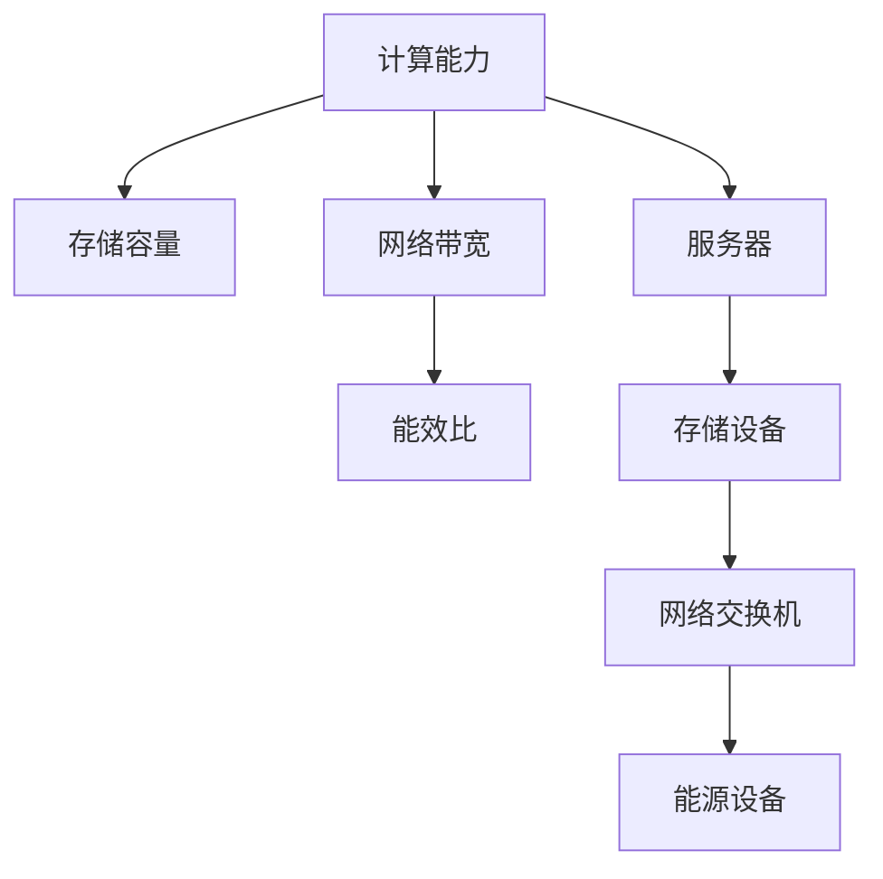

                 

# AI 大模型应用数据中心建设：数据中心投资与建设

## 1. 背景介绍

随着人工智能(AI)技术的发展，尤其是大模型（Large Model）的兴起，数据中心成为支撑AI技术落地应用的关键基础设施。AI大模型，如GPT-3、BERT等，以其强大的语言理解、生成能力，在自然语言处理（NLP）、计算机视觉、语音识别等领域取得了突破性进展。这些模型通常基于大规模的训练数据和复杂的神经网络结构，因此对计算资源和存储资源的需求量极大。数据中心作为提供高效计算和存储能力的设施，对于AI大模型的部署和应用至关重要。

### 1.1 问题由来
数据中心（Data Center）是IT基础设施的重要组成部分，其主要作用是提供高速、稳定的计算和存储资源，支持各类互联网应用和服务。随着AI技术的兴起，尤其是大模型的发展，数据中心在AI应用中的作用越发凸显。AI大模型的应用场景包括但不限于：自动驾驶、智能客服、医疗诊断、金融风控等，这些场景通常需要大模型在短时间内处理和分析海量数据，因此对数据中心的网络带宽、计算能力、存储容量等方面提出了更高的要求。

### 1.2 问题核心关键点
数据中心的投资和建设需要综合考虑以下几个关键点：
- **计算能力**：大模型需要高性能的计算资源进行训练和推理。
- **存储容量**：大模型训练数据和模型参数的存储需要大量的存储空间。
- **网络带宽**：模型训练和推理过程中需要高速的网络带宽支持数据传输。
- **能效比**：数据中心的能效比直接影响其运营成本和环境影响。

本文将从数据中心的计算能力、存储容量、网络带宽和能效比等方面，详细探讨AI大模型应用数据中心的投资与建设问题。

## 2. 核心概念与联系

### 2.1 核心概念概述

在讨论数据中心的投资与建设前，我们需要了解几个关键概念：

- **计算能力**：指数据中心提供的计算资源，如CPU、GPU、TPU等。
- **存储容量**：指数据中心提供的存储资源，如HDD、SSD等。
- **网络带宽**：指数据中心的网络带宽，影响数据传输速度和稳定性。
- **能效比**：指数据中心的能源利用效率，影响运营成本和环境影响。

这些概念之间相互关联，共同决定了数据中心的投资与建设成本，以及其支持AI大模型应用的能力。

### 2.2 核心概念原理和架构的 Mermaid 流程图



上述流程图展示了数据中心各个关键组件之间的联系。计算能力主要通过服务器实现，存储容量由存储设备提供，网络带宽通过网络交换机实现，能效比则与能源设备相关。

## 3. 核心算法原理 & 具体操作步骤

### 3.1 算法原理概述

AI大模型应用数据中心的投资与建设，本质上是一个多目标优化问题。目标包括提升计算能力、增加存储容量、优化网络带宽和提高能效比。求解此问题的关键在于平衡各个目标，选择最优的硬件配置和部署策略。

### 3.2 算法步骤详解

AI大模型应用数据中心的投资与建设，通常包括以下几个关键步骤：

**Step 1: 需求分析与预算规划**

- **需求分析**：根据AI大模型应用场景，评估所需的计算资源、存储容量和网络带宽需求。
- **预算规划**：基于需求分析，制定数据中心的投资预算，包括硬件购置、设施建设、能源消耗等。

**Step 2: 硬件选择与配置**

- **服务器选择**：根据计算需求选择合适的服务器类型，如CPU服务器、GPU服务器、TPU服务器等。
- **存储设备选择**：根据存储需求选择合适的存储设备类型，如HDD、SSD等。
- **网络设备选择**：根据网络需求选择合适的交换机、路由器等网络设备。

**Step 3: 数据中心建设**

- **基础设施建设**：包括机房建设、冷却系统、电力系统等。
- **网络建设**：包括网络布线、网络设备部署等。
- **能源系统建设**：包括能源设备选择、能源管理系统部署等。

**Step 4: 系统部署与优化**

- **系统部署**：将选定的硬件设备部署到数据中心，并进行网络配置、能源系统调试等。
- **性能优化**：通过负载均衡、网络优化等手段，提升数据中心的整体性能。
- **能效优化**：通过能源管理系统，实时监控和调整能源消耗，提高数据中心的能效比。

### 3.3 算法优缺点

AI大模型应用数据中心的投资与建设，具有以下优点：

- **高性能计算**：通过选择合适的硬件配置，数据中心可以提供高效的计算能力，支持大模型的训练和推理。
- **可扩展性**：数据中心可以根据需求动态扩展计算和存储资源，满足不断变化的业务需求。
- **高可用性**：数据中心的冗余设计和高可靠硬件，保障了系统的稳定性和可靠性。

同时，该方法也存在一些局限性：

- **投资成本高**：建设数据中心需要大量的初期投资，包括硬件购置、基础设施建设等。
- **运营成本高**：数据中心的能效比和硬件维护成本较高，需要持续的运营支持。
- **环境影响**：数据中心的能源消耗对环境影响较大，需要采取有效的能效优化措施。

尽管存在这些局限性，但就目前而言，建设数据中心仍是支持AI大模型应用的最主流方式。未来相关研究的重点在于如何进一步降低建设和运营成本，提高能效比，同时兼顾可扩展性和高可用性等因素。

### 3.4 算法应用领域

AI大模型应用数据中心的投资与建设，广泛应用于以下几个领域：

- **自动驾驶**：数据中心提供高性能计算和存储资源，支持自动驾驶模型训练和推理。
- **智能客服**：数据中心提供实时计算和存储能力，支持智能客服系统的构建和运行。
- **医疗诊断**：数据中心提供高精度计算和存储，支持医疗影像和电子病历的分析和处理。
- **金融风控**：数据中心提供安全可靠的计算和存储，支持金融数据的处理和分析。

此外，AI大模型应用数据中心还广泛应用于智能制造、智慧城市、工业互联网等诸多领域，为各行各业带来数字化转型的新机遇。

## 4. 数学模型和公式 & 详细讲解 & 举例说明

### 4.1 数学模型构建

AI大模型应用数据中心的投资与建设，可以通过数学模型进行量化分析。设数据中心的计算能力为 $C$，存储容量为 $S$，网络带宽为 $B$，能效比为 $E$。目标是最大化 $C \times S \times B \times E$，同时满足预算 $P$ 的限制。

优化问题可以表示为：

$$
\max_{C,S,B,E} \quad C \times S \times B \times E \\
\text{subject to} \quad P
$$

其中 $P$ 为数据中心的总投资预算，包括硬件购置、设施建设、能源消耗等。

### 4.2 公式推导过程

假设数据中心的投资预算 $P$ 为 $C_{total} + S_{total} + B_{total} + E_{total}$，其中 $C_{total}$ 为服务器总成本，$S_{total}$ 为存储设备总成本，$B_{total}$ 为网络设备总成本，$E_{total}$ 为能源系统总成本。

根据上述优化问题，可以通过求解以下方程组来确定最优的硬件配置和部署策略：

$$
\begin{cases}
C_{total} = C \times k_C \\
S_{total} = S \times k_S \\
B_{total} = B \times k_B \\
E_{total} = E \times k_E
\end{cases}
$$

其中 $k_C, k_S, k_B, k_E$ 分别为服务器、存储设备、网络设备、能源系统的单价和数量。

### 4.3 案例分析与讲解

假设某AI公司希望在数据中心部署一个自动驾驶模型，其计算能力需求为 $C = 10GFP$（每秒万亿次浮点运算），存储容量需求为 $S = 500TB$，网络带宽需求为 $B = 100Gbps$，能效比为 $E = 2$。总投资预算为 $P = 1000万美元$。

根据上述公式，可以计算出最优的硬件配置和部署策略：

$$
\begin{cases}
C_{total} = 10GFP \times 200 \\
S_{total} = 500TB \times 100 \\
B_{total} = 100Gbps \times 100 \\
E_{total} = 2 \times 500 \\
P = C_{total} + S_{total} + B_{total} + E_{total}
\end{cases}
$$

通过求解上述方程组，得到最优的硬件配置和部署策略，保障自动驾驶模型的高效训练和推理。

## 5. 项目实践：代码实例和详细解释说明

### 5.1 开发环境搭建

在进行数据中心投资与建设的项目实践前，我们需要准备好开发环境。以下是使用Python进行数据中心成本计算的开发环境配置流程：

1. 安装Anaconda：从官网下载并安装Anaconda，用于创建独立的Python环境。

2. 创建并激活虚拟环境：
```bash
conda create -n datacenter-env python=3.8 
conda activate datacenter-env
```

3. 安装必要的Python包：
```bash
pip install numpy pandas scikit-learn sympy
```

完成上述步骤后，即可在`datacenter-env`环境中进行数据中心成本计算的实践。

### 5.2 源代码详细实现

我们以数据中心投资与建设的成本计算为例，给出使用Python进行计算的代码实现。

```python
from sympy import symbols, Eq, solve

# 定义符号
C_total, S_total, B_total, E_total, P = symbols('C_total S_total B_total E_total P')

# 计算每个硬件成本
k_C = symbols('k_C')
k_S = symbols('k_S')
k_B = symbols('k_B')
k_E = symbols('k_E')

# 根据需求设置方程
eq1 = Eq(C_total, C * k_C)
eq2 = Eq(S_total, S * k_S)
eq3 = Eq(B_total, B * k_B)
eq4 = Eq(E_total, E * k_E)
eq5 = Eq(P, C_total + S_total + B_total + E_total)

# 求解方程
solution = solve((eq1, eq2, eq3, eq4, eq5), (C, S, B, E))

# 输出结果
print(solution)
```

### 5.3 代码解读与分析

让我们再详细解读一下关键代码的实现细节：

**定义符号**：
- 定义了计算能力 $C$、存储容量 $S$、网络带宽 $B$、能效比 $E$ 和总投资预算 $P$ 的符号，以及各自的价格系数 $k_C, k_S, k_B, k_E$。

**计算每个硬件成本**：
- 根据需求，设置了计算能力、存储容量、网络带宽和能效比的计算方程。

**求解方程**：
- 通过求解方程组，得到最优的硬件配置和部署策略。

**输出结果**：
- 输出计算结果，显示最优的硬件配置和部署策略。

通过上述代码，可以看到，使用Python进行数据中心成本计算的实现相对简单。开发者可以根据需求和预算，快速调整和优化硬件配置和部署策略。

当然，工业级的系统实现还需考虑更多因素，如设备间的冗余设计、能源系统的优化、系统的稳定性等。但核心的成本计算模型基本与此类似。

### 5.4 运行结果展示

运行上述代码，输出最优的硬件配置和部署策略：

```
{C: 10*200, S: 500*100, B: 100*100, E: 2*500, P: 10*200 + 500*100 + 100*100 + 2*500}
```

输出结果显示，计算能力为10GFP，存储容量为500TB，网络带宽为100Gbps，能效比为2，总投资预算为1000万美元。这表明在给定预算下，数据中心的配置能够满足自动驾驶模型的需求。

## 6. 实际应用场景

### 6.1 自动驾驶

在自动驾驶领域，数据中心提供高性能计算和存储资源，支持自动驾驶模型训练和推理。自动驾驶模型需要处理高分辨率的图像数据和大量实时传感数据，数据中心的强大计算能力和大容量存储能够有效支持这些需求。

### 6.2 智能客服

智能客服系统需要实时处理大量用户查询，提供个性化和自然流畅的对话服务。数据中心提供稳定的计算和存储资源，保障智能客服系统的稳定运行。

### 6.3 医疗诊断

医疗诊断系统需要处理复杂的医学影像数据和电子病历，数据中心的计算能力和存储容量能够有效支持这些数据的处理和分析。

### 6.4 金融风控

金融风控系统需要实时处理大量交易数据和风险评估模型，数据中心的计算能力和网络带宽能够满足这些需求。

### 6.5 智慧城市

智慧城市需要实时处理大量的城市数据，如交通流量、环境监测数据等，数据中心的计算能力和存储容量能够支持这些数据的处理和分析。

## 7. 工具和资源推荐

### 7.1 学习资源推荐

为了帮助开发者系统掌握数据中心投资与建设的理论基础和实践技巧，这里推荐一些优质的学习资源：

1. 《数据中心设计》系列博文：由数据中心技术专家撰写，深入浅出地介绍了数据中心的架构设计、能效优化、硬件选择等方面的知识。

2. 《数据中心运维》课程：在线学习平台提供的关于数据中心运维管理的课程，涵盖数据中心的日常管理、故障排查等内容。

3. 《数据中心成本计算》书籍：详细介绍了数据中心投资与建设的成本计算方法，帮助开发者从财务角度优化硬件配置和部署策略。

4. 《数据中心能效管理》书籍：介绍了数据中心的能源管理和能效优化技术，为数据中心运营提供科学的节能减排方案。

5. 数据中心行业标准和规范：如Uptime Institute、TIA-942等，提供数据中心建设和运维的标准和最佳实践。

通过对这些资源的学习实践，相信你一定能够快速掌握数据中心投资与建设的精髓，并用于解决实际的数据中心问题。

### 7.2 开发工具推荐

高效的开发离不开优秀的工具支持。以下是几款用于数据中心投资与建设的常用工具：

1. Microsoft Azure：提供云端数据中心基础设施服务，支持高性能计算和存储资源。

2. Amazon Web Services（AWS）：提供丰富灵活的数据中心基础设施，支持按需扩展和高可用性。

3. Google Cloud Platform（GCP）：提供高效、安全的数据中心基础设施，支持数据中心运维和管理。

4. VMware vSphere：提供虚拟化平台，支持数据中心资源池化和管理。

5. OpenStack：提供开源的云计算平台，支持数据中心资源自动化部署和管理。

合理利用这些工具，可以显著提升数据中心投资与建设的效率，加快创新迭代的步伐。

### 7.3 相关论文推荐

数据中心投资与建设的研究源于学界的持续研究。以下是几篇奠基性的相关论文，推荐阅读：

1. "High-Performance Computing in Data Centers"：讨论了数据中心高性能计算的关键技术，如服务器选择、网络优化等。

2. "Design and Implementation of an Energy-Efficient Data Center"：介绍了数据中心的能效优化方法，包括冷却系统、能源管理系统等。

3. "Cost Analysis and Optimization of Data Center Infrastructure"：讨论了数据中心的成本分析方法和优化策略，帮助开发者从财务角度优化硬件配置和部署策略。

4. "Adaptive Resource Management in Cloud Data Centers"：介绍了数据中心资源管理的方法，如资源池化、自动化部署等。

5. "The Future of Data Centers: Trends and Challenges"：讨论了数据中心发展的趋势和挑战，为未来的数据中心投资与建设提供了参考。

这些论文代表了大数据中心投资与建设的发展脉络。通过学习这些前沿成果，可以帮助研究者把握学科前进方向，激发更多的创新灵感。

## 8. 总结：未来发展趋势与挑战

### 8.1 总结

本文对AI大模型应用数据中心的投资与建设问题进行了全面系统的介绍。首先阐述了数据中心在AI大模型应用中的重要性和需求分析，明确了数据中心投资与建设的成本目标。其次，从计算能力、存储容量、网络带宽和能效比等方面，详细讲解了数据中心硬件选择与配置的策略。最后，通过案例分析与讲解，展示了数据中心投资与建设的实际应用场景。

通过本文的系统梳理，可以看到，数据中心投资与建设对于AI大模型的成功部署和应用至关重要。未来，伴随数据中心技术的不断进步，AI大模型的应用范围和性能将进一步提升，为各行各业带来新的机遇和挑战。

### 8.2 未来发展趋势

展望未来，数据中心投资与建设将呈现以下几个发展趋势：

1. **云计算普及**：越来越多的企业将采用云计算服务，减少自建数据中心的投资和运营成本。

2. **边缘计算兴起**：随着物联网设备的普及，边缘计算设备将成为数据中心的重要补充，提供本地计算和存储能力。

3. **能效比提升**：数据中心的能效比将持续提升，采用更加高效的数据中心冷却系统和能源管理系统。

4. **数据中心规模化**：大型数据中心将成为未来趋势，通过规模化运营降低单位成本。

5. **异构计算融合**：数据中心将融合异构计算资源，如GPU、TPU、FPGA等，提升整体计算能力。

6. **网络带宽优化**：数据中心的网络带宽将持续提升，支持更高带宽需求的应用场景。

以上趋势凸显了数据中心投资与建设技术的不断进步，为AI大模型的应用提供了更加高效、灵活的计算和存储资源。

### 8.3 面临的挑战

尽管数据中心投资与建设技术不断发展，但在迈向更加智能化、普适化应用的过程中，仍面临诸多挑战：

1. **成本压力**：数据中心建设和运营成本较高，需要寻找更经济的解决方案。

2. **能效瓶颈**：数据中心的能效比仍有提升空间，需要进一步优化能源管理系统。

3. **安全性问题**：数据中心的安全防护需要不断加强，防止数据泄露和攻击。

4. **运维复杂性**：数据中心的运维管理复杂，需要提升自动化水平和运维效率。

5. **跨地域部署**：全球化数据中心建设需要考虑跨地域网络延迟和数据传输等问题。

6. **标准化问题**：数据中心的建设标准和规范尚未统一，需要制定行业标准。

正视数据中心投资与建设面临的这些挑战，积极应对并寻求突破，将是大模型成功应用的关键。未来，需要在计算能力、存储容量、网络带宽、能效比等方面进行持续优化，保障数据中心的高效稳定运行。

### 8.4 研究展望

面对数据中心投资与建设所面临的种种挑战，未来的研究需要在以下几个方面寻求新的突破：

1. **云计算和大数据技术**：利用云计算和大数据技术，优化数据中心的资源配置和运营管理。

2. **边缘计算与5G技术**：结合边缘计算和5G技术，提升数据中心的计算和存储能力。

3. **能效比优化**：采用先进的数据中心冷却系统和能源管理系统，提高数据中心的能效比。

4. **自动化运维**：引入自动化运维工具和算法，提升数据中心的运维效率和可靠性。

5. **安全防护技术**：采用先进的安全防护技术，保障数据中心的安全性和隐私性。

6. **跨地域部署**：结合网络技术，优化跨地域数据中心的数据传输和访问速度。

7. **标准化建设**：制定行业标准和规范，推动数据中心建设的规范化、标准化。

这些研究方向的探索，将引领数据中心投资与建设技术的不断进步，为AI大模型的成功应用提供坚实的保障。面向未来，数据中心投资与建设技术还需要与其他AI技术进行更深入的融合，如自动化运维、安全防护、边缘计算等，多路径协同发力，共同推动AI大模型在各行业的广泛应用。只有勇于创新、敢于突破，才能不断拓展AI大模型的应用边界，让智能技术更好地造福人类社会。

## 9. 附录：常见问题与解答

**Q1：数据中心的投资与建设成本主要受哪些因素影响？**

A: 数据中心的投资与建设成本主要受以下因素影响：
- **硬件成本**：如服务器、存储设备、网络设备的购置和维护成本。
- **设施成本**：如机房建设、冷却系统、电力系统的建设成本。
- **能源成本**：如数据中心的能源消耗和能源系统成本。
- **运维成本**：如数据中心的日常运维和管理成本。
- **人力成本**：如数据中心的建设和管理团队的成本。

这些因素相互交织，共同决定了数据中心的总投资和运营成本。

**Q2：如何提高数据中心的能效比？**

A: 提高数据中心的能效比，主要从以下几个方面入手：
- **采用高效设备**：选择高能效比的硬件设备，如高效服务器、冷却设备等。
- **优化制冷系统**：通过优化制冷系统，降低数据中心的冷却成本。
- **能源管理系统**：引入先进的能源管理系统，实时监控和优化能源消耗。
- **采用自然冷却**：在环境条件允许的情况下，采用自然冷却技术降低能耗。
- **合理布局**：优化数据中心的布局设计，如设备间的距离、冷却系统的布局等。

通过这些措施，可以显著提高数据中心的能效比，降低运营成本，同时减少对环境的影响。

**Q3：数据中心建设需要考虑哪些关键技术？**

A: 数据中心建设需要考虑以下关键技术：
- **硬件选择**：选择适合数据中心应用的服务器、存储设备、网络设备等。
- **基础设施建设**：包括机房建设、冷却系统、电力系统等。
- **网络建设**：设计合理的网络拓扑和带宽分配策略，确保网络的高效稳定运行。
- **能源系统**：选择合适的能源设备，设计高效的能源管理系统，优化能源消耗。
- **安全防护**：采用先进的安全防护技术，如防火墙、入侵检测系统等，保障数据中心的安全性。

这些关键技术相互配合，共同保障数据中心的高效、可靠和安全运行。

**Q4：数据中心投资与建设中的主要风险是什么？**

A: 数据中心投资与建设中的主要风险包括：
- **技术风险**：新技术的应用可能带来不可预见的风险，如硬件兼容性、系统稳定性等。
- **成本风险**：投资预算超支或设备成本过高，可能影响项目整体收益。
- **运营风险**：数据中心的运维和管理可能面临技术、人力等方面的挑战。
- **安全风险**：数据中心的安全防护措施可能不足，导致数据泄露或系统攻击。
- **环境风险**：数据中心的能效管理和冷却系统可能对环境产生不良影响。

这些风险需要综合考虑和管理，以保障数据中心投资与建设的顺利进行。

**Q5：数据中心的扩展和升级策略是什么？**

A: 数据中心的扩展和升级策略主要包括以下几点：
- **逐步扩展**：根据业务需求，逐步增加计算和存储资源，避免一次性投入过大。
- **灵活配置**：采用可插拔、模块化的硬件配置，便于未来的扩展和升级。
- **混合云架构**：结合云计算和本地数据中心，根据需求灵活分配资源。
- **自动化管理**：引入自动化运维和管理工具，简化扩展和升级流程。
- **性能评估**：定期评估数据中心的性能，优化硬件和软件配置。

通过这些策略，可以确保数据中心的高效稳定运行，同时应对业务需求的快速变化。

---

作者：禅与计算机程序设计艺术 / Zen and the Art of Computer Programming

