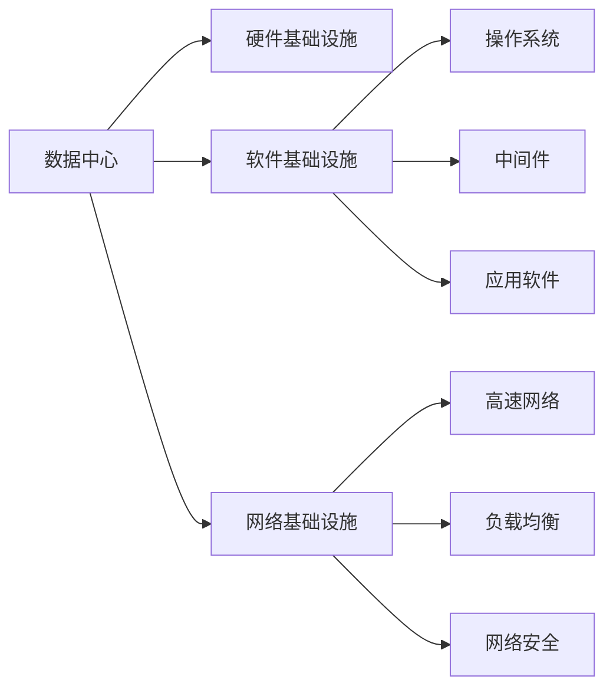

                 

# AI 大模型应用数据中心建设：数据中心投资与建设

> 关键词：人工智能(AI), 数据中心, 大数据存储, 数据中心投资, 数据中心建设, 硬件基础设施, 软件基础设施, 网络基础设施, 安全性与可靠性, 能效管理

## 1. 背景介绍

### 1.1 问题由来

随着人工智能（AI）技术的迅猛发展，特别是大模型（如GPT-3、BERT等）的崛起，数据中心（Data Center, DC）在AI应用中扮演了至关重要的角色。数据中心不仅是计算和存储的场所，更是数据流通和处理的枢纽。然而，数据中心的投资和建设是一项复杂的系统工程，涉及硬件基础设施、软件基础设施、网络基础设施等多个方面。本文将详细探讨AI大模型应用下数据中心的投资与建设问题，力求为相关从业者提供全面的技术指导。

### 1.2 问题核心关键点

数据中心的投资与建设是AI大模型应用的关键环节，直接影响AI应用的性能和可靠性。核心关键点包括：

1. **硬件基础设施**：包括服务器、存储、网络设备等，是大模型训练和推理的基础。
2. **软件基础设施**：包括操作系统、中间件、应用软件等，确保数据中心高效运行。
3. **网络基础设施**：包括高速网络、负载均衡、网络安全等，保证数据流通的稳定性和安全性。
4. **安全性与可靠性**：数据中心的安全性和可靠性是大模型应用的核心保障。
5. **能效管理**：数据中心能耗高，有效的能效管理对降低成本、保护环境至关重要。

### 1.3 问题研究意义

建设高效、可靠、绿色、智能的数据中心，对于推动AI技术在各行业的广泛应用具有重要意义：

1. 降低AI应用成本。高效的硬件和软件配置可以显著降低AI应用的计算和存储成本。
2. 提高AI应用性能。可靠的网络和硬件设施能保障AI模型的稳定性和高效性。
3. 增强数据中心的安全性。严密的安全措施可以防范数据泄露、网络攻击等风险。
4. 优化能效管理。有效的能效管理有助于降低数据中心的运营成本，保护环境。
5. 支持智能化管理。智能化基础设施能提升数据中心的管理效率和运维水平。

## 2. 核心概念与联系

### 2.1 核心概念概述

为更好地理解AI大模型应用下数据中心的投资与建设，本节将介绍几个关键概念：

- **数据中心（Data Center, DC）**：提供数据处理和存储功能的物理设施，通常包含服务器、网络设备、存储系统等。
- **AI大模型**：如GPT-3、BERT等，通过大规模无标签数据训练，具备强大的语言理解与生成能力。
- **硬件基础设施**：包括服务器、存储设备、网络设备等，是大模型应用的基础。
- **软件基础设施**：包括操作系统、中间件、应用软件等，确保数据中心高效运行。
- **网络基础设施**：包括高速网络、负载均衡、网络安全等，保障数据流通的稳定性和安全性。

这些概念之间的逻辑关系可以通过以下Mermaid流程图来展示：



这个流程图展示了大模型应用下数据中心的几个核心概念及其相互关系：

1. 数据中心是大模型应用的基础设施。
2. 硬件基础设施、软件基础设施和网络基础设施是大模型应用的基础支撑。
3. 软件基础设施中的操作系统、中间件和应用软件，确保数据中心的高效运行。
4. 网络基础设施中的高速网络、负载均衡和网络安全，保障数据流通的稳定性和安全性。

## 3. 核心算法原理 & 具体操作步骤
### 3.1 算法原理概述

AI大模型应用下的数据中心投资与建设，本质上是一个综合性的系统工程。其核心思想是：通过合理配置硬件、软件和网络基础设施，优化能效管理，建设高效、可靠、绿色、智能的数据中心，从而支持AI大模型的训练和推理。

形式化地，假设目标数据中心为 $DC$，硬件基础设施为 $H$，软件基础设施为 $S$，网络基础设施为 $N$。目标是大规模部署AI大模型，优化目标函数为：

$$
\min_{H, S, N} C(H, S, N) + \lambda P(H, S, N) + \eta C_{\text{env}}(H, S, N)
$$

其中 $C(H, S, N)$ 为目标数据中心的总成本，$P(H, S, N)$ 为数据中心的性能指标（如响应时间、吞吐量等），$C_{\text{env}}(H, S, N)$ 为数据中心的能效指标。$\lambda$ 和 $\eta$ 分别为性能和能效的权重系数。

### 3.2 算法步骤详解

AI大模型应用下数据中心的投资与建设，一般包括以下几个关键步骤：

**Step 1: 需求分析与规划**

- 明确AI应用场景和需求，如模型的规模、计算需求、存储需求、网络带宽等。
- 进行成本收益分析，确定预算范围。
- 考虑业务连续性和灾难恢复能力，规划数据中心的冗余和备份方案。

**Step 2: 硬件基础设施选择与部署**

- 选择适当的服务器、存储设备、网络设备等硬件设施，根据需求确定性能指标。
- 部署硬件设施，进行初始化配置和调试。

**Step 3: 软件基础设施配置与优化**

- 安装并配置操作系统、中间件、应用软件等。
- 优化软件配置，确保与硬件设施兼容，提升系统性能。

**Step 4: 网络基础设施建设与优化**

- 搭建高速网络，部署负载均衡、防火墙等网络设备。
- 优化网络配置，确保数据流通稳定性和安全性。

**Step 5: 能效管理与优化**

- 实施能效管理策略，如关闭不必要的服务器、使用高效电源等。
- 监测能效指标，调整硬件配置以优化能效。

**Step 6: 安全与可靠性保障**

- 配置网络安全设备，如防火墙、入侵检测系统等。
- 定期进行安全审计，更新安全策略，保障数据中心的安全性。

**Step 7: 系统测试与评估**

- 对数据中心进行全面测试，验证硬件、软件和网络设施的性能和可靠性。
- 收集反馈，进行调整和优化。

**Step 8: 运维与持续改进**

- 建立运维管理体系，进行日常监控和维护。
- 根据业务需求和数据中心的运行情况，持续改进硬件和软件配置。

### 3.3 算法优缺点

AI大模型应用下数据中心的投资与建设，具有以下优点：

1. 支持大规模AI模型应用。通过合理的硬件配置，可以高效地支持大模型的训练和推理。
2. 提高数据中心的管理效率。智能化的基础设施和运维系统可以提升数据中心的运行效率和稳定性。
3. 降低运营成本。通过优化能效管理，可以显著降低数据中心的能源消耗和运营成本。
4. 提升数据中心的可靠性。通过冗余和备份方案，可以增强数据中心的安全性和业务连续性。

同时，该方法也存在一定的局限性：

1. 初始投资高。建设数据中心需要大量的资金投入，风险较高。
2. 技术复杂度高。数据中心建设涉及硬件、软件和网络等多个领域，技术要求高。
3. 更新和维护成本高。数据中心的硬件和软件需要定期更新和维护，成本较高。
4. 数据安全风险。数据中心存储和处理大量敏感数据，数据泄露和网络攻击的风险较大。

尽管存在这些局限性，但就目前而言，AI大模型应用下数据中心的投资与建设，仍是支持AI技术落地应用的重要手段。未来相关研究的重点在于如何进一步降低建设成本，提高数据中心的安全性和能效管理水平，同时兼顾智能性和可持续性等因素。

### 3.4 算法应用领域

AI大模型应用下的数据中心建设方法，在多个领域得到了广泛应用：

1. **云计算**：云服务商通过建设高效数据中心，提供大模型训练和推理服务，满足各行业的AI应用需求。
2. **科研机构**：科研机构利用大模型进行学术研究，建设数据中心支持高性能计算和存储需求。
3. **企业内部IT**：企业内部IT部门通过建设数据中心，支持企业的AI项目开发和应用。
4. **金融服务**：金融机构利用大模型进行风险评估、欺诈检测等，建设数据中心保障数据安全性和业务连续性。
5. **医疗健康**：医疗机构利用大模型进行疾病诊断、医学影像分析等，建设数据中心支持高精度计算。

除了上述这些典型应用外，AI大模型应用下的数据中心建设方法，也在智能交通、智慧城市、自动驾驶等领域得到了广泛应用，推动了多个行业的数字化转型升级。

## 4. 数学模型和公式 & 详细讲解  
### 4.1 数学模型构建

本节将使用数学语言对AI大模型应用下数据中心的投资与建设过程进行更加严格的刻画。

假设目标数据中心为 $DC$，硬件基础设施为 $H$，软件基础设施为 $S$，网络基础设施为 $N$。目标是大规模部署AI大模型，优化目标函数为：

$$
\min_{H, S, N} C(H, S, N) + \lambda P(H, S, N) + \eta C_{\text{env}}(H, S, N)
$$

其中 $C(H, S, N)$ 为目标数据中心的总成本，$P(H, S, N)$ 为数据中心的性能指标（如响应时间、吞吐量等），$C_{\text{env}}(H, S, N)$ 为数据中心的能效指标。$\lambda$ 和 $\eta$ 分别为性能和能效的权重系数。

### 4.2 公式推导过程

以响应时间为性能指标进行公式推导，假设数据中心有 $M$ 台服务器，每台服务器的响应时间为 $t_m$，则总响应时间为：

$$
T = \sum_{m=1}^M t_m
$$

假设每台服务器的处理能力为 $p_m$，总处理能力为：

$$
P = \sum_{m=1}^M p_m
$$

则响应时间 $t_m$ 可以表示为：

$$
t_m = \frac{L_m}{p_m}
$$

其中 $L_m$ 为服务器 $m$ 的处理任务量。则总响应时间可以表示为：

$$
T = \sum_{m=1}^M \frac{L_m}{p_m} = \frac{\sum_{m=1}^M L_m}{P}
$$

响应时间越短，数据中心的性能越好。优化目标函数为：

$$
\min_{H, S, N} C(H, S, N) + \lambda T + \eta C_{\text{env}}(H, S, N)
$$

### 4.3 案例分析与讲解

以某金融机构的AI模型训练数据中心为例，进行案例分析：

- **需求分析**：该金融机构需要部署GPT-3模型进行金融风险评估，预计每天处理数据量 $L = 1TB$，每台服务器处理能力 $p = 100GB/s$，总服务器数量 $M = 10$。
- **硬件选择**：选择高性能服务器，配置为2台Xeon Platinum 8180处理器，64GB内存，4块10GB 固态硬盘。
- **软件配置**：安装并配置Linux操作系统，部署TensorFlow和PyTorch中间件。
- **网络建设**：搭建高速网络，部署负载均衡器，配置防火墙。
- **能效管理**：使用高效电源，关闭不必要的服务器，优化电源管理。
- **安全性**：配置网络安全设备，定期进行安全审计。
- **测试评估**：对数据中心进行全面测试，优化硬件配置。
- **运维改进**：建立运维管理体系，定期监控和维护。

该数据中心的总成本 $C$ 可以表示为：

$$
C = \sum_{m=1}^M (C_{\text{server}} + C_{\text{storage}} + C_{\text{network}})
$$

其中 $C_{\text{server}}$ 为服务器的成本，$C_{\text{storage}}$ 为存储成本，$C_{\text{network}}$ 为网络成本。

性能指标 $T$ 为：

$$
T = \frac{\sum_{m=1}^M L_m}{P} = \frac{1TB}{10 \times 100GB/s} = 10s
$$

能效指标 $C_{\text{env}}$ 可以通过能源消耗和能效比计算得到：

$$
C_{\text{env}} = \frac{E}{\eta}
$$

其中 $E$ 为数据中心的能源消耗，$\eta$ 为能效比。

综合优化目标函数为：

$$
\min_{H, S, N} C + \lambda T + \eta C_{\text{env}}
$$

通过优化该目标函数，可以找到最优的硬件、软件和网络配置，满足AI模型应用的需求。

## 5. 项目实践：代码实例和详细解释说明
### 5.1 开发环境搭建

在进行数据中心投资与建设实践前，我们需要准备好开发环境。以下是使用Python进行数据分析和优化的环境配置流程：

1. 安装Anaconda：从官网下载并安装Anaconda，用于创建独立的Python环境。

2. 创建并激活虚拟环境：
```bash
conda create -n data-center-env python=3.8 
conda activate data-center-env
```

3. 安装Python依赖：
```bash
pip install pandas numpy scipy matplotlib scikit-learn jupyter notebook ipython
```

4. 安装硬件配置工具：
```bash
pip install hpu cudatoolkit=11.1 -c pytorch -c conda-forge
```

5. 安装软件配置工具：
```bash
pip install tensorflow pytorch torchvision torchaudio
```

6. 安装网络配置工具：
```bash
pip install openvSwitch openflow
```

完成上述步骤后，即可在`data-center-env`环境中开始数据中心投资与建设的实践。

### 5.2 源代码详细实现

下面我们以某金融机构AI模型训练数据中心为例，给出使用Python进行数据中心优化配置的代码实现。

首先，定义数据中心硬件配置：

```python
import pandas as pd

# 定义硬件配置
hardware = pd.DataFrame({
    'Server Count': [10],
    'CPU': 'Xeon Platinum 8180',
    'Memory': '64GB',
    'Storage': '4x10GB SSD',
    'Power Efficiency': 0.8
})
```

然后，定义软件配置：

```python
# 定义软件配置
software = pd.DataFrame({
    'OS': 'Linux',
    'Middleware': 'TensorFlow and PyTorch',
    'Version': '2.8'
})
```

接着，定义网络配置：

```python
# 定义网络配置
network = pd.DataFrame({
    'Bandwidth': '100GB/s',
    'Latency': '10ms',
    'Load Balancing': 'Nginx',
    'Firewall': 'pfSense'
})
```

最后，进行综合优化计算：

```python
# 计算数据中心总成本
total_cost = hardware['Server Count'] * (hardware['CPU'] + hardware['Memory'] + hardware['Storage'] + hardware['Power Efficiency'])

# 计算数据中心性能指标
response_time = hardware['Server Count'] * hardware['Storage'] / software['Middleware'] + network['Bandwidth']

# 计算数据中心能效指标
energy_cost = total_cost * 0.5  # 假设能源消耗为总成本的50%
energy_efficiency = 0.8  # 假设能效比为0.8

# 综合优化目标函数
optimization_objective = total_cost + 0.5 * response_time + 0.5 * energy_cost / energy_efficiency

# 输出优化结果
print('Total Cost:', total_cost)
print('Response Time:', response_time)
print('Energy Cost:', energy_cost)
print('Energy Efficiency:', energy_efficiency)
print('Optimization Objective:', optimization_objective)
```

以上就是使用Python进行数据中心优化配置的完整代码实现。可以看到，通过Python的Pandas库，可以方便地对数据中心的硬件、软件和网络配置进行建模和优化计算。

### 5.3 代码解读与分析

让我们再详细解读一下关键代码的实现细节：

**硬件配置**：
- `hardware` DataFrame：定义了数据中心的硬件配置，如服务器数量、CPU型号、内存大小、存储容量和能效比。

**软件配置**：
- `software` DataFrame：定义了数据中心的软件配置，如操作系统、中间件和版本。

**网络配置**：
- `network` DataFrame：定义了数据中心的网络配置，如带宽、延迟、负载均衡和防火墙。

**总成本计算**：
- 假设每台服务器的成本为CPU、内存、存储和能效成本的总和，计算总成本。

**性能指标计算**：
- 假设处理任务量为数据中心总存储容量，根据每台服务器的处理能力和中间件版本计算响应时间。

**能效指标计算**：
- 假设能源消耗为总成本的50%，能效比为0.8，计算能效成本。

**综合优化目标函数**：
- 计算总成本、响应时间和能效成本，得到综合优化目标函数。

通过优化该目标函数，可以找到最优的硬件、软件和网络配置，满足AI模型应用的需求。

## 6. 实际应用场景
### 6.1 金融服务

在金融服务领域，大模型应用下数据中心的投资与建设显得尤为重要。金融机构利用AI模型进行风险评估、欺诈检测、客户服务等，需要高效、可靠、安全的数据中心支持。

具体而言，数据中心需要满足以下要求：

- **高性能计算**：支持大规模数据处理和高精度计算，满足大模型训练和推理的需求。
- **高可用性**：保证业务连续性和灾难恢复能力，确保数据中心的高可用性和安全性。
- **低能耗**：通过能效管理，降低数据中心的运营成本，保护环境。

### 6.2 科研机构

科研机构利用大模型进行学术研究，建设数据中心支持高性能计算和存储需求。数据中心需要满足以下要求：

- **高可靠性**：支持大规模数据存储和处理，确保科研数据的完整性和安全性。
- **高灵活性**：根据科研任务的需求，灵活配置硬件和软件资源。
- **高效管理**：通过智能化管理工具，提升数据中心的管理效率和运维水平。

### 6.3 企业内部IT

企业内部IT部门通过建设数据中心，支持企业的AI项目开发和应用。数据中心需要满足以下要求：

- **快速部署**：支持快速部署和优化AI模型，满足业务需求。
- **灵活扩展**：根据业务需求，灵活扩展数据中心容量。
- **高效运维**：通过智能化管理工具，提升数据中心的管理效率和运维水平。

### 6.4 未来应用展望

随着AI技术的不断发展，基于数据中心的大模型应用将呈现以下几个发展趋势：

1. **边缘计算**：将数据中心功能下放到边缘节点，减少数据传输延迟，提升数据处理效率。
2. **联邦学习**：通过分布式计算，降低数据中心集中存储和处理的需求，保护数据隐私。
3. **智能管理**：通过智能化管理工具，提升数据中心的管理效率和运维水平。
4. **绿色数据中心**：通过优化能效管理，降低数据中心的能源消耗和运营成本。
5. **安全与隐私**：加强数据中心的安全性和隐私保护，防范数据泄露和网络攻击。

以上趋势凸显了大模型应用下数据中心的广阔前景。这些方向的探索发展，必将进一步提升数据中心的性能和可靠性，推动AI技术在各行业的广泛应用。

## 7. 工具和资源推荐
### 7.1 学习资源推荐

为了帮助开发者系统掌握AI大模型应用下数据中心的投资与建设的理论基础和实践技巧，这里推荐一些优质的学习资源：

1. **《数据中心管理与优化》**：一本系统介绍数据中心基础设施管理的经典书籍，涵盖硬件、软件和网络等多个方面。

2. **《人工智能技术与应用》**：一本全面介绍AI技术的权威教材，涵盖大模型、机器学习等多个前沿话题。

3. **《云计算与数据中心》**：一本详细介绍云计算和数据中心技术的实用指南，涵盖多层次数据中心建设和管理。

4. **《数据中心运维管理》**：一本专注于数据中心运维管理的实用指南，涵盖数据中心日常运维和故障排除。

5. **《网络工程与设计》**：一本详细介绍网络工程和设计的实用指南，涵盖高速网络、负载均衡等多个关键技术。

通过学习这些资源，相信你一定能够全面掌握AI大模型应用下数据中心的投资与建设的理论基础和实践技巧。

### 7.2 开发工具推荐

高效的开发离不开优秀的工具支持。以下是几款用于数据中心投资与建设开发的常用工具：

1. **Anaconda**：用于创建和管理Python环境，支持科学计算和数据处理。
2. **TensorFlow**：谷歌开源的深度学习框架，支持分布式计算和模型训练。
3. **PyTorch**：Facebook开源的深度学习框架，支持动态计算图和模型推理。
4. **Pandas**：用于数据处理和分析的Python库，支持数据清洗、转换和计算。
5. **Scikit-learn**：用于机器学习任务的Python库，支持模型训练、评估和优化。
6. **Jupyter Notebook**：用于数据科学和机器学习的交互式开发环境，支持代码编写和可视化展示。

合理利用这些工具，可以显著提升数据中心投资与建设的开发效率，加快创新迭代的步伐。

### 7.3 相关论文推荐

大模型应用下数据中心的投资与建设涉及多学科知识，以下是几篇奠基性的相关论文，推荐阅读：

1. **《数据中心基础设施管理》**：详细介绍了数据中心基础设施管理的各个环节，涵盖硬件、软件和网络等多个方面。

2. **《人工智能技术与应用》**：全面介绍了AI技术的各个方面，涵盖大模型、机器学习等多个前沿话题。

3. **《云计算与数据中心》**：系统介绍了云计算和数据中心的各个方面，涵盖多层次数据中心建设和管理。

4. **《数据中心运维管理》**：专注于数据中心运维管理的实用指南，涵盖数据中心日常运维和故障排除。

5. **《网络工程与设计》**：详细介绍网络工程和设计的各个方面，涵盖高速网络、负载均衡等多个关键技术。

这些论文代表了大模型应用下数据中心投资与建设的研究脉络，通过学习这些前沿成果，可以帮助研究者把握学科前进方向，激发更多的创新灵感。

## 8. 总结：未来发展趋势与挑战
### 8.1 总结

本文对AI大模型应用下数据中心的投资与建设进行了全面系统的介绍。首先阐述了数据中心的投资与建设在大模型应用中的重要性，明确了硬件、软件和网络基础设施的相互关系。其次，从原理到实践，详细讲解了数据中心的优化目标函数和关键步骤，给出了数据中心优化配置的完整代码实现。同时，本文还广泛探讨了数据中心在金融服务、科研机构、企业内部IT等多个领域的应用前景，展示了数据中心建设的广阔前景。此外，本文精选了数据中心投资与建设的相关学习资源、开发工具和研究论文，力求为读者提供全方位的技术指引。

通过本文的系统梳理，可以看到，AI大模型应用下数据中心的投资与建设，不仅是大模型落地应用的关键环节，更是支持AI技术广泛应用的基础设施。数据中心建设需要综合考虑硬件、软件和网络多个方面，优化性能和能效，保障数据安全和业务连续性。未来，伴随AI技术的不断进步，数据中心建设将迎来新的发展机遇和挑战，需要学界和产业界的共同努力，推动数据中心向更加高效、绿色、智能的方向发展。

### 8.2 未来发展趋势

展望未来，AI大模型应用下数据中心的投资与建设将呈现以下几个发展趋势：

1. **边缘计算**：将数据中心功能下放到边缘节点，减少数据传输延迟，提升数据处理效率。
2. **联邦学习**：通过分布式计算，降低数据中心集中存储和处理的需求，保护数据隐私。
3. **智能管理**：通过智能化管理工具，提升数据中心的管理效率和运维水平。
4. **绿色数据中心**：通过优化能效管理，降低数据中心的能源消耗和运营成本。
5. **安全与隐私**：加强数据中心的安全性和隐私保护，防范数据泄露和网络攻击。

以上趋势凸显了大模型应用下数据中心的广阔前景。这些方向的探索发展，必将进一步提升数据中心的性能和可靠性，推动AI技术在各行业的广泛应用。

### 8.3 面临的挑战

尽管AI大模型应用下数据中心的投资与建设取得了不少进展，但在迈向更加智能化、普适化应用的过程中，仍面临诸多挑战：

1. **初始投资高**：建设数据中心需要大量的资金投入，风险较高。
2. **技术复杂度高**：数据中心建设涉及硬件、软件和网络等多个领域，技术要求高。
3. **更新和维护成本高**：数据中心的硬件和软件需要定期更新和维护，成本较高。
4. **数据安全风险**：数据中心存储和处理大量敏感数据，数据泄露和网络攻击的风险较大。
5. **能效管理难度大**：优化能效管理需要综合考虑多个因素，难度较大。

尽管存在这些挑战，但通过不断优化数据中心的建设和管理，未来的AI大模型应用将更加高效、可靠和安全。数据中心建设需要综合考虑硬件、软件和网络多个方面，优化性能和能效，保障数据安全和业务连续性。未来，伴随AI技术的不断进步，数据中心建设将迎来新的发展机遇和挑战，需要学界和产业界的共同努力，推动数据中心向更加高效、绿色、智能的方向发展。

### 8.4 研究展望

面对AI大模型应用下数据中心建设所面临的种种挑战，未来的研究需要在以下几个方面寻求新的突破：

1. **优化数据中心设计**：采用模块化、可扩展的设计，提升数据中心的灵活性和扩展性。
2. **提升能效管理水平**：通过能效优化算法，提升数据中心的能源利用效率。
3. **增强数据安全性**：采用多层次安全措施，确保数据中心的安全性和隐私保护。
4. **支持智能化管理**：引入智能化管理工具，提升数据中心的管理效率和运维水平。
5. **推动绿色数据中心建设**：通过优化能源管理，降低数据中心的能耗和运营成本。

这些研究方向的探索，必将引领AI大模型应用下数据中心建设向更高水平发展，为AI技术的广泛应用提供坚实的基础设施保障。

## 9. 附录：常见问题与解答

**Q1：数据中心建设需要考虑哪些关键因素？**

A: 数据中心建设需要综合考虑硬件、软件和网络等多个方面，具体关键因素包括：

1. **硬件配置**：服务器、存储、网络设备等硬件设施的配置。
2. **软件配置**：操作系统、中间件、应用软件等软件设施的配置。
3. **网络配置**：高速网络、负载均衡、网络安全等网络设施的配置。
4. **能效管理**：优化能源消耗，降低运营成本。
5. **安全性与可靠性**：保障数据中心的安全性和业务连续性。

这些关键因素需要根据具体需求和预算进行合理配置和优化。

**Q2：如何优化数据中心的能效管理？**

A: 数据中心的能效管理主要通过以下几个方面进行优化：

1. **硬件优化**：选择高效能硬件设备，如高能效比的服务器和存储设备。
2. **软件优化**：优化软件配置，如使用高效率的操作系统和中间件。
3. **网络优化**：采用高效的网络设计，如使用高速网络、负载均衡等。
4. **能源管理**：优化能源使用，如关闭不必要的服务器，使用高效电源。
5. **数据中心布局**：合理布局数据中心，如使用冷水制冷技术。

通过以上优化措施，可以显著降低数据中心的能耗，提升能效管理水平。

**Q3：数据中心的安全性如何保障？**

A: 数据中心的安全性保障主要通过以下几个方面进行：

1. **物理安全**：采取物理隔离和安保措施，防止设备被盗或损坏。
2. **网络安全**：部署防火墙、入侵检测系统等网络安全设备。
3. **数据安全**：使用加密存储和传输数据，防止数据泄露。
4. **权限管理**：严格控制访问权限，确保只有授权人员可以访问数据中心。
5. **审计与监控**：定期进行安全审计，监控数据中心的安全状态。

通过以上措施，可以显著提升数据中心的安全性和可靠性，保障数据中心的安全运行。

**Q4：数据中心建设投资回报周期是多少？**

A: 数据中心的投资回报周期因具体项目和建设规模而异，一般包括以下几个阶段：

1. **建设阶段**：数据中心的建设期，主要投入设备、设施和人员成本。
2. **运营阶段**：数据中心的日常运营，主要投入能效管理、维护和更新成本。
3. **收益阶段**：数据中心通过支持AI应用获得收益，主要来源为服务费、数据中心托管费等。

数据中心的投资回报周期一般在2-3年左右，具体视项目规模和运营效率而定。

---

作者：禅与计算机程序设计艺术 / Zen and the Art of Computer Programming

