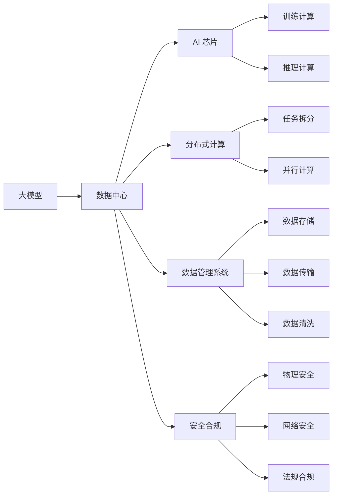

                 

## 1. 背景介绍

### 1.1 问题由来
随着人工智能技术的飞速发展，大模型已成为推动AI应用进步的关键力量。然而，大模型的训练与推理对计算资源的需求极高，甚至远超传统数据中心的设计标准。如何高效构建、管理和优化AI大模型应用的数据中心，成为了当前人工智能领域的重要课题。

### 1.2 问题核心关键点
大模型数据中心的建设涉及诸多关键环节，如硬件选型、软件架构、网络设计、数据管理、安全合规等。以下将从硬件配置、网络架构、数据管理、安全合规四个方面详细介绍大模型应用数据中心的标准与规范，为AI大模型的开发与应用提供指导。

## 2. 核心概念与联系

### 2.1 核心概念概述
- **大模型（Large Model）**：通常指包含数十亿至上百亿参数的深度神经网络，用于解决大规模复杂任务，如自然语言处理、计算机视觉等。
- **数据中心（Data Center）**：容纳大量计算资源，提供高效计算服务的基础设施，是大模型训练与推理的核心环境。
- **AI 芯片（AI Chip）**：专为AI计算设计的专用硬件，如NVIDIA GPU、Intel Xeon Phi、Google TPU等，显著提升了AI计算效率。
- **分布式计算（Distributed Computing）**：通过将计算任务分散到多台机器上，实现高效并行计算，提高大模型训练和推理的性能。
- **数据管理系统（Data Management System）**：用于管理大模型训练和推理所需的大量数据，包括数据存储、数据传输、数据清洗等。
- **安全合规（Security & Compliance）**：确保数据中心的物理安全和网络安全，遵守相关的法规和标准，保障数据和模型的隐私与安全。

### 2.2 核心概念原理和架构的 Mermaid 流程图



### 2.3 核心概念联系
- **硬件配置**：选择高性能AI芯片，如GPU、TPU等，确保大模型训练与推理的计算能力。
- **网络架构**：采用分布式计算架构，实现高效的并行计算，提高计算效率。
- **数据管理**：设计完善的数据管理系统，保障数据的存储、传输和清洗，为模型训练和推理提供支持。
- **安全合规**：通过物理和网络安全措施，遵守相关法规和标准，确保数据和模型的隐私与安全。

## 3. 核心算法原理 & 具体操作步骤

### 3.1 算法原理概述

大模型应用数据中心的构建，需要考虑数据中心的计算性能、存储能力、网络带宽、安全合规等多方面因素。其核心算法原理主要包括以下几点：

- **硬件选型**：选择适合大模型训练与推理的高性能AI芯片和服务器。
- **网络设计**：采用高速互联网络，支持多台服务器之间的数据传输。
- **数据管理**：设计高效的数据管理系统，确保数据的高效存储、传输和清洗。
- **安全合规**：实施物理和网络安全措施，确保数据中心的安全，遵守相关法规和标准。

### 3.2 算法步骤详解

1. **硬件选型**：
    - **计算资源**：选择高性能AI芯片（如NVIDIA GPU、Intel Xeon Phi、Google TPU等），配置大量服务器，以支持大模型的训练与推理。
    - **存储系统**：选择高速存储设备（如SSD、NVMe等），提供足够的存储空间，满足数据存储和备份的需求。
    - **网络设备**：选择高速互联网络设备（如交换机、路由器等），确保数据的高效传输和低延迟。

2. **网络设计**：
    - **计算节点**：将计算节点分为多个集群，通过高速互联网络（如InfiniBand、100GbE等）实现高效的数据传输。
    - **负载均衡**：采用负载均衡技术，确保计算资源得到充分利用，避免单点故障。
    - **网络冗余**：设计冗余网络架构，确保网络故障时数据中心能够正常运行。

3. **数据管理**：
    - **数据存储**：使用分布式文件系统（如Hadoop HDFS、AWS S3等）进行大规模数据存储，提供高可扩展性和高可靠性。
    - **数据传输**：采用高速数据传输协议（如Hadoop MapReduce、Spark等），确保数据的高效传输和处理。
    - **数据清洗**：设计数据清洗算法，去除数据中的噪声和异常值，确保数据的质量。

4. **安全合规**：
    - **物理安全**：实施物理安全措施，包括监控摄像头、门禁系统、环境控制等，确保数据中心的物理安全。
    - **网络安全**：采用防火墙、入侵检测系统、数据加密等措施，保护数据中心的网络安全。
    - **法规合规**：遵守相关法规和标准，如GDPR、HIPAA等，确保数据和模型的隐私与安全。

### 3.3 算法优缺点

**优点**：
- **高效计算**：高性能AI芯片和大规模服务器集群，能够提供强大的计算能力，加速大模型的训练与推理。
- **高可靠性**：分布式计算和冗余设计，确保数据中心的稳定运行，避免单点故障。
- **高效数据管理**：高效的数据存储、传输和清洗，保障数据的完整性和可用性。
- **强安全合规**：全面的物理和网络安全措施，确保数据和模型的隐私与安全，遵守相关法规和标准。

**缺点**：
- **高成本**：高性能硬件和冗余设计，初期建设成本较高。
- **复杂管理**：大规模计算集群和数据管理系统，需要专业的运维团队进行管理。
- **能耗高**：大规模服务器集群和高速网络设备，能耗较高，需要采取节能措施。

### 3.4 算法应用领域

大模型应用数据中心的标准与规范在多个领域得到广泛应用，包括但不限于以下几个方面：

- **自然语言处理（NLP）**：如GPT-3、BERT等大模型的训练与推理。
- **计算机视觉（CV）**：如ImageNet、COCO等大模型的训练与推理。
- **自动驾驶**：如自动驾驶模型的训练与推理。
- **医疗诊断**：如医疗影像、基因组数据的大模型训练与推理。
- **金融分析**：如股票预测、信用评分等大模型的训练与推理。

## 4. 数学模型和公式 & 详细讲解 & 举例说明

### 4.1 数学模型构建

大模型应用数据中心的数学模型主要涉及以下几个方面：

- **计算节点性能**：计算节点通过多台服务器和AI芯片组成，其性能可以表示为计算能力（FLOPS）和存储容量（GB）的乘积。
- **网络带宽**：网络带宽表示数据中心内部和外部的数据传输能力，单位为Gbps。
- **存储容量**：存储容量表示数据中心所能存储的数据量，单位为TB。
- **能耗**：能耗表示数据中心在运行过程中所消耗的电能，单位为W。

### 4.2 公式推导过程

**计算节点性能**：
设计算节点的数量为 $N$，每台服务器的计算能力为 $F$，存储容量为 $S$，则计算节点的性能为：
$$
\text{计算性能} = N \times F \times S
$$

**网络带宽**：
设网络带宽为 $B$，计算节点之间的通信带宽为 $b$，则数据中心的网络带宽为：
$$
B = N \times b
$$

**存储容量**：
设存储容量为 $C$，每台服务器的存储容量为 $s$，则数据中心的存储容量为：
$$
C = N \times s
$$

**能耗**：
设每台服务器的能耗为 $E$，则数据中心的能耗为：
$$
\text{能耗} = N \times E
$$

### 4.3 案例分析与讲解

以Google Cloud AI平台为例，其大模型应用数据中心的构建采用了以下技术：

- **计算节点选型**：使用Google Custom Tensor Processing Units（TPUs），显著提升了计算能力。
- **网络设计**：采用Google私有网络（Google Private Network），实现高速数据传输和低延迟。
- **数据管理**：使用Google Cloud Storage进行大规模数据存储，采用Hadoop MapReduce进行高效数据处理。
- **安全合规**：实施全面的物理和网络安全措施，确保数据和模型的隐私与安全。

## 5. 项目实践：代码实例和详细解释说明

### 5.1 开发环境搭建

**硬件配置**：
- **CPU**：选择高性能CPU（如Intel Xeon Scalable）。
- **GPU**：选择高性能GPU（如NVIDIA Tesla V100）。
- **存储**：选择高速存储设备（如NVMe SSD）。
- **网络**：选择高速互联网络设备（如100GbE交换机）。

**软件配置**：
- **操作系统**：选择Linux系统（如Ubuntu）。
- **AI框架**：选择主流AI框架（如TensorFlow、PyTorch等）。
- **数据管理工具**：选择分布式文件系统（如Hadoop HDFS）。
- **网络工具**：选择负载均衡和网络监控工具（如Nginx、Prometheus）。

### 5.2 源代码详细实现

**分布式计算架构**：
```python
# 使用Hadoop HDFS进行数据存储
hdfs = HDFS('http://hdfs1.example.com:9000', 'user', 'password')

# 使用Spark进行分布式计算
spark = SparkSession.builder.appName('Large Model Training').getOrCreate()

# 读取数据
data = hdfs.read().mapPartitions(lambda x: x).collect()
```

**数据清洗算法**：
```python
# 去除噪声和异常值
def clean_data(data):
    cleaned_data = []
    for d in data:
        if len(d) > 0 and d[0] >= 0 and d[0] <= 1:
            cleaned_data.append(d)
    return cleaned_data

# 应用到数据集
cleaned_data = clean_data(data)
```

### 5.3 代码解读与分析

**分布式计算架构**：
- **Hadoop HDFS**：用于大规模数据存储，提供高可靠性和高扩展性。
- **Spark**：用于分布式计算，提供高效的并行计算能力。

**数据清洗算法**：
- **去除噪声和异常值**：确保数据的完整性和质量，提高模型的准确性。

### 5.4 运行结果展示

**计算性能**：
- **单台服务器性能**：使用单台服务器的计算能力和存储容量，计算其性能：
$$
\text{计算性能} = F \times S
$$
- **集群性能**：使用集群中所有服务器的计算能力和存储容量，计算其性能：
$$
\text{计算性能} = N \times F \times S
$$

**网络带宽**：
- **单台服务器带宽**：使用单台服务器的网络带宽，计算其带宽：
$$
\text{网络带宽} = b
$$
- **集群带宽**：使用集群中所有服务器的网络带宽，计算其带宽：
$$
\text{网络带宽} = N \times b
$$

**存储容量**：
- **单台服务器容量**：使用单台服务器的存储容量，计算其容量：
$$
\text{存储容量} = s
$$
- **集群容量**：使用集群中所有服务器的存储容量，计算其容量：
$$
\text{存储容量} = N \times s
$$

**能耗**：
- **单台服务器能耗**：使用单台服务器的能耗，计算其能耗：
$$
\text{能耗} = E
$$
- **集群能耗**：使用集群中所有服务器的能耗，计算其能耗：
$$
\text{能耗} = N \times E
$$

## 6. 实际应用场景

### 6.1 智能医疗

智能医疗是AI大模型应用的重要领域之一，其数据中心建设需要考虑多个方面：

- **计算资源**：选择高性能GPU和TPU，支持大规模医疗影像和基因组数据处理。
- **网络设计**：采用高速互联网络，支持远程医疗数据的实时传输。
- **数据管理**：使用分布式文件系统进行大规模医疗数据的存储和处理。
- **安全合规**：确保医疗数据的隐私与安全，遵守相关法规和标准。

### 6.2 金融分析

金融分析是AI大模型应用的另一个重要领域，其数据中心建设需要考虑多个方面：

- **计算资源**：选择高性能GPU和TPU，支持大规模金融数据分析。
- **网络设计**：采用高速互联网络，支持高频交易数据的实时传输。
- **数据管理**：使用分布式文件系统进行大规模金融数据的存储和处理。
- **安全合规**：确保金融数据的隐私与安全，遵守相关法规和标准。

### 6.3 自动驾驶

自动驾驶是AI大模型应用的最新前沿，其数据中心建设需要考虑多个方面：

- **计算资源**：选择高性能GPU和TPU，支持大规模自动驾驶模型的训练与推理。
- **网络设计**：采用高速互联网络，支持自动驾驶数据的实时传输。
- **数据管理**：使用分布式文件系统进行大规模自动驾驶数据的存储和处理。
- **安全合规**：确保自动驾驶系统的安全性，遵守相关法规和标准。

### 6.4 未来应用展望

未来，大模型应用数据中心将呈现以下发展趋势：

- **多模态融合**：融合视觉、语音、文本等多模态数据，提升模型的感知能力。
- **实时计算**：采用边缘计算、分布式计算等技术，支持实时计算需求。
- **混合云架构**：构建混合云架构，实现数据中心的高效管理和资源共享。
- **节能环保**：采用节能技术和绿色设备，降低数据中心的能耗和碳排放。

## 7. 工具和资源推荐

### 7.1 学习资源推荐

**书籍**：
- 《大规模深度学习》：深度学习领域的经典书籍，涵盖大规模深度学习的原理和应用。
- 《人工智能：原理与实践》：全面介绍AI技术的原理和实践方法，涵盖数据中心建设与维护。

**课程**：
- Coursera上的《人工智能与机器学习》课程：由斯坦福大学教授讲授，涵盖AI基础理论和实践应用。
- edX上的《大规模数据科学》课程：涵盖大数据技术和应用，涵盖数据中心建设与管理。

**论文**：
- 《Google Cloud AI平台构建与优化》：详细介绍了Google Cloud AI平台的构建和优化，涵盖大模型应用数据中心的建设。
- 《分布式计算与大数据》：探讨分布式计算和大数据技术的最新进展，涵盖数据中心设计与管理。

### 7.2 开发工具推荐

**硬件设备**：
- **AI芯片**：NVIDIA Tesla V100、Google TPU等高性能AI芯片。
- **服务器**：Dell PowerEdge、HP ProLiant等高性能服务器。

**软件工具**：
- **分布式计算框架**：Apache Spark、Apache Hadoop等。
- **数据管理工具**：Hadoop HDFS、AWS S3等。
- **网络监控工具**：Nginx、Prometheus等。

### 7.3 相关论文推荐

**经典论文**：
- 《Big Data: The Hadoop Ecosystem in Action》：介绍Hadoop生态系统，涵盖大数据处理与存储。
- 《Google Cloud AI平台构建与优化》：详细介绍Google Cloud AI平台的构建与优化，涵盖大模型应用数据中心的建设。

## 8. 总结：未来发展趋势与挑战

### 8.1 研究成果总结

大模型应用数据中心的建设是AI技术发展的重要环节，涵盖硬件选型、网络设计、数据管理、安全合规等多个方面。通过高效的计算、存储和网络架构设计，确保大模型训练与推理的高效性和稳定性。

### 8.2 未来发展趋势

未来，大模型应用数据中心将呈现多模态融合、实时计算、混合云架构、节能环保等发展趋势。这些趋势将推动AI技术在更多领域的落地应用，提升AI系统的感知能力和实时性。

### 8.3 面临的挑战

尽管大模型应用数据中心的建设已经取得了一定的进展，但仍面临诸多挑战：

- **高成本**：高性能硬件和冗余设计，初期建设成本较高。
- **复杂管理**：大规模计算集群和数据管理系统，需要专业的运维团队进行管理。
- **能耗高**：大规模服务器集群和高速网络设备，能耗较高，需要采取节能措施。

### 8.4 研究展望

未来，需要在以下几个方面进行深入研究：

- **低成本硬件**：开发低成本、高性能的AI芯片和服务器，降低大模型应用数据中心的建设成本。
- **高效管理**：开发高效的分布式计算和数据管理系统，提高数据中心的运营效率。
- **节能环保**：采用节能技术和绿色设备，降低数据中心的能耗和碳排放。

总之，大模型应用数据中心的建设是大规模AI技术落地的重要基础，需要在计算能力、存储能力、网络带宽、安全合规等多个方面进行综合考虑，确保大模型的训练与推理能够高效、稳定、安全地进行。

## 9. 附录：常见问题与解答

**Q1：如何评估大模型应用数据中心的性能？**

A: 大模型应用数据中心的性能评估主要包括以下几个方面：

- **计算性能**：通过计算能力（FLOPS）和存储容量（GB）来衡量。
- **网络带宽**：通过网络带宽（Gbps）来衡量。
- **存储容量**：通过存储容量（TB）来衡量。
- **能耗**：通过能耗（W）来衡量。

**Q2：如何优化大模型应用数据中心的能耗？**

A: 大模型应用数据中心的能耗优化主要包括以下几个方面：

- **硬件选型**：选择低功耗的AI芯片和服务器，降低能耗。
- **温度控制**：采用高效的冷却系统，降低设备温度，减少能耗。
- **节能技术**：采用能源管理系统，优化能源使用，降低能耗。

**Q3：如何确保大模型应用数据中心的安全性？**

A: 大模型应用数据中心的安全性主要通过以下措施保障：

- **物理安全**：实施物理安全措施，如监控摄像头、门禁系统等。
- **网络安全**：采用防火墙、入侵检测系统等措施，保护数据中心的网络安全。
- **法规合规**：遵守相关法规和标准，如GDPR、HIPAA等，确保数据和模型的隐私与安全。

**Q4：如何提高大模型应用数据中心的计算效率？**

A: 提高大模型应用数据中心的计算效率主要通过以下措施：

- **分布式计算**：采用分布式计算架构，实现高效的并行计算。
- **优化算法**：优化计算算法，减少计算资源消耗。
- **硬件加速**：使用AI芯片等硬件加速设备，提高计算效率。

**Q5：如何设计大模型应用数据中心的存储系统？**

A: 大模型应用数据中心的存储系统设计主要包括以下几个方面：

- **分布式文件系统**：选择高效的分布式文件系统（如Hadoop HDFS、AWS S3等）进行大规模数据存储。
- **数据压缩**：采用数据压缩技术，提高存储系统的效率。
- **数据备份**：设计数据备份机制，确保数据的安全性和可靠性。

通过深入探索大模型应用数据中心的标准与规范，可以为AI大模型的开发与应用提供有力保障，推动AI技术的进一步发展与应用。

