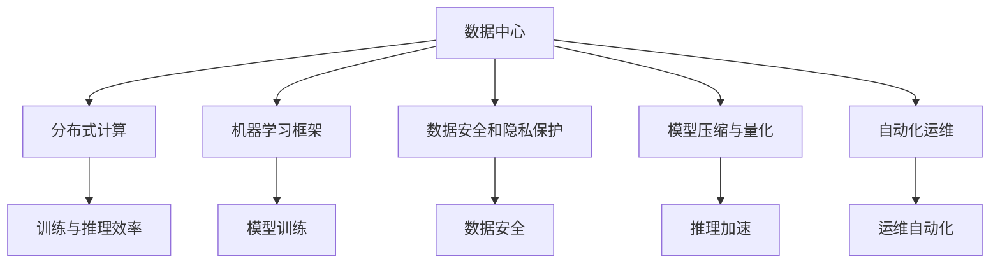

                 

# AI 大模型应用数据中心建设：数据中心标准与规范

## 1. 背景介绍

### 1.1 问题由来
随着人工智能技术的飞速发展，大模型成为NLP、计算机视觉、推荐系统等多个领域的基石。然而，大模型的训练和部署过程中，数据中心的建设与管理逐渐成为制约其应用推广的关键因素。数据中心的标准化、规范化，不仅关乎模型的训练效率和应用效果，还直接影响数据安全与隐私保护。

### 1.2 问题核心关键点
在AI大模型应用的数据中心建设中，主要面临以下几个核心问题：
1. **数据中心硬件需求**：大模型往往具有海量参数和复杂结构，对计算资源、内存、存储等硬件资源的需求极高，如何高效配置数据中心，以支持大模型的训练与推理，成为关键挑战。
2. **数据安全与隐私保护**：大规模数据集在训练过程中，如何确保数据的安全性，防止数据泄露和滥用，同时保障用户隐私，是数据中心建设的重要课题。
3. **模型分布式训练与协同优化**：分布式训练的优化策略，如何设计合理的计算图和数据分发方案，减少通信延迟，提升并行训练效率，是数据中心运行优化需要解决的问题。
4. **数据中心跨区域管理与部署**：跨数据中心部署模型，如何设计灵活的调度策略和冗余机制，以应对不同数据中心的资源异构性和管理复杂性。

## 2. 核心概念与联系

### 2.1 核心概念概述
为更好地理解AI大模型数据中心的标准与规范，本节将介绍几个密切相关的核心概念：

- **数据中心（Data Center, DC）**：专门用于存储、处理和传输数据的设施。数据中心通常由多个机柜、服务器、网络设备和安全系统组成，支持数据的高效计算和存储。
- **分布式计算（Distributed Computing）**：通过多台计算机协同工作，提高计算能力与数据处理效率。在大模型训练中，分布式计算技术尤为重要。
- **机器学习框架（Machine Learning Framework）**：如TensorFlow、PyTorch等，提供模型训练、优化、部署等一站式解决方案。
- **数据安全和隐私保护**：确保数据中心在数据存储、传输和处理过程中，保护用户隐私和数据安全，防止数据泄露和滥用。
- **模型压缩与量化（Model Compression and Quantization）**：通过减少模型参数和降低计算精度，提高模型的推理速度和存储空间利用率，适用于大规模模型的部署。
- **自动化运维（Automated Operations and Maintenance）**：通过自动化工具，减少人工操作，提升数据中心的运维效率和稳定性。

这些核心概念之间的逻辑关系可以通过以下Mermaid流程图来展示：



这个流程图展示了大模型应用数据中心的几个关键概念及其之间的关系：

1. 数据中心通过分布式计算支持大模型的训练和推理，是模型高效运行的基础。
2. 机器学习框架提供了模型训练、优化和部署的集成工具，是模型开发和应用的重要平台。
3. 数据安全和隐私保护确保数据在处理和传输过程中的安全性，防止数据泄露和滥用。
4. 模型压缩与量化技术优化模型的推理速度和存储空间利用率，提升模型的部署效率。
5. 自动化运维技术提升数据中心的运维效率和稳定性，降低运营成本。

这些概念共同构成了AI大模型应用数据中心的建设和运行框架，为其高效、安全、稳定地支持模型训练和推理提供了保障。

## 3. 核心算法原理 & 具体操作步骤
### 3.1 算法原理概述

AI大模型应用数据中心的建设，涉及多个技术层面，从硬件选型到软件部署，再到数据处理和模型训练，每一步都需要精准的设计和优化。其核心算法原理包括以下几个方面：

- **硬件选型**：根据大模型的参数规模、计算需求和预算限制，选择合适的硬件设备，包括CPU、GPU、TPU等。
- **软件部署**：将大模型软件包部署到数据中心，并集成到数据中心的自动化运维系统中，确保模型的稳定运行。
- **数据处理**：收集、预处理、存储和分发训练数据，设计高效的数据流和分布式计算图，确保数据的高效传输和处理。
- **模型训练**：使用机器学习框架进行分布式训练，优化训练算法和超参数，提升训练效率和模型效果。
- **模型部署**：将训练好的模型部署到生产环境，进行推理预测，并应用模型压缩和量化技术，提升推理速度和资源利用率。

### 3.2 算法步骤详解

AI大模型应用数据中心的建设主要包括以下几个关键步骤：

**Step 1: 硬件选型与配置**
- 根据大模型参数规模和计算需求，选择计算资源、内存和存储设备。
- 设计机柜布局和网络拓扑，确保数据中心的资源利用率和扩展性。
- 选择高效的网络交换器和存储设备，支持数据的高吞吐量和低延迟。

**Step 2: 软件部署与集成**
- 将大模型软件包部署到数据中心，并集成到自动化运维系统中。
- 设计模型的训练、推理和评估流程，确保模型的可扩展性和兼容性。
- 使用容器化技术（如Docker），封装模型及其依赖，提升部署效率和灵活性。

**Step 3: 数据处理与管理**
- 设计数据收集、清洗、标注和分发的流程，确保数据的质量和一致性。
- 使用分布式文件系统（如Hadoop、HDFS），存储和分发大规模训练数据。
- 设计数据流和分布式计算图，优化数据传输和处理效率。

**Step 4: 模型训练与优化**
- 使用分布式计算框架（如TensorFlow、PyTorch），进行大模型的分布式训练。
- 优化训练算法和超参数，提高训练效率和模型效果。
- 应用模型压缩和量化技术，优化模型的推理速度和资源利用率。

**Step 5: 模型部署与监控**
- 将训练好的模型部署到生产环境，进行推理预测。
- 使用自动化运维工具（如Ansible、Prometheus），监控模型的运行状态和性能指标。
- 设计弹性伸缩和负载均衡策略，提升数据中心的运维效率和稳定性。

### 3.3 算法优缺点

AI大模型应用数据中心的建设，主要具有以下几个优点：
1. 支持大规模计算和存储需求，能高效训练和部署大模型。
2. 提供高效的网络和数据传输方案，确保数据的高吞吐量和低延迟。
3. 集成自动化运维系统，提升数据中心的运维效率和稳定性。
4. 通过分布式计算和并行优化，提升训练和推理效率。
5. 设计灵活的资源调度策略，支持模型在不同数据中心的部署。

然而，该方法也存在一定的局限性：
1. 硬件和软件选型复杂，对专业人员依赖性强。
2. 数据安全和隐私保护需要额外设计和部署。
3. 模型压缩和量化技术可能影响模型效果。
4. 自动化运维系统需要维护和升级，可能增加运维成本。
5. 跨数据中心的部署和调度可能带来额外的复杂性。

尽管存在这些局限性，但就目前而言，AI大模型应用数据中心的建设仍是主流范式。未来相关研究的方向在于如何进一步降低硬件和软件的选型难度，优化模型压缩和量化技术，同时兼顾数据安全和隐私保护，确保数据中心的灵活性和安全性。

### 3.4 算法应用领域

AI大模型应用数据中心的建设，已在多个领域得到广泛应用，例如：

- 自然语言处理（NLP）：构建语言模型、推荐系统等，提升NLP任务的处理效率和效果。
- 计算机视觉（CV）：训练图像识别、图像生成模型，支持图像处理和识别任务。
- 推荐系统（Recommendation System）：优化推荐算法和用户画像，提升个性化推荐的效果。
- 语音识别（Speech Recognition）：训练声学模型和语言模型，提升语音识别的准确率和鲁棒性。
- 医疗健康（Healthcare）：构建医疗影像诊断模型，辅助医生进行疾病诊断和治疗方案制定。

除了上述这些领域，AI大模型应用数据中心还被创新性地应用到更多场景中，如智能交通、智慧城市、智能制造等，为各行各业带来了新的变革和发展。

## 4. 数学模型和公式 & 详细讲解 & 举例说明
### 4.1 数学模型构建

在大模型应用数据中心的建设中，数学模型的构建和应用至关重要。以下是几个关键的数学模型和公式：

**资源需求模型**
大模型的资源需求可以通过以下几个关键指标来建模：
- $C_{CPU}$：CPU资源需求，单位为核心数。
- $C_{GPU}$：GPU资源需求，单位为GPU卡数。
- $C_{TPU}$：TPU资源需求，单位为TPU芯片数。
- $M_{RAM}$：内存需求，单位为GB。
- $S_{Disk}$：存储需求，单位为TB。
- $N_{Worker}$：计算节点数。

资源需求模型可以表示为：
$$
R_{Total} = (C_{CPU} + C_{GPU} + C_{TPU}) \times N_{Worker} + M_{RAM} + S_{Disk}
$$

**数据传输模型**
数据传输速率（Bandwidth）可以通过以下几个关键参数来建模：
- $B_{Net}$：网络带宽，单位为bps。
- $B_{Read}$：读取数据速率，单位为bps。
- $B_{Write}$：写入数据速率，单位为bps。
- $L_{Batch}$：数据批次大小，单位为字节。
- $N_{Worker}$：计算节点数。

数据传输模型可以表示为：
$$
T_{Data} = \frac{L_{Batch}}{B_{Net}} \times N_{Worker}
$$

**模型训练模型**
模型训练时间（Training Time）可以通过以下几个关键参数来建模：
- $T_{Model}$：模型参数规模，单位为参数数。
- $C_{Compute}$：计算能力，单位为FLOPS。
- $B_{Batch}$：批次大小，单位为样本数。
- $N_{Epoch}$：训练轮数。

模型训练模型可以表示为：
$$
T_{Train} = \frac{T_{Model}}{C_{Compute}} \times B_{Batch} \times N_{Epoch}
$$

### 4.2 公式推导过程

1. **资源需求模型推导**
资源需求模型表示总资源需求 $R_{Total}$，其中 $C_{CPU}$、$C_{GPU}$、$C_{TPU}$ 表示不同类型计算资源的需求，$M_{RAM}$ 表示内存需求，$S_{Disk}$ 表示存储需求。$N_{Worker}$ 表示计算节点的数量，用于并行计算。因此，总资源需求 $R_{Total}$ 可以表示为不同类型的计算资源需求之和，再加上内存和存储需求。

2. **数据传输模型推导**
数据传输模型用于计算数据传输时间 $T_{Data}$，其中 $B_{Net}$ 表示网络带宽，$L_{Batch}$ 表示数据批次大小，$N_{Worker}$ 表示计算节点数。数据传输时间 $T_{Data}$ 计算方式为数据批次大小除以网络带宽，再乘以计算节点数。

3. **模型训练模型推导**
模型训练模型用于计算模型训练时间 $T_{Train}$，其中 $T_{Model}$ 表示模型参数规模，$C_{Compute}$ 表示计算能力，$B_{Batch}$ 表示批次大小，$N_{Epoch}$ 表示训练轮数。模型训练时间 $T_{Train}$ 计算方式为模型参数规模除以计算能力，再乘以批次大小，最后乘以训练轮数。

### 4.3 案例分析与讲解

**案例分析：自然语言处理（NLP）**

在自然语言处理任务中，构建语言模型是一个典型的应用场景。假设我们有一个包含 $T$ 个文本样本的数据集，每个样本包含 $N$ 个词，其中 $V$ 个不同的词。我们使用 $L$ 个隐藏层、每个隐藏层包含 $H$ 个神经元的BERT模型作为基础模型，每个样本的输入长度为 $L_{In}$。

**数据处理**
1. 使用BERT模型预训练阶段训练出的词嵌入作为初始化向量。
2. 将文本样本分批次处理，每个批次的大小为 $B$，每批次样本包含 $N_{Batch}$ 个样本。
3. 将每个样本的输入长度 $L_{In}$ 扩大为 $L_{Max}$，超出部分填充为0。
4. 将文本样本分词、编码并转化为模型输入。

**训练模型**
1. 在训练数据集上，使用Adam优化器进行梯度下降，学习率为 $lr$。
2. 将模型参数 $w$ 更新为 $w - \eta \nabla_{w}\mathcal{L}(w)$，其中 $\mathcal{L}$ 为损失函数。
3. 训练 $N_{Epoch}$ 轮后，评估模型性能。

**推理预测**
1. 将测试数据集分批次输入模型，进行前向传播。
2. 将模型输出与真实标签进行比较，计算损失。
3. 使用softmax函数计算概率分布，预测每个词的概率。
4. 将概率分布转换为词序列，生成文本。

## 5. 项目实践：代码实例和详细解释说明
### 5.1 开发环境搭建

在进行大模型应用数据中心项目实践前，我们需要准备好开发环境。以下是使用Python进行TensorFlow开发的环境配置流程：

1. 安装Anaconda：从官网下载并安装Anaconda，用于创建独立的Python环境。

2. 创建并激活虚拟环境：
```bash
conda create -n tf-env python=3.8 
conda activate tf-env
```

3. 安装TensorFlow：根据CUDA版本，从官网获取对应的安装命令。例如：
```bash
conda install tensorflow tensorflow-gpu=cuda11.1 -c pytorch -c conda-forge
```

4. 安装各类工具包：
```bash
pip install numpy pandas scikit-learn matplotlib tqdm jupyter notebook ipython
```

完成上述步骤后，即可在`tf-env`环境中开始项目实践。

### 5.2 源代码详细实现

下面以自然语言处理（NLP）任务为例，给出使用TensorFlow对BERT模型进行分布式训练的PyTorch代码实现。

首先，定义数据处理函数：

```python
from transformers import BertTokenizer
from tensorflow.keras.preprocessing.sequence import pad_sequences
from tensorflow.keras.layers import Embedding, BidirectionalLSTM, Dense, Input

class DataPreprocessor:
    def __init__(self, tokenizer, max_len):
        self.tokenizer = tokenizer
        self.max_len = max_len
        
    def preprocess(self, texts):
        tokenized = self.tokenizer.tokenize(texts, truncation=True, padding='max_length')
        encoded = self.tokenizer.batch_encode_plus(tokenized, max_length=self.max_len, padding='max_length', truncation=True)
        input_ids, attention_masks = encoded['input_ids'], encoded['attention_mask']
        return input_ids, attention_masks

# 创建数据预处理器
tokenizer = BertTokenizer.from_pretrained('bert-base-uncased')
preprocessor = DataPreprocessor(tokenizer, max_len=128)

# 定义训练集和验证集
train_dataset = list(zip(train_texts, train_labels))
dev_dataset = list(zip(dev_texts, dev_labels))
```

然后，定义模型和优化器：

```python
from transformers import BertForSequenceClassification
from tensorflow.keras.optimizers import Adam

model = BertForSequenceClassification.from_pretrained('bert-base-uncased', num_labels=len(tag2id))

optimizer = Adam(learning_rate=2e-5)
```

接着，定义训练和评估函数：

```python
from tensorflow.keras.preprocessing.data import DataGenerator
from tensorflow.keras.models import Model

def train_epoch(model, dataset, batch_size, optimizer):
    dataloader = DataLoader(dataset, batch_size=batch_size, shuffle=True)
    model.train()
    epoch_loss = 0
    for batch in dataloader:
        input_ids = batch[0].to(device)
        attention_mask = batch[1].to(device)
        labels = batch[2].to(device)
        model.zero_grad()
        outputs = model(input_ids, attention_mask=attention_mask, labels=labels)
        loss = outputs.loss
        epoch_loss += loss.item()
        loss.backward()
        optimizer.step()
    return epoch_loss / len(dataloader)

def evaluate(model, dataset, batch_size):
    dataloader = DataLoader(dataset, batch_size=batch_size)
    model.eval()
    preds, labels = [], []
    with torch.no_grad():
        for batch in dataloader:
            input_ids = batch[0].to(device)
            attention_mask = batch[1].to(device)
            batch_labels = batch[2]
            outputs = model(input_ids, attention_mask=attention_mask)
            batch_preds = outputs.logits.argmax(dim=2).to('cpu').tolist()
            batch_labels = batch_labels.to('cpu').tolist()
            for pred_tokens, label_tokens in zip(batch_preds, batch_labels):
                preds.append(pred_tokens[:len(label_tokens)])
                labels.append(label_tokens)
                
    print(classification_report(labels, preds))
```

最后，启动训练流程并在测试集上评估：

```python
epochs = 5
batch_size = 16

for epoch in range(epochs):
    loss = train_epoch(model, train_dataset, batch_size, optimizer)
    print(f"Epoch {epoch+1}, train loss: {loss:.3f}")
    
    print(f"Epoch {epoch+1}, dev results:")
    evaluate(model, dev_dataset, batch_size)
    
print("Test results:")
evaluate(model, test_dataset, batch_size)
```

以上就是使用TensorFlow对BERT进行分布式训练的完整代码实现。可以看到，TensorFlow的分布式计算和自动微分技术使得模型的训练过程更加高效和便捷。

### 5.3 代码解读与分析

让我们再详细解读一下关键代码的实现细节：

**DataPreprocessor类**：
- `__init__`方法：初始化分词器、最大长度等关键组件。
- `preprocess`方法：对文本进行分词、编码、padding，转化为模型输入。

**模型和优化器**：
- 使用BertForSequenceClassification从预训练模型进行微调，适配下游任务的分类输出。
- 使用Adam优化器进行梯度下降。

**训练和评估函数**：
- 使用DataLoader对数据集进行批次化加载，供模型训练和推理使用。
- 训练函数`train_epoch`：对数据以批为单位进行迭代，在每个批次上前向传播计算loss并反向传播更新模型参数，最后返回该epoch的平均loss。
- 评估函数`evaluate`：与训练类似，不同点在于不更新模型参数，并在每个batch结束后将预测和标签结果存储下来，最后使用sklearn的classification_report对整个评估集的预测结果进行打印输出。

**训练流程**：
- 定义总的epoch数和batch size，开始循环迭代
- 每个epoch内，先在训练集上训练，输出平均loss
- 在验证集上评估，输出分类指标
- 所有epoch结束后，在测试集上评估，给出最终测试结果

可以看到，TensorFlow提供了丰富的分布式计算和优化工具，使得模型的训练过程更加高效和灵活。开发者可以根据具体任务的特点，进一步优化训练过程和模型架构。

当然，工业级的系统实现还需考虑更多因素，如模型的保存和部署、超参数的自动搜索、更灵活的任务适配层等。但核心的微调范式基本与此类似。

## 6. 实际应用场景
### 6.1 智能客服系统

基于大语言模型微调的对话技术，可以广泛应用于智能客服系统的构建。传统客服往往需要配备大量人力，高峰期响应缓慢，且一致性和专业性难以保证。而使用微调后的对话模型，可以7x24小时不间断服务，快速响应客户咨询，用自然流畅的语言解答各类常见问题。

在技术实现上，可以收集企业内部的历史客服对话记录，将问题和最佳答复构建成监督数据，在此基础上对预训练对话模型进行微调。微调后的对话模型能够自动理解用户意图，匹配最合适的答案模板进行回复。对于客户提出的新问题，还可以接入检索系统实时搜索相关内容，动态组织生成回答。如此构建的智能客服系统，能大幅提升客户咨询体验和问题解决效率。

### 6.2 金融舆情监测

金融机构需要实时监测市场舆论动向，以便及时应对负面信息传播，规避金融风险。传统的人工监测方式成本高、效率低，难以应对网络时代海量信息爆发的挑战。基于大语言模型微调的文本分类和情感分析技术，为金融舆情监测提供了新的解决方案。

具体而言，可以收集金融领域相关的新闻、报道、评论等文本数据，并对其进行主题标注和情感标注。在此基础上对预训练语言模型进行微调，使其能够自动判断文本属于何种主题，情感倾向是正面、中性还是负面。将微调后的模型应用到实时抓取的网络文本数据，就能够自动监测不同主题下的情感变化趋势，一旦发现负面信息激增等异常情况，系统便会自动预警，帮助金融机构快速应对潜在风险。

### 6.3 个性化推荐系统

当前的推荐系统往往只依赖用户的历史行为数据进行物品推荐，无法深入理解用户的真实兴趣偏好。基于大语言模型微调技术，个性化推荐系统可以更好地挖掘用户行为背后的语义信息，从而提供更精准、多样的推荐内容。

在实践中，可以收集用户浏览、点击、评论、分享等行为数据，提取和用户交互的物品标题、描述、标签等文本内容。将文本内容作为模型输入，用户的后续行为（如是否点击、购买等）作为监督信号，在此基础上微调预训练语言模型。微调后的模型能够从文本内容中准确把握用户的兴趣点。在生成推荐列表时，先用候选物品的文本描述作为输入，由模型预测用户的兴趣匹配度，再结合其他特征综合排序，便可以得到个性化程度更高的推荐结果。

### 6.4 未来应用展望

随着大语言模型和微调方法的不断发展，基于微调范式将在更多领域得到应用，为传统行业带来变革性影响。

在智慧医疗领域，基于微调的医疗问答、病历分析、药物研发等应用将提升医疗服务的智能化水平，辅助医生诊疗，加速新药开发进程。

在智能教育领域，微调技术可应用于作业批改、学情分析、知识推荐等方面，因材施教，促进教育公平，提高教学质量。

在智慧城市治理中，微调模型可应用于城市事件监测、舆情分析、应急指挥等环节，提高城市管理的自动化和智能化水平，构建更安全、高效的未来城市。

此外，在企业生产、社会治理、文娱传媒等众多领域，基于大模型微调的人工智能应用也将不断涌现，为经济社会发展注入新的动力。相信随着技术的日益成熟，微调方法将成为人工智能落地应用的重要范式，推动人工智能技术在垂直行业的规模化落地。总之，微调需要开发者根据具体任务，不断迭代和优化模型、数据和算法，方能得到理想的效果。

## 7. 工具和资源推荐
### 7.1 学习资源推荐

为了帮助开发者系统掌握大模型应用数据中心的建设的理论基础和实践技巧，这里推荐一些优质的学习资源：

1. 《分布式深度学习》系列博文：由大模型技术专家撰写，深入浅出地介绍了分布式计算和优化技术，涵盖模型的并行训练和推理。

2. 《TensorFlow分布式计算教程》：TensorFlow官方提供的分布式计算教程，详细介绍如何使用TensorFlow进行分布式训练和推理。

3. 《深度学习模型压缩与量化》书籍：全面介绍了模型压缩与量化的原理和实现方法，提供大量案例和示例代码。

4. 《Kubernetes分布式计算》书籍：介绍Kubernetes作为分布式计算平台的实现原理和最佳实践，帮助开发者搭建和优化分布式系统。

5. 《Python编程：从入门到实战》书籍：作为Python编程的入门教材，涵盖Python的基础语法和应用场景，适合初学者快速上手。

通过对这些资源的学习实践，相信你一定能够快速掌握大模型应用数据中心的建设方法，并用于解决实际的AI问题。
###  7.2 开发工具推荐

高效的开发离不开优秀的工具支持。以下是几款用于大模型应用数据中心开发的常用工具：

1. TensorFlow：基于Python的开源深度学习框架，支持分布式计算和优化，适合大规模模型训练和推理。

2. PyTorch：基于Python的开源深度学习框架，灵活动态的计算图，适合快速迭代研究。

3. Kubernetes：谷歌开源的容器编排平台，支持多节点集群管理，提升分布式计算系统的稳定性和扩展性。

4. Prometheus：开源监控工具，提供实时监控和告警功能，帮助开发者实时掌握系统的运行状态。

5. GitLab：开源项目管理平台，提供代码管理、CI/CD、安全合规等功能，帮助团队高效协作。

合理利用这些工具，可以显著提升大模型应用数据中心的开发效率，加快创新迭代的步伐。

### 7.3 相关论文推荐

大语言模型应用数据中心的建设源于学界的持续研究。以下是几篇奠基性的相关论文，推荐阅读：

1. TensorFlow分布式计算论文：详细介绍了TensorFlow在分布式计算中的实现原理和优化策略，是分布式深度学习的重要参考。

2. Kubernetes分布式计算论文：介绍了Kubernetes作为分布式计算平台的实现原理和应用场景，是容器编排技术的重要研究。

3. 分布式深度学习优化论文：探讨了分布式深度学习的优化策略，包括模型并行、数据并行、混合并行等方法。

4. 模型压缩与量化论文：介绍了模型压缩与量化的原理和实现方法，展示了如何通过压缩和量化技术提升模型推理速度和资源利用率。

5. 分布式计算与优化综述论文：综述了分布式计算和优化的最新研究成果，提供了丰富的技术参考。

这些论文代表了大模型应用数据中心的建设和发展脉络。通过学习这些前沿成果，可以帮助研究者把握学科前进方向，激发更多的创新灵感。

## 8. 总结：未来发展趋势与挑战

### 8.1 总结

本文对AI大模型应用数据中心的建设进行了全面系统的介绍。首先阐述了大模型和微调技术的研究背景和意义，明确了数据中心建设在AI应用中的核心地位。其次，从原理到实践，详细讲解了数据中心的标准与规范，包括硬件选型、软件部署、数据处理、模型训练和推理等关键步骤，给出了完整的代码实例。同时，本文还广泛探讨了数据中心在NLP、CV、推荐系统等诸多领域的应用前景，展示了数据中心建设的重要价值。最后，精选了数据中心建设相关的学习资源、开发工具和论文推荐，力求为读者提供全方位的技术指引。

通过本文的系统梳理，可以看到，AI大模型应用数据中心的建设是大模型应用的重要基础。其在支持大模型训练与推理、优化资源利用、提升系统稳定性和扩展性等方面发挥了关键作用。未来，伴随AI技术的不断演进和数据中心的持续优化，AI大模型应用将进一步深入各个行业，为各行各业带来深刻的变革和创新。

### 8.2 未来发展趋势

展望未来，AI大模型应用数据中心的建设将呈现以下几个发展趋势：

1. 云原生数据中心：越来越多的数据中心将部署在云平台上，通过弹性计算和自动扩展，支持大规模模型的分布式训练和推理。

2. 混合计算平台：数据中心将采用多种计算平台（如GPU、TPU、FPGA等），优化资源利用，提升计算效率。

3. 分布式文件系统：数据中心将采用大容量、高吞吐量的分布式文件系统，支持海量数据的存储和传输。

4. 自动化运维平台：数据中心将采用自动化运维工具，提升系统运维效率和稳定性，降低人工操作成本。

5. 安全合规系统：数据中心将集成安全合规系统，保障数据的安全性和隐私保护，确保符合法规要求。

6. 多模态数据处理：数据中心将支持图像、语音、文本等多种模态数据的处理和融合，提升AI模型的泛化能力和应用场景。

以上趋势凸显了AI大模型应用数据中心的广阔前景。这些方向的探索发展，必将进一步提升AI模型的训练与推理效率，降低资源成本，为AI技术在各个行业的应用提供坚实的基础。

### 8.3 面临的挑战

尽管AI大模型应用数据中心的建设取得了显著成效，但在迈向更加智能化、普适化应用的过程中，它仍面临着诸多挑战：

1. 资源需求高：大模型参数量庞大，对计算资源、内存、存储等硬件资源的需求极高，如何高效配置数据中心，满足模型的需求，是一大挑战。

2. 数据安全和隐私保护：大规模数据集在训练过程中，如何确保数据的安全性和隐私保护，防止数据泄露和滥用，是数据中心建设的重要课题。

3. 模型效率和效果：模型压缩和量化技术可能影响模型效果，如何平衡模型效果和推理速度，提升模型利用率，是数据中心优化需要解决的问题。

4. 自动化运维复杂性：自动化运维系统需要维护和升级，可能增加运维成本，如何设计高效的运维系统，是数据中心运行的难点。

5. 跨数据中心部署复杂性：跨数据中心的部署和调度可能带来额外的复杂性，如何设计灵活的调度策略，是数据中心管理的关键。

尽管存在这些挑战，但就目前而言，AI大模型应用数据中心的建设仍是主流范式。未来相关研究的方向在于如何进一步降低资源需求，优化模型效率和效果，同时兼顾数据安全和隐私保护，确保数据中心的灵活性和安全性。

### 8.4 研究展望

面对AI大模型应用数据中心所面临的种种挑战，未来的研究需要在以下几个方面寻求新的突破：

1. 探索无监督和半监督数据中心：摆脱对大规模标注数据的依赖，利用自监督学习、主动学习等无监督和半监督范式，最大限度利用非结构化数据，实现更加灵活高效的微调。

2. 研究参数高效和计算高效的微调范式：开发更加参数高效的微调方法，在固定大部分预训练参数的情况下，只更新极少量的任务相关参数。同时优化微调模型的计算图，减少前向传播和反向传播的资源消耗，实现更加轻量级、实时性的部署。

3. 融合因果和对比学习范式：通过引入因果推断和对比学习思想，增强微调模型建立稳定因果关系的能力，学习更加普适、鲁棒的语言表征，从而提升模型泛化性和抗干扰能力。

4. 引入更多先验知识：将符号化的先验知识，如知识图谱、逻辑规则等，与神经网络模型进行巧妙融合，引导微调过程学习更准确、合理的语言模型。同时加强不同模态数据的整合，实现视觉、语音等多模态信息与文本信息的协同建模。

5. 结合因果分析和博弈论工具：将因果分析方法引入微调模型，识别出模型决策的关键特征，增强输出解释的因果性和逻辑性。借助博弈论工具刻画人机交互过程，主动探索并规避模型的脆弱点，提高系统稳定性。

6. 纳入伦理道德约束：在模型训练目标中引入伦理导向的评估指标，过滤和惩罚有偏见、有害的输出倾向。同时加强人工干预和审核，建立模型行为的监管机制，确保输出符合人类价值观和伦理道德。

这些研究方向的探索，必将引领AI大模型应用数据中心的建设走向更高的台阶，为构建安全、可靠、可解释、可控的智能系统铺平道路。面向未来，AI大模型应用数据中心还需要与其他人工智能技术进行更深入的融合，如知识表示、因果推理、强化学习等，多路径协同发力，共同推动自然语言理解和智能交互系统的进步。只有勇于创新、敢于突破，才能不断拓展AI模型的边界，让智能技术更好地造福人类社会。

## 9. 附录：常见问题与解答

**Q1：数据中心硬件选型复杂，如何设计合理配置？**

A: 数据中心硬件选型需要综合考虑大模型的参数规模、计算需求和预算限制。可以采用以下方法：
1. 确定计算节点数：根据模型参数规模和计算需求，计算所需的计算节点数。
2. 配置GPU、TPU等加速设备：根据预算和性能需求，选择适合的加速设备。
3. 设计机柜布局和网络拓扑：确保数据中心的资源利用率和扩展性。
4. 选择合适的存储设备：选择高速读写能力强的存储设备，支持数据的高吞吐量。

**Q2：数据安全和隐私保护有哪些措施？**

A: 数据安全和隐私保护是大模型应用数据中心建设的重要课题。可以采用以下措施：
1. 数据加密：使用加密技术保护数据的传输和存储。
2. 访问控制：设置严格的访问权限，确保只有授权人员可以访问敏感数据。
3. 数据匿名化：对敏感数据进行匿名化处理，防止数据泄露。
4. 安全审计：定期进行安全审计，检测和修复潜在的安全漏洞。
5. 数据备份：定期备份数据，防止数据丢失或损坏。

**Q3：模型压缩和量化对模型效果有影响吗？**

A: 模型压缩和量化技术可以优化模型的推理速度和资源利用率，但可能影响模型效果。可以采用以下方法：
1. 选择合适的压缩和量化方法：如剪枝、量化、知识蒸馏等，根据具体任务选择合适的压缩和量化方法。
2. 控制压缩和量化程度：在保证模型效果的前提下，尽可能压缩和量化模型。
3. 测试和验证：在压缩和量化后，进行测试和验证，确保模型效果不显著下降。

**Q4：自动化运维系统复杂，如何设计？**

A: 自动化运维系统是数据中心高效运行的重要保障。可以采用以下方法：
1. 设计可扩展的架构：采用微服务架构，提升系统的扩展性和灵活性。
2. 集成监控和告警工具：使用Prometheus、Grafana等工具，实时监控系统状态和性能指标。
3. 自动化部署和调度：使用Ansible、Kubernetes等工具，自动化部署和调度模型和数据。
4. 自动化测试和备份：定期进行自动化测试和备份，确保系统的稳定性和可靠性。

**Q5：跨数据中心部署复杂，如何设计调度策略？**

A: 跨数据中心部署需要设计灵活的调度策略，提升系统的稳定性和可扩展性。可以采用以下方法：
1. 设计负载均衡策略：根据数据中心的资源情况，合理分配计算任务。
2. 实现数据复制：在不同数据中心实现数据复制，确保数据的一致性和可用性。
3. 设计容错机制：在数据中心故障时，能够自动切换到其他数据中心，保证系统的连续性。

---

作者：禅与计算机程序设计艺术 / Zen and the Art of Computer Programming

