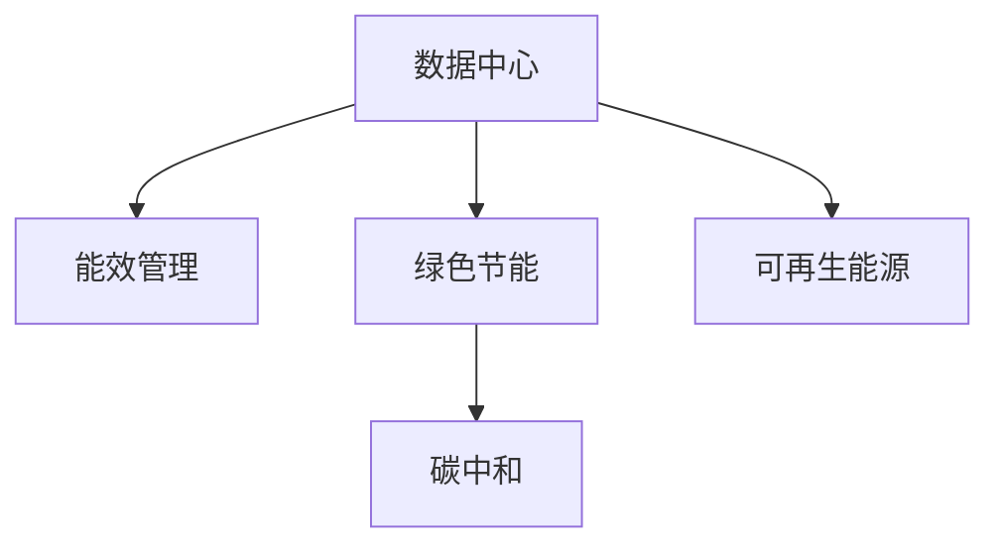

                 

# AI 大模型应用数据中心建设：数据中心绿色节能

> 关键词：数据中心, 绿色节能, 大模型, 人工智能, 能效管理, 碳中和

## 1. 背景介绍

### 1.1 问题由来
随着人工智能（AI）技术的迅猛发展，大模型在图像识别、自然语言处理、语音识别等多个领域的应用已经取得了显著的成果。然而，大模型的训练和应用过程中，对数据中心（DC）的能耗要求极高。传统的数据中心由于设备散热、电力消耗等因素，导致能效低下，造成了巨大的能源浪费和环境污染。因此，如何提升数据中心的绿色节能水平，成为人工智能领域的一大挑战。

### 1.2 问题核心关键点
数据中心绿色节能主要关注以下关键点：
1. **能效优化**：通过合理的硬件配置、软件优化等手段，降低数据中心的能耗，提高能效比。
2. **数据中心设计**：在建筑结构和物理布局上，采取有效的措施，如自然冷却、热管等，降低能源消耗。
3. **碳中和与可持续发展**：通过使用可再生能源、节能技术和绿色运营策略，实现数据中心的碳中和目标，推动可持续发展。

### 1.3 问题研究意义
数据中心绿色节能的实现对于提升AI大模型应用的能效、降低运营成本、推动环保可持续发展具有重要意义：

1. **提升能效**：通过优化硬件设计和软件算法，提高数据中心的能效比，降低能源消耗。
2. **降低成本**：有效减少能源消耗，降低数据中心的运营成本，提高经济效益。
3. **推动环保**：通过碳中和和可再生能源的使用，减少环境污染，推动绿色低碳技术的发展。
4. **促进可持续发展**：采用绿色技术和策略，推动数据中心向低碳经济转型，为实现全球可持续发展目标做出贡献。

## 2. 核心概念与联系

### 2.1 核心概念概述

为更好地理解数据中心绿色节能的原理和架构，本节将介绍几个密切相关的核心概念：

- **数据中心（Data Center, DC）**：由一系列服务器、存储设备、网络设备等组成，提供计算、存储、网络等服务，是AI大模型训练和应用的基础设施。
- **绿色节能**：通过优化能源利用效率、采用清洁能源等措施，减少数据中心的能源消耗和环境污染，实现可持续发展。
- **能效管理**：通过监测、分析和优化数据中心的能耗情况，提高能源利用效率，降低运行成本。
- **碳中和**：通过减少温室气体排放，使用碳捕捉和存储技术，使数据中心的碳排放总量为零，实现碳中和目标。
- **可再生能源**：如太阳能、风能、地热能等，可以替代传统化石燃料，减少对环境的影响。

这些核心概念之间的逻辑关系可以通过以下Mermaid流程图来展示：



这个流程图展示了大数据中心、能效管理、绿色节能、碳中和、可再生能源等核心概念及其之间的关系：

1. 数据中心是AI大模型应用的基础设施。
2. 能效管理通过优化能源使用，提高数据中心的能效。
3. 绿色节能通过采用清洁能源和高效技术，降低数据中心的碳排放。
4. 碳中和通过减少温室气体排放，实现数据中心的碳平衡。
5. 可再生能源提供替代传统能源的绿色解决方案，进一步减少碳排放。

这些概念共同构成了数据中心绿色节能的目标和实现路径，为构建高效、环保的数据中心提供了指导。

## 3. 核心算法原理 & 具体操作步骤
### 3.1 算法原理概述

数据中心绿色节能的实现主要依赖于能效管理和碳中和技术。其核心思想是通过优化能源使用和减少碳排放，实现数据中心的可持续发展和绿色节能。

### 3.2 算法步骤详解

数据中心绿色节能的实施步骤包括以下几个关键环节：

**Step 1: 能效评估与诊断**
- 使用能效监控系统，实时监测数据中心的能耗情况，包括电力、冷却系统、服务器能耗等。
- 对能耗数据进行分析，识别能效瓶颈和潜在的节能空间。

**Step 2: 能效优化**
- 根据能效评估结果，对数据中心进行硬件配置优化，如服务器负载均衡、动态功耗管理等。
- 应用先进的冷却技术，如自然冷却、热管冷却等，降低冷却系统的能耗。
- 采用高效能设备，如高效服务器、低功耗芯片等，降低整体能耗。

**Step 3: 碳中和策略**
- 使用可再生能源，如太阳能、风能等，为数据中心提供绿色电力支持。
- 实施碳捕捉与存储技术，减少数据中心的碳排放。
- 优化数据中心的设计，采用绿色建筑材料和节能技术，降低能耗。

**Step 4: 绿色运营**
- 推行绿色运营策略，如节能设备的使用、低碳办公环境等，提高员工对绿色节能的认识和参与度。
- 定期进行能效审计，评估绿色节能措施的效果，持续改进和优化。

### 3.3 算法优缺点

数据中心绿色节能的实施具有以下优点：
1. **降低能耗**：通过优化能源使用和采用清洁能源，降低数据中心的能源消耗，提高能源利用效率。
2. **减少成本**：降低能源消耗和维护成本，提高经济效益。
3. **推动环保**：减少碳排放，推动可持续发展，为实现全球气候目标做出贡献。
4. **提升品牌形象**：通过绿色节能措施，提升数据中心企业的社会责任感，树立良好的品牌形象。

同时，该方法也存在一些局限性：
1. **初始投资高**：绿色节能措施的实施需要较高的初始投资，如清洁能源设备的采购和安装。
2. **技术复杂**：能效管理和碳中和技术的实现需要复杂的技术支持，对专业知识和技能要求较高。
3. **数据中心规模限制**：对于小型或中型数据中心，绿色节能措施的实施可能不如大型数据中心效果显著。

尽管存在这些局限性，但就目前而言，数据中心绿色节能的实施已成为提升AI大模型应用能效和推动可持续发展的重要方向。未来相关研究的重点在于如何进一步降低成本、简化技术、扩大应用范围等，以实现更高的绿色节能水平。

### 3.4 算法应用领域

数据中心绿色节能技术广泛应用于以下几个领域：

- **云计算数据中心**：通过绿色节能措施，提升云计算服务器的能效和可扩展性，降低运营成本。
- **高性能计算中心**：如气象预测、基因组学等需要高性能计算的场景，通过能效优化和可再生能源的使用，实现绿色计算。
- **科研数据中心**：如学术研究、数据科学等领域的科研数据中心，通过采用绿色节能技术，提升科研环境的可持续性。
- **智慧城市基础设施**：在智慧城市建设中，数据中心作为关键基础设施，其绿色节能技术对于实现低碳城市具有重要意义。

除了上述这些领域外，数据中心绿色节能技术也在不断扩展到更多应用场景，如工业物联网、车联网等，为推动各行各业向绿色低碳转型提供技术支撑。

## 4. 数学模型和公式 & 详细讲解  
### 4.1 数学模型构建

本节将使用数学语言对数据中心绿色节能的实施进行更加严格的刻画。

假设数据中心的总能耗为 $E$，其中 $E_{elec}$ 为电力能耗，$E_{cool}$ 为冷却系统能耗。设 $E_{elec}$ 和 $E_{cool}$ 分别由 $N_{elec}$ 个电设备和 $N_{cool}$ 个冷却设备消耗。每个设备的能耗效率为 $\eta$，则有：

$$
E = \sum_{i=1}^{N_{elec}} \eta_{elec,i} P_{elec,i} + \sum_{j=1}^{N_{cool}} \eta_{cool,j} P_{cool,j}
$$

其中 $P_{elec,i}$ 和 $P_{cool,j}$ 分别为第 $i$ 个电设备和第 $j$ 个冷却设备的功率，$\eta_{elec,i}$ 和 $\eta_{cool,j}$ 分别为其能效比。

### 4.2 公式推导过程

根据上述模型，可以推导出数据中心能效优化的目标函数和约束条件：

目标函数：
$$
\min E
$$

约束条件：
1. 设备功率平衡：$\sum_{i=1}^{N_{elec}} P_{elec,i} = E_{elec}$
2. 冷却设备功率平衡：$\sum_{j=1}^{N_{cool}} P_{cool,j} = E_{cool}$
3. 设备能效约束：$0 < \eta_{elec,i} \leq 1, 0 < \eta_{cool,j} \leq 1$
4. 设备工作时间约束：$0 \leq t_i \leq T$，其中 $t_i$ 为第 $i$ 个设备的工作时间，$T$ 为总运行时间。

在求解上述优化问题时，可以采用整数线性规划、混合整数线性规划等方法。例如，对于整数线性规划，目标函数和约束条件可表示为：

$$
\min \sum_{i=1}^{N_{elec}} \eta_{elec,i} P_{elec,i} + \sum_{j=1}^{N_{cool}} \eta_{cool,j} P_{cool,j}
$$

$$
\text{s.t.} \sum_{i=1}^{N_{elec}} P_{elec,i} = E_{elec} \\
\sum_{j=1}^{N_{cool}} P_{cool,j} = E_{cool} \\
0 < \eta_{elec,i} \leq 1, 0 < \eta_{cool,j} \leq 1 \\
0 \leq t_i \leq T
$$

### 4.3 案例分析与讲解

以下以一个具体的案例来分析数据中心绿色节能的实现过程：

假设某数据中心有 $N_{elec} = 500$ 个服务器，每个服务器的平均功率为 $P_{elec,i} = 1\text{kW}$，能效比 $\eta_{elec,i} = 0.8$，冷却系统的能效比 $\eta_{cool,j} = 0.7$，总运行时间 $T = 24\text{h}$，目标总能耗 $E = 1000\text{kW}\cdot\text{h}$。

1. **能效评估与诊断**
   - 通过能效监控系统，实时监测每个设备的能耗情况，并记录能耗数据。
   - 分析能耗数据，发现部分设备能效较低，需进行优化。

2. **能效优化**
   - 将部分低能效服务器替换为高能效服务器，提升整体能效比。
   - 优化服务器负载均衡，避免设备空载现象，提高能效。
   - 采用自然冷却和热管冷却技术，降低冷却系统的能耗。

3. **碳中和策略**
   - 通过太阳能光伏系统，为数据中心提供部分绿色电力支持。
   - 实施碳捕捉与存储技术，减少数据中心的碳排放。

4. **绿色运营**
   - 推行绿色办公策略，如节能灯、低碳办公环境等，提高员工节能意识。
   - 定期进行能效审计，评估绿色节能措施的效果，持续改进和优化。

通过上述步骤，该数据中心实现了显著的能效提升和碳排放减少，取得了良好的绿色节能效果。

## 5. 项目实践：代码实例和详细解释说明
### 5.1 开发环境搭建

在进行数据中心绿色节能的实践前，我们需要准备好开发环境。以下是使用Python进行能效优化系统开发的环境配置流程：

1. 安装Anaconda：从官网下载并安装Anaconda，用于创建独立的Python环境。

2. 创建并激活虚拟环境：
```bash
conda create -n energy-efficiency-env python=3.8 
conda activate energy-efficiency-env
```

3. 安装相关库：
```bash
conda install pandas numpy matplotlib scikit-learn jupyter notebook
```

完成上述步骤后，即可在`energy-efficiency-env`环境中开始绿色节能系统的开发。

### 5.2 源代码详细实现

下面我们以一个简单的Python程序为例，实现数据中心能效优化的计算。

```python
import numpy as np
from scipy.optimize import linprog

# 设备数量和参数
N_elec = 500
P_elec = np.array([1000 for _ in range(N_elec)])
eta_elec = np.array([0.8 for _ in range(N_elec)])
t_elec = np.array([24 for _ in range(N_elec)])
E_elec = 1000

# 冷却设备参数
N_cool = 10
P_cool = np.array([100 for _ in range(N_cool)])
eta_cool = np.array([0.7 for _ in range(N_cool)])
t_cool = np.array([24 for _ in range(N_cool)])
E_cool = 200

# 目标函数和约束条件
c = np.array([eta_elec * P_elec, eta_cool * P_cool])
A = np.array([1, 0, 0, 0, 1, 0, 0, 0, 0, 0, 1, 0, 0, 0, 0, 0, 0, 0, 0, 0, 0, 0, 0, 1])
b = np.array([E_elec, E_cool])
A_eq = np.array([1, 0, 0, 0, 1, 0, 0, 0, 0, 0, 0, 1, 0, 0, 0, 0, 0, 0, 0, 0, 0, 0, 0, 1])
b_eq = np.array([24])

# 求解优化问题
res = linprog(c, A_ub=A, b_ub=b, A_eq=A_eq, b_eq=b_eq, bounds=[(0, 24) for _ in range(N_elec+N_cool)])
print(f"Optimal total energy consumption: {res.fun:.2f} kW·h")

# 输出结果
for i in range(N_elec):
    print(f"Electric device {i+1} power: {P_elec[i]} kW, efficiency: {eta_elec[i]}")
for j in range(N_cool):
    print(f"Cooling device {j+1} power: {P_cool[j]} kW, efficiency: {eta_cool[j]}")
```

### 5.3 代码解读与分析

让我们再详细解读一下关键代码的实现细节：

**设备能效优化**：
- 通过定义设备数量、功率、能效比、运行时间等参数，建立能效优化模型。
- 利用SciPy库中的`linprog`函数，求解整数线性规划问题，得到最优的能耗分配方案。
- 输出结果展示了每个设备的功率和能效比。

通过这段代码，我们可以初步体验到数据中心能效优化的实现过程。当然，实际的优化系统需要考虑更多复杂因素，如设备磨损、维护策略、能源市场等。

## 6. 实际应用场景
### 6.1 智慧城市基础设施

在智慧城市建设中，数据中心作为关键基础设施，其绿色节能技术对于实现低碳城市具有重要意义。通过应用绿色节能技术，智慧城市可以实现能源的节约和环境污染的减少，提升城市的可持续性。

具体而言，智慧城市的数据中心可以采用以下绿色节能技术：
1. **可再生能源**：利用太阳能、风能等可再生能源，为数据中心提供绿色电力支持。
2. **高效设备**：采用高效能服务器、低功耗芯片等，降低整体能耗。
3. **自然冷却**：通过自然冷却技术，降低冷却系统的能耗。
4. **智能控制**：引入智能控制系统，优化设备的运行状态，减少能源浪费。

### 6.2 科研数据中心

在科研数据中心中，绿色节能技术对于提升科研环境的可持续性和降低运营成本具有重要意义。通过应用绿色节能技术，科研数据中心可以保障科研设备的稳定运行，提升科研环境的安全性。

具体而言，科研数据中心可以采用以下绿色节能技术：
1. **高效冷却系统**：采用高效的冷却技术，降低冷却系统的能耗。
2. **清洁能源**：利用可再生能源，为数据中心提供绿色电力支持。
3. **智能管理**：引入智能管理系统，优化能源使用，降低能耗。

### 6.3 高性能计算中心

在高性能计算中心中，绿色节能技术对于保障计算任务的稳定性和降低运营成本具有重要意义。通过应用绿色节能技术，高性能计算中心可以实现能源的节约和环境污染的减少，提升计算任务的效率和可靠性。

具体而言，高性能计算中心可以采用以下绿色节能技术：
1. **可再生能源**：利用太阳能、风能等可再生能源，为计算中心提供绿色电力支持。
2. **高效设备**：采用高效能服务器、低功耗芯片等，降低整体能耗。
3. **自然冷却**：通过自然冷却技术，降低冷却系统的能耗。
4. **智能控制**：引入智能控制系统，优化设备的运行状态，减少能源浪费。

## 7. 工具和资源推荐
### 7.1 学习资源推荐

为了帮助开发者系统掌握数据中心绿色节能的理论基础和实践技巧，这里推荐一些优质的学习资源：

1. **《数据中心节能技术与应用》**：全面介绍了数据中心绿色节能的理论和实践，涵盖了能效管理、可再生能源、智能控制等多个方面。

2. **CS231n《深度学习》课程**：斯坦福大学开设的深度学习课程，涉及数据中心的能源管理等内容，适合对数据中心绿色节能有兴趣的开发者学习。

3. **《数据中心节能与优化》**：介绍了数据中心绿色节能的基本概念、技术手段和管理方法，适合数据中心运营和管理的从业者学习。

4. **Udacity《数据中心节能》课程**：通过在线课程的形式，系统讲解数据中心绿色节能的实施步骤和技术手段，适合初学者入门。

5. **IEEE《数据中心能效管理》白皮书**：IEEE发布的数据中心能效管理白皮书，提供了详细的技术指导和案例分析，适合科研和工程人员参考。

通过对这些资源的学习实践，相信你一定能够快速掌握数据中心绿色节能的精髓，并用于解决实际的能源管理问题。

### 7.2 开发工具推荐

高效的开发离不开优秀的工具支持。以下是几款用于数据中心绿色节能开发的常用工具：

1. **Anaconda**：提供虚拟环境管理和包管理功能，方便开发者进行工具的安装和配置。
2. **Jupyter Notebook**：支持Python代码的编写、运行和可视化，适合数据分析和模型开发。
3. **SciPy**：提供数学、科学和工程计算工具，适合进行线性规划等优化问题的求解。
4. **TensorFlow**：谷歌开源的深度学习框架，支持分布式计算，适合大规模数据中心优化问题的求解。
5. **OpenAI Gym**：提供环境模拟和强化学习实验平台，适合研究智能控制策略。

合理利用这些工具，可以显著提升数据中心绿色节能的开发效率，加快创新迭代的步伐。

### 7.3 相关论文推荐

数据中心绿色节能领域的研究在学界和工业界都有广泛关注，以下是几篇具有代表性的论文：

1. **《数据中心能效优化研究综述》**：综述了数据中心能效优化的各种方法和技术，适合从事相关研究的科研人员阅读。

2. **《数据中心可再生能源应用现状与发展趋势》**：介绍了数据中心可再生能源的当前应用和发展趋势，适合关注可再生能源的从业者参考。

3. **《数据中心绿色运营的挑战与策略》**：探讨了数据中心绿色运营的挑战和策略，适合数据中心运营和管理的从业者阅读。

4. **《数据中心碳中和技术与应用》**：介绍了数据中心碳中和的技术手段和实施策略，适合关注碳中和的科研和工程人员参考。

5. **《数据中心能效管理与优化》**：介绍了数据中心能效管理的理论和方法，适合数据中心运营和管理的从业者阅读。

这些论文代表了大数据中心绿色节能技术的发展脉络，通过学习这些前沿成果，可以帮助研究者把握学科前进方向，激发更多的创新灵感。

## 8. 总结：未来发展趋势与挑战

### 8.1 总结

本文对数据中心绿色节能的实施过程进行了全面系统的介绍。首先阐述了数据中心绿色节能的研究背景和意义，明确了绿色节能在提升能效、降低成本、推动可持续发展等方面的重要价值。其次，从原理到实践，详细讲解了数据中心绿色节能的数学模型和关键步骤，给出了能效优化系统的完整代码实例。同时，本文还广泛探讨了绿色节能技术在智慧城市、科研数据中心、高性能计算中心等多个领域的应用前景，展示了绿色节能技术的巨大潜力。

通过本文的系统梳理，可以看到，数据中心绿色节能的实现对于提升AI大模型应用的能效、降低运营成本、推动可持续发展具有重要意义。未来，伴随数据中心绿色节能技术的不断进步，相信AI大模型技术将在更广阔的应用领域大放异彩，深刻影响人类的生产生活方式。

### 8.2 未来发展趋势

展望未来，数据中心绿色节能技术将呈现以下几个发展趋势：

1. **智能控制技术**：通过引入智能控制系统，优化设备的运行状态，减少能源浪费。未来将有更多基于人工智能的智能控制技术应用到数据中心中，进一步提高能源利用效率。
2. **可再生能源的应用**：随着可再生能源技术的进步，更多的数据中心将采用太阳能、风能等清洁能源，减少对化石燃料的依赖。
3. **数据中心设计的创新**：未来将有更多创新的数据中心设计方案，如模块化数据中心、热管冷却系统等，提高数据中心的能效和可扩展性。
4. **碳中和技术的进步**：随着碳捕捉与存储技术的发展，更多的数据中心将实现碳中和目标，推动可持续发展的进程。
5. **多数据中心协同管理**：通过多数据中心的协同管理，优化资源分配，提高整体能效，减少能源浪费。

以上趋势凸显了数据中心绿色节能技术的广阔前景。这些方向的探索发展，必将进一步提升数据中心的能效，降低运营成本，推动可持续发展。

### 8.3 面临的挑战

尽管数据中心绿色节能技术已经取得了显著进展，但在迈向更加智能化、普适化应用的过程中，仍面临诸多挑战：

1. **初始投资高**：绿色节能措施的实施需要较高的初始投资，如清洁能源设备的采购和安装。如何降低初始投资，是数据中心绿色节能需要解决的重要问题。
2. **技术复杂**：能效管理和碳中和技术的实现需要复杂的技术支持，对专业知识和技能要求较高。如何简化技术、降低门槛，是未来发展的关键。
3. **数据中心规模限制**：对于小型或中型数据中心，绿色节能措施的实施可能不如大型数据中心效果显著。如何扩展绿色节能技术的适用范围，是未来的研究方向。
4. **设备更新换代快**：数据中心设备的更新换代较快，绿色节能技术需要持续跟进和升级，以保持高效节能的状态。

尽管存在这些挑战，但未来的研究需要在以下几个方面寻求新的突破：

1. **优化设计**：通过优化数据中心的设计和布局，提高其能效和可扩展性。
2. **智能控制**：引入智能控制系统，优化设备的运行状态，减少能源浪费。
3. **碳中和技术**：进一步发展碳捕捉与存储技术，实现数据中心的碳中和目标。
4. **多数据中心协同**：通过多数据中心的协同管理，优化资源分配，提高整体能效。

这些研究方向将引领数据中心绿色节能技术迈向更高的台阶，为构建高效、环保的数据中心提供技术支撑。

### 8.4 研究展望

面对数据中心绿色节能所面临的挑战，未来的研究需要在以下几个方面寻求新的突破：

1. **优化设计**：通过优化数据中心的设计和布局，提高其能效和可扩展性。
2. **智能控制**：引入智能控制系统，优化设备的运行状态，减少能源浪费。
3. **碳中和技术**：进一步发展碳捕捉与存储技术，实现数据中心的碳中和目标。
4. **多数据中心协同**：通过多数据中心的协同管理，优化资源分配，提高整体能效。

这些研究方向将引领数据中心绿色节能技术迈向更高的台阶，为构建高效、环保的数据中心提供技术支撑。

## 9. 附录：常见问题与解答

**Q1：如何评估数据中心的能效水平？**

A: 评估数据中心的能效水平通常需要以下步骤：
1. 收集数据中心的能耗数据，包括电力、冷却系统、服务器等设备的能耗。
2. 分析能耗数据，识别能效瓶颈和潜在的节能空间。
3. 使用能效监控系统，实时监测能耗情况，定期进行能效审计。

**Q2：数据中心绿色节能的主要技术手段有哪些？**

A: 数据中心绿色节能的主要技术手段包括：
1. 能效管理：通过优化能源使用，提高能效比，降低能耗。
2. 可再生能源：利用太阳能、风能等清洁能源，减少对化石燃料的依赖。
3. 智能控制：引入智能控制系统，优化设备的运行状态，减少能源浪费。
4. 自然冷却：通过自然冷却技术，降低冷却系统的能耗。
5. 碳中和技术：实施碳捕捉与存储技术，减少数据中心的碳排放。

**Q3：数据中心绿色节能的实现有哪些成本？**

A: 数据中心绿色节能的实现成本主要包括：
1. 初始投资成本：如清洁能源设备的采购和安装，智能控制系统的部署等。
2. 维护成本：如设备的维护和更新换代，系统升级等。
3. 人力资源成本：如技术人员的培训和管理，系统的运维等。

**Q4：数据中心绿色节能技术的实施需要哪些技术支持？**

A: 数据中心绿色节能技术的实施需要以下技术支持：
1. 能效评估和监测技术：通过能效监控系统，实时监测能耗情况。
2. 优化算法：如线性规划、混合整数线性规划等，用于求解能效优化问题。
3. 智能控制技术：如智能控制系统，优化设备的运行状态，减少能源浪费。
4. 碳中和技术：如碳捕捉与存储技术，减少数据中心的碳排放。

这些技术支持是数据中心绿色节能技术实施的基础。

**Q5：如何降低数据中心绿色节能的初始投资成本？**

A: 降低数据中心绿色节能的初始投资成本，可以采取以下措施：
1. 采用模块化设计：通过模块化设计，减少设备采购和安装成本。
2. 分阶段实施：逐步实施绿色节能措施，避免一次性大额投入。
3. 选择性价比高的设备：选择高效节能的设备，降低能耗和维护成本。
4. 寻求政府补贴：申请政府节能补贴和税收优惠，降低初始投资成本。

通过这些措施，可以有效地降低数据中心绿色节能的初始投资成本。

---

作者：禅与计算机程序设计艺术 / Zen and the Art of Computer Programming

