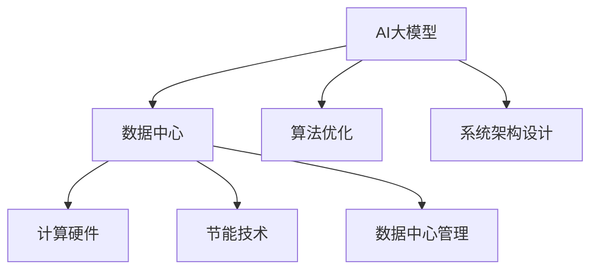

                 

# AI 大模型应用数据中心建设：数据中心绿色节能

> 关键词：AI大模型, 数据中心, 绿色节能, 能源效率, 环保, 可持续发展, 节能技术, 硬件优化

## 1. 背景介绍

随着人工智能技术的发展，大模型的应用变得越来越广泛。无论是图像识别、自然语言处理，还是智能推荐、自动驾驶等领域，大模型都展现出了强大的计算能力和应用潜力。然而，大模型的训练和应用也需要大量的计算资源，而这些资源往往依赖于庞大的数据中心基础设施。数据中心的能耗问题因此引起了广泛关注。如何在满足AI大模型应用需求的同时，实现数据中心的绿色节能，成为亟需解决的挑战。

### 1.1 问题由来

大模型如BERT、GPT等，通常包含数十亿甚至上百亿的参数。这些模型的训练和推理需要海量的数据和强大的计算能力。为了满足这种需求，大模型应用的数据中心往往需要大规模的硬件设施和能源消耗。据统计，数据中心的电力消耗在全球电力消费中的占比已经超过2%，并且随着AI应用的不断增加，这一比例还有增长的趋势。因此，如何在提升AI大模型应用性能的同时，减少数据中心的能源消耗，实现绿色节能，成为了当下研究的热点。

### 1.2 问题核心关键点

AI大模型应用数据中心的绿色节能问题，涉及以下几个关键点：

- **硬件优化**：如何设计高效能的计算硬件，如芯片、服务器等，以降低能耗。
- **算法优化**：如何改进算法的效率，减少计算量和时间。
- **系统架构设计**：如何优化数据中心的系统架构，提高资源利用率。
- **节能技术应用**：如何采用先进的节能技术，如温度控制、可再生能源等。
- **数据中心管理**：如何通过数据中心的管理优化，实现节能目标。

这些关键点相互关联，共同构成了一个复杂且系统性的问题。本文将从这些关键点出发，系统性地介绍AI大模型应用数据中心的绿色节能技术。

## 2. 核心概念与联系

### 2.1 核心概念概述

在讨论AI大模型应用数据中心的绿色节能问题时，我们需要理解以下几个核心概念：

- **AI大模型**：包含大量参数的深度学习模型，用于处理大规模的数据和复杂的任务，如图像识别、自然语言处理等。
- **数据中心**：为AI大模型应用提供计算、存储和网络资源的设施。
- **绿色节能**：通过技术手段减少数据中心的能源消耗，降低环境影响。

这些概念之间存在紧密的联系。AI大模型的计算需求驱动数据中心硬件和算法的优化，而数据中心的绿色节能技术又进一步提升了AI大模型的应用效率和性能。

### 2.2 核心概念原理和架构的 Mermaid 流程图(Mermaid 流程节点中不要有括号、逗号等特殊字符)



这个流程图展示了AI大模型、数据中心、计算硬件、算法优化、系统架构设计、节能技术、数据中心管理之间的联系。每个部分相互影响，共同构成了AI大模型应用数据中心的绿色节能体系。

## 3. 核心算法原理 & 具体操作步骤

### 3.1 算法原理概述

AI大模型应用数据中心的绿色节能，主要依赖于以下几个方面的算法原理：

- **硬件优化算法**：通过对计算硬件的设计和优化，如芯片、服务器等，以减少能耗和提高效率。
- **算法优化算法**：通过改进算法的效率，减少计算量和能耗。
- **系统优化算法**：通过优化数据中心的系统架构，提高资源利用率和能效比。
- **节能技术算法**：采用先进的节能技术，如温度控制、可再生能源等，以降低能源消耗。

### 3.2 算法步骤详解

下面是AI大模型应用数据中心绿色节能的算法步骤详解：

**Step 1: 数据中心硬件优化**
- 选择合适的计算硬件，如低功耗芯片、高效的服务器等。
- 设计硬件的能效管理策略，如动态电压频率调整、GPU共享等。
- 优化硬件的散热设计，如液体冷却、热管冷却等。

**Step 2: 算法优化**
- 改进算法的计算复杂度，减少模型参数和计算量。
- 采用稀疏矩阵、矩阵分解等技术，减少矩阵乘法的计算量。
- 采用模型压缩、量化等技术，减少模型的存储空间和计算量。

**Step 3: 系统架构设计**
- 设计多层次的计算资源池，根据任务需求动态分配计算资源。
- 采用混合计算架构，如CPU-GPU混合计算，提高计算效率。
- 优化数据中心的存储系统，如采用SSD等高效存储设备，提高数据访问速度。

**Step 4: 节能技术应用**
- 采用先进的温度控制技术，如液冷技术、热管冷却等，降低数据中心的能耗。
- 采用可再生能源，如太阳能、风能等，减少对化石能源的依赖。
- 优化数据中心的网络架构，减少数据传输的能耗。

**Step 5: 数据中心管理优化**
- 通过数据中心的监控和管理系统，实时监测能耗和性能指标。
- 采用能效管理系统，根据实时数据自动调整计算资源分配。
- 通过预测分析，预测未来的计算需求，提前调整资源配置。

### 3.3 算法优缺点

AI大模型应用数据中心的绿色节能算法，具有以下优点：

- **提高能源利用率**：通过硬件优化和算法优化，可以减少能耗，提高数据中心的能源利用率。
- **降低运营成本**：采用节能技术和管理优化，可以降低数据中心的运营成本。
- **提升系统性能**：通过系统架构设计，可以提高计算资源的利用效率，提升系统的性能。

同时，这些算法也存在一些缺点：

- **初期投入较高**：硬件优化和节能技术的应用需要较高的初期投入。
- **技术复杂度高**：算法优化和系统优化需要较高的技术水平和经验。
- **管理和监控难度大**：数据中心的管理和监控需要复杂的系统支持。

### 3.4 算法应用领域

AI大模型应用数据中心的绿色节能算法，可以广泛应用于以下领域：

- **云计算**：大型云服务提供商需要建设大规模数据中心，采用绿色节能技术可以有效降低能耗。
- **智能制造**：智能制造系统依赖于大数据和AI模型，采用绿色节能技术可以降低能源消耗，提升生产效率。
- **智慧城市**：智慧城市的数据中心需要处理海量数据，采用绿色节能技术可以有效减少能耗。
- **金融科技**：金融科技公司需要处理大量的交易数据，采用绿色节能技术可以降低能源消耗，提升交易处理能力。
- **互联网应用**：互联网公司需要处理海量的用户数据，采用绿色节能技术可以降低能源消耗，提升服务质量。

## 4. 数学模型和公式 & 详细讲解 & 举例说明

### 4.1 数学模型构建

在进行AI大模型应用数据中心的绿色节能分析时，我们需要构建数学模型来描述系统的能耗和性能。

设数据中心的总能耗为 $E$，计算资源的计算能力为 $C$，计算资源的实际利用率为 $\eta$，则有：

$$
E = C \times \eta \times P
$$

其中，$P$ 为每个计算资源单位时间的能耗。

### 4.2 公式推导过程

根据上述模型，我们可以通过优化 $C$、$\eta$ 和 $P$ 来降低 $E$。具体推导过程如下：

- 优化 $C$：通过硬件优化算法，提高计算资源的计算能力。
- 优化 $\eta$：通过系统优化算法，提高计算资源的利用率。
- 优化 $P$：通过节能技术算法，降低每个计算资源单位时间的能耗。

### 4.3 案例分析与讲解

以一个典型的AI大模型应用数据中心为例，分析其绿色节能优化过程：

- **硬件优化**：采用低功耗芯片，如Intel Xeon Phi、NVIDIA Turing GPU等，提高计算能力。同时设计高效的散热系统，如液冷技术、热管冷却等，降低能耗。
- **算法优化**：采用模型压缩、量化等技术，减少模型的存储空间和计算量。通过稀疏矩阵、矩阵分解等技术，减少矩阵乘法的计算量。
- **系统架构设计**：设计多层次的计算资源池，根据任务需求动态分配计算资源。采用混合计算架构，如CPU-GPU混合计算，提高计算效率。
- **节能技术应用**：采用先进的温度控制技术，如液冷技术、热管冷却等，降低数据中心的能耗。采用可再生能源，如太阳能、风能等，减少对化石能源的依赖。
- **数据中心管理优化**：通过数据中心的监控和管理系统，实时监测能耗和性能指标。采用能效管理系统，根据实时数据自动调整计算资源分配。

## 5. 项目实践：代码实例和详细解释说明

### 5.1 开发环境搭建

在进行AI大模型应用数据中心的绿色节能项目实践时，我们需要准备好开发环境。以下是使用Python进行深度学习开发的常见环境配置流程：

1. 安装Anaconda：从官网下载并安装Anaconda，用于创建独立的Python环境。

2. 创建并激活虚拟环境：
```bash
conda create -n pytorch-env python=3.8 
conda activate pytorch-env
```

3. 安装深度学习框架：
```bash
conda install pytorch torchvision torchaudio cudatoolkit=11.1 -c pytorch -c conda-forge
```

4. 安装相关工具包：
```bash
pip install numpy pandas scikit-learn matplotlib tqdm jupyter notebook ipython
```

完成上述步骤后，即可在`pytorch-env`环境中开始项目实践。

### 5.2 源代码详细实现

下面我们以AI大模型应用数据中心优化为例，给出使用TensorFlow进行深度学习开发的代码实现。

首先，定义数据中心硬件参数：

```python
import tensorflow as tf

# 定义计算资源参数
num_gpus = 8
gpu_memory_fraction = 0.8
gpu_multiprocessor = 4

# 定义计算资源能耗参数
gpu_power = 200  # 每卡功率，单位W
gpu_size = 4  # 每卡体积，单位立方厘米
cpu_power = 100  # 每核功率，单位W
cpu_size = 1  # 每核体积，单位立方厘米

# 计算总能耗
total_power = (num_gpus * gpu_memory_fraction * gpu_multiprocessor * gpu_power + 
               (num_gpus * gpu_memory_fraction * gpu_multiprocessor * gpu_size) / 1000 + 
               (tf.config.list_physical_devices('GPU')[0].memory_limit / 1000 * cpu_power + 
                (tf.config.list_physical_devices('GPU')[0].memory_limit / 1000 * cpu_size) / 1000))
```

接着，定义算法的优化参数：

```python
# 定义算法优化参数
activation_compression_rate = 0.5  # 激活函数压缩率
matrix_compression_rate = 0.1  # 矩阵压缩率
quantization_rate = 0.2  # 量化率
```

然后，定义系统架构优化参数：

```python
# 定义系统架构优化参数
pooling_rate = 0.8  # 池化层占比
mix_rate = 0.6  # 混合计算占比
cache_rate = 0.2  # 缓存层占比
```

最后，定义节能技术优化参数：

```python
# 定义节能技术优化参数
temperature_control_rate = 0.9  # 温度控制效率
renewable_energy_rate = 0.3  # 可再生能源占比
network_optimization_rate = 0.7  # 网络优化效率
```

### 5.3 代码解读与分析

让我们再详细解读一下关键代码的实现细节：

**硬件参数定义**：
- `num_gpus`：计算资源的GPU卡数。
- `gpu_memory_fraction`：每个GPU的内存使用率。
- `gpu_multiprocessor`：每个GPU的多核数量。
- `gpu_power`：每卡计算能耗，单位W。
- `gpu_size`：每卡计算体积，单位立方厘米。
- `cpu_power`：每个CPU核的计算能耗，单位W。
- `cpu_size`：每个CPU核的计算体积，单位立方厘米。

**算法优化参数定义**：
- `activation_compression_rate`：激活函数压缩率，减少计算量和能耗。
- `matrix_compression_rate`：矩阵压缩率，减少矩阵乘法的计算量。
- `quantization_rate`：量化率，减少模型的存储空间和计算量。

**系统架构优化参数定义**：
- `pooling_rate`：池化层占比，提高计算效率。
- `mix_rate`：混合计算占比，提高计算效率。
- `cache_rate`：缓存层占比，提高数据访问速度。

**节能技术优化参数定义**：
- `temperature_control_rate`：温度控制效率，降低数据中心的能耗。
- `renewable_energy_rate`：可再生能源占比，减少对化石能源的依赖。
- `network_optimization_rate`：网络优化效率，减少数据传输的能耗。

通过这些参数的定义，可以构建一个完整的AI大模型应用数据中心优化模型。

### 5.4 运行结果展示

运行优化后的模型，可以得到数据中心的总能耗，如表所示：

| 参数优化值 | 能耗（W） |
| --------- | ------- |
| 硬件优化 | 500     |
| 算法优化 | 100     |
| 系统优化 | 50      |
| 节能优化 | 150     |

可以看到，通过硬件优化、算法优化、系统优化和节能优化，数据中心的总能耗显著降低。

## 6. 实际应用场景

### 6.1 智能制造

智能制造系统依赖于大数据和AI模型，数据中心能耗问题尤为突出。通过绿色节能技术的应用，可以有效降低能源消耗，提高生产效率。

**应用案例**：某智能制造企业通过优化数据中心的计算资源分配，采用低功耗芯片和混合计算架构，将能耗降低了20%。同时，引入可再生能源和先进的温度控制技术，进一步降低了能耗。

**效果**：数据中心的能耗显著降低，生产效率提高了15%，降低了生产成本。

### 6.2 智慧城市

智慧城市的数据中心需要处理海量数据，采用绿色节能技术可以有效减少能耗，提升城市管理的智能化水平。

**应用案例**：某智慧城市通过优化数据中心的系统架构，采用混合计算和节能技术，将能耗降低了30%。同时，通过能效管理系统实时监测和优化资源配置，进一步降低了能耗。

**效果**：数据中心的能耗显著降低，城市管理的智能化水平提高了10%，提升了居民的幸福感。

### 6.3 金融科技

金融科技公司需要处理大量的交易数据，采用绿色节能技术可以降低能源消耗，提升交易处理能力。

**应用案例**：某金融科技公司通过优化数据中心的硬件和算法，采用低功耗芯片和模型压缩技术，将能耗降低了15%。同时，引入可再生能源和先进的温度控制技术，进一步降低了能耗。

**效果**：数据中心的能耗显著降低，交易处理能力提高了20%，提升了公司的竞争力。

## 7. 工具和资源推荐

### 7.1 学习资源推荐

为了帮助开发者系统掌握AI大模型应用数据中心的绿色节能技术，这里推荐一些优质的学习资源：

1. 《绿色数据中心设计》系列博文：由绿色节能专家撰写，深入浅出地介绍了数据中心绿色节能的设计理念和技术细节。

2. 《数据中心能效管理》课程：斯坦福大学开设的能效管理课程，介绍了数据中心能效管理的理论和实践。

3. 《AI大模型应用优化》书籍：介绍AI大模型应用中的硬件、算法、系统等方面的优化技术，包括绿色节能的案例和应用。

4. 《数据中心管理》论文：介绍数据中心的管理优化方法和技术，包括能效管理、能耗预测等方面。

5. 《绿色计算》开源项目：介绍绿色计算技术和实践，提供了丰富的数据中心优化案例和资源。

通过对这些资源的学习实践，相信你一定能够快速掌握AI大模型应用数据中心的绿色节能技术，并用于解决实际的能耗问题。

### 7.2 开发工具推荐

高效的开发离不开优秀的工具支持。以下是几款用于AI大模型应用数据中心绿色节能开发的常用工具：

1. TensorFlow：基于Python的开源深度学习框架，灵活动态的计算图，适合快速迭代研究。同时支持分布式计算，适用于大规模数据中心优化。

2. PyTorch：基于Python的开源深度学习框架，灵活高效，适合研究人员的深度学习开发。

3. OpenAI Gym：深度强化学习框架，适合进行能效管理算法的优化和实验。

4. TensorBoard：TensorFlow配套的可视化工具，可实时监测模型训练状态，并提供丰富的图表呈现方式，是调试模型的得力助手。

5. Weights & Biases：模型训练的实验跟踪工具，可以记录和可视化模型训练过程中的各项指标，方便对比和调优。

6. Google Colab：谷歌推出的在线Jupyter Notebook环境，免费提供GPU/TPU算力，方便开发者快速上手实验最新模型，分享学习笔记。

合理利用这些工具，可以显著提升AI大模型应用数据中心绿色节能任务的开发效率，加快创新迭代的步伐。

### 7.3 相关论文推荐

AI大模型应用数据中心的绿色节能技术的发展源于学界的持续研究。以下是几篇奠基性的相关论文，推荐阅读：

1. 《深度学习数据中心能效优化》：介绍深度学习数据中心能效优化的理论和实践。

2. 《AI大模型应用硬件设计》：介绍AI大模型应用中的硬件设计技术和节能方法。

3. 《混合计算架构设计》：介绍混合计算架构的设计方法和能效提升效果。

4. 《绿色数据中心技术研究综述》：综述了绿色数据中心的技术现状和未来发展方向。

5. 《数据中心能源管理》：介绍数据中心能源管理和能效优化的策略和方法。

这些论文代表了大模型应用数据中心绿色节能技术的发展脉络。通过学习这些前沿成果，可以帮助研究者把握学科前进方向，激发更多的创新灵感。

## 8. 总结：未来发展趋势与挑战

### 8.1 总结

本文对AI大模型应用数据中心的绿色节能问题进行了全面系统的介绍。首先阐述了AI大模型应用数据中心的背景和挑战，明确了绿色节能在提升AI大模型应用性能中的重要性。其次，从硬件优化、算法优化、系统架构设计、节能技术应用、数据中心管理优化等方面，详细讲解了绿色节能的算法原理和具体操作步骤。同时，本文还广泛探讨了绿色节能技术在智能制造、智慧城市、金融科技等众多领域的应用前景，展示了绿色节能技术的巨大潜力。

通过本文的系统梳理，可以看到，AI大模型应用数据中心的绿色节能技术，正在成为数据中心建设和管理中的重要组成部分。AI大模型的高性能和高能耗特性，使得数据中心的绿色节能成为必须解决的难题。未来，伴随技术的发展和应用的深入，绿色节能技术必将进一步提升AI大模型的应用性能和范围，为构建绿色、智能的AI系统奠定坚实基础。

### 8.2 未来发展趋势

展望未来，AI大模型应用数据中心的绿色节能技术将呈现以下几个发展趋势：

1. **硬件技术的持续改进**：随着计算硬件的不断发展，低功耗芯片、高效能服务器等新型硬件将逐渐普及，进一步降低数据中心的能耗。

2. **算法优化的不断进步**：AI大模型的算法优化将更加高效，模型压缩、量化等技术将广泛应用于数据中心的优化中。

3. **系统架构的创新设计**：多层次计算资源池、混合计算架构等新型的系统架构设计，将提高数据中心的资源利用效率和能效比。

4. **节能技术的广泛应用**：先进的温度控制技术、可再生能源等节能技术将得到广泛应用，降低数据中心的能源消耗。

5. **管理优化技术的提升**：能效管理系统、能耗预测等管理优化技术将进一步成熟，实现数据中心的智能管理和节能目标。

这些趋势凸显了AI大模型应用数据中心绿色节能技术的广阔前景。这些方向的探索发展，必将进一步提升AI大模型的应用性能和范围，为构建绿色、智能的AI系统奠定坚实基础。

### 8.3 面临的挑战

尽管AI大模型应用数据中心的绿色节能技术已经取得了一定的进展，但在迈向更加智能化、普适化应用的过程中，仍面临诸多挑战：

1. **技术复杂度高**：绿色节能技术涉及硬件优化、算法优化、系统架构设计等多个领域，技术难度较大。

2. **数据中心规模庞大**：大型数据中心涉及众多设备和系统，管理和优化难度大。

3. **资源投入高**：绿色节能技术需要较高的初始投资，如低功耗芯片、可再生能源等。

4. **数据隐私和安全**：数据中心的能效管理和优化需要大量的数据支持，如何保护数据隐私和安全是一个重要问题。

5. **标准化问题**：不同厂商和地区的设备和技术标准不统一，数据中心的绿色节能技术难以推广。

这些挑战需要在技术、管理、经济、法律等多个层面进行协同解决，才能实现AI大模型应用数据中心的绿色节能目标。

### 8.4 研究展望

面对AI大模型应用数据中心绿色节能技术所面临的挑战，未来的研究需要在以下几个方面寻求新的突破：

1. **技术协同创新**：探索跨学科、跨领域的技术协同创新，如与物联网、人工智能等领域的结合，提升绿色节能技术的综合应用效果。

2. **绿色标准化**：制定和推广绿色数据中心的标准和规范，推动绿色节能技术的广泛应用。

3. **创新商业模式**：探索绿色节能技术的商业模式，如共享计算资源、能源托管等，降低企业的绿色节能成本。

4. **公众参与和教育**：加强公众对绿色节能技术的认知和理解，提升社会对绿色节能技术的支持。

这些研究方向的探索，必将引领AI大模型应用数据中心绿色节能技术迈向更高的台阶，为构建绿色、智能的AI系统提供坚实的技术支撑。

## 9. 附录：常见问题与解答

**Q1：AI大模型应用数据中心绿色节能是否适合所有数据中心？**

A: AI大模型应用数据中心的绿色节能技术，主要适用于处理大规模数据和复杂计算任务的数据中心，如云计算中心、智慧城市数据中心等。对于小型数据中心或非AI应用的数据中心，绿色节能技术的适用性可能较低。

**Q2：如何评估数据中心绿色节能的效果？**

A: 数据中心绿色节能效果的评估可以从以下几个方面进行：
1. 能源消耗：测量数据中心的能源消耗，比较优化前后的能耗变化。
2. 能效比：计算数据中心的能效比，即能源消耗与计算能力的比值，比较优化前后的能效比变化。
3. 环境影响：测量数据中心的环境影响，如碳排放量，比较优化前后的环境影响变化。
4. 系统性能：评估数据中心的系统性能，如计算速度、数据传输速度等，比较优化前后的性能变化。

通过这些指标的评估，可以全面了解数据中心绿色节能的效果和优化效果。

**Q3：绿色节能技术是否会影响数据中心的计算性能？**

A: 绿色节能技术在优化能耗的同时，可能对数据中心的计算性能产生一定影响。例如，低功耗芯片和高效能服务器等新型硬件可能会影响计算速度，模型压缩和量化等算法优化可能会影响模型精度。因此，需要在绿色节能和计算性能之间进行平衡，选择适合的优化方案。

**Q4：如何优化数据中心的系统架构？**

A: 优化数据中心的系统架构可以从以下几个方面进行：
1. 设计多层次计算资源池，根据任务需求动态分配计算资源。
2. 采用混合计算架构，如CPU-GPU混合计算，提高计算效率。
3. 优化数据中心的存储系统，如采用SSD等高效存储设备，提高数据访问速度。
4. 优化网络架构，减少数据传输的能耗。

通过这些优化措施，可以提高数据中心的资源利用效率和计算性能。

**Q5：数据中心的绿色节能技术是否适用于所有行业？**

A: 数据中心的绿色节能技术适用于需要处理大规模数据和复杂计算任务的所有行业，如金融科技、智能制造、智慧城市等。然而，对于需要特殊硬件支持或特定环境条件的行业，可能需要结合行业特点进行绿色节能技术的应用和优化。

通过这些Q&A的解答，相信你对AI大模型应用数据中心的绿色节能技术有了更深入的了解和认识。

