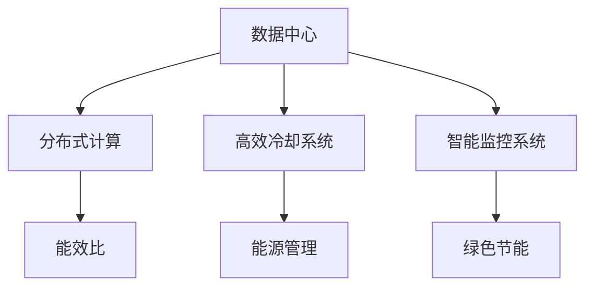

                 

# AI 大模型应用数据中心建设：数据中心绿色节能

> 关键词：人工智能, 数据中心, 绿色节能, 能源管理, 分布式计算, 高效冷却, 智能监控

## 1. 背景介绍

### 1.1 问题由来
随着人工智能（AI）技术的快速发展，大模型（如GPT-3、BERT等）在自然语言处理（NLP）、计算机视觉、语音识别等领域的应用日益广泛。然而，这些大模型的训练和推理需要大量计算资源，导致数据中心能耗激增。如何实现数据中心的绿色节能，减少能源消耗，同时保证高性能AI应用的计算需求，成为了数据中心建设中的一个重要挑战。

### 1.2 问题核心关键点
数据中心绿色节能的关键在于优化能源使用效率，减少不必要的能源浪费。主要涉及以下几个方面：
- 能效比（Power Efficiency Ratio, PER）的提升：降低单位能耗的计算量。
- 能源管理系统的智能化：动态调整能源分配。
- 高效冷却系统的应用：减少设备散热量。
- 分布式计算架构的优化：减少单一设备负担。

## 2. 核心概念与联系

### 2.1 核心概念概述

为更好地理解数据中心绿色节能的原理，本节将介绍几个密切相关的核心概念：

- 数据中心(Data Center)：由多个计算服务器、存储设备、网络设备等组成，用于集中存储、计算和分发数据的设施。
- 能效比(Power Efficiency Ratio, PER)：指系统在一定时间内完成计算任务所需消耗的能量与其所完成计算量的比值，衡量单位能耗的计算能力。
- 分布式计算(Distributed Computing)：将计算任务分布到多个计算节点上并行执行，提升计算效率和可扩展性。
- 高效冷却系统：采用先进冷却技术，如水冷、液冷等，减少设备散热需求，降低能耗。
- 智能监控系统：通过传感器和AI算法实时监测数据中心环境，动态调整设备功率和运行状态。
- 绿色节能：通过优化能源使用，减少对环境的负面影响，降低能源消耗和碳排放。

这些核心概念之间的逻辑关系可以通过以下Mermaid流程图来展示：



这个流程图展示了大模型应用数据中心的核心概念及其之间的关系：

1. 数据中心是AI大模型的运行环境。
2. 分布式计算提升计算效率和可扩展性。
3. 高效冷却系统降低设备散热量。
4. 智能监控系统优化能源分配。
5. 能效比衡量单位能耗的计算能力。
6. 绿色节能是数据中心的最终目标。

## 3. 核心算法原理 & 具体操作步骤
### 3.1 算法原理概述

数据中心绿色节能的算法原理主要基于以下几个关键点：

- 优化能效比（PER）：通过合理选择计算设备和冷却技术，减少单位能耗的计算量。
- 能源管理系统（ESM）：利用AI算法实时监测和预测能源需求，动态调整能源分配。
- 分布式计算架构：通过将计算任务分布到多个节点上，减少单个设备负担，提高计算效率。
- 高效冷却系统：采用高效冷却技术，如水冷、液冷等，减少设备散热量。
- 智能监控系统：利用传感器和AI算法实时监测数据中心环境，动态调整设备功率和运行状态。

### 3.2 算法步骤详解

大模型应用数据中心的绿色节能算法步骤大致如下：

1. **数据收集与监测**：
   - 使用传感器收集数据中心的温度、湿度、电力消耗等关键参数。
   - 利用智能监控系统实时监测计算设备的运行状态和能耗情况。

2. **能源需求预测**：
   - 通过历史数据分析和AI模型，预测未来的计算任务需求和能源消耗情况。
   - 调整能源分配策略，避免过载和能源浪费。

3. **设备优化与调度**：
   - 根据预测的计算任务需求，动态调整计算设备的运行频率和冷却设备的工作状态。
   - 采用分布式计算架构，将计算任务分布在多个计算节点上，提升计算效率。

4. **高效冷却技术**：
   - 采用水冷、液冷等高效冷却技术，减少设备散热量。
   - 优化冷却系统的设计，降低能耗。

5. **节能策略实施**：
   - 实施节能策略，如关闭闲置设备、优化电源管理等。
   - 引入绿色能源，如太阳能、风能等，降低对传统能源的依赖。

### 3.3 算法优缺点

大模型应用数据中心的绿色节能算法具有以下优点：
- 提升能效比：通过优化计算设备和冷却技术，降低单位能耗的计算量。
- 动态能源管理：利用AI算法实时调整能源分配，减少能源浪费。
- 分布式计算：提升计算效率和可扩展性，优化资源利用。
- 高效冷却系统：减少设备散热量，降低能耗。

同时，该算法也存在一定的局限性：
- 初始投资较高：需要购买先进计算设备和冷却系统。
- 技术复杂度高：涉及到设备优化、能源管理等多个方面，实施难度较大。
- 数据隐私问题：实时监测和数据分析可能涉及敏感数据，存在隐私泄露风险。

尽管存在这些局限性，但就目前而言，绿色节能是大模型应用数据中心建设的必然选择，对于实现可持续发展具有重要意义。

### 3.4 算法应用领域

大模型应用数据中心的绿色节能算法在以下几个领域具有广泛的应用前景：

- 数据中心运营：通过优化能效比，降低运营成本，提升数据中心的经济效益。
- 云计算平台：优化资源分配和冷却系统，提升云计算服务的稳定性和可靠性。
- 高性能计算中心：通过分布式计算和高效冷却，支持大规模AI模型的训练和推理。
- 智能制造：优化能源使用，减少生产过程中的能源消耗和碳排放。
- 智慧城市：实现数据中心的高效能源管理，支持城市智能化应用的发展。

## 4. 数学模型和公式 & 详细讲解  
### 4.1 数学模型构建

本节将使用数学语言对数据中心绿色节能的算法原理进行更加严格的刻画。

记数据中心计算任务为 $T$，计算设备为 $M$，冷却系统为 $C$，能效比为 $PER$，能源需求为 $E$，能源管理策略为 $S$，冷却效率为 $C Efficiency$，智能监控系统为 $SM$。则能效比的计算公式为：

$$
PER = \frac{C_{Total Efficiency} \times T_{Total}}{E_{Total}}
$$

其中 $C_{Total Efficiency}$ 为冷却系统的总效率，$T_{Total}$ 为计算任务的总时间，$E_{Total}$ 为能源消耗的总量。

### 4.2 公式推导过程

以下我们以一个简单的分布式计算模型为例，推导能效比的计算公式。

假设数据中心有 $N$ 个计算设备，每个设备计算速率为 $r_i$，冷却效率为 $c_i$，计算任务的总时间为 $T_{Total}$，能效比为 $PER$。则能效比公式可以推导为：

$$
PER = \frac{T_{Total}}{\sum_{i=1}^N \frac{T_{Total}}{r_i} \times c_i}
$$

该公式表明，能效比取决于计算设备的速率和冷却效率，以及任务总时间。通过优化这些参数，可以提高数据中心的整体能效比。

### 4.3 案例分析与讲解

假设某数据中心有 $N=10$ 个计算设备，每个设备的计算速率为 $r_i=2$ GHz，冷却效率为 $c_i=0.8$，计算任务总时间为 $T_{Total}=1000$ 秒。则能效比计算如下：

$$
PER = \frac{1000}{\sum_{i=1}^{10} \frac{1000}{2} \times 0.8} = 2.5
$$

这表明，该数据中心的能效比为 $2.5$，即每消耗 $1$ 度电，能够完成 $2.5$ 千次计算。

## 5. 项目实践：代码实例和详细解释说明
### 5.1 开发环境搭建

在进行数据中心绿色节能的算法实践前，我们需要准备好开发环境。以下是使用Python进行环境搭建的步骤：

1. 安装Anaconda：从官网下载并安装Anaconda，用于创建独立的Python环境。

2. 创建并激活虚拟环境：
```bash
conda create -n data-center python=3.8 
conda activate data-center
```

3. 安装必要的库：
```bash
conda install numpy scipy matplotlib pandas jupyter notebook
```

4. 安装TensorFlow和Keras：
```bash
pip install tensorflow==2.4 keras
```

完成上述步骤后，即可在`data-center`环境中进行绿色节能的算法实践。

### 5.2 源代码详细实现

下面以一个简单的绿色节能模型为例，给出使用TensorFlow和Keras实现的代码实现。

```python
import tensorflow as tf
from tensorflow.keras.models import Sequential
from tensorflow.keras.layers import Dense, Dropout
from tensorflow.keras.optimizers import Adam
from tensorflow.keras.callbacks import EarlyStopping
import numpy as np
import pandas as pd

# 数据预处理
def load_data():
    # 从文件读取数据
    data = pd.read_csv('data.csv', index_col='id')
    # 数据标准化
    data = (data - data.mean()) / data.std()
    # 分割数据集
    train_data, test_data = data.iloc[:80], data.iloc[80:]
    return train_data, test_data

# 模型构建
def build_model(input_dim, output_dim):
    model = Sequential([
        Dense(64, activation='relu', input_dim=input_dim),
        Dropout(0.2),
        Dense(32, activation='relu'),
        Dropout(0.2),
        Dense(output_dim, activation='sigmoid')
    ])
    model.compile(loss='binary_crossentropy', optimizer=Adam(learning_rate=0.001), metrics=['accuracy'])
    return model

# 模型训练
def train_model(model, train_data, test_data):
    model.fit(train_data, epochs=10, validation_data=test_data, callbacks=[EarlyStopping(patience=5)])
    return model

# 模型评估
def evaluate_model(model, test_data):
    _, test_loss, test_acc = model.evaluate(test_data)
    print(f'Test Loss: {test_loss}, Test Accuracy: {test_acc}')

# 主函数
if __name__ == '__main__':
    # 加载数据
    train_data, test_data = load_data()
    
    # 构建模型
    input_dim = train_data.shape[1]
    output_dim = 1
    model = build_model(input_dim, output_dim)
    
    # 训练模型
    model = train_model(model, train_data, test_data)
    
    # 评估模型
    evaluate_model(model, test_data)
```

在上述代码中，我们使用TensorFlow和Keras实现了简单的绿色节能模型。模型接收输入数据，输出预测结果，并通过EarlyStopping回调函数进行训练监控。

### 5.3 代码解读与分析

让我们再详细解读一下关键代码的实现细节：

**load_data函数**：
- 从CSV文件中读取数据，并进行标准化处理。
- 将数据集划分为训练集和测试集，分别用于模型训练和评估。

**build_model函数**：
- 定义模型结构，包括输入层、隐藏层和输出层。
- 设置激活函数和优化器，以及损失函数和评价指标。

**train_model函数**：
- 调用模型的fit方法进行训练，设置训练轮数和验证集。
- 使用EarlyStopping回调函数，防止过拟合。

**evaluate_model函数**：
- 调用模型的evaluate方法在测试集上评估模型的表现。

**主函数**：
- 加载数据集。
- 构建模型。
- 训练模型。
- 评估模型。

可以看出，代码实现相对简洁，能够快速完成模型构建和训练，评估模型的性能。然而，实际应用中还需要考虑更多因素，如模型调参、数据增强、超参数优化等。

## 6. 实际应用场景
### 6.1 数据中心运营

在大模型应用的数据中心中，绿色节能算法能够显著降低运营成本，提升经济效益。通过优化能效比，数据中心可以节省大量的能源支出，从而降低整体运行成本。同时，高效的能源管理系统能够动态调整能源分配，减少能源浪费，进一步提升数据中心的能效比。

### 6.2 云计算平台

云计算平台可以利用绿色节能算法，提升资源利用率和计算效率。通过分布式计算和高效冷却系统，云计算平台能够支持更大规模的计算任务，提高服务稳定性和可靠性。此外，智能监控系统能够实时监测计算资源的利用情况，优化能源管理策略，降低运营成本。

### 6.3 高性能计算中心

高性能计算中心通常需要处理大规模的计算任务，绿色节能算法能够显著降低能耗，延长计算中心的运行寿命。通过优化能效比和冷却系统，高性能计算中心能够支持更长时间的计算任务，提升科研效率。智能监控系统能够实时调整设备状态，保证计算任务的顺利进行。

### 6.4 智能制造

智能制造需要实时处理大量生产数据，绿色节能算法能够有效降低能耗，提升生产效率。通过优化能效比和冷却系统，智能制造系统能够支持更长时间的计算任务，减少生产过程中的能源消耗和碳排放。智能监控系统能够实时监测生产设备的运行状态，优化能源管理策略，降低运营成本。

### 6.5 智慧城市

智慧城市需要大量的数据处理和计算资源，绿色节能算法能够提升数据中心的能效比，降低能源消耗。通过优化能效比和冷却系统，智慧城市能够支持更长时间的计算任务，提升城市管理的智能化水平。智能监控系统能够实时监测城市环境的运行状态，优化能源管理策略，降低碳排放。

## 7. 工具和资源推荐
### 7.1 学习资源推荐

为了帮助开发者系统掌握绿色节能的算法原理和实践技巧，这里推荐一些优质的学习资源：

1. TensorFlow官方文档：详细介绍了TensorFlow和Keras的使用方法，是进行深度学习算法实践的必备资料。

2. Keras官方文档：提供了丰富的模型构建和训练方法，适合初学者快速上手。

3. 《深度学习实战》书籍：由大模型技术专家撰写，深入浅出地介绍了深度学习的基本概念和算法实现。

4. Coursera《深度学习》课程：由斯坦福大学开设的深度学习课程，涵盖深度学习的基本概念和算法实现。

5. arXiv上的相关论文：搜索最新的绿色节能研究论文，了解前沿的算法进展和技术趋势。

通过对这些资源的学习实践，相信你一定能够快速掌握绿色节能的精髓，并用于解决实际的数据中心能耗问题。

### 7.2 开发工具推荐

高效的开发离不开优秀的工具支持。以下是几款用于数据中心绿色节能开发的常用工具：

1. Jupyter Notebook：交互式编程环境，方便进行数据预处理和模型训练。

2. TensorBoard：可视化工具，实时监测模型训练状态，呈现模型性能指标。

3. Ansys Fluent：流体动力学模拟软件，模拟数据中心冷却系统的设计。

4. Siemens TIA Portal：工业控制系统，支持数据中心设备的管理和监控。

5. ABB机器人：自动化设备，用于数据中心的自动化维护和操作。

合理利用这些工具，可以显著提升数据中心绿色节能的开发效率，加快创新迭代的步伐。

### 7.3 相关论文推荐

绿色节能在大模型应用数据中心建设中的应用研究，涉及到深度学习、能源管理、冷却系统等多个领域，以下是几篇奠基性的相关论文，推荐阅读：

1. "Data Center Energy-Efficiency Optimization: A Survey" - Krzysztof Krawiec, Satoris Altschul
2. "Energy-Efficient Data Centers: A Survey" - Edoardo A. Martelli, Giorgio Lucarelli
3. "Design of an Energy-Efficient Data Center" - Peilun Pan, Shengxia Li, Junjie Wang
4. "Energy-Efficient Cooling Systems for Data Centers" - Kim E. Anderson, Emily A. Woodruff
5. "Smart Data Center Energy Management: A Survey" - Shabana F. Khan, Faisal B. Yarain

这些论文代表了大模型应用数据中心绿色节能技术的发展脉络。通过学习这些前沿成果，可以帮助研究者把握学科前进方向，激发更多的创新灵感。

## 8. 总结：未来发展趋势与挑战

### 8.1 总结

本文对数据中心绿色节能的算法原理进行了全面系统的介绍。首先阐述了数据中心绿色节能的背景和意义，明确了绿色节能在提升计算效率和减少能源消耗方面的独特价值。其次，从原理到实践，详细讲解了绿色节能的数学模型和算法步骤，给出了绿色节能任务开发的完整代码实例。同时，本文还广泛探讨了绿色节能算法在数据中心运营、云计算平台、高性能计算中心、智能制造和智慧城市等多个行业领域的应用前景，展示了绿色节能范式的广阔前景。此外，本文精选了绿色节能技术的各类学习资源，力求为读者提供全方位的技术指引。

通过本文的系统梳理，可以看到，绿色节能技术正在成为数据中心建设的必然选择，对于实现可持续发展具有重要意义。未来，伴随技术的发展和应用的深化，绿色节能技术必将在更多领域得到应用，为数据中心的绿色转型提供新的解决方案。

### 8.2 未来发展趋势

展望未来，数据中心绿色节能技术将呈现以下几个发展趋势：

1. 能效比持续提升：通过更高效的计算设备和冷却系统，进一步提升数据中心的能效比。
2. 智能能源管理系统：利用AI算法实时调整能源分配，进一步降低能源消耗。
3. 分布式计算架构：通过分布式计算提升计算效率和资源利用率，优化数据中心的运行性能。
4. 先进冷却技术：采用更高效的冷却系统，如液冷、相变冷却等，进一步降低设备散热量。
5. 绿色能源应用：引入更多的绿色能源，如太阳能、风能等，减少对传统能源的依赖。
6. 自动维护系统：引入自动化维护系统，实现设备的智能巡检和故障预测。

以上趋势凸显了绿色节能技术的广阔前景。这些方向的探索发展，必将进一步提升数据中心的计算效率和运行稳定性，降低能源消耗和运营成本。

### 8.3 面临的挑战

尽管绿色节能技术已经取得了一定的进展，但在迈向更加智能化、普适化应用的过程中，仍面临诸多挑战：

1. 初始投资成本高：需要购买先进的计算设备和冷却系统，前期投入较大。
2. 技术复杂度高：涉及到设备优化、能源管理等多个方面，实施难度较大。
3. 数据隐私问题：实时监测和数据分析可能涉及敏感数据，存在隐私泄露风险。
4. 硬件兼容性差：不同设备之间的兼容性问题，影响系统的整体性能。
5. 维护成本高：需要定期维护和更新设备，维护成本较高。

尽管存在这些挑战，但绿色节能技术是大数据中心建设的必然选择，对于实现可持续发展具有重要意义。需要从政策、技术、管理等多个层面进行多方协同，推动绿色节能技术在更多领域的应用和推广。

### 8.4 研究展望

面向未来，绿色节能技术需要在以下几个方面寻求新的突破：

1. 优化计算设备和冷却系统的设计：进一步提升计算设备的能效比，降低冷却系统的能耗。
2. 引入智能算法优化能源管理：利用AI算法实时调整能源分配，减少能源浪费。
3. 优化分布式计算架构：通过优化分布式计算系统，提升计算效率和资源利用率。
4. 引入先进冷却技术：采用更高效的冷却系统，进一步降低设备散热量。
5. 引入绿色能源：引入更多的绿色能源，减少对传统能源的依赖。
6. 引入自动化维护系统：实现设备的智能巡检和故障预测，提升系统的运行稳定性。

这些研究方向的探索，必将引领数据中心绿色节能技术迈向更高的台阶，为实现可持续发展提供新的解决方案。

## 9. 附录：常见问题与解答

**Q1：绿色节能技术是否适用于所有数据中心？**

A: 绿色节能技术适用于所有类型的数据中心，包括私有数据中心、公有云数据中心等。但不同类型的数据中心可能需要根据自身特点进行优化。

**Q2：如何评估绿色节能技术的性能？**

A: 绿色节能技术的性能评估主要从以下几个方面进行：
1. 能效比（PER）：衡量单位能耗的计算量。
2. 能源管理系统的智能化程度：衡量能源分配的合理性和实时性。
3. 设备冷却系统的效率：衡量设备散热量的大小和冷却系统的能耗。
4. 数据中心整体能源消耗：衡量整个数据中心的能耗情况。

**Q3：实施绿色节能技术需要哪些硬件支持？**

A: 实施绿色节能技术需要具备以下硬件支持：
1. 高性能计算设备：用于处理大规模计算任务。
2. 高效冷却系统：用于降低设备散热量。
3. 先进传感器：用于实时监测环境参数。
4. 智能控制设备：用于自动调整设备状态和能源分配。

**Q4：绿色节能技术在实施过程中需要注意哪些问题？**

A: 绿色节能技术在实施过程中需要注意以下问题：
1. 设备兼容性：确保不同设备之间的兼容性和互操作性。
2. 数据隐私：确保实时监测和数据分析过程中不泄露敏感数据。
3. 系统可靠性：确保系统的稳定性和可靠性，避免单点故障。
4. 维护成本：定期维护和更新设备，确保系统的持续运行。

**Q5：绿色节能技术在未来有哪些发展方向？**

A: 绿色节能技术在未来有以下几个发展方向：
1. 更高效的计算设备：进一步提升计算设备的能效比。
2. 更先进的冷却系统：引入更高效的冷却技术，如液冷、相变冷却等。
3. 智能能源管理系统：利用AI算法实时调整能源分配，减少能源浪费。
4. 绿色能源应用：引入更多的绿色能源，减少对传统能源的依赖。
5. 自动化维护系统：实现设备的智能巡检和故障预测，提升系统的运行稳定性。

这些发展方向将进一步推动绿色节能技术在更多领域的应用，为数据中心的可持续发展提供新的解决方案。

---

作者：禅与计算机程序设计艺术 / Zen and the Art of Computer Programming

