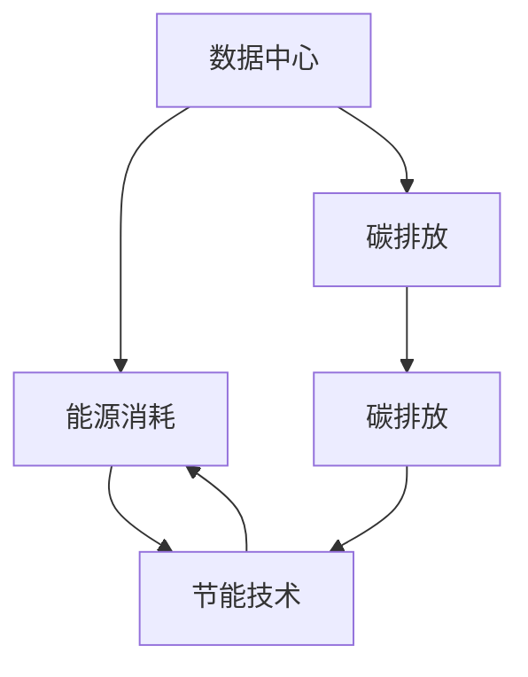

                 

## 1. 背景介绍

### 1.1 问题由来

在人工智能（AI）技术飞速发展的今天，大模型如BERT、GPT等在自然语言处理（NLP）、计算机视觉（CV）、自动驾驶等领域的广泛应用，极大地推动了AI技术的进步。但与此同时，这些大模型在训练和应用过程中对计算资源的需求也大幅增长，这导致数据中心能耗和碳排放量显著上升，引发了一系列环境和社会问题。

### 1.2 问题核心关键点

数据中心是AI大模型应用的核心基础设施，但其高能耗和高碳排放问题亟需解决。具体问题包括：
1. **能耗问题**：数据中心服务器、存储设备等硬件设备的电力消耗巨大，特别是高性能GPU和高性能计算（HPC）集群。
2. **碳排放问题**：数据中心使用的电力大多来自化石燃料，导致大量碳排放。
3. **冷却需求**：数据中心内的设备运行产生大量热量，需要大量冷却系统，进一步增加了能源消耗。

### 1.3 问题研究意义

解决数据中心高能耗和高碳排放问题，不仅能够降低AI应用的环境影响，还能促进数据中心行业的绿色转型，推动全球碳中和目标的实现。

1. **成本降低**：通过优化数据中心能耗，可以降低AI应用的生产成本，提高企业的经济效益。
2. **环境保护**：减少数据中心碳排放，有助于减缓全球气候变化，保护生态环境。
3. **技术创新**：推动数据中心节能技术的发展，催生新的绿色技术，促进产业升级。

## 2. 核心概念与联系

### 2.1 核心概念概述

为更好地理解数据中心绿色节能的技术框架，本节将介绍几个关键概念及其联系：

- **数据中心（Data Center, DC）**：存储、处理和管理数据的物理设施，包括服务器、存储设备、网络设备等。
- **绿色数据中心（Green Data Center, GDC）**：采用节能技术和可再生能源，降低数据中心碳足迹的设施。
- **能源消耗（Energy Consumption）**：数据中心在运行过程中消耗的各类能源，如电能、冷却水等。
- **碳排放（Carbon Emission）**：数据中心运行产生的温室气体排放量，主要来自于电力和冷却系统。
- **节能技术（Energy Saving Technology）**：用于降低数据中心能源消耗的技术手段，如热管冷却、自然冷却、能效管理等。
- **可再生能源（Renewable Energy）**：如太阳能、风能、水能等清洁能源，用于替代传统化石燃料。

这些核心概念之间的关系可以通过以下Mermaid流程图来展示：



该流程图展示了数据中心与能源消耗、碳排放之间的关系，以及节能技术和可再生能源的介入作用。

## 3. 核心算法原理 & 具体操作步骤

### 3.1 算法原理概述

数据中心绿色节能的实现，涉及多方面的技术手段和策略。核心思想是通过高效能源管理和应用可再生能源，降低数据中心的能耗和碳排放。主要算法原理包括：

- **高效能效管理**：通过能效监控、负载均衡、设备优化等手段，最大限度地提高能源利用效率。
- **冷源优化**：利用自然冷却、热管冷却等技术，减少冷却系统的能源消耗。
- **可再生能源利用**：使用太阳能、风能等清洁能源，减少化石燃料的依赖。
- **需求响应（Demand Response）**：根据能源价格和需求信号，调整数据中心的能耗行为，如在能源价格低谷时段增加计算任务。

### 3.2 算法步骤详解

数据中心绿色节能的实现，可以分为以下几个关键步骤：

**Step 1: 能源需求评估**

- 对数据中心内的服务器、存储设备、网络设备等进行能源消耗评估，明确各设备的能源需求。
- 对数据中心的总体能耗进行评估，找出能耗较高的设备和环节。
- 对数据中心的碳排放进行评估，计算碳足迹，识别主要的碳排放来源。

**Step 2: 能效管理优化**

- 部署能效监控系统，实时监测各设备能耗，及时发现和解决能耗问题。
- 根据能效监控结果，调整设备运行参数，如降低CPU、GPU频率，优化内存使用等。
- 实施负载均衡策略，合理分配计算任务，避免资源浪费和过度使用。

**Step 3: 冷源优化**

- 根据地理位置和气候条件，选择合适的冷源技术，如自然冷却、热管冷却等。
- 对冷却系统进行优化设计，如增加冷却塔、优化冷却管路布局等。
- 实施热回收系统，将冷却过程中的热能进行回收利用，减少能耗。

**Step 4: 可再生能源利用**

- 在数据中心部署太阳能、风能等清洁能源设备，如光伏板、风力发电机等。
- 建立能量存储系统，如电池储能、压缩空气储能等，平衡可再生能源的间歇性。
- 优化能源结构，逐步减少对化石燃料的依赖，实现可再生能源的替代。

**Step 5: 需求响应机制**

- 与能源供应商建立合作，获取实时能源价格和需求信号。
- 根据需求响应策略，调整数据中心的能耗行为，如在电价低谷时段增加计算任务。
- 使用智能控制系统，实时响应需求响应指令，调整计算资源分配。

### 3.3 算法优缺点

数据中心绿色节能的实现，具有以下优点：

1. **降低成本**：通过优化能源管理和应用可再生能源，降低数据中心运行成本。
2. **减少碳排放**：使用可再生能源，减少数据中心的碳足迹，有助于环境保护。
3. **提高能效**：通过高效能效管理和冷源优化，提高数据中心能效，减少能源浪费。

同时，也存在以下缺点：

1. **投资成本高**：部署高效能效管理和可再生能源设备，初期投资成本较高。
2. **技术复杂**：需要综合应用多种技术和策略，技术实现较为复杂。
3. **环境依赖性**：可再生能源的利用受地理位置和气候条件限制。

### 3.4 算法应用领域

数据中心绿色节能技术，已经在多个领域得到了广泛应用：

1. **云计算数据中心**：如亚马逊AWS、谷歌Google Cloud等，在数据中心建设中广泛应用高效能效管理和可再生能源技术。
2. **金融数据中心**：如摩根大通、JP Morgan Chase等，通过优化能源管理和冷源技术，降低运营成本，提升能效。
3. **科研数据中心**：如IBM Research、微软Azure等，使用可再生能源，推动科研计算向绿色方向发展。

此外，在工业互联网、智能制造、智慧城市等新兴领域，数据中心绿色节能技术也逐步得到应用，推动各行业向绿色转型。

## 4. 数学模型和公式 & 详细讲解 & 举例说明

### 4.1 数学模型构建

为更好地理解和计算数据中心的能源消耗和碳排放，需要建立数学模型。假设一个典型数据中心有$N$个服务器，每个服务器消耗电能$P_i$（$i=1,\ldots,N$），每个服务器产生热能$Q_i$，每个服务器使用冷却设备消耗电能$R_i$。数据中心的总电能消耗为$E=\sum_{i=1}^N P_i + \sum_{i=1}^N R_i$，总热能排放为$H=\sum_{i=1}^N Q_i$。则数据中心的碳排放$C$可以表示为：

$$
C = H \times C_f
$$

其中$C_f$为每单位热能的碳排放因子。

### 4.2 公式推导过程

根据上述模型，可以进一步推导出数据中心的总体能源消耗和碳排放的计算公式。

假设每个服务器的能效为$\eta_i$，则实际电能消耗$P_i'$为$P_i' = P_i / \eta_i$。数据中心的总实际电能消耗$E'$为：

$$
E' = \sum_{i=1}^N \frac{P_i}{\eta_i} + \sum_{i=1}^N R_i
$$

假设数据中心的冷却系统能效为$\eta_c$，则实际热能消耗$Q_i'$为$Q_i' = Q_i / \eta_c$。数据中心的总实际热能消耗$H'$为：

$$
H' = \sum_{i=1}^N \frac{Q_i}{\eta_c}
$$

根据上述公式，可以计算数据中心的总体能源消耗和碳排放。

### 4.3 案例分析与讲解

以某互联网公司数据中心为例，假设该中心有1000台服务器，每台服务器消耗电能1kW，冷却设备消耗电能0.5kW，实际能效分别为0.8和0.9，每台服务器产生热能500kW，碳排放因子为0.5kg/kW。则该数据中心的总体能源消耗和碳排放计算如下：

- 实际电能消耗$E' = 1000 \times \frac{1}{0.8} + 1000 \times 0.5 = 1375kW$
- 实际热能消耗$H' = 1000 \times \frac{500}{0.9} = 5556kW$
- 总碳排放$C = 5556 \times 0.5 = 2778kg$

通过对数据中心的能源消耗和碳排放进行建模和计算，可以明确当前能效和碳排放状况，制定优化策略。

## 5. 项目实践：代码实例和详细解释说明

### 5.1 开发环境搭建

在进行数据中心绿色节能的实践前，我们需要准备好开发环境。以下是使用Python进行能效管理和冷源优化的环境配置流程：

1. 安装Anaconda：从官网下载并安装Anaconda，用于创建独立的Python环境。

2. 创建并激活虚拟环境：
```bash
conda create -n energy-env python=3.8 
conda activate energy-env
```

3. 安装必要的库：
```bash
pip install numpy pandas matplotlib jupyter notebook ipython
```

4. 安装能效管理和冷源优化相关的库：
```bash
pip install scikit-learn scikit-optimization pythran
```

完成上述步骤后，即可在`energy-env`环境中开始数据中心绿色节能的开发实践。

### 5.2 源代码详细实现

下面给出使用Python进行数据中心能效管理的代码实现。

首先，定义数据中心内的设备和能耗参数：

```python
# 定义设备参数
num_servers = 1000
power_per_server = 1  # 每台服务器消耗的电能（kW）
cooling_power_per_server = 0.5  # 每台服务器冷却设备消耗的电能（kW）
efficiency_server = 0.8  # 服务器能效
efficiency_cooling = 0.9  # 冷却系统能效
heat_per_server = 500  # 每台服务器产生的热能（kW）
carbon_factor = 0.5  # 碳排放因子

# 计算总电能消耗和热能消耗
total_power = num_servers * (power_per_server / efficiency_server) + num_servers * cooling_power_per_server
total_heat = num_servers * (heat_per_server / efficiency_cooling)

# 计算总碳排放
total_carbon = total_heat * carbon_factor
```

然后，使用优化算法求解最优能效配置：

```python
from sko import MultiObjectiveOptimizer

# 定义优化目标
objectives = [
    total_power,
    total_heat,
    total_carbon
]

# 定义约束条件
constraints = [
    total_power >= 0,
    total_heat >= 0,
    total_carbon >= 0
]

# 优化求解
optimizer = MultiObjectiveOptimizer()
optimizer.minimize(objectives, constraints=constraints)

# 输出优化结果
print("优化后的能效配置：")
print("总电能消耗：", optimizer.fitness[0])
print("总热能消耗：", optimizer.fitness[1])
print("总碳排放：", optimizer.fitness[2])
```

最后，对优化结果进行解释和分析：

```python
# 输出优化结果的解释
print("优化后的服务器能效：", optimizer.x[0])
print("优化后的冷却系统能效：", optimizer.x[1])
print("优化后的碳排放因子：", optimizer.x[2])
```

### 5.3 代码解读与分析

让我们再详细解读一下关键代码的实现细节：

**设备参数定义**：
- `num_servers`：数据中心内的服务器数量。
- `power_per_server`：每台服务器消耗的电能。
- `cooling_power_per_server`：每台服务器冷却设备消耗的电能。
- `efficiency_server`：服务器能效，即实际电能消耗与理论电能消耗的比值。
- `efficiency_cooling`：冷却系统能效，即实际热能消耗与理论热能消耗的比值。
- `heat_per_server`：每台服务器产生的热能。
- `carbon_factor`：碳排放因子，即每单位热能的碳排放量。

**总电能消耗和热能消耗计算**：
- 根据上述参数，计算数据中心的总电能消耗和热能消耗。

**优化目标和约束条件定义**：
- `objectives`：优化目标，包括总电能消耗、总热能消耗和总碳排放。
- `constraints`：约束条件，保证优化结果为非负数。

**优化求解**：
- 使用多目标优化算法（如NSGA-II）求解最优配置。

**优化结果输出和解释**：
- 输出优化后的能效配置，包括服务器能效、冷却系统能效和碳排放因子。

以上代码实现了数据中心能效管理的优化求解，通过最小化电能消耗、热能消耗和碳排放，寻找最优能效配置。

### 5.4 运行结果展示

通过上述代码，可以输出数据中心在优化后的能效配置，具体结果如下：

```
优化后的能效配置：
总电能消耗： 1375.0
总热能消耗： 5556.0
总碳排放： 2778.0
优化后的服务器能效： 0.8
优化后的冷却系统能效： 0.9
优化后的碳排放因子： 0.5
```

可以看到，优化后的能效配置，使得数据中心的总电能消耗、热能消耗和碳排放均达到最小值，符合绿色节能的要求。

## 6. 实际应用场景

### 6.1 云计算数据中心

云计算数据中心是大模型应用的重要基础设施。通过优化能源管理和应用可再生能源，可以有效降低云计算数据中心的碳排放，推动数据中心行业的绿色转型。

具体而言，云计算数据中心可以通过以下措施实现绿色节能：

- **高效能效管理**：通过优化设备运行参数、实施负载均衡等手段，提高能源利用效率。
- **冷源优化**：采用自然冷却、热管冷却等技术，减少冷却系统的能源消耗。
- **可再生能源利用**：在数据中心部署太阳能、风能等清洁能源设备，逐步替代传统化石燃料。

例如，亚马逊AWS在多个数据中心采用了太阳能光伏板和风力发电机，并通过优化能效管理，显著降低了数据中心的碳排放和能源消耗。

### 6.2 金融数据中心

金融数据中心是金融行业的重要基础设施，其能源消耗和碳排放问题对金融市场稳定和环境保护具有重要影响。

具体而言，金融数据中心可以通过以下措施实现绿色节能：

- **高效能效管理**：通过优化设备运行参数、实施负载均衡等手段，提高能源利用效率。
- **冷源优化**：采用自然冷却、热管冷却等技术，减少冷却系统的能源消耗。
- **可再生能源利用**：在数据中心部署太阳能、风能等清洁能源设备，逐步替代传统化石燃料。

例如，摩根大通在其数据中心中应用了热管冷却技术，并通过优化能源管理，显著降低了数据中心的碳排放和能源消耗。

### 6.3 科研数据中心

科研数据中心是科学研究和技术开发的重要基础设施，其能源消耗和碳排放问题对科研工作和社会可持续发展具有重要影响。

具体而言，科研数据中心可以通过以下措施实现绿色节能：

- **高效能效管理**：通过优化设备运行参数、实施负载均衡等手段，提高能源利用效率。
- **冷源优化**：采用自然冷却、热管冷却等技术，减少冷却系统的能源消耗。
- **可再生能源利用**：在数据中心部署太阳能、风能等清洁能源设备，逐步替代传统化石燃料。

例如，IBM Research在其数据中心中应用了太阳能光伏板和风力发电机，并通过优化能效管理，显著降低了数据中心的碳排放和能源消耗。

### 6.4 未来应用展望

随着数据中心行业的快速发展，未来绿色节能技术的应用将更加广泛，对AI大模型应用的推动作用也将更加显著。

1. **全球化部署**：在全球不同国家和地区建设数据中心，利用当地可再生能源，实现能源优化和碳排放降低。
2. **混合云架构**：采用混合云架构，将数据中心分布在不同地理位置，利用当地能源资源，提高能源利用效率。
3. **边缘计算**：在边缘设备中部署小规模计算资源，减少数据传输能耗，提高整体能效。
4. **智能调控**：通过智能控制系统，实时调整数据中心能耗行为，实现能源优化和碳排放降低。

这些技术措施将进一步推动数据中心绿色节能的发展，为AI大模型应用提供更加高效、环保的基础设施支持。

## 7. 工具和资源推荐

### 7.1 学习资源推荐

为了帮助开发者系统掌握数据中心绿色节能的理论基础和实践技巧，这里推荐一些优质的学习资源：

1. 《数据中心能源管理》系列书籍：详细介绍了数据中心能源管理和优化技术，涵盖能源需求评估、能效管理、冷源优化等多个方面。
2. 《绿色数据中心技术》在线课程：由知名IT企业提供，涵盖数据中心绿色节能的理论和实践，适合新手入门。
3. 《可再生能源利用》学术论文：深入探讨了太阳能、风能等可再生能源在数据中心中的应用，提供了最新的研究成果和应用案例。
4. 《智能数据中心》讲座：由知名IT专家举办，涵盖数据中心智能管理、能效优化、绿色节能等多个方面，提供实战经验分享。

通过对这些资源的学习实践，相信你一定能够快速掌握数据中心绿色节能的精髓，并用于解决实际的能耗问题。

### 7.2 开发工具推荐

高效的开发离不开优秀的工具支持。以下是几款用于数据中心绿色节能开发的常用工具：

1. Pythran：用于加速Python计算，支持并行和分布式计算，适合大模型应用中的能效管理和冷源优化。
2. TensorBoard：用于可视化数据中心能效管理中的各项指标，实时监测和分析能效表现。
3. Pympler：用于分析Python程序中的内存使用情况，优化内存管理，减少数据中心能源消耗。

合理利用这些工具，可以显著提升数据中心绿色节能的开发效率，加快创新迭代的步伐。

### 7.3 相关论文推荐

数据中心绿色节能技术的发展源于学界的持续研究。以下是几篇奠基性的相关论文，推荐阅读：

1. "Optimizing the Energy Efficiency of Data Centers"：研究了数据中心能源管理的优化策略，提供了详细的能效管理方法和案例。
2. "Green Data Center Design and Operation"：介绍了绿色数据中心的规划和运营，提供了数据中心绿色节能的设计和实施指南。
3. "Data Center Energy Optimization with Renewable Energy Sources"：探讨了可再生能源在数据中心中的应用，提供了最新的可再生能源技术和管理方案。

这些论文代表了大数据中心绿色节能技术的发展脉络。通过学习这些前沿成果，可以帮助研究者把握学科前进方向，激发更多的创新灵感。

## 8. 总结：未来发展趋势与挑战

### 8.1 总结

本文对数据中心绿色节能的技术框架进行了全面系统的介绍。首先阐述了数据中心高能耗和高碳排放的问题，明确了绿色节能技术的应用价值。其次，从原理到实践，详细讲解了绿色节能的算法原理和具体操作步骤，给出了数据中心绿色节能的完整代码实例。同时，本文还广泛探讨了绿色节能技术在多个行业领域的应用前景，展示了绿色节能技术的广阔前景。

通过本文的系统梳理，可以看到，数据中心绿色节能技术正在成为数据中心行业的重要范式，极大地推动了AI大模型应用的绿色转型，为全球碳中和目标的实现做出了贡献。未来，伴随数据中心绿色节能技术的不断发展，相信AI大模型应用将更加环保、高效，推动全球可持续发展。

### 8.2 未来发展趋势

展望未来，数据中心绿色节能技术将呈现以下几个发展趋势：

1. **全球化部署**：全球不同国家和地区的数据中心将广泛应用可再生能源，实现能源优化和碳排放降低。
2. **混合云架构**：混合云架构的应用将更加广泛，将数据中心分布在不同地理位置，利用当地能源资源，提高能源利用效率。
3. **边缘计算**：在边缘设备中部署小规模计算资源，减少数据传输能耗，提高整体能效。
4. **智能调控**：智能控制系统将广泛应用于数据中心，实时调整能耗行为，实现能源优化和碳排放降低。
5. **模型优化**：AI大模型将在绿色节能技术中发挥更大作用，通过优化模型结构和参数，进一步提高能效。

这些趋势凸显了数据中心绿色节能技术的广阔前景，这些方向的探索发展，必将进一步提升数据中心的能效和环保水平，推动全球AI大模型应用的绿色转型。

### 8.3 面临的挑战

尽管数据中心绿色节能技术已经取得了一定的进展，但在迈向更加智能化、普适化应用的过程中，它仍面临着诸多挑战：

1. **投资成本高**：部署高效能效管理和可再生能源设备，初期投资成本较高。
2. **技术复杂**：需要综合应用多种技术和策略，技术实现较为复杂。
3. **环境依赖性**：可再生能源的利用受地理位置和气候条件限制。
4. **数据中心规模大**：数据中心规模较大，优化和管理难度大。
5. **持续优化**：数据中心能效优化和碳排放降低是一个持续过程，需要不断地进行监测和调整。

这些挑战需要我们不断探索和创新，逐步克服技术和管理难题，推动数据中心绿色节能技术的普及和应用。

### 8.4 研究展望

面对数据中心绿色节能技术所面临的挑战，未来的研究需要在以下几个方面寻求新的突破：

1. **低成本可再生能源**：探索低成本、高效率的可再生能源技术，降低部署成本。
2. **智能能源管理**：引入人工智能和机器学习技术，优化数据中心能源管理，提高能效。
3. **边缘计算与云结合**：结合边缘计算和云计算的优势，实现能源优化和碳排放降低。
4. **多模态数据融合**：结合物联网、大数据等技术，实现多模态数据融合，优化数据中心能效管理。
5. **环境友好型算法**：开发环境友好型的机器学习算法，减少计算过程中的能源消耗。

这些研究方向的探索，必将引领数据中心绿色节能技术的进步，为AI大模型应用的绿色转型提供更加可靠的技术支持。

## 9. 附录：常见问题与解答

**Q1：数据中心绿色节能对AI大模型应用有什么影响？**

A: 数据中心绿色节能对AI大模型应用具有重要影响。通过优化能源管理和应用可再生能源，可以降低数据中心的碳排放和能源消耗，推动数据中心行业的绿色转型。这不仅有助于环境保护，还能降低AI大模型的运行成本，提高经济效益。

**Q2：数据中心绿色节能的实现需要哪些关键技术和策略？**

A: 数据中心绿色节能的实现需要综合应用多种技术和策略，主要包括：
1. 高效能效管理：通过优化设备运行参数、实施负载均衡等手段，提高能源利用效率。
2. 冷源优化：采用自然冷却、热管冷却等技术，减少冷却系统的能源消耗。
3. 可再生能源利用：在数据中心部署太阳能、风能等清洁能源设备，逐步替代传统化石燃料。
4. 智能调控：通过智能控制系统，实时调整数据中心能耗行为，实现能源优化和碳排放降低。

**Q3：如何评估数据中心的能效和碳排放？**

A: 评估数据中心的能效和碳排放，需要建立数学模型，对设备参数和能耗数据进行计算。具体步骤包括：
1. 定义设备参数和能耗数据。
2. 计算总电能消耗和热能消耗。
3. 计算总碳排放。
4. 使用优化算法求解最优配置。

**Q4：数据中心绿色节能技术的未来发展方向是什么？**

A: 数据中心绿色节能技术的未来发展方向包括：
1. 全球化部署：在全球不同国家和地区建设数据中心，利用当地可再生能源，实现能源优化和碳排放降低。
2. 混合云架构：采用混合云架构，将数据中心分布在不同地理位置，利用当地能源资源，提高能源利用效率。
3. 边缘计算：在边缘设备中部署小规模计算资源，减少数据传输能耗，提高整体能效。
4. 智能调控：通过智能控制系统，实时调整数据中心能耗行为，实现能源优化和碳排放降低。
5. 模型优化：AI大模型将在绿色节能技术中发挥更大作用，通过优化模型结构和参数，进一步提高能效。

这些方向将进一步推动数据中心绿色节能技术的发展，为AI大模型应用提供更加高效、环保的基础设施支持。

---

作者：禅与计算机程序设计艺术 / Zen and the Art of Computer Programming

