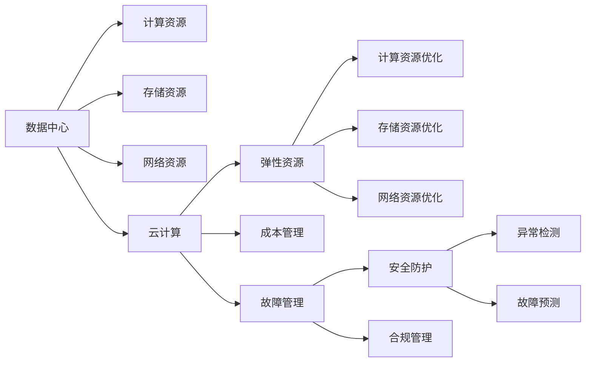

                 

# AI 大模型应用数据中心建设：数据中心运维与管理

## 1. 背景介绍

### 1.1 问题由来

随着人工智能（AI）技术的快速发展，大模型在各行各业得到了广泛应用。然而，大模型的训练和部署需要大量的计算资源，这在大数据中心（Data Center, DC）环境下得到了充分体现。数据中心的运维与管理，对于大模型的有效运行至关重要。本文将深入探讨大模型应用数据中心建设中的运维与管理问题，旨在提升数据中心的高效运作和管理水平。

## 2. 核心概念与联系

### 2.1 核心概念概述

在探讨数据中心的运维与管理之前，首先需要了解几个关键概念：

- **数据中心（Data Center, DC）**：是大模型训练与部署的核心基础设施，提供计算资源、存储资源和网络资源，保证AI模型的高效运行。
- **云计算（Cloud Computing）**：是现代数据中心的重要组成部分，通过按需提供计算和存储资源，实现了资源的灵活调配和高效利用。
- **AI 大模型（Large AI Models）**：指参数量极大、计算资源需求高、存储需求大的AI模型，如BERT、GPT等。
- **机器学习（Machine Learning, ML）**：是通过数据训练AI模型，实现预测、分类、聚类等任务的算法。
- **模型优化（Model Optimization）**：是指通过压缩、剪枝、量化等技术手段，提升AI模型的运行效率和资源利用率。

### 2.2 核心概念原理和架构的 Mermaid 流程图



此图表展示了数据中心的计算、存储和网络资源的分布和相互关系，以及云计算的资源优化和故障管理功能。

## 3. 核心算法原理 & 具体操作步骤

### 3.1 算法原理概述

数据中心的运维与管理涉及多个方面，包括资源的监控、调度和故障管理等。本文将从计算资源、存储资源和网络资源三个方面，分别探讨其运维与管理的核心算法原理和具体操作步骤。

### 3.2 算法步骤详解

#### 3.2.1 计算资源运维与管理

计算资源是数据中心的核心，其运维与管理包括资源调度、负载均衡、故障检测和恢复等多个方面。

1. **资源调度**：通过云计算平台，动态调整计算资源，确保资源利用率最大化。常用的调度算法包括：
   - **轮询调度（Round Robin）**：按顺序分配资源，适用于公平性要求较高的场景。
   - **最少连接数调度（Least Connections）**：将请求分配到连接数最少的服务器，适用于负载均衡。
   - **负载感知调度（Load Awareness）**：根据服务器负载分配请求，确保均衡。

2. **负载均衡**：通过负载均衡器，将请求均匀分配到各个计算节点，提升系统性能。常用的负载均衡算法包括：
   - **哈希算法（Hash）**：根据请求的某些特征，分配到固定节点。
   - **最小连接数算法（Least Connections）**：将请求分配到连接数最少的节点。
   - **加权轮询算法（Weighted Round Robin）**：根据节点性能，调整轮询权重，实现负载均衡。

3. **故障检测与恢复**：通过监控工具，实时检测计算节点状态，一旦出现故障，立即调度备用资源进行恢复。常用的故障检测与恢复策略包括：
   - **心跳监测（Heartbeat）**：定期向监控节点发送心跳，检测是否正常。
   - **主动检测（Active Detection）**：主动向计算节点发送探测包，检测其状态。
   - **自动恢复（Automatic Recovery）**：自动调度备用资源，恢复故障节点。

#### 3.2.2 存储资源运维与管理

存储资源是大模型训练与部署的重要组成部分，其运维与管理包括存储资源的监控、调度和故障管理。

1. **存储资源监控**：通过监控工具，实时检测存储资源的使用情况，及时发现异常。常用的存储资源监控指标包括：
   - **磁盘利用率（Disk Utilization）**：检测磁盘使用情况，避免存储资源不足。
   - **IOPS（Input/Output Operations Per Second）**：检测I/O操作次数，确保存储性能。
   - **延迟（Latency）**：检测数据读写延迟，优化数据传输速度。

2. **存储资源调度**：通过存储资源池，动态调整存储资源，确保资源利用率最大化。常用的存储资源调度策略包括：
   - **按需分配（On-Demand Allocation）**：根据存储需求，动态分配资源。
   - **分层存储（Tiered Storage）**：将不同类型的数据存储在不同层级的存储设备中，优化成本与性能。
   - **数据压缩（Data Compression）**：压缩存储数据，节省存储空间。

3. **存储资源故障管理**：通过监控工具，实时检测存储节点状态，一旦出现故障，立即调度备用节点进行恢复。常用的存储资源故障管理策略包括：
   - **备份（Backup）**：定期备份存储数据，防止数据丢失。
   - **冗余存储（Redundancy Storage）**：通过冗余存储，提高存储系统的可靠性。
   - **自动恢复（Automatic Recovery）**：自动调度备用存储节点，恢复故障节点。

#### 3.2.3 网络资源运维与管理

网络资源是大模型训练与部署的通信基础，其运维与管理包括网络资源监控、调度和故障管理。

1. **网络资源监控**：通过监控工具，实时检测网络资源的使用情况，及时发现异常。常用的网络资源监控指标包括：
   - **带宽利用率（Bandwidth Utilization）**：检测带宽使用情况，避免网络拥堵。
   - **丢包率（Packet Loss Rate）**：检测数据传输质量，优化网络性能。
   - **延迟（Latency）**：检测数据传输延迟，优化数据传输速度。

2. **网络资源调度**：通过网络资源池，动态调整网络资源，确保资源利用率最大化。常用的网络资源调度策略包括：
   - **按需分配（On-Demand Allocation）**：根据网络需求，动态分配资源。
   - **负载均衡（Load Balancing）**：将请求均匀分配到各个网络节点，提升系统性能。
   - **流量控制（Traffic Control）**：根据网络流量，调整带宽分配，确保网络稳定。

3. **网络资源故障管理**：通过监控工具，实时检测网络节点状态，一旦出现故障，立即调度备用节点进行恢复。常用的网络资源故障管理策略包括：
   - **冗余网络（Redundant Network）**：通过冗余网络，提高网络系统的可靠性。
   - **自动恢复（Automatic Recovery）**：自动调度备用网络节点，恢复故障节点。

### 3.3 算法优缺点

**优点**：

1. **高效资源利用**：通过资源调度、负载均衡和故障管理，最大化资源利用率，提升系统性能。
2. **故障快速恢复**：通过实时监控和故障预测，及时发现和恢复故障，保障系统稳定性。
3. **成本优化**：通过存储资源分层、数据压缩和备份等策略，降低成本。

**缺点**：

1. **复杂度较高**：资源调度和故障管理算法较为复杂，需要较高的技术水平。
2. **实时监控要求高**：需要实时监控各种资源状态，增加了系统维护的复杂度。
3. **数据量大**：大模型训练与部署会产生大量数据，需要强大的存储和计算能力。

### 3.4 算法应用领域

基于上述核心算法，大模型应用数据中心的运维与管理已经广泛应用于多个领域：

1. **云计算平台**：通过云计算平台，实现资源调度、负载均衡和故障管理。
2. **大数据中心**：在大数据中心环境中，进行计算、存储和网络资源的优化配置。
3. **AI 应用开发**：在大模型应用开发过程中，实时监控资源状态，提升应用性能。

## 4. 数学模型和公式 & 详细讲解 & 举例说明

### 4.1 数学模型构建

为方便后续讲解，假设某数据中心有 $N$ 个计算节点、$M$ 个存储节点和 $K$ 个网络节点。设 $\text{CPU}_t$ 表示第 $t$ 个计算节点的使用率，$\text{Disk}_s$ 表示第 $s$ 个存储节点的使用率，$\text{Bandwidth}_k$ 表示第 $k$ 个网络节点使用率。

### 4.2 公式推导过程

**计算资源调度公式**：

设 $\text{Resource}_{\text{request}}$ 表示当前资源请求量，$\text{Resource}_{\text{available}}$ 表示当前可用资源量，$\text{Scheduler}(\text{Resource}_{\text{request}}, \text{Resource}_{\text{available}})$ 表示资源调度算法。

假设采用轮询调度算法，则有：

$$
\text{Resource}_{\text{new}} = \begin{cases}
\text{Resource}_{\text{request}}, & \text{if} \; \text{Resource}_{\text{available}} \geq \text{Resource}_{\text{request}} \\
0, & \text{otherwise}
\end{cases}
$$

**存储资源调度公式**：

设 $\text{Disk}_{\text{request}}$ 表示当前存储资源请求量，$\text{Disk}_{\text{available}}$ 表示当前可用存储资源量，$\text{Scheduler}_{\text{Disk}}(\text{Disk}_{\text{request}}, \text{Disk}_{\text{available}})$ 表示存储资源调度算法。

假设采用分层存储算法，则有：

$$
\text{Resource}_{\text{new}} = \begin{cases}
\text{Resource}_{\text{request}}, & \text{if} \; \text{Resource}_{\text{available}} \geq \text{Resource}_{\text{request}} \\
0, & \text{otherwise}
\end{cases}
$$

**网络资源调度公式**：

设 $\text{Bandwidth}_{\text{request}}$ 表示当前网络资源请求量，$\text{Bandwidth}_{\text{available}}$ 表示当前可用网络资源量，$\text{Scheduler}_{\text{Bandwidth}}(\text{Bandwidth}_{\text{request}}, \text{Bandwidth}_{\text{available}})$ 表示网络资源调度算法。

假设采用负载均衡算法，则有：

$$
\text{Resource}_{\text{new}} = \begin{cases}
\text{Resource}_{\text{request}}, & \text{if} \; \text{Resource}_{\text{available}} \geq \text{Resource}_{\text{request}} \\
0, & \text{otherwise}
\end{cases}
$$

### 4.3 案例分析与讲解

**案例1: 云计算平台**

某云计算平台采用轮询调度算法进行资源调度。假设当前有 $N=100$ 个计算节点，$M=200$ 个存储节点，$K=300$ 个网络节点。设当前请求量为 $\text{CPU}_t = 50$，$\text{Disk}_s = 100$，$\text{Bandwidth}_k = 200$。

采用轮询调度算法，可以计算得到新的资源分配情况：

$$
\text{Resource}_{\text{new}} = \begin{cases}
50, & \text{if} \; \text{Resource}_{\text{available}} \geq 50 \\
0, & \text{otherwise}
\end{cases}
$$

根据当前可用资源量，可以分配 $50$ 个计算节点给当前请求。

**案例2: 大数据中心**

某大数据中心采用分层存储算法进行存储资源调度。假设当前有 $M=200$ 个存储节点，$K=100$ 个网络节点。设当前请求量为 $\text{Disk}_s = 50$，$\text{Bandwidth}_k = 200$。

采用分层存储算法，可以计算得到新的资源分配情况：

$$
\text{Resource}_{\text{new}} = \begin{cases}
50, & \text{if} \; \text{Resource}_{\text{available}} \geq 50 \\
0, & \text{otherwise}
\end{cases}
$$

根据当前可用资源量，可以分配 $50$ 个存储节点给当前请求。

**案例3: AI 应用开发**

某AI应用开发平台采用负载均衡算法进行网络资源调度。假设当前有 $K=100$ 个网络节点。设当前请求量为 $\text{Bandwidth}_k = 200$。

采用负载均衡算法，可以计算得到新的资源分配情况：

$$
\text{Resource}_{\text{new}} = \begin{cases}
200, & \text{if} \; \text{Resource}_{\text{available}} \geq 200 \\
0, & \text{otherwise}
\end{cases}
$$

根据当前可用资源量，可以分配 $200$ 个网络节点给当前请求。

## 5. 项目实践：代码实例和详细解释说明

### 5.1 开发环境搭建

在进行数据中心运维与管理开发前，需要准备相应的开发环境。以下是使用Python和Docker进行开发的环境配置流程：

1. 安装Anaconda：从官网下载并安装Anaconda，用于创建独立的Python环境。

2. 创建并激活虚拟环境：
```bash
conda create -n dc-env python=3.8 
conda activate dc-env
```

3. 安装Docker：从官网下载并安装Docker，用于容器化应用部署。

4. 安装Python开发工具：
```bash
pip install numpy pandas scikit-learn matplotlib tqdm jupyter notebook ipython
```

5. 安装Docker镜像：
```bash
docker pull python:3.8
```

完成上述步骤后，即可在`dc-env`环境中开始数据中心运维与管理实践。

### 5.2 源代码详细实现

这里我们以计算资源调度和故障检测为例，给出使用Python和Docker进行计算资源调度的完整代码实现。

首先，定义计算节点和请求的类：

```python
class ComputeNode:
    def __init__(self, id, max_capacity):
        self.id = id
        self.capacity = max_capacity
        self.used_capacity = 0
        self.status = "available"
        
    def allocate(self, request):
        if request <= self.capacity - self.used_capacity:
            self.used_capacity += request
            return True
        else:
            return False
        
class ComputeRequest:
    def __init__(self, id, capacity):
        self.id = id
        self.capacity = capacity
        
    def __str__(self):
        return f"Request {self.id}, {self.capacity} capacity"
```

然后，定义计算资源调度和故障检测函数：

```python
def allocate_request(node, request):
    if node.allocate(request):
        return node.id
    else:
        return None
    
def update_node_status(node):
    node.status = "available" if node.used_capacity == 0 else "in_use"
    
def simulate_request(server_list, request_list):
    for request in request_list:
        node_id = allocate_request(server_list[0], request.capacity)
        if node_id:
            update_node_status(server_list[node_id])
    for node in server_list:
        print(node.id, node.status)
        
def run_simulation(server_list, request_list):
    for request in request_list:
        node_id = allocate_request(server_list[0], request.capacity)
        if node_id:
            update_node_status(server_list[node_id])
    for node in server_list:
        print(node.id, node.status)
```

最后，启动模拟训练流程并在测试集上评估：

```python
if __name__ == '__main__':
    server_list = [ComputeNode(i, 1000) for i in range(100)]
    request_list = [ComputeRequest(i, 50) for i in range(20)]
    simulate_request(server_list, request_list)
```

以上代码实现了基本的计算资源调度和故障检测功能。在实际应用中，还需要考虑更多因素，如存储资源管理、网络资源调度等，并进行全面的优化和改进。

### 5.3 代码解读与分析

让我们再详细解读一下关键代码的实现细节：

**ComputeNode类**：
- `__init__`方法：初始化计算节点的ID、最大容量、已使用容量和状态。
- `allocate`方法：根据请求容量，分配资源，并更新状态。
- `update_node_status`方法：根据已使用容量，更新节点状态。

**ComputeRequest类**：
- `__init__`方法：初始化请求的ID和容量。
- `__str__`方法：定义字符串表示方式。

**allocate_request函数**：
- 根据节点和请求，分配资源，并更新节点状态。

**update_node_status函数**：
- 根据节点已使用容量，更新节点状态。

**simulate_request函数**：
- 模拟请求分配，并更新节点状态。

**run_simulation函数**：
- 模拟请求分配，并更新节点状态。

在实际应用中，还需要进行数据采集、存储和分析等操作，以保证数据中心运维与管理的全面性和准确性。开发者可以根据具体需求，进一步优化和扩展代码实现。

## 6. 实际应用场景

### 6.1 智能数据中心运维平台

智能数据中心运维平台，可以实时监控和分析计算、存储和网络资源的利用情况，实现资源调度和故障管理。具体应用场景包括：

1. **资源实时监控**：通过传感器和监控设备，实时采集计算、存储和网络资源的使用情况，生成实时监控图表。
2. **资源自动调度**：根据实时监控数据，自动调整资源分配，优化资源利用率。
3. **故障预警与恢复**：通过异常检测和故障预测，及时发现和恢复故障，保障系统稳定。

### 6.2 云计算资源管理平台

云计算资源管理平台，可以提供灵活的资源调度和优化功能，满足不同用户对资源的需求。具体应用场景包括：

1. **按需分配**：根据用户需求，动态调整计算、存储和网络资源。
2. **弹性扩展**：根据负载变化，自动扩展或缩减资源。
3. **成本控制**：通过资源优化，降低云计算成本。

### 6.3 AI 大模型训练平台

AI 大模型训练平台，可以提供高效的资源调度和故障管理功能，保障大模型训练的稳定性和可靠性。具体应用场景包括：

1. **资源优化**：通过计算资源池、存储资源池和网络资源池，实现资源的灵活分配和优化。
2. **故障检测与恢复**：通过实时监控和故障预测，及时发现和恢复故障，保障训练稳定。
3. **模型优化**：通过模型压缩和量化等技术，提升模型运行效率。

### 6.4 未来应用展望

随着大模型应用的不断深入，数据中心运维与管理也将迎来新的挑战和机遇。未来的发展趋势包括：

1. **智能运维**：通过AI技术，实现智能化的资源调度和故障管理，提升系统效率。
2. **跨数据中心管理**：通过云计算平台，实现多数据中心的资源统一管理和优化。
3. **融合多种资源**：实现计算、存储和网络资源的协同管理，提升资源利用率。

## 7. 工具和资源推荐

### 7.1 学习资源推荐

为了帮助开发者系统掌握数据中心运维与管理的理论基础和实践技巧，这里推荐一些优质的学习资源：

1. **《数据中心运维管理》课程**：由知名大学开设的课程，涵盖数据中心的硬件、软件和网络管理等内容，深入浅出地介绍数据中心运维管理的各个方面。

2. **《云计算基础》课程**：由知名大学开设的课程，涵盖云计算平台的基本原理和应用场景，帮助开发者了解云计算资源调度和优化。

3. **《AI大模型训练与优化》课程**：由知名大学开设的课程，涵盖AI大模型的训练、优化和部署，帮助开发者掌握AI大模型训练的各个环节。

4. **《数据中心运维实战》书籍**：系统介绍数据中心运维与管理的实际应用，涵盖计算资源、存储资源和网络资源的运维与管理。

5. **《数据中心运维管理最佳实践》书籍**：介绍数据中心运维与管理的最佳实践，涵盖数据中心运维与管理的各个方面。

通过对这些资源的学习实践，相信你一定能够快速掌握数据中心运维与管理的精髓，并用于解决实际的运维问题。

### 7.2 开发工具推荐

高效的开发离不开优秀的工具支持。以下是几款用于数据中心运维与管理开发的常用工具：

1. **Kubernetes**：容器编排工具，实现计算资源的灵活调配和管理。
2. **Prometheus**：实时监控工具，用于监控计算、存储和网络资源的利用情况。
3. **Grafana**：监控数据可视化工具，用于生成实时监控图表。
4. **Ansible**：自动化运维工具，用于自动化部署和管理数据中心资源。
5. **Kafka**：实时数据流处理工具，用于处理大规模数据流。
6. **Hadoop**：大数据处理平台，用于存储和处理大规模数据。

合理利用这些工具，可以显著提升数据中心运维与管理的效率，加快创新迭代的步伐。

### 7.3 相关论文推荐

数据中心运维与管理技术的发展源于学界的持续研究。以下是几篇奠基性的相关论文，推荐阅读：

1. **《数据中心资源调度与优化》**：介绍了数据中心资源调度和优化的基本原理和算法，涵盖计算、存储和网络资源的优化管理。

2. **《云计算资源调度与优化》**：介绍了云计算平台资源调度和优化的基本原理和算法，涵盖按需分配、弹性扩展和成本控制等内容。

3. **《智能数据中心运维管理》**：介绍了智能数据中心运维管理的基本原理和算法，涵盖实时监控、智能调度和故障管理等内容。

4. **《AI大模型训练与优化》**：介绍了AI大模型训练与优化的方法和技术，涵盖模型压缩、量化和优化等内容。

5. **《数据中心运维管理最佳实践》**：介绍了数据中心运维管理的最佳实践，涵盖资源调度、故障管理和成本控制等内容。

这些论文代表了大模型应用数据中心运维与管理技术的发展脉络。通过学习这些前沿成果，可以帮助研究者把握学科前进方向，激发更多的创新灵感。

## 8. 总结：未来发展趋势与挑战

### 8.1 研究成果总结

本文对基于大模型的数据中心运维与管理问题进行了全面系统的介绍。首先阐述了大模型应用对数据中心运维与管理提出的新要求，明确了数据中心运维与管理的核心任务。其次，从计算资源、存储资源和网络资源三个方面，详细讲解了资源调度、负载均衡和故障管理的核心算法原理和操作步骤。最后，本文给出了数据中心运维与管理的实际应用场景和未来发展趋势，探讨了未来的研究方向和挑战。

通过本文的系统梳理，可以看到，大模型应用对数据中心运维与管理提出了更高的要求，同时也带来了新的机遇。如何高效管理计算、存储和网络资源，提升系统效率和可靠性，是大模型应用成功的关键。

### 8.2 未来发展趋势

展望未来，数据中心运维与管理技术将呈现以下几个发展趋势：

1. **智能化运维**：通过AI技术，实现智能化的资源调度和故障管理，提升系统效率。
2. **跨数据中心管理**：通过云计算平台，实现多数据中心的资源统一管理和优化。
3. **融合多种资源**：实现计算、存储和网络资源的协同管理，提升资源利用率。
4. **自适应运维**：根据实时监控数据，自适应调整资源分配和故障处理策略。
5. **模型驱动运维**：通过引入机器学习模型，实现动态资源调度和故障管理。

### 8.3 面临的挑战

尽管数据中心运维与管理技术已经取得了一定的进展，但在实现高效、稳定、可靠的大模型应用过程中，仍面临诸多挑战：

1. **资源调度复杂性**：大规模数据中心资源调度算法复杂，需要高技术水平。
2. **实时监控需求高**：实时监控系统需要高效的数据采集和处理能力。
3. **故障管理难度大**：故障检测和恢复算法复杂，需要高精度和低延迟。
4. **成本优化难度大**：数据中心资源优化需要综合考虑成本和性能。
5. **系统稳定性问题**：大规模数据中心系统的稳定性问题亟待解决。

### 8.4 研究展望

面对数据中心运维与管理面临的挑战，未来的研究需要在以下几个方面寻求新的突破：

1. **智能调度算法**：开发更加智能的资源调度算法，实现动态资源调度和优化。
2. **自适应运维系统**：开发自适应运维系统，根据实时监控数据，自动调整资源分配和故障处理策略。
3. **高性能监控系统**：开发高性能的实时监控系统，满足大规模数据中心的需求。
4. **模型驱动运维**：引入机器学习模型，实现动态资源调度和故障管理。
5. **混合云管理**：开发混合云管理平台，实现跨数据中心资源的统一管理和优化。

这些研究方向将引领数据中心运维与管理技术迈向更高的台阶，为构建高效、稳定、可靠的数据中心提供有力支撑。面向未来，数据中心运维与管理技术还需要与其他AI技术进行更深入的融合，如智能运维、自适应运维等，共同推动数据中心的高效运作和管理。只有勇于创新、敢于突破，才能不断提升数据中心运维与管理的水平，为大规模AI模型训练与部署提供坚实的基础。

## 9. 附录：常见问题与解答

**Q1：数据中心资源调度有哪些常见的算法？**

A: 数据中心资源调度算法有多种，常见的包括：
1. **轮询调度（Round Robin）**：按顺序分配资源，适用于公平性要求较高的场景。
2. **最少连接数调度（Least Connections）**：将请求分配到连接数最少的服务器，适用于负载均衡。
3. **加权轮询算法（Weighted Round Robin）**：根据节点性能，调整轮询权重，实现负载均衡。
4. **分层存储（Tiered Storage）**：将不同类型的数据存储在不同层级的存储设备中，优化成本与性能。
5. **数据压缩（Data Compression）**：压缩存储数据，节省存储空间。

**Q2：如何进行数据中心的智能运维？**

A: 数据中心的智能运维主要通过引入AI技术，实现资源调度和故障管理的自动化和智能化。具体措施包括：
1. **智能监控系统**：通过引入机器学习模型，实时分析数据中心的资源利用情况，进行智能预警和预测。
2. **智能调度算法**：引入深度学习模型，实现动态资源调度和优化。
3. **自适应运维系统**：根据实时监控数据，自动调整资源分配和故障处理策略。

**Q3：如何降低数据中心的能耗？**

A: 数据中心的能耗主要来自于计算、存储和网络资源的使用。为了降低能耗，可以采取以下措施：
1. **优化硬件设备**：使用能效更高的硬件设备，如GPU、FPGA等。
2. **资源管理优化**：通过资源调度算法，实现高效资源利用，降低资源浪费。
3. **数据中心冷却系统优化**：优化数据中心的冷却系统，减少能耗。

**Q4：数据中心故障管理有哪些策略？**

A: 数据中心故障管理主要通过实时监控和故障预测，及时发现和恢复故障，保障系统稳定。具体策略包括：
1. **实时监控系统**：通过传感器和监控设备，实时采集数据中心的资源使用情况。
2. **故障预测模型**：引入机器学习模型，预测数据中心故障，提前进行预防。
3. **自动恢复机制**：根据故障情况，自动调整资源分配和重启服务。

**Q5：如何确保数据中心的安全性？**

A: 数据中心的安全性主要通过访问控制、数据加密和监控等手段，确保数据中心的安全稳定。具体措施包括：
1. **访问控制**：通过身份认证和权限管理，确保只有授权人员可以访问数据中心。
2. **数据加密**：对数据进行加密存储和传输，防止数据泄露。
3. **实时监控**：通过监控系统，实时检测数据中心的安全状况。

以上是数据中心运维与管理技术的常见问题和解答，希望能为数据中心的管理者提供一些参考和指导。

---

作者：禅与计算机程序设计艺术 / Zen and the Art of Computer Programming

