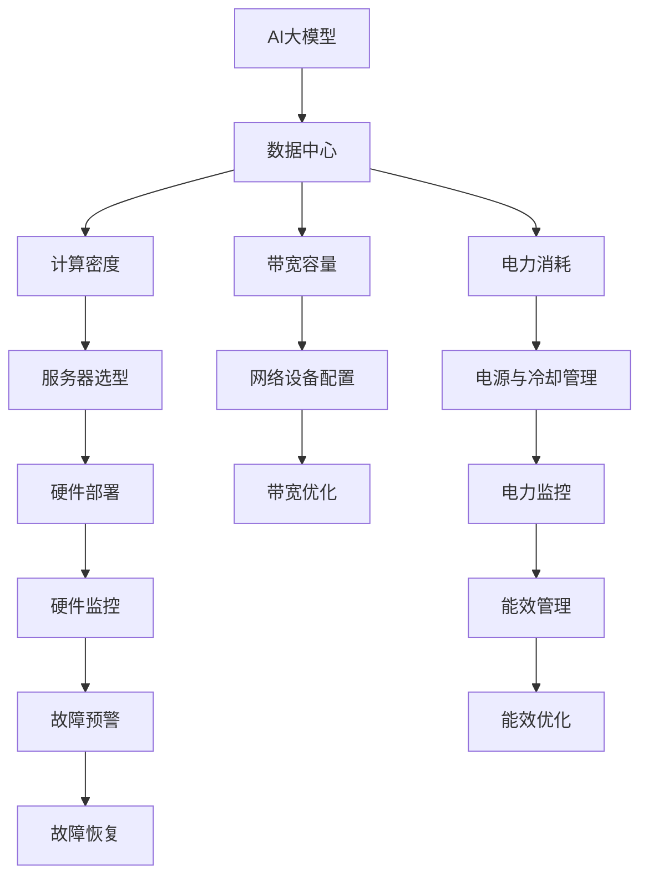

                 

# AI 大模型应用数据中心建设：数据中心运维与管理

## 1. 背景介绍

### 1.1 问题由来
随着AI大模型的不断发展和应用，数据中心成为支撑大规模模型训练和推理的重要基础设施。AI大模型的复杂度和计算需求显著增加，对数据中心硬件设施、网络带宽、电力消耗等方面提出了更高的要求。数据中心的运维和管理变得愈发复杂，需要系统化的管理和优化措施，确保数据中心的稳定运行和高效利用。

### 1.2 问题核心关键点
AI大模型的应用数据中心运维与管理主要包括以下几个方面：
- 硬件设施的选型与部署：如何选择适合大模型计算需求的基础硬件设备，并进行高效部署。
- 网络带宽的优化与调度：如何优化网络带宽配置，确保模型训练和推理过程中的网络流畅性。
- 电力供应的管理与调配：如何管理数据中心的电力消耗，避免过度负荷导致的安全风险。
- 数据中心的监控与维护：如何进行实时监控，确保数据中心的稳定运行，及时处理异常情况。
- 安全与隐私保护：如何保护数据中心的物理安全和数据隐私，防止未经授权的访问和数据泄露。

## 2. 核心概念与联系

### 2.1 核心概念概述

为更好地理解AI大模型应用数据中心的运维与管理，本节将介绍几个密切相关的核心概念：

- AI大模型(AI Large Model)：指通过深度学习等技术训练得到，参数量达数十亿甚至数百亿的庞大神经网络模型，用于解决复杂的AI问题。

- 数据中心(Data Center)：集中存放和管理数据的设施，由服务器、网络设备、电源设备、冷却设备等组成。数据中心负责计算、存储、网络等基础设施的运行和维护。

- 计算密度(Computing Density)：指单位面积或空间内所能容纳的计算能力，通常以每平方英尺（或平方米）的计算能力（FLOPS/ft²）来衡量。

- 带宽容量(Bandwidth Capacity)：指网络传输数据的能力，通常以每秒传输的字节数（bps）或每秒传输的比特数（bit/s）来衡量。

- 电力消耗(Power Consumption)：指数据中心在运行过程中所消耗的电量，通常以瓦特（W）或千瓦（kW）来衡量。

这些核心概念之间的逻辑关系可以通过以下Mermaid流程图来展示：



这个流程图展示了大模型应用数据中心的运维与管理的关键流程：

1. AI大模型作为数据中心的计算任务，需要高计算密度的基础设施支持。
2. 数据中心需要优化带宽容量，确保模型训练和推理过程中的网络流畅性。
3. 电力消耗的管理和调配是数据中心运行的基础保障。
4. 数据中心的监控与维护确保其稳定运行，及时处理异常情况。
5. 安全与隐私保护是数据中心的基本要求。

这些概念共同构成了AI大模型应用数据中心的运维与管理框架，为其高效、稳定运行提供了理论基础。

## 3. 核心算法原理 & 具体操作步骤

### 3.1 算法原理概述

AI大模型应用数据中心的运维与管理，涉及大量硬件设施的运维、网络带宽的管理、电力消耗的监控与调配等复杂问题。为确保数据中心的高效稳定运行，需要采用系统化的管理方法，包括：

- 硬件设备的自动化部署与监控：利用自动化部署工具如Ansible、Puppet等，自动配置和管理硬件设备，减少人为操作错误。
- 网络带宽的动态优化与调度：通过网络流量监控工具如Prometheus、Grafana等，实时监控网络带宽使用情况，自动调整带宽配置，确保数据传输的流畅性。
- 电力消耗的精确管理和调配：利用能效管理系统如OpenPower、Brightsight等，实时监控电力消耗，动态调整电源分配，优化能效管理。
- 数据中心的实时监控与故障预警：通过监控工具如Zabbix、Nagios等，实时监测硬件、网络、电力等各项指标，设置告警阈值，及时处理异常情况。
- 数据隐私与安全的防护：通过身份认证、访问控制、加密传输等措施，保护数据中心的物理安全和数据隐私，防止未经授权的访问和数据泄露。

### 3.2 算法步骤详解

基于上述运维与管理方法，以下是具体的操作流程：

**Step 1: 选型与部署硬件设备**
- 根据AI大模型的计算需求，选择合适的硬件设备，如服务器、网络交换机、路由器等。
- 配置服务器的操作系统和软件环境，如安装Linux、安装GPU驱动程序等。
- 利用自动化部署工具，将配置好的硬件设备自动部署到数据中心。

**Step 2: 配置网络带宽**
- 确定数据中心的带宽需求，选择合适的网络设备，如交换机、路由器等。
- 利用网络流量监控工具，实时监控网络带宽使用情况。
- 根据实时监控结果，自动调整带宽配置，确保网络传输流畅。

**Step 3: 管理电力消耗**
- 利用能效管理系统，实时监控数据中心的电力消耗。
- 根据实时监控结果，动态调整电源分配，优化能效管理。
- 设置电力消耗的告警阈值，及时发现和处理电力消耗异常情况。

**Step 4: 实时监控与故障预警**
- 利用监控工具，实时监测硬件、网络、电力等各项指标。
- 设置告警阈值，及时处理异常情况。
- 记录监控数据，便于后续分析和优化。

**Step 5: 安全与隐私保护**
- 通过身份认证、访问控制等措施，保护数据中心的物理安全和数据隐私。
- 使用加密传输技术，确保数据传输的安全性。
- 定期进行安全审计，发现和修复潜在的安全漏洞。

### 3.3 算法优缺点

AI大模型应用数据中心的运维与管理方法，具有以下优点：
- 系统化管理：采用自动化工具和系统化的管理方法，提高运维效率，减少人为操作错误。
- 实时监控与预警：通过实时监控工具和告警阈值设置，及时发现和处理异常情况，确保数据中心稳定运行。
- 电力管理优化：通过能效管理系统，动态调整电力分配，优化能效管理，降低电力消耗。
- 安全与隐私保护：通过多种安全措施，确保数据中心的物理安全和数据隐私。

同时，该方法也存在一定的局限性：
- 硬件选型复杂：AI大模型对硬件设施的选型和部署要求较高，需要具备较高的专业知识。
- 技术门槛较高：需要掌握多种自动化和监控工具的使用，技术门槛较高。
- 初始投资较大：硬件和软件设备的初始投资较大，需要一定的资金支持。

尽管存在这些局限性，但就目前而言，系统化的数据中心运维与管理方法仍然是AI大模型应用的最佳实践，具有重要的参考价值。未来相关研究的重点在于如何进一步降低运维成本，提高管理效率，同时兼顾能效优化和安全隐私保护。

### 3.4 算法应用领域

AI大模型应用数据中心的运维与管理方法，广泛应用于各种AI应用场景，例如：

- 深度学习模型训练：数据中心为深度学习模型提供高效的计算环境，确保模型训练的流畅性和稳定性。
- 人工智能推理服务：数据中心为人工智能推理服务提供稳定的计算资源，确保服务的高效性和可靠性。
- 自然语言处理应用：数据中心为自然语言处理应用提供高性能的计算环境，提升应用的效果和效率。
- 计算机视觉应用：数据中心为计算机视觉应用提供高性能的计算资源，支持大规模图像和视频处理。
- 智能推荐系统：数据中心为智能推荐系统提供高性能的计算环境，提升推荐的效果和效率。

除了上述这些经典应用外，AI大模型在医疗、金融、智能制造、智慧城市等多个领域也有广泛的应用，数据中心的运维与管理也在不断演进和优化。随着AI技术的发展，数据中心的运维与管理将变得更加复杂和重要，成为AI技术落地应用的重要保障。

## 4. 数学模型和公式 & 详细讲解 & 举例说明（备注：数学公式请使用latex格式，latex嵌入文中独立段落使用 $$，段落内使用 $)
### 4.1 数学模型构建

大模型应用数据中心的运维与管理涉及多种硬件和软件设施，其数学模型可以概括为以下几部分：

- 硬件设备的计算能力：假设一个数据中心有 $n$ 个服务器，每个服务器具有计算能力 $C_i$，则整个数据中心的计算能力为 $C = \sum_{i=1}^n C_i$。
- 网络带宽容量：假设一个数据中心有 $m$ 个网络节点，每个节点具有带宽容量 $B_j$，则整个数据中心的带宽容量为 $B = \sum_{j=1}^m B_j$。
- 电力消耗：假设一个数据中心在单位时间内的电力消耗为 $P$，则整个数据中心的电力消耗为 $E = t \cdot P$，其中 $t$ 为运行时间。

### 4.2 公式推导过程

在上述模型基础上，可以进一步推导出一些常用的公式，用于指导数据中心的运维与管理：

- 服务器负载均衡公式：假设一个数据中心有 $n$ 个服务器，每个服务器的负载为 $L_i$，则整个数据中心的负载均衡公式为：

$$
\frac{L_i}{C_i} = \frac{L_j}{C_j}, \quad \forall i,j
$$

其中 $L_i$ 和 $C_i$ 分别表示第 $i$ 个服务器的负载和计算能力。

- 网络带宽优化公式：假设一个数据中心有 $m$ 个网络节点，每个节点的带宽利用率为 $U_j$，则整个数据中心的带宽优化公式为：

$$
U_j = \frac{B_j}{B}, \quad \forall j
$$

其中 $B_j$ 和 $B$ 分别表示第 $j$ 个节点的带宽容量和整个数据中心的带宽容量。

- 能效管理公式：假设一个数据中心在单位时间内的能效为 $E_i$，则整个数据中心的能效管理公式为：

$$
E = \sum_{i=1}^n E_i = C \cdot P \cdot t
$$

其中 $E_i$ 和 $C_i$ 分别表示第 $i$ 个服务器的计算能力和电力消耗。

### 4.3 案例分析与讲解

以一个具有 $n=10$ 个服务器的数据中心为例，每个服务器的计算能力为 $C_i=500\, \text{Gflops}$，整个数据中心的计算能力为 $C=5000\, \text{Gflops}$。每个服务器的负载为 $L_i=2000\, \text{Gflops}$，则整个数据中心的负载均衡情况为：

$$
\frac{L_i}{C_i} = \frac{2000}{500} = 4, \quad \forall i
$$

这意味着每个服务器的利用率达到了 80%，处于合理水平。

## 5. 项目实践：代码实例和详细解释说明
### 5.1 开发环境搭建

在进行数据中心运维与管理实践前，我们需要准备好开发环境。以下是使用Python进行Puppet自动化部署的环境配置流程：

1. 安装Ansible：从官网下载并安装Ansible，用于自动化部署和配置管理。

2. 配置Ansible：创建并编辑 Ansible 的配置文件 `ansible.cfg`，配置 SSH 连接参数等。

3. 编写 Ansible 任务脚本：在 Ansible 的 `playbooks` 目录下编写任务脚本，例如：

```yaml
---
- hosts: all
  vars:
    - server_ip: 192.168.1.1
    - server_count: 10
    - server_type: ubuntu1804
    - package_name: nvidia-driver
    - package_url: http://example.com/nvidia-driver.tar.gz
  tasks:
    - name: Install driver
      apt:
        name: "{{ item.server_ip }}"
        state: present
        update_cache: yes
        packages:
          - "{{ package_name }}"
        cache_dir: /var/cache/apt/archives
        lock_path: /var/lib/apt/lists.lock
    - name: Download driver package
      shell: wget -qO /tmp/{{ package_url }}
    - name: Install driver package
      copy:
        content: "{{ item.server_ip }}"
        dest: /tmp/{{ package_url }}
        validate: "test -f /tmp/{{ package_url }}"
    - name: Extract driver package
      shell: tar -xzf /tmp/{{ package_url }}
    - name: Install driver package
      shell: dpkg -i /tmp/{{ package_name }}
```

4. 运行 Ansible 任务：使用 Ansible 的 `run-playbook` 命令运行任务脚本，例如：

```bash
ansible-playbook playbook.yml
```

完成上述步骤后，即可在 `playbook.yml` 文件中定义任务，使用 Ansible 自动化部署服务器。

### 5.2 源代码详细实现

下面我们以硬件设备的自动化部署为例，给出使用Puppet进行服务器自动部署的Python代码实现。

首先，定义服务器配置文件：

```python
server_config = {
    'name': 'server1',
    'ip': '192.168.1.1',
    'hostname': 'server1.example.com',
    'ssh_user': 'root',
    'ssh_password': 'password',
    'os_type': 'ubuntu1804',
    'packages': ['nvidia-driver'],
    'driver_url': 'http://example.com/nvidia-driver.tar.gz',
}
```

然后，编写Puppet模块，自动部署服务器：

```python
class server_deploy:
    def __init__(self, server_config):
        self.server_config = server_config

    def run(self):
        # 安装并验证SSH连接
        self._install_ssh()
        # 安装操作系统
        self._install_os()
        # 安装驱动程序
        self._install_driver()

    def _install_ssh(self):
        # 安装SSH客户端和服务
        commands = [
            'apt-get update',
            'apt-get install -y openssh-client openssh-server',
            'echo "%s %s" >> /etc/ssh/sshd_config' % (self.server_config['ssh_user'], self.server_config['ssh_password']),
            'service ssh restart'
        ]
        self._run_commands(commands)

    def _install_os(self):
        # 安装操作系统
        commands = [
            'apt-get update',
            'apt-get install -y {{ server_config['os_type'] }}
        ]
        self._run_commands(commands)

    def _install_driver(self):
        # 下载并安装驱动程序
        commands = [
            'wget -qO /tmp/{{ server_config['driver_url'] }}',
            'tar -xzf /tmp/{{ server_config['driver_url'] }}',
            'dpkg -i /tmp/{{ server_config['package_name'] }}'
        ]
        self._run_commands(commands)

    def _run_commands(self, commands):
        for command in commands:
            result = subprocess.run(command, shell=True, check=True)
            print(result.stdout.decode())
```

最后，在主程序中调用Puppet模块，自动部署服务器：

```python
if __name__ == '__main__':
    server_config = server_config_dict
    server_deploy(server_config).run()
```

以上就是使用Puppet进行服务器自动化部署的Python代码实现。可以看到，Puppet的强大封装和丰富的模块库使得自动化部署变得简洁高效。

### 5.3 代码解读与分析

让我们再详细解读一下关键代码的实现细节：

**server_config字典**：
- 定义了服务器的基本信息，如名称、IP、主机名、SSH用户名、SSH密码、操作系统类型、要安装的包名和驱动程序URL等。

**server_deploy类**：
- 定义了服务器自动部署的主要逻辑，包括安装SSH连接、操作系统和驱动程序等步骤。

**_install_ssh方法**：
- 安装SSH客户端和服务，并在 `/etc/ssh/sshd_config` 文件中配置SSH密码。

**_install_os方法**：
- 安装操作系统，这里以安装Ubuntu 18.04为例。

**_install_driver方法**：
- 下载并安装驱动程序，这里以安装NVIDIA驱动程序为例。

**_run_commands方法**：
- 运行命令并输出命令的执行结果。

通过使用Puppet进行自动化部署，可以减少人为操作错误，提高部署效率，减少部署时间。在实际应用中，还可以根据需求灵活扩展模块，支持更多硬件设备的部署。

## 6. 实际应用场景
### 6.1 智能计算中心

智能计算中心是大规模AI大模型应用的基础设施，需要具备高计算密度、高带宽容量和高电力供应的能力。在智能计算中心中，可以采用高性能的GPU、TPU等设备，提供高效的计算环境。同时，通过能效管理系统，优化电力消耗，降低运营成本。

### 6.2 大规模模型训练

大规模模型训练对数据中心的硬件设施和网络带宽提出了很高的要求。在数据中心中，可以采用分布式训练技术，将训练任务分散到多个服务器上，提升训练速度。同时，通过网络流量监控工具，动态调整带宽配置，确保训练任务的顺利进行。

### 6.3 模型推理服务

模型推理服务需要高效稳定的计算环境，以确保推理任务的流畅性。在数据中心中，可以采用GPU、TPU等设备，提供高效的推理环境。同时，通过实时监控工具，及时发现和处理异常情况，确保推理服务的稳定运行。

### 6.4 未来应用展望

随着AI大模型应用的不断拓展，数据中心运维与管理将变得更加复杂和重要。未来，数据中心的运维与管理将更加智能化和自动化，通过机器学习和优化算法，进一步提升运维效率和资源利用率。同时，能效管理和安全隐私保护也将成为重要的研究方向，确保数据中心的稳定运行和数据安全。

## 7. 工具和资源推荐
### 7.1 学习资源推荐

为了帮助开发者系统掌握数据中心运维与管理的技术基础和实践技巧，这里推荐一些优质的学习资源：

1. **《数据中心运维与管理》系列博文**：由数据中心运维专家撰写，深入浅出地介绍了数据中心运维与管理的基本概念、常用工具和最佳实践。

2. **《数据中心自动化运维》在线课程**：Coursera、Udacity等在线教育平台提供的数据中心自动化运维课程，帮助开发者掌握自动化运维的原理和工具。

3. **《数据中心网络设计与优化》书籍**：介绍数据中心网络架构、流量优化、负载均衡等知识，适合深入学习网络运维与优化的开发者。

4. **《数据中心安全与隐私保护》课程**：介绍数据中心物理安全、网络安全、数据隐私等知识，帮助开发者了解数据中心的安全与隐私保护措施。

5. **《数据中心能效管理》在线资源**：OpenPower、Brightsight等能效管理系统的官方文档和在线教程，帮助开发者了解数据中心的能效管理技术。

通过对这些资源的学习实践，相信你一定能够快速掌握数据中心运维与管理的精髓，并用于解决实际的数据中心运维问题。

### 7.2 开发工具推荐

高效的工具是数据中心运维与管理的关键。以下是几款用于数据中心运维的工具：

1. **Ansible**：自动化配置管理和自动化部署工具，支持多种协议（如SSH、HTTPS、SCP），适用于大规模服务器部署。

2. **Puppet**：自动化配置管理和自动化部署工具，支持动态配置和模板化，适用于复杂系统的自动化管理。

3. **Prometheus**：开源的网络流量监控和报警系统，可以实时监控网络带宽、硬件设备等各项指标。

4. **Zabbix**：开源的网络监控系统，支持实时监控硬件、网络、电力等各项指标，提供告警功能。

5. **Nagios**：开源的网络监控系统，支持实时监控硬件、网络、电力等各项指标，提供告警功能。

6. **Brightsight**：商业化的能效管理系统，提供数据中心的实时能效监控和管理。

合理利用这些工具，可以显著提升数据中心的运维与管理效率，加快系统的迭代和优化。

### 7.3 相关论文推荐

数据中心运维与管理涉及硬件设施、网络带宽、电力消耗等多个方面，相关的论文研究广泛而深入。以下是几篇具有代表性的论文，推荐阅读：

1. **《Datacenter Operations with Cloud Computing》**：介绍数据中心运维管理的基本概念和流程，适合数据中心运维初学者。

2. **《Power, Energy, and Cooling in Datacenters》**：介绍数据中心的电力消耗和冷却系统，提供能效优化的策略。

3. **《Network Performance Monitoring and Management》**：介绍数据中心网络流量监控和优化技术，提供实时网络监控的方案。

4. **《Datacenter Security and Privacy》**：介绍数据中心的安全和隐私保护措施，提供全面的安全策略和防护技术。

5. **《Datacenter Energy and Environmental Sustainability》**：介绍数据中心的能效管理与环境可持续性，提供能效优化的策略和方法。

这些论文代表了大规模数据中心运维与管理的研究进展，对于理解数据中心运维与管理的核心技术具有重要参考价值。

## 8. 总结：未来发展趋势与挑战

### 8.1 研究成果总结

本文对AI大模型应用数据中心的运维与管理方法进行了全面系统的介绍。首先阐述了数据中心运维与管理的背景和重要性，明确了运维与管理在AI大模型应用中的关键作用。其次，从原理到实践，详细讲解了数据中心的运维与管理方法，给出了自动化部署的代码实现。同时，本文还广泛探讨了数据中心在智能计算中心、大规模模型训练、模型推理服务等多个应用场景下的实际应用，展示了数据中心运维与管理方法的广泛适用性。此外，本文精选了数据中心运维与管理的各类学习资源，力求为读者提供全方位的技术指引。

通过本文的系统梳理，可以看到，AI大模型应用数据中心的运维与管理方法在大规模模型训练、推理服务和智能计算中心等领域得到了广泛应用，为AI大模型的高效、稳定运行提供了有力保障。未来，随着数据中心运维与管理技术的不断发展，AI大模型将具备更加强大的计算能力和更高的能效，推动AI技术的进一步普及和应用。

### 8.2 未来发展趋势

展望未来，数据中心运维与管理技术将呈现以下几个发展趋势：

1. 智能化运维：利用机器学习和大数据分析技术，对数据中心的各项指标进行实时监控和分析，提升运维效率和决策质量。
2. 自动化部署：进一步完善自动化部署工具，实现数据中心硬件设施的快速、可靠部署。
3. 多云管理：支持多云环境下的数据中心运维与管理，提供跨云资源调度和优化。
4. 分布式管理：支持大规模数据中心的分布式运维与管理，提供高效的跨数据中心管理方案。
5. 绿色运维：采用绿色环保的运维策略，降低数据中心的碳排放和能源消耗。

以上趋势凸显了数据中心运维与管理技术的不断进步，为AI大模型的高效、稳定运行提供了新的动力。这些方向的探索发展，必将进一步提升数据中心运维与管理的效果，确保AI大模型在各个应用场景中发挥其最大的性能。

### 8.3 面临的挑战

尽管数据中心运维与管理技术已经取得了不少进展，但在迈向更加智能化、自动化的运维与管理过程中，仍面临诸多挑战：

1. 技术复杂度：数据中心运维与管理涉及硬件设施、网络带宽、电力消耗等多个方面，技术复杂度较高，需要系统化、综合化的运维与管理策略。
2. 数据安全与隐私：数据中心的物理安全和数据隐私是重要的问题，需要采取多种安全措施，防止数据泄露和未经授权的访问。
3. 设备更新与维护：数据中心的硬件设施更新较快，运维人员需要不断学习新设备的操作和维护方法，维护成本较高。
4. 系统协同与优化：数据中心中的硬件、网络、电力等系统需要协同工作，优化配置和调度，才能确保系统的稳定运行。
5. 能效管理：数据中心的高能耗是制约其扩展的重要因素，需要进一步优化能效管理，降低能源消耗和运营成本。

正视数据中心运维与管理面临的这些挑战，积极应对并寻求突破，将是大数据中心运维与管理走向成熟的必由之路。相信随着技术的不断进步，数据中心的运维与管理将更加高效、稳定、绿色和智能，为AI大模型的应用提供更坚实的基础。

### 8.4 研究展望

面对数据中心运维与管理所面临的挑战，未来的研究需要在以下几个方面寻求新的突破：

1. 数据中心运维与管理系统的智能化与自动化：开发更加智能化的运维与管理工具，通过机器学习和大数据分析技术，优化运维效率和决策质量。
2. 跨数据中心的协同运维与管理：实现大规模数据中心的跨数据中心运维与管理，提升系统的整体运维效率和故障处理能力。
3. 数据中心能效管理的绿色化：研究绿色运维策略，通过优化能效管理，降低数据中心的能源消耗和碳排放，推动绿色低碳的发展方向。
4. 数据中心安全与隐私的全面防护：采用多种安全措施，保护数据中心的物理安全和数据隐私，防止数据泄露和未经授权的访问。
5. 数据中心硬件设施的持续创新：研发新的高性能硬件设施，提升数据中心的计算能力和能效水平，为AI大模型的应用提供更坚实的硬件基础。

这些研究方向的探索，必将引领数据中心运维与管理技术迈向更高的台阶，为AI大模型的高效、稳定运行提供更坚实的基础。面向未来，数据中心运维与管理技术还需要与其他AI技术进行更深入的融合，如知识表示、因果推理、强化学习等，多路径协同发力，共同推动数据中心的智能化、自动化、绿色化和安全化发展。只有勇于创新、敢于突破，才能不断拓展数据中心运维与管理技术的边界，为AI大模型的应用提供更可靠、更高效、更绿色、更安全的保障。

## 9. 附录：常见问题与解答

**Q1：数据中心运维与管理的方法有哪些？**

A: 数据中心运维与管理的方法主要包括以下几个方面：
1. 硬件设施的选型与部署：选择合适的硬件设备，并进行高效部署。
2. 网络带宽的优化与调度：优化网络带宽配置，确保数据传输的流畅性。
3. 电力消耗的管理与调配：管理数据中心的电力消耗，避免过度负荷导致的安全风险。
4. 数据中心的实时监控与故障预警：实时监控硬件、网络、电力等各项指标，及时处理异常情况。
5. 安全与隐私保护：保护数据中心的物理安全和数据隐私，防止未经授权的访问和数据泄露。

这些方法共同构成了数据中心运维与管理的核心流程，确保数据中心的稳定运行和高效利用。

**Q2：数据中心硬件设施的选型与部署有哪些要点？**

A: 数据中心硬件设施的选型与部署主要包括以下几个要点：
1. 根据AI大模型的计算需求，选择合适的硬件设备，如服务器、网络交换机、路由器等。
2. 配置服务器的操作系统和软件环境，如安装Linux、安装GPU驱动程序等。
3. 利用自动化部署工具，如Ansible、Puppet等，自动配置和管理硬件设备，减少人为操作错误。

**Q3：如何优化网络带宽配置？**

A: 优化网络带宽配置主要包括以下几个步骤：
1. 确定数据中心的带宽需求，选择合适的网络设备，如交换机、路由器等。
2. 利用网络流量监控工具，如Prometheus、Grafana等，实时监控网络带宽使用情况。
3. 根据实时监控结果，自动调整带宽配置，确保数据传输的流畅性。

**Q4：数据中心的实时监控与故障预警有哪些关键步骤？**

A: 数据中心的实时监控与故障预警主要包括以下几个关键步骤：
1. 利用监控工具，如Zabbix、Nagios等，实时监测硬件、网络、电力等各项指标。
2. 设置告警阈值，及时处理异常情况。
3. 记录监控数据，便于后续分析和优化。

**Q5：数据中心的能效管理有哪些关键措施？**

A: 数据中心的能效管理主要包括以下几个关键措施：
1. 利用能效管理系统，如OpenPower、Brightsight等，实时监控电力消耗。
2. 动态调整电源分配，优化能效管理。
3. 设置电力消耗的告警阈值，及时发现和处理电力消耗异常情况。

---

作者：禅与计算机程序设计艺术 / Zen and the Art of Computer Programming

