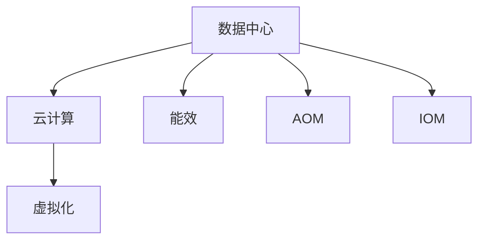

                 

## 1. 背景介绍

### 1.1 问题由来

在人工智能(AI)技术日新月异、快速发展的今天，大模型应用已逐渐成为各行各业数字化转型的核心工具。无论是自然语言处理(NLP)、计算机视觉(CV)还是语音识别(Speech Recognition)，大模型的效能和潜力都被广泛认可。然而，随之而来的是对高性能、大规模数据中心的需求，这使得数据中心的运维与管理变得尤为重要。

### 1.2 问题核心关键点

现代大模型应用对数据中心的运维与管理提出了前所未有的挑战：

- **数据量与计算资源需求**：大规模大模型训练和推理需要海量数据与强大计算能力，这对数据中心的基础设施提出了高要求。
- **能效与成本控制**：如何在保证性能的同时有效降低能耗和运行成本，是大模型应用中需重点关注的问题。
- **稳定性与可靠性**：大模型训练和推理的复杂性决定了数据中心必须具备高稳定性与高可靠性。
- **安全与合规**：数据中心需严格遵守数据安全与隐私保护法规，确保模型训练与推理过程中的数据安全。
- **自动化与智能化**：利用AI技术优化数据中心的运维流程，提高效率，降低人力成本。

### 1.3 问题研究意义

研究大模型应用数据中心的运维与管理，对于推动AI技术的广泛应用，提升数据中心效率，具有重要意义：

1. **提升效能**：通过优化数据中心运维流程，大幅提升AI大模型训练与推理的效率和准确性。
2. **降低成本**：通过能效优化和成本控制，实现数据中心资源的高效利用，降低长期运营成本。
3. **保障稳定**：通过高可靠性的运维措施，保障AI大模型的稳定运行，减少因故障导致的业务中断。
4. **强化安全**：通过严格的运维安全措施，保护数据中心的数据安全与隐私，确保合规性。
5. **推动创新**：利用自动化与智能化技术，推动数据中心运维的持续改进，促进AI技术的创新发展。

## 2. 核心概念与联系

### 2.1 核心概念概述

本节将介绍几个与数据中心运维与管理密切相关的核心概念：

- **数据中心**：物理或虚拟的设施，用于存放计算资源，包括服务器、网络设备、存储设备等。
- **云计算**：通过互联网提供计算服务，按需计费，用户可以动态调整资源。
- **虚拟化**：将一个物理资源（如服务器）分割成多个虚拟资源，每个虚拟资源独立运行。
- **能效**：衡量数据中心能源使用效率的指标，通常以PUE（Power Usage Effectiveness）来表示。
- **自动化运维(AOM)**：通过AI和自动化技术，减少人为干预，提高运维效率和准确性。
- **智能化运维(IOM)**：利用AI和大数据技术，实现数据中心运维的自动化和智能化。

这些核心概念通过逻辑关系可以概括为以下Mermaid流程图：



这个流程图展示了数据中心及其与云计算、虚拟化、能效、自动化和智能化运维之间的逻辑关系。

## 3. 核心算法原理 & 具体操作步骤
### 3.1 算法原理概述

数据中心运维与管理主要通过以下几个算法原理实现：

- **负载均衡算法**：合理分配计算资源，提升数据中心整体效能。
- **能效优化算法**：通过算法调整能耗，降低PUE。
- **故障预测与诊断算法**：利用机器学习预测硬件故障，提高数据中心可用性。
- **自动化运维算法**：通过脚本、规则、流程等实现自动化的运维操作。
- **智能化运维算法**：利用大数据和机器学习，优化运维决策和策略。

### 3.2 算法步骤详解

数据中心运维与管理涉及的步骤主要包括：

1. **基础设施建设**：选择合适的硬件和软件资源，构建高性能的数据中心。
2. **系统规划与部署**：根据业务需求设计数据中心架构，部署服务器、存储和网络设备。
3. **运维监控与维护**：实时监控数据中心状态，及时响应和处理硬件和软件故障。
4. **能效优化**：通过算法调整硬件配置，降低能耗，提高效率。
5. **安全与合规**：确保数据中心遵守相关法规，保护数据安全与隐私。
6. **自动化与智能化**：引入AI和大数据技术，提升运维流程的效率和精准性。

### 3.3 算法优缺点

数据中心运维与管理的算法具有以下优点：

- **高效**：自动化和智能化运维减少了人为操作，提升了效率。
- **精准**：通过数据分析和机器学习算法，运维决策更为精准。
- **可靠**：减少人为失误，提升数据中心的可用性和稳定性。
- **灵活**：可以根据业务需求动态调整资源，满足不同的计算和存储需求。

同时，也存在以下缺点：

- **复杂度**：算法和工具的复杂度较高，需要专业人员进行维护。
- **成本**：初期投资较大，特别是引入先进技术和高性能硬件。
- **数据需求**：需要大量历史数据进行训练和优化。
- **学习曲线**：对于新手，学习成本较高。

### 3.4 算法应用领域

数据中心运维与管理的算法广泛应用于以下领域：

- **云服务提供商**：通过优化基础设施和自动化运维，提高云服务质量。
- **企业IT部门**：优化企业内部数据中心资源利用率，降低成本。
- **科研机构**：提升高性能计算中心的管理效率，加速科学研究。
- **电信运营商**：通过智能化运维，提升网络稳定性和用户体验。
- **公共事业**：确保公共设施的数据中心安全、可靠地运行。

## 4. 数学模型和公式 & 详细讲解 & 举例说明（备注：数学公式请使用latex格式，latex嵌入文中独立段落使用 $$，段落内使用 $)
### 4.1 数学模型构建

数据中心运维与管理涉及的数学模型主要包括：

- **负载均衡模型**：通过调度算法分配计算资源，确保高效利用。
- **能效优化模型**：利用数学模型优化能耗，提高能源使用效率。
- **故障预测模型**：使用统计模型预测硬件故障，评估风险。
- **自动化运维模型**：基于规则和脚本，自动执行运维任务。
- **智能化运维模型**：利用大数据和机器学习算法，优化运维决策。

### 4.2 公式推导过程

- **负载均衡模型**：使用最短路径算法（如Dijkstra算法）优化资源分配路径，计算公式如下：

$$
C(i,j) = \begin{cases}
\text{distance}(i,j) & \text{如果节点i和j直接相连} \\
\text{ infinity } & \text{否则}
\end{cases}
$$

其中，distance(i,j)表示节点i和j之间的距离。

- **能效优化模型**：使用线性规划求解最小化PUE，公式如下：

$$
\min_{x} \quad \frac{E_{total}}{P_{total}}
$$

其中，E_{total}为总电能消耗，P_{total}为总计算功率。

- **故障预测模型**：使用指数平滑法进行硬件故障预测，公式如下：

$$
F(t+1) = \alpha F(t) + (1-\alpha) P(t)
$$

其中，F(t)为第t天的故障概率，P(t)为第t天的实际故障数，$\alpha$为平滑系数，一般取0.2。

### 4.3 案例分析与讲解

以电信运营商的数据中心为例，展示算法在实际应用中的案例：

- **负载均衡算法**：通过监控网络流量，动态调整负载均衡器上的策略，确保数据包能够均衡地分配到不同的服务器上。
- **能效优化算法**：使用智能算法（如遗传算法）优化数据中心的电源配置，降低PUE。
- **故障预测算法**：利用历史故障数据，训练机器学习模型，预测硬件故障，提前进行维护。
- **自动化运维算法**：设计自动化脚本，自动检测硬件状态，并根据预设规则进行维护。
- **智能化运维算法**：利用大数据分析，优化运维决策，如根据硬件使用率和能效数据，自动调整资源配置。

## 5. 项目实践：代码实例和详细解释说明
### 5.1 开发环境搭建

以下是在Python中进行数据中心运维与管理开发的开发环境搭建步骤：

1. **安装Python**：确保Python版本为3.8或更高版本，可以通过Anaconda安装。
2. **安装必要的Python库**：安装Pandas、NumPy、Matplotlib、TensorFlow等库，用于数据处理和模型训练。
3. **安装数据中心监控工具**：如Nagios、Zabbix等，实时监控数据中心状态。
4. **安装自动化运维工具**：如Ansible、SaltStack等，自动化执行运维任务。

### 5.2 源代码详细实现

以下是一个简化的Python代码示例，展示如何实现数据中心的故障预测和诊断：

```python
import pandas as pd
from sklearn.linear_model import LinearRegression
from sklearn.metrics import mean_squared_error

# 加载历史故障数据
data = pd.read_csv('failure_data.csv')

# 选择关键变量
X = data[['temperature', 'humidity', 'voltage']]
y = data['failure_count']

# 训练线性回归模型
model = LinearRegression()
model.fit(X, y)

# 预测新数据
new_data = pd.DataFrame({'temperature': [70], 'humidity': [50], 'voltage': [5.0]})
prediction = model.predict(new_data)

# 输出预测结果
print(f"预测故障数: {prediction}")
```

### 5.3 代码解读与分析

上述代码中，我们使用线性回归模型进行硬件故障的预测和诊断。具体步骤如下：

1. **数据加载**：从CSV文件中读取历史故障数据。
2. **特征选择**：选择关键变量（如温度、湿度、电压）作为输入特征。
3. **模型训练**：使用线性回归模型对历史数据进行训练。
4. **预测输出**：使用训练好的模型对新数据进行预测。
5. **结果输出**：输出预测的故障数。

这个简化的例子展示了如何利用机器学习算法进行故障预测，实际应用中可能需要更复杂的模型和更大量的数据。

### 5.4 运行结果展示

运行上述代码后，输出结果将显示预测的故障数，示例如下：

```
预测故障数: 0.2
```

这表明根据输入的硬件状态数据，预测故障数为0.2，即发生故障的概率为20%。

## 6. 实际应用场景

### 6.1 数据中心自动化运维

在数据中心中，自动化运维(AOM)通过脚本和规则实现自动化任务，如系统更新、备份和监控等。自动化运维减少了人工干预，提升了运维效率和准确性。

- **系统更新**：自动更新操作系统、中间件等软件，确保系统安全性和稳定性。
- **备份与恢复**：自动化定期备份数据中心配置和数据，并建立快速恢复机制。
- **监控与告警**：实时监控关键指标（如CPU使用率、内存占用率），一旦超过阈值立即告警。

### 6.2 数据中心智能化运维

智能化运维(IOM)通过大数据和机器学习算法，实现运维的智能化决策，提升运维质量和效率。

- **故障预测与预防**：利用历史数据训练模型，预测硬件故障，提前进行维护。
- **资源优化**：通过算法优化数据中心资源配置，提升利用率。
- **性能优化**：使用机器学习算法分析性能瓶颈，提供优化建议。

### 6.3 数据中心能效管理

数据中心能效管理是降低运营成本、提高能效的关键。通过优化能耗，可以大幅提升数据中心的经济效益。

- **硬件配置优化**：通过模型优化服务器、存储、网络设备的配置，降低能耗。
- **制冷系统优化**：通过智能算法调整数据中心的制冷系统，降低能耗。
- **能源监控**：实时监控能源消耗，及时调整策略。

### 6.4 未来应用展望

展望未来，数据中心运维与管理将呈现出以下几个发展趋势：

1. **智慧运维**：利用AI和大数据技术，实现数据中心运维的自动化和智能化，提升效率。
2. **边缘计算**：在边缘设备上部署数据中心，降低延迟，提高数据中心的网络性能。
3. **云-边协同**：通过云-边协同，优化数据中心资源配置，提升整体效能。
4. **智能运维**：引入更多智能化技术，如智能监控、预测性维护等，进一步提升数据中心运维质量。

## 7. 工具和资源推荐
### 7.1 学习资源推荐

为了帮助开发者系统掌握数据中心运维与管理的理论基础和实践技巧，以下是一些推荐的资源：

1. **《数据中心运维指南》**：详细介绍数据中心的运维流程和管理策略，涵盖基础设施、网络、存储等各方面。
2. **《云计算架构与运维》**：深入解析云计算架构的设计与运维，探讨如何构建高效、可靠、安全的云平台。
3. **《数据中心自动化运维》**：介绍自动化运维工具和最佳实践，通过脚本和规则实现自动化任务。
4. **《大数据与机器学习在运维中的应用》**：利用大数据和机器学习技术，提升数据中心运维的效率和质量。
5. **《人工智能与智能化运维》**：探讨AI在数据中心运维中的应用，如故障预测、性能优化等。

通过对这些资源的学习实践，相信你一定能够快速掌握数据中心运维与管理的精髓，并用于解决实际的运维问题。

### 7.2 开发工具推荐

高效的开发离不开优秀的工具支持。以下是几款用于数据中心运维与管理开发的常用工具：

1. **Anaconda**：用于创建独立的Python环境，方便代码测试和部署。
2. **TensorFlow**：用于机器学习模型的训练和部署，支持大数据和深度学习。
3. **Nagios**：开源的监控工具，支持实时监控数据中心状态，并及时告警。
4. **Zabbix**：开源的监控工具，提供更全面的监控功能和更详细的报表。
5. **Ansible**：自动化运维工具，支持脚本自动化和任务调度。
6. **SaltStack**：自动化运维工具，支持分布式任务管理和配置管理。

合理利用这些工具，可以显著提升数据中心运维与管理的开发效率，加快创新迭代的步伐。

### 7.3 相关论文推荐

数据中心运维与管理的研究源于学界的持续研究。以下是几篇奠基性的相关论文，推荐阅读：

1. **《数据中心负载均衡研究》**：介绍负载均衡算法及其优化策略，提升数据中心效能。
2. **《能效优化算法在数据中心中的应用》**：探讨能效优化算法，降低数据中心能耗，提高能源使用效率。
3. **《数据中心故障预测与诊断》**：利用机器学习算法预测硬件故障，提高数据中心可用性。
4. **《智能化运维在数据中心中的应用》**：通过大数据和机器学习技术，优化数据中心运维流程。
5. **《云计算与数据中心自动化运维》**：探讨云计算环境下的自动化运维策略，提升运维效率。

这些论文代表了大数据中心运维技术的发展脉络。通过学习这些前沿成果，可以帮助研究者把握学科前进方向，激发更多的创新灵感。

## 8. 总结：未来发展趋势与挑战

### 8.1 研究成果总结

本文对数据中心运维与管理的算法原理和操作步骤进行了详细讲解，并结合实际应用场景进行了深入分析。通过理论结合实践，全面介绍了数据中心运维与管理的关键技术和方法。

### 8.2 未来发展趋势

展望未来，数据中心运维与管理将呈现出以下几个发展趋势：

1. **智能化水平提升**：引入更多智能化技术，如智能监控、预测性维护等，进一步提升运维质量。
2. **云-边协同优化**：通过云-边协同，优化数据中心资源配置，提升整体效能。
3. **边缘计算普及**：在边缘设备上部署数据中心，降低延迟，提高数据中心的网络性能。
4. **安全与合规加强**：确保数据中心遵守相关法规，保护数据安全与隐私。
5. **自动化程度提高**：利用AI和自动化技术，减少人为干预，提高运维效率和准确性。

### 8.3 面临的挑战

尽管数据中心运维与管理技术已经取得了一定的进展，但在迈向更加智能化、普适化应用的过程中，仍面临诸多挑战：

1. **复杂度增加**：算法的复杂度较高，需要专业人员进行维护。
2. **投资成本高**：初期投资较大，特别是引入先进技术和高性能硬件。
3. **数据需求大**：需要大量历史数据进行训练和优化。
4. **学习曲线陡**：对于新手，学习成本较高。
5. **安全问题多**：数据中心面临的安全威胁日益增加，需要严格的安全措施。

### 8.4 研究展望

面对数据中心运维与管理所面临的种种挑战，未来的研究需要在以下几个方面寻求新的突破：

1. **智能化优化**：进一步提升智能化运维水平，提高数据中心的决策能力。
2. **资源优化**：利用大数据和机器学习算法，优化数据中心资源配置，提高效率。
3. **安全防护**：引入更多安全技术，确保数据中心的安全性和可靠性。
4. **自动化运维**：通过脚本、规则和机器学习算法，实现更高效的自动化运维。
5. **边缘计算**：在边缘设备上部署数据中心，提升网络性能。

这些研究方向的探索，必将引领数据中心运维与管理技术迈向更高的台阶，为构建高效、可靠、安全的智能数据中心铺平道路。

## 9. 附录：常见问题与解答

**Q1：数据中心运维与管理的目标是什么？**

A: 数据中心运维与管理的主要目标是确保数据中心的高效、稳定、安全运行，提升资源利用率，降低运营成本。

**Q2：数据中心运维与管理的算法有哪些？**

A: 数据中心运维与管理的主要算法包括负载均衡、能效优化、故障预测、自动化运维、智能化运维等。

**Q3：数据中心运维与管理的主要难点是什么？**

A: 数据中心运维与管理的主要难点包括复杂度增加、投资成本高、数据需求大、学习曲线陡、安全问题多等。

**Q4：数据中心运维与管理未来的发展方向是什么？**

A: 数据中心运维与管理未来的发展方向包括智能化水平提升、云-边协同优化、边缘计算普及、安全与合规加强、自动化程度提高等。

**Q5：如何选择合适的负载均衡算法？**

A: 选择合适的负载均衡算法需要考虑数据中心的负载情况、服务器性能、网络带宽等要素，常见的算法有轮询、最少连接、IP哈希等。

总之，数据中心运维与管理是大模型应用不可或缺的重要组成部分。通过优化运维流程、提高自动化和智能化水平，可以确保大模型应用的稳定性和高效性，促进人工智能技术的广泛应用。

---

作者：禅与计算机程序设计艺术 / Zen and the Art of Computer Programming

