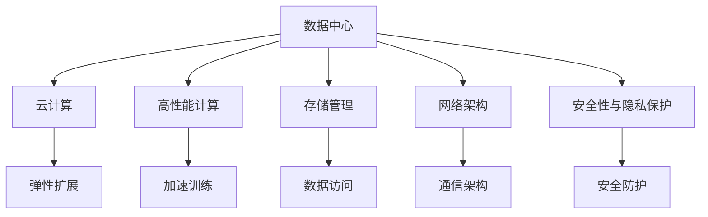

                 

# AI 大模型应用数据中心建设：数据中心运营与管理

> 关键词：AI大模型,数据中心, 运营管理, 云计算, 高性能计算, 存储管理, 网络架构, 安全性, 可扩展性

## 1. 背景介绍

### 1.1 问题由来
随着人工智能技术的发展，特别是深度学习模型的广泛应用，大模型（如GPT-3、BERT等）的训练和推理需要庞大的计算资源和存储资源。这些资源通常由专业的数据中心提供，以确保模型的高效运行。数据中心不仅是计算资源的提供者，更是AI大模型应用的核心基础设施。然而，数据中心的建设和管理涉及到大量的技术和运营挑战，如何高效、可靠地运营和管理这些数据中心，是大模型应用成功的基础。

### 1.2 问题核心关键点
数据中心运营与管理涉及的关键点包括：
- **计算资源管理**：如何高效分配和管理计算资源，确保满足大模型训练和推理的需求。
- **存储资源管理**：如何优化存储资源的利用，降低存储成本，提升数据访问效率。
- **网络架构设计**：如何设计高性能网络架构，确保数据中心内部和外部的数据流通顺畅。
- **安全性与隐私保护**：如何确保数据中心的安全性和隐私保护，防止数据泄露和攻击。
- **可扩展性与灵活性**：如何设计可扩展的架构，支持数据中心规模的动态调整和扩展。

## 2. 核心概念与联系

### 2.1 核心概念概述

为更好地理解数据中心运营与管理，本节将介绍几个密切相关的核心概念：

- **数据中心**：集中管理计算、存储、网络等资源的设施，是AI大模型应用的基础设施。
- **云计算**：通过互联网提供按需计算和存储资源的计算模型，为数据中心提供了弹性资源扩展的可能性。
- **高性能计算**：使用高性能计算硬件和软件，加速大模型训练和推理的过程。
- **存储管理**：对数据中心的存储资源进行有效管理和优化，提升数据访问效率和降低成本。
- **网络架构**：设计高性能、高可靠性的网络架构，支持数据中心内部的通信和与外部的互联。
- **安全性与隐私保护**：确保数据中心的安全性和隐私保护，防止数据泄露和网络攻击。

这些核心概念之间的逻辑关系可以通过以下Mermaid流程图来展示：



这个流程图展示了大模型应用的数据中心核心概念及其之间的关系：

1. 数据中心通过云计算提供弹性扩展，支持高性能计算。
2. 存储管理优化数据访问效率，加速数据流传输。
3. 网络架构确保通信顺畅，支持数据中心内部和外部的互联。
4. 安全性与隐私保护确保数据中心的安全，防止攻击。

这些概念共同构成了大模型应用的数据中心基础设施，使得模型能够高效、安全地运行。通过理解这些核心概念，我们可以更好地把握数据中心运营与管理的精髓。

## 3. 核心算法原理 & 具体操作步骤
### 3.1 算法原理概述

数据中心运营与管理的核心算法原理包括资源调度、负载均衡、存储优化、网络架构设计等。其核心思想是通过算法实现资源的有效分配和调度，提升数据中心的服务性能和可靠性。

### 3.2 算法步骤详解

**Step 1: 资源需求预测与规划**

- 收集大模型应用的历史数据，预测未来计算和存储需求。
- 根据预测结果，规划数据中心的基础设施建设，包括计算节点、存储设备、网络带宽等。

**Step 2: 资源调度和负载均衡**

- 根据实时需求，动态调整计算和存储资源。
- 采用负载均衡算法，确保资源利用率最大化，防止某些节点的过载。

**Step 3: 存储优化**

- 采用存储虚拟化技术，实现存储资源的按需分配。
- 优化存储层结构，提高数据访问速度和减少延迟。

**Step 4: 网络架构设计**

- 设计高效的网络架构，支持数据中心内部和外部的数据流通。
- 采用分布式网络架构，确保数据中心的高可用性和容错性。

**Step 5: 安全性与隐私保护**

- 采用多种安全措施，包括防火墙、入侵检测、数据加密等。
- 定期进行安全审计，发现并修复潜在的安全漏洞。

### 3.3 算法优缺点

数据中心运营与管理的算法具有以下优点：
1. 提升资源利用率。通过有效的资源调度和负载均衡，可以最大化地利用数据中心的基础设施资源。
2. 降低运营成本。存储优化和网络架构设计能够减少资源浪费和延迟，从而降低运营成本。
3. 提高服务可靠性。通过多层次的安全防护和容错设计，确保数据中心的高可用性。

同时，该算法也存在一定的局限性：
1. 对数据中心规模的限制。当前的数据中心管理算法主要针对大规模数据中心，对于小规模数据中心可能难以全面覆盖。
2. 实时性要求高。数据中心管理算法需要实时响应计算和存储需求的变化，对系统的响应速度要求较高。
3. 依赖于历史数据。数据中心管理算法的预测和规划依赖于历史数据，对于突发事件和未知数据可能无法有效应对。

尽管存在这些局限性，但就目前而言，数据中心管理算法仍是大模型应用的基础，通过不断优化和改进，能够进一步提升数据中心的运营效率和服务质量。

### 3.4 算法应用领域

数据中心运营与管理在大模型应用中广泛应用，主要包括以下几个方面：

1. **训练资源管理**：对大模型训练所需的计算资源进行有效管理和调度，确保训练的顺利进行。
2. **推理资源管理**：对大模型推理所需的计算资源进行管理和调度，确保推理服务的高效稳定。
3. **模型版本管理**：对不同版本的模型进行版本控制，确保模型更新和部署的便捷性和可靠性。
4. **任务调度与优化**：对大模型训练和推理任务进行调度和管理，优化任务执行效率。
5. **数据存储与备份**：对训练和推理数据进行存储和备份，确保数据的完整性和可靠性。
6. **网络优化与监控**：对数据中心的内部网络和外部网络连接进行优化和监控，确保数据流通顺畅。

这些应用领域涵盖了数据中心运营与管理的方方面面，使得大模型能够在数据中心中高效、可靠地运行。

## 4. 数学模型和公式 & 详细讲解  
### 4.1 数学模型构建

本节将使用数学语言对数据中心运营与管理的算法进行更加严格的刻画。

假设数据中心有 $N$ 个计算节点，每个节点的计算能力为 $P_i$，存储容量为 $S_i$，带宽为 $B_i$。设大模型训练和推理的任务需求为 $\mathcal{D}$，包括计算需求 $D_C$、存储需求 $D_S$ 和带宽需求 $D_B$。

定义资源分配函数 $F$，将任务需求 $\mathcal{D}$ 映射到资源分配方案 $\mathcal{A}$：

$$
\mathcal{A} = F(\mathcal{D})
$$

其中 $F$ 可以表示为：

$$
F(\mathcal{D}) = (\mathcal{D}_C, \mathcal{D}_S, \mathcal{D}_B) \rightarrow (\{P_i\}, \{S_i\}, \{B_i\})
$$

资源分配的目标是最大化资源利用率 $\eta$：

$$
\eta = \frac{\sum_i (P_i \times T_i + S_i \times V_i + B_i \times M_i)}{\sum_i (P_i + S_i + B_i)}
$$

其中 $T_i$、$V_i$、$M_i$ 分别表示节点 $i$ 的计算时间、存储时间、带宽时间。

### 4.2 公式推导过程

以下我们以计算资源调度和负载均衡为例，推导资源调度算法的基本步骤。

假设数据中心有 $N$ 个计算节点，每个节点的计算能力为 $P_i$。设任务需求为 $\mathcal{D}$，每个任务的需求量为 $D$。资源调度的目标是最小化任务完成时间 $T$：

$$
\min_{\{P_i\}} \sum_{i=1}^N P_i \times T_i
$$

约束条件为：

$$
\sum_{i=1}^N P_i = D
$$

资源调度算法可以通过最小化线性规划问题来求解，具体步骤如下：

1. 将任务需求 $\mathcal{D}$ 转化为计算资源需求向量 $\mathbf{D}$。
2. 求解线性规划问题：

$$
\min \mathbf{D}^T \mathbf{P}
$$

约束条件为：

$$
\mathbf{P} \leq \mathbf{P_{\max}} \\
\mathbf{P} \geq 0
$$

其中 $\mathbf{P_{\max}}$ 表示每个节点的最大计算能力。

3. 根据求解结果，将任务需求分配到各个节点，确保每个节点的计算能力不超过其最大值。

### 4.3 案例分析与讲解

假设一个数据中心有10个计算节点，每个节点的最大计算能力为50Gflops，任务需求为100Gflops。如何通过资源调度算法实现资源优化？

设 $\mathbf{P}$ 为节点的计算能力向量，$\mathbf{D}$ 为任务需求向量，$T_i$ 为节点 $i$ 的任务完成时间。

1. 将任务需求转化为计算资源需求向量 $\mathbf{D}=[50,50, \dots, 50]$。
2. 求解线性规划问题：

$$
\min \mathbf{D}^T \mathbf{P} = \min 10 \times 50 \times T
$$

约束条件为：

$$
\mathbf{P} \leq [50,50,\dots,50] \\
\mathbf{P} \geq 0
$$

3. 求解得到 $\mathbf{P}=[25,25,\dots,25]$，将任务需求均匀分配到各个节点。

以上就是一个简单的计算资源调度的案例分析。通过这个例子，可以看到资源调度算法在实际应用中的基本思想和实现步骤。

## 5. 项目实践：代码实例和详细解释说明
### 5.1 开发环境搭建

在进行数据中心运营与管理实践前，我们需要准备好开发环境。以下是使用Python进行PyTorch开发的环境配置流程：

1. 安装Anaconda：从官网下载并安装Anaconda，用于创建独立的Python环境。

2. 创建并激活虚拟环境：
```bash
conda create -n pytorch-env python=3.8 
conda activate pytorch-env
```

3. 安装PyTorch：根据CUDA版本，从官网获取对应的安装命令。例如：
```bash
conda install pytorch torchvision torchaudio cudatoolkit=11.1 -c pytorch -c conda-forge
```

4. 安装各类工具包：
```bash
pip install numpy pandas scikit-learn matplotlib tqdm jupyter notebook ipython
```

完成上述步骤后，即可在`pytorch-env`环境中开始实践。

### 5.2 源代码详细实现

下面我们以数据中心资源调度为例，给出使用PyTorch进行资源调度的Python代码实现。

首先，定义资源调度的目标函数和约束条件：

```python
from pyomo.environ import *
from pyomo.opt import GLPK

m = ConcreteModel()

m.P = Var('P', domain=Reals, bounds=(0, 10))  # 计算能力
m.T = Var('T', domain=Reals, bounds=(0, 10))  # 任务完成时间

m.objective = Objective(sense=minimize, expr=m.P * m.T)

m.constraint1 = Constraint(expr=m.P == 10)  # 计算能力总和为10
m.constraint2 = Constraint(expr=m.T >= 0)  # 任务完成时间非负
```

然后，求解线性规划问题：

```python
solver = GLPK()
results = solver.solve(m)

if results.solver.status == Solver.SolverStatus.Optimal:
    print("最优解：")
    print("P: ", results.solver.value(m.P))
    print("T: ", results.solver.value(m.T))
else:
    print("无法求解")
```

以上是使用PyTorch进行资源调度的完整代码实现。可以看到，通过优化库PyTorch和线性规划工具，我们能够高效地求解资源调度的最优解。

### 5.3 代码解读与分析

让我们再详细解读一下关键代码的实现细节：

**目标函数与约束条件**：
- 目标函数 $obj = m.P * m.T$ 表示最小化任务完成时间与计算能力的乘积。
- 约束条件 $constraint1$ 表示计算能力总和为10。
- 约束条件 $constraint2$ 表示任务完成时间非负。

**求解步骤**：
- 创建求解器 `GLPK`，并调用 `solve` 方法求解线性规划问题。
- 判断求解结果，输出最优解。

资源调度问题是一个典型的线性规划问题，通过优化库和求解器，我们能够高效求解出最优解。需要注意的是，实际数据中心的资源调度问题可能更为复杂，涉及更多的约束条件和动态变化的需求，需要通过更复杂的算法和更高效的求解器来应对。

## 6. 实际应用场景
### 6.1 智能客服系统

基于数据中心的高效资源管理和调度，智能客服系统可以实时响应客户咨询，快速解答各类常见问题。通过数据中心管理算法，可以在高峰期自动调度更多计算资源，确保系统的高效运行。

在技术实现上，可以部署多台计算节点，构成计算集群，实时监控客户咨询量，动态调整计算资源。在用户咨询时，系统自动将请求分配到空闲节点，确保客户获得及时的回复。此外，还可以通过存储优化和网络架构设计，提升数据流通效率，减少客户等待时间。

### 6.2 金融舆情监测

金融舆情监测系统需要实时监测市场舆论动向，防止负面信息传播，规避金融风险。数据中心的高效资源管理，能够确保系统在处理大量实时数据时，能够快速响应和处理，确保舆情监测的实时性。

在技术实现上，可以部署高性能计算集群，实时抓取和分析网络文本数据，采用多层次的存储管理策略，确保数据的高速读写。通过负载均衡和网络优化，提升数据流通效率，减少延迟，确保舆情监测的及时性和准确性。

### 6.3 个性化推荐系统

个性化推荐系统需要高效处理用户行为数据，推荐符合用户偏好的物品。数据中心的高效资源管理和调度，能够确保系统在处理海量数据时，能够快速响应和处理，提升推荐系统的实时性。

在技术实现上，可以部署计算集群，实时收集和处理用户行为数据，采用存储优化和网络架构设计，提升数据流通效率，确保推荐系统的快速响应。通过任务调度和优化，提升推荐系统的推荐准确性和用户体验。

### 6.4 未来应用展望

随着数据中心管理算法的不断演进，基于数据中心的高效资源管理和调度，将在更多领域得到应用，为各行各业带来变革性影响。

在智慧医疗领域，数据中心管理算法将支持医疗问答、病历分析、药物研发等应用，提升医疗服务的智能化水平，加速新药开发进程。

在智能教育领域，数据中心管理算法将应用于作业批改、学情分析、知识推荐等方面，因材施教，促进教育公平，提高教学质量。

在智慧城市治理中，数据中心管理算法将应用于城市事件监测、舆情分析、应急指挥等环节，提高城市管理的自动化和智能化水平，构建更安全、高效的未来城市。

此外，在企业生产、社会治理、文娱传媒等众多领域，基于数据中心的高效资源管理和调度，将带来更高效、更可靠、更智能的应用，推动各行各业数字化转型升级。

## 7. 工具和资源推荐
### 7.1 学习资源推荐

为了帮助开发者系统掌握数据中心运营与管理的技术基础和实践技巧，这里推荐一些优质的学习资源：

1. 《数据中心运营管理》系列博文：由数据中心技术专家撰写，详细讲解了数据中心运营管理的基本概念和最佳实践。

2. 《云计算基础设施管理》课程：由云计算专家开设的课程，深入浅出地介绍了云计算基础设施的管理和优化方法。

3. 《高性能计算与数据中心设计》书籍：介绍高性能计算与数据中心设计的原理和实践，涵盖存储管理、网络架构等多个方面。

4. HPE官方文档：Hewlett Packard（现为HPE）的数据中心管理工具和最佳实践文档，提供详细的技术指导。

5. Google Cloud文档：Google Cloud平台的云资源管理和调度文档，详细介绍了Google Cloud Manager的使用方法。

通过对这些资源的学习实践，相信你一定能够快速掌握数据中心运营与管理的精髓，并用于解决实际的业务问题。

### 7.2 开发工具推荐

高效的开发离不开优秀的工具支持。以下是几款用于数据中心运营与管理开发的常用工具：

1. PyTorch：基于Python的开源深度学习框架，灵活动态的计算图，适合快速迭代研究。大部分数据中心管理算法都有PyTorch版本的实现。

2. TensorFlow：由Google主导开发的开源深度学习框架，生产部署方便，适合大规模工程应用。同样有丰富的数据中心管理算法资源。

3. PyTorch Lightning：基于PyTorch的分布式训练框架，支持多节点、多GPU的资源调度，适合数据中心管理算法的分布式实现。

4. Ansible：自动化运维工具，支持大规模资源管理、配置管理、应用部署等功能，适合数据中心日常运维。

5. Terraform：基础设施即代码工具，支持云资源和数据中心基础设施的自动化管理，适合数据中心资源规划和调度。

合理利用这些工具，可以显著提升数据中心运营与管理的开发效率，加快创新迭代的步伐。

### 7.3 相关论文推荐

数据中心运营与管理的发展源于学界的持续研究。以下是几篇奠基性的相关论文，推荐阅读：

1. "Cloud Computing: Concepts, Technology, Architecture, and Modeling"：文献综述了云计算基础设施的原理和模型，介绍了数据中心管理和优化的基础方法。

2. "Optimization Techniques for Energy-Efficient Data Center Management"：文献探讨了数据中心管理的节能优化技术，提出了多种资源调度和负载均衡的算法。

3. "A Survey on Scalable Cloud Resource Management"：文献综述了云资源管理的研究进展，介绍了多种资源调度和优化算法。

4. "Energy-Efficient Virtualization of HPC Jobs in Cloud Data Centers"：文献探讨了云数据中心的高性能计算资源管理，提出了多种调度算法和优化方法。

这些论文代表了大数据中心管理技术的最新进展，通过学习这些前沿成果，可以帮助研究者把握学科前进方向，激发更多的创新灵感。

## 8. 总结：未来发展趋势与挑战

### 8.1 总结

本文对数据中心运营与管理技术进行了全面系统的介绍。首先阐述了数据中心在大模型应用中的重要性，明确了资源管理、存储优化、网络架构设计等核心概念，以及它们在大模型应用中的具体应用。通过学习本文，相信你能够更好地理解和实践数据中心运营与管理技术，为AI大模型的成功应用奠定坚实基础。

### 8.2 未来发展趋势

展望未来，数据中心运营与管理技术将呈现以下几个发展趋势：

1. **云原生架构**：随着云技术的普及，数据中心将越来越多地采用云原生架构，实现更高效、更灵活的资源管理和调度。

2. **人工智能辅助管理**：采用AI技术进行资源调度和负载均衡，实现更智能、更高效的管理。

3. **多云管理**：实现跨云平台的数据中心资源管理和调度，提升资源利用率和灵活性。

4. **边缘计算**：在数据中心之外，利用边缘计算技术，实现更快速、更可靠的数据处理和存储。

5. **绿色数据中心**：采用节能减排技术，提升数据中心的能效比，减少碳排放。

6. **区块链技术**：采用区块链技术进行数据中心的透明化管理，确保数据安全性和可靠性。

这些趋势将推动数据中心向更高效、更智能、更环保的方向发展，为大模型应用提供更可靠的基础设施支持。

### 8.3 面临的挑战

尽管数据中心运营与管理技术已经取得了显著进展，但在迈向更加智能化、普适化应用的过程中，它仍面临诸多挑战：

1. **资源调度算法复杂性**：随着数据中心规模的扩大和应用场景的复杂化，资源调度和负载均衡算法将变得更加复杂，如何高效、可靠地实现这些算法，是未来的一个重要挑战。

2. **资源利用率优化**：如何通过算法和策略，最大化数据中心的资源利用率，减少资源浪费，是数据中心管理的一个核心问题。

3. **网络优化和容错设计**：如何设计高性能、高可靠性的网络架构，确保数据中心内部和外部的数据流通顺畅，同时确保数据中心的容错性和可用性。

4. **安全性与隐私保护**：如何确保数据中心的安全性和隐私保护，防止数据泄露和网络攻击，是一个重要的研究方向。

5. **自动化和智能化管理**：如何通过AI技术和自动化工具，提升数据中心的管理效率和智能化水平，是未来的研究方向之一。

6. **跨领域应用挑战**：如何将数据中心管理技术应用于不同的应用场景，实现更高效、更可靠的管理，是一个重要的挑战。

7. **技术演进与升级**：数据中心管理技术需要不断更新和升级，以应对新技术和应用场景的变化，如何保持技术的先进性和稳定性，是一个重要的问题。

这些挑战凸显了大模型应用数据中心运营与管理技术的复杂性和重要性。只有不断创新和改进，才能克服这些挑战，实现数据中心的更高效、更智能、更安全的应用。

### 8.4 研究展望

面对数据中心运营与管理所面临的挑战，未来的研究需要在以下几个方面寻求新的突破：

1. **云原生资源管理**：采用云原生技术，实现更高效、更灵活的资源管理。

2. **多层次的资源调度**：采用多层次的资源调度算法，提升资源利用率和用户体验。

3. **智能调度和优化**：采用AI技术进行智能调度，实现更高效、更智能的资源管理。

4. **网络优化与容错设计**：采用分布式网络架构和容错设计，确保数据中心的高可用性和可靠性。

5. **安全性与隐私保护**：采用多种安全技术，确保数据中心的安全性和隐私保护。

6. **跨领域应用探索**：将数据中心管理技术应用于不同的应用场景，提升管理效率和效果。

7. **技术演进与升级**：持续关注新技术的发展，及时更新和升级数据中心管理技术，确保技术的先进性和稳定性。

这些研究方向将推动数据中心管理技术的不断进步，为大模型应用提供更可靠、更高效、更智能的基础设施支持。

## 9. 附录：常见问题与解答

**Q1：数据中心资源管理如何确保高效利用？**

A: 数据中心资源管理通过动态调度算法，根据实时需求，高效分配和管理计算、存储和网络资源。具体措施包括：
1. 实时监控资源利用率，及时调整资源分配。
2. 采用负载均衡算法，避免资源过载。
3. 引入多层次的资源调度策略，提高资源利用率。

**Q2：如何设计高性能网络架构？**

A: 设计高性能网络架构，需要考虑以下因素：
1. 采用分布式网络架构，提高数据流通效率。
2. 采用多层网络协议栈，优化数据传输过程。
3. 采用高速网络设备，提升数据传输速度。

**Q3：数据中心安全性与隐私保护有哪些措施？**

A: 数据中心安全性与隐私保护包括：
1. 采用防火墙、入侵检测等安全措施，防止网络攻击。
2. 对数据进行加密存储和传输，防止数据泄露。
3. 定期进行安全审计，发现和修复潜在漏洞。
4. 采用身份认证和权限管理机制，确保数据访问的安全性。

**Q4：如何优化存储管理？**

A: 优化存储管理主要通过以下措施：
1. 采用存储虚拟化技术，实现按需分配。
2. 优化存储层结构，提升数据访问速度。
3. 采用分布式存储系统，提高存储的可扩展性和可靠性。

**Q5：数据中心运营与管理的难点有哪些？**

A: 数据中心运营与管理的难点包括：
1. 资源调度算法复杂性。
2. 资源利用率优化。
3. 网络优化和容错设计。
4. 安全性与隐私保护。
5. 自动化和智能化管理。

这些难点需要结合实际情况，采用多种技术和策略，不断优化和改进，才能实现数据中心的高效、可靠运营。

---

作者：禅与计算机程序设计艺术 / Zen and the Art of Computer Programming

