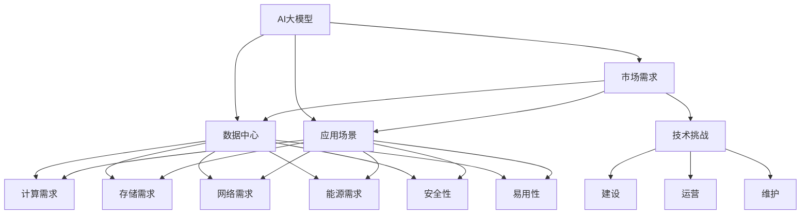

                 

# AI 大模型应用数据中心的市场前景

> 关键词：大模型, 数据中心, AI, 市场前景, 应用场景

## 1. 背景介绍

### 1.1 问题由来

近年来，人工智能（AI）技术迅猛发展，尤其是深度学习和大规模预训练模型的兴起，极大地推动了AI技术在各个领域的应用。AI大模型如GPT-3、BERT等，因其广泛的知识面和强大的推理能力，成为众多行业的重要工具。然而，这些大模型的训练和推理需要极大的计算资源，尤其是在数据中心等高性能计算环境中。因此，AI大模型应用数据中心的市场前景备受关注。

### 1.2 问题核心关键点

AI大模型应用数据中心的核心关键点主要包括：

- **计算需求**：大模型的训练和推理需要强大的计算资源，如GPU、TPU等。
- **存储需求**：模型参数和训练数据需要大容量的存储设备，以保证模型的稳定性和可扩展性。
- **网络需求**：高吞吐量的网络带宽和低延迟的通信链路，以支持大模型的并行计算和分布式训练。
- **能源需求**：数据中心的能耗是一个重要问题，需要优化能源消耗，以降低运营成本。
- **安全性**：保护模型和数据的安全性，防止数据泄露和攻击。
- **易用性**：提供易用的API和开发工具，简化用户的使用体验。

这些关键点决定了AI大模型应用数据中心的建设需求和市场前景。

## 2. 核心概念与联系

### 2.1 核心概念概述

- **AI大模型**：指通过在大规模数据上预训练得到的深度学习模型，具有广泛的适用性和强大的推理能力。
- **数据中心**：提供计算、存储和网络等资源，支持AI大模型的训练和推理。
- **AI应用场景**：AI大模型在各种实际应用中的使用，如自然语言处理、计算机视觉、推荐系统等。
- **市场需求**：企业和机构对AI大模型应用数据中心的需求和支付意愿。
- **技术挑战**：数据中心在建设、运营和维护过程中面临的各种技术难题。

这些概念之间的逻辑关系可以通过以下Mermaid流程图来展示：



这个流程图展示了大模型、数据中心、应用场景等关键概念及其之间的关系：

1. AI大模型通过数据中心的资源进行训练和推理。
2. 数据中心需要满足计算、存储、网络、能源、安全和易用性等多方面的需求。
3. 应用场景决定了数据中心建设的具体需求和市场前景。
4. 市场需求推动数据中心的建设和优化。
5. 技术挑战需要不断解决，以提升数据中心的效率和性能。

## 3. 核心算法原理 & 具体操作步骤

### 3.1 算法原理概述

AI大模型应用数据中心的建设，需要遵循以下几个基本原则：

- **计算优先级**：根据模型的训练和推理需求，合理分配计算资源，优先满足高计算需求的任务。
- **存储分层**：将数据和模型参数按照热度和频率进行分层存储，提高数据访问效率。
- **网络优化**：采用高速互联网络，支持模型的高吞吐量和低延迟通信。
- **能源管理**：通过能效优化技术，降低数据中心的能源消耗和运营成本。
- **安全防护**：采用多层次安全防护措施，保护模型和数据的安全。
- **易用性设计**：提供简单易用的API和开发工具，降低用户使用门槛。

### 3.2 算法步骤详解

AI大模型应用数据中心的建设，通常包括以下几个关键步骤：

**Step 1: 需求分析**

- 收集AI大模型和应用场景的具体需求，确定数据中心的规模和配置。
- 分析模型的计算、存储、网络等需求，制定详细的建设方案。

**Step 2: 基础设施建设**

- 选择合适的物理和虚拟资源，如服务器、存储设备和网络设备。
- 根据需求搭建计算、存储和网络等基础设施。
- 部署数据中心的管理和监控系统，确保设备正常运行。

**Step 3: 软件部署**

- 安装和配置必要的软件环境，如操作系统、数据库和AI框架。
- 集成AI大模型的训练和推理环境，支持模型的部署和运行。
- 提供易用的API和开发工具，方便用户使用模型。

**Step 4: 性能优化**

- 对数据中心进行性能测试，优化计算、存储和网络等资源的利用效率。
- 采用节能技术，降低数据中心的能耗和运营成本。
- 通过负载均衡和故障恢复机制，确保系统的稳定性和可用性。

**Step 5: 安全防护**

- 部署多层次的安全防护措施，防止数据泄露和攻击。
- 实施数据加密和访问控制策略，保护模型的安全。
- 定期进行安全审计和漏洞扫描，及时发现和修复安全漏洞。

**Step 6: 运营维护**

- 建立数据中心的运维团队，负责日常运营和维护工作。
- 提供故障诊断和快速修复服务，确保数据中心的高可用性。
- 不断优化数据中心的性能和安全性，满足日益增长的应用需求。

### 3.3 算法优缺点

AI大模型应用数据中心的建设，具有以下优点：

- **高效计算**：能够提供强大的计算资源，支持大模型的训练和推理。
- **存储丰富**：提供大容量的存储设备，支持模型的参数和数据存储。
- **网络可靠**：采用高速互联网络，保证模型的高吞吐量和低延迟通信。
- **能源节省**：采用节能技术，降低数据中心的能耗和运营成本。
- **安全性高**：多层次的安全防护措施，保障模型和数据的安全。
- **易用性强**：提供易用的API和开发工具，降低用户的使用门槛。

同时，数据中心的建设也面临以下缺点：

- **高投入**：建设数据中心需要大量的资金投入，包括硬件、软件和人力等成本。
- **复杂管理**：数据中心的运行和管理需要高度的技术和经验，容易出现各种问题。
- **能耗大**：数据中心的能耗较高，对环境和社会影响较大。
- **运维成本高**：数据中心的运维和维护需要持续投入，增加运营成本。

尽管存在这些缺点，AI大模型应用数据中心的建设仍具有巨大的市场前景，尤其是在高性能计算和智能化应用的需求日益增长的背景下。

### 3.4 算法应用领域

AI大模型应用数据中心的应用领域非常广泛，涵盖以下几个方面：

- **自然语言处理**：如聊天机器人、翻译系统、语音识别等。
- **计算机视觉**：如图像识别、目标检测、图像生成等。
- **推荐系统**：如电商推荐、内容推荐、广告推荐等。
- **自动驾驶**：如车辆感知、路径规划、自动驾驶等。
- **智能医疗**：如疾病诊断、影像识别、医疗咨询等。
- **智能制造**：如设备监控、质量检测、生产优化等。

这些应用场景都需要强大的计算资源和数据支持，AI大模型应用数据中心能够提供必要的支持，推动相关产业的发展。

## 4. 数学模型和公式 & 详细讲解 & 举例说明

### 4.1 数学模型构建

AI大模型应用数据中心的建设，涉及大量的数学模型和公式。以下是一个简单的数学模型构建示例：

假设数据中心的计算资源为C，存储资源为S，网络带宽为B，能耗为E，安全性为S，易用性为U。数据中心的总成本Ctot包括设备成本、运维成本、能耗成本等。模型的目标函数为最小化总成本Ctot，约束条件包括计算、存储、网络等需求。

目标函数：

$$
C_{tot} = C_{设备} + C_{运维} + E_{能耗}
$$

约束条件：

$$
C \geq C_{计算需求}
$$
$$
S \geq S_{存储需求}
$$
$$
B \geq B_{网络需求}
$$
$$
E \geq E_{能耗需求}
$$
$$
S \geq S_{安全需求}
$$
$$
U \geq U_{易用性需求}
$$

其中，$C_{设备}$、$C_{运维}$、$E_{能耗}$等为系数，表示相关成本因子。

### 4.2 公式推导过程

根据上述数学模型，我们可以通过优化算法求解数据中心的最佳配置。常见的优化算法包括线性规划、整数规划、混合整数规划等。以下是一个线性规划的例子：

目标函数：

$$
\min \sum_{i=1}^{n} c_i x_i
$$

约束条件：

$$
a_{ij} x_i \geq b_j \quad \forall i, j
$$
$$
x_i \geq 0 \quad \forall i
$$

其中，$c_i$ 为变量系数，$a_{ij}$ 为约束条件系数，$b_j$ 为约束条件右侧值，$x_i$ 为变量。

通过求解上述线性规划问题，可以找到数据中心的最佳资源配置方案。

### 4.3 案例分析与讲解

以下是一个实际案例，展示如何使用数学模型优化AI大模型应用数据中心的资源配置：

假设某企业需要建设一个数据中心，用于支持一个深度学习模型（如BERT）的训练和推理。该模型的训练需要500个GPU和1000个TPU，推理需要100个GPU和200个TPU。存储需求为5PB，网络带宽为10Gbps，能耗需求为5000kW，安全性需求为高，易用性需求为中。

通过线性规划求解，可以找到数据中心的最佳配置方案：

1. 购买500个GPU和1000个TPU。
2. 配置10Gbps的网络带宽。
3. 配置5PB的存储。
4. 采用节能技术降低能耗。
5. 实施多层次安全防护措施。
6. 提供易用的API和开发工具。

以上方案可以满足模型的训练和推理需求，同时最小化总成本。

## 5. 项目实践：代码实例和详细解释说明

### 5.1 开发环境搭建

在进行数据中心建设实践前，我们需要准备好开发环境。以下是使用Python进行PyTorch开发的环境配置流程：

1. 安装Anaconda：从官网下载并安装Anaconda，用于创建独立的Python环境。

2. 创建并激活虚拟环境：
```bash
conda create -n pytorch-env python=3.8 
conda activate pytorch-env
```

3. 安装PyTorch：根据CUDA版本，从官网获取对应的安装命令。例如：
```bash
conda install pytorch torchvision torchaudio cudatoolkit=11.1 -c pytorch -c conda-forge
```

4. 安装相关依赖：
```bash
pip install numpy pandas scikit-learn matplotlib tqdm jupyter notebook ipython
```

完成上述步骤后，即可在`pytorch-env`环境中开始开发实践。

### 5.2 源代码详细实现

下面我们以一个简单的数据中心资源配置为例，给出使用Python进行线性规划求解的代码实现。

首先，导入必要的库：

```python
from scipy.optimize import linprog
import numpy as np

# 定义变量
x = np.array([500, 1000, 10, 5, 5000, 0.5])  # GPU数量、TPU数量、网络带宽、存储容量、能耗、安全性、易用性
c = np.array([1, 1, 0, 0, 0, 0, 0])  # 成本系数
A = np.array([[1, 0, 0, 0, 0, 0, 0],
              [0, 1, 0, 0, 0, 0, 0],
              [0, 0, 1, 0, 0, 0, 0],
              [0, 0, 0, 1, 0, 0, 0],
              [0, 0, 0, 0, 1, 0, 0],
              [0, 0, 0, 0, 0, 1, 0],
              [0, 0, 0, 0, 0, 0, 1]])
b = np.array([500, 1000, 10, 5, 5000, 1, 1])  # 约束条件右侧值
A_eq = np.array([[0, 0, 0, 0, 0, 0, 0],
                 [0, 0, 0, 0, 0, 0, 0],
                 [0, 0, 0, 0, 0, 0, 0],
                 [0, 0, 0, 0, 0, 0, 0],
                 [0, 0, 0, 0, 0, 0, 0],
                 [0, 0, 0, 0, 0, 0, 0],
                 [0, 0, 0, 0, 0, 0, 0]])
b_eq = np.array([0, 0, 0, 0, 0, 0, 0])

# 求解线性规划问题
res = linprog(c, A_ub=A, b_ub=b, A_eq=A_eq, b_eq=b_eq)
print("优化结果：")
print(res)
```

在上述代码中，我们使用了SciPy库中的`linprog`函数求解线性规划问题。具体实现步骤如下：

1. 定义变量和成本系数。
2. 定义约束条件系数和约束条件右侧值。
3. 求解线性规划问题，得到最优变量值和最优成本值。

### 5.3 代码解读与分析

让我们再详细解读一下关键代码的实现细节：

**变量定义**：
- `x`：定义变量，表示GPU数量、TPU数量、网络带宽、存储容量、能耗、安全性、易用性。

**成本系数**：
- `c`：定义成本系数，表示每个变量的单位成本。

**约束条件**：
- `A`：定义约束条件系数矩阵，表示每个变量的约束条件。
- `b`：定义约束条件右侧值向量，表示每个约束条件的右侧值。
- `A_eq`：定义等式约束条件系数矩阵，表示等式约束条件。
- `b_eq`：定义等式约束条件右侧值向量，表示等式约束条件右侧值。

**求解**：
- 使用`linprog`函数求解线性规划问题，得到最优变量值和最优成本值。

通过上述代码实现，我们能够得到数据中心的最佳资源配置方案。

## 6. 实际应用场景

### 6.1 智能医疗

AI大模型应用数据中心在智能医疗领域有广泛的应用前景。医疗行业需要大量的计算资源进行数据分析和模型训练，如疾病诊断、影像识别、医疗咨询等。通过AI大模型应用数据中心，可以实现以下功能：

1. **疾病诊断**：使用深度学习模型分析患者病历和影像数据，辅助医生进行诊断。
2. **影像识别**：使用卷积神经网络对医学影像进行分析和识别，如X光片、CT扫描等。
3. **医疗咨询**：使用自然语言处理模型回答患者的健康咨询，提供智能医疗服务。

### 6.2 智慧城市

AI大模型应用数据中心在智慧城市治理中也有广泛的应用前景。智慧城市需要大量的计算资源进行数据分析和模型训练，如城市事件监测、舆情分析、应急指挥等。通过AI大模型应用数据中心，可以实现以下功能：

1. **城市事件监测**：使用深度学习模型对城市数据进行分析和监测，如交通流量、空气质量等。
2. **舆情分析**：使用自然语言处理模型对社交媒体和新闻报道进行分析，了解公众情绪和社会动态。
3. **应急指挥**：使用强化学习模型对紧急事件进行实时分析和决策，优化应急响应。

### 6.3 智能制造

AI大模型应用数据中心在智能制造领域也有广泛的应用前景。智能制造需要大量的计算资源进行数据分析和模型训练，如设备监控、质量检测、生产优化等。通过AI大模型应用数据中心，可以实现以下功能：

1. **设备监控**：使用深度学习模型对生产设备的运行状态进行监测和分析，及时发现故障和异常。
2. **质量检测**：使用计算机视觉模型对生产产品进行图像检测和质量评估，提高产品质量。
3. **生产优化**：使用强化学习模型对生产流程进行优化和调整，提高生产效率和质量。

### 6.4 未来应用展望

随着AI大模型的不断发展和应用，AI大模型应用数据中心的市场前景将更加广阔。未来，AI大模型应用数据中心可能会在以下领域得到更加广泛的应用：

1. **自动驾驶**：使用AI大模型进行车辆感知、路径规划、自动驾驶等。
2. **智能金融**：使用AI大模型进行金融舆情监测、风险控制、投资决策等。
3. **智能客服**：使用AI大模型进行智能对话、客户推荐、情感分析等。
4. **智能教育**：使用AI大模型进行教育数据分析、学习推荐、智能辅导等。
5. **智能安防**：使用AI大模型进行视频分析、人脸识别、行为检测等。

## 7. 工具和资源推荐

### 7.1 学习资源推荐

为了帮助开发者系统掌握AI大模型应用数据中心的相关知识，这里推荐一些优质的学习资源：

1. **《深度学习》课程**：斯坦福大学开设的深度学习课程，讲解深度学习的理论基础和应用实践，适合初学者入门。

2. **《TensorFlow教程》**：TensorFlow官方文档和教程，讲解TensorFlow的基本概念和使用方法，适合TensorFlow开发者。

3. **《PyTorch教程》**：PyTorch官方文档和教程，讲解PyTorch的基本概念和使用方法，适合PyTorch开发者。

4. **《SciPy教程》**：SciPy官方文档和教程，讲解SciPy的基本概念和使用方法，适合科学计算开发者。

5. **《数据中心技术白皮书》**：NVIDIA、Google、AWS等公司的数据中心技术白皮书，讲解数据中心的建设和优化，适合数据中心开发者。

### 7.2 开发工具推荐

以下是几款用于AI大模型应用数据中心开发的常用工具：

1. **Anaconda**：提供Python开发环境的管理工具，支持虚拟环境、包管理等功能，适合开发复杂应用。

2. **Jupyter Notebook**：提供交互式编程环境，支持代码编辑、数据可视化和实时计算，适合开发和调试代码。

3. **TensorBoard**：TensorFlow配套的可视化工具，实时监测模型训练状态，并提供丰富的图表呈现方式，适合调试和监控模型。

4. **Weights & Biases**：模型训练的实验跟踪工具，记录和可视化模型训练过程中的各项指标，适合优化模型性能。

### 7.3 相关论文推荐

AI大模型应用数据中心的相关研究涉及多个领域，以下是几篇奠基性的相关论文，推荐阅读：

1. **《深度学习：实践》**：Ian Goodfellow等著，讲解深度学习的实践和应用，适合初学者和开发者。

2. **《数据中心网络：设计与实现》**：Gene Tsiftsis等著，讲解数据中心的架构和设计，适合网络工程师和架构师。

3. **《GPU加速计算》**：NVIDIA等著，讲解GPU加速计算的方法和应用，适合高性能计算开发者。

4. **《分布式深度学习》**：Amiram Rokem等著，讲解分布式深度学习的原理和实现，适合分布式系统开发者。

这些论文代表了大模型应用数据中心的建设和发展脉络，通过学习这些前沿成果，可以帮助研究者把握学科前进方向，激发更多的创新灵感。

## 8. 总结：未来发展趋势与挑战

### 8.1 总结

本文对AI大模型应用数据中心的市场前景进行了全面系统的介绍。首先阐述了AI大模型和数据中心的基本概念及其应用前景，明确了数据中心建设的需求和市场潜力。其次，从原理到实践，详细讲解了AI大模型应用数据中心的数学模型和实现方法，提供了完整的代码实例和详细解释。最后，探讨了AI大模型应用数据中心在多个领域的应用场景，并给出了未来发展的趋势和挑战。

通过本文的系统梳理，可以看到，AI大模型应用数据中心的建设和发展具有巨大的市场前景，能够为各行各业提供强大的计算和数据支持，推动相关产业的智能化转型。然而，数据中心的建设和管理仍面临诸多挑战，需要在计算资源、存储设备、网络带宽、能耗管理、安全防护等方面不断优化，才能满足日益增长的应用需求。

### 8.2 未来发展趋势

展望未来，AI大模型应用数据中心的发展将呈现以下几个趋势：

1. **计算资源优化**：采用更高效的数据中心架构和计算技术，提高资源利用率和计算速度。
2. **存储技术升级**：使用新型存储设备和存储技术，提高数据访问速度和存储容量。
3. **网络技术演进**：采用高速互联网络和分布式存储技术，提高数据传输速度和可靠性。
4. **能效管理**：采用节能技术和智能管理系统，降低数据中心的能耗和运营成本。
5. **安全防护增强**：采用多层次安全防护措施，保护模型和数据的安全。
6. **易用性提升**：提供更加易用的API和开发工具，降低用户的使用门槛。

这些趋势将推动AI大模型应用数据中心的持续优化和升级，使其能够更好地适应各种应用场景和需求。

### 8.3 面临的挑战

尽管AI大模型应用数据中心的建设和发展前景广阔，但在实践中仍面临诸多挑战：

1. **高投入成本**：数据中心的建设和运营需要大量的资金投入，包括设备采购、安装调试、运维维护等成本。
2. **复杂管理**：数据中心的运行和管理需要高度的技术和经验，容易出现各种问题。
3. **能耗大**：数据中心的能耗较高，对环境和社会影响较大。
4. **运维成本高**：数据中心的运维和维护需要持续投入，增加运营成本。
5. **数据安全**：模型和数据的安全问题需要重视，防止数据泄露和攻击。

尽管存在这些挑战，通过不断优化和改进数据中心的建设和运营，相信AI大模型应用数据中心能够在未来的智能化发展中发挥更大的作用。

### 8.4 研究展望

未来的研究需要在以下几个方面寻求新的突破：

1. **模型优化**：开发更加高效的深度学习模型，提高模型的计算效率和性能。
2. **数据中心架构**：设计更加灵活和可扩展的数据中心架构，支持大规模计算和数据处理。
3. **能效技术**：采用更先进的节能技术，降低数据中心的能耗和运营成本。
4. **安全防护**：采用多层次安全防护措施，保护模型和数据的安全。
5. **易用性设计**：提供更加易用的API和开发工具，降低用户的使用门槛。

这些研究方向将推动AI大模型应用数据中心向更加高效、稳定、安全、易用的方向发展，为各个行业提供更加强大的计算和数据支持。

## 9. 附录：常见问题与解答

**Q1：AI大模型应用数据中心与传统数据中心有何不同？**

A: AI大模型应用数据中心与传统数据中心的主要区别在于其计算和存储需求不同。传统数据中心主要关注数据库、应用服务器等，而AI大模型应用数据中心需要大量GPU、TPU等高性能计算资源，以及大容量存储设备，以支持大模型的训练和推理。

**Q2：AI大模型应用数据中心的建设成本如何？**

A: AI大模型应用数据中心的建设成本较高，主要包括设备采购、安装调试、运维维护等费用。但随着技术的进步和规模效应，建设成本正在逐步下降。未来，随着AI大模型应用的普及和需求增长，建设成本有望进一步降低。

**Q3：AI大模型应用数据中心如何保障模型和数据的安全？**

A: AI大模型应用数据中心通过多层次的安全防护措施，保障模型和数据的安全。主要措施包括：
1. 访问控制：采用身份验证和授权机制，限制对模型和数据的访问。
2. 数据加密：对模型和数据进行加密存储和传输，防止数据泄露。
3. 安全审计：定期进行安全审计和漏洞扫描，及时发现和修复安全漏洞。

**Q4：AI大模型应用数据中心如何降低能耗？**

A: AI大模型应用数据中心采用节能技术和智能管理系统，降低能耗和运营成本。主要措施包括：
1. 能效优化：采用高效的计算和存储技术，优化资源利用率。
2. 节能技术：采用风冷、液冷等节能技术，降低数据中心的能耗。
3. 智能管理：采用智能管理系统，优化资源配置和调度。

通过这些措施，AI大模型应用数据中心可以实现更高效的资源利用和能耗管理，降低运营成本，提升系统性能。

**Q5：AI大模型应用数据中心的应用场景有哪些？**

A: AI大模型应用数据中心的应用场景非常广泛，涵盖以下几个领域：
1. 自然语言处理：如聊天机器人、翻译系统、语音识别等。
2. 计算机视觉：如图像识别、目标检测、图像生成等。
3. 推荐系统：如电商推荐、内容推荐、广告推荐等。
4. 自动驾驶：如车辆感知、路径规划、自动驾驶等。
5. 智能医疗：如疾病诊断、影像识别、医疗咨询等。
6. 智能制造：如设备监控、质量检测、生产优化等。
7. 智慧城市：如城市事件监测、舆情分析、应急指挥等。

这些应用场景需要大量的计算资源和数据支持，AI大模型应用数据中心能够提供必要的支持，推动相关产业的发展。

---

作者：禅与计算机程序设计艺术 / Zen and the Art of Computer Programming

