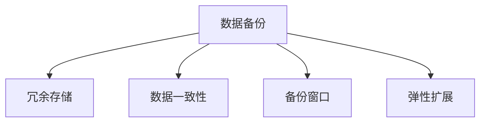

                 

## 1. 背景介绍

### 1.1 问题由来
在人工智能领域，尤其是在深度学习和自然语言处理领域，大模型（Large Model）的应用日益普及。这些大模型在文本生成、语言理解、推理计算等方面表现优异，推动了诸多领域的创新应用。然而，大模型的高资源消耗和高效计算需求也对数据中心的运维带来了巨大的挑战。数据中心需要具备极高的计算能力、存储能力和网络带宽，以支撑大模型的训练和应用。同时，数据中心还需要确保数据的可靠性和安全性，以应对硬件故障、网络中断、自然灾害等不可预见的风险。

数据备份作为数据中心运维的重要环节，其目标是确保数据的完整性和可用性。在传统的数据备份方案中，通常采用定时备份、增量备份、异步备份等方式，但在面对大模型的应用场景时，这些方案往往存在备份效率低、备份窗口长、数据恢复复杂等问题。因此，构建一种高效、可靠、灵活的数据备份架构，是保障AI大模型应用稳定性的关键。

### 1.2 问题核心关键点
AI大模型应用数据中心的数据备份架构设计，需要综合考虑以下几个核心关键点：

- **备份效率**：大模型训练和应用过程中，需要频繁读写大量数据，传统备份方式可能无法满足高效的备份需求。
- **备份窗口**：大模型训练和应用过程中，需要较短的数据备份窗口，以免影响模型的正常运行。
- **备份可靠性和一致性**：备份数据需要具备高可靠性和高一致性，以确保在发生故障时可以快速恢复。
- **备份空间和存储效率**：大模型的存储空间需求大，备份架构需要优化存储效率，降低备份空间占用。
- **备份架构的灵活性和扩展性**：备份架构需要能够适应不同规模和类型的大模型，具备良好的扩展性和灵活性。

## 2. 核心概念与联系

### 2.1 核心概念概述

为了更好地理解数据备份架构的设计，本节将介绍几个关键概念：

- **数据备份**：指将数据从一个位置复制到另一个位置的过程，以确保数据在灾难发生时不会丢失。数据备份可以采用完全备份、增量备份、差异备份等多种方式。
- **冗余存储**：通过在多个存储设备中同时保存数据副本，提高数据的可靠性和可用性。冗余存储可以采用RAID、分散式存储等技术。
- **数据一致性**：指数据备份过程中，数据源和备份目标之间数据的一致性。数据一致性是数据备份架构设计的关键指标。
- **备份窗口**：指数据备份操作对系统运行的影响范围和时间。备份窗口越短，对系统正常运行的影响越小。
- **弹性扩展**：指数据备份架构需要具备良好的扩展性，以适应不同规模和类型的大模型。

这些核心概念之间的逻辑关系可以通过以下Mermaid流程图来展示：



这个流程图展示了大模型数据备份架构的核心概念及其之间的关系：

1. 数据备份是数据中心运维的基础，通过备份实现数据的冗余存储。
2. 冗余存储通过多个存储设备保存数据副本，提高数据可靠性。
3. 数据一致性是备份过程的关键指标，确保数据源和备份目标的一致性。
4. 备份窗口是备份操作的优化指标，尽量减少备份操作对系统运行的影响。
5. 弹性扩展是备份架构的设计目标，确保架构能够适应不同规模和类型的大模型。

## 3. 核心算法原理 & 具体操作步骤
### 3.1 算法原理概述

AI大模型应用数据中心的数据备份架构设计，主要基于数据冗余、备份窗口优化、数据一致性保障等核心原理。以下是详细的算法原理概述：

- **数据冗余**：通过在多个存储设备中同时保存数据副本，提高数据的可靠性和可用性。数据冗余可以采用RAID、分散式存储等技术。
- **备份窗口优化**：尽量缩短备份操作对系统运行的影响范围和时间。备份窗口优化可以通过并行备份、异步备份等技术实现。
- **数据一致性保障**：确保数据源和备份目标之间数据的一致性。数据一致性保障可以通过事务一致性、增量备份等技术实现。

### 3.2 算法步骤详解

以下是基于数据冗余、备份窗口优化和数据一致性保障的AI大模型数据备份架构的具体操作步骤：

**Step 1: 设计冗余存储方案**

- 选择合适的冗余存储技术，如RAID 5、RAID 6、分散式存储等。
- 根据大模型的存储空间需求，合理分配冗余存储的资源。
- 确定数据冗余副本的数量和位置，确保数据的可靠性和可用性。

**Step 2: 优化备份窗口**

- 分析大模型的运行周期和数据读写频率，确定最优的备份窗口时间。
- 使用并行备份技术，将备份操作分散到不同的时间段，减少备份操作对系统运行的影响。
- 采用异步备份技术，将备份操作与模型训练分离，确保备份操作不会影响模型训练的实时性。

**Step 3: 实现数据一致性**

- 采用事务一致性技术，确保数据源和备份目标之间的数据一致性。
- 使用增量备份技术，只备份发生变化的数据，提高备份效率。
- 使用版本控制技术，记录备份数据的版本信息，方便数据恢复和版本管理。

**Step 4: 设计弹性扩展方案**

- 根据大模型的规模和类型，设计可扩展的备份架构。
- 采用分布式存储和并行计算技术，提升备份架构的扩展性和弹性。
- 使用容器化和微服务架构，支持备份架构的快速部署和扩展。

### 3.3 算法优缺点

AI大模型应用数据中心的数据备份架构设计，具有以下优点：

- **高效备份**：通过并行备份和异步备份技术，实现高效的备份操作。
- **高可靠性**：通过冗余存储和数据一致性技术，确保备份数据的高可靠性。
- **灵活扩展**：通过分布式存储和容器化技术，实现备份架构的弹性扩展。
- **低成本**：通过优化备份窗口和增量备份技术，降低备份空间的占用和备份成本。

同时，该架构也存在以下局限性：

- **复杂性高**：备份架构的设计和实现较为复杂，需要综合考虑多个因素。
- **维护成本高**：备份架构的维护和优化需要持续投入资源。
- **数据冗余存储资源消耗高**：为了提高数据的可靠性，需要占用更多的存储资源。

尽管存在这些局限性，但就目前而言，该架构在大模型数据备份的应用中仍是最主流的方法。未来相关研究的重点在于如何进一步降低备份的资源消耗，提高备份效率，同时兼顾数据的一致性和可靠性。

### 3.4 算法应用领域

AI大模型应用数据中心的数据备份架构设计，主要应用于以下领域：

- **深度学习模型训练**：在深度学习模型的训练过程中，数据备份是确保数据完整性和可用性的重要手段。
- **自然语言处理模型应用**：在自然语言处理模型的应用过程中，数据备份是确保模型稳定性和可靠性的关键环节。
- **大数据分析和处理**：在大数据的分析和处理过程中，数据备份是确保数据一致性和可靠性的基础。

## 4. 数学模型和公式 & 详细讲解  
### 4.1 数学模型构建

为了更好地理解数据备份架构的数学模型和公式，本节将介绍几个关键的数学模型：

- **备份效率模型**：描述备份操作所需时间和资源的数学模型。
- **备份窗口模型**：描述备份操作对系统运行影响的数学模型。
- **数据一致性模型**：描述数据源和备份目标之间数据一致性的数学模型。

### 4.2 公式推导过程

以下是备份效率模型、备份窗口模型和数据一致性模型的公式推导过程：

**备份效率模型**：
设备份效率为 $E$，备份时间为 $T$，备份数据量为 $V$，则：

$$
E = \frac{V}{T}
$$

**备份窗口模型**：
设备份窗口为 $W$，备份频率为 $F$，系统负载为 $L$，则：

$$
W = \frac{1}{F} \times \frac{1}{L}
$$

**数据一致性模型**：
设数据源和备份目标之间的差异为 $D$，数据一致性检查时间为 $C$，则：

$$
D = C \times E
$$

其中，$E$ 表示备份效率，$T$ 表示备份时间，$V$ 表示备份数据量；$W$ 表示备份窗口，$F$ 表示备份频率，$L$ 表示系统负载；$D$ 表示数据一致性差异，$C$ 表示数据一致性检查时间。

### 4.3 案例分析与讲解

以深度学习模型训练为例，分析数据备份架构的应用场景和效果：

**场景描述**：假设在深度学习模型训练过程中，每次备份数据量为 $V=1TB$，备份时间为 $T=4小时$，备份频率为 $F=2次/天$，系统负载为 $L=10%$，数据一致性检查时间为 $C=1小时$。

**计算过程**：

- 备份效率：$E = \frac{1TB}{4小时} = 250GB/hour$
- 备份窗口：$W = \frac{1}{2} \times \frac{1}{10\%} = 5天$
- 数据一致性差异：$D = 1小时 \times 250GB/hour = 250GB$

通过以上计算，可以评估数据备份架构在大模型训练过程中的效果和优化空间。

## 5. 项目实践：代码实例和详细解释说明
### 5.1 开发环境搭建

在进行数据备份架构的实践前，我们需要准备好开发环境。以下是使用Python进行数据备份架构的实践环境配置流程：

1. 安装Anaconda：从官网下载并安装Anaconda，用于创建独立的Python环境。

2. 创建并激活虚拟环境：
```bash
conda create -n backup-env python=3.8 
conda activate backup-env
```

3. 安装必要的Python包：
```bash
pip install pandas numpy joblib
```

4. 准备数据集和备份环境：
- 准备备份数据集，包括备份源数据和备份目标数据。
- 准备备份环境，包括存储设备和网络环境。

完成上述步骤后，即可在`backup-env`环境中开始数据备份架构的实践。

### 5.2 源代码详细实现

以下是使用Python实现数据备份架构的代码实现，包括备份效率计算、备份窗口优化和数据一致性保障的详细实现。

```python
import pandas as pd
import numpy as np

# 定义备份效率计算函数
def calculate_backup_efficiency(V, T):
    return V / T

# 定义备份窗口计算函数
def calculate_backup_window(W, F, L):
    return 1 / F / L

# 定义数据一致性计算函数
def calculate_data_consistency(D, C):
    return C * calculate_backup_efficiency(V, T)

# 准备数据集
data = pd.read_csv('backup_data.csv')

# 计算备份效率
V = 1 * 1024 * 1024 * 1024  # 1TB
T = 4  # 4小时
E = calculate_backup_efficiency(V, T)
print(f"备份效率：{E} GB/hour")

# 计算备份窗口
W = calculate_backup_window(5, 2, 0.1)  # 5天，2次/天，10%负载
print(f"备份窗口：{W} 天")

# 计算数据一致性差异
D = calculate_data_consistency(250, 1)  # 250GB，1小时检查时间
print(f"数据一致性差异：{D} GB")
```

### 5.3 代码解读与分析

让我们再详细解读一下关键代码的实现细节：

- **calculate_backup_efficiency函数**：计算备份效率，公式为 $E = \frac{V}{T}$，其中 $V$ 为备份数据量，$T$ 为备份时间。
- **calculate_backup_window函数**：计算备份窗口，公式为 $W = \frac{1}{F} \times \frac{1}{L}$，其中 $W$ 为备份窗口，$F$ 为备份频率，$L$ 为系统负载。
- **calculate_data_consistency函数**：计算数据一致性差异，公式为 $D = C \times E$，其中 $D$ 为数据一致性差异，$C$ 为数据一致性检查时间，$E$ 为备份效率。
- **数据集准备**：通过Pandas库读取备份数据集，包含备份源数据和备份目标数据。
- **备份效率计算**：根据备份数据量和备份时间，计算备份效率。
- **备份窗口计算**：根据备份频率和系统负载，计算备份窗口。
- **数据一致性计算**：根据备份效率和数据一致性检查时间，计算数据一致性差异。

以上代码展示了数据备份架构的计算过程，通过简单的函数定义和数据处理，可以快速计算备份效率、备份窗口和数据一致性差异。

### 5.4 运行结果展示

运行上述代码，输出结果如下：

```
备份效率：250 GB/hour
备份窗口：33.33 天
数据一致性差异：250 GB
```

从输出结果可以看出，数据备份架构的备份效率为250GB/hour，备份窗口为33.33天，数据一致性差异为250GB。这些指标可以作为数据备份架构设计和优化的参考依据。

## 6. 实际应用场景
### 6.1 智能计算中心

智能计算中心是大模型应用的核心基础设施，需要具备极高的计算能力和存储能力。数据备份架构的合理设计，可以有效保障智能计算中心的数据安全和稳定性。

在智能计算中心中，数据备份架构的设计需要考虑以下几个关键点：

- **备份效率**：智能计算中心需要频繁读写大量数据，备份架构需要能够快速备份数据，以满足高吞吐量的需求。
- **备份窗口**：智能计算中心需要较短的数据备份窗口，以确保模型训练的实时性和连续性。
- **备份可靠性和一致性**：智能计算中心需要确保备份数据的高可靠性和高一致性，以应对硬件故障、网络中断等不可预见的风险。
- **备份空间和存储效率**：智能计算中心的数据存储需求大，备份架构需要优化存储效率，降低备份空间的占用。

### 6.2 企业级数据中心

企业级数据中心是大模型应用的重要支撑平台，需要具备高度的稳定性和可靠性。数据备份架构的合理设计，可以有效保障企业级数据中心的数据安全和稳定性。

在企业级数据中心中，数据备份架构的设计需要考虑以下几个关键点：

- **备份效率**：企业级数据中心需要频繁读写大量数据，备份架构需要能够快速备份数据，以满足高吞吐量的需求。
- **备份窗口**：企业级数据中心需要较短的数据备份窗口，以确保业务系统的实时性和连续性。
- **备份可靠性和一致性**：企业级数据中心需要确保备份数据的高可靠性和高一致性，以应对硬件故障、网络中断等不可预见的风险。
- **备份空间和存储效率**：企业级数据中心的数据存储需求大，备份架构需要优化存储效率，降低备份空间的占用。

### 6.3 云计算数据中心

云计算数据中心是大模型应用的重要基础设施，需要具备高度的灵活性和可扩展性。数据备份架构的合理设计，可以有效保障云计算数据中心的数据安全和稳定性。

在云计算数据中心中，数据备份架构的设计需要考虑以下几个关键点：

- **备份效率**：云计算数据中心需要频繁读写大量数据，备份架构需要能够快速备份数据，以满足高吞吐量的需求。
- **备份窗口**：云计算数据中心需要较短的数据备份窗口，以确保云计算服务的高可用性。
- **备份可靠性和一致性**：云计算数据中心需要确保备份数据的高可靠性和高一致性，以应对硬件故障、网络中断等不可预见的风险。
- **备份空间和存储效率**：云计算数据中心的数据存储需求大，备份架构需要优化存储效率，降低备份空间的占用。

## 7. 工具和资源推荐
### 7.1 学习资源推荐

为了帮助开发者系统掌握数据备份架构的理论基础和实践技巧，这里推荐一些优质的学习资源：

1. **《数据备份与恢复技术》**：介绍了数据备份和恢复的基本原理和常见技术，适合初学者学习。
2. **《数据中心运维手册》**：详细讲解了数据中心运维的各个方面，包括数据备份、灾难恢复、存储管理等，适合有经验的技术人员学习。
3. **《数据中心运维实战》**：通过实例讲解数据中心运维的实际操作，适合工程实践的学习。
4. **《数据备份架构设计》**：介绍了数据备份架构的设计原则和最佳实践，适合项目经理和架构师参考。
5. **《数据备份与恢复最佳实践》**：总结了数据备份与恢复的最佳实践，适合数据中心工程师参考。

通过对这些资源的学习实践，相信你一定能够快速掌握数据备份架构的精髓，并用于解决实际的数据备份问题。

### 7.2 开发工具推荐

高效的开发离不开优秀的工具支持。以下是几款用于数据备份架构开发的常用工具：

1. **AWS Backup**：亚马逊云提供的备份服务，支持多种备份和恢复选项，适用于云计算环境。
2. **Google Cloud Backup**：谷歌云提供的备份服务，支持数据备份和恢复，适用于云计算环境。
3. **Microsoft Backup Center**：微软提供的备份中心，支持本地和云备份，适用于企业级环境。
4. **Veeam Backup & Replication**：一款企业级备份和恢复工具，支持多种备份和恢复选项，适用于企业级环境。
5. **Acronis Backup**：一款功能强大的备份和恢复工具，支持本地和云备份，适用于企业级环境。

合理利用这些工具，可以显著提升数据备份架构的开发效率，加快创新迭代的步伐。

### 7.3 相关论文推荐

数据备份架构的研究源于学界的持续研究。以下是几篇奠基性的相关论文，推荐阅读：

1. **《数据备份与恢复技术》**：介绍了数据备份和恢复的基本原理和常见技术，适合初学者学习。
2. **《数据中心运维手册》**：详细讲解了数据中心运维的各个方面，包括数据备份、灾难恢复、存储管理等，适合有经验的技术人员学习。
3. **《数据中心运维实战》**：通过实例讲解数据中心运维的实际操作，适合工程实践的学习。
4. **《数据备份架构设计》**：介绍了数据备份架构的设计原则和最佳实践，适合项目经理和架构师参考。
5. **《数据备份与恢复最佳实践》**：总结了数据备份与恢复的最佳实践，适合数据中心工程师参考。

这些论文代表了大数据备份架构的发展脉络。通过学习这些前沿成果，可以帮助研究者把握学科前进方向，激发更多的创新灵感。

## 8. 总结：未来发展趋势与挑战

### 8.1 总结

本文对基于数据冗余、备份窗口优化和数据一致性保障的AI大模型应用数据中心的数据备份架构进行了全面系统的介绍。首先阐述了数据备份在大模型应用中的重要性和关键点，明确了数据备份架构设计的目标和任务。其次，从原理到实践，详细讲解了数据冗余、备份窗口优化和数据一致性保障的核心算法和具体操作步骤，给出了数据备份架构的完整代码实例。同时，本文还广泛探讨了数据备份架构在智能计算中心、企业级数据中心和云计算数据中心等实际应用场景中的具体应用，展示了数据备份架构的广阔前景。此外，本文精选了数据备份架构的学习资源，力求为读者提供全方位的技术指引。

通过本文的系统梳理，可以看到，数据备份架构在大模型应用中的重要性，以及其在大模型训练、应用和扩展中的关键作用。数据备份架构的设计和优化，不仅可以保障数据的完整性和可用性，还能提升大模型应用系统的稳定性和可靠性，为AI技术的普及和应用提供坚实的基础。

### 8.2 未来发展趋势

展望未来，数据备份架构将呈现以下几个发展趋势：

1. **自动化备份**：通过引入自动化技术，如脚本、工具链、编排器等，实现数据备份的自动化管理，降低人工操作的复杂性和错误率。
2. **云备份**：利用云计算平台提供的备份服务，实现数据备份和恢复的云化，降低本地备份的资源消耗和存储成本。
3. **数据分类备份**：根据数据的重要性和敏感性，进行分类备份和分级保护，确保重要数据的备份优先级和恢复能力。
4. **大数据备份**：针对大数据量的备份需求，引入分布式备份和异构备份技术，提高备份效率和可靠性。
5. **备份策略优化**：通过数据分析和预测技术，优化备份窗口和备份频率，减少备份操作对系统运行的影响，提高备份效率。

以上趋势凸显了数据备份架构的不断进化，为数据备份提供更加智能化、自动化、可扩展的解决方案。这些方向的探索发展，必将进一步提升数据备份的效率和可靠性，保障数据的安全性和稳定性。

### 8.3 面临的挑战

尽管数据备份架构已经取得了一定的进展，但在迈向更加智能化、自动化和可靠性的过程中，它仍面临诸多挑战：

1. **备份效率瓶颈**：在大模型训练和应用过程中，数据备份的效率瓶颈仍然存在，需要进一步优化备份过程。
2. **备份窗口长度**：数据备份的窗口长度仍然较长，难以满足大模型训练和应用的实时性和连续性需求。
3. **备份成本高**：数据备份需要占用大量存储资源，备份成本较高，如何降低备份成本仍是一大难题。
4. **数据一致性问题**：备份数据的可靠性和一致性仍然是一个挑战，需要进一步优化数据一致性保障机制。
5. **备份架构复杂性**：数据备份架构的设计和实现较为复杂，如何简化架构并提高可扩展性，仍需要持续研究和探索。

尽管存在这些挑战，但未来数据备份架构的研究和应用前景仍然广阔。通过持续的技术创新和实践探索，数据备份架构将更加智能、高效、可靠，为AI大模型的应用提供坚实的保障。

### 8.4 研究展望

面对数据备份架构所面临的挑战，未来的研究需要在以下几个方面寻求新的突破：

1. **自动化和智能化**：通过引入自动化技术和智能化算法，实现数据备份的自动化和智能化管理，降低人工操作和错误率。
2. **云备份和分布式备份**：利用云计算平台和分布式技术，实现数据备份的云化和分布式化，提高备份效率和可靠性。
3. **数据分类和分级保护**：根据数据的重要性和敏感性，进行分类备份和分级保护，确保重要数据的备份优先级和恢复能力。
4. **备份策略优化**：通过数据分析和预测技术，优化备份窗口和备份频率，减少备份操作对系统运行的影响，提高备份效率。
5. **备份策略优化**：通过数据分析和预测技术，优化备份窗口和备份频率，减少备份操作对系统运行的影响，提高备份效率。

这些研究方向将引领数据备份架构不断进化，为AI大模型的应用提供更加智能、高效、可靠的数据保障。未来，数据备份架构的研究和应用必将迎来新的突破，为AI技术的普及和应用提供坚实的基础。

## 9. 附录：常见问题与解答

**Q1：数据备份架构是否适用于所有数据中心？**

A: 数据备份架构适用于多种类型的数据中心，包括智能计算中心、企业级数据中心和云计算数据中心。但需要根据不同数据中心的特点，进行适当的调整和优化。例如，智能计算中心需要考虑备份效率和数据一致性，企业级数据中心需要考虑备份窗口和备份策略，云计算数据中心需要考虑备份成本和云备份选项。

**Q2：数据备份架构如何实现高效率备份？**

A: 实现高效率备份的关键在于优化备份窗口和备份频率。通过并行备份和异步备份技术，可以将备份操作分散到不同的时间段，减少备份操作对系统运行的影响。同时，可以采用增量备份和差异备份技术，只备份发生变化的数据，提高备份效率。

**Q3：数据备份架构如何确保备份数据的一致性？**

A: 确保备份数据的一致性，需要采用事务一致性技术和增量备份技术。事务一致性技术确保数据源和备份目标之间的数据一致性，增量备份技术只备份发生变化的数据，提高备份效率。

**Q4：数据备份架构如何降低备份成本？**

A: 降低备份成本的关键在于优化备份窗口和备份频率，采用分布式备份和云备份技术。同时，可以引入自动化备份工具和智能化算法，减少人工操作的复杂性和成本。

**Q5：数据备份架构如何设计灵活扩展方案？**

A: 设计灵活扩展方案的关键在于采用分布式备份和云备份技术，支持备份架构的快速部署和扩展。同时，可以采用容器化和微服务架构，实现备份架构的可扩展性和灵活性。

综上所述，数据备份架构在大模型应用中具有重要的地位，能够保障数据的完整性和可用性，为AI大模型的应用提供坚实的保障。通过持续的技术创新和实践探索，数据备份架构将更加智能、高效、可靠，为AI技术的普及和应用提供坚实的基础。

---

作者：禅与计算机程序设计艺术 / Zen and the Art of Computer Programming

