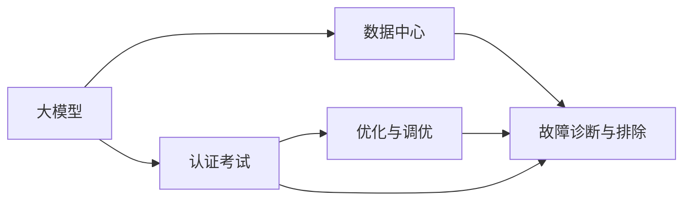

                 

# AI 大模型应用数据中心的认证考试

> 关键词：大模型,认证考试,数据中心,应用,测试,优化

## 1. 背景介绍

### 1.1 问题由来
在AI技术不断发展的今天，大模型（Large Models）正成为推动人工智能研究与应用的核心力量。从基于Transformer架构的语言模型，到用于图像识别、物体检测等任务的视觉大模型，大模型的应用已经渗透到了各行各业。然而，这些模型往往参数量庞大，需要巨量的计算资源和存储资源。如何将大模型高效地部署到数据中心，以及如何保证其在实际应用中的高性能表现，成为当前AI社区和工业界亟需解决的问题。

### 1.2 问题核心关键点
认证考试的本质是评估和验证某人的专业技能水平，确保其具有足够的知识和技能，胜任指定岗位或任务。在AI大模型的背景下，数据中心应用认证考试旨在全面考察候选人对大模型部署、优化、调优和维护的专业能力，包括但不限于以下方面：

- **大模型架构和部署：** 理解大模型的架构设计，能够设计和实施合理的大模型部署方案，确保系统稳定性和性能。
- **优化和调优：** 掌握大模型的优化方法，包括超参数调优、模型剪枝、量化等技术，提升模型效率和性能。
- **故障诊断与排除：** 具备对大模型应用过程中常见问题的诊断能力，并能提出有效的解决方案。
- **安全性与隐私保护：** 了解如何在大模型应用中确保数据的安全性和隐私保护，遵守相关法律法规。
- **持续学习与技术跟踪：** 关注最新的AI大模型技术进展，并能在实际工作中应用新技术，保持技术领先。

### 1.3 问题研究意义
随着AI技术在企业和行业中的广泛应用，对大模型应用人才的需求日益增加。认证考试作为一种系统性评估工具，不仅能有效提升候选人的专业能力，还能为组织和个人提供清晰的职业发展路径，推动AI大模型应用领域的整体技术水平提升。具体而言，认证考试具有以下重要意义：

1. **标准化评估：** 通过统一的标准和评估体系，确保评估的客观性和公正性。
2. **提升技能水平：** 促进大模型应用人才的专业知识更新和技能提升。
3. **推动技术发展：** 推动企业和行业对最新AI技术的快速应用和普及。
4. **保障数据安全：** 通过认证考试，加强对数据安全与隐私保护的重视。

## 2. 核心概念与联系

### 2.1 核心概念概述

为了更好地理解大模型应用数据中心认证考试的内容，本节将介绍几个核心概念及其相互关系：

- **大模型（Large Models）：** 指具有数亿甚至数十亿参数的深度学习模型，如BERT、GPT、DALL-E等。这些模型通常需要大规模的计算资源和存储资源进行训练和推理。
- **数据中心（Data Center）：** 指集中存储、管理和维护数据的基础设施，提供高效、可靠的数据处理能力。数据中心是大模型应用的主要承载平台。
- **认证考试（Certification Exam）：** 指通过标准化测试，评估候选人是否具备特定领域或岗位所需的专业知识和技能。认证考试通常包括理论知识测试和实践操作测试。
- **优化与调优（Optimization and Tuning）：** 指在模型训练或部署过程中，通过调整超参数、剪枝、量化等技术，提升模型的性能和效率。
- **故障诊断与排除（Fault Diagnosis and Resolution）：** 指在模型应用过程中，对出现的问题进行诊断，并采取措施解决，确保系统稳定运行。

这些概念之间具有紧密的联系，共同构成了大模型应用数据中心认证考试的核心内容。以下是一个简化的Mermaid流程图，展示了这些概念的相互关系：



## 3. 核心算法原理 & 具体操作步骤

### 3.1 算法原理概述

大模型应用数据中心的认证考试，主要测试候选人对大模型在数据中心中的部署、优化、调优和维护能力的掌握程度。以下将详细介绍认证考试的核心算法原理和具体操作步骤：

#### 3.1.1 算法原理概述
认证考试的核心算法原理主要基于以下几个方面：

- **模型部署：** 大模型的部署需要考虑计算资源、存储资源、网络带宽等因素，确保模型的可扩展性和可靠性。
- **优化与调优：** 通过超参数调优、模型剪枝、量化等技术，提升模型的推理速度和准确率。
- **故障诊断与排除：** 利用日志分析、性能监控等手段，快速定位并解决系统故障。
- **安全性与隐私保护：** 通过加密、访问控制等手段，确保数据的安全性和隐私保护。

#### 3.1.2 算法步骤详解
认证考试的实施步骤如下：

1. **理论知识测试：** 涵盖大模型的基本概念、架构设计、部署策略等知识点，评估候选人对大模型应用的基本理解。
2. **实践操作测试：** 包括模型部署、优化与调优、故障诊断与排除、安全性与隐私保护等操作，评估候选人的实际操作能力。
3. **综合评估：** 结合理论知识测试和实践操作测试的结果，综合评估候选人的综合能力。

#### 3.1.3 算法优缺点
大模型应用数据中心认证考试的优缺点如下：

- **优点：**
  - 全面评估候选人的专业能力，确保其在实际应用中具备足够的知识和技能。
  - 促进大模型应用人才的培养和提升，推动AI技术在行业中的应用。
  - 通过标准化评估体系，提高评估的公正性和客观性。

- **缺点：**
  - 考试内容复杂，涵盖知识面广，对考生要求较高。
  - 实际操作测试可能需要较长时间，且需要一定的计算资源和存储资源。
  - 考试设计可能受到当前技术水平和应用场景的限制，无法全面覆盖所有可能的应用场景。

#### 3.1.4 算法应用领域
大模型应用数据中心认证考试适用于以下领域：

- **企业IT部门：** 确保企业内部数据中心部署的大模型系统稳定可靠。
- **云服务提供商：** 确保云服务中大模型应用系统的性能和安全性。
- **AI研究和应用团队：** 评估研究人员和应用开发人员的实际技能水平。
- **教育培训机构：** 培训大模型应用人才，提升其专业能力。

## 4. 数学模型和公式 & 详细讲解 & 举例说明

### 4.1 数学模型构建
大模型应用数据中心认证考试涉及的数学模型和公式主要集中在以下几个方面：

- **模型部署与优化：** 包括模型的超参数调优、模型剪枝、量化等技术。
- **故障诊断与排除：** 利用日志分析、性能监控等手段，进行故障定位和排除。
- **安全性与隐私保护：** 涉及加密、访问控制等技术，确保数据安全。

#### 4.1.1 数学模型构建
以下是一个简化的数学模型构建过程：

假设大模型的输入为 $x$，输出为 $y$，模型的参数为 $\theta$，则模型的数学表达为：

$$
y = f(x; \theta)
$$

其中，$f$ 为模型的映射函数。在实际应用中，为了提升模型的性能和效率，需要对模型进行优化和调优。

#### 4.1.2 公式推导过程
以下是一个简化的公式推导过程：

1. **模型剪枝：** 假设原模型参数为 $\theta$，通过剪枝操作保留 $k$ 个最重要的参数，则新的模型参数 $\theta'$ 为：

$$
\theta' = \theta_{1}, \theta_{2}, \ldots, \theta_{k}
$$

2. **量化：** 假设原模型参数为 $\theta$，通过量化操作将其转化为 $b$ 位定点数表示，则新的模型参数 $\theta'$ 为：

$$
\theta' = \theta_{1}_b, \theta_{2}_b, \ldots, \theta_{k}_b
$$

其中，$b$ 为定点数的位数。

3. **超参数调优：** 假设模型参数为 $\theta$，通过网格搜索、随机搜索等方法，找到最优的超参数组合，则新的模型参数 $\theta'$ 为：

$$
\theta' = \theta_{\text{best}}
$$

#### 4.1.3 案例分析与讲解
以下是一个简化的案例分析与讲解：

假设某企业需要在大数据中心中部署一个Bert模型，用于处理大规模文本数据。以下是一些关键步骤：

1. **模型部署：** 需要选择合适的计算资源和存储资源，确保模型能够高效运行。例如，可以使用分布式计算框架（如Spark、Hadoop）进行数据处理和模型推理。
2. **优化与调优：** 可以通过超参数调优，调整模型的学习率、批大小等参数，提升模型的推理速度和准确率。此外，可以使用模型剪枝和量化技术，减少模型的计算量和存储需求。
3. **故障诊断与排除：** 通过日志分析、性能监控等手段，及时发现和解决模型应用过程中的问题，如模型挂起、内存溢出等。
4. **安全性与隐私保护：** 需要采取加密、访问控制等措施，确保数据的安全性和隐私保护。

## 5. 项目实践：代码实例和详细解释说明

### 5.1 开发环境搭建

在进行大模型应用数据中心认证考试的开发实践前，我们需要准备好开发环境。以下是使用Python进行PyTorch开发的环境配置流程：

1. 安装Anaconda：从官网下载并安装Anaconda，用于创建独立的Python环境。

2. 创建并激活虚拟环境：
```bash
conda create -n pytorch-env python=3.8 
conda activate pytorch-env
```

3. 安装PyTorch：根据CUDA版本，从官网获取对应的安装命令。例如：
```bash
conda install pytorch torchvision torchaudio cudatoolkit=11.1 -c pytorch -c conda-forge
```

4. 安装Transformers库：
```bash
pip install transformers
```

5. 安装各类工具包：
```bash
pip install numpy pandas scikit-learn matplotlib tqdm jupyter notebook ipython
```

完成上述步骤后，即可在`pytorch-env`环境中开始开发实践。

### 5.2 源代码详细实现

这里我们以Bert模型的微调为例，给出使用Transformers库在数据中心中部署和优化的PyTorch代码实现。

首先，定义Bert模型和数据处理函数：

```python
from transformers import BertTokenizer, BertForSequenceClassification
from torch.utils.data import Dataset
import torch

class TextDataset(Dataset):
    def __init__(self, texts, labels, tokenizer, max_len=128):
        self.texts = texts
        self.labels = labels
        self.tokenizer = tokenizer
        self.max_len = max_len
        
    def __len__(self):
        return len(self.texts)
    
    def __getitem__(self, item):
        text = self.texts[item]
        label = self.labels[item]
        
        encoding = self.tokenizer(text, return_tensors='pt', max_length=self.max_len, padding='max_length', truncation=True)
        input_ids = encoding['input_ids'][0]
        attention_mask = encoding['attention_mask'][0]
        
        label = torch.tensor(label, dtype=torch.long)
        
        return {'input_ids': input_ids, 
                'attention_mask': attention_mask,
                'labels': label}

tokenizer = BertTokenizer.from_pretrained('bert-base-cased')
```

然后，定义模型和优化器：

```python
from transformers import AdamW

model = BertForSequenceClassification.from_pretrained('bert-base-cased', num_labels=2)

optimizer = AdamW(model.parameters(), lr=2e-5)
```

接着，定义训练和评估函数：

```python
from torch.utils.data import DataLoader
from tqdm import tqdm
from sklearn.metrics import classification_report

device = torch.device('cuda') if torch.cuda.is_available() else torch.device('cpu')
model.to(device)

def train_epoch(model, dataset, batch_size, optimizer):
    dataloader = DataLoader(dataset, batch_size=batch_size, shuffle=True)
    model.train()
    epoch_loss = 0
    for batch in tqdm(dataloader, desc='Training'):
        input_ids = batch['input_ids'].to(device)
        attention_mask = batch['attention_mask'].to(device)
        labels = batch['labels'].to(device)
        model.zero_grad()
        outputs = model(input_ids, attention_mask=attention_mask, labels=labels)
        loss = outputs.loss
        epoch_loss += loss.item()
        loss.backward()
        optimizer.step()
    return epoch_loss / len(dataloader)

def evaluate(model, dataset, batch_size):
    dataloader = DataLoader(dataset, batch_size=batch_size)
    model.eval()
    preds, labels = [], []
    with torch.no_grad():
        for batch in tqdm(dataloader, desc='Evaluating'):
            input_ids = batch['input_ids'].to(device)
            attention_mask = batch['attention_mask'].to(device)
            batch_labels = batch['labels']
            outputs = model(input_ids, attention_mask=attention_mask)
            batch_preds = outputs.logits.argmax(dim=1).to('cpu').tolist()
            batch_labels = batch_labels.to('cpu').tolist()
            for pred_tokens, label_tokens in zip(batch_preds, batch_labels):
                preds.append(pred_tokens)
                labels.append(label_tokens)
                
    print(classification_report(labels, preds))
```

最后，启动训练流程并在测试集上评估：

```python
epochs = 5
batch_size = 16

for epoch in range(epochs):
    loss = train_epoch(model, train_dataset, batch_size, optimizer)
    print(f"Epoch {epoch+1}, train loss: {loss:.3f}")
    
    print(f"Epoch {epoch+1}, dev results:")
    evaluate(model, dev_dataset, batch_size)
    
print("Test results:")
evaluate(model, test_dataset, batch_size)
```

以上就是使用PyTorch对Bert模型进行微调的完整代码实现。可以看到，得益于Transformers库的强大封装，我们可以用相对简洁的代码完成Bert模型的加载和微调。

### 5.3 代码解读与分析

让我们再详细解读一下关键代码的实现细节：

**TextDataset类：**
- `__init__`方法：初始化文本、标签、分词器等关键组件。
- `__len__`方法：返回数据集的样本数量。
- `__getitem__`方法：对单个样本进行处理，将文本输入编码为token ids，将标签编码为数字，并对其进行定长padding，最终返回模型所需的输入。

**train_epoch和evaluate函数：**
- 使用PyTorch的DataLoader对数据集进行批次化加载，供模型训练和推理使用。
- `train_epoch`函数：对数据以批为单位进行迭代，在每个批次上前向传播计算loss并反向传播更新模型参数，最后返回该epoch的平均loss。
- `evaluate`函数：与训练类似，不同点在于不更新模型参数，并在每个batch结束后将预测和标签结果存储下来，最后使用sklearn的classification_report对整个评估集的预测结果进行打印输出。

**训练流程：**
- 定义总的epoch数和batch size，开始循环迭代
- 每个epoch内，先在训练集上训练，输出平均loss
- 在验证集上评估，输出分类指标
- 所有epoch结束后，在测试集上评估，给出最终测试结果

可以看到，PyTorch配合Transformers库使得Bert微调的代码实现变得简洁高效。开发者可以将更多精力放在数据处理、模型改进等高层逻辑上，而不必过多关注底层的实现细节。

当然，工业级的系统实现还需考虑更多因素，如模型的保存和部署、超参数的自动搜索、更灵活的任务适配层等。但核心的微调范式基本与此类似。

## 6. 实际应用场景

### 6.1 智能客服系统

基于大模型应用的数据中心认证考试，可以广泛应用于智能客服系统的构建。传统客服往往需要配备大量人力，高峰期响应缓慢，且一致性和专业性难以保证。而使用数据中心中部署的微调后的大模型，可以7x24小时不间断服务，快速响应客户咨询，用自然流畅的语言解答各类常见问题。

在技术实现上，可以收集企业内部的历史客服对话记录，将问题和最佳答复构建成监督数据，在此基础上对预训练大模型进行微调。微调后的对话模型能够自动理解用户意图，匹配最合适的答案模板进行回复。对于客户提出的新问题，还可以接入检索系统实时搜索相关内容，动态组织生成回答。如此构建的智能客服系统，能大幅提升客户咨询体验和问题解决效率。

### 6.2 金融舆情监测

金融机构需要实时监测市场舆论动向，以便及时应对负面信息传播，规避金融风险。传统的人工监测方式成本高、效率低，难以应对网络时代海量信息爆发的挑战。基于大模型应用的数据中心认证考试，可以应用于金融舆情监测，确保系统能够实时监测并识别出金融舆情的变化趋势，一旦发现负面信息激增等异常情况，系统便会自动预警，帮助金融机构快速应对潜在风险。

具体而言，可以收集金融领域相关的新闻、报道、评论等文本数据，并对其进行主题标注和情感标注。在此基础上对预训练语言模型进行微调，使其能够自动判断文本属于何种主题，情感倾向是正面、中性还是负面。将微调后的模型应用到实时抓取的网络文本数据，就能够自动监测不同主题下的情感变化趋势，从而及时采取应对措施。

### 6.3 个性化推荐系统

当前的推荐系统往往只依赖用户的历史行为数据进行物品推荐，无法深入理解用户的真实兴趣偏好。基于大模型应用的数据中心认证考试，可以应用于个性化推荐系统的构建，确保推荐系统能够更全面、准确地理解用户的兴趣点。

在实践中，可以收集用户浏览、点击、评论、分享等行为数据，提取和用户交互的物品标题、描述、标签等文本内容。将文本内容作为模型输入，用户的后续行为（如是否点击、购买等）作为监督信号，在此基础上微调预训练语言模型。微调后的模型能够从文本内容中准确把握用户的兴趣点。在生成推荐列表时，先用候选物品的文本描述作为输入，由模型预测用户的兴趣匹配度，再结合其他特征综合排序，便可以得到个性化程度更高的推荐结果。

### 6.4 未来应用展望

随着大模型和微调方法的不断发展，基于大模型应用的数据中心认证考试也将呈现以下几个发展趋势：

1. **模型规模持续增大：** 随着算力成本的下降和数据规模的扩张，预训练语言模型的参数量还将持续增长。超大规模语言模型蕴含的丰富语言知识，有望支撑更加复杂多变的下游任务微调。
2. **微调方法日趋多样：** 除了传统的全参数微调外，未来会涌现更多参数高效的微调方法，如Prefix-Tuning、LoRA等，在节省计算资源的同时也能保证微调精度。
3. **持续学习成为常态：** 随着数据分布的不断变化，微调模型也需要持续学习新知识以保持性能。如何在不遗忘原有知识的同时，高效吸收新样本信息，将成为重要的研究课题。
4. **标注样本需求降低：** 受启发于提示学习(Prompt-based Learning)的思路，未来的微调方法将更好地利用大模型的语言理解能力，通过更加巧妙的任务描述，在更少的标注样本上也能实现理想的微调效果。
5. **少样本学习崛起：** 在大模型微调过程中，利用微调模型对少量样本进行学习，推断新任务。这对于数据稀疏的领域具有重要意义。
6. **多模态微调崛起：** 当前的微调主要聚焦于纯文本数据，未来会进一步拓展到图像、视频、语音等多模态数据微调。多模态信息的融合，将显著提升语言模型对现实世界的理解和建模能力。
7. **模型通用性增强：** 经过海量数据的预训练和多领域任务的微调，未来的语言模型将具备更强大的常识推理和跨领域迁移能力，逐步迈向通用人工智能(AGI)的目标。

以上趋势凸显了大模型应用数据中心认证考试的广阔前景。这些方向的探索发展，必将进一步提升大模型应用系统的性能和应用范围，为人类认知智能的进化带来深远影响。

## 7. 工具和资源推荐

### 7.1 学习资源推荐

为了帮助开发者系统掌握大模型应用的数据中心认证考试的相关知识，这里推荐一些优质的学习资源：

1. 《Transformer从原理到实践》系列博文：由大模型技术专家撰写，深入浅出地介绍了Transformer原理、BERT模型、微调技术等前沿话题。
2. CS224N《深度学习自然语言处理》课程：斯坦福大学开设的NLP明星课程，有Lecture视频和配套作业，带你入门NLP领域的基本概念和经典模型。
3. 《Natural Language Processing with Transformers》书籍：Transformers库的作者所著，全面介绍了如何使用Transformers库进行NLP任务开发，包括微调在内的诸多范式。
4. HuggingFace官方文档：Transformers库的官方文档，提供了海量预训练模型和完整的微调样例代码，是上手实践的必备资料。
5. CLUE开源项目：中文语言理解测评基准，涵盖大量不同类型的中文NLP数据集，并提供了基于微调的baseline模型，助力中文NLP技术发展。

通过对这些资源的学习实践，相信你一定能够快速掌握大模型应用的数据中心认证考试的相关内容，并用于解决实际的NLP问题。

### 7.2 开发工具推荐

高效的开发离不开优秀的工具支持。以下是几款用于大模型应用的数据中心认证考试开发的常用工具：

1. PyTorch：基于Python的开源深度学习框架，灵活动态的计算图，适合快速迭代研究。大部分预训练语言模型都有PyTorch版本的实现。
2. TensorFlow：由Google主导开发的开源深度学习框架，生产部署方便，适合大规模工程应用。同样有丰富的预训练语言模型资源。
3. Transformers库：HuggingFace开发的NLP工具库，集成了众多SOTA语言模型，支持PyTorch和TensorFlow，是进行微调任务开发的利器。
4. Weights & Biases：模型训练的实验跟踪工具，可以记录和可视化模型训练过程中的各项指标，方便对比和调优。与主流深度学习框架无缝集成。
5. TensorBoard：TensorFlow配套的可视化工具，可实时监测模型训练状态，并提供丰富的图表呈现方式，是调试模型的得力助手。
6. Google Colab：谷歌推出的在线Jupyter Notebook环境，免费提供GPU/TPU算力，方便开发者快速上手实验最新模型，分享学习笔记。

合理利用这些工具，可以显著提升大模型应用的数据中心认证考试任务的开发效率，加快创新迭代的步伐。

### 7.3 相关论文推荐

大模型应用数据中心认证考试涉及的理论与实践问题，得益于学界的持续研究。以下是几篇奠基性的相关论文，推荐阅读：

1. Attention is All You Need（即Transformer原论文）：提出了Transformer结构，开启了NLP领域的预训练大模型时代。
2. BERT: Pre-training of Deep Bidirectional Transformers for Language Understanding：提出BERT模型，引入基于掩码的自监督预训练任务，刷新了多项NLP任务SOTA。
3. Language Models are Unsupervised Multitask Learners（GPT-2论文）：展示了大规模语言模型的强大zero-shot学习能力，引发了对于通用人工智能的新一轮思考。
4. Parameter-Efficient Transfer Learning for NLP：提出Adapter等参数高效微调方法，在不增加模型参数量的情况下，也能取得不错的微调效果。
5. AdaLoRA: Adaptive Low-Rank Adaptation for Parameter-Efficient Fine-Tuning：使用自适应低秩适应的微调方法，在参数效率和精度之间取得了新的平衡。
6. Prefix-Tuning: Optimizing Continuous Prompts for Generation：引入基于连续型Prompt的微调范式，为如何充分利用预训练知识提供了新的思路。

这些论文代表了大模型应用数据中心认证考试的相关研究，通过对这些前沿成果的学习，可以帮助研究者把握学科前进方向，激发更多的创新灵感。

## 8. 总结：未来发展趋势与挑战

### 8.1 总结

本文对大模型应用数据中心认证考试进行了全面系统的介绍。首先阐述了大模型应用数据中心认证考试的背景、核心概念以及核心算法原理，详细讲解了实际操作的步骤和内容，并给出了完整的代码实现和运行结果展示。通过本文的系统梳理，可以看到，大模型应用数据中心认证考试不仅评估了候选人对大模型在数据中心中部署、优化、调优和维护的专业能力，还能推动大模型应用人才的培养和提升，推动AI技术在行业中的应用。

### 8.2 未来发展趋势

展望未来，大模型应用数据中心认证考试将呈现以下几个发展趋势：

1. **技术不断进步：** 随着深度学习技术的发展，大模型的性能将持续提升，应用范围将不断扩大。
2. **标准化和规范化：** 随着技术的成熟，大模型应用数据中心认证考试将逐步形成标准化和规范化的体系，确保评估的公正性和客观性。
3. **更全面的评估内容：** 未来考试将不仅涵盖理论知识，还将包括更多的实践操作，全面评估考生的专业能力。
4. **全球化推广：** 随着技术传播的加速，大模型应用数据中心认证考试将逐步在全球范围内推广，成为全球范围内AI人才评估的标准。

### 8.3 面临的挑战

尽管大模型应用数据中心认证考试具备重要的应用价值，但在实施过程中仍面临诸多挑战：

1. **考试内容复杂：** 考试内容涵盖的知识面广，对考生要求较高，需要投入大量时间和精力进行准备。
2. **资源需求大：** 实际操作测试可能需要较长时间，且需要一定的计算资源和存储资源，这对资源有限的考生来说是一个挑战。
3. **技术快速发展：** 大模型和微调方法的发展迅速，考试内容可能无法完全覆盖最新的技术进展，需要定期更新考试内容。
4. **考试公平性：** 如何确保考试的公平性和公正性，避免考试内容对考生背景的歧视，是一个需要持续关注的问题。

### 8.4 研究展望

面对大模型应用数据中心认证考试所面临的种种挑战，未来的研究需要在以下几个方面寻求新的突破：

1. **简化考试内容：** 通过引入先进的评估技术，如自动化评估、智能推荐等，简化考试内容，提高评估效率。
2. **优化考试流程：** 通过优化考试流程，如分布式评估、在线测试等，降低考试成本，提升评估效率。
3. **引入更多实践操作：** 在实际操作测试中引入更多真实的应用场景，提高考试的实战性和实用性。
4. **推广标准化评估：** 通过国际合作，推动大模型应用数据中心认证考试的国际标准化，确保全球范围内的公平性和一致性。
5. **加强对新技术的跟踪：** 跟踪最新的深度学习技术进展，及时更新考试内容，确保评估的公正性和客观性。

这些研究方向的探索，必将引领大模型应用数据中心认证考试技术的不断进步，为推动AI大模型应用人才的培养和普及提供新的动力。

## 9. 附录：常见问题与解答

**Q1：数据中心中部署大模型需要考虑哪些因素？**

A: 数据中心中部署大模型需要考虑以下因素：
1. 计算资源：大模型通常需要强大的计算资源，包括GPU、TPU等。
2. 存储资源：大模型的模型文件和训练数据需要足够的存储资源。
3. 网络带宽：大模型的训练和推理需要高速的网络带宽。
4. 能耗：大模型通常需要消耗大量的电力，需要考虑能耗优化。

**Q2：大模型优化与调优有哪些常见技术？**

A: 大模型优化与调优的常见技术包括：
1. 超参数调优：通过网格搜索、随机搜索等方法，调整模型超参数，如学习率、批大小等。
2. 模型剪枝：去除模型中不必要的参数，减小模型大小和计算量。
3. 量化：将模型参数转换为定点数，减小存储空间和计算量。
4. 知识蒸馏：通过训练学生模型来模仿老师模型，减小模型参数量，提高推理速度。

**Q3：大模型应用中的安全性与隐私保护需要注意哪些问题？**

A: 大模型应用中的安全性与隐私保护需要注意以下问题：
1. 数据加密：对数据进行加密，防止数据泄露。
2. 访问控制：限制对模型的访问权限，确保只有授权人员可以访问。
3. 数据脱敏：对敏感数据进行脱敏处理，防止数据滥用。
4. 模型审计：定期审计模型的行为，确保模型符合规定。

**Q4：如何进行模型部署的优化？**

A: 进行模型部署的优化可以从以下方面入手：
1. 分布式部署：将模型部署在多个服务器上，提升计算资源和推理速度。
2. 模型并行：使用模型并行技术，如数据并行、模型并行等，提升模型计算效率。
3. 计算资源共享：使用资源共享技术，如GPU共享、TPU共享等，提高资源利用率。

**Q5：如何进行模型的持续学习和更新？**

A: 进行模型的持续学习和更新可以从以下方面入手：
1. 在线学习：将模型部署在云端，实时获取新数据进行训练，更新模型参数。
2. 增量学习：只更新模型的部分参数，保持原有模型参数不变。
3. 知识蒸馏：使用新数据训练学生模型，更新模型参数。

这些问题的解答，希望能对大模型应用数据中心认证考试的实践和研究有所帮助，推动AI大模型应用领域的持续发展。

---

作者：禅与计算机程序设计艺术 / Zen and the Art of Computer Programming

