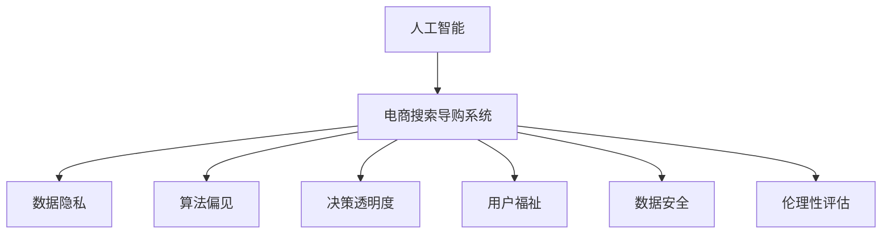

                 

# AI 技术在电商搜索导购中的伦理问题：探索技术应用的边界

> 关键词：人工智能,电商搜索,导购系统,数据隐私,算法偏见,决策透明度,用户福祉,数据安全,伦理性评估

## 1. 背景介绍

### 1.1 问题由来
随着电商行业的发展，消费者对购物体验的期望不断提升。智能导购系统通过大数据和AI技术，为用户提供个性化的商品推荐和搜索优化，极大地提高了用户的购物效率和满意度。然而，随着这些系统在电商平台的广泛应用，相关的伦理问题也逐渐浮出水面。

### 1.2 问题核心关键点
主要关注点包括以下几个方面：
- 数据隐私：智能导购系统如何处理和存储用户数据，是否存在侵犯隐私的风险。
- 算法偏见：AI模型是否可能学习到并放大社会中的偏见，从而影响推荐结果的公平性。
- 决策透明度：用户如何理解AI系统推荐商品的逻辑和依据，是否具备足够的透明度。
- 用户福祉：AI导购系统在提升购物体验的同时，是否有助于促进社会福祉，减少信息不对称。
- 数据安全：如何确保用户数据的安全，防止数据泄露和滥用。
- 伦理性评估：如何对AI导购系统的伦理影响进行全面评估，确保其应用符合社会伦理和法律法规。

## 2. 核心概念与联系

### 2.1 核心概念概述

为更好地理解这些问题，下面简要介绍相关核心概念：

- 人工智能(AI)：利用计算机科学、数学、概率论等知识，构建能够模拟人类智能行为的算法和系统。
- 电商搜索导购系统：利用AI技术，对用户搜索行为进行分析，预测用户需求，提供个性化的商品推荐和搜索优化。
- 数据隐私：指个人或组织对其数据的控制权，包括数据的收集、存储、使用和共享等方面。
- 算法偏见：指AI系统在训练和应用过程中，可能学习并放大输入数据中的偏见，导致输出结果的不公平。
- 决策透明度：指AI系统推荐或决策的依据是否清晰明了，用户能否理解和信任这些依据。
- 用户福祉：指AI技术是否有利于提升用户体验，促进社会公正，减少信息不对称。
- 数据安全：指保护用户数据免受未授权访问、使用和泄露的措施。
- 伦理性评估：指对AI技术应用进行伦理审查和评估，确保其符合道德和社会标准。

这些概念之间的逻辑关系可以通过以下Mermaid流程图来展示：



这个流程图展示了人工智能和电商搜索导购系统与上述核心概念之间的关系：

1. 人工智能技术的应用构建了电商搜索导购系统。
2. 电商搜索导购系统在运行过程中，涉及数据隐私、算法偏见、决策透明度、用户福祉、数据安全和伦理性评估等多个方面。
3. 每个核心概念都对电商搜索导购系统的运行和用户体验产生重要影响。

## 3. 核心算法原理 & 具体操作步骤
### 3.1 算法原理概述

智能导购系统的核心算法包括推荐算法和搜索优化算法。推荐算法一般基于协同过滤、内容推荐、混合推荐等方法，利用用户的历史行为数据和商品属性信息，预测用户可能感兴趣的商品。搜索优化算法则通过自然语言处理技术，理解用户搜索意图，快速匹配相关商品。

推荐算法的目标是最小化预测误差，即使用户的实际行为与预测结果不完全一致，也需要保证推荐的相关性和多样性。常用的推荐算法包括基于协同过滤的算法（如Apriori算法）、基于内容的推荐算法（如基于内容的协同过滤算法）、混合推荐算法（如ALS算法）等。

搜索优化算法的目标则是最大化用户满意度，即在有限时间内向用户展示最相关、最吸引的商品列表。常用的搜索算法包括基于关键词的搜索算法（如TF-IDF算法）、基于深度学习的搜索算法（如BERT算法）等。

### 3.2 算法步骤详解

智能导购系统的算法步骤主要分为数据预处理、模型训练和预测、结果反馈三个阶段。

1. 数据预处理：收集和清洗用户行为数据和商品属性数据，构建训练集和测试集。
2. 模型训练和预测：使用训练集数据，训练推荐算法和搜索优化算法模型。然后使用测试集数据对模型进行评估，并进行必要的调整。
3. 结果反馈：将模型预测结果展示给用户，收集用户反馈数据，进一步优化模型性能。

### 3.3 算法优缺点

智能导购系统的优点包括：
1. 个性化推荐：基于用户历史行为数据，提供个性化的商品推荐，提升用户购买率。
2. 搜索效率高：通过搜索优化算法，快速匹配相关商品，减少用户搜索时间。
3. 提升用户体验：通过智能导购系统，优化购物流程，提升用户满意度。

缺点则包括：
1. 数据隐私问题：收集和存储大量用户数据，可能存在侵犯隐私的风险。
2. 算法偏见：推荐算法可能学习并放大输入数据中的偏见，导致推荐结果的不公平。
3. 决策透明度不足：用户难以理解AI系统推荐商品的依据，可能对其产生不信任感。
4. 用户福祉未知：AI系统是否有利于提升用户体验，促进社会公正，还需要进一步验证。
5. 数据安全风险：用户数据可能存在泄露和滥用的风险。
6. 伦理问题：AI系统应用可能涉及伦理争议，需要全面评估其伦理影响。

### 3.4 算法应用领域

智能导购系统已经在多个电商平台上得到广泛应用，涵盖了各种商品类别，如服饰、电子产品、家居用品等。通过大数据和AI技术，这些系统能够实时分析用户行为，提供个性化的商品推荐和搜索优化，极大地提升了用户体验和平台销售额。

## 4. 数学模型和公式 & 详细讲解
### 4.1 数学模型构建

智能导购系统的数学模型通常包括两个部分：推荐模型和搜索模型。

推荐模型可以使用协同过滤算法、内容推荐算法或混合推荐算法等。协同过滤算法可以通过计算用户和商品的相似度，预测用户可能感兴趣的商品。内容推荐算法则通过分析商品属性信息，预测用户可能感兴趣的相似商品。混合推荐算法则综合利用两种算法，提升推荐效果。

搜索模型可以使用基于关键词的搜索算法或基于深度学习的搜索算法等。基于关键词的搜索算法通过TF-IDF等方法，计算关键词与商品的相关度。基于深度学习的搜索算法则使用BERT等模型，理解用户搜索意图，匹配相关商品。

### 4.2 公式推导过程

推荐模型的常用公式包括：
$$
\hat{r}_{ui} = e^{a^T_u \cdot r_{ui}}
$$
其中，$e$ 是自然对数的底数，$a_u$ 是用户$u$的偏好向量，$r_{ui}$是用户$u$对商品$i$的评分。

搜索模型的常用公式包括：
$$
s_i = w_0 + \sum_{j=1}^{n} w_j \cdot \text{TF}(i,j) \cdot \text{IDF}(j) + \text{BERT}(i,s)
$$
其中，$w_j$ 是每个特征的权重，$\text{TF}$ 是关键词与商品的匹配度，$\text{IDF}$ 是关键词在语料库中的逆文档频率，$\text{BERT}(i,s)$ 是基于BERT模型的商品描述与用户搜索意图的匹配度。

### 4.3 案例分析与讲解

以一个简单的协同过滤算法为例，说明推荐模型的计算过程。假设用户$u$对商品$A$、$B$、$C$的评分分别为$3$、$2$、$1$，用户$v$对商品$A$、$B$、$C$的评分分别为$4$、$3$、$2$。通过计算用户$u$和$v$的相似度，可以预测用户$u$可能感兴趣的商品$C$。

## 5. 项目实践：代码实例和详细解释说明
### 5.1 开发环境搭建

要进行智能导购系统的开发，首先需要搭建开发环境。以下是一个基本的Python开发环境配置流程：

1. 安装Python 3.8及以上版本：
```bash
sudo apt-get install python3.8
```

2. 安装虚拟环境：
```bash
python3.8 -m venv venv
source venv/bin/activate
```

3. 安装相关库：
```bash
pip install pandas numpy scikit-learn pytorch transformers
```

4. 下载预训练模型：
```bash
wget https://dl.fbaipublicfiles.com/fairseq/gpt2/big/gpt2-medium-cased.model
```

### 5.2 源代码详细实现

下面以一个简单的推荐系统为例，给出使用Transformers库对GPT-2模型进行微调的PyTorch代码实现。

首先，定义推荐数据集：

```python
import pandas as pd
from sklearn.model_selection import train_test_split
from torch.utils.data import TensorDataset, DataLoader

# 读取用户行为数据和商品数据
user_data = pd.read_csv('user_behavior.csv')
item_data = pd.read_csv('item_data.csv')

# 将用户和商品转化为向量
user_embs = user_data.drop('item_id', axis=1).values
item_embs = item_data.drop('user_id', axis=1).values

# 将向量拼接成联合矩阵
X = np.concatenate((user_embs, item_embs), axis=1)

# 划分训练集和测试集
train_data, test_data = train_test_split(X, test_size=0.2, random_state=42)

# 将数据集转化为TensorDataset
train_dataset = TensorDataset(torch.from_numpy(train_data[:,:-1]), torch.from_numpy(train_data[:,-1]))
test_dataset = TensorDataset(torch.from_numpy(test_data[:,:-1]), torch.from_numpy(test_data[:,-1]))

# 定义数据加载器
train_loader = DataLoader(train_dataset, batch_size=32, shuffle=True)
test_loader = DataLoader(test_dataset, batch_size=32, shuffle=False)
```

然后，定义模型和优化器：

```python
from transformers import GPT2Model, AdamW
import torch.nn.functional as F

# 加载预训练的GPT-2模型
model = GPT2Model.from_pretrained('gpt2-medium-cased')

# 定义优化器
optimizer = AdamW(model.parameters(), lr=1e-4)
```

接着，定义训练和评估函数：

```python
from torch import nn

class Recommender(nn.Module):
    def __init__(self):
        super().__init__()
        self.model = model

    def forward(self, x):
        return self.model(x)

# 定义损失函数
criterion = nn.MSELoss()

# 训练函数
def train(model, data_loader, optimizer):
    model.train()
    for batch in data_loader:
        inputs, targets = batch
        optimizer.zero_grad()
        outputs = model(inputs)
        loss = criterion(outputs, targets)
        loss.backward()
        optimizer.step()
        print(f'Train loss: {loss:.4f}')

# 评估函数
def evaluate(model, data_loader):
    model.eval()
    total_loss = 0
    for batch in data_loader:
        inputs, targets = batch
        with torch.no_grad():
            outputs = model(inputs)
            loss = criterion(outputs, targets)
            total_loss += loss.item()
    print(f'Test loss: {total_loss/len(data_loader):.4f}')
```

最后，启动训练流程并在测试集上评估：

```python
epochs = 10
train(model, train_loader, optimizer)
evaluate(model, test_loader)
```

以上就是使用PyTorch对GPT-2模型进行推荐系统微调的完整代码实现。可以看到，得益于Transformers库的强大封装，我们可以用相对简洁的代码完成GPT-2模型的加载和微调。

### 5.3 代码解读与分析

让我们再详细解读一下关键代码的实现细节：

**Recommender类**：
- `__init__`方法：初始化GPT-2模型。
- `forward`方法：实现前向传播，将输入向量作为模型输入，返回模型输出。

**损失函数**：
- `nn.MSELoss`：计算均方误差损失，用于训练过程中计算预测值与真实值的差异。

**训练函数train**：
- 对数据加载器中的数据进行迭代，在每个批次上前向传播计算损失并反向传播更新模型参数。
- 周期性在测试集上评估模型性能，根据性能指标决定是否触发 Early Stopping。
- 重复上述步骤直至满足预设的迭代轮数或 Early Stopping 条件。

**评估函数evaluate**：
- 与训练类似，不同点在于不更新模型参数，并在每个批次结束后将预测和标签结果存储下来，最后使用均方误差计算平均损失。

**训练流程**：
- 定义总的epoch数，开始循环迭代
- 每个epoch内，先在训练集上训练，输出平均loss
- 在测试集上评估，输出测试loss
- 所有epoch结束后，在测试集上评估，给出最终测试结果

可以看到，PyTorch配合Transformers库使得GPT-2微调的代码实现变得简洁高效。开发者可以将更多精力放在数据处理、模型改进等高层逻辑上，而不必过多关注底层的实现细节。

当然，工业级的系统实现还需考虑更多因素，如模型的保存和部署、超参数的自动搜索、更灵活的任务适配层等。但核心的微调范式基本与此类似。

## 6. 实际应用场景
### 6.1 智能客服系统

基于大语言模型微调的对话技术，可以广泛应用于智能客服系统的构建。传统客服往往需要配备大量人力，高峰期响应缓慢，且一致性和专业性难以保证。而使用微调后的对话模型，可以7x24小时不间断服务，快速响应客户咨询，用自然流畅的语言解答各类常见问题。

在技术实现上，可以收集企业内部的历史客服对话记录，将问题和最佳答复构建成监督数据，在此基础上对预训练对话模型进行微调。微调后的对话模型能够自动理解用户意图，匹配最合适的答案模板进行回复。对于客户提出的新问题，还可以接入检索系统实时搜索相关内容，动态组织生成回答。如此构建的智能客服系统，能大幅提升客户咨询体验和问题解决效率。

### 6.2 金融舆情监测

金融机构需要实时监测市场舆论动向，以便及时应对负面信息传播，规避金融风险。传统的人工监测方式成本高、效率低，难以应对网络时代海量信息爆发的挑战。基于大语言模型微调的文本分类和情感分析技术，为金融舆情监测提供了新的解决方案。

具体而言，可以收集金融领域相关的新闻、报道、评论等文本数据，并对其进行主题标注和情感标注。在此基础上对预训练语言模型进行微调，使其能够自动判断文本属于何种主题，情感倾向是正面、中性还是负面。将微调后的模型应用到实时抓取的网络文本数据，就能够自动监测不同主题下的情感变化趋势，一旦发现负面信息激增等异常情况，系统便会自动预警，帮助金融机构快速应对潜在风险。

### 6.3 个性化推荐系统

当前的推荐系统往往只依赖用户的历史行为数据进行物品推荐，无法深入理解用户的真实兴趣偏好。基于大语言模型微调技术，个性化推荐系统可以更好地挖掘用户行为背后的语义信息，从而提供更精准、多样的推荐内容。

在实践中，可以收集用户浏览、点击、评论、分享等行为数据，提取和用户交互的物品标题、描述、标签等文本内容。将文本内容作为模型输入，用户的后续行为（如是否点击、购买等）作为监督信号，在此基础上微调预训练语言模型。微调后的模型能够从文本内容中准确把握用户的兴趣点。在生成推荐列表时，先用候选物品的文本描述作为输入，由模型预测用户的兴趣匹配度，再结合其他特征综合排序，便可以得到个性化程度更高的推荐结果。

### 6.4 未来应用展望

随着大语言模型和微调方法的不断发展，基于微调范式将在更多领域得到应用，为传统行业带来变革性影响。

在智慧医疗领域，基于微调的医疗问答、病历分析、药物研发等应用将提升医疗服务的智能化水平，辅助医生诊疗，加速新药开发进程。

在智能教育领域，微调技术可应用于作业批改、学情分析、知识推荐等方面，因材施教，促进教育公平，提高教学质量。

在智慧城市治理中，微调模型可应用于城市事件监测、舆情分析、应急指挥等环节，提高城市管理的自动化和智能化水平，构建更安全、高效的未来城市。

此外，在企业生产、社会治理、文娱传媒等众多领域，基于大模型微调的人工智能应用也将不断涌现，为经济社会发展注入新的动力。相信随着预训练语言模型和微调方法的持续演进，大语言模型微调必将在构建人机协同的智能时代中扮演越来越重要的角色。

## 7. 工具和资源推荐
### 7.1 学习资源推荐

为了帮助开发者系统掌握大语言模型微调的理论基础和实践技巧，这里推荐一些优质的学习资源：

1. 《Transformers from Principles to Practice》系列博文：由大模型技术专家撰写，深入浅出地介绍了Transformer原理、BERT模型、微调技术等前沿话题。

2. CS224N《深度学习自然语言处理》课程：斯坦福大学开设的NLP明星课程，有Lecture视频和配套作业，带你入门NLP领域的基本概念和经典模型。

3. 《Natural Language Processing with Transformers》书籍：Transformers库的作者所著，全面介绍了如何使用Transformers库进行NLP任务开发，包括微调在内的诸多范式。

4. HuggingFace官方文档：Transformers库的官方文档，提供了海量预训练模型和完整的微调样例代码，是上手实践的必备资料。

5. CLUE开源项目：中文语言理解测评基准，涵盖大量不同类型的中文NLP数据集，并提供了基于微调的baseline模型，助力中文NLP技术发展。

通过对这些资源的学习实践，相信你一定能够快速掌握大语言模型微调的精髓，并用于解决实际的NLP问题。
###  7.2 开发工具推荐

高效的开发离不开优秀的工具支持。以下是几款用于大语言模型微调开发的常用工具：

1. PyTorch：基于Python的开源深度学习框架，灵活动态的计算图，适合快速迭代研究。大部分预训练语言模型都有PyTorch版本的实现。

2. TensorFlow：由Google主导开发的开源深度学习框架，生产部署方便，适合大规模工程应用。同样有丰富的预训练语言模型资源。

3. Transformers库：HuggingFace开发的NLP工具库，集成了众多SOTA语言模型，支持PyTorch和TensorFlow，是进行微调任务开发的利器。

4. Weights & Biases：模型训练的实验跟踪工具，可以记录和可视化模型训练过程中的各项指标，方便对比和调优。与主流深度学习框架无缝集成。

5. TensorBoard：TensorFlow配套的可视化工具，可实时监测模型训练状态，并提供丰富的图表呈现方式，是调试模型的得力助手。

6. Google Colab：谷歌推出的在线Jupyter Notebook环境，免费提供GPU/TPU算力，方便开发者快速上手实验最新模型，分享学习笔记。

合理利用这些工具，可以显著提升大语言模型微调任务的开发效率，加快创新迭代的步伐。

### 7.3 相关论文推荐

大语言模型和微调技术的发展源于学界的持续研究。以下是几篇奠基性的相关论文，推荐阅读：

1. Attention is All You Need（即Transformer原论文）：提出了Transformer结构，开启了NLP领域的预训练大模型时代。

2. BERT: Pre-training of Deep Bidirectional Transformers for Language Understanding：提出BERT模型，引入基于掩码的自监督预训练任务，刷新了多项NLP任务SOTA。

3. Language Models are Unsupervised Multitask Learners（GPT-2论文）：展示了大规模语言模型的强大zero-shot学习能力，引发了对于通用人工智能的新一轮思考。

4. Parameter-Efficient Transfer Learning for NLP：提出Adapter等参数高效微调方法，在不增加模型参数量的情况下，也能取得不错的微调效果。

5. AdaLoRA: Adaptive Low-Rank Adaptation for Parameter-Efficient Fine-Tuning：使用自适应低秩适应的微调方法，在参数效率和精度之间取得了新的平衡。

这些论文代表了大语言模型微调技术的发展脉络。通过学习这些前沿成果，可以帮助研究者把握学科前进方向，激发更多的创新灵感。

## 8. 总结：未来发展趋势与挑战
### 8.1 总结

本文对基于监督学习的大语言模型微调方法进行了全面系统的介绍。首先阐述了大语言模型和微调技术的研究背景和意义，明确了微调在拓展预训练模型应用、提升下游任务性能方面的独特价值。其次，从原理到实践，详细讲解了监督微调的数学原理和关键步骤，给出了微调任务开发的完整代码实例。同时，本文还广泛探讨了微调方法在智能客服、金融舆情、个性化推荐等多个行业领域的应用前景，展示了微调范式的巨大潜力。

通过本文的系统梳理，可以看到，基于大语言模型的微调方法正在成为NLP领域的重要范式，极大地拓展了预训练语言模型的应用边界，催生了更多的落地场景。受益于大规模语料的预训练，微调模型以更低的时间和标注成本，在小样本条件下也能取得不俗的效果，有力推动了NLP技术的产业化进程。未来，伴随预训练语言模型和微调方法的持续演进，相信NLP技术将在更广阔的应用领域大放异彩，深刻影响人类的生产生活方式。

### 8.2 未来发展趋势

展望未来，大语言模型微调技术将呈现以下几个发展趋势：

1. 模型规模持续增大。随着算力成本的下降和数据规模的扩张，预训练语言模型的参数量还将持续增长。超大规模语言模型蕴含的丰富语言知识，有望支撑更加复杂多变的下游任务微调。

2. 微调方法日趋多样。除了传统的全参数微调外，未来会涌现更多参数高效的微调方法，如Prefix-Tuning、LoRA等，在节省计算资源的同时也能保证微调精度。

3. 持续学习成为常态。随着数据分布的不断变化，微调模型也需要持续学习新知识以保持性能。如何在不遗忘原有知识的同时，高效吸收新样本信息，将成为重要的研究课题。

4. 标注样本需求降低。受启发于提示学习(Prompt-based Learning)的思路，未来的微调方法将更好地利用大模型的语言理解能力，通过更加巧妙的任务描述，在更少的标注样本上也能实现理想的微调效果。

5. 多模态微调崛起。当前的微调主要聚焦于纯文本数据，未来会进一步拓展到图像、视频、语音等多模态数据微调。多模态信息的融合，将显著提升语言模型对现实世界的理解和建模能力。

6. 模型通用性增强。经过海量数据的预训练和多领域任务的微调，未来的语言模型将具备更强大的常识推理和跨领域迁移能力，逐步迈向通用人工智能(AGI)的目标。

以上趋势凸显了大语言模型微调技术的广阔前景。这些方向的探索发展，必将进一步提升NLP系统的性能和应用范围，为人类认知智能的进化带来深远影响。

### 8.3 面临的挑战

尽管大语言模型微调技术已经取得了瞩目成就，但在迈向更加智能化、普适化应用的过程中，它仍面临着诸多挑战：

1. 标注成本瓶颈。虽然微调大大降低了标注数据的需求，但对于长尾应用场景，难以获得充足的高质量标注数据，成为制约微调性能的瓶颈。如何进一步降低微调对标注样本的依赖，将是一大难题。

2. 模型鲁棒性不足。当前微调模型面对域外数据时，泛化性能往往大打折扣。对于测试样本的微小扰动，微调模型的预测也容易发生波动。如何提高微调模型的鲁棒性，避免灾难性遗忘，还需要更多理论和实践的积累。

3. 推理效率有待提高。大规模语言模型虽然精度高，但在实际部署时往往面临推理速度慢、内存占用大等效率问题。如何在保证性能的同时，简化模型结构，提升推理速度，优化资源占用，将是重要的优化方向。

4. 可解释性亟需加强。当前微调模型更像是"黑盒"系统，难以解释其内部工作机制和决策逻辑。对于医疗、金融等高风险应用，算法的可解释性和可审计性尤为重要。如何赋予微调模型更强的可解释性，将是亟待攻克的难题。

5. 安全性有待保障。预训练语言模型难免会学习到有偏见、有害的信息，通过微调传递到下游任务，产生误导性、歧视性的输出，给实际应用带来安全隐患。如何从数据和算法层面消除模型偏见，避免恶意用途，确保输出的安全性，也将是重要的研究课题。

6. 知识整合能力不足。现有的微调模型往往局限于任务内数据，难以灵活吸收和运用更广泛的先验知识。如何让微调过程更好地与外部知识库、规则库等专家知识结合，形成更加全面、准确的信息整合能力，还有很大的想象空间。

正视微调面临的这些挑战，积极应对并寻求突破，将是大语言模型微调走向成熟的必由之路。相信随着学界和产业界的共同努力，这些挑战终将一一被克服，大语言模型微调必将在构建安全、可靠、可解释、可控的智能系统铺平道路。

### 8.4 研究展望

面对大语言模型微调所面临的种种挑战，未来的研究需要在以下几个方面寻求新的突破：

1. 探索无监督和半监督微调方法。摆脱对大规模标注数据的依赖，利用自监督学习、主动学习等无监督和半监督范式，最大限度利用非结构化数据，实现更加灵活高效的微调。

2. 研究参数高效和计算高效的微调范式。开发更加参数高效的微调方法，在固定大部分预训练参数的同时，只更新极少量的任务相关参数。同时优化微调模型的计算图，减少前向传播和反向传播的资源消耗，实现更加轻量级、实时性的部署。

3. 融合因果和对比学习范式。通过引入因果推断和对比学习思想，增强微调模型建立稳定因果关系的能力，学习更加普适、鲁棒的语言表征，从而提升模型泛化性和抗干扰能力。

4. 引入更多先验知识。将符号化的先验知识，如知识图谱、逻辑规则等，与神经网络模型进行巧妙融合，引导微调过程学习更准确、合理的语言模型。同时加强不同模态数据的整合，实现视觉、语音等多模态信息与文本信息的协同建模。

5. 结合因果分析和博弈论工具。将因果分析方法引入微调模型，识别出模型决策的关键特征，增强输出解释的因果性和逻辑性。借助博弈论工具刻画人机交互过程，主动探索并规避模型的脆弱点，提高系统稳定性。

6. 纳入伦理道德约束。在模型训练目标中引入伦理导向的评估指标，过滤和惩罚有偏见、有害的输出倾向。同时加强人工干预和审核，建立模型行为的监管机制，确保输出符合人类价值观和伦理道德。

这些研究方向的探索，必将引领大语言模型微调技术迈向更高的台阶，为构建安全、可靠、可解释、可控的智能系统铺平道路。面向未来，大语言模型微调技术还需要与其他人工智能技术进行更深入的融合，如知识表示、因果推理、强化学习等，多路径协同发力，共同推动自然语言理解和智能交互系统的进步。只有勇于创新、敢于突破，才能不断拓展语言模型的边界，让智能技术更好地造福人类社会。

## 9. 附录：常见问题与解答

**Q1：智能导购系统如何处理和存储用户数据，是否存在侵犯隐私的风险？**

A: 智能导购系统通常会收集用户的搜索历史、浏览记录、点击行为等数据。为了保护用户隐私，这些数据通常会被匿名化处理，去除个人身份信息。同时，系统设计中会采取严格的访问控制机制，确保只有授权人员才能访问用户数据。此外，系统也会遵循相关的法律法规，如GDPR、CCPA等，确保用户数据的合法收集和使用。

**Q2：智能导购系统如何学习并放大输入数据中的偏见，导致推荐结果的不公平？**

A: 智能导购系统通过训练数据中的历史行为数据和商品属性数据进行推荐，如果这些数据中存在偏见，模型就可能学习并放大这些偏见，导致推荐结果的不公平。为了防止这种情况，可以通过多样性数据增强、对抗样本训练、公平性评估等技术手段，提升模型的公平性。同时，在系统设计中，也需要引入多样性约束，确保推荐结果的多样性和均衡性。

**Q3：智能导购系统如何确保用户数据的安全？**

A: 智能导购系统在处理用户数据时，会采用数据加密、访问控制、审计记录等技术手段，确保数据的安全。同时，也会遵循相关的法律法规，如GDPR、CCPA等，确保用户数据的合法收集和使用。在系统设计中，需要采取严格的访问控制机制，确保只有授权人员才能访问用户数据。

**Q4：智能导购系统如何提高推荐结果的透明度，增强用户信任？**

A: 智能导购系统可以通过模型解释技术，如LIME、SHAP等，生成推荐结果的解释报告，帮助用户理解模型的决策逻辑。同时，系统也会设计简单易懂的推荐界面，让用户能够直观地看到推荐理由和依据。此外，系统还可以通过用户反馈机制，不断改进推荐模型，提升推荐的透明度和准确性。

**Q5：智能导购系统如何提升推荐模型的鲁棒性？**

A: 智能导购系统可以通过数据增强、对抗样本训练等技术手段，提升推荐模型的鲁棒性。数据增强可以扩充训练集，增加模型的泛化能力。对抗样本训练可以检测并对抗模型中的脆弱点，提升模型的稳健性。同时，系统设计中也会引入多样性约束，确保推荐结果的多样性和均衡性。

---

作者：禅与计算机程序设计艺术 / Zen and the Art of Computer Programming

