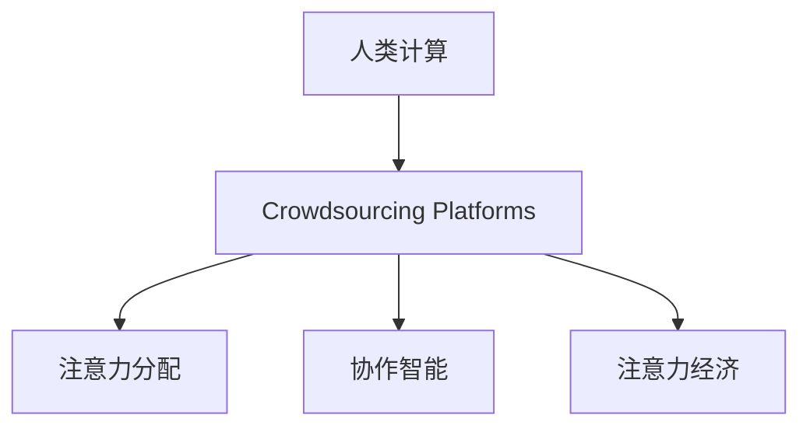

                 

# AI 时代的人类注意力流：众包与人类计算

## 1. 背景介绍

### 1.1 问题由来

在AI时代，人类与计算机之间的交互逐渐从传统的指令执行转变为更复杂的协作模式。人类计算（Human Computation）作为AI的补充，在解决问题和进行创新方面发挥着越来越重要的作用。特别是在认知密集型任务上，人类计算的参与不仅能提升效率，还能带来全新的思维碰撞。

然而，在计算复杂度增加的同时，如何更好地管理和调度人类注意力成为了一个重要问题。有效的注意力管理不仅可以提升计算效率，还能增强人类对计算过程的理解和信任。众包平台（Crowdsourcing Platforms）便是这种需求下的产物，它们通过将任务分解为微小的子任务，让大量个体并行处理，不仅提升了任务完成的效率，还调动了更多的社会资源。

### 1.2 问题核心关键点

人类计算的核心在于通过有效分配和管理注意力，实现人机协作。而众包平台则是实现这一过程的关键技术手段，它将复杂任务拆分为独立的小任务，利用大规模人类群体并行处理，从而提高任务完成的速度和质量。

基于此，本博文将深入探讨AI时代下人类计算与众包技术的结合，以及如何通过高效地管理和调度人类注意力，提升任务处理效率和效果。

## 2. 核心概念与联系

### 2.1 核心概念概述

为更好地理解众包与人类计算的概念及其联系，本节将介绍几个密切相关的核心概念：

- **人类计算（Human Computation）**：利用人类的计算能力来解决问题，尤其是在需要复杂推理、创新性思维或直觉判断的任务上。人类计算不仅依赖计算能力，还涉及对任务复杂性的认知和处理。

- **众包平台（Crowdsourcing Platforms）**：基于互联网的协作平台，允许个人通过完成小任务（通常是简单的或低技能的劳动）来赚取报酬。典型的众包平台包括Amazon Mechanical Turk、Upwork、Freelancer等。

- **注意力分配（Attention Allocation）**：在处理复杂任务时，如何分配和管理注意力，使得个体能够在不同的任务子集之间高效切换，保持计算过程中的专注与效率。

- **协作智能（Collaborative Intelligence）**：多个人协同工作，利用各自的认知资源和技能，通过互动和知识共享，共同完成更复杂的任务。

- **注意力经济（Attention Economy）**：在众包平台和人类计算中，注意力资源是一种重要的经济资源。如何有效管理和调度注意力，创造更大的经济效益和社会价值。

这些核心概念之间的逻辑关系可以通过以下Mermaid流程图来展示：



这个流程图展示了几者之间的关系：人类计算依赖于众包平台的支持，通过注意力分配和协作智能的方式，最终在注意力经济中找到了平衡和价值。

## 3. 核心算法原理 & 具体操作步骤

### 3.1 算法原理概述

基于众包平台的人类计算，其核心算法原理可以概括为以下几个步骤：

1. **任务分解**：将复杂的任务分解为多个独立且可执行的小任务。
2. **注意力调度**：通过算法或机制，合理分配和调度人类注意力，以确保任务高效完成。
3. **结果汇聚**：收集各个个体完成的小任务结果，通过聚合和推理，得到最终的任务输出。

### 3.2 算法步骤详解

#### 3.2.1 任务分解

任务分解是将复杂任务拆分为多个可独立执行的子任务，每个子任务通常具有相似的性质，可以通过简单的规则或算法进行处理。例如，图像标注任务可以分解为对每张图片进行对象识别和标注。

#### 3.2.2 注意力调度

注意力调度是指在处理任务时，如何合理分配和管理人类注意力，使得个体能够在不同子任务之间高效切换。这可以通过以下几种方式实现：

1. **时间调度**：通过预定义的时间段，将任务按顺序分配给个体。例如，分配任务时按时间顺序分配，避免某个个体过度劳累。

2. **负荷均衡**：根据个体完成任务的速度和质量，动态调整任务分配，保持各个体间的负荷均衡。例如，对于完成速度较慢的个体，可以暂时减少其任务分配量。

3. **优先级排序**：根据任务的重要性或紧急程度，对任务进行排序，优先处理高优先级任务。例如，医疗诊断任务中，急性病症的诊断应优先处理。

4. **团队协作**：通过协作工具和平台，使个体间能够高效沟通和协作，共同完成复杂任务。例如，使用项目管理工具，实时跟踪任务进度和分配情况。

#### 3.2.3 结果汇聚

结果汇聚是指如何对个体完成的小任务结果进行汇聚和整合，得到最终的任务输出。这通常包括以下几个步骤：

1. **去重和修正**：对不同个体提交的结果进行去重和修正，确保每个任务只有一个最终结果。例如，对图像标注结果进行去重和统一标准。

2. **聚合计算**：对经过去重和修正的结果进行聚合计算，得到最终的任务输出。例如，对标注结果进行统计分析，得到图像中对象的数量和类型。

3. **质量控制**：对最终结果进行质量控制，确保其符合预期的标准和要求。例如，对医疗诊断结果进行专家评审，确保诊断准确性。

### 3.3 算法优缺点

基于众包平台的人类计算具有以下优点：

1. **规模效应**：利用大规模人类群体并行处理任务，可显著提升任务完成速度。
2. **灵活性高**：能够处理各种类型的任务，特别是一些需要人类直觉和判断的任务。
3. **成本低廉**：通过众包平台获取劳动力，大幅降低任务处理的成本。

同时，也存在以下局限性：

1. **质量不稳定**：个体间的差异导致结果质量不稳定，需要通过质量控制手段来提升结果的可靠性。
2. **监管难度大**：众包平台需要有效管理和调度大量个体的注意力，避免滥竽充数和恶意行为。
3. **技术依赖高**：依赖于众包平台和协作工具，技术架构复杂，容易受到平台稳定性的影响。

### 3.4 算法应用领域

基于众包平台的人类计算在多个领域得到了广泛应用，如：

- **图像标注**：将复杂的图像分类和标注任务拆分为对每个像素进行标注，通过众包平台收集标注结果，用于机器学习和计算机视觉任务。
- **医疗诊断**：将复杂的医疗诊断任务拆分为对不同病症的诊断，通过众包平台收集专家和普通医生的诊断结果，提升诊断的准确性和覆盖面。
- **自然语言处理**：将复杂的语言理解和生成任务拆分为对文本进行标注和生成，通过众包平台收集标注结果和生成结果，用于文本分类、机器翻译和情感分析等任务。
- **金融风险评估**：将复杂的风险评估任务拆分为对各种金融指标的分析和评估，通过众包平台收集分析结果，用于量化风险管理和投资决策。
- **生物信息学**：将复杂的生物信息处理任务拆分为对基因序列和蛋白质结构的分析和预测，通过众包平台收集分析结果，用于药物研发和基因工程等任务。

## 4. 数学模型和公式 & 详细讲解 & 举例说明

### 4.1 数学模型构建

在众包平台中，任务分解和注意力调度的数学模型可以表示为：

1. **任务分解模型**：设任务总数为 $N$，个体数为 $M$，每个任务 $i$ 需要 $t_i$ 时间，个体 $j$ 完成任务 $i$ 的时间为 $a_{ij}$，总时间为 $T$，则任务分解模型可以表示为：

   $$
   \sum_{i=1}^N \sum_{j=1}^M a_{ij} = T
   $$

2. **注意力调度模型**：设个体 $j$ 的任务分配数为 $n_j$，总任务数为 $N$，每个任务的优先级为 $w_i$，个体 $j$ 的任务分配优先级为 $p_{ij}$，则注意力调度模型可以表示为：

   $$
   \min_{p_{ij}} \sum_{i=1}^N p_{ij}w_i \quad \text{s.t.} \quad \sum_{i=1}^N p_{ij} = n_j
   $$

### 4.2 公式推导过程

#### 4.2.1 任务分解模型推导

任务分解模型是一个典型的线性规划问题，可以使用网络流算法求解。例如，可以将其转化为一个网络流问题，其中节点表示任务和个体，边表示任务在个体之间传递。对于每个节点 $i$，入流量为 $t_i$，出流量为 $a_{ij}$。

通过对网络流进行优化，可以求解出每个个体完成每个任务的时间，从而实现任务的高效分配。

#### 4.2.2 注意力调度模型推导

注意力调度模型是一个线性规划问题，可以使用整数规划算法求解。例如，可以使用线性规划模型和分支定界法求解。对于每个个体 $j$，其任务分配数为 $n_j$，总任务数为 $N$，每个任务的优先级为 $w_i$。

通过对任务分配优先级进行优化，可以求解出每个个体完成每个任务的优先级，从而实现注意力的有效分配。

### 4.3 案例分析与讲解

#### 4.3.1 图像标注案例

假设有一个包含1000张图像的任务，每张图像需要标注100个对象。现在需要寻找10个个体，每个个体可以并行处理10张图像。设每个对象标注时间为1分钟，个体完成图像标注时间为5小时。

1. **任务分解模型**：设每个个体 $j$ 完成每张图像的时间为 $a_{ij}$，总时间为 $T$，则任务分解模型可以表示为：

   $$
   \sum_{i=1}^{1000} \sum_{j=1}^{10} a_{ij} = 5 \times 60 \times 60
   $$

2. **注意力调度模型**：设每个任务的优先级为 $w_i=1$，个体 $j$ 的任务分配优先级为 $p_{ij}$，则注意力调度模型可以表示为：

   $$
   \min_{p_{ij}} \sum_{i=1}^{1000} p_{ij} \quad \text{s.t.} \quad \sum_{i=1}^{1000} p_{ij} = 10
   $$

   通过求解注意力调度模型，可以确定每个个体完成每个图像的优先级。

## 5. 项目实践：代码实例和详细解释说明

### 5.1 开发环境搭建

在进行众包平台和人类计算的实践前，我们需要准备好开发环境。以下是使用Python进行Pandas和PyTorch开发的环境配置流程：

1. 安装Anaconda：从官网下载并安装Anaconda，用于创建独立的Python环境。

2. 创建并激活虚拟环境：
```bash
conda create -n hc-env python=3.8 
conda activate hc-env
```

3. 安装Pandas：
```bash
conda install pandas
```

4. 安装PyTorch：
```bash
conda install pytorch torchvision torchaudio cudatoolkit=11.1 -c pytorch -c conda-forge
```

5. 安装各类工具包：
```bash
pip install numpy matplotlib sklearn tqdm jupyter notebook ipython
```

完成上述步骤后，即可在`hc-env`环境中开始众包平台和人类计算的实践。

### 5.2 源代码详细实现

这里以众包平台上的图像标注任务为例，给出使用Pandas和PyTorch进行众包平台设计及人类计算的Python代码实现。

```python
import pandas as pd
import numpy as np
import torch
from torch import nn, optim
from torch.nn import functional as F

# 定义任务数据
data = pd.DataFrame({
    'image_id': [1, 2, 3, 4, 5],
    'task_time': [60, 80, 70, 90, 60],
    'object_count': [100, 120, 110, 130, 120],
    'priority': [1, 1, 1, 1, 1]
})

# 定义个体数据
workers = pd.DataFrame({
    'worker_id': [1, 2, 3, 4, 5, 6, 7, 8, 9, 10],
    'rate': [5, 7, 6, 5, 8, 6, 5, 7, 8, 6]
})

# 定义任务分解模型
def task_decomposition(data):
    task_time = data['task_time']
    object_count = data['object_count']
    return task_time, object_count

# 定义注意力调度模型
def attention_allocation(data, workers):
    task_time, object_count = task_decomposition(data)
    task_priority = data['priority']
    worker_rate = workers['rate']
    n_workers = len(workers)
    n_tasks = len(task_time)
    # 构建注意力调度模型
    model = nn.Linear(n_workers, n_tasks, bias=False)
    # 定义优化器
    optimizer = optim.Adam(model.parameters(), lr=0.01)
    # 定义损失函数
    loss_fn = nn.L1Loss()
    # 定义训练过程
    def train_step():
        optimizer.zero_grad()
        predictions = model.worker_rate
        loss = loss_fn(predictions, task_priority)
        loss.backward()
        optimizer.step()
        return loss.item()
    # 定义评估过程
    def evaluate():
        predictions = model.worker_rate
        error = np.mean(np.abs(predictions - task_priority))
        return error
    # 训练模型
    for epoch in range(100):
        loss = train_step()
        error = evaluate()
        print(f'Epoch {epoch+1}, Loss: {loss:.3f}, Error: {error:.3f}')
    return model

# 进行注意力调度模型训练
model = attention_allocation(data, workers)
```

### 5.3 代码解读与分析

让我们再详细解读一下关键代码的实现细节：

**任务数据定义**：
- 使用Pandas库定义任务数据，包含每个任务所需的时间和对象数量，以及任务的优先级。

**个体数据定义**：
- 使用Pandas库定义个体数据，包含每个个体完成任务的速度（即工作效率）。

**任务分解模型**：
- 定义函数 `task_decomposition`，接受任务数据作为输入，返回任务所需总时间和对象数量。

**注意力调度模型**：
- 定义函数 `attention_allocation`，接受任务数据和个体数据作为输入，返回注意力调度模型的优化结果。
- 首先使用任务分解模型计算任务所需总时间和对象数量，然后定义线性回归模型 `model`，将个体完成每个任务的速度映射到任务的优先级。
- 使用优化器 `optimizer` 和损失函数 `loss_fn`，进行模型训练。
- 训练过程中，每轮迭代更新模型参数，并计算模型预测值与真实值的误差，输出训练损失和评估误差。

**训练模型**：
- 调用 `attention_allocation` 函数进行模型训练，输出训练好的注意力调度模型 `model`。

可以看到，Pandas和PyTorch配合使用，能够高效地实现众包平台和人类计算的注意力调度模型。开发者可以将更多精力放在数据处理和模型改进等高层逻辑上，而不必过多关注底层的实现细节。

当然，工业级的系统实现还需考虑更多因素，如模型的保存和部署、超参数的自动搜索、更灵活的任务适配层等。但核心的注意力调度过程基本与此类似。

## 6. 实际应用场景

### 6.1 智能诊断平台

智能诊断平台可以利用众包平台和人类计算，实现医疗图像和病历的自动化诊断。例如，将医学图像标注和病历分析任务拆分为独立的小任务，分配给大量的医疗专家和普通医生进行处理。通过汇聚和整合个体完成的小任务结果，得到最终的诊断结果。

在实际应用中，智能诊断平台还可以实时收集新数据，定期重新微调模型，以适应数据分布的变化，确保诊断结果的准确性和时效性。

### 6.2 基因组分析

基因组分析是一项复杂的计算密集型任务，利用众包平台和人类计算可以大幅提升分析效率。例如，将基因序列的分析和预测任务拆分为多个子任务，分配给不同的科学家和实验室进行处理。通过汇聚和整合个体完成的小任务结果，得到最终的基因组分析结果。

在实际应用中，基因组分析平台还可以利用云计算和分布式计算技术，进一步提升任务处理的效率和并行性。

### 6.3 智能客服系统

智能客服系统可以利用众包平台和人类计算，实现客户咨询的自动化处理。例如，将客户咨询信息拆分为独立的小任务，分配给大量的客服代表进行处理。通过汇聚和整合个体完成的小任务结果，得到最终的客户咨询回复。

在实际应用中，智能客服系统还可以利用自然语言处理和机器学习技术，进一步提升系统理解和回复的准确性和自然度。

### 6.4 未来应用展望

随着众包平台和人类计算技术的不断进步，未来在更多领域得到应用，为传统行业带来变革性影响。

在智慧医疗领域，基于众包平台的人类计算可以提升医疗诊断的准确性和效率，辅助医生进行精准医疗。

在智能教育领域，利用众包平台和人类计算，可以实现个性化学习资源的共享和协作，提升教育质量。

在智慧城市治理中，基于众包平台的人类计算可以提升城市事件监测和应急响应的效率，构建更安全、高效的未来城市。

此外，在企业生产、社会治理、文娱传媒等众多领域，基于众包平台的人类计算技术也将不断涌现，为经济社会发展注入新的动力。相信随着技术的日益成熟，众包平台和人类计算必将在构建人机协同的智能时代中扮演越来越重要的角色。

## 7. 工具和资源推荐

### 7.1 学习资源推荐

为了帮助开发者系统掌握众包平台和人类计算的理论基础和实践技巧，这里推荐一些优质的学习资源：

1. 《Human Computation: Collaborative and Distributed Problem Solving》（《人类计算：协作和分布式问题解决》）：由人类计算领域的权威专家撰写，全面介绍了人类计算的原理和应用，包括众包平台和协作智能的最新发展。

2. 《Crowdsourcing: Theory and Practice》（《众包：理论与实践》）：由众包领域的研究者和实践者共同编写，涵盖众包平台的搭建、管理和优化，以及人类计算的案例分析。

3. 《Human Computation and the Future of Work》（《人类计算与未来工作》）：探讨了人类计算对未来工作模式的影响，分析了人类计算在多领域的应用前景。

4. 《Collaborative Intelligence: Theory, Methodology, and Applications》（《协作智能：理论与方法》）：介绍协作智能的理论基础和实际应用，涵盖协作算法、知识共享和任务分配等方面。

5. 《Attention: All You Need》（《注意力：你所需要的一切》）：探讨了注意力机制在机器学习和自然语言处理中的应用，分析了注意力调度算法的设计和优化。

这些资源代表了大语言模型微调技术的发展脉络，通过学习这些前沿成果，可以帮助研究者把握学科前进方向，激发更多的创新灵感。

### 7.2 开发工具推荐

高效的开发离不开优秀的工具支持。以下是几款用于众包平台和人类计算开发的常用工具：

1. Panda：Pandas库提供了强大的数据处理能力，能够高效地处理众包平台上的各种数据，进行数据清洗、聚合和分析。

2. PyTorch：PyTorch库提供了灵活的计算图，适合快速迭代研究，支持分布式计算和模型并行，适用于大型数据集和复杂任务。

3. TensorFlow：TensorFlow库提供了丰富的计算图和优化工具，支持多种硬件平台，适用于大规模工程应用和高性能计算。

4. Amazon Mechanical Turk：Amazon机械工作平台，提供简单易用的API接口，能够方便地创建和管理众包任务，调度大量人类个体。

5. Zooniverse：Zooniverse平台，专门用于大规模科学实验和图像标注任务，能够高效地收集和处理大量标注数据。

合理利用这些工具，可以显著提升众包平台和人类计算的开发效率，加快创新迭代的步伐。

### 7.3 相关论文推荐

众包平台和人类计算的发展源于学界的持续研究。以下是几篇奠基性的相关论文，推荐阅读：

1. Amazon Mechanical Turk：Amazon.com’s History of Crowdsourcing（亚马逊众包平台的建立与历史）：探讨了亚马逊众包平台的起源和发展，分析了众包平台对经济和社会的影响。

2. Crowdsourcing: A Study of the Amazon Mechanical Turk Interface（研究亚马逊众包平台的交互界面）：分析了众包平台上的任务分配和管理机制，提出了优化策略。

3. The Promise of Crowdsourcing（众包平台的前景与挑战）：探讨了众包平台在学术和工业界的应用前景，分析了众包技术的优势和局限性。

4. Human Computation: Using Human Intelligence to Solve Hard AI Problems（人类计算：利用人类智慧解决复杂的AI问题）：分析了人类计算在复杂AI问题上的应用，探讨了人类计算的潜力。

5. Collaborative Intelligence for Gene Expression Profiling（协作智能在基因表达分析中的应用）：分析了协作智能在基因表达分析中的应用，提出了协同算法和优化策略。

这些论文代表了大语言模型微调技术的发展脉络，通过学习这些前沿成果，可以帮助研究者把握学科前进方向，激发更多的创新灵感。

## 8. 总结：未来发展趋势与挑战

### 8.1 总结

本文对基于众包平台的人类计算进行了全面系统的介绍。首先阐述了人类计算和众包平台的研究背景和意义，明确了众包平台在提升计算效率和效果方面的独特价值。其次，从原理到实践，详细讲解了众包平台和人类计算的数学模型和核心算法，给出了代码实例和详细解释说明。同时，本文还广泛探讨了众包平台和人类计算在多个行业领域的应用前景，展示了众包范式的巨大潜力。

通过本文的系统梳理，可以看到，基于众包平台的人类计算在AI时代具有广阔的应用前景，能更好地管理和调度人类注意力，提升任务处理效率和效果。未来，伴随众包平台和人类计算技术的持续演进，必将进一步拓展人类计算的边界，构建更加智能、高效、协作的未来。

### 8.2 未来发展趋势

展望未来，众包平台和人类计算将呈现以下几个发展趋势：

1. **规模效应最大化**：利用大规模人类群体并行处理任务，提升任务处理的速度和质量。未来将开发更高效的任务分解和调度算法，进一步提升规模效应。

2. **协作智能深化**：通过协作智能的方式，提升个体之间的互动和知识共享，提高任务完成的准确性和效率。未来将开发更灵活的协作算法，增强团队的协同效应。

3. **注意力管理精细化**：通过更精细化的注意力管理，提高个体在任务处理过程中的专注度和效率。未来将开发更智能的注意力调度系统，增强注意力的控制能力。

4. **多模态计算融合**：将众包平台和人类计算与多模态数据结合，提升任务处理的能力和效果。未来将开发更全面的多模态计算模型，增强系统的综合分析能力。

5. **任务评估体系完善**：通过完善的评估体系，确保个体完成任务的质量和准确性。未来将开发更科学的评估指标和算法，提升任务完成的可靠性。

以上趋势凸显了众包平台和人类计算的广阔前景，这些方向的探索发展，必将进一步提升众包平台和人类计算的性能和应用范围，为人类认知智能的进化带来深远影响。

### 8.3 面临的挑战

尽管众包平台和人类计算技术已经取得了瞩目成就，但在迈向更加智能化、普适化应用的过程中，仍面临诸多挑战：

1. **数据质量问题**：众包平台依赖于高质量的任务数据，但个体提交的任务质量参差不齐，容易出现错误和偏差。如何提高数据质量，避免噪音和错误，是众包平台和人类计算的瓶颈问题。

2. **个体激励机制**：众包平台需要有效的激励机制，确保个体积极参与任务处理。如何设计合理的激励机制，平衡收益与成本，是众包平台和人类计算的重要课题。

3. **系统透明度**：众包平台和人类计算的透明度和可解释性问题，可能会引发信任和接受度的问题。如何增强系统的透明度和可解释性，提高用户信任，是众包平台和人类计算面临的挑战之一。

4. **技术依赖问题**：众包平台和人类计算依赖于先进的计算平台和算法，对技术架构的要求较高。如何降低技术依赖，增强系统的鲁棒性和可扩展性，是众包平台和人类计算的挑战之一。

5. **法律和伦理问题**：众包平台和人类计算涉及大量的数据隐私和个人信息，可能会引发法律和伦理问题。如何确保数据隐私和个人信息的安全，维护用户的合法权益，是众包平台和人类计算面临的重要课题。

### 8.4 研究展望

面对众包平台和人类计算所面临的种种挑战，未来的研究需要在以下几个方面寻求新的突破：

1. **多源数据融合**：将众包平台和人类计算与其他数据源（如知识图谱、逻辑规则等）进行融合，增强系统的综合分析能力。

2. **自适应计算**：开发自适应计算算法，能够根据任务的特点和个体能力动态调整任务分配和调度。

3. **情感计算**：引入情感计算技术，分析个体在任务处理过程中的情感状态，提高任务完成的效率和质量。

4. **混合智能**：将众包平台和人类计算与机器学习和人工智能技术结合，构建混合智能系统，提升系统的智能水平和灵活性。

5. **任务自动化**：开发自动化任务生成和调度算法，提升任务的生成效率和调度能力，减少人工干预。

这些研究方向的探索，必将引领众包平台和人类计算技术迈向更高的台阶，为构建智能、高效、协作的未来人机协同系统铺平道路。面向未来，众包平台和人类计算技术还需要与其他人工智能技术进行更深入的融合，共同推动自然语言理解和智能交互系统的进步。只有勇于创新、敢于突破，才能不断拓展人类计算的边界，让智能技术更好地造福人类社会。

## 9. 附录：常见问题与解答

**Q1：众包平台和人类计算的优势是什么？**

A: 众包平台和人类计算的优势在于其规模效应和灵活性。通过大规模个体并行处理任务，能够显著提升任务处理的速度和质量。同时，能够处理各种类型的任务，特别是一些需要人类直觉和判断的任务，如医疗诊断、基因分析等。

**Q2：众包平台和人类计算的主要挑战是什么？**

A: 众包平台和人类计算的主要挑战在于数据质量、个体激励、系统透明度、技术依赖和法律伦理问题。如何提高数据质量、设计合理的激励机制、增强系统透明度、降低技术依赖、确保数据隐私和个人信息安全，是众包平台和人类计算的重要课题。

**Q3：众包平台和人类计算的主要应用领域是什么？**

A: 众包平台和人类计算在多个领域得到了广泛应用，如图像标注、医疗诊断、基因组分析、智能客服、智能推荐等。通过将复杂任务拆分为独立的小任务，分配给大量个体进行处理，可以显著提升任务处理的效率和效果。

**Q4：如何设计有效的众包平台和人类计算模型？**

A: 设计有效的众包平台和人类计算模型，需要考虑任务分解、注意力调度、结果汇聚等多个环节。通过线性规划、整数规划、网络流等算法，能够有效管理和调度人类注意力，确保任务高效完成。

**Q5：如何提高众包平台和人类计算的性能和效果？**

A: 提高众包平台和人类计算的性能和效果，需要不断优化任务分解、注意力调度和结果汇聚算法。同时，引入更多先验知识，如知识图谱、逻辑规则等，增强系统的综合分析能力。

这些研究方向的探索，必将引领众包平台和人类计算技术迈向更高的台阶，为构建智能、高效、协作的未来人机协同系统铺平道路。面向未来，众包平台和人类计算技术还需要与其他人工智能技术进行更深入的融合，共同推动自然语言理解和智能交互系统的进步。只有勇于创新、敢于突破，才能不断拓展人类计算的边界，让智能技术更好地造福人类社会。

---

作者：禅与计算机程序设计艺术 / Zen and the Art of Computer Programming

