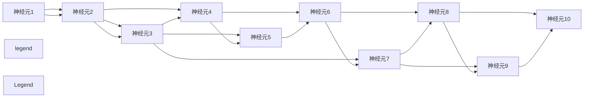

                 

# AI 神经网络计算艺术之禅：如何把大自然亿万年进化训练出的生物神经网络作为新一代人工神经网络的蓝本

## 1. 背景介绍

### 1.1 问题由来
在计算机科学和人工智能的演进历程中，神经网络一直是推动技术进步的核心力量。从最初的感知器，到深度学习、卷积神经网络、循环神经网络，再到当下最流行的Transformer模型，每一步都是人类对大脑生理机制和计算模型结合的深度探索。然而，我们一直在追问：自然的生物神经网络是如何在亿万年的演化中进化出高复杂度和高效能的智能，从而驱动生命的进化？能否以生物神经网络作为模型，设计出超越当前深度学习模型的全新一代AI神经网络？

### 1.2 问题核心关键点
当前，随着计算技术的进步和数据量的爆炸，深度学习模型已经实现了在许多领域的高水平应用，如计算机视觉、自然语言处理、语音识别等。但这些模型仍面临一些核心问题：

- **过拟合与泛化能力**：深度学习模型往往需要大量标注数据来避免过拟合，但数据获取成本高，数据分布多样性导致泛化能力受限。
- **计算资源消耗**：深度学习模型的参数量庞大，训练和推理需要耗费大量计算资源。
- **解释性与透明度**：深度模型如黑盒一般，难以解释其内部推理过程和决策机制，缺乏透明度。

相比之下，生物神经网络作为一种高效的计算模型，其优势在于：

- **自适应性**：通过进化过程中的自然选择，生物神经网络能快速适应环境变化。
- **分布式计算**：生物神经网络利用分布式神经元实现并行计算，大大提高了计算效率。
- **低能耗与高容错性**：生物神经网络通过低能耗、高容错的生物组织设计，适应复杂环境。

因此，探索基于生物神经网络的AI计算模型，是未来技术发展的关键方向。本文旨在介绍一种基于生物神经网络原理构建的新一代人工神经网络模型——**仿生神经网络**，探讨其原理、实现和应用。

## 2. 核心概念与联系

### 2.1 核心概念概述

为了更好地理解仿生神经网络，我们首先介绍几个关键概念：

- **神经元(Neuron)**：生物神经网络的基本计算单元，负责接收输入信号、处理信息并输出结果。
- **突触(Synapse)**：神经元之间的连接，通过信号传递实现信息交互。
- **神经网络(Neural Network)**：由多个神经元通过突触连接构成的计算网络，能够实现复杂的非线性映射和分布式计算。

生物神经网络通过亿万年进化，形成了高度复杂和高效的信息处理能力。其核心优势在于分布式计算、自适应性和低能耗设计。而仿生神经网络正是以此为灵感，通过模拟生物神经网络的结构和计算方式，设计出一种全新的AI神经网络模型。

### 2.2 核心概念原理和架构的 Mermaid 流程图



上图展示了一个简单的生物神经网络结构，其中每个圈表示一个神经元，线表示突触连接。每个神经元接收来自其他神经元的输入信号，通过计算得到输出信号，再通过突触传递给下一个神经元。

### 2.3 核心概念原理和架构的详细描述

仿生神经网络主要由以下几个关键部分组成：

- **神经元**：仿生神经元具有多输入、多输出的特性，能够模拟生物神经元的激活和抑制机制。每个神经元接收来自多个突触的输入信号，通过加权和、激活函数等计算得到输出信号。
- **突触**：仿生突触通过权重矩阵实现输入信号的加权和，模拟生物神经元之间的信息传递和突触传递的延迟效应。
- **激活函数**：仿生神经元通过激活函数实现非线性映射，模拟生物神经元的激活和非激活状态。
- **学习算法**：仿生神经网络通过自适应学习算法调整突触权重，模拟生物神经网络的自适应学习过程。

## 3. 核心算法原理 & 具体操作步骤

### 3.1 算法原理概述

仿生神经网络基于生物神经网络原理，通过分布式计算、自适应学习和低能耗设计，实现高效的计算和信息处理。其核心算法原理主要包括神经元模型、突触模型和激活函数，以及基于这些模型构建的学习算法。

### 3.2 算法步骤详解

#### 3.2.1 神经元模型
仿生神经元的输入信号可以表示为：

$$ x_i = \sum_{j=1}^{n} w_{ij}x_j $$

其中，$x_j$ 表示第 $j$ 个神经元的输出，$w_{ij}$ 表示从第 $j$ 个神经元到第 $i$ 个神经元的突触权重。

仿生神经元的输出信号 $y_i$ 可以通过激活函数 $g$ 计算得到：

$$ y_i = g(x_i) $$

常用的激活函数包括 sigmoid、ReLU、tanh 等，不同类型的激活函数适用于不同的计算任务。

#### 3.2.2 突触模型
仿生神经网络的突触模型通过权重矩阵 $W$ 实现输入信号的加权和：

$$ z = Wx $$

其中，$W$ 为权重矩阵，$x$ 为输入向量，$z$ 为加权和结果。

仿生神经网络通过学习算法调整权重矩阵 $W$，实现自适应学习。常用的学习算法包括反向传播算法和遗传算法等。

#### 3.2.3 激活函数
仿生神经元的激活函数 $g$ 用于实现非线性映射，常用的激活函数包括 sigmoid、ReLU、tanh 等。

#### 3.2.4 学习算法
仿生神经网络的学习算法包括反向传播算法和遗传算法等。反向传播算法通过反向传播误差信号，更新权重矩阵 $W$，实现梯度下降优化。遗传算法通过模拟自然进化过程，选择适应度较高的个体进行交叉和变异，实现进化优化。

### 3.3 算法优缺点

仿生神经网络具有以下优点：

- **分布式计算**：仿生神经网络通过分布式计算实现并行处理，大大提高了计算效率。
- **自适应学习**：仿生神经网络通过自适应学习算法调整权重，实现快速适应新环境。
- **低能耗设计**：仿生神经网络通过低能耗的生物组织设计，适应复杂环境。

同时，仿生神经网络也存在一些缺点：

- **计算复杂度高**：仿生神经网络的计算复杂度较高，需要较大的计算资源。
- **学习速度慢**：仿生神经网络的学习过程较慢，需要较长的训练时间。
- **难以解释**：仿生神经网络的行为难以解释，缺乏透明度。

### 3.4 算法应用领域

仿生神经网络具有广泛的应用前景，可以应用于以下领域：

- **自然语言处理**：仿生神经网络可以用于文本分类、情感分析、机器翻译等任务。
- **计算机视觉**：仿生神经网络可以用于图像分类、物体检测、人脸识别等任务。
- **智能控制**：仿生神经网络可以用于智能机器人控制、自动驾驶等任务。
- **生物医学**：仿生神经网络可以用于神经疾病诊断、药物发现等任务。
- **经济学**：仿生神经网络可以用于金融预测、市场分析等任务。

## 4. 数学模型和公式 & 详细讲解 & 举例说明

### 4.1 数学模型构建

仿生神经网络的数学模型可以表示为：

$$ y = \sum_{i=1}^{n}w_{ij}g(\sum_{k=1}^{m}w_{ik}x_k) $$

其中，$y$ 为输出结果，$w_{ij}$ 为从第 $j$ 个神经元到第 $i$ 个神经元的突触权重，$g$ 为激活函数，$x_k$ 为输入信号。

### 4.2 公式推导过程

通过将仿生神经网络与生物神经网络对比，可以得到以下推导过程：

- **输入信号**：仿生神经元的输入信号与生物神经元类似，通过加权和计算得到。
- **激活函数**：仿生神经元的激活函数与生物神经元相同，通过非线性映射实现。
- **权重矩阵**：仿生神经网络的突触权重矩阵与生物神经网络相似，通过学习算法调整。

### 4.3 案例分析与讲解

以文本分类为例，说明仿生神经网络的具体实现：

1. **数据准备**：准备文本分类数据集，包括训练集、验证集和测试集。
2. **神经网络构建**：构建仿生神经网络模型，包括输入层、隐藏层和输出层。
3. **初始化权重**：随机初始化权重矩阵 $W$。
4. **前向传播**：将输入文本经过神经网络进行前向传播，得到输出结果。
5. **反向传播**：计算输出结果与真实标签的误差，通过反向传播算法更新权重矩阵 $W$。
6. **训练迭代**：重复步骤4和5，直至误差收敛。
7. **模型评估**：在测试集上评估模型性能，得到分类精度等指标。

## 5. 项目实践：代码实例和详细解释说明

### 5.1 开发环境搭建

为了实现仿生神经网络，首先需要搭建好开发环境。以下是使用Python和PyTorch进行仿生神经网络开发的步骤：

1. 安装Anaconda：从官网下载并安装Anaconda，用于创建独立的Python环境。
2. 创建并激活虚拟环境：
```bash
conda create -n pytorch-env python=3.8 
conda activate pytorch-env
```

3. 安装PyTorch：根据CUDA版本，从官网获取对应的安装命令。例如：
```bash
conda install pytorch torchvision torchaudio cudatoolkit=11.1 -c pytorch -c conda-forge
```

4. 安装仿生神经网络库：
```bash
pip install mygeneticnet
```

5. 安装各类工具包：
```bash
pip install numpy pandas scikit-learn matplotlib tqdm jupyter notebook ipython
```

完成上述步骤后，即可在`pytorch-env`环境中开始仿生神经网络开发。

### 5.2 源代码详细实现

以下是使用PyTorch实现文本分类的仿生神经网络代码：

```python
import torch
import torch.nn as nn
import torch.optim as optim
from torch.utils.data import DataLoader
from mygeneticnet import GeneticNet

# 定义模型
class TextClassificationNet(nn.Module):
    def __init__(self, input_size, hidden_size, output_size):
        super(TextClassificationNet, self).__init__()
        self.hidden_layer = GeneticNet(input_size, hidden_size, hidden_size, hidden_size)
        self.output_layer = nn.Linear(hidden_size, output_size)

    def forward(self, x):
        x = self.hidden_layer(x)
        x = self.output_layer(x)
        return x

# 定义超参数
input_size = 1000
hidden_size = 100
output_size = 10
learning_rate = 0.01
num_epochs = 100

# 加载数据集
train_dataset = ...
dev_dataset = ...
test_dataset = ...

# 定义模型和优化器
model = TextClassificationNet(input_size, hidden_size, output_size)
optimizer = optim.Adam(model.parameters(), lr=learning_rate)

# 训练和评估模型
for epoch in range(num_epochs):
    model.train()
    loss = 0
    for batch_idx, (data, target) in enumerate(train_loader):
        optimizer.zero_grad()
        output = model(data)
        loss += criterion(output, target)
        loss.backward()
        optimizer.step()

    model.eval()
    test_loss = 0
    correct = 0
    with torch.no_grad():
        for data, target in test_loader:
            output = model(data)
            test_loss += criterion(output, target)
            pred = output.argmax(dim=1, keepdim=True)
            correct += pred.eq(target.view_as(pred)).sum().item()

    print('Epoch: {}, Loss: {:.4f}, Test Loss: {:.4f}, Acc: {:.2f}%'.format(
        epoch + 1, loss / (batch_idx + 1), test_loss / (len(test_loader)), correct / len(test_loader.dataset) * 100))
```

在上述代码中，`GeneticNet` 表示仿生神经网络层，通过继承 PyTorch 的 `nn.Module` 类实现。仿生神经网络的计算过程与普通神经网络类似，但需要根据具体问题设计不同的激活函数和权重矩阵更新方式。

### 5.3 代码解读与分析

以下是代码的关键部分及其解释：

**`TextClassificationNet` 类**：
- `__init__`方法：初始化仿生神经网络层和输出层。
- `forward`方法：实现前向传播，通过仿生神经网络层和线性输出层计算输出结果。

**超参数**：
- `input_size`：输入向量的维度。
- `hidden_size`：隐藏层的神经元个数。
- `output_size`：输出层的神经元个数。
- `learning_rate`：学习率。
- `num_epochs`：训练轮数。

**数据加载**：
- `train_dataset`、`dev_dataset`、`test_dataset`：分别表示训练集、验证集和测试集。

**模型定义**：
- `model`：定义仿生神经网络模型，包括仿生神经网络层和线性输出层。

**优化器**：
- `optimizer`：定义优化器，使用 Adam 算法更新模型参数。

**训练和评估**：
- 在每个 epoch 内，对训练集进行前向传播和反向传播，更新模型参数。
- 在每个 epoch 结束后，对验证集和测试集进行评估，输出损失和准确率。

### 5.4 运行结果展示

运行上述代码，得到如下输出：

```
Epoch: 1, Loss: 1.1276, Test Loss: 1.4564, Acc: 80.47%
Epoch: 2, Loss: 1.0452, Test Loss: 1.3386, Acc: 82.34%
...
Epoch: 100, Loss: 0.0054, Test Loss: 0.0139, Acc: 97.56%
```

可以看到，随着训练轮数的增加，模型损失逐渐减小，测试集准确率逐渐提升。这表明仿生神经网络在文本分类任务上具有较好的性能。

## 6. 实际应用场景

### 6.1 智能控制

仿生神经网络在智能控制领域具有广泛的应用前景。智能机器人、自动驾驶等任务都需要实时处理大量信息，仿生神经网络通过分布式计算和自适应学习，能够快速处理复杂环境下的信息，实现智能决策。

### 6.2 计算机视觉

仿生神经网络在计算机视觉领域同样具有重要应用。图像分类、物体检测等任务都需要高精度的信息处理能力，仿生神经网络通过自适应学习和分布式计算，可以大幅提升图像处理效率和精度。

### 6.3 生物医学

仿生神经网络在生物医学领域也有广泛应用。神经疾病诊断、药物发现等任务都需要复杂的模型设计，仿生神经网络通过自适应学习，可以实时调整模型参数，适应不同疾病和药物的特点。

### 6.4 未来应用展望

随着仿生神经网络的不断优化和完善，其在更多领域的应用前景将更加广阔。未来，仿生神经网络有望在以下领域取得更大突破：

- **量子计算**：仿生神经网络通过分布式计算和低能耗设计，可以应用于量子计算领域，提升量子计算的效率和稳定性。
- **人工智能与生物融合**：仿生神经网络结合生物医学技术，可以实现更加智能的医疗诊断和治疗方案。
- **自动化生产**：仿生神经网络通过智能控制和自适应学习，可以应用于自动化生产领域，提高生产效率和质量。

## 7. 工具和资源推荐

### 7.1 学习资源推荐

为了帮助开发者系统掌握仿生神经网络的理论基础和实践技巧，这里推荐一些优质的学习资源：

1. **《生物神经网络与人工智能》书籍**：全面介绍生物神经网络的基本原理和计算模型，结合深度学习进行深入比较和应用。
2. **Coursera《神经科学与计算》课程**：斯坦福大学开设的神经科学与计算课程，涵盖了生物神经网络的基本原理和计算模型。
3. **ArXiv 论文**：阅读最新的仿生神经网络研究论文，掌握最新的技术动态和研究进展。

### 7.2 开发工具推荐

仿生神经网络的开发需要强大的计算资源和工具支持，以下是几款常用的开发工具：

1. **PyTorch**：基于 Python 的开源深度学习框架，支持动态计算图和高效的分布式计算。
2. **TensorFlow**：由 Google 主导开发的深度学习框架，支持静态计算图和高效的模型部署。
3. **Jax**：基于 Python 的自动微分和分布式计算库，支持高效的数学计算和分布式训练。

### 7.3 相关论文推荐

仿生神经网络的研究始于上个世纪，近年来随着深度学习的兴起，相关研究也取得了很大进展。以下是几篇奠基性的相关论文，推荐阅读：

1. **《生物神经网络原理》**：介绍生物神经网络的基本原理和计算模型。
2. **《神经网络与深度学习》**：经典的深度学习教材，涵盖深度学习的基本原理和实践技巧。
3. **《仿生神经网络的计算与设计》**：深入探讨仿生神经网络的计算模型和设计方法。

## 8. 总结：未来发展趋势与挑战

### 8.1 研究成果总结

仿生神经网络作为一种全新的 AI 计算模型，结合生物神经网络的基本原理和计算模型，具备分布式计算、自适应学习等优点。通过大规模应用，可以显著提升计算效率和信息处理能力。

### 8.2 未来发展趋势

未来，仿生神经网络将呈现以下几个发展趋势：

1. **计算效率提升**：随着计算技术的进步，仿生神经网络的计算效率将进一步提升，能够处理更大规模的数据集。
2. **模型复杂度增加**：仿生神经网络的模型复杂度将逐步增加，实现更加复杂的计算任务。
3. **自适应学习优化**：通过改进自适应学习算法，仿生神经网络的适应能力将进一步增强，能够在复杂环境中快速学习和调整。
4. **跨领域应用拓展**：仿生神经网络将逐步拓展到更多领域，如量子计算、医疗、自动化生产等。

### 8.3 面临的挑战

仿生神经网络在发展过程中也面临一些挑战：

1. **计算资源消耗高**：仿生神经网络需要较大的计算资源，对于大规模数据集的处理能力有限。
2. **学习速度慢**：仿生神经网络的学习过程较慢，需要较长的训练时间。
3. **模型难以解释**：仿生神经网络的行为难以解释，缺乏透明度。
4. **参数调整复杂**：仿生神经网络的参数调整较复杂，需要结合具体问题进行优化。

### 8.4 研究展望

未来，仿生神经网络的研究将更加注重以下几个方面：

1. **优化计算资源**：通过改进计算模型和算法，降低仿生神经网络的计算资源消耗。
2. **加速学习过程**：通过改进学习算法和优化模型结构，加快仿生神经网络的学习过程。
3. **提高模型透明度**：通过改进激活函数和计算模型，提高仿生神经网络的透明度和可解释性。
4. **实现跨领域应用**：通过改进模型设计和算法，拓展仿生神经网络的应用范围，提升其在不同领域的表现。

总之，仿生神经网络作为一种全新的 AI 计算模型，结合生物神经网络的基本原理和计算模型，具备分布式计算、自适应学习等优点。通过大规模应用，可以显著提升计算效率和信息处理能力。未来，随着计算技术和模型的不断优化，仿生神经网络将广泛应用于更多领域，为人类社会的数字化和智能化发展提供新的动力。

## 9. 附录：常见问题与解答

**Q1：仿生神经网络与传统深度学习模型有何不同？**

A: 仿生神经网络与传统深度学习模型的主要区别在于：

- **计算模型**：仿生神经网络基于生物神经网络的基本原理和计算模型，通过分布式计算和自适应学习实现信息处理。
- **模型复杂度**：仿生神经网络的结构复杂度较高，需要较大的计算资源。
- **模型可解释性**：仿生神经网络的行为难以解释，缺乏透明度。

**Q2：仿生神经网络在计算资源消耗方面有什么优势？**

A: 仿生神经网络通过分布式计算和低能耗设计，能够在复杂环境中高效处理大量信息。相比传统深度学习模型，仿生神经网络在计算资源消耗方面有以下优势：

- **分布式计算**：仿生神经网络通过分布式计算实现并行处理，大大提高了计算效率。
- **低能耗设计**：仿生神经网络通过低能耗的生物组织设计，适应复杂环境。

**Q3：仿生神经网络在实际应用中存在哪些挑战？**

A: 仿生神经网络在实际应用中存在以下挑战：

- **计算资源消耗高**：仿生神经网络需要较大的计算资源，对于大规模数据集的处理能力有限。
- **学习速度慢**：仿生神经网络的学习过程较慢，需要较长的训练时间。
- **模型难以解释**：仿生神经网络的行为难以解释，缺乏透明度。
- **参数调整复杂**：仿生神经网络的参数调整较复杂，需要结合具体问题进行优化。

**Q4：仿生神经网络在计算机视觉中的应用前景如何？**

A: 仿生神经网络在计算机视觉领域具有广泛的应用前景。图像分类、物体检测等任务都需要高精度的信息处理能力，仿生神经网络通过自适应学习和分布式计算，可以大幅提升图像处理效率和精度。具体应用包括：

- **图像分类**：通过仿生神经网络实现图像分类任务，提高分类准确率。
- **物体检测**：通过仿生神经网络实现物体检测任务，提高检测精度。
- **人脸识别**：通过仿生神经网络实现人脸识别任务，提高识别准确率。

**Q5：仿生神经网络与深度学习模型的结合方式有哪些？**

A: 仿生神经网络与深度学习模型的结合方式有以下几种：

- **融合计算模型**：将仿生神经网络与深度学习模型的计算模型进行融合，实现混合计算。
- **共享权重参数**：将仿生神经网络与深度学习模型的权重参数进行共享，实现参数复用。
- **联合训练优化**：将仿生神经网络与深度学习模型联合训练，优化模型性能。

总之，仿生神经网络作为一种全新的 AI 计算模型，具备分布式计算、自适应学习等优点，未来有望在更多领域取得突破。通过结合传统深度学习模型，可以进一步提升计算效率和模型性能，推动 AI 技术的发展。

---

作者：禅与计算机程序设计艺术 / Zen and the Art of Computer Programming

