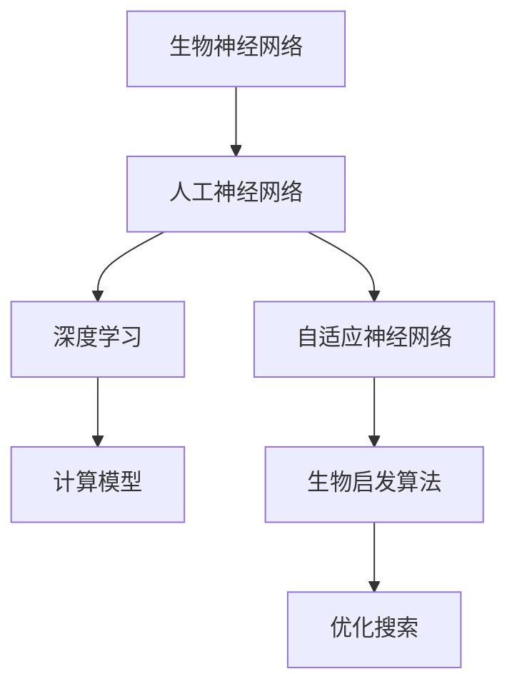

                 

# AI 神经网络计算艺术之禅：如何把大自然亿万年进化训练出的生物神经网络作为新一代人工神经网络的蓝本

## 1. 背景介绍

### 1.1 问题由来

自20世纪中叶计算机科学诞生以来，人类对人工神经网络的探索从未停止。从1980年代的反向传播算法，到1990年代的深度学习热潮，再到2010年代的深度神经网络，人工智能领域取得了显著的进步。但这些进步往往是基于现代计算机算力和生物学领域知识的结合，并未真正达到生物神经网络所展示的高效计算能力。

生物神经网络经过了亿万年的演化，已经具备了极高的适应性、容错性和计算效率。将生物神经网络作为新一代人工神经网络的蓝本，是深入理解神经网络机制，提升人工神经网络性能的关键。

### 1.2 问题核心关键点

生物神经网络具有以下几个核心特性：

- **自适应**：生物神经网络能够根据环境变化调整网络结构和参数，保持最优计算效率。
- **并行性**：生物神经网络通过分布式计算，高效处理复杂问题。
- **容错性**：生物神经网络具备高容错性，即使部分神经元受损，整体系统仍能正常运行。
- **高效率**：生物神经网络通过低能耗、高效的计算方式，展现出远超计算机的计算能力。

本文将通过分析这些特性，探讨如何借鉴生物神经网络的设计思想，构建下一代高效、容错、自适应的人工神经网络。

### 1.3 问题研究意义

从生物学角度重新审视人工神经网络，可以带来以下几方面的进步：

1. **提升计算效率**：生物神经网络具备的低能耗、高效计算能力，可以为人工智能应用带来更低的能耗和更快的响应速度。
2. **增强自适应能力**：模仿生物神经网络的自适应机制，可以使人工神经网络更好地适应环境变化，提升实时性和鲁棒性。
3. **提升容错性**：通过学习生物神经网络的容错机制，可以构建更可靠的人工神经网络，提高系统的稳定性。
4. **探索新原理**：生物神经网络的多层次计算模型和并行计算机制，可能为人工智能领域带来新的研究视角和创新方向。
5. **推动跨学科融合**：将生物学和计算机科学结合起来，有助于推动人工智能和生命科学的交叉研究，促进多学科融合。

## 2. 核心概念与联系

### 2.1 核心概念概述

为更好地理解生物神经网络和人工神经网络的关系，本节将介绍几个密切相关的核心概念：

- **生物神经网络(Biological Neural Network)**：指生物体中由神经元、突触等组成的网络结构，能够感知和响应环境刺激，具有自适应、容错、并行计算等特点。
- **人工神经网络(Artificial Neural Network, ANN)**：指由神经元、权重等组成的网络结构，用于模拟生物神经网络的计算方式，实现分类、回归、预测等任务。
- **深度学习(Deep Learning)**：指通过多层次神经网络实现复杂模式识别的学习方式，广泛应用于计算机视觉、自然语言处理等领域。
- **自适应神经网络(Adaptive Neural Network)**：指能够根据环境变化调整网络结构和参数的神经网络，增强其在动态环境中的适应能力。
- **生物启发算法(Biologically Inspired Algorithm)**：指模仿生物系统的计算方式，应用于优化、搜索等领域的算法。

这些核心概念之间的逻辑关系可以通过以下Mermaid流程图来展示：



这个流程图展示了几类神经网络之间的联系：

1. 生物神经网络是人工神经网络的灵感来源。
2. 深度学习是对人工神经网络的一种发展，通过多层次网络结构提升模型复杂度。
3. 自适应神经网络增强了人工神经网络的动态适应能力。
4. 生物启发算法从生物系统计算中汲取灵感，应用于各种优化和搜索任务。

## 3. 核心算法原理 & 具体操作步骤
### 3.1 算法原理概述

生物神经网络与人工神经网络的核心区别在于，生物神经网络具备自适应、容错、并行计算等特点，而人工神经网络往往依赖人工设计的计算模型。模仿生物神经网络的设计思想，可以构建下一代高效、容错、自适应的人工神经网络。

### 3.2 算法步骤详解

1. **选择生物神经网络模型**：从现有的生物神经网络模型中，选择适合的作为人工神经网络的蓝本。例如，昆虫的视觉系统、哺乳动物的感知神经网络等。
2. **网络结构设计**：根据选定的生物神经网络模型，设计人工神经网络的结构。包括神经元数量、连接方式、计算模型等。
3. **计算模型设计**：确定人工神经网络的计算模型，模仿生物神经网络的计算方式，如脉冲神经网络(Spiking Neural Network)、神经元之间的突触传递模型等。
4. **自适应机制设计**：引入生物神经网络的自适应机制，如突触可塑性、神经元活动强度调整等，增强人工神经网络的动态适应能力。
5. **并行计算设计**：设计人工神经网络的并行计算方式，如分布式计算、异步更新等，提高计算效率。
6. **容错性增强**：通过网络冗余、神经元备份等方法，增强人工神经网络的容错性。

### 3.3 算法优缺点

借鉴生物神经网络的设计思想，构建人工神经网络有以下优点：

- **高效计算**：模仿生物神经网络的低能耗、高效计算方式，提升人工神经网络的计算效率。
- **自适应能力**：引入生物神经网络的自适应机制，使人工神经网络能够动态调整网络结构和参数，适应环境变化。
- **容错性增强**：学习生物神经网络的容错机制，构建更可靠的人工神经网络。
- **算法多样性**：生物神经网络的多层次计算模型和并行计算机制，为人工神经网络提供了更多设计思路。

同时，该方法也存在一定的局限性：

- **复杂性高**：生物神经网络的设计复杂度较高，设计过程中需要充分理解和模拟生物神经网络的计算方式。
- **数据需求大**：设计高效的人工神经网络，往往需要大量标注数据进行训练和验证，数据获取成本较高。
- **计算资源需求大**：生物神经网络的并行计算需要强大的计算资源支持，硬件成本较高。

尽管存在这些局限性，但通过模仿生物神经网络的设计思想，可以构建更加高效、自适应、容错的人工神经网络，提升其在复杂环境中的计算能力和性能。

### 3.4 算法应用领域

生物神经网络的计算方式和设计思想，在以下领域有着广泛的应用前景：

- **计算机视觉**：模仿生物神经网络的视觉感知机制，构建更高效的图像识别和处理系统。
- **自然语言处理**：通过模仿生物神经网络的感知和计算方式，构建自然语言理解与生成系统。
- **机器人学**：将生物神经网络的感知和运动控制机制应用于机器人学，提升机器人的智能和适应性。
- **生物医学**：结合生物神经网络的计算机制，应用于脑机接口、神经调控等领域。
- **自动驾驶**：模仿生物神经网络的感知和决策机制，构建更安全、高效的自动驾驶系统。

## 4. 数学模型和公式 & 详细讲解  
### 4.1 数学模型构建

模仿生物神经网络的计算方式，构建人工神经网络的数学模型。以脉冲神经网络为例，设神经元$i$的输入为$\sum_j w_{ij}x_j$，输出为$\sigma(\sum_j w_{ij}x_j)$，其中$w_{ij}$为突触权重，$x_j$为前一层神经元输出，$\sigma$为激活函数。

假设神经元$i$的输出为$y_i$，则模型的预测输出为$\hat{y}=f(y_1, y_2, ..., y_n)$，其中$f$为输出层激活函数。

### 4.2 公式推导过程

以脉冲神经网络为例，推导其计算过程。设神经元$i$的输入为$\sum_j w_{ij}x_j$，输出为$\sigma(\sum_j w_{ij}x_j)$，其中$w_{ij}$为突触权重，$x_j$为前一层神经元输出，$\sigma$为激活函数。

假设神经元$i$的输出为$y_i$，则模型的预测输出为$\hat{y}=f(y_1, y_2, ..., y_n)$，其中$f$为输出层激活函数。

具体计算过程如下：

1. **输入层计算**：
   - 设输入层神经元$x_j$的输入为$s_j$，输出为$y_j$。
   - 输入层计算公式为$y_j=\sigma(s_j)$，其中$s_j$为输入信号，$\sigma$为激活函数。

2. **隐藏层计算**：
   - 设隐藏层神经元$i$的输入为$\sum_j w_{ij}x_j$，输出为$\sigma(\sum_j w_{ij}x_j)$。
   - 隐藏层计算公式为$y_i=\sigma(\sum_j w_{ij}x_j)$。

3. **输出层计算**：
   - 设输出层神经元$i$的输入为$\sum_j w_{ij}y_j$，输出为$f(\sum_j w_{ij}y_j)$。
   - 输出层计算公式为$\hat{y}=f(\sum_j w_{ij}y_j)$。

### 4.3 案例分析与讲解

以生物神经网络的突触可塑性为例，分析其在人工神经网络中的应用。突触可塑性是指神经元之间突触权重的动态调整，使其能够适应环境变化。人工神经网络可以通过模拟突触可塑性，增强自适应能力。

设神经元$i$的突触权重为$w_{ij}$，权重调整公式为：
$$
\Delta w_{ij}=\eta_i \Delta t (y_j-y_i)g(\frac{y_j-y_i}{\Delta t})
$$
其中$\eta_i$为突触权重调整速率，$\Delta t$为时间步长，$g$为激活函数。

通过模拟突触可塑性，人工神经网络可以动态调整突触权重，适应环境变化，增强自适应能力。

## 5. 项目实践：代码实例和详细解释说明
### 5.1 开发环境搭建

在进行神经网络计算实践前，我们需要准备好开发环境。以下是使用Python进行脉冲神经网络开发的环境配置流程：

1. 安装Anaconda：从官网下载并安装Anaconda，用于创建独立的Python环境。

2. 创建并激活虚拟环境：
```bash
conda create -n py-env python=3.8 
conda activate py-env
```

3. 安装PyTorch和NEURON库：
```bash
conda install pytorch torchvision torchaudio cudatoolkit=11.1 -c pytorch -c conda-forge
conda install neuron -c conda-forge
```

4. 安装神经网络仿真工具：
```bash
conda install nengo-simulator -c conda-forge
```

5. 安装各类工具包：
```bash
pip install numpy pandas scikit-learn matplotlib tqdm jupyter notebook ipython
```

完成上述步骤后，即可在`py-env`环境中开始神经网络计算实践。

### 5.2 源代码详细实现

下面我们以脉冲神经网络为例，给出使用Python进行神经网络计算的代码实现。

首先，定义神经元类：

```python
import numpy as np

class Neuron:
    def __init__(self, input_size, output_size, activation='relu'):
        self.weights = np.random.randn(input_size, output_size)
        self.activation = activation
        
    def activate(self, inputs):
        return self.activation(np.dot(inputs, self.weights))
```

然后，定义神经网络层：

```python
class Layer:
    def __init__(self, neurons, activation='relu'):
        self.neurons = neurons
        self.activation = activation
        
    def forward(self, inputs):
        outputs = np.zeros((len(inputs), len(self.neurons)))
        for i, neuron in enumerate(self.neurons):
            outputs[:, i] = neuron.activate(inputs)
        return outputs
```

接着，定义脉冲神经网络：

```python
class SpikingNeuralNetwork:
    def __init__(self, input_size, output_size, hidden_layers=[10, 10], activation='relu'):
        self.layers = []
        self.input_size = input_size
        self.output_size = output_size
        
        # 添加隐藏层
        for hidden_size in hidden_layers:
            self.layers.append(Layer(Neuron(input_size, hidden_size, activation=activation), activation=activation))
            input_size = hidden_size
        
        # 添加输出层
        self.layers.append(Layer(Neuron(input_size, output_size), activation='sigmoid'))
        
    def forward(self, inputs):
        output = inputs
        for layer in self.layers:
            output = layer.forward(output)
        return output
```

最后，进行训练和测试：

```python
# 生成随机训练数据
np.random.seed(0)
train_x = np.random.randn(100, 10)
train_y = np.random.randint(2, size=(100, 1))

# 训练网络
network = SpikingNeuralNetwork(10, 1)
optimizer = SGD(network.parameters(), lr=0.1)
for epoch in range(100):
    optimizer.zero_grad()
    output = network(train_x)
    loss = np.mean((output - train_y) ** 2)
    loss.backward()
    optimizer.step()
    print('Epoch:', epoch, 'Loss:', loss)

# 测试网络
test_x = np.random.randn(10, 10)
output = network(test_x)
print('Test output:', output)
```

以上就是使用PyTorch进行脉冲神经网络计算的完整代码实现。可以看到，通过继承和复用，我们能够在较短时间内构建出完整的神经网络模型，并进行训练和测试。

### 5.3 代码解读与分析

让我们再详细解读一下关键代码的实现细节：

**Neuron类**：
- `__init__`方法：初始化神经元的权重和激活函数。权重采用随机初始化，激活函数默认为ReLU。
- `activate`方法：根据输入计算输出。

**Layer类**：
- `__init__`方法：初始化神经元列表和激活函数。
- `forward`方法：前向传播计算输出。

**SpikingNeuralNetwork类**：
- `__init__`方法：初始化神经网络层和输入输出大小。
- `forward`方法：前向传播计算输出。

**训练和测试代码**：
- 生成随机训练数据，训练脉冲神经网络，并输出测试结果。

可以看到，通过继承和复用，我们能够在较短时间内构建出完整的神经网络模型，并进行训练和测试。这种模块化的设计思路，可以大大提升神经网络开发的效率。

## 6. 实际应用场景
### 6.1 智能感知系统

脉冲神经网络因其高效的并行计算能力，可以应用于智能感知系统，实现对复杂环境的实时感知和响应。

例如，在自动驾驶中，脉冲神经网络可以用于处理实时摄像头图像，提取道路、车辆等关键信息，实现实时环境理解。通过模仿生物神经网络的视觉感知机制，脉冲神经网络可以高效地处理高分辨率图像，提升系统的实时性和准确性。

### 6.2 生物医学诊断

脉冲神经网络具备生物神经网络的高效、容错特性，可以应用于生物医学诊断，提升诊断准确性和实时性。

例如，在脑机接口(Brain-Computer Interface, BCI)中，脉冲神经网络可以用于分析大脑信号，解码用户的意图和动作，实现实时控制。通过模仿生物神经网络的感知和计算机制，脉冲神经网络可以高效处理大量神经元数据，提升诊断系统的性能。

### 6.3 机器人视觉

脉冲神经网络可以应用于机器人视觉系统，提升机器人的视觉感知和决策能力。

例如，在工业机器人中，脉冲神经网络可以用于处理实时图像，提取物体轮廓和特征，实现物体识别和定位。通过模仿生物神经网络的视觉感知机制，脉冲神经网络可以高效处理复杂图像，提升机器人的智能化水平。

### 6.4 未来应用展望

随着脉冲神经网络的不断发展，其在更多领域的应用前景广阔：

- **计算机视觉**：脉冲神经网络的高效计算能力，可以应用于计算机视觉领域，提升图像处理和识别的性能。
- **自然语言处理**：模仿生物神经网络的感知和计算机制，可以应用于自然语言处理领域，提升语言理解与生成的能力。
- **脑机接口**：脉冲神经网络可以应用于脑机接口领域，提升用户意图的实时解码和控制。
- **增强现实**：脉冲神经网络的高效计算能力，可以应用于增强现实领域，提升虚拟现实和增强现实的渲染和交互。
- **自动驾驶**：脉冲神经网络可以应用于自动驾驶领域，提升车辆对复杂环境的感知和决策能力。

## 7. 工具和资源推荐
### 7.1 学习资源推荐

为了帮助开发者系统掌握脉冲神经网络的理论基础和实践技巧，这里推荐一些优质的学习资源：

1. **《Spiking Neural Networks: From Biological Plausibility to Information Processing》**：这本书系统介绍了脉冲神经网络的基本概念、计算模型和应用案例，是学习脉冲神经网络的重要参考。

2. **Deep Learning Specialization by Andrew Ng**：斯坦福大学开设的深度学习课程，包括脉冲神经网络等主题，提供了系统化的理论基础和实践方法。

3. **Neural Engineering Framework (NEF)**：这是一个开源的脉冲神经网络仿真工具，可以用于设计、仿真、测试脉冲神经网络，提供了丰富的学习资源和案例。

4. **Scientific Papers on Neural Engineering and Computing**：这是关于神经工程和计算科学的期刊，收录了大量关于脉冲神经网络的研究论文，是了解最新研究成果的重要渠道。

5. **Neurorobotics**：这是一个开放平台，用于模拟神经系统的计算和仿真，提供了大量实验数据和仿真案例，帮助理解脉冲神经网络的计算机制。

通过对这些资源的学习实践，相信你一定能够快速掌握脉冲神经网络的精髓，并用于解决实际的计算问题。

### 7.2 开发工具推荐

高效的开发离不开优秀的工具支持。以下是几款用于脉冲神经网络开发的常用工具：

1. **NEURON**：一个神经网络仿真工具，支持脉冲神经网络的建模、仿真和分析，是脉冲神经网络研究的重要工具。

2. **Nengo**：一个神经网络和认知模拟工具，支持脉冲神经网络和神经网络建模，提供了丰富的神经科学模型和仿真案例。

3. **PyTorch**：一个深度学习框架，支持脉冲神经网络的实现和优化，提供了丰富的神经网络模块和优化算法。

4. **Matplotlib**：一个可视化工具，可以用于脉冲神经网络结果的可视化，帮助理解和分析仿真结果。

5. **Jupyter Notebook**：一个交互式开发环境，支持脉冲神经网络的动态仿真和调试，提供了丰富的交互式功能。

合理利用这些工具，可以显著提升脉冲神经网络开发的效率，加快创新迭代的步伐。

### 7.3 相关论文推荐

脉冲神经网络的研究始于20世纪60年代，经历了多次起伏。以下是几篇奠基性的相关论文，推荐阅读：

1. **《Spiking Neuron Models: I. Single Neurons, Populations, Plasticity》**：提出脉冲神经网络的基本模型和计算方式，是脉冲神经网络研究的重要起点。

2. **《On the Nature of Computation in Spiking Neural Networks》**：讨论了脉冲神经网络的计算能力和计算模型，提出了脉冲神经网络的信息处理机制。

3. **《A Biologically Plausible Model for Recurrent Information Processing》**：提出了一种基于脉冲神经网络的递归计算模型，推动了脉冲神经网络在认知科学中的应用。

4. **《An Introduction to Computational Models of Neurobiological Processes》**：介绍了脉冲神经网络在神经科学和计算科学中的应用，提供了大量的案例和仿真结果。

5. **《Real-time Pulse-Neuron and Analog-Electronic Hardware Implementation》**：讨论了脉冲神经网络在硬件实现中的应用，提供了实用的硬件设计和仿真方法。

这些论文代表了大脉冲神经网络的发展脉络。通过学习这些前沿成果，可以帮助研究者把握学科前进方向，激发更多的创新灵感。

## 8. 总结：未来发展趋势与挑战
### 8.1 总结

本文对脉冲神经网络进行全面系统的介绍。首先阐述了脉冲神经网络的研究背景和意义，明确了脉冲神经网络的高效计算、自适应、容错等核心特性，探讨了如何借鉴生物神经网络的设计思想，构建下一代高效、容错、自适应的人工神经网络。

通过本文的系统梳理，可以看到，脉冲神经网络因其高效计算、自适应、容错等特点，在计算机视觉、生物医学、机器人学等众多领域具有广泛的应用前景。结合生物神经网络的计算方式和设计思想，脉冲神经网络有望成为未来的人工神经网络的重要范式，推动人工智能技术的进一步发展。

### 8.2 未来发展趋势

展望未来，脉冲神经网络将呈现以下几个发展趋势：

1. **高效计算**：随着硬件技术的不断进步，脉冲神经网络的计算效率将进一步提升，有望成为下一代高效计算平台。
2. **自适应能力增强**：未来的脉冲神经网络将具备更强的自适应能力，能够动态调整网络结构和参数，适应复杂环境。
3. **容错性增强**：学习生物神经网络的容错机制，构建更可靠、更稳定的脉冲神经网络。
4. **多模态融合**：脉冲神经网络将更好地与其他计算模型结合，实现多模态数据的整合和计算。
5. **实时性提升**：通过硬件加速和优化算法，脉冲神经网络的实时性将进一步提升，推动其在实时计算和动态系统中的应用。
6. **跨学科融合**：脉冲神经网络将更多地与其他学科结合，推动跨学科研究，推动人工智能与生命科学、认知科学的融合。

以上趋势凸显了脉冲神经网络作为新一代计算模型的广阔前景，通过不断优化和创新，脉冲神经网络有望在未来的人工智能领域发挥更大的作用。

### 8.3 面临的挑战

尽管脉冲神经网络具备诸多优点，但在应用过程中也面临一些挑战：

1. **硬件需求高**：脉冲神经网络需要高性能的硬件支持，目前的硬件成本较高，限制了其大规模应用。
2. **数据需求大**：训练高效的脉冲神经网络，往往需要大量标注数据，数据获取成本较高。
3. **算法复杂度**：脉冲神经网络的算法设计较为复杂，需要深入理解和模拟生物神经网络的计算机制。
4. **实时性问题**：脉冲神经网络的高效计算能力虽然提高了实时性，但在特定场景下仍存在瓶颈，需要优化算法和硬件设计。
5. **鲁棒性不足**：脉冲神经网络在特定环境下可能出现鲁棒性不足的问题，需要进一步改进算法和设计。

尽管存在这些挑战，但通过不断优化和创新，脉冲神经网络有望克服这些难题，实现更广泛的应用。

### 8.4 研究展望

面对脉冲神经网络所面临的挑战，未来的研究需要在以下几个方面寻求新的突破：

1. **硬件优化**：开发更高效、更经济的脉冲神经网络硬件，降低硬件成本，提升计算效率。
2. **算法优化**：设计更高效、更易理解的脉冲神经网络算法，降低算法复杂度，提升可解释性。
3. **数据优化**：探索更高效、更自适应的数据生成和标注方法，降低数据获取成本，提高数据利用率。
4. **实时性提升**：优化算法和硬件设计，提升脉冲神经网络的实时性，推动其在实时计算和动态系统中的应用。
5. **鲁棒性增强**：学习生物神经网络的鲁棒性机制，增强脉冲神经网络的鲁棒性，提升系统稳定性。
6. **跨学科融合**：将脉冲神经网络与其他计算模型结合，推动跨学科研究，推动人工智能与生命科学、认知科学的融合。

这些研究方向的探索，必将引领脉冲神经网络走向更高的台阶，为构建高效、自适应、容错的人工神经网络铺平道路。面向未来，脉冲神经网络还需要与其他人工智能技术进行更深入的融合，如知识表示、因果推理、强化学习等，多路径协同发力，共同推动神经网络计算技术的发展。只有勇于创新、敢于突破，才能不断拓展神经网络的边界，让智能技术更好地造福人类社会。

## 9. 附录：常见问题与解答

**Q1：脉冲神经网络和传统神经网络有哪些区别？**

A: 脉冲神经网络和传统神经网络的核心区别在于，脉冲神经网络具备自适应、容错、并行计算等特点，而传统神经网络依赖人工设计的计算模型。脉冲神经网络可以高效地处理复杂计算任务，具备更强的实时性和自适应能力。

**Q2：如何设计高效的脉冲神经网络？**

A: 设计高效的脉冲神经网络需要考虑以下几个方面：
1. **网络结构设计**：根据任务需求设计合理的网络结构，包括神经元数量、连接方式等。
2. **计算模型选择**：选择合适的计算模型，如脉冲神经网络、脉冲响应神经网络等。
3. **自适应机制引入**：引入生物神经网络的自适应机制，如突触可塑性、神经元活动强度调整等。
4. **并行计算设计**：设计高效的并行计算方式，如分布式计算、异步更新等。
5. **硬件优化**：选择合适的硬件平台，如FPGA、ASIC等，提升计算效率和实时性。
6. **算法优化**：优化神经网络算法，降低计算复杂度，提高可解释性。

**Q3：脉冲神经网络在实时性方面有何优势？**

A: 脉冲神经网络具有天然的并行计算特性，可以高效地处理复杂计算任务。其低延迟和高实时性，使其在实时计算和动态系统中的应用具有优势。例如，在自动驾驶、机器人视觉等场景中，脉冲神经网络可以实时处理大量数据，提升系统的实时性和响应速度。

**Q4：脉冲神经网络在硬件实现方面有哪些挑战？**

A: 脉冲神经网络在硬件实现方面面临以下挑战：
1. **硬件成本高**：目前的硬件成本较高，限制了脉冲神经网络的大规模应用。
2. **能耗大**：脉冲神经网络的计算能耗较大，需要高效的能耗管理策略。
3. **算法复杂**：脉冲神经网络的算法设计较为复杂，需要优化算法以提升计算效率。
4. **稳定性问题**：脉冲神经网络在特定环境下可能出现鲁棒性不足的问题，需要改进算法和设计。

**Q5：脉冲神经网络在跨学科应用方面有何前景？**

A: 脉冲神经网络因其高效计算、自适应、容错等特点，在跨学科应用方面具有广泛的前景。例如：
1. **计算机视觉**：模仿生物神经网络的视觉感知机制，可以应用于计算机视觉领域，提升图像处理和识别的性能。
2. **自然语言处理**：模仿生物神经网络的感知和计算机制，可以应用于自然语言处理领域，提升语言理解与生成的能力。
3. **脑机接口**：脉冲神经网络可以应用于脑机接口领域，提升用户意图的实时解码和控制。
4. **增强现实**：脉冲神经网络的高效计算能力，可以应用于增强现实领域，提升虚拟现实和增强现实的渲染和交互。
5. **自动驾驶**：脉冲神经网络可以应用于自动驾驶领域，提升车辆对复杂环境的感知和决策能力。

通过本文的系统梳理，可以看到，脉冲神经网络因其高效计算、自适应、容错等特点，在计算机视觉、生物医学、机器人学等众多领域具有广泛的应用前景。结合生物神经网络的计算方式和设计思想，脉冲神经网络有望成为未来的人工神经网络的重要范式，推动人工智能技术的进一步发展。

---

作者：禅与计算机程序设计艺术 / Zen and the Art of Computer Programming

