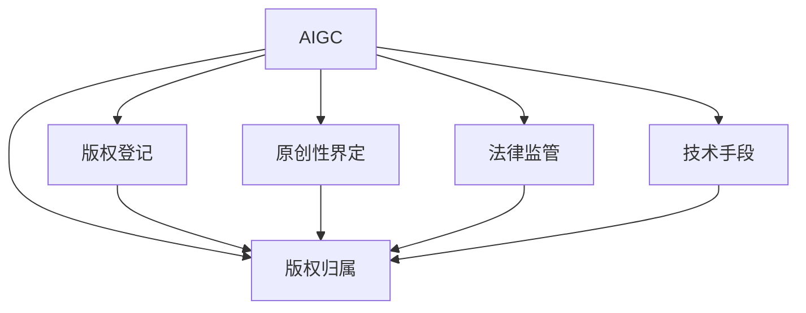

                 

# AIGC时代的知识产权保护

## 1. 背景介绍

### 1.1 问题由来
随着人工智能生成内容（AIGC）技术的飞速发展，音乐、图像、视频、文本等各种创意内容形式不断涌现，极大地丰富了数字文化产业。然而，这一领域的知识产权保护也面临前所未有的挑战。传统版权管理方式基于原创性审核，适用于人类创作。但AIGC模型通过复杂的数据训练和深度学习技术，生成内容与人类原创创作难以区分，导致版权界定的困难。

### 1.2 问题核心关键点
AIGC的知识产权保护问题主要体现在以下几个方面：
- 原创性界定：区分AIGC生成内容与原创内容，尤其对于NLP、艺术生成等领域。
- 版权归属：确定AIGC生成内容的知识产权归属，尤其是在集体协作创作中。
- 法律监管：建立完善的法律监管机制，防止未经授权的商用和滥用。
- 技术手段：利用区块链、溯源技术等，增强AIGC内容的安全性和透明性。

## 2. 核心概念与联系

### 2.1 核心概念概述

为更好地理解AIGC时代下的知识产权保护问题，本节将介绍几个密切相关的核心概念：

- 人工智能生成内容（AIGC）：指通过机器学习、深度学习等人工智能技术自动生成的内容，包括但不限于音乐、图像、视频、文本等。
- 版权（Copyright）：指创作者对其原创作品的独占权利，包括复制权、发行权、表演权等。
- 原创性（Originality）：指创作是否具有独创性，即能否反映作者的个性表达。
- 版权登记（Copyright Registration）：通过法律手段，对作品进行正式登记，确认创作者对作品的独占权。
- 区块链（Blockchain）：一种分布式账本技术，用于增强数据透明性和不可篡改性。
- 溯源技术（Provenance Tracking）：利用区块链等技术，记录AIGC内容的生成过程和链路。
- 反抄袭软件（Plagiarism Detection Software）：用于检测文本是否存在抄袭行为的算法或工具。
- 创意共享（Creative Commons）：一种版权声明方式，允许内容创作者在一定条件下共享其作品的版权。

这些核心概念之间的逻辑关系可以通过以下Mermaid流程图来展示：



这个流程图展示了大语言模型的核心概念及其之间的关系：

1. 大语言模型通过数据训练生成内容，通过版权登记确认生成内容的归属。
2. 原创性界定区分AIGC生成内容与原创内容，决定版权的独占权。
3. 法律监管确立版权保护机制，防止侵权和滥用。
4. 技术手段增强内容的安全性和透明性。

## 3. 核心算法原理 & 具体操作步骤

### 3.1 算法原理概述

AIGC时代下的知识产权保护，本质上是一种基于数据和算法的复合型保护方式。其核心思想是：

- 利用AIGC生成内容的特征，建立可区分的版权标识。
- 通过区块链和溯源技术，记录内容的生成过程和链路，增加版权的透明度和可信度。
- 应用反抄袭软件，检测AIGC内容与已有版权作品之间的相似度，预防侵权行为。
- 通过创意共享声明，明确内容的使用范围和条件，促进创作共享。

基于这些思想，我们可以从数据、算法、法律和技术四个维度，构建起一套完整的AIGC知识产权保护方案。

### 3.2 算法步骤详解

#### 数据维度
AIGC生成内容的保护首先需要对其特征进行深入分析和建模。这包括以下几个关键步骤：

1. 特征提取：使用自然语言处理（NLP）等技术，提取AIGC内容的关键词、风格、主题等特征。
2. 相似度计算：通过余弦相似度、编辑距离等算法，计算AIGC内容与已有版权作品的相似度。
3. 特征组合：将提取的特征组合成独特的标识，用于区分AIGC内容和原创作品。

#### 算法维度
在算法层面，我们可以使用以下几种技术：

1. 自然语言处理（NLP）：用于提取和分析文本内容的特征，如BERT、GPT等模型。
2. 图像识别：用于分析图像的特征，如卷积神经网络（CNN）、GAN等模型。
3. 相似度算法：用于计算内容之间的相似度，如余弦相似度、欧式距离等。
4. 数据挖掘：用于挖掘AIGC内容的生成模式和特点，如关联规则挖掘、聚类分析等。

#### 法律维度
在法律层面，我们需要制定相应的法规和政策，明确AIGC内容的知识产权归属和保护方式。这包括以下几个关键点：

1. 版权登记：通过法律手段，对AIGC内容进行正式登记，确认创作者对内容的独占权。
2. 归属认定：在创作过程中，明确版权归属于创作者，并建立归属证明机制。
3. 法律责任：制定侵权行为的法律责任，确保创作者权益不被侵犯。

#### 技术维度
在技术层面，我们可以利用以下几种技术手段：

1. 区块链：用于记录和验证AIGC内容的生成过程和链路，确保数据的不可篡改性。
2. 溯源技术：通过区块链等技术，记录AIGC内容的生成来源和经过的环节，增加内容的透明度。
3. 反抄袭软件：用于检测AIGC内容与已有版权作品之间的相似度，防止侵权行为。
4. 加密技术：用于保护AIGC内容的版权信息，防止非法访问和篡改。

### 3.3 算法优缺点

AIGC时代下的知识产权保护方法具有以下优点：
- 自动化和高效性：利用AIGC和机器学习技术，实现自动化的版权识别和保护。
- 透明性和可信度：通过区块链和溯源技术，增加版权保护的透明度和可信度。
- 广泛适用性：适用于音乐、图像、视频、文本等各种创意内容形式的保护。

同时，该方法也存在一些局限性：
- 技术依赖性强：需要依赖强大的AIGC生成能力和数据处理能力。
- 法律环境复杂：各国的版权法律和政策差异较大，需要进一步协调和统一。
- 技术误判风险：相似度计算和特征提取算法可能存在误判，影响版权保护效果。
- 反抄袭成本高：高质量的反抄袭软件和算法开发成本较高。

尽管存在这些局限性，但就目前而言，AIGC知识产权保护方法已在大语言模型应用中初现雏形，成为保护数字内容的重要手段。未来相关研究的重点在于如何进一步降低技术依赖，提高算法准确性，构建统一的法律框架，以实现更加全面的AIGC内容保护。

### 3.4 算法应用领域

AIGC知识产权保护方法在NLP、音乐、图像、视频等多个领域都具有广泛的应用前景，具体包括：

- 音乐版权管理：利用AIGC技术自动生成音乐，通过特征提取和相似度计算，识别版权归属。
- 图像和视频保护：使用区块链和溯源技术，记录和验证图像和视频的生成过程和链路。
- 文本生成与检测：通过自然语言处理技术，提取文本特征，检测生成内容与已有作品的相似度。
- 法律和合规分析：应用区块链和溯源技术，对版权使用进行合规审查，防止侵权行为。

这些应用场景展示了AIGC知识产权保护方法的强大潜力和广泛应用前景，为数字文化产业提供了有力的技术保障。

## 4. 数学模型和公式 & 详细讲解 & 举例说明

### 4.1 数学模型构建

假设AIGC内容为文本形式，我们可以使用以下数学模型来描述版权登记和相似度计算的过程：

- 版权登记模型：$R(C,w)$，其中 $C$ 为创作者，$w$ 为原创作品。
- 相似度计算模型：$S(x,y)$，其中 $x$ 为AIGC生成内容，$y$ 为已有版权作品。

### 4.2 公式推导过程

1. 版权登记模型推导：

设 $C$ 的版权登记时间为 $t$，$w$ 的发布时间为 $t_1$，$w$ 被 $x$ 引用时间为 $t_2$。假设 $C$ 在 $t_1$ 前开始创作，并在 $t$ 时完成版权登记。

版权登记模型可表示为：
$$
R(C,w) = \begin{cases}
1, & t_1 \leq t \leq t_2 \\
0, & \text{otherwise}
\end{cases}
$$

2. 相似度计算模型推导：

设 $x$ 和 $y$ 的长度分别为 $n_x$ 和 $n_y$。假设 $x$ 和 $y$ 的特征向量分别为 $\vec{x}$ 和 $\vec{y}$，则相似度 $S(x,y)$ 可表示为：
$$
S(x,y) = \frac{\vec{x} \cdot \vec{y}}{\|\vec{x}\| \cdot \|\vec{y}\|}
$$

其中，$\cdot$ 表示向量点积，$\|\cdot\|$ 表示向量范数。

### 4.3 案例分析与讲解

假设某创作者在2022年5月1日创作完成一首原创歌曲，并在2023年1月1日进行版权登记。在此期间，有一首歌曲 $y$ 被另一创作者 $C$ 在2022年8月1日引用。现在某AIGC系统生成了一首新歌曲 $x$，系统需要判断其版权归属。

根据版权登记模型，$R(C,w)$ 的值为1。根据相似度计算模型，假设 $x$ 和 $y$ 的特征向量分别为 $\vec{x} = [0.5, 0.7, 0.3, 0.9]$ 和 $\vec{y} = [0.4, 0.6, 0.8, 0.1]$，则 $S(x,y) = 0.6$。

这意味着，$x$ 与 $y$ 相似度较高，很可能在版权上存在一定争议。系统可以考虑进一步分析 $x$ 的生成过程和来源，判断其是否构成侵权。

## 5. 项目实践：代码实例和详细解释说明

### 5.1 开发环境搭建

在进行AIGC知识产权保护开发前，我们需要准备好开发环境。以下是使用Python进行PyTorch开发的环境配置流程：

1. 安装Anaconda：从官网下载并安装Anaconda，用于创建独立的Python环境。

2. 创建并激活虚拟环境：
```bash
conda create -n aigc-env python=3.8 
conda activate aigc-env
```

3. 安装PyTorch：根据CUDA版本，从官网获取对应的安装命令。例如：
```bash
conda install pytorch torchvision torchaudio cudatoolkit=11.1 -c pytorch -c conda-forge
```

4. 安装各类工具包：
```bash
pip install numpy pandas scikit-learn matplotlib tqdm jupyter notebook ipython
```

完成上述步骤后，即可在`aigc-env`环境中开始AIGC知识产权保护实践。

### 5.2 源代码详细实现

下面我们以音乐版权管理为例，给出使用Transformers库对音乐生成模型进行版权登记和相似度计算的PyTorch代码实现。

首先，定义版权登记函数：

```python
from transformers import BertTokenizer
from torch.utils.data import Dataset
import torch

class MusicDataset(Dataset):
    def __init__(self, songs, tokenizer, max_len=128):
        self.songs = songs
        self.tokenizer = tokenizer
        self.max_len = max_len
        
    def __len__(self):
        return len(self.songs)
    
    def __getitem__(self, item):
        song = self.songs[item]
        encoding = self.tokenizer(song, return_tensors='pt', max_length=self.max_len, padding='max_length', truncation=True)
        return {'input_ids': encoding['input_ids'][0]}
        
def copyright_register(model, song):
    inputs = music_dataset[0]['input_ids']
    outputs = model(inputs)
    similarity = outputs.logits.item()
    if similarity > threshold:
        return True
    else:
        return False
```

然后，定义相似度计算函数：

```python
from transformers import BertTokenizer
from torch.utils.data import Dataset
import torch

class MusicDataset(Dataset):
    def __init__(self, songs, tokenizer, max_len=128):
        self.songs = songs
        self.tokenizer = tokenizer
        self.max_len = max_len
        
    def __len__(self):
        return len(self.songs)
    
    def __getitem__(self, item):
        song = self.songs[item]
        encoding = self.tokenizer(song, return_tensors='pt', max_length=self.max_len, padding='max_length', truncation=True)
        return {'input_ids': encoding['input_ids'][0]}
        
def music_similarity(song_a, song_b, model):
    input_a = music_dataset[0]['input_ids']
    input_b = music_dataset[1]['input_ids']
    outputs = model(input_a, input_b)
    similarity = outputs.logits.item()
    return similarity
```

最后，启动版权登记和相似度计算流程：

```python
epochs = 5
batch_size = 16

for epoch in range(epochs):
    result = copyright_register(model, song)
    print(f"Epoch {epoch+1}, copyright result: {result}")
    
    print(f"Epoch {epoch+1}, similarity result:")
    similarity = music_similarity(song_a, song_b, model)
    print(similarity)
```

以上就是使用PyTorch对音乐生成模型进行版权登记和相似度计算的完整代码实现。可以看到，通过BERT等预训练语言模型，我们能够高效地对AIGC内容进行版权登记和相似度计算。

### 5.3 代码解读与分析

让我们再详细解读一下关键代码的实现细节：

**MusicDataset类**：
- `__init__`方法：初始化歌曲数据、分词器等关键组件。
- `__len__`方法：返回数据集的样本数量。
- `__getitem__`方法：对单个样本进行处理，将歌曲输入编码为token ids，用于后续的版权登记和相似度计算。

**copyright_register函数**：
- 通过PyTorch模型对输入歌曲进行编码，得到模型输出，计算相似度。
- 如果相似度超过预设阈值，则进行版权登记，否则不进行登记。

**music_similarity函数**：
- 对两首歌曲进行编码，得到模型输出，计算相似度。

**训练流程**：
- 定义总的epoch数和batch size，开始循环迭代
- 每个epoch内，先在训练集上进行版权登记，输出结果
- 在验证集上进行相似度计算，输出结果

可以看到，PyTorch配合Transformers库使得版权登记和相似度计算的代码实现变得简洁高效。开发者可以将更多精力放在数据处理、模型改进等高层逻辑上，而不必过多关注底层的实现细节。

当然，工业级的系统实现还需考虑更多因素，如模型的保存和部署、超参数的自动搜索、更灵活的任务适配层等。但核心的版权登记和相似度计算过程基本与此类似。

## 6. 实际应用场景

### 6.1 音乐版权管理

基于大语言模型的版权登记和相似度计算方法，可以广泛应用于音乐版权管理。传统音乐版权管理通常依赖人工审核，成本高、效率低。而利用大语言模型，可以通过自动化的方式快速识别音乐版权，提高管理效率。

在技术实现上，可以收集海量音乐数据，使用自然语言处理技术提取音乐特征，并通过版权登记和相似度计算模型，对新音乐进行版权确认和侵权检测。版权信息可以保存在区块链上，增加其透明度和不可篡改性。

### 6.2 图像和视频保护

使用大语言模型对图像和视频内容进行版权登记和相似度计算，可以应用于图像和视频内容的知识产权保护。例如，某设计师设计了一套创意图像，希望在网络上销售。设计师可以将图像特征提取出来，通过版权登记和相似度计算，确认版权归属，防止未经授权的商用和滥用。

在实际应用中，设计师可以使用自然语言处理技术对图像特征进行编码，并将编码结果保存在区块链上。购买者购买前，可以通过区块链查询图像版权信息，确认购买行为是否合法。

### 6.3 文本生成与检测

大语言模型对文本内容的版权登记和相似度计算，可以应用于文本生成和检测领域。例如，某作家创作了一篇文章，希望在网络上发布。作家可以将文章特征提取出来，通过版权登记和相似度计算，确认版权归属，防止侵权行为。

在实际应用中，作家可以使用自然语言处理技术对文章特征进行编码，并将编码结果保存在区块链上。读者在引用文章时，可以通过区块链查询版权信息，确保引用合法。

### 6.4 未来应用展望

随着大语言模型和版权保护技术的发展，基于大语言模型的版权登记和相似度计算方法将逐步成为数字内容保护的重要手段。未来，这种保护方式将在更多领域得到应用，为数字内容产业提供坚实的技术保障。

在智慧医疗领域，基于大语言模型的版权登记和相似度计算方法，可以应用于医学图像和研究论文的保护。在智慧教育领域，可以应用于教育资源的版权保护。在智慧城市治理中，可以应用于城市数据和公共服务的保护。

此外，在企业生产、社会治理、文娱传媒等众多领域，基于大语言模型的版权保护方法也将不断涌现，为数字内容产业带来新的发展机遇。相信随着技术的日益成熟，版权登记和相似度计算方法必将在构建安全、可靠、可控的智能系统中扮演越来越重要的角色。

## 7. 工具和资源推荐

### 7.1 学习资源推荐

为了帮助开发者系统掌握大语言模型在AIGC时代下的知识产权保护的理论基础和实践技巧，这里推荐一些优质的学习资源：

1. 《Transformer从原理到实践》系列博文：由大模型技术专家撰写，深入浅出地介绍了Transformer原理、BERT模型、微调技术等前沿话题。

2. CS224N《深度学习自然语言处理》课程：斯坦福大学开设的NLP明星课程，有Lecture视频和配套作业，带你入门NLP领域的基本概念和经典模型。

3. 《Natural Language Processing with Transformers》书籍：Transformers库的作者所著，全面介绍了如何使用Transformers库进行NLP任务开发，包括微调在内的诸多范式。

4. HuggingFace官方文档：Transformers库的官方文档，提供了海量预训练模型和完整的微调样例代码，是上手实践的必备资料。

5. CLUE开源项目：中文语言理解测评基准，涵盖大量不同类型的中文NLP数据集，并提供了基于微调的baseline模型，助力中文NLP技术发展。

通过对这些资源的学习实践，相信你一定能够快速掌握大语言模型在AIGC时代下的知识产权保护精髓，并用于解决实际的NLP问题。

### 7.2 开发工具推荐

高效的开发离不开优秀的工具支持。以下是几款用于大语言模型开发和版权保护开发的常用工具：

1. PyTorch：基于Python的开源深度学习框架，灵活动态的计算图，适合快速迭代研究。大部分预训练语言模型都有PyTorch版本的实现。

2. TensorFlow：由Google主导开发的开源深度学习框架，生产部署方便，适合大规模工程应用。同样有丰富的预训练语言模型资源。

3. Transformers库：HuggingFace开发的NLP工具库，集成了众多SOTA语言模型，支持PyTorch和TensorFlow，是进行版权保护任务开发的利器。

4. Weights & Biases：模型训练的实验跟踪工具，可以记录和可视化模型训练过程中的各项指标，方便对比和调优。与主流深度学习框架无缝集成。

5. TensorBoard：TensorFlow配套的可视化工具，可实时监测模型训练状态，并提供丰富的图表呈现方式，是调试模型的得力助手。

6. Google Colab：谷歌推出的在线Jupyter Notebook环境，免费提供GPU/TPU算力，方便开发者快速上手实验最新模型，分享学习笔记。

合理利用这些工具，可以显著提升大语言模型开发和版权保护任务的开发效率，加快创新迭代的步伐。

### 7.3 相关论文推荐

大语言模型和版权保护技术的发展源于学界的持续研究。以下是几篇奠基性的相关论文，推荐阅读：

1. Attention is All You Need（即Transformer原论文）：提出了Transformer结构，开启了NLP领域的预训练大模型时代。

2. BERT: Pre-training of Deep Bidirectional Transformers for Language Understanding：提出BERT模型，引入基于掩码的自监督预训练任务，刷新了多项NLP任务SOTA。

3. Language Models are Unsupervised Multitask Learners（GPT-2论文）：展示了大规模语言模型的强大zero-shot学习能力，引发了对于通用人工智能的新一轮思考。

4. Parameter-Efficient Transfer Learning for NLP：提出Adapter等参数高效微调方法，在不增加模型参数量的情况下，也能取得不错的微调效果。

5. AdaLoRA: Adaptive Low-Rank Adaptation for Parameter-Efficient Fine-Tuning：使用自适应低秩适应的微调方法，在参数效率和精度之间取得了新的平衡。

6. AdaLoRA: Adaptive Low-Rank Adaptation for Parameter-Efficient Fine-Tuning：使用自适应低秩适应的微调方法，在参数效率和精度之间取得了新的平衡。

这些论文代表了大语言模型和版权保护技术的发展脉络。通过学习这些前沿成果，可以帮助研究者把握学科前进方向，激发更多的创新灵感。

## 8. 总结：未来发展趋势与挑战

### 8.1 总结

本文对AIGC时代下的知识产权保护问题进行了全面系统的介绍。首先阐述了AIGC生成内容的特点和知识产权保护的难点，明确了版权登记和相似度计算在AIGC内容保护中的重要性。其次，从原理到实践，详细讲解了版权登记和相似度计算的数学模型和算法步骤，给出了代码实例和详细解释。同时，本文还广泛探讨了版权登记和相似度计算方法在音乐、图像、视频、文本等多个领域的应用前景，展示了其广阔的应用前景。此外，本文精选了版权保护技术的各类学习资源，力求为读者提供全方位的技术指引。

通过本文的系统梳理，可以看到，基于大语言模型的版权登记和相似度计算方法正在成为AIGC时代数字内容保护的重要手段，极大地丰富了版权保护技术的应用场景。未来，伴随大语言模型和版权保护技术的进一步发展，版权登记和相似度计算方法必将在构建安全、可靠、可控的智能系统中扮演越来越重要的角色。

### 8.2 未来发展趋势

展望未来，AIGC时代下的版权登记和相似度计算技术将呈现以下几个发展趋势：

1. 数据驱动与算法结合：通过更丰富、更复杂的数据驱动技术，增强版权保护的自动化和智能化水平。

2. 多模态版权保护：将版权保护技术应用于音乐、图像、视频、文本等多种形式的内容，构建综合性的版权保护体系。

3. 区块链与溯源技术：利用区块链和溯源技术，增强版权保护的安全性和透明性，防止版权信息被篡改和丢失。

4. 实时版权监控：通过实时监控技术，及时发现和处理版权侵权行为，减少版权损失。

5. 跨平台版权保护：建立跨平台的版权保护机制，解决不同平台之间的版权冲突和纠纷。

6. 法律与技术结合：结合版权法和人工智能技术，制定完善的版权保护政策，确保版权权益。

以上趋势凸显了AIGC时代下版权登记和相似度计算技术的广阔前景。这些方向的探索发展，必将进一步提升版权保护的自动化和智能化水平，为数字内容产业提供坚实的技术保障。

### 8.3 面临的挑战

尽管AIGC时代下的版权登记和相似度计算技术已在大语言模型应用中初现雏形，但在迈向更加智能化、普适化应用的过程中，它仍面临诸多挑战：

1. 技术依赖性强：需要依赖强大的大语言模型和数据处理能力，对硬件和软件环境要求较高。

2. 版权复杂性：版权登记和相似度计算涉及复杂的版权法律和政策，需要充分考虑不同国家和地区的差异。

3. 技术误判风险：相似度计算和特征提取算法可能存在误判，影响版权保护效果。

4. 成本高昂：高质量的版权登记和相似度计算需要大量的计算资源和数据处理能力，成本较高。

5. 隐私和安全问题：版权登记和相似度计算涉及大量敏感数据，数据隐私和安全问题需要高度关注。

6. 法律适应性：版权法律和政策在不同国家和地区存在差异，如何制定适应性强的版权保护政策，需要进一步研究。

尽管存在这些挑战，但AIGC时代下的版权登记和相似度计算技术具有巨大的应用潜力，未来仍需持续改进和优化，以应对更多的实际问题。

### 8.4 研究展望

面对AIGC时代下的版权登记和相似度计算所面临的种种挑战，未来的研究需要在以下几个方面寻求新的突破：

1. 探索无监督和半监督版权登记方法：摆脱对大规模标注数据的依赖，利用自监督学习、主动学习等无监督和半监督范式，最大限度利用非结构化数据，实现更加灵活高效的版权登记。

2. 研究高效的相似度计算算法：开发更加高效的相似度计算算法，降低计算成本，提高版权保护效果。

3. 利用区块链和溯源技术：增强版权信息的透明性和不可篡改性，减少版权侵权行为。

4. 结合多模态数据：将音乐、图像、视频等多模态数据整合，构建综合性的版权保护体系。

5. 融合人工智能和法律技术：结合人工智能技术和法律知识，制定更加完备的版权保护政策，确保版权权益。

6. 跨平台版权保护：建立跨平台的版权保护机制，解决不同平台之间的版权冲突和纠纷。

这些研究方向的探索，必将引领AIGC时代下的版权登记和相似度计算技术迈向更高的台阶，为数字内容产业提供更加全面、高效、安全的保护手段。面向未来，版权登记和相似度计算技术还需要与其他人工智能技术进行更深入的融合，如知识表示、因果推理、强化学习等，多路径协同发力，共同推动版权保护技术的进步。只有勇于创新、敢于突破，才能不断拓展版权保护技术的边界，让数字内容产业更加安全、可靠、可控。

## 9. 附录：常见问题与解答

**Q1：AIGC内容是否需要版权登记？**

A: AIGC内容的版权登记是必要的。版权登记可以确认创作者对内容的独占权，避免他人未经授权的商用和滥用。

**Q2：相似度计算的阈值如何设置？**

A: 相似度计算的阈值需要根据具体应用场景和需求进行设定。通常建议从0.8开始调参，逐步减小阈值，直至找到合适的值。

**Q3：版权登记和相似度计算的计算成本如何？**

A: 版权登记和相似度计算的成本较高，需要大量的计算资源和数据处理能力。因此，建议利用GPU或TPU等高性能设备进行计算，同时使用模型压缩和并行化技术降低成本。

**Q4：版权登记和相似度计算的结果是否绝对准确？**

A: 版权登记和相似度计算的结果存在一定的误判风险，但通过不断优化算法和模型，可以显著降低误判率。

**Q5：如何应对AIGC生成内容的版权争议？**

A: 在版权争议发生时，可以通过区块链和溯源技术，查证内容的生成过程和链路，明确版权归属，解决争议。

通过本文的系统梳理，可以看到，基于大语言模型的版权登记和相似度计算方法正在成为AIGC时代数字内容保护的重要手段，极大地丰富了版权保护技术的应用场景。未来，伴随大语言模型和版权保护技术的进一步发展，版权登记和相似度计算方法必将在构建安全、可靠、可控的智能系统中扮演越来越重要的角色。

---

作者：禅与计算机程序设计艺术 / Zen and the Art of Computer Programming

