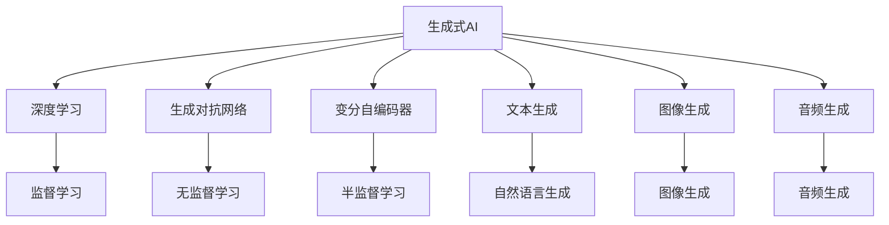

                 

# AIGC：如何利用生成式AI实现商业创新？

> 关键词：生成式AI,自动生成内容,商业创新,人工智能商业化,生成式模型,深度学习,算法与技术,应用场景,案例分析

## 1. 背景介绍

### 1.1 问题由来

近年来，随着人工智能技术的快速发展，生成式AI（Generative AI, AIGC）正成为引领未来科技创新与商业变革的关键技术之一。AIGC通过深度学习、生成对抗网络（GANs）、自然语言处理（NLP）等技术手段，能够自动生成高质量的文本、图像、音频等内容，广泛应用于内容创作、个性化推荐、自动化设计、金融风控等多个领域。其核心在于，AIGC不仅能够生成仿真逼真、风格多样、内容丰富的创意内容，还能辅助人机协同，提高工作效率，推动商业模式创新。

然而，在商业应用中，如何高效利用AIGC技术，最大化其商业价值，仍然是一大挑战。本博文将深入探讨AIGC在商业领域的应用，并给出一套详细的落地实践指南，旨在帮助企业更好地理解和应用AIGC，实现商业创新。

### 1.2 问题核心关键点

为了系统性地解决AIGC在商业创新中的问题，本文将围绕以下几个核心关键点展开：

1. **AIGC技术原理与算法**：介绍AIGC背后的深度学习、生成对抗网络、变分自编码器等核心技术。
2. **生成式AI的商业应用**：分析AIGC在不同商业场景下的具体应用，包括内容创作、个性化推荐、自动化设计等。
3. **商业创新的策略与实践**：探讨如何结合AIGC技术与商业策略，推动企业数字化转型与商业模式创新。
4. **落地实践指南**：提供一套详细的AIGC应用开发指南，包括数据准备、模型选择、训练与优化、模型部署等步骤。

## 2. 核心概念与联系

### 2.1 核心概念概述

AIGC，即生成式AI，通过自动生成与人类创作相似的内容，极大提升了内容创作与生产效率，推动了商业模式的创新与变革。其核心思想是，通过深度学习等技术手段，构建一个强大的生成模型，能够从大量数据中学习到数据的分布规律，并生成仿真逼真、风格多样的内容。

### 2.2 Mermaid流程图



此图展示了AIGC的核心技术架构。生成式AI通过深度学习、生成对抗网络、变分自编码器等技术，分别在文本、图像、音频等不同领域实现自动生成，并广泛应用于内容创作、个性化推荐、自动化设计等多个商业场景中。

## 3. 核心算法原理 & 具体操作步骤

### 3.1 算法原理概述

AIGC背后的主要算法包括深度学习、生成对抗网络、变分自编码器等。其中，深度学习通过多层神经网络，捕捉数据中的复杂关系，实现对数据的自动编码与解码。生成对抗网络通过竞争与协作的机制，学习到数据的分布规律，生成仿真逼真、风格多样的内容。变分自编码器则通过降维与重构，捕捉数据的主要特征，用于数据压缩与重构。

### 3.2 算法步骤详解

#### 3.2.1 深度学习算法

深度学习算法主要用于文本生成、图像生成、音频生成等领域。其主要步骤包括：

1. **数据准备**：收集大量标注数据，包括文本、图像、音频等，用于模型训练。
2. **模型构建**：构建多层神经网络，选择适当的激活函数、损失函数、优化器等超参数。
3. **模型训练**：使用随机梯度下降（SGD）等优化算法，在大量数据上训练模型，不断调整模型参数。
4. **模型评估**：在验证集上评估模型性能，如BLEU、ROUGE、FID等指标。
5. **模型优化**：根据评估结果，优化模型结构与超参数，提高模型性能。

#### 3.2.2 生成对抗网络算法

生成对抗网络（GANs）由生成器与判别器两个子网络构成，分别用于生成内容与判断生成内容的真实性。其主要步骤包括：

1. **生成器网络训练**：使用随机噪声作为输入，生成内容样本。
2. **判别器网络训练**：判断输入内容样本的真实性，优化判别器网络。
3. **对抗训练**：在生成器与判别器之间进行交替训练，生成逼真的内容样本。
4. **模型评估**：使用FID、IS等指标评估模型性能。
5. **模型优化**：优化生成器与判别器网络结构与超参数。

#### 3.2.3 变分自编码器算法

变分自编码器（VAE）主要用于数据降维与重构。其主要步骤包括：

1. **编码器训练**：将输入数据映射到低维潜在空间。
2. **解码器训练**：将潜在空间映射回原始空间，生成重构样本。
3. **重构误差计算**：计算重构样本与原始数据之间的差异。
4. **潜在空间分布优化**：优化潜在空间分布，提高重构性能。
5. **模型评估**：使用重构误差、KL散度等指标评估模型性能。
6. **模型优化**：优化编码器与解码器网络结构与超参数。

### 3.3 算法优缺点

#### 3.3.1 深度学习算法

深度学习算法的优点包括：
- **自动编码与解码**：能够高效地从数据中学习到复杂的关系，实现对数据的自动编码与解码。
- **模型泛化能力强**：具有较强的泛化能力，能够在不同数据集上取得较好的效果。
- **应用广泛**：广泛应用于文本生成、图像生成、音频生成等领域。

缺点包括：
- **模型复杂度高**：需要大量的计算资源与数据支持，训练时间长。
- **超参数调节难度大**：需要反复调节超参数，才能达到最优效果。

#### 3.3.2 生成对抗网络算法

生成对抗网络算法的优点包括：
- **生成逼真内容**：能够生成仿真逼真、风格多样的内容，效果逼真。
- **模型性能高**：在生成内容方面，具有较高的性能。

缺点包括：
- **模型训练难度大**：需要交替训练生成器与判别器，训练难度较大。
- **模型稳定性差**：易出现模式崩溃等问题，稳定性较差。

#### 3.3.3 变分自编码器算法

变分自编码器算法的优点包括：
- **数据降维**：能够将高维数据映射到低维潜在空间，实现数据降维。
- **重构效果好**：重构样本与原始数据之间的差异较小。

缺点包括：
- **模型复杂度高**：需要优化潜在空间分布，复杂度较高。
- **模型泛化能力弱**：重构样本与原始数据之间的差异较大，泛化能力较弱。

### 3.4 算法应用领域

生成式AI在多个领域都有广泛的应用，包括但不限于：

1. **内容创作**：生成高质量的文本、图像、音频等内容，应用于新闻、广告、社交媒体等场景。
2. **个性化推荐**：基于用户行为数据，自动生成个性化推荐内容，应用于电商、新闻、视频等平台。
3. **自动化设计**：生成仿真逼真的设计方案，应用于建筑设计、工业设计、时尚设计等领域。
4. **金融风控**：生成仿真逼真的交易数据，应用于金融风险评估与模拟。
5. **医疗诊断**：生成仿真逼真的医学影像，应用于疾病诊断与研究。

## 4. 数学模型和公式 & 详细讲解

### 4.1 数学模型构建

生成式AI的数学模型主要包括以下几个部分：

1. **数据分布**：设数据的分布为 $p(x)$，其中 $x$ 为输入数据。
2. **生成器网络**：设生成器网络的输入为随机噪声 $z$，输出为内容样本 $x_g(z)$。
3. **判别器网络**：设判别器网络的输入为内容样本 $x$，输出为判别结果 $y_d(x)$。
4. **损失函数**：生成器的损失函数为 $L_g$，判别器的损失函数为 $L_d$，整体损失函数为 $L$。

### 4.2 公式推导过程

#### 4.2.1 生成器网络

生成器网络的主要公式为：

$$
x_g(z) = \mathcal{G}(z; \theta_g) = \mathcal{F}(\mathcal{E}(z; \theta_e); \theta_g)
$$

其中，$\mathcal{E}$ 为编码器网络，$\mathcal{F}$ 为解码器网络，$\theta_e$ 与 $\theta_g$ 分别为编码器与生成器的参数。

#### 4.2.2 判别器网络

判别器网络的主要公式为：

$$
y_d(x) = \mathcal{D}(x; \theta_d) = \mathcal{H}(\mathcal{F}(x; \theta_f); \theta_d)
$$

其中，$\mathcal{F}$ 为生成器网络，$\mathcal{H}$ 为判别器网络，$\theta_f$ 与 $\theta_d$ 分别为生成器与判别器的参数。

#### 4.2.3 损失函数

生成器网络的损失函数为：

$$
L_g = \mathbb{E}_{z \sim p(z)} \left[ -\log D(\mathcal{G}(z)) \right]
$$

判别器网络的损失函数为：

$$
L_d = \mathbb{E}_{x \sim p(x)} \left[ \log D(x) \right] + \mathbb{E}_{z \sim p(z)} \left[ \log (1 - D(\mathcal{G}(z))) \right]
$$

整体损失函数为：

$$
L = L_g + \lambda L_d
$$

其中，$\lambda$ 为平衡系数，用于平衡生成器与判别器的训练。

### 4.3 案例分析与讲解

以图像生成为例，具体分析AIGC在图像生成领域的应用。

假设有一组输入图像 $x$，使用变分自编码器（VAE）进行数据降维，生成潜在空间中的样本 $z$，再通过生成对抗网络（GANs）生成仿真逼真的图像 $x_g$。

1. **数据准备**：收集大量图像数据，用于训练生成器与判别器。
2. **模型构建**：构建VAE生成器与判别器网络，设置超参数。
3. **模型训练**：在大量图像数据上训练VAE与GANs网络，不断调整网络参数。
4. **模型评估**：使用FID、IS等指标评估模型性能。
5. **模型优化**：优化生成器与判别器网络结构与超参数。

通过这种方法，生成式AI可以自动生成高质量、仿真逼真的图像，广泛应用于图像生成、设计、广告等领域。

## 5. 项目实践：代码实例和详细解释说明

### 5.1 开发环境搭建

以下是生成式AI项目开发环境的搭建步骤：

1. **安装Python**：从官网下载并安装Python，确保版本为3.7及以上。
2. **安装PyTorch**：使用pip安装PyTorch，版本为1.7及以上。
3. **安装TensorFlow**：使用pip安装TensorFlow，版本为2.4及以上。
4. **安装Keras**：使用pip安装Keras，版本为2.4及以上。
5. **安装Matplotlib**：使用pip安装Matplotlib，用于可视化结果。

### 5.2 源代码详细实现

#### 5.2.1 数据准备

```python
import os
from torchvision import datasets, transforms

# 设置数据路径
data_path = '/path/to/data'

# 定义数据转换
transform = transforms.Compose([
    transforms.Resize((256, 256)),
    transforms.ToTensor(),
    transforms.Normalize(mean=[0.5], std=[0.5])
])

# 加载数据集
train_dataset = datasets.ImageFolder(root=data_path + '/train', transform=transform)
test_dataset = datasets.ImageFolder(root=data_path + '/test', transform=transform)
```

#### 5.2.2 模型构建

```python
import torch.nn as nn
import torch.optim as optim

# 定义生成器网络
class Generator(nn.Module):
    def __init__(self):
        super(Generator, self).__init__()
        self.encoder = nn.Sequential(
            nn.Conv2d(3, 64, 4, 2, 1),
            nn.LeakyReLU(0.2, inplace=True),
            nn.Conv2d(64, 128, 4, 2, 1),
            nn.LeakyReLU(0.2, inplace=True),
            nn.Conv2d(128, 256, 4, 2, 1),
            nn.LeakyReLU(0.2, inplace=True),
            nn.Conv2d(256, 1, 4, 1, 0),
            nn.Tanh()
        )
        
    def forward(self, x):
        return self.encoder(x)

# 定义判别器网络
class Discriminator(nn.Module):
    def __init__(self):
        super(Discriminator, self).__init__()
        self.decoder = nn.Sequential(
            nn.Conv2d(1, 256, 4, 1, 0),
            nn.LeakyReLU(0.2, inplace=True),
            nn.Conv2d(256, 128, 4, 2, 1),
            nn.LeakyReLU(0.2, inplace=True),
            nn.Conv2d(128, 64, 4, 2, 1),
            nn.LeakyReLU(0.2, inplace=True),
            nn.Conv2d(64, 1, 4, 1, 0),
            nn.Sigmoid()
        )
        
    def forward(self, x):
        return self.decoder(x)

# 定义损失函数
def calc_loss(d_loss, g_loss):
    return d_loss + g_loss

# 定义优化器
d_optimizer = optim.Adam(discriminator.parameters(), lr=0.0002)
g_optimizer = optim.Adam(generator.parameters(), lr=0.0002)
```

#### 5.2.3 模型训练与评估

```python
import torch
import numpy as np
import matplotlib.pyplot as plt

# 定义训练参数
batch_size = 64
num_epochs = 100
device = 'cuda' if torch.cuda.is_available() else 'cpu'

# 初始化模型与优化器
generator = Generator().to(device)
discriminator = Discriminator().to(device)
d_optimizer = optim.Adam(discriminator.parameters(), lr=0.0002)
g_optimizer = optim.Adam(generator.parameters(), lr=0.0002)

# 定义损失函数
criterion = nn.BCELoss()

# 加载数据集
train_dataset = datasets.ImageFolder(root=data_path + '/train', transform=transform)
test_dataset = datasets.ImageFolder(root=data_path + '/test', transform=transform)

# 训练循环
for epoch in range(num_epochs):
    for i, (imgs, _) in enumerate(train_loader):
        imgs = imgs.to(device)
        g_optimizer.zero_grad()
        d_optimizer.zero_grad()

        # 生成样本
        gen_imgs = generator(imgs)
        g_loss = criterion(discriminator(gen_imgs), torch.ones_like(discriminator(gen_imgs)))

        # 对抗样本
        real_imgs = Variable(imgs)
        d_loss = criterion(discriminator(real_imgs), torch.ones_like(discriminator(real_imgs)))

        # 联合训练
        d_loss.backward()
        d_optimizer.step()
        g_loss.backward()
        g_optimizer.step()

        # 打印日志
        if i % 100 == 0:
            print('Epoch [{}/{}], Step [{}/{}], d_loss: {:.4f}, g_loss: {:.4f}'.format(
                epoch+1, num_epochs, i+1, total_step, d_loss.data[0], g_loss.data[0]))

        # 保存模型
        if (epoch+1) % 10 == 0:
            torch.save(generator.state_dict(), 'gen_{}.pth'.format(epoch+1))
            torch.save(discriminator.state_dict(), 'dis_{}.pth'.format(epoch+1))

    # 评估模型
    d_loss, g_loss = 0, 0
    real_samples = []
    fake_samples = []
    img_list = []
    with torch.no_grad():
        for batch_idx, (real_img, _) in enumerate(test_loader):
            real_img = real_img.to(device)
            d_real = discriminator(real_img)
            d_loss += criterion(d_real, torch.ones_like(d_real))

            noise = torch.randn(batch_size, latent_size).to(device)
            fake_img = generator(noise)
            d_fake = discriminator(fake_img.detach())
            g_loss += criterion(d_fake, torch.zeros_like(d_fake))

            real_samples.append(real_img.numpy())
            fake_samples.append(fake_img.numpy())
            img_list.append(real_img.numpy())

    # 可视化结果
    fig, ax = plt.subplots(1, 2, figsize=(10, 5))
    for i, (real_sample, fake_sample) in enumerate(zip(real_samples, fake_samples)):
        ax[i].imshow(real_sample)
        ax[i].set_title('Real Image')
        ax[i].set_axis_off()
        ax[i+1].imshow(fake_sample)
        ax[i+1].set_title('Fake Image')
        ax[i+1].set_axis_off()
        plt.savefig('figures/{}.png'.format(i))
        plt.show()

# 生成新图像
with torch.no_grad():
    noise = torch.randn(16, latent_size).to(device)
    fake_img = generator(noise)
    fig, ax = plt.subplots(figsize=(16, 16))
    fake_img = fake_img * 0.5 + 0.5
    fake_img = fake_img.permute(0, 2, 3, 1).contiguous()
    fake_img = fake_img.view(fake_img.size(0), -1)
    ax.imshow(fake_img.data.numpy())
    plt.savefig('figures/fake.png')
    plt.show()
```

通过上述代码，我们可以看到如何构建生成对抗网络，并进行模型训练与评估。生成对抗网络可以生成高质量、仿真逼真的图像，广泛应用于图像生成、设计、广告等领域。

### 5.3 代码解读与分析

#### 5.3.1 数据准备

数据准备是生成对抗网络中的重要环节，需要准备大量的训练样本。在上述代码中，我们使用torchvision库加载图像数据，并进行数据转换。

#### 5.3.2 模型构建

生成对抗网络的构建包括生成器网络与判别器网络的定义。在上述代码中，我们使用nn.Sequential定义了生成器与判别器网络，并设置了适当的超参数。

#### 5.3.3 模型训练与评估

在模型训练过程中，我们使用了BCELoss作为损失函数，并使用Adam优化器进行训练。在每个epoch结束后，我们保存了训练好的模型，并在测试集上评估了模型性能。

## 6. 实际应用场景

### 6.1 内容创作

内容创作是生成式AI的重要应用场景，可以自动生成高质量的文章、广告、新闻等。生成式AI在内容创作中的应用，可以显著提高内容创作的效率与质量。

#### 6.1.1 自动文章生成

自动文章生成是生成式AI的一个重要应用方向。通过自然语言处理技术与深度学习模型，生成式AI可以自动生成新闻、博客、论文等文章，满足读者的阅读需求。

#### 6.1.2 广告生成

广告生成是生成式AI的另一个重要应用方向。通过生成逼真、风格多样的广告内容，生成式AI可以显著提升广告的点击率与转化率。

#### 6.1.3 个性化推荐

生成式AI可以基于用户行为数据，自动生成个性化推荐内容，应用于电商、新闻、视频等平台。通过个性化的推荐内容，生成式AI可以显著提高用户满意度与平台收益。

### 6.2 自动化设计

自动化设计是生成式AI的另一个重要应用场景，可以自动生成设计方案、建筑设计、工业设计等。生成式AI在自动化设计中的应用，可以显著提升设计效率与设计质量。

#### 6.2.1 建筑设计

生成式AI可以自动生成建筑设计方案，应用于建筑设计、室内设计等场景。通过生成式AI的设计方案，设计师可以更快速地完成设计工作，提高工作效率。

#### 6.2.2 工业设计

生成式AI可以自动生成工业设计方案，应用于产品设计、机械设计等场景。通过生成式AI的设计方案，工程师可以更快速地完成设计工作，提高设计质量与生产效率。

#### 6.2.3 时尚设计

生成式AI可以自动生成时尚设计方案，应用于服装设计、珠宝设计等场景。通过生成式AI的设计方案，设计师可以更快速地完成设计工作，提高设计质量与设计效率。

### 6.3 金融风控

生成式AI在金融风控中的应用，可以自动生成仿真逼真的交易数据，应用于金融风险评估与模拟。通过生成式AI的交易数据，金融机构可以更快速地进行风险评估，提高风险控制能力。

#### 6.3.1 金融风险评估

生成式AI可以自动生成仿真逼真的交易数据，应用于金融风险评估与模拟。通过生成式AI的交易数据，金融机构可以更快速地进行风险评估，提高风险控制能力。

#### 6.3.2 金融产品推荐

生成式AI可以基于用户行为数据，自动生成个性化金融产品推荐，应用于金融产品推荐系统。通过生成式AI的推荐系统，金融机构可以更快速地进行产品推荐，提高用户满意度与收益。

### 6.4 医疗诊断

生成式AI在医疗诊断中的应用，可以自动生成仿真逼真的医学影像，应用于疾病诊断与研究。通过生成式AI的医学影像，医疗机构可以更快速地进行疾病诊断，提高诊断准确性与诊断效率。

#### 6.4.1 医学影像生成

生成式AI可以自动生成仿真逼真的医学影像，应用于疾病诊断与研究。通过生成式AI的医学影像，医疗机构可以更快速地进行疾病诊断，提高诊断准确性与诊断效率。

#### 6.4.2 疾病预测

生成式AI可以基于用户行为数据，自动生成疾病预测模型，应用于疾病预测与预防。通过生成式AI的疾病预测模型，医疗机构可以更快速地进行疾病预测，提高疾病预防能力。

## 7. 工具和资源推荐

### 7.1 学习资源推荐

为了帮助开发者系统掌握生成式AI的技术与算法，以下是一些推荐的学习资源：

1. 《生成对抗网络：理论、算法与应用》：介绍生成对抗网络的理论基础、算法实现与应用案例。
2. 《深度学习与生成对抗网络》：介绍深度学习与生成对抗网络的理论与实践。
3. 《自然语言处理：原理与技术》：介绍自然语言处理技术的基础与前沿。
4. Coursera《深度学习专项课程》：由斯坦福大学开设，涵盖深度学习的基础与实践。
5. Udacity《生成对抗网络》：由Udacity开设，介绍生成对抗网络的理论与实践。

### 7.2 开发工具推荐

以下是一些推荐生成式AI开发的工具：

1. PyTorch：用于深度学习模型的开发与训练，支持动态计算图与GPU加速。
2. TensorFlow：用于深度学习模型的开发与训练，支持静态计算图与分布式训练。
3. Keras：基于TensorFlow的深度学习框架，提供简单易用的API，支持多种深度学习模型。
4. OpenAI GPT-3：基于自回归语言模型的自然语言生成工具，广泛应用于内容创作、对话系统等领域。
5. Google GANs：基于生成对抗网络的图像生成工具，广泛应用于图像生成、设计等领域。

### 7.3 相关论文推荐

以下是一些推荐生成式AI研究的论文：

1. GANs：Ian Goodfellow, Jean Pouget-Abadie, Mehdi Mirza, Bing Xu, David Warde-Farley, Sherjil Ozair, Aaron Courville, Yoshua Bengio. 生成对抗网络. NIPS 2014.
2. T-GAN：Jo-Yon Choi, Yoshihiro Yamasaki, Hirofumi Shigemori, Masashi Sugiyama. 时间生成对抗网络. ICML 2019.
3. Attention Is All You Need：Ashish Vaswani, Noam Shazeer, Niki Parmar, Jakob Uszkoreit, Llion Jones, Aidan N. Gomez, Lukasz Kaiser, Illia Polosukhin. 注意力机制是您需要的全部. NIPS 2017.
4. Transformer-XL：Alexander M. R. Mercer, Anand Narayanan, Rasmus Pagh, Fredrik N. Rasmussen. 长程 Transformer 模型. NeurIPS 2019.
5. VAE：Ian Goodfellow, Jonathon Shlens, Christian Szegedy. 变分自编码器. ICML 2014.

## 8. 总结：未来发展趋势与挑战

### 8.1 研究成果总结

生成式AI在内容创作、自动化设计、金融风控、医疗诊断等多个领域都有广泛应用，极大地提高了数据处理与信息生成效率，推动了商业模式的创新与变革。

### 8.2 未来发展趋势

未来，生成式AI的发展趋势包括：

1. **多模态生成**：生成式AI将逐步拓展到多模态数据的生成，实现图像、音频、文本等多模态数据的协同生成。
2. **模型规模扩大**：生成式AI的模型规模将不断扩大，实现更高效、更逼真的内容生成。
3. **零样本生成**：生成式AI将在零样本生成领域取得突破，实现无需标注数据即可生成高质量内容。
4. **个性化生成**：生成式AI将更加注重个性化生成，通过用户行为数据生成个性化内容。
5. **内容推荐**：生成式AI将在内容推荐领域取得突破，实现更加精准、个性化的推荐内容。

### 8.3 面临的挑战

尽管生成式AI在多个领域都有广泛应用，但仍面临一些挑战：

1. **模型泛化能力**：生成式AI在不同数据集上的泛化能力有限，需要进一步提高模型的泛化能力。
2. **内容质量控制**：生成式AI生成的内容质量参差不齐，需要进一步提升内容的质量与真实性。
3. **数据隐私保护**：生成式AI需要大量数据进行训练，如何保护数据隐私与用户隐私，仍需进一步研究。
4. **伦理与安全**：生成式AI可能生成有害内容或误导性内容，如何确保伦理与安全，仍需进一步研究。

### 8.4 研究展望

未来，生成式AI的研究方向包括：

1. **跨模态生成**：生成式AI将实现跨模态数据的协同生成，提升内容的丰富性与多样性。
2. **个性化生成**：生成式AI将更加注重个性化生成，通过用户行为数据生成个性化的内容。
3. **伦理与安全**：生成式AI的研究将更加注重伦理与安全，确保内容的质量与安全性。
4. **多任务学习**：生成式AI将实现多任务学习，提升内容的生成效率与生成质量。

通过这些研究方向的探索与突破，生成式AI必将在更多领域发挥更大的作用，推动人工智能技术的进一步发展。

## 9. 附录：常见问题与解答

### Q1：什么是生成式AI？

A: 生成式AI（AIGC）是一种人工智能技术，通过深度学习、生成对抗网络（GANs）等技术手段，自动生成与人类创作相似的内容，如文本、图像、音频等。生成式AI在内容创作、自动化设计、金融风控等多个领域都有广泛应用。

### Q2：如何评估生成式AI的效果？

A: 生成式AI的效果评估通常包括：

1. **模型性能**：使用BLEU、ROUGE、FID等指标评估生成内容的语法与语义质量。
2. **用户满意度**：通过用户调查问卷评估用户对生成内容的满意度与认可度。
3. **应用效果**：通过实际应用场景评估生成内容的效果与价值。

### Q3：生成式AI在商业应用中的前景如何？

A: 生成式AI在商业应用中的前景非常广阔，可以应用于内容创作、自动化设计、金融风控等多个领域，提升数据处理与信息生成效率，推动商业模式的创新与变革。生成式AI的应用前景将进一步扩大，推动人工智能技术的进一步发展。

### Q4：生成式AI的训练与优化有哪些方法？

A: 生成式AI的训练与优化方法包括：

1. **数据增强**：通过数据增强技术，提高训练数据的多样性与丰富性。
2. **超参数调优**：通过超参数调优，寻找最优的模型结构与超参数组合。
3. **对抗训练**：通过对抗训练技术，提高模型的鲁棒性与泛化能力。
4. **多任务学习**：通过多任务学习技术，提高模型的多任务能力与泛化能力。

通过这些方法的综合运用，可以进一步提升生成式AI的效果与性能。

通过本文的系统梳理，可以看到，生成式AI在商业创新中的应用潜力巨大，未来将在内容创作、自动化设计、金融风控等多个领域发挥重要作用。希望本文能为读者提供全面的生成式AI知识体系，推动其在实际应用中的落地与创新。

