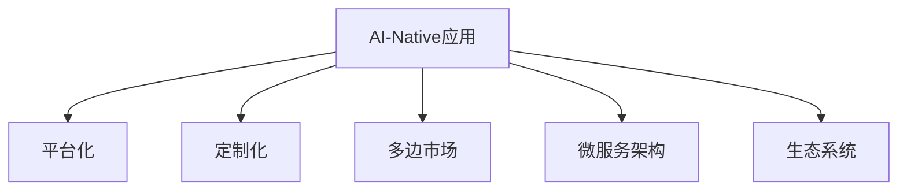

                 

# AI-Native应用的商业模式创新

> 关键词：AI-Native应用, 人工智能商业化, 应用服务, 平台化商业模式, 定制化解决方案, 多边市场, 微服务架构, 生态系统

## 1. 背景介绍

### 1.1 问题由来

近年来，随着人工智能技术的迅猛发展，AI-Native应用（即基于人工智能的解决方案）在各个行业中得到了广泛应用。AI-Native应用能够利用人工智能的优势，提升业务流程的效率和精度，创造出新的商业价值。然而，如何将AI-Native应用成功地商业化，却成为了一个重要的挑战。传统软件开发模式和商业模式往往难以适应AI-Native应用的高复杂度、高定制化需求，同时也无法充分发挥人工智能技术的优势。因此，本文将重点探讨AI-Native应用的商业模式创新，旨在为AI-Native应用的商业化提供一个全面的视角。

### 1.2 问题核心关键点

AI-Native应用的商业模式创新需要从多个层面进行深入思考：

1. **平台化与定制化：**如何在提供灵活定制化的同时，实现高效的开发和维护。
2. **多边市场：**如何构建一个生态系统，吸引多方参与者，共同创造价值。
3. **微服务架构：**如何通过模块化的设计，提高系统的可扩展性和维护性。
4. **数据与算法：**如何在商业化过程中，平衡数据安全与算法创新。

本文将围绕这些关键点，深入探讨AI-Native应用的商业模式创新。

## 2. 核心概念与联系

### 2.1 核心概念概述

为了更好地理解AI-Native应用的商业模式创新，我们先介绍几个核心概念：

1. **AI-Native应用：**即基于人工智能技术的应用，包括机器学习、深度学习、自然语言处理等技术的应用。
2. **平台化：**通过构建一个统一的平台，提供多种服务和资源，降低单个应用的开发和维护成本。
3. **定制化：**根据用户的具体需求，提供个性化的解决方案，满足不同的业务需求。
4. **多边市场：**通过构建一个多方参与的生态系统，各方互利共赢，共同创造价值。
5. **微服务架构：**将大型系统拆分成多个小模块，每个模块独立运行，提高系统的可扩展性和维护性。
6. **生态系统：**通过构建一个包含应用开发者、用户、数据提供商等多方参与的生态系统，形成良性循环。

这些核心概念之间存在密切的联系，共同构成了AI-Native应用的商业模式创新框架。

### 2.2 核心概念原理和架构的 Mermaid 流程图



通过这个流程图，我们可以看出，AI-Native应用在平台化、定制化、多边市场、微服务架构和生态系统的相互支撑下，形成了一个完整的商业模式创新体系。

## 3. 核心算法原理 & 具体操作步骤

### 3.1 算法原理概述

AI-Native应用的商业模式创新主要涉及以下几个方面的算法原理：

1. **需求分析算法：**用于理解用户的需求，为定制化提供依据。
2. **算法优化算法：**通过优化算法，提高AI-Native应用的性能和效率。
3. **多边市场算法：**构建多边市场模型，分析各方需求，形成良性循环。
4. **微服务架构设计算法：**设计微服务架构，提高系统的可扩展性和维护性。

这些算法原理在实际操作中需要紧密结合，形成一套完整的商业模式创新解决方案。

### 3.2 算法步骤详解

AI-Native应用的商业模式创新大致可以分为以下步骤：

1. **需求分析：**通过调研和分析，理解用户的具体需求和业务场景，为后续定制化提供依据。
2. **平台搭建：**构建一个统一的平台，提供多种服务和资源，降低单个应用的开发和维护成本。
3. **定制化实现：**根据用户的具体需求，实现定制化的AI-Native应用，满足不同的业务需求。
4. **多边市场构建：**构建一个多方参与的生态系统，各方互利共赢，共同创造价值。
5. **微服务架构设计：**将大型系统拆分成多个小模块，每个模块独立运行，提高系统的可扩展性和维护性。
6. **生态系统维护：**持续维护生态系统，吸引更多参与者，保持系统活力。

### 3.3 算法优缺点

AI-Native应用的商业模式创新具有以下优点：

1. **降低开发成本：**通过平台化，降低了单个应用的开发和维护成本。
2. **提高效率和精度：**通过AI-Native技术的应用，提升业务流程的效率和精度。
3. **满足定制化需求：**通过定制化，满足不同用户的具体需求。
4. **构建多边市场：**通过多边市场，各方互利共赢，共同创造价值。
5. **提高可扩展性：**通过微服务架构设计，提高系统的可扩展性和维护性。

同时，这种商业模式也存在一些缺点：

1. **依赖技术：**对技术的要求较高，需要具备一定的技术实力和资源投入。
2. **用户需求复杂：**用户需求多样化，需要持续投入资源进行定制化开发。
3. **生态系统构建：**多边市场的构建需要时间和资源，且需要持续维护。
4. **数据与算法：**在商业化过程中，需要平衡数据安全与算法创新，面临一定的风险。

### 3.4 算法应用领域

AI-Native应用的商业模式创新在以下领域具有广泛的应用前景：

1. **医疗健康：**通过AI-Native应用，提高医疗诊断的准确性和效率，提升患者体验。
2. **金融服务：**通过AI-Native应用，实现智能投顾、风险控制等功能，提升金融服务水平。
3. **零售电商：**通过AI-Native应用，实现个性化推荐、库存管理等功能，提升零售电商的运营效率。
4. **智能制造：**通过AI-Native应用，实现预测性维护、智能排程等功能，提升制造企业的生产效率。
5. **智慧城市：**通过AI-Native应用，实现交通管理、公共安全等功能，提升城市治理水平。

## 4. 数学模型和公式 & 详细讲解 & 举例说明

### 4.1 数学模型构建

AI-Native应用的商业模式创新涉及到多个领域的数学模型，以下以医疗健康领域的智能诊断系统为例，构建数学模型。

设智能诊断系统为 $S$，输入为患者数据 $D$，输出为诊断结果 $R$。设患者数据为 $x_1, x_2, \ldots, x_n$，诊断结果为 $y_1, y_2, \ldots, y_n$。则模型 $S$ 的输入输出映射为：

$$
S: D \rightarrow R
$$

### 4.2 公式推导过程

通过机器学习算法，我们可以构建一个预测模型 $f$，使得 $f(D) = R$。假设 $f$ 是一个线性回归模型，则：

$$
f(D) = \theta^T D
$$

其中 $\theta$ 为模型参数。通过最小化均方误差损失函数，可以得到 $\theta$ 的解：

$$
\hat{\theta} = \mathop{\arg\min}_{\theta} \frac{1}{N} \sum_{i=1}^N (y_i - f(x_i))^2
$$

### 4.3 案例分析与讲解

以医疗健康领域的智能诊断系统为例，我们可以分析其商业模式创新的关键点：

1. **需求分析算法：**通过调研和分析，理解患者的具体症状和历史数据，为模型提供依据。
2. **算法优化算法：**通过优化算法，提高模型的准确性和鲁棒性。
3. **多边市场算法：**构建医生、患者、保险公司等多方参与的生态系统，共同创造价值。
4. **微服务架构设计算法：**将诊断系统拆分为多个模块，如症状分析、诊断模型、结果输出等，提高系统的可扩展性和维护性。

## 5. 项目实践：代码实例和详细解释说明

### 5.1 开发环境搭建

在AI-Native应用的商业模式创新实践中，开发环境的搭建是关键。以下是使用Python和TensorFlow搭建开发环境的流程：

1. **安装Python和TensorFlow：**在操作系统上安装Python和TensorFlow。可以使用Anaconda或者Miniconda创建虚拟环境，安装所需的依赖库。
2. **准备数据集：**收集和准备训练数据集和测试数据集，分为训练集和验证集。
3. **搭建模型：**使用TensorFlow构建预测模型，进行训练和验证。

### 5.2 源代码详细实现

以下是一个简单的智能诊断系统的Python代码实现：

```python
import tensorflow as tf
from tensorflow.keras.models import Sequential
from tensorflow.keras.layers import Dense, Dropout
from sklearn.model_selection import train_test_split

# 准备数据集
X, y = load_data()

# 数据集划分
X_train, X_valid, y_train, y_valid = train_test_split(X, y, test_size=0.2, random_state=42)

# 构建模型
model = Sequential()
model.add(Dense(64, activation='relu', input_shape=(X_train.shape[1],)))
model.add(Dropout(0.5))
model.add(Dense(1, activation='sigmoid'))

# 编译模型
model.compile(loss='binary_crossentropy', optimizer='adam', metrics=['accuracy'])

# 训练模型
model.fit(X_train, y_train, epochs=10, batch_size=32, validation_data=(X_valid, y_valid))
```

### 5.3 代码解读与分析

上述代码实现了简单的逻辑回归模型，用于二分类任务。在代码实现中，我们使用了TensorFlow框架，通过定义模型结构、编译模型、训练模型等步骤，实现了对输入数据的预测。

## 6. 实际应用场景

### 6.1 医疗健康

在医疗健康领域，AI-Native应用可以显著提高诊断的准确性和效率。例如，通过智能诊断系统，医生可以更快速、准确地分析患者数据，做出更精准的诊断。此外，系统还可以提供个性化的治疗建议，提升患者体验。

### 6.2 金融服务

在金融服务领域，AI-Native应用可以用于风险控制、智能投顾等功能。通过分析用户的历史交易数据，系统可以预测用户的风险偏好，提供个性化的投资建议，提升金融服务的质量和效率。

### 6.3 零售电商

在零售电商领域，AI-Native应用可以实现个性化推荐、库存管理等功能。通过分析用户的浏览和购买行为，系统可以推荐符合用户兴趣的商品，提升销售转化率。同时，系统还可以优化库存管理，降低库存成本。

### 6.4 智能制造

在智能制造领域，AI-Native应用可以用于预测性维护、智能排程等功能。通过分析设备的运行数据，系统可以预测设备的故障概率，提供维护建议，提升设备的使用效率和寿命。同时，系统还可以优化生产排程，提高生产效率。

### 6.5 智慧城市

在智慧城市领域，AI-Native应用可以实现交通管理、公共安全等功能。通过分析交通数据，系统可以优化交通流量，提升道路通行效率。同时，系统还可以分析公共安全数据，提供预警信息，保障公共安全。

## 7. 工具和资源推荐

### 7.1 学习资源推荐

为了帮助开发者系统掌握AI-Native应用的商业模式创新，以下是一些优质的学习资源：

1. **《人工智能商业化》书籍：**介绍AI-Native应用的商业模式创新，涵盖平台化、定制化、多边市场等关键内容。
2. **Coursera的AI-Native应用课程：**提供系统的AI-Native应用开发和商业化知识。
3. **Google AI博客：**介绍AI-Native应用的最新进展和最佳实践。

### 7.2 开发工具推荐

以下是几款用于AI-Native应用开发的常用工具：

1. **TensorFlow：**Google开源的深度学习框架，支持分布式训练和模型部署。
2. **PyTorch：**Facebook开源的深度学习框架，具有灵活的API设计。
3. **Keras：**高层次的深度学习API，易于上手和使用。
4. **AWS SageMaker：**Amazon提供的机器学习平台，支持模型训练、部署和监控。

### 7.3 相关论文推荐

以下是几篇重要的AI-Native应用商业化论文，推荐阅读：

1. **《AI-Native应用商业模式创新》论文：**详细介绍了AI-Native应用的商业模式创新方法。
2. **《多边市场理论与实践》论文：**探讨多边市场的构建和维护，提供实际的商业化策略。
3. **《微服务架构设计》论文：**介绍微服务架构的设计原则和实践方法。

## 8. 总结：未来发展趋势与挑战

### 8.1 总结

本文对AI-Native应用的商业模式创新进行了全面系统的介绍。首先阐述了AI-Native应用的发展背景和商业化需求，明确了平台化、定制化、多边市场、微服务架构和生态系统的关键作用。其次，从原理到实践，详细讲解了AI-Native应用的商业模式创新的数学模型和算法步骤，给出了完整的代码实现。同时，本文还广泛探讨了AI-Native应用在医疗健康、金融服务、零售电商、智能制造、智慧城市等多个领域的应用前景，展示了AI-Native应用的巨大潜力。

通过本文的系统梳理，可以看到，AI-Native应用的商业模式创新正在成为人工智能技术应用的重要范式，极大地拓展了AI-Native应用的商业化路径，催生了更多的落地场景。受益于AI-Native应用的强大技术优势，AI-Native应用的商业模式创新必将进一步推动人工智能技术在各行各业的规模化应用，为人类社会的数字化转型注入新的动力。

### 8.2 未来发展趋势

展望未来，AI-Native应用的商业模式创新将呈现以下几个发展趋势：

1. **平台化与云服务结合：**AI-Native应用的商业化将更多地依赖云服务，提供更加灵活、高效的开发和部署环境。
2. **个性化与定制化深入：**随着AI-Native应用技术的不断发展，个性化和定制化的深度将进一步提升，满足用户的个性化需求。
3. **多边市场构建更加多样：**多边市场的构建将更加多样化，涵盖更多参与者和利益相关者，形成更加复杂但更有活力的生态系统。
4. **微服务架构更加完善：**微服务架构的设计和实现将更加完善，支持更大规模的分布式系统和更高效的维护和扩展。
5. **生态系统更加开放：**AI-Native应用的生态系统将更加开放，吸引更多的开发者和用户参与，共同推动AI-Native应用的商业化进程。

以上趋势凸显了AI-Native应用商业模式创新的广阔前景。这些方向的探索发展，必将进一步提升AI-Native应用的商业化效率，加速人工智能技术的落地应用。

### 8.3 面临的挑战

尽管AI-Native应用的商业模式创新取得了显著进展，但在迈向更加智能化、普适化应用的过程中，仍面临诸多挑战：

1. **数据隐私与安全：**在AI-Native应用中，数据隐私和安全问题尤为重要。如何在保护用户隐私的前提下，实现数据的有效利用，是商业化过程中需要重点考虑的问题。
2. **算法公平性：**AI-Native应用的算法需要具备公平性，避免偏见和歧视。如何在算法设计和实现过程中，消除数据偏差和算法偏见，是未来需要解决的重要问题。
3. **用户接受度：**AI-Native应用的推广需要获得用户的广泛接受。如何提升用户体验，让用户接受并使用AI-Native应用，是商业化过程中的关键环节。
4. **市场竞争：**AI-Native应用的商业化市场竞争激烈，需要具备较强的竞争力和创新能力。如何在竞争中脱颖而出，是商业化过程中需要不断探索的方向。
5. **技术迭代：**AI-Native应用的技术快速迭代，需要持续投入资源进行研发和维护。如何在技术迭代过程中，保持系统稳定和高效运行，是商业化过程中需要重点关注的问题。

### 8.4 研究展望

面对AI-Native应用的商业模式创新所面临的种种挑战，未来的研究需要在以下几个方面寻求新的突破：

1. **数据隐私与安全技术：**开发更加高效的数据隐私保护和安全技术，保障用户隐私和数据安全。
2. **公平性与可解释性算法：**研发具备公平性和可解释性的算法，提高AI-Native应用的公平性和透明性。
3. **用户体验优化：**通过用户研究，优化用户体验，提升用户接受度和满意度。
4. **市场推广策略：**探索有效的市场推广策略，扩大AI-Native应用的覆盖面和影响力。
5. **技术迭代机制：**建立技术迭代机制，保持AI-Native应用的系统稳定和高效运行。

这些研究方向的探索，必将引领AI-Native应用的商业模式创新走向更高的台阶，为人工智能技术在各行各业的应用提供新的思路和方法。面向未来，AI-Native应用的商业模式创新还需要与其他人工智能技术进行更深入的融合，如知识表示、因果推理、强化学习等，多路径协同发力，共同推动人工智能技术的发展和应用。只有勇于创新、敢于突破，才能不断拓展AI-Native应用的应用边界，让智能技术更好地造福人类社会。

## 9. 附录：常见问题与解答

**Q1：AI-Native应用的平台化与定制化如何平衡？**

A: AI-Native应用的平台化与定制化需要在用户需求和技术能力之间找到一个平衡点。通过构建统一的平台，提供通用的服务组件，降低单个应用的开发和维护成本。同时，根据用户的具体需求，提供定制化的解决方案，满足不同的业务需求。

**Q2：AI-Native应用的多边市场如何构建？**

A: AI-Native应用的多边市场需要构建一个多方参与的生态系统，各方互利共赢，共同创造价值。具体而言，可以吸引开发者、用户、数据提供商等多方参与，通过开放API和数据接口，提供丰富的服务和资源，构建一个生态系统。

**Q3：AI-Native应用的微服务架构如何设计？**

A: AI-Native应用的微服务架构需要设计为模块化的结构，每个模块独立运行，提高系统的可扩展性和维护性。具体而言，可以将应用拆分为多个微服务，每个微服务负责特定的功能模块，如数据处理、模型训练、结果输出等。

**Q4：AI-Native应用的数据隐私与安全如何保障？**

A: AI-Native应用的数据隐私与安全需要从多个层面进行保障。具体而言，可以通过数据匿名化、加密、访问控制等技术手段，保护用户隐私和数据安全。同时，建立数据使用规则和隐私政策，确保数据使用的合法性和透明性。

**Q5：AI-Native应用的算法公平性如何实现？**

A: AI-Native应用的算法公平性需要从数据、算法和模型等多个层面进行保障。具体而言，可以通过数据清洗、特征工程、公平性评估等技术手段，消除数据偏差和算法偏见。同时，引入公平性指标和评估机制，确保算法的公平性和透明性。

---

作者：禅与计算机程序设计艺术 / Zen and the Art of Computer Programming

