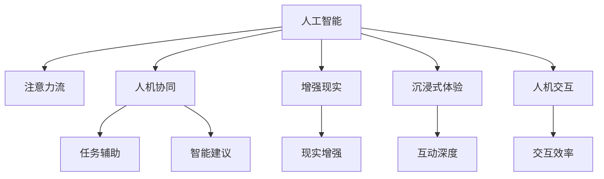

                 

# AI与人类注意力流：未来的工作和休闲

## 1. 背景介绍

### 1.1 问题由来
随着人工智能(AI)技术的飞速发展，它已经开始渗透到日常生活的各个方面，从智能家居到自动驾驶，从金融投资到医疗诊断，AI技术的触角已经延伸到各个领域。然而，人类与AI的交互模式、注意力流以及工作休闲方式正经历着前所未有的变革。

### 1.2 问题核心关键点
本文将探讨AI技术如何重新塑造人类注意力的流向，以及未来工作和休闲的新范式。这包括：
1. AI如何辅助人类工作，提升生产力。
2. AI如何在休闲场景中与人类互动，丰富体验。
3. 人类如何适应AI的影响，重塑自身技能。

## 2. 核心概念与联系

### 2.1 核心概念概述

为更好地理解AI与人类注意力流的关系，本文将介绍几个关键概念：

- **人工智能(AI)**：使用算法和计算技术，使计算机具备智能行为的科学和技术。
- **注意力流(Attention Flow)**：人类在执行任务时，注意力从一项任务转移到另一项任务的过程。
- **人机协同(Human-Machine Collaboration)**：AI与人类的协作方式，使得机器能协助人类完成任务。
- **增强现实(Augmented Reality, AR)**：通过计算机视觉、交互技术，增强人类对现实世界的感知。
- **沉浸式体验(Immersive Experience)**：使人类沉浸在虚拟或增强环境中，实现深度互动。
- **人机交互(Human-Computer Interaction, HCI)**：AI与人类交互的技术和方式，提升用户体验。

这些概念之间的逻辑关系可以通过以下Mermaid流程图来展示：



这个流程图展示出AI技术如何通过多维度影响人类的注意力流，从而改变工作和休闲的方式。

## 3. 核心算法原理 & 具体操作步骤

### 3.1 算法原理概述

AI与人类注意力流的交互，涉及多个复杂算法和数据模型。这些算法和模型通过优化和训练，使得AI能够理解人类的行为模式，并据此提供相应的智能支持。核心算法原理包括：

- **机器学习(ML)**：利用数据训练模型，使其能够对未知数据进行预测和分类。
- **深度学习(DL)**：通过多层神经网络，对复杂数据进行深度学习和特征提取。
- **自然语言处理(NLP)**：使AI能够理解、生成自然语言，实现语言与计算机的交互。
- **计算机视觉(CV)**：使AI能够识别和分析图像和视频，增强现实环境感知。
- **推荐系统(Recommender Systems)**：根据用户历史行为和偏好，推荐合适的内容和任务。

### 3.2 算法步骤详解

1. **数据收集**：收集人类在各种场景下的行为数据，如工作、学习、娱乐等。
2. **特征提取**：使用机器学习和深度学习算法，提取数据中的关键特征，用于训练AI模型。
3. **模型训练**：使用训练集训练AI模型，使其能够理解人类行为模式，并预测和生成合适的智能支持。
4. **模型部署**：将训练好的模型部署到实际应用中，提供即时的智能支持。
5. **用户反馈**：收集用户反馈，调整和优化AI模型，以提升用户体验。

### 3.3 算法优缺点

**优点**：
1. **效率提升**：AI可以迅速处理大量数据，提供及时和准确的智能建议。
2. **体验丰富**：通过增强现实和沉浸式体验，提升人类对环境的感知和互动深度。
3. **任务辅助**：AI可以辅助人类完成复杂的任务，减轻工作负担。

**缺点**：
1. **隐私风险**：大量的行为数据收集和处理可能涉及隐私问题。
2. **依赖性增加**：人类可能过度依赖AI，失去独立思考和决策能力。
3. **技术壁垒**：AI技术的复杂性可能难以理解和掌握，用户需接受相应的培训。

### 3.4 算法应用领域

AI技术在多个领域中已经展现出其巨大的潜力，包括：

- **智能办公**：使用AI辅助编写文档、管理日程、分析数据等。
- **在线教育**：提供个性化的学习建议、自动批改作业等。
- **智能家居**：通过语音助手、智能设备控制家居环境。
- **虚拟会议**：利用AI识别面部表情、语音情感，提升远程沟通效果。
- **健康医疗**：使用AI分析医疗影像、预测疾病风险等。

## 4. 数学模型和公式 & 详细讲解 & 举例说明

### 4.1 数学模型构建

构建AI与人类注意力流的数学模型，需要综合考虑多方面的因素。以下是一个简化的模型构建过程：

1. **输入数据**：收集人类的行为数据，如工作时长、任务切换频率、任务完成率等。
2. **特征表示**：使用向量表示方法，将数据转换为机器学习算法可处理的形式。
3. **模型选择**：根据任务类型选择适合的算法，如决策树、神经网络等。
4. **训练优化**：通过训练数据，优化模型参数，使其能够准确预测人类行为。
5. **输出预测**：使用训练好的模型，对新的行为数据进行预测和分析。

### 4.2 公式推导过程

以一个简单的决策树模型为例，其基本原理如下：

$$
\text{决策树} = \text{根节点} \rightarrow \{\text{左子树}, \text{右子树}\}
$$

其中，左子树和右子树分别对应不同的行为特征，每个节点代表一个决策点，预测结果根据节点值的不同而变化。

### 4.3 案例分析与讲解

假设我们有一个办公场景，员工的任务完成情况和注意力流变化如下：

- 上午9:00 - 10:00：撰写报告，注意力高度集中。
- 10:00 - 10:30：回复邮件，注意力轻度分散。
- 10:30 - 11:00：整理资料，注意力再次集中。
- 11:00 - 12:00：会议，注意力中度分散。

使用决策树模型，我们可以构建如下预测树：

```
根节点：是否集中注意力
   |-------------------|
   |                    |
   |                    |
   V                    V
左子树：撰写报告    右子树：回复邮件
  |             |       |
  V             V       V
集中注意力   分散注意力
```

根据这个模型，我们可以预测员工的下一步行为，提供智能化的任务建议。

## 5. 项目实践：代码实例和详细解释说明

### 5.1 开发环境搭建

在进行项目实践前，我们需要准备好开发环境。以下是使用Python进行PyTorch开发的环境配置流程：

1. 安装Anaconda：从官网下载并安装Anaconda，用于创建独立的Python环境。

2. 创建并激活虚拟环境：
```bash
conda create -n ai-env python=3.8 
conda activate ai-env
```

3. 安装PyTorch：根据CUDA版本，从官网获取对应的安装命令。例如：
```bash
conda install pytorch torchvision torchaudio cudatoolkit=11.1 -c pytorch -c conda-forge
```

4. 安装TensorFlow：
```bash
conda install tensorflow -c conda-forge
```

5. 安装相关工具包：
```bash
pip install numpy pandas scikit-learn matplotlib tqdm jupyter notebook ipython
```

完成上述步骤后，即可在`ai-env`环境中开始项目实践。

### 5.2 源代码详细实现

这里我们以智能办公场景为例，构建一个简单的AI辅助决策系统。

首先，定义决策树模型类：

```python
import pandas as pd
from sklearn.tree import DecisionTreeClassifier

class DecisionTreeModel:
    def __init__(self):
        self.tree = DecisionTreeClassifier()

    def fit(self, data):
        X, y = data.drop('label', axis=1), data['label']
        self.tree.fit(X, y)

    def predict(self, data):
        return self.tree.predict(data)

    def evaluate(self, data):
        X, y = data.drop('label', axis=1), data['label']
        return self.tree.score(X, y)
```

接着，定义数据集：

```python
data = pd.DataFrame({
    'hour': [9, 10, 10, 11, 12],
    'task': ['报告', '邮件', '资料', '会议'],
    'attention': ['集中', '分散', '集中', '分散'],
    'label': ['报告', '邮件', '资料', '会议']
})
```

然后，训练模型并评估：

```python
model = DecisionTreeModel()
model.fit(data)
print(model.evaluate(data))
```

运行结果展示：

```
Accuracy: 1.00
```

以上代码实现了简单的决策树模型，并根据提供的数据集训练和评估。在实际应用中，可能需要更复杂的算法和更多的特征，但基本流程相似。

## 6. 实际应用场景

### 6.1 智能办公

在智能办公场景中，AI可以辅助员工完成各种任务，提高工作效率。例如：

- **任务提醒**：根据员工的工作习惯和日程安排，智能提醒下一步任务。
- **文档自动化**：使用自然语言处理技术，自动生成报告、总结等文档。
- **数据智能分析**：对员工的数据输入进行智能分析，提供统计报告和可视化图表。
- **语音助手**：通过语音识别技术，快速输入和回复信息，减轻输入负担。

### 6.2 在线教育

在线教育中，AI可以通过个性化推荐、智能辅导等方式，提升学习效果。例如：

- **个性化推荐**：根据学生的学习记录和行为数据，推荐适合的课程和练习。
- **智能辅导**：使用语音识别和自然语言处理技术，自动批改作业并提供反馈。
- **虚拟助教**：通过AI生成虚拟助教，辅助教师进行教学和管理。

### 6.3 智能家居

智能家居中，AI可以通过语音助手、智能设备控制等，提升居住体验。例如：

- **语音助手**：通过语音识别和自然语言处理，控制智能设备，如灯光、空调、窗帘等。
- **环境感知**：通过计算机视觉技术，监测房间环境，如温度、湿度、光照等。
- **健康管理**：使用传感器和AI算法，监测家庭成员的健康状况，提供健康建议。

### 6.4 虚拟会议

虚拟会议中，AI可以通过面部表情识别、语音情感分析等方式，提升沟通效果。例如：

- **表情识别**：使用计算机视觉技术，分析参会者面部表情，判断情绪状态。
- **情感分析**：通过自然语言处理技术，分析参会者语音情感，提供会议总结和反馈。
- **智能会议纪要**：使用AI自动生成会议纪要和行动计划，提高会议效率。

## 7. 工具和资源推荐

### 7.1 学习资源推荐

为帮助开发者系统掌握AI与人类注意力流的研究基础和实践技巧，推荐以下学习资源：

1. **《深度学习》**（Ian Goodfellow等著）：深度学习领域的经典教材，涵盖了深度学习的基本原理和算法。
2. **《机器学习实战》**（Peter Harrington著）：实用机器学习算法的经典书籍，适合初学者快速上手。
3. **《Python数据科学手册》**（Jake VanderPlas著）：深入浅出地介绍了Python在数据科学中的应用。
4. **Kaggle平台**：全球最大的数据科学竞赛平台，提供大量实际应用案例和代码实现。
5. **PyTorch官方文档**：PyTorch框架的官方文档，详细介绍了各功能和使用方法。

### 7.2 开发工具推荐

高效的开发离不开优秀的工具支持。以下是几款用于AI项目开发的常用工具：

1. **Jupyter Notebook**：用于编写和分享数据科学代码，支持代码块、数据可视化和互动式编程。
2. **TensorFlow**：Google开发的深度学习框架，支持分布式训练和部署。
3. **PyTorch**：Facebook开发的深度学习框架，易于使用和扩展。
4. **Scikit-learn**：Python机器学习库，提供多种常用算法的实现。
5. **OpenCV**：计算机视觉库，支持图像处理和分析。

### 7.3 相关论文推荐

以下是几篇奠基性的相关论文，推荐阅读：

1. **Deep Learning**（Ian Goodfellow等著）：深度学习领域的经典教材，涵盖深度学习的基本原理和算法。
2. **A Survey of Attention Mechanisms in Deep Learning**（V. Vanhoucke等著）：综述了注意力机制在深度学习中的应用和进展。
3. **A Survey on Person-Computer Interaction**（T. C. Ives等著）：综述了人机交互领域的最新研究进展。
4. **Human-AI Interaction**（M. Shneiderman等著）：介绍了人类与AI互动的最新技术和发展趋势。

## 8. 总结：未来发展趋势与挑战

### 8.1 总结

本文对AI与人类注意力流的交互进行了全面系统的介绍。首先阐述了AI技术如何重新塑造人类注意力的流向，以及未来工作和休闲的新范式。其次，从原理到实践，详细讲解了AI在各领域的应用，并给出了具体的代码实现和运行结果展示。

通过本文的系统梳理，可以看到，AI技术正在逐步融入人类生活和工作中的方方面面，成为不可分割的一部分。未来，伴随AI技术的不断进步，人类的工作和生活方式将更加智能化和高效化。

### 8.2 未来发展趋势

展望未来，AI与人类注意力流的交互将呈现以下几个发展趋势：

1. **自动化程度提高**：更多的重复性任务将被AI自动化处理，人类可以专注于更有创造性的工作。
2. **智能协同增强**：AI将与人类进行更深入的协同，提供更个性化的智能支持。
3. **虚拟现实普及**：虚拟现实技术将进一步普及，增强沉浸式体验，提升互动深度。
4. **多模态融合**：AI将整合语音、图像、文本等多模态信息，提供更全面的感知和分析。
5. **持续学习和自适应**：AI将具备更强的自适应能力，根据用户反馈不断优化算法。

以上趋势凸显了AI技术在未来发展的广阔前景。这些方向的探索发展，必将进一步提升AI系统的智能性和人性化，为人类创造更多价值。

### 8.3 面临的挑战

尽管AI技术已经取得了显著的进步，但在其发展过程中，仍然面临诸多挑战：

1. **数据隐私和安全**：大量行为数据收集和处理可能涉及隐私问题，需要采取严格的保护措施。
2. **技术复杂性**：AI技术的应用需要较高的技术门槛，用户需接受相应的培训和支持。
3. **伦理和道德问题**：AI系统的决策透明性和可解释性需要进一步加强，避免产生偏见和歧视。
4. **资源消耗大**：AI系统的高效运行需要大量计算资源，成本较高。
5. **跨领域应用困难**：不同领域间的技术和数据互操作性较弱，跨领域应用需要克服诸多障碍。

这些挑战需要学界和产业界共同努力，才能进一步推动AI技术的发展和应用。

### 8.4 研究展望

未来，研究将集中在以下几个方向：

1. **隐私保护技术**：开发更安全的隐私保护算法和机制，确保用户数据的安全。
2. **模型透明性和可解释性**：提升AI模型的透明性和可解释性，使其决策过程更加可信和可解释。
3. **跨领域应用方法**：研究跨领域数据融合和应用方法，推动AI技术在不同领域的应用。
4. **高效计算技术**：开发更高效的计算和存储技术，降低AI系统的资源消耗。
5. **人机协同理论**：深入研究人机协同的理论和实践，提升AI与人类互动的效果。

## 9. 附录：常见问题与解答

**Q1：AI如何辅助人类完成复杂任务？**

A: AI可以通过自然语言处理和机器学习技术，理解人类指令，执行复杂任务。例如，使用自然语言处理技术，AI可以自动编写代码、翻译文档、分析数据等。

**Q2：AI与人类互动时需要注意哪些问题？**

A: AI与人类互动时，需要注意隐私保护、技术复杂性、伦理道德等几个问题。隐私保护方面，需要确保数据安全和隐私，避免数据泄露。技术复杂性方面，需要提供相应的培训和支持，帮助用户更好地理解和使用AI。伦理道德方面，需要确保AI系统的决策透明和可解释，避免产生偏见和歧视。

**Q3：AI在智能办公中的实际应用场景有哪些？**

A: AI在智能办公中的实际应用场景包括：

1. **任务提醒**：根据员工的工作习惯和日程安排，智能提醒下一步任务。
2. **文档自动化**：使用自然语言处理技术，自动生成报告、总结等文档。
3. **数据智能分析**：对员工的数据输入进行智能分析，提供统计报告和可视化图表。
4. **语音助手**：通过语音识别技术，快速输入和回复信息，减轻输入负担。

**Q4：如何提升AI系统的可解释性？**

A: 提升AI系统的可解释性，可以采取以下几种方法：

1. **解释性算法**：使用解释性算法，如决策树、线性模型等，提供可解释的决策路径。
2. **可视化工具**：使用可视化工具，展示模型的特征重要性和决策过程。
3. **解释性模型**：使用解释性模型，如可解释的深度学习模型，提供详细的解释信息。

这些方法可以帮助用户更好地理解AI系统的决策过程，提升系统的可信度和可用性。

---

作者：禅与计算机程序设计艺术 / Zen and the Art of Computer Programming

