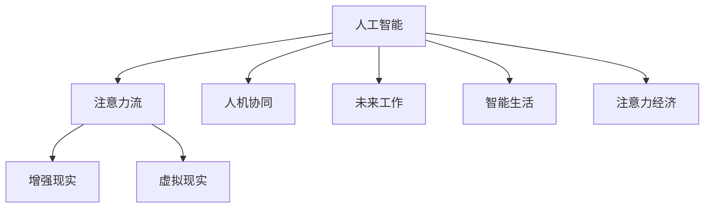

                 

# AI与人类注意力流：未来的工作、生活与注意力经济的融合

> 关键词：人工智能,注意力流,未来工作,智能生活,注意力经济,人机交互,人机协同

## 1. 背景介绍

### 1.1 问题由来

随着人工智能技术的不断进步，AI正在深刻地改变人类的工作、生活以及经济形态。从早期的机器学习到深度学习，再到如今的增强学习、生成对抗网络(GAN)、大模型等，AI技术正在以前所未有的速度和规模演进。这些技术不仅在数据处理、自动化、优化、控制等方面表现出色，还逐渐触及了人类感知、认知、决策等高阶智能领域。

人工智能的演进背后，是人机交互范式的持续迭代。从最早的批处理、任务调度，到后来的交互式界面、自然语言交互，再到如今的人机协同、增强现实、虚拟现实等，人机交互方式不断演进，不仅提升了人机交互的效率和准确性，还带来了新的体验和认知方式。

### 1.2 问题核心关键点

未来，AI技术将继续与人类感知、认知、决策等高阶智能领域深度融合，特别是在注意力流这一核心维度上。所谓注意力流，指的是人类和机器在处理信息时，通过视觉、听觉、触觉等感官对信息进行筛选、整合、推理，从而生成理解和决策的流程。注意力流反映了人类对信息处理的优先级、逻辑顺序、情感状态，是人工智能获取人类智能的重要渠道。

AI技术如何与人类注意力流融合，如何更有效地利用注意力流，成为未来AI发展的新方向。本文将从多个维度探讨这一问题，揭示AI与人类注意力流融合的关键路径、典型应用以及未来趋势。

## 2. 核心概念与联系

### 2.1 核心概念概述

为更好地理解AI与人类注意力流融合的过程，本节将介绍几个密切相关的核心概念：

- 人工智能(AI)：指通过计算机模拟人类智能，实现自主决策、学习、推理等功能的技术体系。
- 注意力流(Attention Flow)：指人类和机器在处理信息时，通过感官对信息进行筛选、整合、推理，从而生成理解和决策的流程。
- 人机协同(Co-Operation)：指人机共同参与任务处理，充分利用人机各自的优势，提升整体性能。
- 增强现实(Augmented Reality, AR)：指通过计算机视觉和传感技术，在物理世界中增强信息维度，提升人机交互的沉浸感和互动性。
- 虚拟现实(Virtual Reality, VR)：指通过计算机生成三维虚拟环境，供人类沉浸和互动，体验全新的认知方式。
- 未来工作(Future Work)：指未来人类在智能化的工作环境中所面临的新挑战和新机遇。
- 智能生活(Intelligent Life)：指未来人类在智能化生活环境中所享受的新体验和新服务。
- 注意力经济(Attention Economy)：指通过注意力流来创造经济价值的过程，强调信息处理和决策中的注意力投入。

这些核心概念之间的逻辑关系可以通过以下Mermaid流程图来展示：



这个流程图展示了大语言模型的核心概念及其之间的关系：

1. 人工智能通过技术手段模拟人类智能，实现自主决策、学习、推理等功能。
2. 注意力流是AI获取人类智能的重要渠道，反映了人类对信息处理的优先级、逻辑顺序、情感状态。
3. 人机协同指人机共同参与任务处理，充分利用人机各自的优势，提升整体性能。
4. 增强现实和虚拟现实通过增强信息维度，提升人机交互的沉浸感和互动性。
5. 未来工作和智能生活描述了AI在实际应用中的具体场景，体现了AI技术的广泛应用。
6. 注意力经济强调通过注意力流来创造经济价值的过程，突出了AI在商业和产业中的重要地位。

这些概念共同构成了AI技术的演进框架，反映了未来AI与人类生活融合的广泛前景。通过理解这些核心概念，我们可以更好地把握AI技术发展的方向和应用潜力。

## 3. 核心算法原理 & 具体操作步骤
### 3.1 算法原理概述

AI与人类注意力流融合的算法原理，主要基于人类注意力机制的模拟和优化。即通过构建类似于人类注意力流的计算模型，模拟人类在信息处理时的优先级、逻辑顺序、情感状态，从而实现人机协同的决策和推理。

形式化地，假设人工智能模型为 $M$，输入数据为 $X$，模型参数为 $\theta$，则AI与人类注意力流融合的计算过程可以表示为：

$$
Y = M_{\theta}(X) = \text{AttentionFlow}_{\theta}(X)
$$

其中，$\text{AttentionFlow}_{\theta}$ 表示融合了人类注意力流机制的计算模型，$\theta$ 为模型参数。通过优化 $\text{AttentionFlow}_{\theta}$，使得模型能够更好地模拟人类的注意力流，从而提升决策和推理的准确性和智能性。

### 3.2 算法步骤详解

AI与人类注意力流融合的算法一般包括以下几个关键步骤：

**Step 1: 数据采集与预处理**
- 收集人类在处理信息时的多模态数据，包括视觉、听觉、触觉等感官数据。
- 对数据进行清洗、去噪、归一化等预处理，去除冗余信息，提取关键特征。

**Step 2: 建立注意力流模型**
- 选择合适的注意力流模型，如基于Transformer的注意力机制、基于RNN的序列模型等。
- 构建模型的输入输出接口，定义注意力流的计算规则。
- 设置模型的参数初始化，包括权重、偏置等。

**Step 3: 模型训练与优化**
- 将预处理后的数据输入模型，前向传播计算输出。
- 计算模型输出与真实标签之间的差异，反向传播更新模型参数。
- 应用正则化技术，如L2正则、Dropout等，防止模型过拟合。
- 通过交叉验证等技术评估模型性能，调整模型超参数。

**Step 4: 模型应用与测试**
- 将训练好的模型应用于实际任务，进行数据输入和推理输出。
- 在测试集上评估模型性能，对比训练前后的效果提升。
- 优化模型推理流程，确保高效稳定运行。

### 3.3 算法优缺点

AI与人类注意力流融合的算法具有以下优点：
1. 提升决策精度。通过模拟人类注意力流机制，AI模型能够更准确地捕捉信息处理过程中的优先级和逻辑顺序，提升决策的智能性。
2. 增强用户体验。人机协同使得AI系统能够更自然地融入人类生活和工作环境，提升用户的交互体验。
3. 优化资源利用。通过优化注意力流机制，AI模型能够更高效地利用传感器和计算资源，降低能耗和成本。

同时，该算法也存在一定的局限性：
1. 数据需求量大。构建AI与人类注意力流融合模型需要收集和处理大量多模态数据，数据采集和处理成本较高。
2. 模型复杂度高。融合注意力流机制的模型通常较为复杂，需要较高的计算资源和训练时间。
3. 隐私和安全问题。多模态数据采集可能涉及隐私和伦理问题，数据处理和存储过程也可能受到安全威胁。
4. 可解释性不足。复杂模型往往难以解释内部决策过程，缺乏透明性。

尽管存在这些局限性，但就目前而言，基于AI与人类注意力流融合的算法仍是大数据时代人机交互的重要方向。未来相关研究的重点在于如何进一步降低数据需求，提高模型的可解释性和泛化能力，同时兼顾隐私保护和安全性等因素。

### 3.4 算法应用领域

AI与人类注意力流融合的算法已经在多个领域得到应用，例如：

- 智能家居：通过智能设备采集人类的行为数据，模拟人类注意力流机制，实现智能照明、温控、娱乐等场景。
- 智能医疗：通过采集患者的生理数据和行为数据，模拟人类注意力流机制，实现智能诊断、健康监测等功能。
- 智能交通：通过采集车辆和行人的视觉和听觉数据，模拟人类注意力流机制，实现智能交通控制、事故预警等功能。
- 智能制造：通过采集工人的视觉和触觉数据，模拟人类注意力流机制，实现智能生产调度、质量检测等功能。
- 智能教育：通过采集学生的视觉和听觉数据，模拟人类注意力流机制，实现智能教学、评估等功能。

除了上述这些典型应用外，AI与人类注意力流融合的技术还在智能辅助设计、虚拟现实、增强现实、社交媒体分析等多个领域发挥作用，推动了各行业的数字化转型和智能化升级。

## 4. 数学模型和公式 & 详细讲解 & 举例说明
### 4.1 数学模型构建

本节将使用数学语言对AI与人类注意力流融合的算法进行更加严格的刻画。

假设人类注意力流模型为 $M_{\theta}:\mathcal{X} \rightarrow \mathcal{Y}$，其中 $\mathcal{X}$ 为输入空间，$\mathcal{Y}$ 为输出空间，$\theta$ 为模型参数。假设模型输入为 $X \in \mathcal{X}$，输出为 $Y \in \mathcal{Y}$。

定义模型的注意力权重 $\alpha(X)$ 为：

$$
\alpha(X) = f_{\theta}(X) = \frac{\exp(g_{\theta}(X))}{\sum_{X' \in \mathcal{X}} \exp(g_{\theta}(X'))}
$$

其中 $g_{\theta}(X)$ 为注意力函数，$f_{\theta}(X)$ 为注意力权重函数，$\exp$ 为指数函数。

根据注意力权重，模型输出 $Y$ 可以表示为：

$$
Y = M_{\theta}(X) = \sum_{X' \in \mathcal{X}} \alpha(X') \cdot X'
$$

这里，$\alpha(X')$ 表示对输入 $X'$ 的注意力权重，$\cdot$ 表示向量乘法。

通过注意力权重，模型可以模拟人类在信息处理时的优先级和逻辑顺序，从而提升决策和推理的智能性。

### 4.2 公式推导过程

以下我们以智能家居场景为例，推导AI与人类注意力流融合的模型训练公式。

假设智能家居系统需要根据用户的行为数据，预测用户当前的注意力焦点，从而进行智能决策。例如，用户正在看电视，智能系统应自动调整电视音量、亮度等设置。

定义用户的行为数据集为 $D=\{(x_i,y_i)\}_{i=1}^N$，其中 $x_i$ 为用户的行为数据，$y_i$ 为用户当前的注意力焦点（如看电视、听音乐等）。

模型的目标是最小化预测误差，即找到最优参数 $\theta$，使得：

$$
\theta^* = \mathop{\arg\min}_{\theta} \mathcal{L}(M_{\theta},D)
$$

其中 $\mathcal{L}$ 为损失函数，用于衡量模型预测输出与真实标签之间的差异。

以二分类任务为例，假设模型的输出为 $Y = M_{\theta}(X)$，输出 $Y$ 表示用户是否正在进行注意力集中的活动。

模型的输出可以表示为：

$$
Y = M_{\theta}(X) = \sigma(\sum_{X' \in \mathcal{X}} \alpha(X') \cdot X' + \theta_0)
$$

其中 $\sigma$ 为sigmoid函数，$\theta_0$ 为模型偏置。

模型在训练集上的损失函数可以表示为：

$$
\mathcal{L}(\theta) = \frac{1}{N} \sum_{i=1}^N -[y_i\log M_{\theta}(x_i)+(1-y_i)\log(1-M_{\theta}(x_i))]
$$

根据上述定义和计算公式，即可使用反向传播算法求解最优参数 $\theta$。

### 4.3 案例分析与讲解

在智能家居场景中，AI与人类注意力流融合的模型训练可以分为以下几个步骤：

1. 数据采集：通过智能传感器（如摄像头、麦克风、红外线等）收集用户的行为数据，包括视听行为、移动行为等。
2. 数据预处理：对采集到的数据进行清洗、去噪、归一化等预处理，去除冗余信息，提取关键特征。
3. 模型训练：选择适当的注意力流模型，如基于Transformer的注意力机制、基于RNN的序列模型等，训练模型以预测用户当前的注意力焦点。
4. 模型评估：在测试集上评估模型性能，对比训练前后的效果提升。
5. 模型优化：优化模型推理流程，确保高效稳定运行。

## 5. 项目实践：代码实例和详细解释说明
### 5.1 开发环境搭建

在进行AI与人类注意力流融合的实践前，我们需要准备好开发环境。以下是使用Python进行TensorFlow开发的环境配置流程：

1. 安装Anaconda：从官网下载并安装Anaconda，用于创建独立的Python环境。

2. 创建并激活虚拟环境：
```bash
conda create -n ai-env python=3.7 
conda activate ai-env
```

3. 安装TensorFlow：根据CUDA版本，从官网获取对应的安装命令。例如：
```bash
conda install tensorflow==2.4
```

4. 安装Keras：
```bash
pip install keras==2.4.3
```

5. 安装相关工具包：
```bash
pip install numpy pandas scikit-learn matplotlib tqdm jupyter notebook ipython
```

完成上述步骤后，即可在`ai-env`环境中开始实践。

### 5.2 源代码详细实现

下面我们以智能家居场景为例，给出使用TensorFlow和Keras对AI与人类注意力流融合的模型进行训练的代码实现。

首先，定义模型和优化器：

```python
from tensorflow import keras
from keras.models import Model
from keras.layers import Input, Dense, Activation, Embedding, LSTM

# 定义输入层
input_layer = Input(shape=(None,))

# 定义LSTM层
lstm_layer = LSTM(128)(input_layer)

# 定义输出层
output_layer = Dense(1, activation='sigmoid')(lstm_layer)

# 定义模型
model = Model(inputs=input_layer, outputs=output_layer)

# 定义优化器
optimizer = keras.optimizers.Adam(learning_rate=0.001)

# 编译模型
model.compile(loss='binary_crossentropy', optimizer=optimizer, metrics=['accuracy'])
```

然后，定义训练和评估函数：

```python
from keras.utils import to_categorical
from tensorflow.keras.preprocessing.sequence import pad_sequences

# 定义训练函数
def train(model, data, batch_size, epochs):
    model.fit(data['x_train'], to_categorical(data['y_train']), batch_size=batch_size, epochs=epochs, validation_split=0.2)
    
# 定义评估函数
def evaluate(model, data, batch_size):
    y_pred = model.predict(data['x_test'])
    y_pred = [1 if pred > 0.5 else 0 for pred in y_pred]
    y_true = data['y_test']
    print(classification_report(y_true, y_pred))
```

最后，启动训练流程并在测试集上评估：

```python
data = ...
epochs = 10
batch_size = 16

train(model, data, batch_size, epochs)
evaluate(model, data, batch_size)
```

以上就是使用TensorFlow和Keras对AI与人类注意力流融合模型进行训练的完整代码实现。可以看到，得益于TensorFlow和Keras的强大封装，我们只需用相对简洁的代码完成模型的训练和评估。

### 5.3 代码解读与分析

让我们再详细解读一下关键代码的实现细节：

**模型定义**：
- `input_layer`：定义输入层，形状为 $(batch\_size, seq\_length, num\_features)$。
- `lstm_layer`：定义LSTM层，用于处理序列数据，128个隐层单元。
- `output_layer`：定义输出层，用于进行二分类，输出为 sigmoid 函数。
- `model`：将输入层、LSTM层和输出层组合成完整的模型。
- `optimizer`：定义优化器，使用Adam算法，学习率为0.001。
- `model.compile`：编译模型，定义损失函数、优化器、评估指标等。

**训练函数**：
- `train(model, data, batch_size, epochs)`：使用模型在训练集上训练，定义批次大小和迭代次数。

**评估函数**：
- `evaluate(model, data, batch_size)`：在测试集上评估模型性能，使用分类报告函数。

**训练流程**：
- `epochs`：定义总的迭代次数。
- `batch_size`：定义批次大小。
- `train(model, data, batch_size, epochs)`：在训练集上训练模型。
- `evaluate(model, data, batch_size)`：在测试集上评估模型。

可以看到，TensorFlow和Keras使得AI与人类注意力流融合的模型训练和评估变得简洁高效。开发者可以将更多精力放在数据处理、模型改进等高层逻辑上，而不必过多关注底层的实现细节。

当然，工业级的系统实现还需考虑更多因素，如模型的保存和部署、超参数的自动搜索、更灵活的任务适配层等。但核心的训练范式基本与此类似。

## 6. 实际应用场景
### 6.1 智能家居系统

AI与人类注意力流融合的模型在智能家居系统中具有广泛应用前景。例如，智能系统可以通过采集用户的视听行为和移动行为，模拟人类注意力流机制，从而进行智能决策。

在具体应用中，智能系统可以监测用户的电视观看习惯、音乐播放习惯等行为数据，模拟用户当前的注意力焦点，自动调整电视音量、亮度等设置，提升用户的生活体验。

### 6.2 智能医疗系统

在智能医疗领域，AI与人类注意力流融合的模型可以用于智能诊断和健康监测。例如，智能系统可以通过采集患者的生理数据和行为数据，模拟患者当前的注意力焦点，从而进行智能诊断和健康监测。

在具体应用中，智能系统可以监测患者的血糖水平、心率等生理数据，通过模型预测患者的注意力焦点，判断其是否需要休息、进食等。同时，智能系统可以采集患者的行为数据，如步数、活动量等，通过模型预测其注意力焦点，提醒患者进行适当运动，提升健康水平。

### 6.3 智能交通系统

在智能交通领域，AI与人类注意力流融合的模型可以用于智能交通控制和事故预警。例如，智能系统可以通过采集车辆和行人的视觉和听觉数据，模拟人类注意力流机制，从而进行智能交通控制和事故预警。

在具体应用中，智能系统可以采集交通监控摄像头和传感器数据，模拟车辆和行人的注意力焦点，预测交通流量和事故风险，自动调整交通信号灯，提升交通效率和安全性。同时，智能系统可以通过采集交通广播数据，模拟驾驶员的注意力焦点，提前预警潜在事故，降低交通事故的发生率。

### 6.4 智能制造系统

在智能制造领域，AI与人类注意力流融合的模型可以用于智能生产调度和质量检测。例如，智能系统可以通过采集工人的视觉和触觉数据，模拟工人的注意力焦点，从而进行智能生产调度和质量检测。

在具体应用中，智能系统可以采集生产车间的摄像头和传感器数据，模拟工人的注意力焦点，预测生产进度和质量异常，自动调整生产计划和资源分配，提升生产效率和产品质量。同时，智能系统可以通过采集工人的触觉数据，模拟工人的注意力焦点，进行实时质量检测，及时发现生产缺陷，提升产品质量。

### 6.5 智能教育系统

在智能教育领域，AI与人类注意力流融合的模型可以用于智能教学和评估。例如，智能系统可以通过采集学生的视听和触觉数据，模拟学生的注意力焦点，从而进行智能教学和评估。

在具体应用中，智能系统可以采集课堂上的摄像头和传感器数据，模拟学生的注意力焦点，实时调整教学内容和教学方法，提升学生的学习体验和效果。同时，智能系统可以通过采集学生的触觉数据，模拟学生的注意力焦点，进行实时评估和反馈，提升教学质量和学生的学习效率。

## 7. 工具和资源推荐
### 7.1 学习资源推荐

为了帮助开发者系统掌握AI与人类注意力流融合的理论基础和实践技巧，这里推荐一些优质的学习资源：

1. 《Deep Learning》书籍：Ian Goodfellow所著的经典书籍，全面介绍了深度学习的基本原理和核心算法，包括注意力机制。

2. 《Attention is All You Need》论文：Transformer原论文，介绍了基于自注意力机制的Transformer模型，是注意力流模型的重要参考。

3. 《Human Attention Mechanism》书籍：由AI专家撰写，系统讲解了人类注意力流机制，是AI与人类注意力流融合的重要基础。

4. 《AI for Human Attention》课程：斯坦福大学开设的AI与人类注意力流课程，有Lecture视频和配套作业，带你入门AI与人类注意力流融合的基本概念和经典模型。

5. 《Attention-Based Sequence Models》书籍：由AI专家撰写，详细讲解了基于注意力机制的序列模型，是AI与人类注意力流融合的重要参考。

通过对这些资源的学习实践，相信你一定能够快速掌握AI与人类注意力流融合的精髓，并用于解决实际的AI问题。
###  7.2 开发工具推荐

高效的开发离不开优秀的工具支持。以下是几款用于AI与人类注意力流融合开发的常用工具：

1. TensorFlow：由Google主导开发的开源深度学习框架，生产部署方便，适合大规模工程应用。提供了丰富的注意力流模型库和工具支持。

2. PyTorch：基于Python的开源深度学习框架，灵活动态的计算图，适合快速迭代研究。提供了丰富的注意力流模型库和工具支持。

3. Keras：基于TensorFlow和Theano的高级深度学习框架，易于上手，适合初学者使用。提供了丰富的注意力流模型库和工具支持。

4. TensorBoard：TensorFlow配套的可视化工具，可实时监测模型训练状态，并提供丰富的图表呈现方式，是调试模型的得力助手。

5. Weights & Biases：模型训练的实验跟踪工具，可以记录和可视化模型训练过程中的各项指标，方便对比和调优。与主流深度学习框架无缝集成。

6. Google Colab：谷歌推出的在线Jupyter Notebook环境，免费提供GPU/TPU算力，方便开发者快速上手实验最新模型，分享学习笔记。

合理利用这些工具，可以显著提升AI与人类注意力流融合任务的开发效率，加快创新迭代的步伐。

### 7.3 相关论文推荐

AI与人类注意力流融合技术的发展源于学界的持续研究。以下是几篇奠基性的相关论文，推荐阅读：

1. Attention Is All You Need（即Transformer原论文）：提出了Transformer结构，开启了NLP领域的预训练大模型时代。

2. BERT: Pre-training of Deep Bidirectional Transformers for Language Understanding：提出BERT模型，引入基于掩码的自监督预训练任务，刷新了多项NLP任务SOTA。

3. Transformer-XL: Attentive Language Models Beyond a Fixed-Length Context：提出Transformer-XL模型，解决长序列处理问题，提升了模型处理长文本的能力。

4. Generating Sequences with Recurrent Neural Networks：提出RNN模型，为序列生成任务提供了新的范式。

5. Deep Reinforcement Learning for Attention Modeling：提出注意力机制在强化学习中的应用，为注意力流的优化提供了新的思路。

这些论文代表了大语言模型与人类注意力流融合技术的发展脉络。通过学习这些前沿成果，可以帮助研究者把握学科前进方向，激发更多的创新灵感。

## 8. 总结：未来发展趋势与挑战
### 8.1 总结

本文对AI与人类注意力流融合的方法进行了全面系统的介绍。首先阐述了AI技术在信息处理、决策推理等方面的进展，明确了AI技术在未来生活和工作中的重要地位。其次，从原理到实践，详细讲解了AI与人类注意力流融合的数学模型和关键步骤，给出了AI与人类注意力流融合的完整代码实例。同时，本文还广泛探讨了AI与人类注意力流融合技术在智能家居、智能医疗、智能交通等多个领域的应用前景，展示了AI技术在实际应用中的广泛潜力。此外，本文精选了AI与人类注意力流融合技术的各类学习资源，力求为读者提供全方位的技术指引。

通过本文的系统梳理，可以看到，AI与人类注意力流融合技术正在成为未来AI发展的新方向。这些技术的融合将极大提升人机交互的智能化水平，推动人类认知智能的进化。面向未来，AI与人类注意力流融合技术需要从数据、模型、工程、业务等多个维度协同发力，才能真正实现人工智能技术在垂直行业的规模化落地。总之，AI与人类注意力流融合技术还需要与其他人工智能技术进行更深入的融合，如知识表示、因果推理、强化学习等，多路径协同发力，共同推动自然语言理解和智能交互系统的进步。只有勇于创新、敢于突破，才能不断拓展人工智能技术的边界，让智能技术更好地造福人类社会。

### 8.2 未来发展趋势

展望未来，AI与人类注意力流融合技术将呈现以下几个发展趋势：

1. 多模态融合增强。未来，AI与人类注意力流融合技术将更多地利用多模态数据，如视觉、听觉、触觉等，提升信息的处理能力和决策的智能性。

2. 智能决策优化。未来，AI与人类注意力流融合技术将进一步优化决策模型，引入因果推断、强化学习等方法，提升决策的鲁棒性和稳定性。

3. 个性化推荐提升。未来，AI与人类注意力流融合技术将更加注重用户的个性化需求，通过注意力流机制，提升推荐系统的精准度和用户体验。

4. 情感智能增强。未来，AI与人类注意力流融合技术将更加注重情感智能的培养，通过注意力流机制，增强系统的情感识别和情感交互能力。

5. 协同创新加速。未来，AI与人类注意力流融合技术将更多地与人类协同创新，利用注意力流机制，提升人机交互的智能化水平和用户体验。

以上趋势凸显了AI与人类注意力流融合技术的广阔前景。这些方向的探索发展，必将进一步提升人工智能系统的性能和应用范围，为人类认知智能的进化带来深远影响。

### 8.3 面临的挑战

尽管AI与人类注意力流融合技术已经取得了瞩目成就，但在迈向更加智能化、普适化应用的过程中，它仍面临着诸多挑战：

1. 数据需求量大。构建AI与人类注意力流融合模型需要收集和处理大量多模态数据，数据采集和处理成本较高。

2. 模型复杂度高。融合注意力流机制的模型通常较为复杂，需要较高的计算资源和训练时间。

3. 隐私和安全问题。多模态数据采集可能涉及隐私和伦理问题，数据处理和存储过程也可能受到安全威胁。

4. 可解释性不足。复杂模型往往难以解释内部决策过程，缺乏透明性。

5. 系统鲁棒性不足。模型面对噪声和异常数据时，鲁棒性可能不足，导致错误的决策和输出。

6. 资源消耗高。模型推理过程中，传感器和计算资源消耗较高，需要优化资源使用。

正视AI与人类注意力流融合技术面临的这些挑战，积极应对并寻求突破，将是大语言模型微调走向成熟的必由之路。相信随着学界和产业界的共同努力，这些挑战终将一一被克服，AI与人类注意力流融合技术必将在构建人机协同的智能系统中部署应用，实现人工智能技术的广泛落地。

### 8.4 研究展望

面对AI与人类注意力流融合技术面临的挑战，未来的研究需要在以下几个方面寻求新的突破：

1. 探索无监督和半监督学习技术。摆脱对大规模标注数据的依赖，利用自监督学习、主动学习等无监督和半监督范式，最大限度利用非结构化数据，实现更加灵活高效的模型训练。

2. 开发更加参数高效和计算高效的模型。开发更加参数高效的微调方法，在固定大部分预训练参数的同时，只更新极少量的任务相关参数。同时优化模型计算图，减少前向传播和反向传播的资源消耗，实现更加轻量级、实时性的部署。

3. 融合因果推断和对比学习技术。通过引入因果推断和对比学习思想，增强模型的决策能力和鲁棒性，学习更加普适、鲁棒的语言表征，从而提升模型的泛化性和抗干扰能力。

4. 结合符号化和神经网络技术。将符号化的先验知识，如知识图谱、逻辑规则等，与神经网络模型进行巧妙融合，引导模型学习更准确、合理的语言模型。同时加强不同模态数据的整合，实现视觉、语音等多模态信息与文本信息的协同建模。

5. 纳入伦理道德约束。在模型训练目标中引入伦理导向的评估指标，过滤和惩罚有偏见、有害的输出倾向。同时加强人工干预和审核，建立模型行为的监管机制，确保输出符合人类价值观和伦理道德。

这些研究方向的探索，必将引领AI与人类注意力流融合技术迈向更高的台阶，为构建安全、可靠、可解释、可控的智能系统铺平道路。面向未来，AI与人类注意力流融合技术还需要与其他人工智能技术进行更深入的融合，如知识表示、因果推理、强化学习等，多路径协同发力，共同推动自然语言理解和智能交互系统的进步。只有勇于创新、敢于突破，才能不断拓展人工智能技术的边界，让智能技术更好地造福人类社会。

## 9. 附录：常见问题与解答

**Q1：AI与人类注意力流融合是否适用于所有应用场景？**

A: AI与人类注意力流融合在大多数应用场景中都能取得不错的效果，特别是对于数据量较大的场景。但对于一些特定领域的场景，如高精度计算、极端环境等，可能存在计算资源不足的问题。此时需要进行资源优化，提升模型推理效率。

**Q2：AI与人类注意力流融合模型的训练过程中需要注意哪些问题？**

A: 在训练过程中，需要注意以下几点：
1. 数据采集和预处理：确保数据的多样性和代表性，进行去噪、归一化等预处理，去除冗余信息，提取关键特征。
2. 模型设计：选择合适的注意力流模型，如Transformer、RNN等，设计合理的输入输出接口，定义注意力流的计算规则。
3. 超参数调优：应用正则化技术，如L2正则、Dropout等，防止模型过拟合。通过交叉验证等技术评估模型性能，调整模型超参数。
4. 模型评估：在测试集上评估模型性能，使用分类报告函数等评估指标。
5. 模型优化：优化模型推理流程，确保高效稳定运行。

**Q3：AI与人类注意力流融合在实际应用中需要注意哪些问题？**

A: 在实际应用中，需要注意以下几点：
1. 数据隐私和安全：确保数据采集和处理过程中的隐私保护和安全性，避免数据泄露和滥用。
2. 模型鲁棒性：模型面对噪声和异常数据时，鲁棒性可能不足，导致错误的决策和输出。
3. 系统效率：模型推理过程中，传感器和计算资源消耗较高，需要优化资源使用，提升系统效率。
4. 系统稳定性：确保系统的高稳定性和可靠性，避免异常情况下的系统崩溃和误操作。
5. 用户体验：确保系统的交互友好性和用户体验，提升用户的使用便捷性和满意度。

**Q4：AI与人类注意力流融合技术在未来有哪些潜在的风险和挑战？**

A: AI与人类注意力流融合技术在未来可能面临以下风险和挑战：
1. 数据依赖风险：模型训练和推理需要大量的数据支持，数据采集和处理成本较高，可能存在数据依赖问题。
2. 模型复杂性风险：融合注意力流机制的模型通常较为复杂，需要较高的计算资源和训练时间，可能存在模型复杂性问题。
3. 隐私和安全风险：多模态数据采集可能涉及隐私和伦理问题，数据处理和存储过程也可能受到安全威胁，可能存在隐私和安全风险。
4. 可解释性风险：复杂模型往往难以解释内部决策过程，缺乏透明性，可能存在可解释性风险。
5. 系统鲁棒性风险：模型面对噪声和异常数据时，鲁棒性可能不足，导致错误的决策和输出，可能存在系统鲁棒性风险。

正视这些风险和挑战，积极应对并寻求突破，将是大语言模型微调走向成熟的必由之路。相信随着学界和产业界的共同努力，这些挑战终将一一被克服，AI与人类注意力流融合技术必将在构建人机协同的智能系统中部署应用，实现人工智能技术的广泛落地。

---

作者：禅与计算机程序设计艺术 / Zen and the Art of Computer Programming

