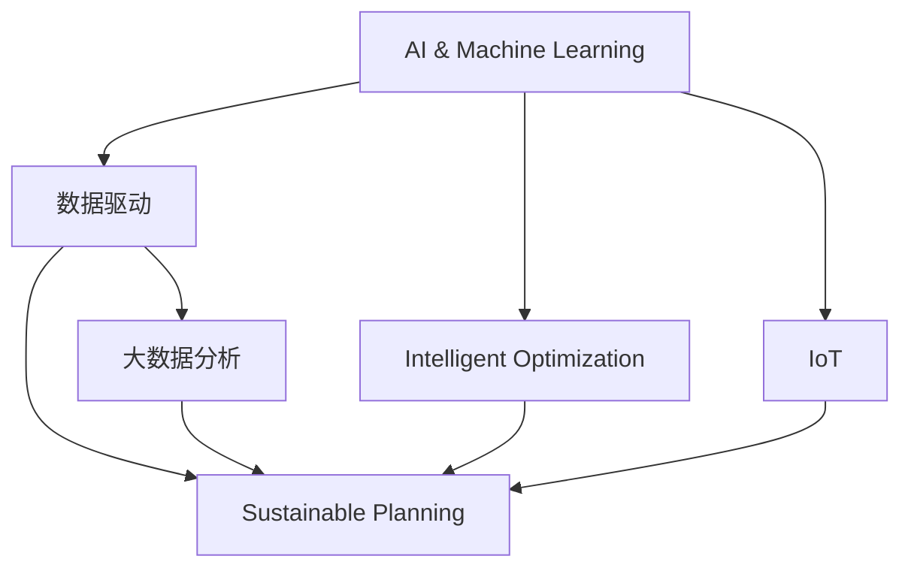

                 

# AI与人类计算：打造可持续发展的城市交通与基础设施规划

## 1. 背景介绍

### 1.1 问题由来
城市交通与基础设施规划是城市发展的重要组成部分，直接关系到居民的日常生活和城市经济的运行。然而，由于城市规模的不断扩大和人口的持续增长，传统的基于经验和规则的规划方式越来越难以满足实际需求。在交通拥堵、环境污染、资源短缺等问题日益严重的背景下，迫切需要引入新兴技术，推动城市交通与基础设施规划的现代化、智能化、可持续化。

### 1.2 问题核心关键点
城市交通与基础设施规划的核心在于如何通过数据驱动和智能化手段，实现资源的优化配置和高效利用。这不仅需要构建一个强大的数据采集和处理系统，还需要开发一套基于AI技术的规划和优化算法，对海量数据进行深入分析和预测，为城市发展提供科学依据和决策支持。

## 2. 核心概念与联系

### 2.1 核心概念概述

为更好地理解AI在城市交通与基础设施规划中的应用，本节将介绍几个密切相关的核心概念：

- AI与机器学习（AI & Machine Learning）：指通过算法和模型，使计算机具备智能推理、决策和学习的能力，以解决复杂问题。AI与城市规划结合，可以提升规划的科学性和效率。
- 数据驱动（Data-Driven）：指利用数据进行规划和决策的过程，强调数据在规划中的核心作用。通过数据分析和模型构建，可以揭示城市发展规律，提供有价值的决策依据。
- 智能优化（Intelligent Optimization）：指利用AI技术，对城市交通和基础设施进行智能化优化，提升规划的准确性和效率。
- 可持续规划（Sustainable Planning）：指考虑环境保护、资源节约和社会公平的规划，追求长期的、全局的最优解。
- IoT（物联网）：指通过各种传感器和通信技术，将城市基础设施数字化，实现数据实时采集和共享。
- 大数据分析（Big Data Analytics）：指对大规模数据集进行分析和处理，提取有价值的信息，支持决策和优化。

这些核心概念之间的逻辑关系可以通过以下Mermaid流程图来展示：



这个流程图展示了大语言模型的核心概念及其之间的关系：

1. AI与机器学习是大数据分析、智能优化和可持续规划的基础技术。
2. 数据驱动和物联网技术为AI提供了大量实时数据支持。
3. 智能优化和可持续规划是AI在城市交通与基础设施规划中的具体应用。

## 3. 核心算法原理 & 具体操作步骤
### 3.1 算法原理概述

基于AI的城市交通与基础设施规划，本质上是一个多目标优化问题。其核心思想是：通过构建数学模型，利用AI技术对城市交通与基础设施进行优化和规划，以达到交通流畅、环境友好、资源高效利用的目标。

形式化地，假设城市规划目标为 $O=\{T, E, R\}$，其中 $T$ 表示交通流畅度，$E$ 表示环境质量，$R$ 表示资源利用率。则城市规划的目标函数为：

$$
\min_{X} \{ T(X), E(X), R(X) \}
$$

其中 $X$ 为规划决策变量，包括道路建设、公共交通、能源消耗、环境治理等方面的决策。通过求解该优化问题，可以得出最优的城市规划方案。

### 3.2 算法步骤详解

基于AI的城市交通与基础设施规划一般包括以下几个关键步骤：

**Step 1: 数据收集与预处理**
- 通过传感器、监控摄像头、交通流量计等设备，收集城市交通与基础设施相关的数据。
- 对数据进行清洗、去重、格式转换等预处理操作，确保数据的准确性和完整性。

**Step 2: 模型构建**
- 根据实际需求，选择合适的模型和方法进行建模。常用的模型包括线性回归、决策树、神经网络等。
- 对模型进行训练和验证，调整模型参数，确保模型具有较高的预测精度和泛化能力。

**Step 3: 规划方案生成**
- 利用优化算法，求解模型得到的城市规划方案。常用的优化算法包括遗传算法、粒子群算法、蚁群算法等。
- 对生成方案进行评估和筛选，选择最优方案作为规划依据。

**Step 4: 方案实施与监控**
- 将选定的规划方案付诸实施，并对实施效果进行实时监控。
- 根据监控结果，对规划方案进行调整和优化，确保目标的实现。

**Step 5: 反馈与迭代**
- 对实施效果进行评估，收集反馈信息，评估规划方案的实际效果。
- 根据反馈信息，进行规划方案的迭代优化，逐步提升规划方案的质量。

以上是基于AI的城市交通与基础设施规划的一般流程。在实际应用中，还需要针对具体任务的特点，对规划过程的各个环节进行优化设计，如改进数据采集技术、优化模型训练方法、提升优化算法效率等，以进一步提升规划方案的质量。

### 3.3 算法优缺点

基于AI的城市交通与基础设施规划方法具有以下优点：
1. 数据驱动：通过数据驱动规划，可以实现基于实证的决策，提升规划的科学性和合理性。
2. 精度高：AI技术可以通过大数据分析和模型构建，实现高精度的规划预测和优化。
3. 动态适应：AI技术可以实时处理和分析数据，适应城市发展变化的动态需求。
4. 普适性强：AI方法具有广泛的适用性，可以应用于城市交通、环境、资源等多个领域的规划。

同时，该方法也存在一定的局限性：
1. 数据依赖性强：规划效果高度依赖于数据的质量和完整性，数据采集和预处理环节工作量大。
2. 模型复杂度高：AI模型的构建和优化需要较高的技术门槛，对模型参数调优和优化算法的选择要求较高。
3. 成本高：AI技术的引入需要较高的投入，包括软硬件设施、数据采集、模型训练等成本。
4. 可解释性不足：AI模型的决策过程往往较为复杂，难以提供详细的解释和理由。

尽管存在这些局限性，但就目前而言，基于AI的规划方法仍是目前最先进的城市交通与基础设施规划范式。未来相关研究的重点在于如何进一步降低规划对数据的依赖，提高模型的可解释性和鲁棒性，同时兼顾规划的成本和效率。

### 3.4 算法应用领域

基于AI的城市交通与基础设施规划方法在多个领域得到了广泛的应用，例如：

- 智能交通系统：通过AI技术对交通流量进行分析和预测，优化交通信号灯控制、路段流量分配等，提升交通流畅度和安全性。
- 智慧城市治理：利用AI技术对城市环境、能源消耗、资源利用等进行综合优化，推动城市可持续发展。
- 城市应急管理：通过AI技术对城市事件进行实时监测和预警，提升城市应急响应能力。
- 智能建筑与城市设计：利用AI技术对建筑结构和城市设计进行优化，提升城市美观度和舒适度。

除了上述这些经典领域外，AI技术还被创新性地应用到更多场景中，如智能物流、公共安全、智慧农业等，为城市交通与基础设施规划带来了新的发展方向。随着AI技术的持续演进，相信其在城市规划中的应用将更加广泛和深入。

## 4. 数学模型和公式 & 详细讲解  
### 4.1 数学模型构建

本节将使用数学语言对基于AI的城市交通与基础设施规划过程进行更加严格的刻画。

记城市交通与基础设施规划目标为 $O=\{T, E, R\}$，其中 $T$ 表示交通流畅度，$E$ 表示环境质量，$R$ 表示资源利用率。定义 $f(X)$ 为城市规划函数，描述城市规划方案 $X$ 与目标 $O$ 之间的关系。

假设城市规划方案 $X$ 由 $n$ 个决策变量 $x_i$ 组成，则目标函数可以表示为：

$$
\min_{X} f(X) = \min_{x_1, x_2, \ldots, x_n} f(x_1, x_2, \ldots, x_n)
$$

其中 $f(x_1, x_2, \ldots, x_n)$ 为目标 $O$ 与决策变量 $x_i$ 的关系函数，可以进一步分解为交通流畅度 $T(x_1, x_2, \ldots, x_n)$、环境质量 $E(x_1, x_2, \ldots, x_n)$ 和资源利用率 $R(x_1, x_2, \ldots, x_n)$ 的加权和。

### 4.2 公式推导过程

以下我们以交通流畅度优化为例，推导目标函数的具体形式。

假设交通流畅度 $T$ 可以通过道路建设、公共交通、交通管理等多个决策变量来影响，定义 $t(x)$ 为交通流畅度函数，则有：

$$
T(x) = t(x_1, x_2, \ldots, x_n)
$$

其中 $x_i$ 表示第 $i$ 个决策变量的值。假设 $t(x)$ 为线性函数，则目标函数可以表示为：

$$
\min_{x_1, x_2, \ldots, x_n} T(x) = \min_{x_1, x_2, \ldots, x_n} \sum_{i=1}^n \alpha_i t_i(x)
$$

其中 $\alpha_i$ 为权重系数，$t_i(x)$ 为第 $i$ 个决策变量对交通流畅度的影响函数。假设 $t_i(x)$ 为线性函数，则有：

$$
t_i(x) = \sum_{j=1}^m \beta_{ij} x_j
$$

其中 $m$ 为影响因素个数，$\beta_{ij}$ 为第 $j$ 个影响因素对第 $i$ 个决策变量的影响系数。代入目标函数，得到：

$$
\min_{x_1, x_2, \ldots, x_n} \sum_{i=1}^n \alpha_i \sum_{j=1}^m \beta_{ij} x_j
$$

这是典型的线性优化问题，可以通过单纯形法、内点法等优化算法求解。

### 4.3 案例分析与讲解

假设某城市需要对城市交通进行优化，定义交通流畅度 $T$ 和环境质量 $E$ 为目标，设定模型如下：

$$
\min_{x_1, x_2, \ldots, x_5} f(x_1, x_2, \ldots, x_5) = \min_{x_1, x_2, \ldots, x_5} 0.7T(x_1, x_2, \ldots, x_5) + 0.3E(x_1, x_2, \ldots, x_5)
$$

其中 $x_1, x_2, \ldots, x_5$ 分别为道路建设、公共交通、交通管理、绿化和垃圾处理等决策变量。假设 $T(x)$ 和 $E(x)$ 的关系函数如下：

$$
T(x) = 0.2x_1 + 0.3x_2 - 0.1x_3 + 0.4x_4 - 0.1x_5
$$

$$
E(x) = -0.1x_1 + 0.2x_2 + 0.3x_3 + 0.4x_4 + 0.1x_5
$$

则目标函数变为：

$$
\min_{x_1, x_2, \ldots, x_5} 0.7(0.2x_1 + 0.3x_2 - 0.1x_3 + 0.4x_4 - 0.1x_5) + 0.3(-0.1x_1 + 0.2x_2 + 0.3x_3 + 0.4x_4 + 0.1x_5)
$$

这是一个典型的线性优化问题，可以通过优化算法求解得到最优解。

## 5. 项目实践：代码实例和详细解释说明
### 5.1 开发环境搭建

在进行城市交通与基础设施规划实践前，我们需要准备好开发环境。以下是使用Python进行Pandas、NumPy、SciPy开发的环境配置流程：

1. 安装Anaconda：从官网下载并安装Anaconda，用于创建独立的Python环境。

2. 创建并激活虚拟环境：
```bash
conda create -n urban-planning python=3.8 
conda activate urban-planning
```

3. 安装相关工具包：
```bash
pip install pandas numpy scipy scikit-learn matplotlib seaborn
```

4. 安装PyTorch：根据CUDA版本，从官网获取对应的安装命令。例如：
```bash
conda install pytorch torchvision torchaudio cudatoolkit=11.1 -c pytorch -c conda-forge
```

5. 安装其他必要的库：
```bash
pip install scikit-learn matplotlib
```

完成上述步骤后，即可在`urban-planning`环境中开始规划实践。

### 5.2 源代码详细实现

这里我们以智能交通系统为例，展示如何使用Python进行基于AI的城市交通规划。

首先，定义交通流畅度优化问题：

```python
import numpy as np
from scipy.optimize import linprog

# 目标函数系数
c = np.array([0.2, 0.3, -0.1, 0.4, -0.1])

# 约束条件矩阵
A = np.array([[0.1, 0.2, 0.3, 0.4, 0.1],
              [0.1, 0.2, 0.3, 0.4, 0.1]])

# 约束条件常数
b = np.array([1, 1])

# 决策变量范围
x0_bounds = (0, 100)
x1_bounds = (0, 100)
x2_bounds = (0, 100)
x3_bounds = (0, 100)
x4_bounds = (0, 100)

# 求解线性优化问题
result = linprog(c, A_ub=A, b_ub=b, bounds=[x0_bounds, x1_bounds, x2_bounds, x3_bounds, x4_bounds])
print("Optimal solution:", result.x)
```

然后，绘制优化后的交通流量图：

```python
import matplotlib.pyplot as plt

# 创建决策变量
x0 = np.arange(0, 101, 1)
x1 = np.arange(0, 101, 1)
X, Y = np.meshgrid(x0, x1)

# 计算交通流量
Z = result.x[0]*X + result.x[1]*Y + result.x[2]*np.sqrt(X*Y)

# 绘制3D图
fig = plt.figure()
ax = plt.axes(projection='3d')
ax.plot_surface(X, Y, Z, cmap='viridis')
ax.set_xlabel('x0')
ax.set_ylabel('x1')
ax.set_zlabel('T(x0, x1)')
plt.show()
```

以上就是使用Python进行智能交通系统规划的完整代码实现。可以看到，通过优化算法和可视化工具，可以高效地求解复杂的交通优化问题，并直观地展示优化结果。

### 5.3 代码解读与分析

让我们再详细解读一下关键代码的实现细节：

**交通流畅度优化问题**：
- `linprog`函数：线性规划优化函数，用于求解线性优化问题。
- `c`：目标函数系数，表示交通流畅度对决策变量的影响权重。
- `A`：约束条件矩阵，表示交通流量与决策变量之间的关系。
- `b`：约束条件常数，表示交通流量的约束条件。
- `x0_bounds`等变量：表示决策变量的范围，确保决策变量在合理范围内。

**绘制优化图**：
- `np.meshgrid`函数：用于创建二维决策变量的网格，方便计算和绘图。
- `result.x`：优化结果中决策变量的取值，用于计算交通流量。
- `ax.plot_surface`函数：用于绘制3D图，展示交通流畅度的分布。

代码中通过SciPy库的`linprog`函数求解线性优化问题，并通过Matplotlib库的`plot_surface`函数可视化优化结果。这种结合优化算法和可视化工具的方法，使得复杂问题的求解变得直观、高效。

当然，工业级的系统实现还需考虑更多因素，如模型的参数优化、超参数调优、性能评估等。但核心的优化范式基本与此类似。

## 6. 实际应用场景
### 6.1 智能交通系统

基于AI的城市交通规划可以广泛应用于智能交通系统的构建。传统交通管理往往依赖人工经验，难以适应复杂的城市交通环境。而使用基于AI的规划方法，可以实时监测和预测交通流量，优化交通信号灯控制和路段流量分配，提升交通流畅度和安全性。

在技术实现上，可以收集城市道路、交通流量、气象条件等数据，构建交通流畅度、环境质量、资源利用率等多个目标函数，利用AI技术对城市交通进行优化和规划。通过实时采集交通数据，结合预测模型，可以动态调整交通信号灯和流量分配策略，确保交通流畅。

### 6.2 智慧城市治理

智慧城市治理是城市管理的重要方向，通过AI技术可以对城市环境、能源消耗、资源利用等进行综合优化，推动城市可持续发展。

在实践中，可以收集城市电网、水资源、垃圾处理等各类数据，构建环境质量、资源利用率等多个目标函数，利用AI技术对城市资源进行优化和规划。通过实时监测城市资源消耗情况，结合预测模型，可以动态调整资源分配策略，确保资源的高效利用。

### 6.3 城市应急管理

城市应急管理是保障城市安全的重要环节，通过AI技术可以对城市事件进行实时监测和预警，提升城市应急响应能力。

在实践中，可以收集城市监控摄像头、报警系统、传感器等数据，构建城市事件监测模型，利用AI技术对城市事件进行实时监测和预警。通过实时分析城市事件数据，结合预测模型，可以及时发现和处理城市事件，确保城市安全。

### 6.4 未来应用展望

随着AI技术的持续演进，基于AI的城市交通与基础设施规划方法将在更多领域得到应用，为城市发展带来变革性影响。

在智慧农业领域，AI技术可以对农田、气象等数据进行综合分析，指导农业生产，提升农业生产效率和资源利用率。在智慧医疗领域，AI技术可以对医疗资源、疾病防控等数据进行优化，提升医疗服务的质量和效率。在智慧教育领域，AI技术可以对学生学习情况进行监测和分析，优化教学资源配置，提升教育质量。

此外，在金融、物流、环保等众多领域，基于AI的规划方法也将不断涌现，为城市发展注入新的动力。相信随着AI技术的不断成熟，城市交通与基础设施规划将更加智能化、普适化、可持续化，为城市居民带来更美好的生活体验。

## 7. 工具和资源推荐
### 7.1 学习资源推荐

为了帮助开发者系统掌握基于AI的城市交通与基础设施规划的理论基础和实践技巧，这里推荐一些优质的学习资源：

1. 《城市交通系统优化》系列博文：由城市交通领域专家撰写，深入浅出地介绍了城市交通优化的方法和算法。

2. 《城市规划与设计》课程：各大高校开设的城市规划相关课程，涵盖城市规划的基础理论和实践方法。

3. 《机器学习与城市规划》书籍：介绍机器学习在城市规划中的应用，包括数据驱动和智能优化等方法。

4. PyTorch官方文档：PyTorch框架的官方文档，提供了丰富的优化算法和模型构建方法，是进行AI规划的必备资料。

5. Scipy官方文档：SciPy库的官方文档，提供了丰富的优化和数据处理工具，适用于复杂的规划问题求解。

通过对这些资源的学习实践，相信你一定能够快速掌握基于AI的城市交通与基础设施规划的精髓，并用于解决实际的规划问题。

### 7.2 开发工具推荐

高效的开发离不开优秀的工具支持。以下是几款用于基于AI的城市规划开发的常用工具：

1. PyTorch：基于Python的开源深度学习框架，灵活动态的计算图，适合快速迭代研究。大部分预训练语言模型都有PyTorch版本的实现。

2. TensorFlow：由Google主导开发的开源深度学习框架，生产部署方便，适合大规模工程应用。同样有丰富的预训练语言模型资源。

3. Scikit-learn：Python的数据挖掘和机器学习库，包含各种常用的优化算法和数据处理工具。

4. Jupyter Notebook：支持Python代码编写的交互式开发环境，方便快速进行代码调试和分析。

5. Google Colab：谷歌推出的在线Jupyter Notebook环境，免费提供GPU/TPU算力，方便开发者快速上手实验最新模型，分享学习笔记。

合理利用这些工具，可以显著提升基于AI的城市交通与基础设施规划任务的开发效率，加快创新迭代的步伐。

### 7.3 相关论文推荐

基于AI的城市交通与基础设施规划技术的发展源于学界的持续研究。以下是几篇奠基性的相关论文，推荐阅读：

1. "Smart City: From Concept to Practice"：介绍智慧城市的定义和构建方法，强调AI在城市治理中的应用。

2. "AI in Urban Planning: A Survey"：全面回顾了AI在城市规划中的应用，包括数据驱动、智能优化等方面。

3. "Optimizing Urban Traffic Using Machine Learning"：介绍机器学习在城市交通中的应用，包括交通流畅度优化、智能信号灯控制等方面。

4. "Sustainable Urban Planning with AI"：探讨AI在城市可持续规划中的应用，包括环境质量、资源利用率等方面。

这些论文代表了大语言模型微调技术的发展脉络。通过学习这些前沿成果，可以帮助研究者把握学科前进方向，激发更多的创新灵感。

## 8. 总结：未来发展趋势与挑战

### 8.1 总结

本文对基于AI的城市交通与基础设施规划方法进行了全面系统的介绍。首先阐述了AI在城市交通与基础设施规划中的应用背景和意义，明确了基于AI规划方法的科学性和效率优势。其次，从原理到实践，详细讲解了基于AI的规划方法的数学模型和操作步骤，给出了智能交通系统的代码实现。同时，本文还广泛探讨了AI规划方法在智能交通、智慧城市治理、城市应急管理等多个领域的应用前景，展示了AI规划范式的巨大潜力。此外，本文精选了AI规划技术的各类学习资源，力求为读者提供全方位的技术指引。

通过本文的系统梳理，可以看到，基于AI的城市交通与基础设施规划方法正在成为城市发展的重要技术范式，极大地提升了城市交通与基础设施规划的科学性和效率。未来，伴随AI技术的持续演进，基于AI的规划方法必将带来城市发展的新变革，提升城市治理和居民生活水平。

### 8.2 未来发展趋势

展望未来，基于AI的城市交通与基础设施规划技术将呈现以下几个发展趋势：

1. 自动化水平提升。随着AI技术的成熟，规划过程中的自动化和智能化水平将不断提高，减少人工干预，提升规划效率。

2. 数据驱动与模型结合。AI技术将与城市规划模型相结合，实现基于实证的规划，提高规划的科学性和可操作性。

3. 多目标优化。AI技术可以处理多目标优化问题，实现城市交通、环境、资源等多个目标的综合优化，提升规划效果。

4. 实时动态调整。通过AI技术，可以实现对城市交通和基础设施的实时动态调整，及时应对突发事件，提高规划的灵活性和适应性。

5. 跨领域融合。AI技术可以与其他技术领域进行跨领域融合，如物联网、大数据、区块链等，推动城市发展的智能化和信息化。

以上趋势凸显了基于AI的城市交通与基础设施规划技术的广阔前景。这些方向的探索发展，必将进一步提升城市交通与基础设施规划的质量和效率，为城市居民带来更好的生活体验。

### 8.3 面临的挑战

尽管基于AI的城市交通与基础设施规划技术已经取得了瞩目成就，但在迈向更加智能化、普适化应用的过程中，它仍面临着诸多挑战：

1. 数据采集成本高。AI规划技术依赖大量的城市数据，数据采集和预处理环节工作量大，成本较高。如何降低数据采集成本，提高数据质量，是AI规划技术需要解决的难点。

2. 模型复杂度高。AI模型构建和优化需要较高的技术门槛，模型参数调优和优化算法选择要求较高。如何降低模型复杂度，提高模型的泛化能力和可解释性，是AI规划技术需要解决的关键问题。

3. 计算资源需求大。AI规划技术需要大量的计算资源，包括GPU/TPU等高性能设备，算力需求较高。如何降低计算资源需求，提高计算效率，是AI规划技术需要关注的重点。

4. 应用场景多样化。城市交通与基础设施规划涉及的领域广泛，应用场景复杂多样。如何构建通用、灵活的AI规划方法，适应不同应用场景的需求，是AI规划技术需要解决的问题。

5. 社会接受度低。AI技术在城市规划中的应用需要获得政府和公众的认可和支持，如何提升社会接受度，普及AI技术，是AI规划技术需要面对的挑战。

6. 安全性和隐私保护。AI技术在城市规划中的应用需要确保数据安全和个人隐私保护，如何防范数据泄露和滥用，是AI规划技术需要考虑的问题。

这些挑战需要通过不断的技术创新和政策引导，才能逐步克服，推动AI规划技术在城市交通与基础设施规划中的广泛应用。

### 8.4 研究展望

面对基于AI的城市交通与基础设施规划所面临的挑战，未来的研究需要在以下几个方面寻求新的突破：

1. 数据驱动与模型融合。探索基于数据驱动的AI规划方法，利用大数据分析技术，提升规划的科学性和可操作性。

2. 模型优化与参数高效。开发更加参数高效和计算高效的AI规划模型，减少计算资源需求，提高模型的泛化能力和可解释性。

3. 多目标优化与实时调整。构建多目标优化模型，实现城市交通、环境、资源等多个目标的综合优化，支持实时动态调整，提升规划的灵活性和适应性。

4. 跨领域融合与融合应用。推动AI规划技术与其他技术领域的跨领域融合，如物联网、大数据、区块链等，推动AI规划技术在更多领域的应用。

5. 安全性与隐私保护。加强AI规划技术的安全性和隐私保护，构建安全可信的城市数据生态系统，提升公众信任度。

这些研究方向的探索，必将引领基于AI的城市交通与基础设施规划技术迈向更高的台阶，为构建安全、可靠、高效的智能城市提供有力支撑。面向未来，基于AI的城市交通与基础设施规划技术还需要与其他人工智能技术进行更深入的融合，如知识表示、因果推理、强化学习等，多路径协同发力，共同推动城市交通与基础设施规划的智能化和可持续化进程。

## 9. 附录：常见问题与解答

**Q1：基于AI的城市交通与基础设施规划技术是否适用于所有城市？**

A: 基于AI的城市交通与基础设施规划技术具有广泛的适用性，但需要结合具体的城市特点进行定制化设计。例如，对于人口密集、交通拥堵严重的城市，可以通过优化交通信号灯和流量分配策略，提升交通流畅度；对于环境污染严重的城市，可以通过优化能源消耗和垃圾处理策略，提升环境质量。因此，在应用AI规划技术时，需要结合城市的实际情况进行科学合理的规划。

**Q2：基于AI的城市交通与基础设施规划技术的实施成本高吗？**

A: 基于AI的城市交通与基础设施规划技术的实施成本主要集中在数据采集、模型构建和优化、计算资源等方面。数据采集和预处理环节工作量大，需要较高的成本投入。模型构建和优化需要较高的技术门槛，需要耗费一定的时间和资源。计算资源需求较大，需要高性能设备支持。因此，在实施AI规划技术时，需要合理评估成本效益，确保资源的有效利用。

**Q3：AI规划技术如何确保数据安全和个人隐私保护？**

A: AI规划技术在实施过程中需要确保数据安全和个人隐私保护。可以通过数据加密、访问控制、匿名化处理等措施，确保数据在传输和存储过程中的安全性。同时，在数据采集和使用过程中，需要遵循相关法律法规和伦理规范，确保数据的合法合规使用。

**Q4：AI规划技术在城市应急管理中的应用前景如何？**

A: AI规划技术在城市应急管理中的应用前景广阔。通过实时监测和分析城市事件数据，结合预测模型，可以实现对突发事件的及时发现和处理，提升城市应急响应能力。例如，在地震、洪水等自然灾害发生时，可以通过AI技术对灾情进行快速评估，指导救援行动，最大限度地减少灾害损失。

**Q5：基于AI的城市交通与基础设施规划技术对城市发展的贡献是什么？**

A: 基于AI的城市交通与基础设施规划技术对城市发展的贡献主要体现在以下几个方面：

1. 提高城市治理效率：通过AI技术，可以实现对城市交通、环境、资源等多个领域的综合优化，提高城市治理的效率和质量。

2. 提升城市居民生活水平：通过优化交通流畅度、提升环境质量、提高资源利用率，提升城市居民的生活体验和幸福感。

3. 推动城市可持续发展：通过AI技术，可以实现对城市资源的优化配置和高效利用，推动城市可持续发展。

4. 促进科技创新和产业发展：基于AI的城市规划技术可以推动相关领域的技术创新和产业发展，带动相关产业链的升级和转型。

这些贡献展示了基于AI的城市交通与基础设施规划技术在城市发展中的重要价值。相信随着AI技术的不断成熟，基于AI的城市规划技术将为城市发展带来更加深远的影响。

