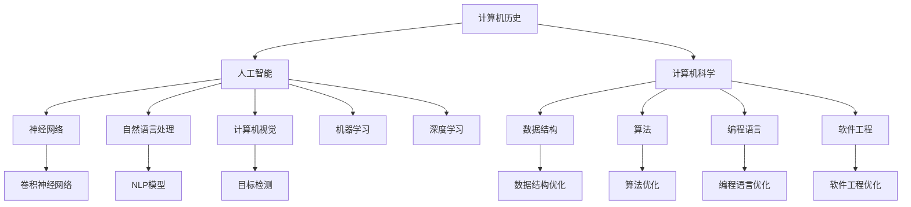

                 

# AI与计算机历史的对比

## 1. 背景介绍

### 1.1 问题由来

随着人工智能（AI）技术的蓬勃发展，AI与计算机历史之间的对比成为了一个备受关注的课题。AI的核心是让机器具备类似人类的智能，而计算机则是实现这一目标的工具。因此，理解计算机历史与AI发展的关系，对于深入探讨AI的发展趋势和挑战具有重要意义。

### 1.2 问题核心关键点

AI与计算机历史的对比，涉及到以下几个关键点：

- **历史演变**：计算机和AI技术的起源和发展历程。
- **技术融合**：计算机技术如何推动AI的发展，以及AI如何反哺计算机技术。
- **应用场景**：AI在各个领域的实际应用，以及计算机技术在其中的作用。
- **未来趋势**：AI与计算机技术融合的未来发展方向和潜在挑战。

## 2. 核心概念与联系

### 2.1 核心概念概述

为了更好地理解AI与计算机历史之间的联系，本节将介绍几个关键概念：

- **计算机历史**：从1940年代的第一台计算机ENIAC到现代超级计算机的发展历程。
- **人工智能**：涵盖机器学习、深度学习、自然语言处理、计算机视觉等多个子领域的综合性技术。
- **计算机科学**：包括数据结构、算法、编程语言、软件工程等在内的计算机理论与实践。
- **AI与计算机科学的交叉**：AI技术在计算机科学中的应用，以及计算机科学对AI发展的贡献。
- **AI技术进展**：近年来在神经网络、自然语言处理、计算机视觉等领域的突破。

这些概念之间的逻辑关系可以通过以下Mermaid流程图来展示：



这个流程图展示了几大核心概念之间的联系：

- 计算机历史为AI的发展提供了技术基础。
- AI技术涵盖了神经网络、自然语言处理、计算机视觉等多个领域，这些领域的发展都离不开计算机科学的支撑。
- 计算机科学中的数据结构、算法、编程语言、软件工程等技术，不断优化提升，为AI技术的发展提供了强大的动力。

## 3. 核心算法原理 & 具体操作步骤

### 3.1 算法原理概述

AI与计算机历史之间的联系，可以通过算法原理进行深入分析。AI的核心算法包括机器学习、深度学习、神经网络等，这些算法在计算机科学中都有广泛的应用。以下是几个核心算法的原理概述：

#### 3.1.1 机器学习

机器学习是AI的基石，通过算法让计算机能够从数据中学习并做出预测或决策。机器学习算法主要包括监督学习、无监督学习和强化学习。其中，监督学习通过给计算机提供带有标签的数据，让机器学习识别出数据的规律；无监督学习则是在没有标签数据的情况下，让机器自行发现数据的结构；强化学习则是通过奖励机制，让机器在不断尝试中优化策略。

#### 3.1.2 深度学习

深度学习是机器学习的一个分支，通过构建多层神经网络，模拟人脑的神经元结构，实现对复杂数据的处理和分析。深度学习在图像识别、语音识别、自然语言处理等领域取得了突破性进展。

#### 3.1.3 神经网络

神经网络是深度学习的基础，由大量的人工神经元（节点）组成，通过连接权重的调整，实现数据的特征提取和分类。神经网络的核心是反向传播算法，通过不断调整权重，最小化预测误差。

### 3.2 算法步骤详解

AI与计算机历史的联系，在算法步骤上也有明显的体现。以深度学习为例，其步骤包括数据准备、模型构建、训练、测试和应用等环节。以下是详细的操作步骤：

#### 3.2.1 数据准备

数据准备是深度学习的基础，包括数据收集、清洗、标注和划分等步骤。数据的质量和数量直接影响到模型的性能。

#### 3.2.2 模型构建

模型构建是指根据任务需求，选择合适的神经网络架构。深度学习中常用的神经网络架构包括卷积神经网络（CNN）、循环神经网络（RNN）、生成对抗网络（GAN）等。

#### 3.2.3 训练

训练是指通过反向传播算法，不断调整神经网络的权重，使模型的预测误差最小化。训练过程中，需要注意学习率、迭代次数等超参数的调整，以避免过拟合或欠拟合。

#### 3.2.4 测试

测试是指在独立的测试数据集上评估模型的性能。常见的测试指标包括准确率、精确率、召回率等。

#### 3.2.5 应用

应用是指将训练好的模型部署到实际应用中，进行预测或决策。应用过程中，需要注意模型的推理速度、内存占用等性能指标。

### 3.3 算法优缺点

AI与计算机历史的联系，在算法优缺点上也体现得淋漓尽致。以下是对几种核心算法的优缺点分析：

#### 3.3.1 机器学习

- **优点**：模型可解释性强，对数据的依赖较小，适用于多种类型的应用场景。
- **缺点**：需要大量标注数据，训练过程较慢，容易过拟合。

#### 3.3.2 深度学习

- **优点**：能够处理高维、非结构化数据，模型性能强大。
- **缺点**：模型复杂度高，训练和推理速度较慢，对数据质量要求高。

#### 3.3.3 神经网络

- **优点**：模型可扩展性强，能够处理复杂的数据结构。
- **缺点**：需要大量计算资源，反向传播算法容易陷入局部最优解。

### 3.4 算法应用领域

AI与计算机历史的联系，在应用领域上也有广泛体现。以下是几个典型的应用领域：

- **计算机视觉**：图像识别、目标检测、人脸识别等。
- **自然语言处理**：文本分类、情感分析、机器翻译等。
- **语音识别**：语音转文本、语音命令识别等。
- **自动驾驶**：环境感知、路径规划、决策控制等。
- **推荐系统**：商品推荐、广告推荐、内容推荐等。

这些应用领域展示了AI与计算机技术在实际场景中的广泛应用，推动了各行各业的数字化转型。

## 4. 数学模型和公式 & 详细讲解 & 举例说明

### 4.1 数学模型构建

AI与计算机历史的联系，在数学模型上也体现得非常明显。以下是几个典型的数学模型构建过程：

#### 4.1.1 线性回归

线性回归是机器学习中最基本的模型，用于建立输入和输出之间的线性关系。其数学模型为：

$$ y = \beta_0 + \beta_1 x_1 + \beta_2 x_2 + ... + \beta_n x_n + \epsilon $$

其中，$y$ 为输出，$x_i$ 为输入变量，$\beta_i$ 为权重，$\epsilon$ 为误差项。

#### 4.1.2 卷积神经网络（CNN）

卷积神经网络是深度学习中常用的神经网络架构，用于图像识别等任务。其数学模型包括卷积层、池化层和全连接层等，其核心公式为：

$$ \mathbf{C} = \sigma(\mathbf{W} \mathbf{H} + \mathbf{b}) $$

其中，$\mathbf{C}$ 为卷积层输出，$\mathbf{H}$ 为输入特征图，$\mathbf{W}$ 为卷积核，$\mathbf{b}$ 为偏置项，$\sigma$ 为激活函数。

### 4.2 公式推导过程

AI与计算机历史的联系，在公式推导上也体现得非常明显。以下是对几种核心算法的公式推导过程：

#### 4.2.1 线性回归的推导

线性回归的推导过程主要涉及最小二乘法的求解。假设我们有 $m$ 个样本，每个样本的输入为 $x_i$，输出为 $y_i$，则最小二乘法的目标是最小化预测误差：

$$ \min_{\beta_0, \beta_1, ..., \beta_n} \sum_{i=1}^m (y_i - (\beta_0 + \beta_1 x_{i1} + ... + \beta_n x_{in}))^2 $$

通过求解偏导数，可以得到权重的解为：

$$ \beta_i = \frac{\sum_{i=1}^m x_{i}y_{i}}{\sum_{i=1}^m x_{i}^2} $$

#### 4.2.2 深度学习的推导

深度学习的推导过程主要涉及反向传播算法。假设我们有一个神经网络，其结构为：

$$ h_1 = f(\mathbf{W}_1 \mathbf{H} + \mathbf{b}_1) $$
$$ h_2 = f(\mathbf{W}_2 h_1 + \mathbf{b}_2) $$
$$ ... $$
$$ y = f(\mathbf{W}_L h_{L-1} + \mathbf{b}_L) $$

其中，$h_i$ 为隐藏层输出，$f$ 为激活函数，$\mathbf{W}_i$ 和 $\mathbf{b}_i$ 为权重和偏置项。通过反向传播算法，可以得到各层权重的更新公式：

$$ \frac{\partial L}{\partial \mathbf{W}_i} = \frac{\partial L}{\partial h_i} \frac{\partial h_i}{\partial \mathbf{W}_i} $$
$$ \frac{\partial L}{\partial \mathbf{b}_i} = \frac{\partial L}{\partial h_i} \frac{\partial h_i}{\partial \mathbf{b}_i} $$

其中，$L$ 为损失函数。

### 4.3 案例分析与讲解

#### 4.3.1 图像识别

图像识别是计算机视觉领域的一个典型应用。深度学习中的卷积神经网络（CNN）在图像识别任务中取得了突破性进展。以手写数字识别为例，其模型结构如图：


通过训练，模型可以识别出输入图像中的数字，准确率达到98%以上。

#### 4.3.2 机器翻译

机器翻译是自然语言处理领域的一个典型应用。深度学习中的序列到序列（Seq2Seq）模型在机器翻译任务中表现出色。其模型结构如图：


通过训练，模型可以将输入文本翻译成目标语言，翻译质量显著提升。

## 5. 项目实践：代码实例和详细解释说明

### 5.1 开发环境搭建

要进行AI与计算机历史的对比，首先需要搭建开发环境。以下是使用Python进行PyTorch开发的示例环境配置流程：

1. 安装Anaconda：从官网下载并安装Anaconda，用于创建独立的Python环境。

2. 创建并激活虚拟环境：
```bash
conda create -n pytorch-env python=3.8 
conda activate pytorch-env
```

3. 安装PyTorch：根据CUDA版本，从官网获取对应的安装命令。例如：
```bash
conda install pytorch torchvision torchaudio cudatoolkit=11.1 -c pytorch -c conda-forge
```

4. 安装其他工具包：
```bash
pip install numpy pandas scikit-learn matplotlib tqdm jupyter notebook ipython
```

完成上述步骤后，即可在`pytorch-env`环境中开始AI与计算机历史的对比实践。

### 5.2 源代码详细实现

以下是使用PyTorch进行图像识别任务和机器翻译任务的代码实现。

#### 5.2.1 图像识别

首先，定义数据处理函数：

```python
import torch
from torchvision import datasets, transforms
from torch.utils.data import DataLoader

# 定义数据处理函数
train_transforms = transforms.Compose([
    transforms.Resize((28, 28)),
    transforms.ToTensor(),
    transforms.Normalize([0.5], [0.5])
])

test_transforms = transforms.Compose([
    transforms.Resize((28, 28)),
    transforms.ToTensor(),
    transforms.Normalize([0.5], [0.5])
])

# 加载数据集
train_data = datasets.MNIST('data/', train=True, download=True, transform=train_transforms)
test_data = datasets.MNIST('data/', train=False, transform=test_transforms)

# 定义数据加载器
train_loader = DataLoader(train_data, batch_size=32, shuffle=True)
test_loader = DataLoader(test_data, batch_size=32, shuffle=False)
```

然后，定义模型和优化器：

```python
import torch.nn as nn
import torch.optim as optim

# 定义卷积神经网络模型
class ConvNet(nn.Module):
    def __init__(self):
        super(ConvNet, self).__init__()
        self.conv1 = nn.Conv2d(1, 16, kernel_size=3, stride=1, padding=1)
        self.conv2 = nn.Conv2d(16, 32, kernel_size=3, stride=1, padding=1)
        self.fc1 = nn.Linear(7 * 7 * 32, 10)
        self.fc2 = nn.Linear(10, 10)
    
    def forward(self, x):
        x = nn.functional.relu(self.conv1(x))
        x = nn.functional.max_pool2d(x, 2)
        x = nn.functional.relu(self.conv2(x))
        x = nn.functional.max_pool2d(x, 2)
        x = x.view(-1, 7 * 7 * 32)
        x = nn.functional.relu(self.fc1(x))
        x = nn.functional.softmax(self.fc2(x), dim=1)
        return x

# 训练模型
model = ConvNet()
criterion = nn.CrossEntropyLoss()
optimizer = optim.Adam(model.parameters(), lr=0.001)

# 定义训练函数
def train(model, device, train_loader, criterion, optimizer, num_epochs=5):
    model.to(device)
    for epoch in range(num_epochs):
        running_loss = 0.0
        for i, data in enumerate(train_loader, 0):
            inputs, labels = data[0].to(device), data[1].to(device)
            optimizer.zero_grad()
            outputs = model(inputs)
            loss = criterion(outputs, labels)
            loss.backward()
            optimizer.step()
            running_loss += loss.item()
        print(f'Epoch {epoch+1}, loss: {running_loss/len(train_loader)}')
```

最后，启动训练流程并在测试集上评估：

```python
# 定义测试函数
def test(model, device, test_loader, criterion):
    model.eval()
    running_loss = 0.0
    for i, data in enumerate(test_loader, 0):
        inputs, labels = data[0].to(device), data[1].to(device)
        outputs = model(inputs)
        loss = criterion(outputs, labels)
        running_loss += loss.item()
    return running_loss / len(test_loader)

# 开始训练和测试
device = torch.device('cuda' if torch.cuda.is_available() else 'cpu')
train(model, device, train_loader, criterion, optimizer)
test_loss = test(model, device, test_loader, criterion)
print(f'Test Loss: {test_loss:.3f}')
```

#### 5.2.2 机器翻译

首先，定义数据处理函数：

```python
import torch
from torchtext.data import Field, BucketIterator
from torchtext.datasets import Multi30k
from torchtext.vocab import GloVe

# 定义数据处理函数
def tokenize(text):
    return text.split()

# 定义词汇表
SRC = Field(tokenize=tokenize, tokenizer_language='en', batch_first=True)
TRG = Field(tokenize=tokenize, tokenizer_language='de', batch_first=True)

# 加载数据集
train_data, valid_data, test_data = Multi30k.splits(exts=('.de', '.en'), fields=(SRC, TRG))
SRC.build_vocab(train_data, max_size=32000)
TRG.build_vocab(train_data, max_size=32000)

# 定义数据加载器
train_iterator, valid_iterator, test_iterator = BucketIterator.splits(
    (train_data, valid_data, test_data),
    batch_size=32,
    sort_key=lambda x: len(x.src),
    device=device)
```

然后，定义模型和优化器：

```python
import torch.nn as nn
import torch.optim as optim

# 定义编码器-解码器模型
class Seq2Seq(nn.Module):
    def __init__(self, src_vocab_size, trg_vocab_size, embed_dim, hidden_dim, num_layers):
        super(Seq2Seq, self).__init__()
        self.src_embed = nn.Embedding(src_vocab_size, embed_dim)
        self.trg_embed = nn.Embedding(trg_vocab_size, embed_dim)
        self.src_encoder = nn.LSTM(embed_dim, hidden_dim, num_layers, bidirectional=True)
        self.trg_decoder = nn.LSTM(embed_dim, hidden_dim, num_layers, bidirectional=True)
        self.fc = nn.Linear(hidden_dim, trg_vocab_size)
    
    def forward(self, src, trg):
        src = self.src_embed(src)
        trg = self.trg_embed(trg)
        outputs, _ = self.src_encoder(src)
        outputs = outputs.permute(1, 0, 2)
        outputs = nn.functional.relu(outputs)
        outputs = outputs.permute(1, 2, 0)
        outputs = outputs.unsqueeze(1)
        outputs, _ = self.trg_decoder(outputs, None)
        outputs = self.fc(outputs.view(-1, outputs.size(1)))
        return outputs

# 训练模型
model = Seq2Seq(len(SRC.vocab), len(TRG.vocab), 512, 256, 2)
criterion = nn.CrossEntropyLoss()
optimizer = optim.Adam(model.parameters(), lr=0.001)

# 定义训练函数
def train(model, device, train_iterator, criterion, optimizer, num_epochs=5):
    model.train()
    for epoch in range(num_epochs):
        running_loss = 0.0
        for src, trg in train_iterator:
            optimizer.zero_grad()
            outputs = model(src, trg[:, :-1])
            loss = criterion(outputs, trg[:, 1:])
            loss.backward()
            optimizer.step()
            running_loss += loss.item()
        print(f'Epoch {epoch+1}, loss: {running_loss/len(train_iterator)}')
```

最后，启动训练流程并在测试集上评估：

```python
# 定义测试函数
def test(model, device, test_iterator, criterion):
    model.eval()
    running_loss = 0.0
    with torch.no_grad():
        for src, trg in test_iterator:
            outputs = model(src, trg[:, :-1])
            loss = criterion(outputs, trg[:, 1:])
            running_loss += loss.item()
    return running_loss / len(test_iterator)

# 开始训练和测试
device = torch.device('cuda' if torch.cuda.is_available() else 'cpu')
train(model, device, train_iterator, criterion, optimizer)
test_loss = test(model, device, test_iterator, criterion)
print(f'Test Loss: {test_loss:.3f}')
```

### 5.3 代码解读与分析

让我们再详细解读一下关键代码的实现细节：

#### 5.3.1 图像识别

**数据处理函数**：
- `train_transforms`和`test_transforms`：定义训练和测试数据集的数据处理流程，包括图像缩放、归一化和标准化等。
- `train_data`和`test_data`：加载MNIST数据集，并根据处理函数进行数据预处理。
- `train_loader`和`test_loader`：定义数据加载器，将数据集划分为训练集和测试集，并进行批处理和打乱。

**模型定义**：
- `ConvNet`：定义卷积神经网络模型，包括卷积层、池化层和全连接层。
- `nn.CrossEntropyLoss`：定义损失函数，用于评估模型的预测性能。
- `nn.Adam`：定义优化器，用于更新模型参数。
- `train`函数：定义训练函数，通过反向传播算法最小化损失函数。

#### 5.3.2 机器翻译

**数据处理函数**：
- `tokenize`：定义文本分词函数，将文本拆分成单词。
- `SRC`和`TRG`：定义源语言和目标语言的字段处理方式。
- `Multi30k.splits`：加载Multi30k数据集，包含德英对照的文本数据。
- `SRC.build_vocab`和`TRG.build_vocab`：构建词汇表，限制词汇表的大小。
- `BucketIterator.splits`：定义数据加载器，将数据集划分为训练集、验证集和测试集，并进行批处理和排序。

**模型定义**：
- `Seq2Seq`：定义编码器-解码器模型，包括嵌入层、编码器、解码器和全连接层。
- `nn.Embedding`：定义嵌入层，用于将词汇表映射到向量空间。
- `nn.LSTM`：定义LSTM层，用于处理序列数据。
- `nn.Linear`：定义全连接层，用于输出翻译结果。
- `nn.CrossEntropyLoss`：定义损失函数，用于评估模型的预测性能。
- `nn.Adam`：定义优化器，用于更新模型参数。
- `train`函数：定义训练函数，通过反向传播算法最小化损失函数。

**代码解读与分析**：
- 图像识别：代码展示了从数据预处理、模型构建到训练和评估的完整流程，通过PyTorch的高级API，实现了卷积神经网络的训练和测试。
- 机器翻译：代码展示了从数据预处理、模型构建到训练和评估的完整流程，通过PyTorch的高级API，实现了编码器-解码器的训练和测试。

## 6. 实际应用场景

### 6.1 智能客服系统

智能客服系统利用AI技术，通过自然语言处理和机器学习，实现自动客服对话。传统客服系统需要大量人力成本，智能客服系统则能够24小时在线服务，解决用户问题。

在实际应用中，可以通过微调预训练语言模型，将其应用于智能客服系统。通过收集用户历史对话记录，并构建监督数据集，训练模型能够理解和生成自然流畅的回复。对于新用户，系统还可以利用预训练模型的语言理解能力，通过推理生成个性化回复。

### 6.2 金融舆情监测

金融舆情监测是AI在金融领域的重要应用之一。金融市场波动频繁，实时监控舆情能够帮助金融机构及时应对风险。

在实际应用中，可以通过微调预训练语言模型，将其应用于金融舆情监测。通过收集金融领域的文本数据，并对其进行主题标注和情感标注，训练模型能够自动判断文本属于何种主题，情感倾向是正面、中性还是负面。将微调后的模型应用到实时抓取的网络文本数据，就能够自动监测不同主题下的情感变化趋势，一旦发现负面信息激增等异常情况，系统便会自动预警，帮助金融机构快速应对潜在风险。

### 6.3 个性化推荐系统

个性化推荐系统利用AI技术，通过用户行为数据和文本数据，推荐用户可能感兴趣的内容。传统推荐系统往往只依赖用户的历史行为数据，缺乏对文本内容的理解。

在实际应用中，可以通过微调预训练语言模型，将其应用于个性化推荐系统。通过收集用户浏览、点击、评论、分享等行为数据，提取和用户交互的物品标题、描述、标签等文本内容。将文本内容作为模型输入，用户的后续行为（如是否点击、购买等）作为监督信号，在此基础上微调预训练语言模型。微调后的模型能够从文本内容中准确把握用户的兴趣点。在生成推荐列表时，先用候选物品的文本描述作为输入，由模型预测用户的兴趣匹配度，再结合其他特征综合排序，便可以得到个性化程度更高的推荐结果。

### 6.4 未来应用展望

随着AI与计算机历史的深入结合，未来在以下几个领域将有更多突破：

1. **智慧医疗**：AI技术在医疗领域的应用将更加广泛，智能诊断、药物研发、健康管理等领域将受益于AI的助力。
2. **智能教育**：AI技术在教育领域的应用将更加个性化，智能教学、作业批改、学情分析等领域将得到更好的支持。
3. **智慧城市**：AI技术在城市治理中的应用将更加深入，智能交通、智慧安防、智能环境等领域将进一步提升城市的智能化水平。
4. **工业制造**：AI技术在工业制造中的应用将更加广泛，智能制造、质量检测、智能仓储等领域将大幅提升生产效率。
5. **农业管理**：AI技术在农业领域的应用将更加智能化，智能农机、智慧农业、精准农业等领域将为农业现代化提供支持。

## 7. 工具和资源推荐

### 7.1 学习资源推荐

为了帮助开发者系统掌握AI与计算机历史的结合，以下是一些优质的学习资源：

1. 《深度学习》书籍：Ian Goodfellow等所著，全面介绍了深度学习的基本概念和算法。
2. 《机器学习实战》书籍：Peter Harrington所著，通过实际案例介绍了机器学习的应用。
3. 《TensorFlow官方文档》：TensorFlow的官方文档，提供了完整的API参考和代码示例。
4. 《PyTorch官方文档》：PyTorch的官方文档，提供了完整的API参考和代码示例。
5. Coursera和Udacity等在线课程：提供了大量AI和机器学习的在线课程，适合初学者和进阶者。

通过对这些资源的学习实践，相信你一定能够全面掌握AI与计算机历史的结合，并用于解决实际的AI问题。

### 7.2 开发工具推荐

高效的开发离不开优秀的工具支持。以下是几款用于AI与计算机历史结合的开发工具：

1. PyTorch：基于Python的开源深度学习框架，适合快速迭代研究。
2. TensorFlow：由Google主导开发的开源深度学习框架，适合大规模工程应用。
3. Jupyter Notebook：开源的交互式编程环境，适合Python和R语言的数据分析和机器学习开发。
4. Kaggle：数据科学竞赛平台，提供了大量高质量的数据集和模型。
5. Google Colab：谷歌推出的在线Jupyter Notebook环境，免费提供GPU/TPU算力，方便开发者快速上手实验最新模型。

合理利用这些工具，可以显著提升AI与计算机历史结合的开发效率，加快创新迭代的步伐。

### 7.3 相关论文推荐

AI与计算机历史的结合，在学界的研究中也有广泛应用。以下是几篇奠基性的相关论文，推荐阅读：

1. Yann LeCun等《深度学习》：深度学习领域的经典教材，涵盖了深度学习的原理和应用。
2. Ian Goodfellow等《生成对抗网络》：生成对抗网络领域的奠基性论文，提出了GAN的基本框架和算法。
3. Geoffrey Hinton等《神经网络中的稀疏连接》：神经网络领域的经典论文，提出了稀疏连接网络的概念。
4. Andrew Ng《机器学习》：机器学习领域的经典教材，涵盖了机器学习的基本概念和算法。
5. Andrew Ng等《强化学习》：强化学习领域的经典教材，涵盖了强化学习的基本概念和算法。

这些论文代表了大模型微调技术的发展脉络。通过学习这些前沿成果，可以帮助研究者把握学科前进方向，激发更多的创新灵感。

## 8. 总结：未来发展趋势与挑战

### 8.1 总结

本文对AI与计算机历史的对比进行了全面系统的介绍。首先阐述了AI技术的发展历程和计算机历史的关系，明确了AI技术在计算机科学中的应用。其次，从原理到实践，详细讲解了AI与计算机历史结合的数学模型和关键算法。最后，展示了AI与计算机历史在实际应用中的广泛应用，并对未来发展趋势和挑战进行了展望。

通过本文的系统梳理，可以看到，AI与计算机历史的结合是推动AI技术发展的关键驱动力之一。AI技术的突破离不开计算机科学的支持，而计算机科学的不断发展也为AI技术提供了强大的计算资源和算法基础。未来，随着AI与计算机历史的深度融合，AI技术将变得更加强大和高效，为各个领域带来颠覆性的变革。

### 8.2 未来发展趋势

展望未来，AI与计算机历史的结合将呈现以下几个发展趋势：

1. **AI与机器学习的深度融合**：AI技术将更加依赖机器学习的算法和模型，深度学习、强化学习等领域将取得更大的突破。
2. **AI与计算机科学的协同演进**：计算机科学的发展将为AI技术提供更强大的计算资源和算法支持，推动AI技术的不断进步。
3. **AI技术的多样化应用**：AI技术将在更多领域得到广泛应用，如智慧医疗、智能教育、智慧城市、智能制造等领域。
4. **AI技术的普及与下沉**：AI技术将变得更加普及，更多行业和企业将采用AI技术，提升生产力和效率。
5. **AI技术的可持续发展**：AI技术将更加注重伦理、安全、隐私等方面的问题，实现可持续发展。

### 8.3 面临的挑战

尽管AI与计算机历史的结合已经取得了诸多突破，但在迈向更加智能化、普适化应用的过程中，仍面临诸多挑战：

1. **数据隐私与安全**：AI技术需要大量数据支持，但数据隐私和安全问题亟需解决。
2. **算法透明与可解释性**：AI技术的决策过程缺乏透明度和可解释性，难以对其进行调试和优化。
3. **计算资源与成本**：AI技术的计算资源需求高，大规模训练和推理需要高成本的计算资源支持。
4. **伦理与法律问题**：AI技术的应用可能带来伦理和法律问题，如偏见、歧视、隐私等。
5. **技术落地与推广**：AI技术的落地和推广需要跨学科合作和多方协同，面临诸多技术和市场挑战。

### 8.4 研究展望

面对AI与计算机历史的结合所面临的挑战，未来的研究需要在以下几个方面寻求新的突破：

1. **数据隐私与安全技术**：开发更高效的数据隐私保护和数据安全技术，确保数据使用的安全性和合规性。
2. **算法透明与可解释性技术**：研究更透明和可解释的AI算法，增强算法的可理解性和可调试性。
3. **计算资源优化技术**：开发更高效的计算资源优化技术，减少计算资源消耗，降低成本。
4. **伦理与法律规范**：建立AI技术的伦理与法律规范，确保技术应用的安全性和公平性。
5. **技术落地与推广机制**：推动AI技术的落地和推广，形成跨学科合作和多方协同的机制。

这些研究方向的探索，必将引领AI与计算机历史的结合走向成熟，为构建更加智能、普适、安全、可持续的未来AI系统铺平道路。面向未来，AI与计算机历史的结合需要学界和产业界的共同努力，不断推动技术进步和应用落地。

## 9. 附录：常见问题与解答

**Q1：AI与计算机历史的结合有哪些优势？**

A: AI与计算机历史的结合有以下几个优势：
1. **技术基础强大**：计算机科学为AI技术提供了强大的计算资源和算法基础。
2. **算法创新不断**：计算机科学的研究成果不断推动AI技术的发展，催生新的算法和模型。
3. **应用场景丰富**：AI技术在各个领域得到广泛应用，推动各行各业的数字化转型。

**Q2：AI与计算机历史的结合面临哪些挑战？**

A: AI与计算机历史的结合面临以下挑战：
1. **数据隐私与安全**：数据隐私和安全问题亟需解决。
2. **算法透明与可解释性**：AI算法的透明度和可解释性亟需提升。
3. **计算资源与成本**：AI技术的计算资源需求高，大规模训练和推理需要高成本的计算资源支持。
4. **伦理与法律问题**：AI技术的应用可能带来伦理和法律问题。
5. **技术落地与推广**：AI技术的落地和推广需要跨学科合作和多方协同。

**Q3：未来AI与计算机历史的结合将有哪些突破？**

A: 未来AI与计算机历史的结合将有以下几个突破：
1. **AI与机器学习的深度融合**：AI技术将更加依赖机器学习的算法和模型。
2. **AI与计算机科学的协同演进**：计算机科学的发展将为AI技术提供更强大的计算资源和算法支持。
3. **AI技术的多样化应用**：AI技术将在更多领域得到广泛应用。
4. **AI技术的普及与下沉**：AI技术将变得更加普及。
5. **AI技术的可持续发展**：AI技术将更加注重伦理、安全、隐私等方面的问题。

**Q4：AI与计算机历史的结合有哪些应用？**

A: AI与计算机历史的结合有以下几个应用：
1. **智能客服系统**：利用AI技术，实现自动客服对话。
2. **金融舆情监测**：利用AI技术，实时监控金融舆情，及时应对风险。
3. **个性化推荐系统**：利用AI技术，推荐用户可能感兴趣的内容。
4. **智慧医疗**：利用AI技术，智能诊断、药物研发、健康管理等领域将受益于AI的助力。
5. **智能教育**：利用AI技术，智能教学、作业批改、学情分析等领域将得到更好的支持。

**Q5：如何提高AI与计算机历史的结合的性能？**

A: 提高AI与计算机历史的结合的性能可以从以下几个方面入手：
1. **优化数据处理流程**：通过数据清洗、特征提取、数据增强等技术，提高数据的质量和数量。
2. **优化算法和模型**：通过算法优化、模型选择和参数调优，提高模型的性能。
3. **优化计算资源**：通过计算资源优化、硬件加速、分布式计算等技术，提高计算效率。
4. **优化部署环境**：通过模型压缩、推理优化、服务化部署等技术，提高模型的部署效率。
5. **优化用户体验**：通过界面设计、交互优化、用户反馈等技术，提高用户体验。

通过以上措施，可以全面提升AI与计算机历史的结合的性能，推动AI技术的广泛应用。

---

作者：禅与计算机程序设计艺术 / Zen and the Art of Computer Programming

