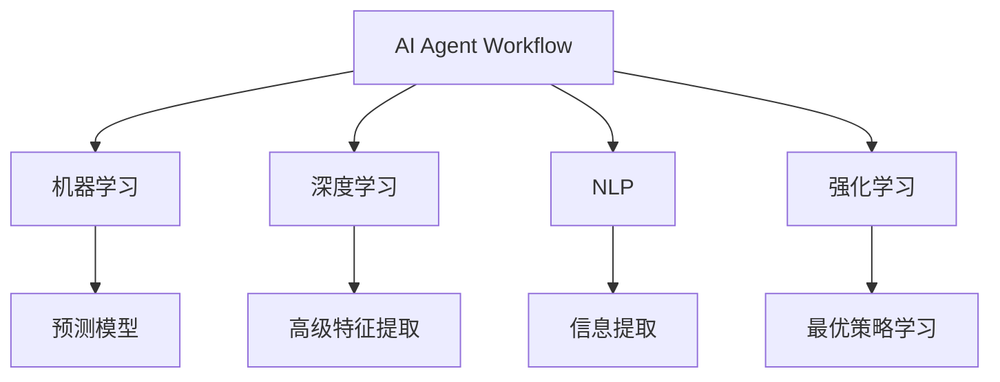

                 

# AI人工智能代理工作流 AI Agent Workflow：在股票市场预测中的应用

## 1. 背景介绍

### 1.1 问题由来
随着金融市场日益复杂化和全球化，股票市场预测已经成为金融分析师、投资经理和量化交易者必备的关键工具。传统的股票市场预测方法，如技术分析和基本面分析，虽然已经积累了丰富的经验和理论，但依然存在诸多局限。例如，技术分析依赖于历史数据和图形分析，难以充分考虑动态市场因素；基本面分析则主要依赖公司财务报表和宏观经济指标，忽视了市场情绪和意外事件的影响。

近年来，人工智能技术，尤其是机器学习和深度学习算法，为股票市场预测提供了全新的解决方案。通过分析海量历史数据和实时市场数据，AI模型可以发现更深层次的市场规律和趋势，从而实现更准确的预测。人工智能代理工作流（AI Agent Workflow），作为一种基于AI的自动化工作流，通过整合多种预测模型和数据源，形成了一套灵活、高效的股票市场预测框架。本文将深入探讨AI Agent Workflow的设计原理、操作步骤和应用实例，帮助读者系统掌握这一前沿技术。

## 2. 核心概念与联系

### 2.1 核心概念概述

为更好地理解AI Agent Workflow，我们需要首先介绍几个关键概念：

- **AI Agent Workflow**：一种基于人工智能技术的自动化工作流，用于自动化处理复杂任务，特别是金融领域的股票市场预测。它通过整合多种AI预测模型和数据源，形成了一套灵活、高效的市场预测框架。

- **机器学习（Machine Learning, ML）**：一种通过数据驱动的方法，使计算机能够从经验中学习和改进的技术。它是AI Agent Workflow的核心组成部分之一，用于构建预测模型。

- **深度学习（Deep Learning, DL）**：一种特殊的机器学习技术，通过多层次神经网络模型，自动提取数据中的高级特征，从而实现更强大的预测能力。

- **自然语言处理（Natural Language Processing, NLP）**：一种使计算机能够理解和生成人类语言的技术，常用于从新闻、公告等非结构化数据中提取有价值的信息。

- **强化学习（Reinforcement Learning, RL）**：一种基于奖励信号的学习方法，使智能体能够通过与环境的交互，学习最优的策略和决策。

这些核心概念之间的逻辑关系可以通过以下Mermaid流程图来展示：



这个流程图展示了一些关键概念之间的关系：

1. AI Agent Workflow通过机器学习构建预测模型。
2. 深度学习用于提取高级特征，增强模型预测能力。
3. NLP用于处理非结构化数据，提取有用信息。
4. 强化学习用于学习最优策略，优化预测结果。

## 3. 核心算法原理 & 具体操作步骤

### 3.1 算法原理概述

AI Agent Workflow的核心原理是通过多个AI模型对市场数据进行综合分析和预测，形成最终的预测结果。其核心步骤如下：

1. **数据采集与预处理**：从不同数据源（如历史股价、新闻、公告、社交媒体等）采集数据，并进行预处理，包括数据清洗、归一化等操作。

2. **特征提取**：使用深度学习模型从历史股价、新闻文本等数据中提取高级特征，形成输入向量。

3. **模型融合**：使用集成学习方法（如Bagging、Boosting等）对多个预测模型（如线性回归、随机森林、神经网络等）的预测结果进行融合，生成最终的预测结果。

4. **实时更新**：通过实时监控市场动态，不断更新模型参数，提高预测精度。

### 3.2 算法步骤详解

#### 3.2.1 数据采集与预处理

- **数据源选择**：根据预测任务需要，选择适当的市场数据源，如历史股价、财务报表、新闻、公告、社交媒体等。
- **数据清洗**：去除缺失值、异常值等无用或错误数据，确保数据质量。
- **数据归一化**：对不同来源的数据进行归一化处理，使不同特征具有相同的权重。

#### 3.2.2 特征提取

- **深度学习模型选择**：选择适合的深度学习模型，如卷积神经网络（CNN）、循环神经网络（RNN）、Transformer等，用于提取高级特征。
- **特征向量生成**：使用训练好的深度学习模型，将历史股价、新闻文本等数据转换为特征向量，用于后续模型训练和预测。

#### 3.2.3 模型融合

- **预测模型选择**：根据任务需求，选择适合的预测模型，如线性回归、随机森林、神经网络等。
- **模型训练**：使用训练数据对预测模型进行训练，生成初步的预测结果。
- **模型融合**：使用集成学习方法（如Bagging、Boosting等）对多个预测模型的结果进行融合，生成最终的预测结果。

#### 3.2.4 实时更新

- **市场动态监控**：实时监控市场动态，包括股价波动、新闻发布、公告等，及时更新模型参数。
- **参数更新**：根据实时动态，动态调整模型参数，提高预测精度。

### 3.3 算法优缺点

AI Agent Workflow作为一种先进的股票市场预测工具，具有以下优点：

- **高效性**：通过自动化处理，AI Agent Workflow可以显著提高市场预测的效率。
- **准确性**：通过多模型融合和实时更新，AI Agent Workflow能够提高预测的准确性。
- **灵活性**：可以根据任务需求，灵活选择不同的数据源和模型，适应不同的市场环境和预测任务。

然而，AI Agent Workflow也存在一些缺点：

- **依赖数据源**：其预测能力高度依赖于数据源的质量和数量，需要持续维护和更新数据源。
- **模型复杂性**：多模型融合和实时更新增加了模型的复杂性，需要更高的技术要求。
- **成本较高**：开发和维护AI Agent Workflow需要较高的技术投入和资源成本。

### 3.4 算法应用领域

AI Agent Workflow已经在多个金融领域得到应用，包括股票市场预测、债券定价、风险评估等。以下是一些典型的应用场景：

- **股票市场预测**：通过综合分析历史股价、新闻、公告等数据，AI Agent Workflow可以预测未来股价走势，为投资者提供决策依据。
- **债券定价**：AI Agent Workflow可以分析债券市场的历史数据和实时动态，预测债券的收益率和价格变化，帮助投资者进行债券定价和交易。
- **风险评估**：AI Agent Workflow可以评估市场的风险水平，预测未来市场波动，帮助投资者规避风险。

## 4. 数学模型和公式 & 详细讲解 & 举例说明

### 4.1 数学模型构建

AI Agent Workflow的数学模型构建主要包括以下几个关键步骤：

1. **数据采集与预处理**：将不同来源的数据转换为数值型数据，并进行归一化处理。

2. **特征提取**：使用深度学习模型从历史数据中提取高级特征，生成特征向量。

3. **模型训练与融合**：使用预测模型对特征向量进行训练，并使用集成学习方法对多个预测模型的结果进行融合。

4. **实时更新**：根据实时动态，动态调整模型参数，生成最终的预测结果。

### 4.2 公式推导过程

以下我们以股票市场预测为例，推导AI Agent Workflow的数学模型。

设历史股价为 $x_1, x_2, ..., x_n$，市场动态特征为 $y_1, y_2, ..., y_m$，则模型可以表示为：

$$
\hat{x}_t = f(x_{t-1}, x_{t-2}, ..., x_{t-T}, y_{t-1}, y_{t-2}, ..., y_{t-M}, \theta)
$$

其中，$f$ 为预测函数，$T$ 为历史股价的滑动窗口大小，$M$ 为市场动态特征的滑动窗口大小，$\theta$ 为模型参数。

使用集成学习方法，预测函数可以表示为：

$$
\hat{x}_t = \frac{1}{K} \sum_{k=1}^K f_k(x_{t-1}, x_{t-2}, ..., x_{t-T}, y_{t-1}, y_{t-2}, ..., y_{t-M}, \theta_k)
$$

其中，$K$ 为集成模型中的预测模型数量，$f_k$ 为第 $k$ 个预测模型的预测函数，$\theta_k$ 为第 $k$ 个模型的参数。

### 4.3 案例分析与讲解

假设我们要预测某股票明天的收盘价，可以通过以下步骤实现：

1. **数据采集与预处理**：收集该股票过去一个月的历史股价数据，并将其归一化处理。

2. **特征提取**：使用LSTM模型从历史股价数据中提取高级特征，生成特征向量。

3. **模型训练与融合**：使用多个随机森林模型对特征向量进行训练，并使用Bagging方法对多个模型的结果进行融合。

4. **实时更新**：实时监控市场动态，如新闻发布、公告等，根据动态更新模型参数，生成最终的预测结果。

## 5. 项目实践：代码实例和详细解释说明

### 5.1 开发环境搭建

在进行AI Agent Workflow的开发实践前，我们需要准备好开发环境。以下是使用Python进行TensorFlow开发的环境配置流程：

1. 安装Anaconda：从官网下载并安装Anaconda，用于创建独立的Python环境。

2. 创建并激活虚拟环境：
```bash
conda create -n tf-env python=3.8 
conda activate tf-env
```

3. 安装TensorFlow：根据CUDA版本，从官网获取对应的安装命令。例如：
```bash
conda install tensorflow -c tensorflow
```

4. 安装各类工具包：
```bash
pip install numpy pandas scikit-learn matplotlib tqdm jupyter notebook ipython
```

完成上述步骤后，即可在`tf-env`环境中开始开发实践。

### 5.2 源代码详细实现

下面我们以股票市场预测为例，给出使用TensorFlow进行AI Agent Workflow开发的PyTorch代码实现。

首先，定义模型和优化器：

```python
import tensorflow as tf
from tensorflow.keras.layers import LSTM, Dense, Dropout
from tensorflow.keras.models import Sequential
from tensorflow.keras.optimizers import Adam

model = Sequential()
model.add(LSTM(64, input_shape=(n_steps, n_features), return_sequences=True))
model.add(Dropout(0.2))
model.add(LSTM(64))
model.add(Dropout(0.2))
model.add(Dense(1))

optimizer = Adam(learning_rate=0.001)
```

接着，定义训练和评估函数：

```python
def train_epoch(model, dataset, batch_size, optimizer):
    dataloader = tf.data.Dataset.from_tensor_slices(dataset).shuffle(buffer_size=10000).batch(batch_size)
    for epoch in range(num_epochs):
        for batch in dataloader:
            x, y = batch
            with tf.GradientTape() as tape:
                y_pred = model(x)
                loss = tf.reduce_mean(tf.square(y_pred - y))
            gradients = tape.gradient(loss, model.trainable_variables)
            optimizer.apply_gradients(zip(gradients, model.trainable_variables))
    return loss

def evaluate(model, dataset, batch_size):
    dataloader = tf.data.Dataset.from_tensor_slices(dataset).shuffle(buffer_size=10000).batch(batch_size)
    total_loss = 0
    for batch in dataloader:
        x, y = batch
        y_pred = model(x)
        total_loss += tf.reduce_mean(tf.square(y_pred - y))
    return total_loss / len(dataset)
```

最后，启动训练流程并在测试集上评估：

```python
num_epochs = 100
batch_size = 64

for epoch in range(num_epochs):
    train_loss = train_epoch(model, train_dataset, batch_size, optimizer)
    test_loss = evaluate(model, test_dataset, batch_size)
    print(f"Epoch {epoch+1}, train loss: {train_loss:.3f}, test loss: {test_loss:.3f}")

print("Final test loss:", evaluate(model, test_dataset, batch_size))
```

以上就是使用TensorFlow对AI Agent Workflow进行股票市场预测的完整代码实现。可以看到，TensorFlow提供了丰富的API和工具，使得模型构建和训练过程变得简洁高效。

### 5.3 代码解读与分析

让我们再详细解读一下关键代码的实现细节：

**定义模型和优化器**：
- `Sequential`模型：使用TensorFlow的Sequential模型，搭建LSTM+Dropout+Dense的预测模型。
- `LSTM`层：使用LSTM层提取历史股价数据中的高级特征。
- `Dropout`层：在LSTM层之间添加Dropout层，防止过拟合。
- `Dense`层：使用Dense层生成最终预测结果。
- `Adam`优化器：使用Adam优化器进行模型参数的优化。

**训练和评估函数**：
- `train_epoch`函数：定义训练循环，使用梯度下降优化模型参数。
- `evaluate`函数：定义评估循环，计算模型在测试集上的损失。

**训练流程**：
- 定义总的epoch数和batch size，开始循环迭代
- 每个epoch内，先进行训练，输出训练集上的平均损失
- 在测试集上评估，输出测试集上的平均损失

可以看到，TensorFlow的API使得模型构建和训练过程变得简洁高效，开发者可以更加专注于模型的核心逻辑和数据处理。

当然，工业级的系统实现还需考虑更多因素，如模型的保存和部署、超参数的自动搜索、更灵活的任务适配层等。但核心的AI Agent Workflow基本与此类似。

## 6. 实际应用场景

### 6.1 智能投资系统

AI Agent Workflow可以广泛应用于智能投资系统的构建。传统投资系统依赖于分析师的经验和判断，容易受到主观偏见和市场情绪的影响。而使用AI Agent Workflow，可以基于市场数据和历史股价，构建客观、准确的市场预测模型，辅助投资者做出更加科学合理的投资决策。

在技术实现上，可以收集历史股价、新闻、公告等市场数据，构建AI Agent Workflow模型，进行实时市场预测。同时，结合AI技术对交易信号的自动生成和执行，构建更高效的智能投资系统。

### 6.2 风险管理平台

金融机构需要实时监控市场风险，及时预警并应对潜在的风险事件。传统的风险管理平台依赖于人工监控和手动操作，效率低下且容易遗漏风险点。而使用AI Agent Workflow，可以实时分析市场数据，预测潜在风险事件，及时预警并自动化响应，提升风险管理效率。

具体而言，可以构建基于AI Agent Workflow的风险管理平台，实时监控市场动态，预测股票价格波动、市场情绪变化等风险因素。同时，结合自动化交易系统，根据预测结果进行风险规避和资产配置，实现智能化风险管理。

### 6.3 量化交易系统

量化交易系统通过算法策略自动进行交易，能够大幅提高交易效率和收益。但传统的量化交易系统往往依赖于单一的预测模型和交易策略，难以应对复杂多变的市场环境。而使用AI Agent Workflow，可以构建多模型融合的预测系统，提高预测精度和稳定性。

具体而言，可以使用AI Agent Workflow对多种市场数据进行分析，构建基于不同算法的预测模型，并使用集成学习方法进行融合。同时，结合动态调整的交易策略，构建更智能、更稳定、更高效的量化交易系统。

### 6.4 未来应用展望

随着AI Agent Workflow技术的不断发展，未来将在更多领域得到应用，为金融行业带来变革性影响。

在智慧金融领域，AI Agent Workflow将为智能投顾、智能投研、智能投教等应用提供技术支持，提升金融服务水平和用户体验。

在风险管理领域，AI Agent Workflow将为金融风险预警、金融市场监控、金融产品定价等应用提供智能解决方案，提升金融机构的决策效率和风险控制能力。

在量化交易领域，AI Agent Workflow将为高频交易、自动化套利等应用提供技术支持，提升交易效率和收益。

此外，在智能合约、去中心化金融（DeFi）、数字货币等领域，AI Agent Workflow也将带来新的应用场景和价值提升。

## 7. 工具和资源推荐

### 7.1 学习资源推荐

为了帮助开发者系统掌握AI Agent Workflow的理论基础和实践技巧，这里推荐一些优质的学习资源：

1. TensorFlow官方文档：提供全面的TensorFlow使用指南，包括模型构建、训练、部署等各个环节的详细介绍。

2. Kaggle数据集：提供丰富的金融市场数据集，用于训练和评估AI Agent Workflow模型。

3. Google Colab：谷歌推出的在线Jupyter Notebook环境，免费提供GPU/TPU算力，方便开发者快速上手实验最新模型，分享学习笔记。

4. Coursera《Deep Learning Specialization》课程：由深度学习专家Andrew Ng讲授，涵盖深度学习原理和应用，适合系统学习AI Agent Workflow的算法和实现。

5. PyTorch官方文档：提供全面的PyTorch使用指南，包括模型构建、训练、部署等各个环节的详细介绍。

通过对这些资源的学习实践，相信你一定能够快速掌握AI Agent Workflow的精髓，并用于解决实际的金融预测问题。

### 7.2 开发工具推荐

高效的开发离不开优秀的工具支持。以下是几款用于AI Agent Workflow开发的常用工具：

1. TensorFlow：由Google主导开发的开源深度学习框架，生产部署方便，适合大规模工程应用。

2. PyTorch：基于Python的开源深度学习框架，灵活动态的计算图，适合快速迭代研究。

3. Weights & Biases：模型训练的实验跟踪工具，可以记录和可视化模型训练过程中的各项指标，方便对比和调优。

4. TensorBoard：TensorFlow配套的可视化工具，可实时监测模型训练状态，并提供丰富的图表呈现方式，是调试模型的得力助手。

5. Jupyter Notebook：基于Web的交互式编程环境，支持多种编程语言和工具库，方便开发者快速迭代和验证代码。

合理利用这些工具，可以显著提升AI Agent Workflow的开发效率，加快创新迭代的步伐。

### 7.3 相关论文推荐

AI Agent Workflow技术的发展源于学界的持续研究。以下是几篇奠基性的相关论文，推荐阅读：

1. "Deep Learning with Convolutional Neural Networks and RNN"：提出CNN和RNN在金融领域的应用，为AI Agent Workflow提供了数据处理和模型构建的参考。

2. "Predicting Financial Time Series with Long Short-Term Memory Networks"：使用LSTM模型进行金融时间序列预测，为AI Agent Workflow提供了模型训练和融合的参考。

3. "Adaptive Long-Term Memory: Multi-Step-Ahead Stock Price Prediction with Adjustable Look-Back"：提出适应性长短期记忆网络（AdaLSTM），进一步优化了LSTM模型在金融预测中的应用。

4. "A Neural Network Approach to Predicting the Stock Market"：使用神经网络模型进行股票市场预测，为AI Agent Workflow提供了模型架构和预测方法的参考。

5. "Hybrid DNN-BPNN Models for Financial Time Series Forecasting"：结合深度神经网络（DNN）和神经网络预测器（BPNN），提出了混合模型，为AI Agent Workflow提供了多模型融合的参考。

这些论文代表了大语言模型微调技术的发展脉络。通过学习这些前沿成果，可以帮助研究者把握学科前进方向，激发更多的创新灵感。

## 8. 总结：未来发展趋势与挑战

### 8.1 总结

本文对AI Agent Workflow的算法原理、具体操作步骤和实际应用进行了全面系统的介绍。首先阐述了AI Agent Workflow的设计原理和应用场景，明确了其在股票市场预测中的独特价值。其次，从原理到实践，详细讲解了AI Agent Workflow的数学模型和关键步骤，给出了AI Agent Workflow任务开发的完整代码实例。同时，本文还广泛探讨了AI Agent Workflow在金融、量化交易、风险管理等多个领域的应用前景，展示了AI Agent Workflow范式的巨大潜力。此外，本文精选了AI Agent Workflow技术的各类学习资源，力求为读者提供全方位的技术指引。

通过本文的系统梳理，可以看到，AI Agent Workflow技术正在成为金融行业的重要范式，极大地拓展了AI技术的应用边界，催生了更多的落地场景。受益于海量数据的深度学习和多模型融合，AI Agent Workflow具备高效、准确、灵活等优势，为构建智能金融系统提供了强有力的技术支持。未来，伴随AI技术的不断演进和金融需求的持续升级，AI Agent Workflow必将在更多领域展现其独特的价值。

### 8.2 未来发展趋势

展望未来，AI Agent Workflow技术将呈现以下几个发展趋势：

1. **模型复杂性提升**：随着深度学习模型的不断进步，AI Agent Workflow将逐步引入更复杂的深度神经网络模型，提高预测精度和稳定性。

2. **多模态融合**：未来AI Agent Workflow将更多地融合图像、音频、视频等多模态数据，提升对市场动态的综合分析能力。

3. **实时处理**：随着大数据和云计算技术的发展，AI Agent Workflow将实现更加高效的实时处理能力，提升市场预测的响应速度。

4. **强化学习应用**：未来AI Agent Workflow将更多地应用强化学习技术，优化预测模型和交易策略，提高金融系统的智能化水平。

5. **自动化交易**：基于AI Agent Workflow的市场预测和交易策略，将构建更加智能化的自动化交易系统，实现高频交易、量化交易等新应用场景。

6. **跨领域应用**：AI Agent Workflow不仅在金融领域有广泛应用，还将拓展到智能制造、智能交通、智能医疗等多个领域，为各行业带来变革性影响。

以上趋势凸显了AI Agent Workflow技术的广阔前景。这些方向的探索发展，必将进一步提升AI Agent Workflow的性能和应用范围，为构建智能金融系统提供更加坚实的技术基础。

### 8.3 面临的挑战

尽管AI Agent Workflow技术已经取得了瞩目成就，但在迈向更加智能化、普适化应用的过程中，它仍面临着诸多挑战：

1. **数据质量瓶颈**：AI Agent Workflow的高度依赖于数据源的质量和多样性，需要持续维护和更新数据源，确保数据的多样性和准确性。

2. **模型复杂性增加**：随着模型的复杂性增加，AI Agent Workflow的开发和维护难度也会提高，需要更高的技术要求。

3. **实时处理需求**：实现高效的实时处理能力，需要更大的计算资源和更高的算法效率，这对硬件和网络环境提出了更高的要求。

4. **模型解释性不足**：AI Agent Workflow的决策过程和预测结果缺乏可解释性，难以理解其内部的推理机制，需要进一步提升模型的透明性和可解释性。

5. **风险管理挑战**：金融市场的不确定性和复杂性，使得AI Agent Workflow在风险管理上仍面临诸多挑战，需要不断优化和改进。

6. **隐私和安全问题**：AI Agent Workflow在数据处理和模型训练过程中，需要保护用户隐私和数据安全，避免数据泄露和模型滥用。

正视AI Agent Workflow面临的这些挑战，积极应对并寻求突破，将是大语言模型微调技术走向成熟的必由之路。相信随着学界和产业界的共同努力，这些挑战终将一一被克服，AI Agent Workflow必将在构建智能金融系统中扮演越来越重要的角色。

### 8.4 研究展望

面对AI Agent Workflow所面临的种种挑战，未来的研究需要在以下几个方面寻求新的突破：

1. **数据增强技术**：引入数据增强技术，提高数据源的多样性和质量，减少数据偏差和噪声。

2. **多模型融合优化**：优化多模型融合算法，提高模型融合的精度和稳定性。

3. **实时处理技术**：引入实时处理技术，提高AI Agent Workflow的响应速度和处理能力。

4. **可解释性增强**：开发可解释性AI技术，增强模型的透明性和可解释性。

5. **隐私保护机制**：引入隐私保护机制，保护用户隐私和数据安全。

6. **自动化系统设计**：设计更加智能化的自动化交易系统，提升交易效率和收益。

这些研究方向的探索，必将引领AI Agent Workflow技术迈向更高的台阶，为构建安全、可靠、可解释、可控的智能金融系统铺平道路。面向未来，AI Agent Workflow技术还需要与其他AI技术进行更深入的融合，如知识表示、因果推理、强化学习等，多路径协同发力，共同推动智能金融系统的进步。只有勇于创新、敢于突破，才能不断拓展AI Agent Workflow技术的边界，让智能技术更好地造福人类社会。

## 9. 附录：常见问题与解答

**Q1：AI Agent Workflow如何保证预测的准确性？**

A: AI Agent Workflow通过多模型融合和实时更新，综合分析市场动态，生成高精度的预测结果。同时，模型训练过程中使用了大量的历史数据和实时数据，保证了预测的准确性和可靠性。

**Q2：AI Agent Workflow在开发过程中需要考虑哪些因素？**

A: 在开发过程中，需要考虑以下几个关键因素：

1. 数据源选择：选择适当的市场数据源，确保数据的多样性和准确性。
2. 模型选择：选择合适的预测模型，如LSTM、RNN、神经网络等，提升预测精度。
3. 特征提取：使用深度学习模型从历史数据中提取高级特征，生成高质量的特征向量。
4. 模型融合：使用集成学习方法，如Bagging、Boosting等，提高模型融合的精度和稳定性。
5. 实时更新：实时监控市场动态，动态调整模型参数，确保预测结果的实时性和准确性。

**Q3：AI Agent Workflow如何应对市场波动？**

A: AI Agent Workflow通过多模型融合和实时更新，能够及时捕捉市场波动，快速调整预测结果。同时，模型训练过程中使用了大量的历史数据和实时数据，使得模型对市场波动的适应能力更强，能够更好地应对市场的变化。

**Q4：AI Agent Workflow在部署过程中需要注意哪些问题？**

A: 在部署过程中，需要注意以下几个关键问题：

1. 模型裁剪：去除不必要的层和参数，减小模型尺寸，加快推理速度。
2. 量化加速：将浮点模型转为定点模型，压缩存储空间，提高计算效率。
3. 服务化封装：将模型封装为标准化服务接口，便于集成调用。
4. 弹性伸缩：根据请求流量动态调整资源配置，平衡服务质量和成本。
5. 监控告警：实时采集系统指标，设置异常告警阈值，确保服务稳定性。
6. 安全防护：采用访问鉴权、数据脱敏等措施，保障数据和模型安全。

通过合理应对这些挑战，可以有效提升AI Agent Workflow在实际应用中的性能和可靠性。

---

作者：禅与计算机程序设计艺术 / Zen and the Art of Computer Programming

