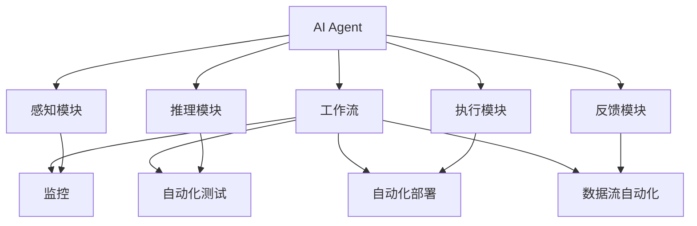

                 

# AI人工智能代理工作流 AI Agent WorkFlow：在自动化检查中的应用

> 关键词：人工智能代理(AI Agent), 自动化检查, 工作流, 监控, 自动化测试, 数据流自动化, 自动化部署, 故障检测

## 1. 背景介绍

### 1.1 问题由来
随着数字化、智能化技术的发展，企业和组织面临着越来越复杂的系统运行环境。为了确保系统的稳定性、可靠性和安全性，自动化检查成为了不可或缺的一部分。传统的自动化检查依赖于人工编写脚本或规则，不仅耗时耗力，而且容易出错，无法覆盖所有边界条件。

为了应对这些挑战，AI人工智能代理(AI Agent)技术应运而生。AI Agent 能够自动监测系统状态，根据预设的规则和阈值，实时发出警告或触发预案。这种技术不仅提高了检查的效率和准确性，还减少了人力成本，提升了系统的自动化水平。

### 1.2 问题核心关键点
AI Agent 的核心在于其能够自主学习和适应新的环境变化，执行复杂的自动化任务。AI Agent 通常包括以下几个关键组件：
- 感知模块：用于实时获取系统运行状态数据，如日志、指标、网络流量等。
- 推理模块：根据感知到的数据，利用机器学习或规则引擎进行推理判断。
- 执行模块：根据推理结果，自动执行相应的操作，如告警、日志记录、调用第三方服务等。
- 反馈模块：收集执行结果和用户反馈，优化AI Agent 的性能。

AI Agent 在自动化检查中的应用场景包括但不限于：
- 实时监控和故障检测：实时监测系统状态，及时发现和响应异常情况。
- 自动化测试：执行预设的测试用例，验证系统功能正确性。
- 自动化部署：自动执行系统部署流程，减少人为干预。
- 数据流自动化：自动分析和优化数据流，提高数据处理效率。

AI Agent 通过不断学习和适应，逐步提升检查的准确性和响应速度，成为自动化运维和自动化测试的重要工具。

## 2. 核心概念与联系

### 2.1 核心概念概述

为了更好地理解AI Agent的工作原理和架构，本节将介绍几个核心概念：

- 人工智能代理(AI Agent)：一种能够自主感知、学习、推理和执行的智能软件实体，用于自动化执行复杂的任务。
- 自动化检查(Auto Check)：利用AI Agent自动监测系统状态，验证系统功能正确性，提升系统稳定性和安全性。
- 工作流(Workflow)：由多个步骤组成的有序任务流程，用于自动化地执行一系列操作。
- 监控(Monitoring)：实时监测系统运行状态，及时发现和响应异常情况，保障系统健康。
- 自动化测试(Auto Testing)：利用AI Agent自动执行测试用例，验证系统功能的正确性和稳定性。
- 自动化部署(Auto Deployment)：自动执行系统部署流程，提高部署效率和可靠性。
- 数据流自动化(Dataflow Automation)：自动分析和优化数据流，提升数据处理效率。

这些核心概念之间的逻辑关系可以通过以下Mermaid流程图来展示：



这个流程图展示了这个系统的主要组成部分及其关系：

1. AI Agent 获取系统状态数据，感知当前环境。
2. 推理模块根据感知到的数据，进行推理判断。
3. 执行模块根据推理结果，自动执行相应的操作。
4. 反馈模块收集执行结果和用户反馈，优化AI Agent 的性能。
5. 工作流模块将多个步骤组成有序任务流程，实现自动化操作。
6. 监控模块实时监测系统状态，及时发现和响应异常情况。
7. 自动化测试模块自动执行测试用例，验证系统功能正确性。
8. 自动化部署模块自动执行系统部署流程，提高部署效率和可靠性。
9. 数据流自动化模块自动分析和优化数据流，提升数据处理效率。

这些概念共同构成了AI Agent的工作原理和架构，使得AI Agent能够灵活应对各种自动化需求。

## 3. 核心算法原理 & 具体操作步骤
### 3.1 算法原理概述

AI Agent 的工作流程可以分为感知、推理、执行和反馈四个阶段。其核心算法原理基于监督学习和强化学习，通过不断的训练和优化，逐步提升自动化检查的准确性和效率。

- **感知阶段**：AI Agent 通过传感器获取系统状态数据，如日志、指标、网络流量等。
- **推理阶段**：利用机器学习或规则引擎对感知到的数据进行分析，推理出当前状态是否异常。
- **执行阶段**：根据推理结果，自动执行相应的操作，如告警、日志记录、调用第三方服务等。
- **反馈阶段**：收集执行结果和用户反馈，优化AI Agent 的性能。

AI Agent 的算法步骤主要包括：

1. 数据收集和预处理。
2. 模型训练和推理。
3. 操作执行和结果反馈。
4. 性能优化和模型更新。

### 3.2 算法步骤详解

#### 3.2.1 数据收集和预处理

AI Agent 首先需要获取系统状态数据，并进行预处理。具体步骤如下：

1. 选择合适的数据源，如日志文件、指标接口、网络监控工具等。
2. 获取数据并进行清洗和标准化处理，去除噪音和异常数据。
3. 使用特征工程技术，将原始数据转化为特征向量，如时间戳、指标值、事件类型等。
4. 对特征向量进行归一化和编码，转化为模型输入。

#### 3.2.2 模型训练和推理

在数据预处理后，AI Agent 利用机器学习或规则引擎进行模型训练和推理。具体步骤如下：

1. 选择合适的机器学习算法或规则引擎，如决策树、随机森林、支持向量机、贝叶斯网络等。
2. 将预处理后的特征向量作为模型输入，训练模型并调整参数，使其能够准确识别异常情况。
3. 使用训练好的模型对实时数据进行推理，判断当前状态是否异常。
4. 根据推理结果，自动执行相应的操作。

#### 3.2.3 操作执行和结果反馈

在推理阶段，AI Agent 根据推理结果，自动执行相应的操作。具体步骤如下：

1. 根据推理结果，选择相应的操作模板，如告警、日志记录、调用第三方服务等。
2. 将操作模板转化为可执行的命令或请求，自动执行。
3. 收集操作执行结果，并反馈给用户。
4. 根据反馈结果，优化操作模板和执行流程。

#### 3.2.4 性能优化和模型更新

在操作执行和结果反馈后，AI Agent 需要进行性能优化和模型更新。具体步骤如下：

1. 根据操作执行结果和用户反馈，分析模型性能和改进空间。
2. 对模型进行优化，如调整参数、改进算法、增加规则等。
3. 重新训练和推理模型，验证其性能提升效果。
4. 更新模型参数和规则库，继续监控和执行任务。

### 3.3 算法优缺点

AI Agent 在自动化检查中具有以下优点：

1. 高效准确：AI Agent 能够自主学习和适应环境变化，实时监测和执行任务，提高了检查的效率和准确性。
2. 灵活可扩展：AI Agent 可以根据需要灵活调整算法和规则，适用于多种自动化场景。
3. 减少人力成本：AI Agent 减少了人工编写脚本和规则的复杂度，降低了人力成本。
4. 提升系统可靠性：AI Agent 实时监测和响应异常情况，保障系统稳定性和安全性。

同时，AI Agent 也存在以下缺点：

1. 初始设置复杂：AI Agent 需要选择合适的数据源和算法，进行参数调优和规则配置，初始设置复杂。
2. 依赖数据质量：AI Agent 的性能高度依赖于数据质量，需要持续监控和清洗数据。
3. 学习曲线陡峭：AI Agent 的模型训练和推理需要一定的计算资源和时间，学习曲线陡峭。
4. 可解释性不足：AI Agent 的决策过程复杂，难以解释其推理逻辑，可能影响信任度。

尽管存在这些缺点，但就目前而言，AI Agent 在自动化检查中的应用已经显示出巨大的潜力和优势，得到了广泛的应用。

### 3.4 算法应用领域

AI Agent 在多个领域中得到广泛应用，主要包括以下几个方面：

1. **监控与故障检测**：实时监测系统状态，及时发现和响应异常情况，保障系统健康。
2. **自动化测试**：自动执行测试用例，验证系统功能的正确性和稳定性。
3. **自动化部署**：自动执行系统部署流程，提高部署效率和可靠性。
4. **数据流自动化**：自动分析和优化数据流，提升数据处理效率。

除了这些经典应用外，AI Agent 还被创新性地应用到更多场景中，如智能合约、自动驾驶、智能家居等，为自动化技术带来了新的突破。

## 4. 数学模型和公式 & 详细讲解  
### 4.1 数学模型构建

在AI Agent的模型构建过程中，我们通常使用监督学习和强化学习算法。以监督学习为例，假设有$N$个标注样本$(x_i,y_i)$，其中$x_i$为特征向量，$y_i$为标注结果，目标是训练一个模型$f(x)$，使其能够准确预测新样本的标注结果。数学模型可以表示为：

$$
f(x) = \sum_{i=1}^N \alpha_i g(x; \theta) \prod_{j=1}^n f_j(x)
$$

其中，$g(x; \theta)$为基本模型，$\alpha_i$为样本权重，$f_j(x)$为特征函数，$\theta$为模型参数。

### 4.2 公式推导过程

以决策树模型为例，假设有$N$个样本，每个样本有$m$个特征，目标为构建一个决策树模型。根据信息增益或信息增益比等准则，每次选择特征$x_j$作为节点，计算信息增益$IG$或信息增益比$IGR$，得到决策树结构。决策树模型可以表示为：

$$
T(x) = \left\{ \begin{aligned}
& \text{Leaf}(x), && \text{if } x \in \text{Leaf} \\
& T(\text{Split}(x, x_j)), && \text{if } x_j = x \text{ and } T(\text{Split}(x, x_j)) \neq \text{Leaf}(x)
\end{aligned} \right.
$$

其中，$\text{Split}(x, x_j)$表示以特征$x_j$为划分标准，将样本$x$分割为两部分，$\text{Leaf}(x)$表示决策树的叶子节点。

### 4.3 案例分析与讲解

假设有一个金融交易系统，需要实时监测和报警异常交易行为。AI Agent 收集交易记录，并对其进行预处理，得到特征向量$x$。利用监督学习算法，训练一个决策树模型$f(x)$，用于判断交易行为是否异常。具体步骤如下：

1. 收集交易记录，提取关键特征，如交易金额、交易时间、交易地点等，得到特征向量$x$。
2. 标注异常交易行为，标记为1，正常交易行为标记为0，得到标注样本$(x_i,y_i)$。
3. 使用决策树算法，训练模型$f(x)$，得到决策树结构。
4. 实时获取交易记录，计算特征向量$x$，使用决策树模型$f(x)$进行推理，判断交易行为是否异常。
5. 根据推理结果，自动执行相应的操作，如告警、记录日志等。
6. 收集告警结果和用户反馈，优化决策树模型$f(x)$，继续监测和执行任务。

## 5. 项目实践：代码实例和详细解释说明
### 5.1 开发环境搭建

在进行AI Agent开发前，我们需要准备好开发环境。以下是使用Python进行TensorFlow开发的环境配置流程：

1. 安装Anaconda：从官网下载并安装Anaconda，用于创建独立的Python环境。

2. 创建并激活虚拟环境：
```bash
conda create -n tf-env python=3.8 
conda activate tf-env
```

3. 安装TensorFlow：根据CUDA版本，从官网获取对应的安装命令。例如：
```bash
conda install tensorflow tensorflow-gpu -c conda-forge
```

4. 安装各类工具包：
```bash
pip install numpy pandas scikit-learn matplotlib tqdm jupyter notebook ipython
```

完成上述步骤后，即可在`tf-env`环境中开始AI Agent实践。

### 5.2 源代码详细实现

这里我们以异常检测为例，给出使用TensorFlow和Keras进行AI Agent开发的PyTorch代码实现。

首先，定义异常检测的模型：

```python
import tensorflow as tf
from tensorflow.keras import layers

# 定义模型
model = tf.keras.Sequential([
    layers.Dense(64, activation='relu', input_shape=(n_features,)),
    layers.Dense(1, activation='sigmoid')
])
```

然后，定义训练和评估函数：

```python
# 训练函数
def train(model, x_train, y_train, x_val, y_val, batch_size=64, epochs=10):
    model.compile(optimizer=tf.keras.optimizers.Adam(), 
                  loss='binary_crossentropy', 
                  metrics=['accuracy'])
    model.fit(x_train, y_train, batch_size=batch_size, 
              validation_data=(x_val, y_val), 
              epochs=epochs)

# 评估函数
def evaluate(model, x_test, y_test, batch_size=64):
    model.evaluate(x_test, y_test, batch_size=batch_size)
```

接着，启动训练流程并在测试集上评估：

```python
# 训练模型
train(model, x_train, y_train, x_val, y_val)

# 评估模型
evaluate(model, x_test, y_test)
```

以上就是使用TensorFlow和Keras进行AI Agent开发的完整代码实现。可以看到，通过TensorFlow的高级API，我们可以轻松搭建和训练复杂的神经网络模型，进行异常检测等自动化检查任务。

### 5.3 代码解读与分析

让我们再详细解读一下关键代码的实现细节：

**模型定义**：
- 使用Sequential模型，包含两个Dense层，分别用于特征处理和异常检测。
- 第一层Dense层使用64个神经元，激活函数为ReLU。
- 第二层Dense层使用1个神经元，激活函数为Sigmoid，用于输出异常概率。

**训练函数**：
- 使用Adam优化器，损失函数为二元交叉熵，评估指标为准确率。
- 通过fit方法，将训练集输入模型进行训练，并指定验证集进行交叉验证。

**评估函数**：
- 使用evaluate方法，将测试集输入模型进行评估，输出模型性能指标。

**训练流程**：
- 通过train函数，对模型进行训练，指定训练集、验证集、批次大小和迭代次数。
- 通过evaluate函数，在测试集上评估模型性能。

可以看到，TensorFlow和Keras为AI Agent的开发提供了方便的API和工具，使得模型构建和训练过程变得简洁高效。

## 6. 实际应用场景

### 6.1 金融交易异常检测

金融交易系统需要实时监测和报警异常交易行为，以防止欺诈和异常交易。AI Agent 可以收集交易记录，并对其进行预处理，得到特征向量$x$。利用监督学习算法，训练一个决策树模型$f(x)$，用于判断交易行为是否异常。具体步骤如下：

1. 收集交易记录，提取关键特征，如交易金额、交易时间、交易地点等，得到特征向量$x$。
2. 标注异常交易行为，标记为1，正常交易行为标记为0，得到标注样本$(x_i,y_i)$。
3. 使用决策树算法，训练模型$f(x)$，得到决策树结构。
4. 实时获取交易记录，计算特征向量$x$，使用决策树模型$f(x)$进行推理，判断交易行为是否异常。
5. 根据推理结果，自动执行相应的操作，如告警、记录日志等。
6. 收集告警结果和用户反馈，优化决策树模型$f(x)$，继续监测和执行任务。

### 6.2 智能合约异常检测

智能合约系统需要实时监测和报警异常行为，以保障合约的执行和安全性。AI Agent 可以收集智能合约的状态和事件，并对其进行预处理，得到特征向量$x$。利用监督学习算法，训练一个决策树模型$f(x)$，用于判断行为是否异常。具体步骤如下：

1. 收集智能合约的状态和事件，提取关键特征，如交易金额、交易时间、交易地点等，得到特征向量$x$。
2. 标注异常行为，标记为1，正常行为标记为0，得到标注样本$(x_i,y_i)$。
3. 使用决策树算法，训练模型$f(x)$，得到决策树结构。
4. 实时获取智能合约的状态和事件，计算特征向量$x$，使用决策树模型$f(x)$进行推理，判断行为是否异常。
5. 根据推理结果，自动执行相应的操作，如告警、记录日志等。
6. 收集告警结果和用户反馈，优化决策树模型$f(x)$，继续监测和执行任务。

### 6.3 智能家居异常检测

智能家居系统需要实时监测和报警异常行为，以保障家庭安全和健康。AI Agent 可以收集智能家居设备的状态和事件，并对其进行预处理，得到特征向量$x$。利用监督学习算法，训练一个决策树模型$f(x)$，用于判断行为是否异常。具体步骤如下：

1. 收集智能家居设备的状态和事件，提取关键特征，如温度、湿度、光照等，得到特征向量$x$。
2. 标注异常行为，标记为1，正常行为标记为0，得到标注样本$(x_i,y_i)$。
3. 使用决策树算法，训练模型$f(x)$，得到决策树结构。
4. 实时获取智能家居设备的状态和事件，计算特征向量$x$，使用决策树模型$f(x)$进行推理，判断行为是否异常。
5. 根据推理结果，自动执行相应的操作，如告警、记录日志等。
6. 收集告警结果和用户反馈，优化决策树模型$f(x)$，继续监测和执行任务。

### 6.4 未来应用展望

随着AI Agent技术的不断成熟，其在自动化检查中的应用将越来越广泛。未来，AI Agent 将在更多领域得到应用，为智能化转型提供新的推动力。

1. **智慧医疗**：AI Agent 可以实时监测患者的生命体征，及时发现异常情况，保障医疗安全。
2. **智能制造**：AI Agent 可以实时监测生产设备和生产线状态，及时发现异常情况，保障生产效率和质量。
3. **智能交通**：AI Agent 可以实时监测交通流量和交通事件，及时发现异常情况，保障交通安全。
4. **智能教育**：AI Agent 可以实时监测学生的学习行为和反馈，及时发现学习问题，提供个性化辅导。
5. **智能金融**：AI Agent 可以实时监测金融市场和交易行为，及时发现异常情况，保障金融稳定。

这些应用场景展示了AI Agent技术的广泛适用性，未来将会有更多的创新应用涌现，为各行各业带来新的变革。

## 7. 工具和资源推荐
### 7.1 学习资源推荐

为了帮助开发者系统掌握AI Agent的工作原理和实践技巧，这里推荐一些优质的学习资源：

1. 《TensorFlow实战》系列博文：由TensorFlow官方文档组撰写，详细介绍了TensorFlow的安装、API使用、模型训练等内容。
2. 《Keras深度学习入门》课程：由Udacity提供，通过Keras框架学习深度学习模型的搭建和训练。
3. 《深度学习基础》书籍：Ian Goodfellow著，介绍了深度学习的基础知识和算法原理，适合入门学习。
4. 《TensorFlow实战》书籍：由Google深度学习团队编写，介绍了TensorFlow的高级API和应用案例。
5. 《TensorFlow官方文档》：TensorFlow官方提供的详细API文档和教程，是学习TensorFlow的最佳资源。

通过对这些资源的学习实践，相信你一定能够快速掌握AI Agent的精髓，并用于解决实际的自动化检查问题。

### 7.2 开发工具推荐

高效的开发离不开优秀的工具支持。以下是几款用于AI Agent开发的常用工具：

1. TensorFlow：由Google主导开发的深度学习框架，支持CPU、GPU、TPU等计算资源，适合大规模模型训练。
2. Keras：基于TensorFlow的高级API，提供简洁易用的模型构建和训练接口。
3. PyTorch：由Facebook主导开发的深度学习框架，支持动态计算图，适合灵活模型构建。
4. Jupyter Notebook：开源的交互式编程环境，支持Python、R、Julia等多种语言，适合数据分析和模型训练。
5. Google Colab：谷歌提供的免费在线Jupyter Notebook环境，方便共享学习笔记和实验代码。

合理利用这些工具，可以显著提升AI Agent开发和实验的效率，加快创新迭代的步伐。

### 7.3 相关论文推荐

AI Agent技术的不断发展离不开学界的持续研究。以下是几篇奠基性的相关论文，推荐阅读：

1. 《异常检测与机器学习》：介绍了异常检测的基本算法和技术，包括统计方法、机器学习方法和深度学习方法。
2. 《决策树算法》：介绍了决策树的基本原理和算法实现，适合了解模型构建和推理过程。
3. 《强化学习与自动化系统》：介绍了强化学习的基本原理和应用场景，适合了解智能代理的构建和优化。
4. 《深度学习与异常检测》：介绍了深度学习在异常检测中的应用，包括神经网络模型和监督学习算法。
5. 《自动异常检测与报警系统》：介绍了自动异常检测与报警系统的实现方法和应用案例，适合了解实际应用场景。

这些论文代表了大规模语言模型微调技术的发展脉络。通过学习这些前沿成果，可以帮助研究者把握学科前进方向，激发更多的创新灵感。

## 8. 总结：未来发展趋势与挑战

### 8.1 总结

本文对AI Agent在自动化检查中的应用进行了全面系统的介绍。首先阐述了AI Agent在自动化检查中的研究背景和应用意义，明确了AI Agent在自动化运维和测试中的重要价值。其次，从原理到实践，详细讲解了AI Agent的工作流程和算法步骤，给出了AI Agent开发的完整代码实例。同时，本文还广泛探讨了AI Agent在金融交易、智能合约、智能家居等多个领域的应用前景，展示了AI Agent技术的广泛适用性。此外，本文精选了AI Agent学习的各类资源，力求为读者提供全方位的技术指引。

通过本文的系统梳理，可以看到，AI Agent在自动化检查中的应用前景广阔，正逐步成为自动化运维和测试的重要工具。通过不断优化和创新，AI Agent技术必将在更多领域得到应用，为各行各业带来新的变革。

### 8.2 未来发展趋势

展望未来，AI Agent技术将呈现以下几个发展趋势：

1. **智能化程度提升**：AI Agent将通过深度学习等高级技术，进一步提升自动化检查的准确性和自适应性，实现更加复杂的任务处理。
2. **多模态融合**：AI Agent将融合视觉、语音、文本等多模态数据，提升综合感知和推理能力，实现更为全面和准确的异常检测。
3. **自适应学习**：AI Agent将具备自主学习和适应新环境的能力，能够根据任务需求和数据变化，动态调整算法和规则。
4. **可解释性增强**：AI Agent将加强可解释性，提供清晰的决策逻辑和推理过程，增强用户信任度和透明度。
5. **跨平台应用**：AI Agent将实现跨平台、跨设备的应用，支持多种操作系统和硬件设备，提升系统兼容性和通用性。

这些趋势表明，AI Agent技术在未来的自动化检查中将发挥更加重要的作用，带来更高的效率和准确性。

### 8.3 面临的挑战

尽管AI Agent技术已经取得了显著的进展，但在应用过程中仍面临以下挑战：

1. **数据依赖性强**：AI Agent的性能高度依赖于数据质量和标注质量，需要持续监控和清洗数据。
2. **模型复杂度高**：AI Agent的模型复杂度高，需要大量的计算资源和时间进行训练和推理，学习曲线陡峭。
3. **可解释性不足**：AI Agent的决策过程复杂，难以解释其推理逻辑，可能影响用户信任度。
4. **跨领域适配难度大**：AI Agent在不同领域的应用需要特定的数据和算法，跨领域适配难度大。

尽管存在这些挑战，但通过不断的技术创新和优化，相信这些挑战终将一一被克服，AI Agent技术必将在自动化检查中发挥越来越重要的作用。

### 8.4 研究展望

面向未来，AI Agent技术需要在以下几个方面进行进一步研究和探索：

1. **多模态融合技术**：探索多模态数据的融合方法和技术，提升AI Agent的综合感知和推理能力。
2. **自适应学习算法**：研究自适应学习算法，使AI Agent能够动态调整算法和规则，适应新环境和任务。
3. **可解释性增强技术**：探索增强可解释性的技术，提供清晰的决策逻辑和推理过程，增强用户信任度。
4. **跨领域适配技术**：研究跨领域适配技术，使AI Agent能够在不同领域高效应用。
5. **异常检测新方法**：探索新型的异常检测方法，如深度学习、强化学习等，提升AI Agent的检测精度和鲁棒性。

这些研究方向的探索，必将引领AI Agent技术迈向更高的台阶，为自动化检查带来新的突破和应用。

## 9. 附录：常见问题与解答

**Q1：AI Agent的初始设置复杂吗？**

A: AI Agent的初始设置相对复杂，需要选择合适的数据源和算法，进行参数调优和规则配置。但一旦设置完成，后续训练和推理过程相对简单，可以显著提升自动化检查的效率和准确性。

**Q2：AI Agent如何处理异常数据？**

A: AI Agent通常会将异常数据标记为异常行为，并自动执行相应的操作，如告警、记录日志等。通过不断学习，AI Agent能够逐步适应新的异常数据，提高异常检测的精度和鲁棒性。

**Q3：AI Agent的性能如何提升？**

A: AI Agent的性能可以通过以下几个方面进行提升：
1. 数据清洗和预处理：去除噪音和异常数据，提高数据质量。
2. 算法优化：选择合适的算法和参数，进行调优和优化。
3. 模型更新：通过新的数据和反馈，不断更新和训练模型。
4. 规则库丰富：不断增加和优化规则库，提高异常检测的全面性和准确性。

**Q4：AI Agent在部署过程中需要注意哪些问题？**

A: AI Agent在部署过程中需要注意以下问题：
1. 系统兼容性：确保AI Agent能够兼容目标系统，支持多种操作系统和硬件设备。
2. 模型优化：根据目标系统进行模型裁剪和优化，减少资源消耗。
3. 监控告警：实时监控AI Agent的性能和异常情况，及时发出告警。
4. 安全防护：采用访问鉴权、数据脱敏等措施，保障数据和模型安全。

通过合理解决这些问题，AI Agent技术可以更好地应用于实际业务场景，提升自动化检查的效果。

---

作者：禅与计算机程序设计艺术 / Zen and the Art of Computer Programming

