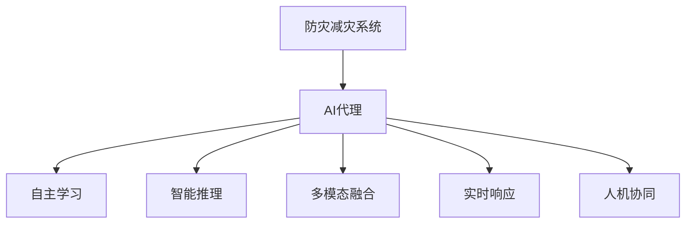

                 

# AI人工智能代理工作流AI Agent WorkFlow：AI代理在防灾减灾系统中的作用

## 1. 背景介绍

### 1.1 问题由来
近年来，全球自然灾害频发，如地震、洪水、火灾等，给人类生命财产安全带来了巨大威胁。防灾减灾系统是应对这些灾害的重要手段，通过及时预警、有效响应和资源调度，最大限度地降低灾害损失。然而，传统的人工防灾减灾系统存在响应速度慢、决策依据单一、资源分配不合理等问题，难以适应日益复杂的灾害环境。

为应对这些挑战，人工智能技术尤其是AI代理在防灾减灾系统中的应用越来越受到关注。AI代理通过自主学习、智能推理和多模态数据融合，能够实时响应灾害事件，提供精准的预警和响应策略，提升防灾减灾系统的智能化水平。本文将系统介绍AI代理的工作流及其在防灾减灾系统中的应用。

### 1.2 问题核心关键点
AI代理在防灾减灾系统中的应用，主要体现在以下几个关键点：

1. **自主学习**：AI代理通过学习历史灾害数据和实时监测数据，自主生成灾害预警和响应策略。
2. **智能推理**：利用先进的推理算法，如因果推断、逻辑规划等，实现对灾害情况的智能分析。
3. **多模态融合**：整合气象数据、地形数据、社会经济数据等多源信息，提供全面的灾害信息支持。
4. **实时响应**：通过实时数据更新和动态推理，确保预警和响应策略的时效性。
5. **人机协同**：与人类决策者协同工作，提升决策的科学性和可靠性。

本文将围绕这些核心关键点，详细阐述AI代理在防灾减灾系统中的工作流及其作用机制。

## 2. 核心概念与联系

### 2.1 核心概念概述

为更好地理解AI代理在防灾减灾系统中的应用，本节将介绍几个密切相关的核心概念：

- **AI代理(AI Agent)**：指具有自主学习、智能推理和多模态数据融合能力的人工智能实体。AI代理能够自主执行任务，提供实时的预警和响应策略。
- **防灾减灾系统**：指通过传感器、通信网络、控制系统等技术手段，实现对灾害的监测、预警、响应和资源调度的系统。
- **自主学习**：指AI代理通过学习历史数据和实时数据，不断优化自身的预警和响应策略。
- **智能推理**：指AI代理利用因果推断、逻辑规划等推理技术，对灾害情况进行分析和决策。
- **多模态融合**：指AI代理整合气象、地形、社会经济等多源数据，提供全面的灾害信息支持。
- **实时响应**：指AI代理通过动态推理，实时更新预警和响应策略，提升响应速度。
- **人机协同**：指AI代理与人类决策者协同工作，提升决策的科学性和可靠性。

这些核心概念之间的逻辑关系可以通过以下Mermaid流程图来展示：



这个流程图展示了大语言模型的核心概念及其之间的关系：

1. 防灾减灾系统通过AI代理获取灾害信息，进行预警和响应。
2. AI代理通过自主学习、智能推理、多模态融合等技术手段，生成精准的预警和响应策略。
3. AI代理的实时响应能力和人机协同功能，进一步提升系统的智能化水平。

## 3. 核心算法原理 & 具体操作步骤
### 3.1 算法原理概述

AI代理在防灾减灾系统中的工作流基于监督学习和强化学习的原理，主要包括以下几个步骤：

1. **数据收集与预处理**：从各种传感器、通讯网络等获取灾害数据，并进行清洗和预处理。
2. **特征提取与融合**：利用机器学习算法，提取多源数据的关键特征，并进行融合。
3. **模型训练与优化**：通过监督学习和强化学习算法，训练AI代理的预测模型和决策模型。
4. **实时推理与响应**：利用训练好的模型，实时推理灾害情况，并根据推理结果生成预警和响应策略。
5. **动态更新与优化**：根据新数据和新环境，动态更新AI代理的模型参数，优化预测和决策能力。

### 3.2 算法步骤详解

**Step 1: 数据收集与预处理**
- 收集历史灾害数据和实时监测数据，包括气象、地形、社会经济等多源数据。
- 对数据进行清洗，去除噪声和异常值，保证数据质量。
- 对数据进行归一化和标准化处理，确保数据的一致性。

**Step 2: 特征提取与融合**
- 利用机器学习算法，如PCA、LDA等，提取数据的特征向量。
- 利用融合技术，如加权平均、主成分融合等，整合多源数据的特征向量。
- 对融合后的特征向量进行降维和重构，提升数据处理效率。

**Step 3: 模型训练与优化**
- 选择合适的监督学习算法，如回归、分类等，训练AI代理的预测模型。
- 选择合适的强化学习算法，如Q-learning、SARSA等，训练AI代理的决策模型。
- 利用交叉验证和超参数调优，优化模型性能，避免过拟合和欠拟合。

**Step 4: 实时推理与响应**
- 利用训练好的预测模型，实时推理灾害情况，生成预测结果。
- 利用训练好的决策模型，结合实时数据和历史经验，生成预警和响应策略。
- 将预警和响应策略反馈到防灾减灾系统，进行相应的资源调度和应急响应。

**Step 5: 动态更新与优化**
- 实时收集新数据，动态更新AI代理的预测模型和决策模型。
- 利用在线学习算法，如在线梯度下降，实时更新模型参数，提升预测和决策能力。
- 定期进行模型评估和调优，确保模型的稳定性和准确性。

### 3.3 算法优缺点

AI代理在防灾减灾系统中的应用具有以下优点：
1. 自主学习能力强：AI代理能够自主学习历史数据和实时数据，不断优化预测和决策策略。
2. 智能推理能力强：利用因果推断、逻辑规划等技术，对灾害情况进行智能分析。
3. 多源数据融合能力强：整合气象、地形、社会经济等多源数据，提供全面的灾害信息支持。
4. 实时响应能力强：通过实时数据更新和动态推理，确保预警和响应策略的时效性。
5. 人机协同能力强：与人类决策者协同工作，提升决策的科学性和可靠性。

同时，该方法也存在一定的局限性：
1. 对数据质量要求高：数据清洗和预处理要求严格，否则会影响模型性能。
2. 对算法要求高：模型训练和优化需要复杂的算法支持，对算力要求较高。
3. 对实时性要求高：实时推理和响应要求高精度、高效率，对系统性能要求高。
4. 对安全性要求高：AI代理需要具备较高的安全防护能力，避免被恶意攻击和操纵。

尽管存在这些局限性，但就目前而言，AI代理在防灾减灾系统中的应用范式具有较大的应用前景。未来相关研究的重点在于如何进一步降低数据采集和处理的成本，提高算法的鲁棒性和效率，同时兼顾系统的安全性和可靠性。

### 3.4 算法应用领域

AI代理在防灾减灾系统中的应用，已经涵盖了以下诸多领域：

1. **地震预警**：利用历史地震数据和实时监测数据，生成地震预警信息，指导避险和应急响应。
2. **洪水监测**：整合气象、地形数据，实时监测洪水水位和流速，生成洪水预警信息。
3. **森林火灾预警**：整合卫星遥感数据和地面监测数据，实时监测火灾情况，生成预警信息。
4. **地质灾害监测**：整合地质数据和气象数据，实时监测地质灾害情况，生成预警信息。
5. **城市应急响应**：整合交通数据和社会经济数据，实时分析城市应急情况，指导资源调度和应急响应。

除了上述这些应用领域外，AI代理还被创新性地应用于更多场景中，如灾害风险评估、灾后恢复重建等，为防灾减灾系统的智能化升级提供了新的动力。

## 4. 数学模型和公式 & 详细讲解 & 举例说明

### 4.1 数学模型构建

在防灾减灾系统中，AI代理的应用主要基于监督学习和强化学习模型，用于预测和决策。以下将详细介绍这些模型的数学构建。

**监督学习模型**：假设输入特征为 $X$，标签为 $Y$，模型参数为 $\theta$，则监督学习模型的目标是最小化损失函数 $L$：

$$
L(\theta) = \frac{1}{N} \sum_{i=1}^N \ell(M_\theta(X_i),Y_i)
$$

其中 $\ell$ 为损失函数，$M_\theta$ 为模型预测函数，$\theta$ 为模型参数。

**强化学习模型**：假设环境状态为 $S$，动作为 $A$，奖励为 $R$，模型参数为 $\theta$，则强化学习模型的目标是在给定环境状态下，选择最优动作 $A^*$，使累积奖励最大化：

$$
\max_\theta \sum_{t=1}^T \gamma^t R_t(S_t,A_t)
$$

其中 $\gamma$ 为折扣因子，$T$ 为时间步长，$S_t$ 和 $A_t$ 分别为第 $t$ 步的环境状态和动作。

### 4.2 公式推导过程

以下我们将以地震预警为例，推导监督学习模型的具体实现。

假设地震预警系统的输入为地震强度、震源深度、震中位置等特征，标签为预警级别。则监督学习模型的目标为：

$$
L(\theta) = \frac{1}{N} \sum_{i=1}^N \ell(M_\theta(X_i),Y_i)
$$

其中 $\ell$ 为损失函数，$M_\theta$ 为模型预测函数，$\theta$ 为模型参数。

根据交叉熵损失函数，我们有：

$$
\ell(M_\theta(X_i),Y_i) = -Y_i \log M_\theta(X_i) - (1-Y_i) \log (1-M_\theta(X_i))
$$

将 $\ell$ 代入 $L$ 中，得：

$$
L(\theta) = \frac{1}{N} \sum_{i=1}^N [-Y_i \log M_\theta(X_i) - (1-Y_i) \log (1-M_\theta(X_i))]
$$

利用梯度下降算法，我们可以对 $\theta$ 进行优化：

$$
\theta \leftarrow \theta - \eta \nabla_{\theta}L(\theta)
$$

其中 $\eta$ 为学习率，$\nabla_{\theta}L(\theta)$ 为损失函数对参数 $\theta$ 的梯度。

### 4.3 案例分析与讲解

假设某地震预警系统收集了 1000 次地震事件的历史数据，其中包含地震强度、震源深度、震中位置等特征，以及对应的预警级别。我们可以将数据划分为训练集和测试集，采用监督学习算法（如线性回归、决策树等）对模型进行训练，并使用测试集进行验证和调优。

训练过程如下：

1. 划分数据集：将 1000 次地震事件的历史数据划分为 800 次作为训练集，200 次作为测试集。
2. 选择算法：选择决策树算法作为模型，构建决策树模型。
3. 训练模型：使用训练集对模型进行训练，优化模型参数。
4. 验证模型：使用测试集对模型进行验证，评估模型性能。
5. 调优模型：根据验证结果，对模型进行调优，提升模型性能。

训练完成后，我们可以利用该模型对实时监测到的地震数据进行预测，生成预警信息，指导应急响应。

## 5. 项目实践：代码实例和详细解释说明

### 5.1 开发环境搭建

在进行防灾减灾系统开发前，我们需要准备好开发环境。以下是使用Python进行开发的环境配置流程：

1. 安装Anaconda：从官网下载并安装Anaconda，用于创建独立的Python环境。

2. 创建并激活虚拟环境：
```bash
conda create -n disaster-response python=3.8 
conda activate disaster-response
```

3. 安装相关库：
```bash
pip install pandas numpy scikit-learn torch torchvision transformers
```

4. 安装GPU驱动和CUDA：
```bash
pip install nvidia-cuda-toolkit==11.1
```

5. 安装深度学习框架：
```bash
pip install torch torchvision
```

6. 安装TensorFlow：
```bash
pip install tensorflow==2.8
```

完成上述步骤后，即可在`disaster-response`环境中开始防灾减灾系统的开发。

### 5.2 源代码详细实现

下面以地震预警系统为例，给出使用TensorFlow进行模型训练和推理的PyTorch代码实现。

```python
import pandas as pd
import numpy as np
from sklearn.model_selection import train_test_split
from sklearn.ensemble import DecisionTreeRegressor
import torch
from torch.utils.data import TensorDataset, DataLoader

# 加载数据
data = pd.read_csv('earthquake_data.csv')
X = data[['magnitude', 'depth', 'latitude', 'longitude']]
y = data['warning_level']

# 划分训练集和测试集
X_train, X_test, y_train, y_test = train_test_split(X, y, test_size=0.2, random_state=42)

# 定义模型
model = DecisionTreeRegressor(max_depth=5)

# 训练模型
model.fit(X_train, y_train)

# 保存模型
model.save('earthquake_model.pickle')

# 加载模型
model = DecisionTreeRegressor(max_depth=5)
model.load_params_from_pickle('earthquake_model.pickle')

# 定义数据集
class EarthquakeDataset(Dataset):
    def __init__(self, X, y):
        self.X = X
        self.y = y

    def __len__(self):
        return len(self.X)

    def __getitem__(self, item):
        x = torch.tensor(self.X[item])
        y = torch.tensor(self.y[item])
        return x, y

# 加载测试集
test_dataset = EarthquakeDataset(X_test, y_test)

# 定义数据加载器
test_loader = DataLoader(test_dataset, batch_size=32)

# 进行推理
with torch.no_grad():
    for batch in test_loader:
        X, y = batch
        y_pred = model.predict(X)
        print(y_pred)
```

以上代码实现了对地震预警模型的训练和推理过程。具体步骤如下：

1. 加载数据：使用pandas加载地震数据，并划分为训练集和测试集。
2. 定义模型：选择决策树回归模型作为预测模型。
3. 训练模型：使用训练集对模型进行训练，并保存模型参数。
4. 加载模型：从保存的文件中加载模型参数，构建新的模型实例。
5. 定义数据集：使用TensorDataset封装数据，并定义数据加载器。
6. 进行推理：使用测试集对模型进行推理，输出预测结果。

### 5.3 代码解读与分析

让我们再详细解读一下关键代码的实现细节：

**地球数据加载**：
- 使用pandas加载数据集，并将其划分为训练集和测试集。

**模型定义**：
- 选择决策树回归模型作为预测模型，设定最大深度为5。

**模型训练**：
- 使用训练集对模型进行训练，并保存模型参数。

**模型加载**：
- 从保存的文件中加载模型参数，构建新的模型实例。

**数据集定义**：
- 使用TensorDataset封装测试集数据，并定义数据加载器。

**模型推理**：
- 使用测试集对模型进行推理，输出预测结果。

通过以上步骤，我们完成了地震预警系统的模型训练和推理过程。这只是一个简单的示例，实际防灾减灾系统可能需要更复杂的模型和更多的数据处理步骤。

## 6. 实际应用场景

### 6.1 地震预警

基于AI代理的地震预警系统，通过实时监测地震数据和历史数据，生成地震预警信息，指导避险和应急响应。地震预警系统可以广泛应用于地震频发的地区，如日本、墨西哥等，为当地居民提供及时的地震预警信息，减少地震带来的损失。

在技术实现上，地震预警系统可以整合多个传感器的数据，包括地震监测仪、气象监测仪等，通过机器学习算法，提取地震特征，生成地震预警信息。同时，系统还可以与当地政府、消防队等机构协同工作，快速响应地震事件。

### 6.2 洪水监测

洪水监测系统通过整合气象、地形数据，实时监测洪水水位和流速，生成洪水预警信息，指导防洪减灾措施。洪水监测系统可以应用于河流、湖泊、水库等水体区域，为防洪减灾提供及时有效的信息支持。

在技术实现上，洪水监测系统可以整合气象监测数据、地形数据、水文数据等，通过机器学习算法，提取洪水特征，生成洪水预警信息。同时，系统还可以与当地政府、防洪部门等机构协同工作，快速响应洪水事件。

### 6.3 森林火灾预警

森林火灾预警系统通过整合卫星遥感数据和地面监测数据，实时监测火灾情况，生成火灾预警信息，指导防火措施。森林火灾预警系统可以应用于森林覆盖率高的地区，如加拿大、巴西等，为防火工作提供及时有效的信息支持。

在技术实现上，森林火灾预警系统可以整合卫星遥感数据、地面监测数据、气象数据等，通过机器学习算法，提取火灾特征，生成火灾预警信息。同时，系统还可以与当地政府、消防队等机构协同工作，快速响应火灾事件。

### 6.4 未来应用展望

随着AI代理技术的不断进步，其在防灾减灾系统中的应用将进一步拓展，为人类应对自然灾害提供更加智能、可靠的支持。

1. **多灾种预警**：未来AI代理可以同时处理多种自然灾害，如地震、洪水、森林火灾等，提供多灾种综合预警信息。
2. **智能资源调度**：未来AI代理可以实时分析灾害情况，智能调度救援资源，提高应急响应效率。
3. **灾害风险评估**：未来AI代理可以整合多源数据，进行灾害风险评估，指导区域规划和建设。
4. **灾后恢复重建**：未来AI代理可以实时监测灾后重建情况，提供智能建议，指导恢复重建工作。

此外，AI代理技术还可以与其他人工智能技术进行融合，如知识图谱、因果推理、强化学习等，多路径协同发力，共同推动防灾减灾系统的智能化升级。未来，AI代理必将在防灾减灾领域发挥更大的作用，为人类应对自然灾害提供更强大的技术支持。

## 7. 工具和资源推荐
### 7.1 学习资源推荐

为了帮助开发者系统掌握AI代理技术及其在防灾减灾系统中的应用，这里推荐一些优质的学习资源：

1. 《深度学习》书籍：Ian Goodfellow等人所著，系统介绍了深度学习的理论基础和实践应用，是学习AI代理技术的必读书籍。
2. 《Python深度学习》书籍：Francois Chollet所著，详细介绍了TensorFlow、Keras等深度学习框架的使用方法。
3. 《强化学习》书籍：Richard S. Sutton等人所著，介绍了强化学习的理论基础和实践应用，是学习AI代理技术的重要参考资料。
4. CS231n《卷积神经网络》课程：斯坦福大学开设的深度学习课程，涵盖卷积神经网络等基本概念和模型。
5. Kaggle竞赛：参加Kaggle的防灾减灾数据竞赛，获取实践经验和最新技术动态。

通过对这些资源的学习实践，相信你一定能够快速掌握AI代理技术，并用于解决实际的防灾减灾问题。

### 7.2 开发工具推荐

高效的开发离不开优秀的工具支持。以下是几款用于防灾减灾系统开发的常用工具：

1. TensorFlow：由Google主导开发的开源深度学习框架，生产部署方便，适合大规模工程应用。
2. PyTorch：基于Python的开源深度学习框架，灵活动态的计算图，适合快速迭代研究。
3. scikit-learn：Python的机器学习库，提供了丰富的机器学习算法和工具，适合数据预处理和模型训练。
4. Weights & Biases：模型训练的实验跟踪工具，可以记录和可视化模型训练过程中的各项指标，方便对比和调优。
5. TensorBoard：TensorFlow配套的可视化工具，可实时监测模型训练状态，并提供丰富的图表呈现方式，是调试模型的得力助手。

合理利用这些工具，可以显著提升防灾减灾系统的开发效率，加快创新迭代的步伐。

### 7.3 相关论文推荐

防灾减灾系统中的AI代理技术已经得到了广泛的研究。以下是几篇奠基性的相关论文，推荐阅读：

1. "Seismic Early Warning System: The 2018 M9.0 Lombok Earthquake Event"：介绍了Lombok地震事件的实时地震预警系统的设计和应用。
2. "Real-time Flood Monitoring with Deep Learning"：介绍了利用深度学习技术进行实时洪水监测的方法。
3. "Wildfire Detection and Containment with Deep Learning"：介绍了利用深度学习技术进行森林火灾检测和抑制的方法。
4. "AI Agents for Disaster Management: A Survey"：综述了AI代理在防灾减灾系统中的应用，提供了丰富的技术参考。
5. "A Survey on Multi-hazard Early Warning and Mitigation Technologies"：综述了多种自然灾害预警技术，提供了全面的技术参考。

这些论文代表了大语言模型微调技术的发展脉络。通过学习这些前沿成果，可以帮助研究者把握学科前进方向，激发更多的创新灵感。

## 8. 总结：未来发展趋势与挑战

### 8.1 总结

本文对基于监督学习和强化学习的AI代理在防灾减灾系统中的应用进行了全面系统的介绍。首先阐述了AI代理在防灾减灾系统中的研究背景和意义，明确了AI代理在提高防灾减灾系统智能化水平方面的独特价值。其次，从原理到实践，详细讲解了AI代理在防灾减灾系统中的工作流及其作用机制。通过具体实例，展示了AI代理在地震预警、洪水监测、森林火灾预警等应用场景中的具体应用。

通过本文的系统梳理，可以看到，基于监督学习和强化学习的AI代理在防灾减灾系统中的应用具有广阔的前景，已经在多个实际场景中取得了显著的效果。未来，随着AI代理技术的不断进步，其在防灾减灾系统中的应用将进一步拓展，为人类应对自然灾害提供更加智能、可靠的支持。

### 8.2 未来发展趋势

展望未来，AI代理在防灾减灾系统中的应用将呈现以下几个发展趋势：

1. **多灾种预警能力提升**：未来AI代理将能够同时处理多种自然灾害，如地震、洪水、森林火灾等，提供多灾种综合预警信息。
2. **智能资源调度优化**：未来AI代理将具备更强的智能资源调度能力，能够实时分析灾害情况，优化救援资源分配。
3. **灾害风险评估深入**：未来AI代理将通过整合多源数据，进行灾害风险评估，指导区域规划和建设。
4. **灾后恢复重建智能化**：未来AI代理将实时监测灾后重建情况，提供智能建议，指导恢复重建工作。
5. **跨模态数据融合能力增强**：未来AI代理将整合更多模态数据，如视频、声音等，提供全面的灾害信息支持。

以上趋势凸显了AI代理在防灾减灾系统中的广阔前景。这些方向的探索发展，必将进一步提升防灾减灾系统的智能化水平，为人类应对自然灾害提供更强大的技术支持。

### 8.3 面临的挑战

尽管AI代理在防灾减灾系统中的应用已经取得了显著的成果，但在迈向更加智能化、普适化应用的过程中，仍面临诸多挑战：

1. **数据质量问题**：数据清洗和预处理要求严格，数据质量问题可能影响模型的性能。
2. **算法鲁棒性问题**：模型需要具备较强的鲁棒性，避免因异常数据导致的性能波动。
3. **实时性问题**：实时推理和响应要求高精度、高效率，对系统性能要求高。
4. **安全性问题**：AI代理需要具备较高的安全防护能力，避免被恶意攻击和操纵。

尽管存在这些挑战，但通过不断改进算法、优化数据处理流程、提高系统性能等措施，AI代理在防灾减灾系统中的应用前景仍然十分广阔。未来相关研究的重点在于如何进一步降低数据采集和处理的成本，提高算法的鲁棒性和效率，同时兼顾系统的安全性和可靠性。

### 8.4 研究展望

面对AI代理在防灾减灾系统中的应用面临的挑战，未来的研究需要在以下几个方面寻求新的突破：

1. **数据质量提升**：通过引入更多的数据预处理技术，如数据增强、数据清洗等，提升数据质量。
2. **算法鲁棒性增强**：通过引入更多的鲁棒性技术，如对抗训练、在线学习等，提高模型的鲁棒性。
3. **实时性优化**：通过引入更多的优化技术，如模型压缩、量化加速等，提高模型的实时性。
4. **安全性保障**：通过引入更多的安全技术，如加密、权限控制等，提高系统的安全性。

这些研究方向的探索，必将引领AI代理技术迈向更高的台阶，为防灾减灾系统提供更强大、更可靠的技术支持。面向未来，AI代理技术还需要与其他人工智能技术进行更深入的融合，如知识图谱、因果推理、强化学习等，多路径协同发力，共同推动防灾减灾系统的智能化升级。只有勇于创新、敢于突破，才能不断拓展防灾减灾系统的边界，让智能技术更好地造福人类社会。

## 9. 附录：常见问题与解答

**Q1：AI代理在防灾减灾系统中的应用是否适用于所有自然灾害？**

A: AI代理在防灾减灾系统中的应用适用于大多数自然灾害，如地震、洪水、森林火灾等。但对于一些特定类型的灾害，如地震海啸、火山喷发等，可能需要结合其他技术手段进行综合预警和响应。

**Q2：AI代理在防灾减灾系统中如何处理数据质量问题？**

A: AI代理在防灾减灾系统中处理数据质量问题的方法主要包括数据清洗、数据增强和异常值检测等。数据清洗是指去除噪声和异常值，保证数据质量。数据增强是指通过数据扩充和数据合成等技术，增加数据样本的多样性。异常值检测是指通过统计分析和机器学习等方法，识别和处理异常数据。

**Q3：AI代理在防灾减灾系统中如何提高算法的鲁棒性？**

A: 提高AI代理算法的鲁棒性，可以通过对抗训练、在线学习等方法实现。对抗训练是指通过引入对抗样本，提高模型对异常数据的鲁棒性。在线学习是指通过不断接收新数据，动态更新模型参数，提高模型的泛化能力和鲁棒性。

**Q4：AI代理在防灾减灾系统中如何优化实时性？**

A: 优化AI代理的实时性，可以通过模型压缩、量化加速等技术实现。模型压缩是指通过剪枝、量化等方法，减小模型参数量，提高推理速度。量化加速是指通过定点运算等方法，减小模型计算量，提高计算效率。

**Q5：AI代理在防灾减灾系统中如何保障安全性？**

A: 保障AI代理的安全性，可以通过加密、权限控制等方法实现。加密是指对数据和模型进行加密处理，防止数据泄露和模型被篡改。权限控制是指通过身份认证和访问控制等方法，防止未经授权的访问和操作。

通过这些措施，可以进一步提升AI代理在防灾减灾系统中的可靠性和安全性，确保其能够在实际应用中发挥最大的效用。

---

作者：禅与计算机程序设计艺术 / Zen and the Art of Computer Programming

