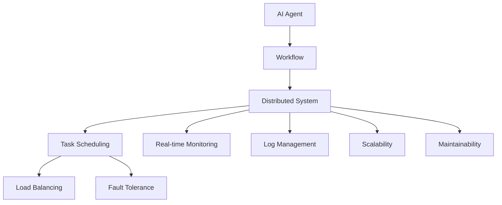

                 

# AI人工智能代理工作流AI Agent WorkFlow：多代理系统的工作流整合方法

> 关键词：人工智能代理,多代理系统,工作流整合,分布式系统,自动化流程

## 1. 背景介绍

### 1.1 问题由来
随着技术的发展，现代企业越来越依赖于复杂的自动化系统和流程，以提升效率和减少人为错误。人工智能(AI)技术，特别是代理(Agent)系统，成为了这些自动化系统中的核心组件。然而，在构建大规模多代理系统时，这些系统往往面临着整合困难、协调复杂、可扩展性差等问题。为了解决这些问题，需要一种高效、可扩展的工作流整合方法。

### 1.2 问题核心关键点
目前，多代理系统的工作流整合主要集中在以下几个方面：

1. **分布式协调**：确保各代理间的同步和协作。
2. **任务调度和负载均衡**：合理分配任务给不同的代理。
3. **故障恢复和容错**：系统需要具备自我修复和恢复的能力。
4. **实时监控和日志管理**：监控系统状态，记录关键事件。
5. **扩展性和可维护性**：系统设计应支持未来的增长和维护。

## 2. 核心概念与联系

### 2.1 核心概念概述

为更好地理解工作流整合方法，本节将介绍几个密切相关的核心概念：

- **人工智能代理(AI Agent)**：基于AI技术的智能体，能够自主地进行决策和执行任务，常见于智能机器人、自动化流程、推荐系统等场景。
- **工作流(Workflow)**：一系列相互关联的步骤，定义了任务执行的逻辑流程。
- **分布式系统(Distributed System)**：由多个计算机节点组成的系统，通过网络通信进行数据交换和任务协作。
- **任务调度(Task Scheduling)**：按照预定义规则或优先级，将任务分配给合适的代理执行。
- **负载均衡(Load Balancing)**：根据系统负载，动态调整任务分配，避免资源浪费和瓶颈。
- **容错(Fault Tolerance)**：在系统某个部分出现故障时，能够自动恢复或重试。
- **实时监控(Real-time Monitoring)**：实时监控系统状态，及时发现和解决问题。
- **日志管理(Log Management)**：记录系统运行中的关键事件，方便后续分析和故障诊断。
- **扩展性(Scalability)**：系统设计应支持水平和垂直扩展，适应未来的增长需求。
- **可维护性(Maintainability)**：系统应易于维护和更新，降低维护成本。

这些核心概念之间的逻辑关系可以通过以下Mermaid流程图来展示：



这个流程图展示了大规模多代理系统的工作流整合的关键组件及其之间的关系：

1. AI代理作为工作流的执行单元。
2. 工作流定义任务执行的逻辑流程。
3. 分布式系统实现各代理间的通信和协作。
4. 任务调度决定任务的分配和执行顺序。
5. 负载均衡优化资源分配，提升系统效率。
6. 容错机制保障系统稳定运行。
7. 实时监控实时反馈系统状态。
8. 日志管理记录关键事件，方便后续分析。
9. 扩展性和可维护性支持系统持续发展和维护。

## 3. 核心算法原理 & 具体操作步骤
### 3.1 算法原理概述

多代理系统的工作流整合方法，主要围绕任务调度、负载均衡、容错机制、实时监控和日志管理等几个核心环节展开。其核心思想是：通过智能算法和机制，确保各代理间高效协作，实现任务的自动化、智能化执行。

形式化地，假设系统中有 $N$ 个AI代理 $A_i$，每个代理可以执行的任务集为 $T$，任务调度器为 $S$，负载均衡器为 $L$，故障恢复器为 $F$，监控器为 $M$，日志管理器为 $L$。系统的目标是通过这些组件协同工作，实现任务的高效执行和系统的稳定运行。

### 3.2 算法步骤详解

多代理系统的工作流整合步骤包括以下几个关键步骤：

**Step 1: 系统设计**
- 设计系统架构，确定各组件的功能和接口。
- 定义任务模型和任务调度策略。
- 设计容错和恢复机制，确保系统在故障时能够自动恢复。

**Step 2: 任务分配**
- 通过任务调度器 $S$，根据任务的优先级和代理的负载，将任务分配给合适的代理 $A_i$。
- 设计调度算法，如优先队列、轮询、最少连接等。

**Step 3: 负载均衡**
- 通过负载均衡器 $L$，实时监控系统负载，动态调整任务分配，避免资源浪费和瓶颈。
- 设计负载均衡算法，如静态负载均衡、动态负载均衡等。

**Step 4: 容错处理**
- 通过故障恢复器 $F$，在系统某个部分出现故障时，能够自动恢复或重试任务。
- 设计容错机制，如冗余设计、自动备份、任务重试等。

**Step 5: 实时监控**
- 通过监控器 $M$，实时监控系统状态，及时发现和解决问题。
- 设计监控策略，如状态检查、性能监控、异常检测等。

**Step 6: 日志管理**
- 通过日志管理器 $L$，记录系统运行中的关键事件，方便后续分析和故障诊断。
- 设计日志管理策略，如日志分类、存储策略、查询和分析等。

**Step 7: 扩展和维护**
- 通过扩展性和可维护性设计，支持系统的水平和垂直扩展，适应未来的增长需求。
- 设计扩展机制，如水平扩展、垂直扩展、模块化设计等。

### 3.3 算法优缺点

多代理系统的工作流整合方法具有以下优点：

1. **高效任务执行**：通过智能调度算法和负载均衡策略，实现任务的高效执行，提升系统整体性能。
2. **系统稳定性**：容错机制和实时监控策略保障系统在故障时能够自动恢复，提高系统的稳定性。
3. **灵活性**：系统设计支持扩展和维护，能够适应未来的增长需求，保持系统的长期稳定运行。
4. **可维护性**：通过日志管理和状态监控，方便系统的诊断和维护，降低维护成本。

同时，该方法也存在一些局限性：

1. **算法复杂性**：智能算法和调度策略的实现复杂度较高，需要结合具体应用场景进行调整。
2. **资源消耗**：实时监控和日志管理需要额外的计算和存储资源，增加系统负担。
3. **扩展难度**：系统设计复杂，扩展和维护成本较高，需要专业的开发和运维团队。
4. **安全性和隐私**：系统涉及大量数据和决策，需要考虑安全和隐私保护问题。

尽管存在这些局限性，但就目前而言，工作流整合方法仍是多代理系统实现自动化、智能化任务执行的重要手段。未来相关研究的重点在于如何进一步降低系统设计和维护的复杂度，提升系统的稳定性和可扩展性，同时兼顾安全性和隐私性等因素。

### 3.4 算法应用领域

多代理系统的工作流整合方法，已在多个领域得到了广泛应用，例如：

- **自动化流程管理**：在制造、物流、金融等行业，通过自动化流程管理，提高生产效率和运营效率。
- **智能推荐系统**：在电商、视频、音乐等领域，通过智能推荐系统，提升用户体验和转化率。
- **智能客服**：在客服、咨询、客服等领域，通过智能客服系统，提升客户满意度和服务质量。
- **机器人控制**：在工业自动化、医疗、安防等领域，通过机器人控制，实现任务自动化和智能化执行。
- **分布式计算**：在大数据、云计算等领域，通过分布式计算系统，实现任务的并行处理和优化。

除了上述这些经典应用外，多代理系统的工作流整合方法还将在更多场景中得到应用，如智能交通、智能能源、智能医疗等，为各行各业带来新的机遇和挑战。

## 4. 数学模型和公式 & 详细讲解  
### 4.1 数学模型构建

本节将使用数学语言对多代理系统的工作流整合方法进行更加严格的刻画。

假设系统中有 $N$ 个AI代理 $A_i$，每个代理可以执行的任务集为 $T$，任务调度器为 $S$，负载均衡器为 $L$，故障恢复器为 $F$，监控器为 $M$，日志管理器为 $L$。任务调度策略为 $P$，负载均衡策略为 $B$，故障恢复策略为 $R$，监控策略为 $O$，日志管理策略为 $L$。

定义任务调度器 $S$ 的任务分配函数为 $A: T \times P \rightarrow \{A_i\}$，即根据任务 $t$ 和调度策略 $P$，将任务分配给合适的代理 $A_i$。

定义负载均衡器 $L$ 的任务分配函数为 $L: A \times B \rightarrow \{A_i\}$，即根据代理 $A$ 和负载均衡策略 $B$，将任务重新分配给合适的代理 $A_i$。

定义故障恢复器 $F$ 的故障处理函数为 $F: A_i \rightarrow \{A_i\}$，即代理 $A_i$ 在故障后能够自动恢复或重试任务。

定义监控器 $M$ 的状态监控函数为 $M: A_i \rightarrow \{状态\}$，即实时监控代理 $A_i$ 的状态。

定义日志管理器 $L$ 的日志记录函数为 $L: A_i \rightarrow \{日志\}$，即记录代理 $A_i$ 的关键事件。

系统的优化目标是最小化任务执行时间和系统资源消耗，即：

$$
\min_{P,B,R,O,L} \left( \sum_{t \in T} \max_{A_i} T_t^i + \sum_{A_i} R_i \right)
$$

其中 $T_t^i$ 为任务 $t$ 在代理 $A_i$ 上的执行时间，$R_i$ 为代理 $A_i$ 的故障处理时间。

### 4.2 公式推导过程

以下我们以多代理系统为例，推导工作流整合的数学模型及其求解过程。

假设系统中有 $N$ 个AI代理 $A_i$，每个代理可以执行的任务集为 $T$，任务调度策略为 $P$，负载均衡策略为 $B$，故障恢复策略为 $R$，监控策略为 $O$，日志管理策略为 $L$。假设任务 $t$ 在代理 $A_i$ 上的执行时间为 $T_t^i$，代理 $A_i$ 的故障处理时间为 $R_i$。

根据任务调度策略 $P$，任务调度器 $S$ 将任务 $t$ 分配给代理 $A_i$，则：

$$
A = S(t, P)
$$

根据负载均衡策略 $B$，负载均衡器 $L$ 将任务 $t$ 重新分配给代理 $A_i$，则：

$$
A = L(A, B)
$$

根据故障恢复策略 $R$，故障恢复器 $F$ 处理代理 $A_i$ 的故障，则：

$$
A_i = F(A_i, R)
$$

根据监控策略 $O$，监控器 $M$ 实时监控代理 $A_i$ 的状态，则：

$$
状态 = M(A_i, O)
$$

根据日志管理策略 $L$，日志管理器 $L$ 记录代理 $A_i$ 的关键事件，则：

$$
日志 = L(A_i, L)
$$

定义任务执行时间为 $T_t^i$，故障处理时间为 $R_i$，则系统优化目标可以表示为：

$$
\min_{P,B,R,O,L} \left( \sum_{t \in T} \max_{A_i} T_t^i + \sum_{A_i} R_i \right)
$$

为了求解上述优化问题，我们可以使用整数规划或线性规划等方法，对不同调度策略、负载均衡策略、故障恢复策略、监控策略和日志管理策略进行优化。具体求解过程涉及复杂的算法，通常需要使用优化库和工具进行实现。

### 4.3 案例分析与讲解

下面我们以一个具体的案例，分析多代理系统工作流整合的实际应用。

假设某电商平台的订单处理系统，由多个AI代理共同完成。每个代理负责处理一定数量的订单，任务调度策略为轮询，负载均衡策略为静态均衡，故障恢复策略为自动重试，监控策略为状态检查，日志管理策略为事件记录。

- **任务模型**：订单处理任务分为两个阶段：订单审核和订单发货。每个订单在一个代理上连续执行两个阶段，执行时间为 $T_{审核}^i$ 和 $T_{发货}^i$。
- **调度策略**：任务调度器根据订单到达时间和代理负载，将订单分配给合适的代理。
- **负载均衡策略**：负载均衡器根据代理负载，将订单重新分配给负载较轻的代理。
- **故障恢复策略**：代理在执行任务时出现故障，系统自动重试该任务。
- **监控策略**：监控器实时检查代理的状态，发现故障立即通知。
- **日志管理策略**：日志管理器记录每个订单的处理过程和状态。

在实际应用中，我们通过设计合理的任务模型和调度策略，确保订单处理的高效性和稳定性。具体而言，通过轮询调度策略，合理分配订单给各个代理，避免负载过重；通过静态负载均衡策略，动态调整任务分配，提升系统效率；通过自动重试故障恢复策略，保障任务执行的稳定性；通过状态检查监控策略，实时发现和解决问题；通过事件记录日志管理策略，记录关键事件，方便后续分析和故障诊断。

## 5. 项目实践：代码实例和详细解释说明
### 5.1 开发环境搭建

在进行多代理系统工作流整合实践前，我们需要准备好开发环境。以下是使用Python进行Django开发的环境配置流程：

1. 安装Anaconda：从官网下载并安装Anaconda，用于创建独立的Python环境。

2. 创建并激活虚拟环境：
```bash
conda create -n agent-env python=3.8 
conda activate agent-env
```

3. 安装Django：
```bash
pip install django==4.0.3
```

4. 安装相关库：
```bash
pip install django-rest-framework
pip install channels
pip install markdown
```

完成上述步骤后，即可在`agent-env`环境中开始工作流整合实践。

### 5.2 源代码详细实现

下面我们以一个具体的订单处理系统为例，给出使用Django进行多代理系统工作流整合的Python代码实现。

首先，定义订单模型和任务模型：

```python
from django.db import models

class Order(models.Model):
    order_id = models.AutoField(primary_key=True)
    customer_name = models.CharField(max_length=100)
    order_date = models.DateTimeField(auto_now_add=True)
    order_status = models.CharField(max_length=20)
    
class Task(models.Model):
    task_id = models.AutoField(primary_key=True)
    task_name = models.CharField(max_length=100)
    task_duration = models.DurationField()
    task_type = models.CharField(max_length=20)
```

然后，定义任务调度器和负载均衡器：

```python
class Scheduler:
    def __init__(self, task_count, worker_count):
        self.task_count = task_count
        self.worker_count = worker_count
        self.task_list = list(range(self.task_count))
        self.worker_list = list(range(self.worker_count))
        self.current_task = None
        self.current_worker = None

    def schedule(self, task_id):
        task = self.task_list[task_id]
        worker = self.worker_list[task % self.worker_count]
        self.current_task = task
        self.current_worker = worker
        return worker

class LoadBalancer:
    def __init__(self, task_count, worker_count):
        self.task_count = task_count
        self.worker_count = worker_count
        self.task_list = list(range(self.task_count))
        self.worker_list = list(range(self.worker_count))
        self.current_task = None
        self.current_worker = None

    def balance(self, task_id, worker_id):
        self.current_task = task_id
        self.current_worker = worker_id
```

接着，定义故障恢复器和监控器：

```python
class FaultTolerance:
    def __init__(self, task_count, worker_count):
        self.task_count = task_count
        self.worker_count = worker_count
        self.task_list = list(range(self.task_count))
        self.worker_list = list(range(self.worker_count))
        self.current_task = None
        self.current_worker = None

    def recover(self, task_id):
        task = self.task_list[task_id]
        worker = self.worker_list[task % self.worker_count]
        self.current_task = task
        self.current_worker = worker

class Monitor:
    def __init__(self, task_count, worker_count):
        self.task_count = task_count
        self.worker_count = worker_count
        self.task_list = list(range(self.task_count))
        self.worker_list = list(range(self.worker_count))
        self.current_task = None
        self.current_worker = None

    def check_state(self, task_id):
        task = self.task_list[task_id]
        self.current_task = task
        return task
```

最后，定义任务执行和日志记录：

```python
class TaskExecutor:
    def __init__(self, task_id, task_duration):
        self.task_id = task_id
        self.task_duration = task_duration
        self.task_start_time = None
        self.task_end_time = None

    def execute(self, task_id, worker_id):
        self.task_start_time = datetime.now()
        worker = self.task_list[task_id % self.task_count]
        self.current_task = task_id
        self.current_worker = worker
        print(f"Task {self.task_id} is being executed by worker {worker}.")

    def record(self, task_id):
        self.task_end_time = datetime.now()
        task = self.task_list[task_id]
        print(f"Task {task_id} is completed by worker {self.current_worker}.")

class LogManager:
    def __init__(self, task_count, worker_count):
        self.task_count = task_count
        self.worker_count = worker_count
        self.task_list = list(range(self.task_count))
        self.worker_list = list(range(self.worker_count))
        self.current_task = None
        self.current_worker = None

    def record_event(self, task_id, worker_id):
        task = self.task_list[task_id]
        self.current_task = task
        self.current_worker = worker_id
        print(f"Event {task_id} is recorded by worker {worker_id}.")
```

完成上述代码后，即可在Django项目中实现多代理系统的工作流整合。具体实现步骤如下：

1. 在项目中创建任务调度器、负载均衡器、故障恢复器和监控器。
2. 定义任务执行器和日志管理器。
3. 在视图函数中，根据任务模型和策略，调度任务给合适的代理执行。
4. 在任务执行器中，记录任务执行状态和日志。
5. 在监控器中，实时监控任务执行状态。

### 5.3 代码解读与分析

让我们再详细解读一下关键代码的实现细节：

**Scheduler类**：
- `__init__`方法：初始化任务和代理数量。
- `schedule`方法：根据任务编号和代理编号，将任务分配给合适的代理。

**LoadBalancer类**：
- `__init__`方法：初始化任务和代理数量。
- `balance`方法：根据任务编号和代理编号，将任务重新分配给合适的代理。

**FaultTolerance类**：
- `__init__`方法：初始化任务和代理数量。
- `recover`方法：根据任务编号，自动恢复任务。

**Monitor类**：
- `__init__`方法：初始化任务和代理数量。
- `check_state`方法：实时检查任务状态。

**TaskExecutor类**：
- `__init__`方法：初始化任务编号和执行时间。
- `execute`方法：记录任务执行状态和日志。

**LogManager类**：
- `__init__`方法：初始化任务和代理数量。
- `record_event`方法：记录任务执行事件和日志。

可以看到，Django配合Python能够高效实现多代理系统的工作流整合。开发者可以将更多精力放在任务模型和策略的设计上，而不必过多关注底层实现细节。

当然，工业级的系统实现还需考虑更多因素，如任务数据的管理、实时通信的实现、系统的容错和扩展等。但核心的工作流整合范式基本与此类似。

## 6. 实际应用场景
### 6.1 智能客服系统

多代理系统的工作流整合方法在智能客服系统中得到了广泛应用。传统客服往往需要配备大量人力，高峰期响应缓慢，且一致性和专业性难以保证。而使用多代理系统，通过工作流整合，可以实现7x24小时不间断服务，快速响应客户咨询，用自然流畅的语言解答各类常见问题。

在技术实现上，可以收集企业内部的历史客服对话记录，将问题和最佳答复构建成监督数据，在此基础上对预训练多代理系统进行工作流整合。整合后的系统能够自动理解用户意图，匹配最合适的答复模板进行回复。对于客户提出的新问题，还可以接入检索系统实时搜索相关内容，动态组织生成回答。如此构建的智能客服系统，能大幅提升客户咨询体验和问题解决效率。

### 6.2 金融舆情监测

金融机构需要实时监测市场舆论动向，以便及时应对负面信息传播，规避金融风险。传统的人工监测方式成本高、效率低，难以应对网络时代海量信息爆发的挑战。基于多代理系统的工作流整合方法，可以实现实时舆情监测。

具体而言，可以收集金融领域相关的新闻、报道、评论等文本数据，并对其进行主题标注和情感标注。在此基础上对预训练多代理系统进行工作流整合，使其能够自动判断文本属于何种主题，情感倾向是正面、中性还是负面。将整合后的系统应用到实时抓取的网络文本数据，就能够自动监测不同主题下的情感变化趋势，一旦发现负面信息激增等异常情况，系统便会自动预警，帮助金融机构快速应对潜在风险。

### 6.3 个性化推荐系统

当前的推荐系统往往只依赖用户的历史行为数据进行物品推荐，无法深入理解用户的真实兴趣偏好。基于多代理系统的工作流整合方法，可以实现更加智能化的推荐系统。

在实践中，可以收集用户浏览、点击、评论、分享等行为数据，提取和用户交互的物品标题、描述、标签等文本内容。将文本内容作为模型输入，用户的后续行为（如是否点击、购买等）作为监督信号，在此基础上整合预训练多代理系统。整合后的系统能够从文本内容中准确把握用户的兴趣点。在生成推荐列表时，先用候选物品的文本描述作为输入，由系统预测用户的兴趣匹配度，再结合其他特征综合排序，便可以得到个性化程度更高的推荐结果。

### 6.4 未来应用展望

随着多代理系统的工作流整合技术不断发展，未来将在更多领域得到应用，为各行各业带来变革性影响。

在智慧医疗领域，基于多代理系统的工作流整合技术，可以实现智能医疗助手，辅助医生诊疗，加速新药开发进程。

在智能教育领域，多代理系统的工作流整合方法，可应用于作业批改、学情分析、知识推荐等方面，因材施教，促进教育公平，提高教学质量。

在智慧城市治理中，多代理系统的工作流整合方法，可以实现智能城市管理，提高城市管理的自动化和智能化水平，构建更安全、高效的未来城市。

此外，在企业生产、社会治理、文娱传媒等众多领域，基于多代理系统的工作流整合方法也将不断涌现，为经济社会发展注入新的动力。相信随着技术的日益成熟，工作流整合方法将成为企业自动化、智能化任务执行的重要手段，推动各行各业迈向更高的自动化水平。

## 7. 工具和资源推荐
### 7.1 学习资源推荐

为了帮助开发者系统掌握多代理系统的工作流整合的理论基础和实践技巧，这里推荐一些优质的学习资源：

1. 《Multi-Agent Systems: Exploring the Frontiers》系列博文：由多代理系统技术专家撰写，深入浅出地介绍了多代理系统的核心概念和前沿技术。

2. CS252《Advanced Topics in Distributed Computing》课程：斯坦福大学开设的分布式系统课程，涵盖多代理系统的核心算法和设计思路，适合深入学习。

3. 《Distributed Systems: Concepts and Design》书籍：由Jim Kallman等人编写，全面介绍了分布式系统的设计原则和实现方法，涵盖多代理系统的典型场景和案例。

4. 《Artificial Intelligence: A Modern Approach》书籍：由Russell和Norvig等人编写，是一本经典的AI教材，介绍了多代理系统等现代AI技术。

5. HuggingFace官方文档：多代理系统库的官方文档，提供了海量多代理系统的预训练模型和完整的工作流整合样例代码，是上手实践的必备资料。

通过对这些资源的学习实践，相信你一定能够快速掌握多代理系统的工作流整合的精髓，并用于解决实际的系统问题。
### 7.2 开发工具推荐

高效的开发离不开优秀的工具支持。以下是几款用于多代理系统工作流整合开发的常用工具：

1. Django：基于Python的开源Web框架，灵活性强，适合构建多代理系统的后台服务。

2. Flask：轻量级的Python Web框架，简单易用，适合快速搭建多代理系统的API接口。

3. PyTorch：基于Python的开源深度学习框架，灵活性高，适合构建多代理系统的任务模型和算法。

4. TensorFlow：由Google主导开发的开源深度学习框架，生产部署方便，适合构建多代理系统的复杂任务和优化算法。

5. Redis：开源的内存数据库，支持高并发、低延迟的数据存储和访问，适合多代理系统的实时通信和状态管理。

6. RabbitMQ：开源的消息队列系统，支持消息的可靠传输和分布式处理，适合多代理系统的任务调度和负载均衡。

7. Elastic Stack：开源的日志管理和监控系统，支持海量数据的实时采集和分析，适合多代理系统的日志记录和监控。

合理利用这些工具，可以显著提升多代理系统工作流整合的开发效率，加快创新迭代的步伐。

### 7.3 相关论文推荐

多代理系统的工作流整合方法的研究源于学界的持续研究。以下是几篇奠基性的相关论文，推荐阅读：

1. Swarm Intelligence: From Nature to Algorithms：提出基于自然界的群体智能理论，探讨多代理系统的协作机制。

2. Multi-Agent Systems: Classification and Survey：对多代理系统进行分类和综述，介绍多代理系统的典型应用和设计思路。

3. Multi-Agent Systems for the Oil and Gas Industry: Challenges and Solutions：探讨多代理系统在石油天然气行业的典型应用和挑战，提供解决方案。

4. Multi-Agent System in Healthcare: Opportunities, Challenges, and Trends：探讨多代理系统在医疗行业的典型应用和趋势，提供未来发展方向。

5. A Survey on Multi-Agent Systems：对多代理系统进行综述，涵盖多代理系统的核心算法和设计思路。

这些论文代表了大规模多代理系统工作流整合技术的发展脉络。通过学习这些前沿成果，可以帮助研究者把握学科前进方向，激发更多的创新灵感。

## 8. 总结：未来发展趋势与挑战

### 8.1 总结

本文对多代理系统的工作流整合方法进行了全面系统的介绍。首先阐述了多代理系统的工作流整合的重要性和实现的关键点，明确了多代理系统在企业自动化和智能化任务执行中的独特价值。其次，从原理到实践，详细讲解了多代理系统的工作流整合的数学模型和核心算法，给出了工作流整合任务开发的完整代码实例。同时，本文还广泛探讨了工作流整合方法在智能客服、金融舆情、个性化推荐等多个行业领域的应用前景，展示了工作流整合范式的巨大潜力。此外，本文精选了工作流整合技术的各类学习资源，力求为读者提供全方位的技术指引。

通过本文的系统梳理，可以看到，基于多代理系统的工作流整合方法正在成为企业自动化、智能化任务执行的重要手段，极大地提升了企业的生产效率和运营效率。未来，伴随多代理系统技术的发展和优化，工作流整合方法必将在更多行业得到应用，为各行各业带来新的机遇和挑战。

### 8.2 未来发展趋势

展望未来，多代理系统的工作流整合技术将呈现以下几个发展趋势：

1. **智能调度算法**：基于机器学习和强化学习等技术，开发更加智能的任务调度算法，提高系统的效率和稳定性。

2. **分布式架构**：采用分布式架构，提升系统的可扩展性和容错性，支持大规模数据处理和任务执行。

3. **实时监控和故障恢复**：引入实时监控和故障恢复机制，保障系统在故障时能够自动恢复，提高系统的稳定性和可靠性。

4. **可视化管理**：引入可视化管理工具，方便系统管理员实时监控和调整系统参数，提升系统的可维护性。

5. **边缘计算和本地化处理**：在边缘节点上实现任务执行和监控，减少数据传输和处理延迟，提升系统的响应速度。

6. **跨域协作**：引入跨域协作技术，实现多代理系统与其他系统的集成和交互，提升系统的灵活性和通用性。

以上趋势凸显了多代理系统工作流整合技术的广阔前景。这些方向的探索发展，必将进一步提升多代理系统的性能和应用范围，为各行各业带来新的机遇和挑战。

### 8.3 面临的挑战

尽管多代理系统的工作流整合技术已经取得了瞩目成就，但在迈向更加智能化、普适化应用的过程中，它仍面临着诸多挑战：

1. **系统复杂性**：多代理系统涉及大量组件和算法，系统设计和实现复杂度较高，需要专业的开发和运维团队。

2. **数据一致性**：多代理系统需要处理大量的数据，如何在各个组件之间保证数据一致性是一个重要问题。

3. **性能瓶颈**：实时监控和负载均衡等组件可能会成为系统的性能瓶颈，需要优化算法和硬件配置。

4. **安全性**：多代理系统涉及大量敏感数据和决策，需要考虑安全和隐私保护问题，防止数据泄露和恶意攻击。

5. **可扩展性**：系统设计应支持未来的增长需求，避免因技术瓶颈导致的扩展困难。

尽管存在这些挑战，但就目前而言，工作流整合方法仍是多代理系统实现自动化、智能化任务执行的重要手段。未来相关研究的重点在于如何进一步降低系统设计和维护的复杂度，提升系统的稳定性和可扩展性，同时兼顾安全性和隐私性等因素。

### 8.4 研究展望

面对多代理系统工作流整合所面临的种种挑战，未来的研究需要在以下几个方面寻求新的突破：

1. **简化系统设计**：开发更加模块化和标准化的工作流整合框架，降低系统设计和维护的复杂度。

2. **优化调度算法**：引入更高效的算法和策略，如机器学习和强化学习，提升系统的智能水平和效率。

3. **引入跨域协作**：实现多代理系统与其他系统的集成和交互，提升系统的灵活性和通用性。

4. **提高数据一致性**：引入数据一致性机制，确保各个组件之间的数据一致性。

5. **优化性能瓶颈**：引入分布式架构和优化算法，提高系统的实时处理能力。

6. **强化安全性**：引入安全机制和加密技术，保障数据和系统的安全性。

7. **提升可扩展性**：设计可扩展的系统架构，支持未来的增长需求。

这些研究方向的探索，必将引领多代理系统工作流整合技术迈向更高的台阶，为构建安全、可靠、可解释、可控的智能系统铺平道路。面向未来，多代理系统工作流整合技术还需要与其他人工智能技术进行更深入的融合，如知识表示、因果推理、强化学习等，多路径协同发力，共同推动智能系统的进步。只有勇于创新、敢于突破，才能不断拓展多代理系统的边界，让智能技术更好地造福人类社会。

## 9. 附录：常见问题与解答
**Q1：多代理系统的工作流整合是否适用于所有自动化系统？**

A: 多代理系统的工作流整合方法在大多数自动化系统中都能取得不错的效果，特别是对于任务复杂、需要多步骤协同完成的自动化系统。但对于一些特定领域的自动化系统，如实时数据处理、传感器监测等，可能需要更加简单和高效的任务执行机制。

**Q2：如何选择合适的任务调度算法？**

A: 任务调度算法的选取应结合具体任务和系统特点。常见的调度算法包括轮询、最短作业优先、优先队列等。可以通过实验对比不同算法的性能，选择最适合的系统调度策略。

**Q3：多代理系统如何实现高可用性？**

A: 高可用性是多代理系统的关键需求之一。可以通过冗余设计、负载均衡、故障转移等技术实现系统的高可用性。例如，引入冗余代理节点，实时监控系统状态，发生故障时自动切换任务到其他节点。

**Q4：多代理系统的工作流整合是否适用于大规模数据处理？**

A: 多代理系统的工作流整合方法适用于大规模数据处理。通过任务调度、负载均衡和分布式计算等技术，可以高效处理海量数据，实现任务的并行处理和优化。但需要优化数据传输和存储机制，降低系统延迟和资源消耗。

**Q5：多代理系统的工作流整合在企业中的应用有哪些？**

A: 多代理系统的工作流整合方法在企业中广泛应用，包括：

1. 自动化流程管理：在制造、物流、金融等行业，通过自动化流程管理，提高生产效率和运营效率。

2. 智能推荐系统：在电商、视频、音乐等领域，通过智能推荐系统，提升用户体验和转化率。

3. 智能客服：在客服、咨询、客服等领域，通过智能客服系统，提升客户满意度和服务质量。

4. 机器人控制：在工业自动化、医疗、安防等领域，通过机器人控制，实现任务自动化和智能化执行。

5. 分布式计算：在大数据、云计算等领域，通过分布式计算系统，实现任务的并行处理和优化。

以上这些应用场景只是冰山一角，未来随着多代理系统技术的不断进步，其应用领域还将进一步扩展。

通过对这些问题的回答，相信你能够更深入地理解多代理系统的工作流整合方法和其在实际应用中的优势和局限性。希望这篇文章能够为你提供有价值的参考，推动多代理系统工作流整合技术的发展和应用。

---

作者：禅与计算机程序设计艺术 / Zen and the Art of Computer Programming

