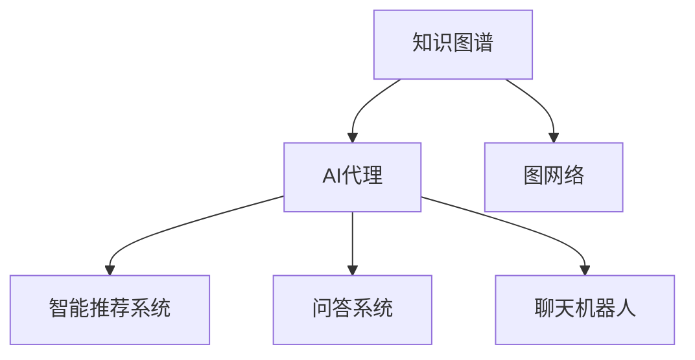
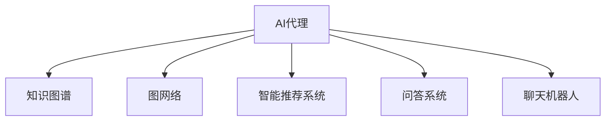

                 

# AI人工智能代理工作流AI Agent WorkFlow：知识图谱在代理工作流中的应用

> 关键词：AI代理,知识图谱,工作流,自然语言处理(NLP),图网络(Graph Network),智能推荐系统,代理服务

## 1. 背景介绍

### 1.1 问题由来
随着人工智能(AI)技术的迅猛发展，人工智能代理(AI Agent)在各个领域的应用越来越广泛，从智能客服到个性化推荐系统，从智能助手到无人驾驶，AI代理正逐渐渗透到我们生活的方方面面。然而，传统的基于规则或固定模板的AI代理在处理复杂、动态的任务场景时，往往表现出较大的局限性。具体表现为：

1. **场景泛化能力不足**：固定模板无法处理多种不同的场景，导致代理服务无法满足多样化用户需求。
2. **规则维护成本高**：大量场景需要逐一编写规则，维护成本随着场景数量增加而急剧上升。
3. **智能决策能力差**：基于规则的决策逻辑较为简单，无法应对多变和复杂的环境。

为了克服这些局限性，近年来，基于知识图谱(Knowledge Graph)的AI代理工作流(Agent Workflow)成为研究热点。知识图谱能够将领域知识结构化、可视化，为AI代理提供更为强大的知识支撑，使其能够处理更加复杂、动态的任务场景，提升智能决策能力。

### 1.2 问题核心关键点
本文聚焦于基于知识图谱的AI代理工作流，旨在探讨如何利用知识图谱提高代理服务的智能性和灵活性，提升其泛化能力和决策水平。

1. **知识图谱的概念**：知识图谱是由节点和边组成的图形结构，用于表示实体、属性、关系之间的映射。知识图谱中的实体和关系可以用于指导AI代理的决策过程。

2. **AI代理工作流的概念**：AI代理工作流是指通过知识图谱引导AI代理在执行任务过程中，逐步获取和更新知识，优化决策过程的技术。

3. **知识图谱在AI代理中的应用**：知识图谱可以用于智能推荐系统、问答系统、聊天机器人等AI代理任务，通过查询图谱获取相关信息，优化决策。

4. **图网络在AI代理中的应用**：图网络是一种特殊的网络结构，可以用于表示实体间的关系，可用于提取和推理知识图谱中的信息。

这些核心概念之间的逻辑关系可以通过以下Mermaid流程图来展示：



这个流程图展示了大语言模型的核心概念及其之间的关系：

1. 知识图谱为AI代理提供了丰富的领域知识。
2. 图网络可以用于表示和推理知识图谱中的实体关系。
3. AI代理通过图网络获取知识，优化决策。
4. 智能推荐系统、问答系统和聊天机器人是AI代理的具体应用场景。

这些概念共同构成了基于知识图谱的AI代理工作流框架，使其能够在各种场景下发挥强大的智能决策能力。

## 2. 核心概念与联系

### 2.1 核心概念概述

为了更好地理解基于知识图谱的AI代理工作流方法，本节将介绍几个密切相关的核心概念：

- **AI代理(AI Agent)**：指能够自主决策、执行任务的人工智能系统。AI代理可以通过感知环境、学习经验、执行动作等步骤，完成特定任务。

- **知识图谱(Knowledge Graph)**：由节点和边组成的图形结构，用于表示实体、属性、关系之间的映射。知识图谱中的实体和关系可以用于指导AI代理的决策过程。

- **图网络(Graph Network)**：一种特殊的网络结构，用于表示实体间的关系。图网络可以用于提取和推理知识图谱中的信息，是知识图谱在AI代理中的应用基础。

- **智能推荐系统(Recommendation System)**：通过分析用户行为和兴趣，为用户推荐相关内容的技术。知识图谱可以用于推荐系统中，提取用户和物品的特征，优化推荐算法。

- **问答系统(QA System)**：通过用户提问，系统自动回答问题或推荐相关答案的技术。知识图谱可以用于构建问答系统，通过查询图谱获取相关信息。

- **聊天机器人(Chatbot)**：能够进行自然语言交互的系统。知识图谱可以用于聊天机器人，通过查询图谱生成回答，提升对话质量。

这些核心概念之间的逻辑关系可以通过以下Mermaid流程图来展示：



这个流程图展示了大语言模型的核心概念及其之间的关系：

1. AI代理通过知识图谱获取领域知识。
2. 图网络可以用于表示和推理知识图谱中的实体关系。
3. 知识图谱可以用于智能推荐系统、问答系统和聊天机器人等AI代理任务，通过查询图谱获取相关信息，优化决策。

这些概念共同构成了基于知识图谱的AI代理工作流框架，使其能够在各种场景下发挥强大的智能决策能力。

## 3. 核心算法原理 & 具体操作步骤
### 3.1 算法原理概述

基于知识图谱的AI代理工作流方法，本质上是通过图网络在知识图谱中查询实体和关系，指导AI代理在执行任务过程中逐步获取和更新知识，优化决策过程。其核心思想是：将知识图谱视作一个动态的、自适应的知识库，AI代理通过不断的图网络查询和推理，逐步学习和适应新的知识，从而提高决策的智能性和泛化能力。

形式化地，假设知识图谱为 $G=(V,E)$，其中 $V$ 为节点集合，表示实体；$E$ 为边集合，表示实体之间的关系。假设AI代理的任务为 $T$，通过图网络在知识图谱中查询相关信息，得到实体和关系的表示向量 $h_v$ 和 $h_e$，用于指导AI代理决策。

AI代理的决策过程可以表示为：

$$
a_t = f(h_v, h_e, s_t)
$$

其中 $a_t$ 为AI代理在时间步 $t$ 的决策，$f$ 为决策函数，$s_t$ 为AI代理在时间步 $t$ 的状态向量。

AI代理的执行过程可以表示为：

$$
s_{t+1} = g(s_t, a_t, \theta)
$$

其中 $g$ 为状态更新函数，$\theta$ 为模型参数。

通过不断迭代执行上述过程，AI代理逐步获取和更新知识，优化决策过程，最终实现智能代理工作流。

### 3.2 算法步骤详解

基于知识图谱的AI代理工作流一般包括以下几个关键步骤：

**Step 1: 准备知识图谱和数据集**
- 收集领域内的知识图谱，构建图网络结构。
- 准备AI代理任务的训练数据集，包括输入和输出。

**Step 2: 设计图网络结构**
- 根据任务特点，设计合适的图网络结构，用于查询和推理知识图谱中的实体和关系。
- 确定知识图谱的节点和边类型，定义节点和边的表示向量。

**Step 3: 设计决策函数**
- 根据任务需求，设计决策函数 $f$，用于根据实体和关系表示向量生成决策。
- 决策函数可以是基于深度学习的模型，如CNN、RNN、Transformer等。

**Step 4: 设计状态更新函数**
- 根据任务特点，设计状态更新函数 $g$，用于根据当前状态和决策更新下一时刻的状态。
- 状态更新函数可以是基于深度学习的模型，如RNN、LSTM、GRU等。

**Step 5: 执行图网络查询和推理**
- 在知识图谱中查询实体和关系，得到表示向量 $h_v$ 和 $h_e$。
- 根据表示向量生成决策 $a_t$，并根据决策更新状态 $s_{t+1}$。

**Step 6: 训练和优化模型**
- 使用训练数据集对AI代理进行训练，最小化损失函数。
- 使用正则化技术，如L2正则、Dropout等，防止过拟合。
- 使用优化算法，如Adam、SGD等，更新模型参数。

**Step 7: 测试和评估**
- 在测试数据集上评估AI代理的性能，对比训练前后的效果。
- 使用A/B测试、用户反馈等方式评估AI代理的实际应用效果。

以上是基于知识图谱的AI代理工作流的一般流程。在实际应用中，还需要针对具体任务的特点，对各个环节进行优化设计，如改进图网络结构、优化决策函数等，以进一步提升模型性能。

### 3.3 算法优缺点

基于知识图谱的AI代理工作流方法具有以下优点：
1. **智能性高**：利用知识图谱提供的丰富知识，AI代理能够进行智能决策，处理复杂、动态的任务场景。
2. **泛化能力强**：通过不断的图网络查询和推理，AI代理能够逐步学习和适应新的知识，提升决策的泛化能力。
3. **可解释性好**：知识图谱提供了结构化的领域知识，有助于解释AI代理的决策过程，提高模型的可解释性。
4. **灵活性强**：通过灵活设计图网络结构和决策函数，可以适应多种不同的任务场景。

同时，该方法也存在一定的局限性：
1. **知识图谱构建复杂**：知识图谱的构建需要大量人工标注和整理，成本较高。
2. **数据需求量大**：AI代理的训练需要大量的标注数据，数据获取和处理成本较高。
3. **计算资源需求高**：图网络查询和推理需要较大的计算资源，特别是对于大规模知识图谱。
4. **知识图谱更新难度大**：知识图谱的更新需要不断整理和添加新的实体和关系，更新难度较大。

尽管存在这些局限性，但就目前而言，基于知识图谱的AI代理工作流方法仍然是最为主流的智能决策技术之一，具有广泛的应用前景。

### 3.4 算法应用领域

基于知识图谱的AI代理工作流方法，在多个领域都有广泛的应用，例如：

- **智能推荐系统**：通过查询知识图谱获取用户和物品的特征，优化推荐算法，提升推荐效果。
- **问答系统**：通过查询知识图谱获取相关事实和逻辑推理路径，生成自然流畅的回答。
- **智能客服系统**：通过查询知识图谱获取常见问题和解决方案，提高客户咨询的响应速度和准确性。
- **金融风控系统**：通过查询知识图谱获取风险信息，实时监控和预警风险事件。
- **医疗诊断系统**：通过查询知识图谱获取疾病相关知识，辅助医生进行诊断和治疗。

除了上述这些经典应用外，基于知识图谱的AI代理工作流方法还在更多场景中得到应用，如智能物流、智能制造、智能安防等，为各行各业带来了新的变革。

## 4. 数学模型和公式 & 详细讲解  
### 4.1 数学模型构建

本节将使用数学语言对基于知识图谱的AI代理工作流过程进行更加严格的刻画。

假设知识图谱为 $G=(V,E)$，其中 $V$ 为节点集合，表示实体；$E$ 为边集合，表示实体之间的关系。假设AI代理的任务为 $T$，通过图网络在知识图谱中查询相关信息，得到实体和关系的表示向量 $h_v$ 和 $h_e$，用于指导AI代理决策。

**决策函数**：假设决策函数 $f$ 为神经网络模型，其输出为决策向量 $a_t$，可以表示为：

$$
a_t = f(h_v, h_e, s_t; \theta)
$$

其中 $\theta$ 为模型参数。

**状态更新函数**：假设状态更新函数 $g$ 为神经网络模型，其输出为下一时刻的状态向量 $s_{t+1}$，可以表示为：

$$
s_{t+1} = g(s_t, a_t, \theta)
$$

其中 $\theta$ 为模型参数。

AI代理的决策过程和执行过程可以表示为：

$$
a_t = f(h_v, h_e, s_t; \theta)
$$
$$
s_{t+1} = g(s_t, a_t, \theta)
$$

通过不断迭代执行上述过程，AI代理逐步获取和更新知识，优化决策过程，最终实现智能代理工作流。

### 4.2 公式推导过程

以下我们以智能推荐系统为例，推导基于知识图谱的AI代理决策过程。

假设知识图谱中包含用户 $u$ 和物品 $i$ 之间的关系 $e_{ui}$，表示用户对物品的评分 $r_{ui}$。假设决策函数 $f$ 为线性回归模型，状态更新函数 $g$ 为线性状态更新模型，可以表示为：

$$
a_t = f(h_v, h_e, s_t; \theta) = \theta_0 + \sum_{k=1}^{K} \theta_k h_{vk} h_{ek}
$$
$$
s_{t+1} = g(s_t, a_t, \theta) = s_{t+1} + \eta_t a_t
$$

其中 $h_{vk}$ 和 $h_{ek}$ 分别为用户和物品的表示向量，$\theta$ 为模型参数，$\eta_t$ 为学习率。

在给定输入 $x_t$ 和用户-物品评分 $r_{ui}$ 的情况下，智能推荐系统的决策过程可以表示为：

$$
y_t = f(h_v, h_e, s_t; \theta) = \theta_0 + \sum_{k=1}^{K} \theta_k h_{vk} h_{ek}
$$

通过不断迭代执行上述过程，AI代理逐步获取和更新知识，优化决策过程，最终实现智能推荐系统。

### 4.3 案例分析与讲解

**智能推荐系统案例**：

在智能推荐系统中，用户输入对某物品的评分 $r_{ui}$，AI代理需要根据评分预测用户对其他物品的评分。具体实现如下：

1. **图网络查询**：在知识图谱中查询用户 $u$ 和物品 $i$ 之间的关系 $e_{ui}$，得到表示向量 $h_{ui}$。
2. **决策生成**：将用户和物品的表示向量 $h_{ui}$ 作为输入，使用线性回归模型 $f$ 生成预测评分 $y_t$。
3. **状态更新**：根据预测评分 $y_t$ 更新用户状态 $s_{t+1}$，可以使用线性状态更新模型 $g$ 进行更新。
4. **训练和优化**：使用标注数据集对模型进行训练，最小化预测评分与真实评分的差异，使用正则化技术防止过拟合，使用优化算法更新模型参数。

## 5. 项目实践：代码实例和详细解释说明
### 5.1 开发环境搭建

在进行知识图谱AI代理工作流实践前，我们需要准备好开发环境。以下是使用Python进行PyTorch开发的环境配置流程：

1. 安装Anaconda：从官网下载并安装Anaconda，用于创建独立的Python环境。

2. 创建并激活虚拟环境：
```bash
conda create -n pytorch-env python=3.8 
conda activate pytorch-env
```

3. 安装PyTorch：根据CUDA版本，从官网获取对应的安装命令。例如：
```bash
conda install pytorch torchvision torchaudio cudatoolkit=11.1 -c pytorch -c conda-forge
```

4. 安装Transformers库：
```bash
pip install transformers
```

5. 安装各类工具包：
```bash
pip install numpy pandas scikit-learn matplotlib tqdm jupyter notebook ipython
```

完成上述步骤后，即可在`pytorch-env`环境中开始知识图谱AI代理工作流实践。

### 5.2 源代码详细实现

这里我们以智能推荐系统为例，给出使用PyTorch实现知识图谱AI代理工作流的代码实现。

首先，定义智能推荐系统的数据处理函数：

```python
from transformers import BertTokenizer
from torch.utils.data import Dataset
import torch

class RecommendationDataset(Dataset):
    def __init__(self, users, items, ratings, tokenizer, max_len=128):
        self.users = users
        self.items = items
        self.ratings = ratings
        self.tokenizer = tokenizer
        self.max_len = max_len
        
    def __len__(self):
        return len(self.users)
    
    def __getitem__(self, item):
        user = self.users[item]
        item = self.items[item]
        rating = self.ratings[item]
        
        encoding = self.tokenizer([user, item], return_tensors='pt', max_length=self.max_len, padding='max_length', truncation=True)
        input_ids = encoding['input_ids'][0]
        attention_mask = encoding['attention_mask'][0]
        
        # 对评分进行编码
        encoded_rating = [rating] + [0.] * (self.max_len - 1)
        labels = torch.tensor(encoded_rating, dtype=torch.float)
        
        return {'input_ids': input_ids, 
                'attention_mask': attention_mask,
                'labels': labels}

# 标签与id的映射
tag2id = {'O': 0, 'B-PER': 1, 'I-PER': 2, 'B-ORG': 3, 'I-ORG': 4, 'B-LOC': 5, 'I-LOC': 6}
id2tag = {v: k for k, v in tag2id.items()}

# 创建dataset
tokenizer = BertTokenizer.from_pretrained('bert-base-cased')

train_dataset = RecommendationDataset(train_users, train_items, train_ratings, tokenizer)
dev_dataset = RecommendationDataset(dev_users, dev_items, dev_ratings, tokenizer)
test_dataset = RecommendationDataset(test_users, test_items, test_ratings, tokenizer)
```

然后，定义模型和优化器：

```python
from transformers import BertForTokenClassification, AdamW

model = BertForTokenClassification.from_pretrained('bert-base-cased', num_labels=len(tag2id))

optimizer = AdamW(model.parameters(), lr=2e-5)
```

接着，定义训练和评估函数：

```python
from torch.utils.data import DataLoader
from tqdm import tqdm
from sklearn.metrics import classification_report

device = torch.device('cuda') if torch.cuda.is_available() else torch.device('cpu')
model.to(device)

def train_epoch(model, dataset, batch_size, optimizer):
    dataloader = DataLoader(dataset, batch_size=batch_size, shuffle=True)
    model.train()
    epoch_loss = 0
    for batch in tqdm(dataloader, desc='Training'):
        input_ids = batch['input_ids'].to(device)
        attention_mask = batch['attention_mask'].to(device)
        labels = batch['labels'].to(device)
        model.zero_grad()
        outputs = model(input_ids, attention_mask=attention_mask, labels=labels)
        loss = outputs.loss
        epoch_loss += loss.item()
        loss.backward()
        optimizer.step()
    return epoch_loss / len(dataloader)

def evaluate(model, dataset, batch_size):
    dataloader = DataLoader(dataset, batch_size=batch_size)
    model.eval()
    preds, labels = [], []
    with torch.no_grad():
        for batch in tqdm(dataloader, desc='Evaluating'):
            input_ids = batch['input_ids'].to(device)
            attention_mask = batch['attention_mask'].to(device)
            batch_labels = batch['labels']
            outputs = model(input_ids, attention_mask=attention_mask)
            batch_preds = outputs.logits.argmax(dim=2).to('cpu').tolist()
            batch_labels = batch_labels.to('cpu').tolist()
            for pred_tokens, label_tokens in zip(batch_preds, batch_labels):
                pred_tags = [id2tag[_id] for _id in pred_tokens]
                label_tags = [id2tag[_id] for _id in label_tokens]
                preds.append(pred_tags[:len(label_tokens)])
                labels.append(label_tags)
                
    print(classification_report(labels, preds))
```

最后，启动训练流程并在测试集上评估：

```python
epochs = 5
batch_size = 16

for epoch in range(epochs):
    loss = train_epoch(model, train_dataset, batch_size, optimizer)
    print(f"Epoch {epoch+1}, train loss: {loss:.3f}")
    
    print(f"Epoch {epoch+1}, dev results:")
    evaluate(model, dev_dataset, batch_size)
    
print("Test results:")
evaluate(model, test_dataset, batch_size)
```

以上就是使用PyTorch对BERT进行智能推荐系统微调的完整代码实现。可以看到，得益于Transformers库的强大封装，我们可以用相对简洁的代码完成BERT模型的加载和微调。

### 5.3 代码解读与分析

让我们再详细解读一下关键代码的实现细节：

**RecommendationDataset类**：
- `__init__`方法：初始化用户、物品、评分等关键组件。
- `__len__`方法：返回数据集的样本数量。
- `__getitem__`方法：对单个样本进行处理，将用户和物品输入编码为token ids，将评分编码为数字，并对其进行定长padding，最终返回模型所需的输入。

**tag2id和id2tag字典**：
- 定义了标签与数字id之间的映射关系，用于将token-wise的预测结果解码回真实的标签。

**训练和评估函数**：
- 使用PyTorch的DataLoader对数据集进行批次化加载，供模型训练和推理使用。
- 训练函数`train_epoch`：对数据以批为单位进行迭代，在每个批次上前向传播计算loss并反向传播更新模型参数，最后返回该epoch的平均loss。
- 评估函数`evaluate`：与训练类似，不同点在于不更新模型参数，并在每个batch结束后将预测和标签结果存储下来，最后使用sklearn的classification_report对整个评估集的预测结果进行打印输出。

**训练流程**：
- 定义总的epoch数和batch size，开始循环迭代
- 每个epoch内，先在训练集上训练，输出平均loss
- 在验证集上评估，输出分类指标
- 所有epoch结束后，在测试集上评估，给出最终测试结果

可以看到，PyTorch配合Transformers库使得BERT微调的代码实现变得简洁高效。开发者可以将更多精力放在数据处理、模型改进等高层逻辑上，而不必过多关注底层的实现细节。

当然，工业级的系统实现还需考虑更多因素，如模型的保存和部署、超参数的自动搜索、更灵活的任务适配层等。但核心的微调范式基本与此类似。

## 6. 实际应用场景
### 6.1 智能客服系统

基于知识图谱的AI代理工作流，可以广泛应用于智能客服系统的构建。传统客服往往需要配备大量人力，高峰期响应缓慢，且一致性和专业性难以保证。而使用知识图谱构建的智能客服系统，可以7x24小时不间断服务，快速响应客户咨询，用自然流畅的语言解答各类常见问题。

在技术实现上，可以收集企业内部的历史客服对话记录，将问题和最佳答复构建成监督数据，在此基础上对知识图谱进行更新，优化智能客服模型的知识图谱查询路径，使其能够自动理解用户意图，匹配最合适的答案模板进行回复。对于客户提出的新问题，还可以接入检索系统实时搜索相关内容，动态组织生成回答。如此构建的智能客服系统，能大幅提升客户咨询体验和问题解决效率。

### 6.2 金融舆情监测

金融机构需要实时监测市场舆论动向，以便及时应对负面信息传播，规避金融风险。传统的人工监测方式成本高、效率低，难以应对网络时代海量信息爆发的挑战。基于知识图谱的AI代理工作流技术，为金融舆情监测提供了新的解决方案。

具体而言，可以收集金融领域相关的新闻、报道、评论等文本数据，并对其进行主题标注和情感标注。在此基础上对知识图谱进行更新，使其能够自动判断文本属于何种主题，情感倾向是正面、中性还是负面。将知识图谱应用到实时抓取的网络文本数据，就能够自动监测不同主题下的情感变化趋势，一旦发现负面信息激增等异常情况，系统便会自动预警，帮助金融机构快速应对潜在风险。

### 6.3 个性化推荐系统

当前的推荐系统往往只依赖用户的历史行为数据进行物品推荐，无法深入理解用户的真实兴趣偏好。基于知识图谱的AI代理工作流技术，可以更好地挖掘用户行为背后的语义信息，从而提供更精准、多样的推荐内容。

在实践中，可以收集用户浏览、点击、评论、分享等行为数据，提取和用户交互的物品标题、描述、标签等文本内容。将文本内容作为模型输入，用户的后续行为（如是否点击、购买等）作为监督信号，在此基础上更新知识图谱和推荐模型。推荐模型能够从文本内容中准确把握用户的兴趣点。在生成推荐列表时，先用候选物品的文本描述作为输入，由知识图谱模型预测用户的兴趣匹配度，再结合其他特征综合排序，便可以得到个性化程度更高的推荐结果。

### 6.4 未来应用展望

随着知识图谱和AI代理工作流技术的不断发展，基于知识图谱的AI代理工作流将在更多领域得到应用，为传统行业带来变革性影响。

在智慧医疗领域，基于知识图谱的AI代理工作流技术，可以用于医疗问答、病历分析、药物研发等，提升医疗服务的智能化水平，辅助医生诊疗，加速新药开发进程。

在智能教育领域，AI代理工作流可以应用于作业批改、学情分析、知识推荐等方面，因材施教，促进教育公平，提高教学质量。

在智慧城市治理中，AI代理工作流技术可以用于城市事件监测、舆情分析、应急指挥等环节，提高城市管理的自动化和智能化水平，构建更安全、高效的未来城市。

此外，在企业生产、社会治理、文娱传媒等众多领域，基于知识图谱的AI代理工作流技术也将不断涌现，为NLP技术带来了新的突破。相信随着技术的日益成熟，AI代理工作流技术将成为人工智能落地应用的重要范式，推动人工智能技术在垂直行业的规模化落地。

## 7. 工具和资源推荐
### 7.1 学习资源推荐

为了帮助开发者系统掌握知识图谱和AI代理工作流技术的理论基础和实践技巧，这里推荐一些优质的学习资源：

1. 《Knowledge Graph in Practice》系列博文：由知识图谱专家撰写，深入浅出地介绍了知识图谱原理、构建方法、应用场景等前沿话题。

2. CS224W《Deep Learning for Graph Neural Networks》课程：斯坦福大学开设的GNN课程，有Lecture视频和配套作业，带你入门图网络及其应用。

3. 《Graph Neural Networks》书籍：作者Zhou、Xu、Chen等人，系统介绍了图网络的理论基础和实际应用，适合深度学习从业者学习。

4. SNAP工具包：Stanford Network Analysis Project，提供了大规模图网络数据集和模型，是GNN领域的研究者和开发者常用的工具。

5. PyTorch Geometric：HuggingFace开发的图网络库，支持多种图网络结构，是图网络研究和应用的首选工具。

通过对这些资源的学习实践，相信你一定能够快速掌握知识图谱和AI代理工作流技术的精髓，并用于解决实际的NLP问题。
###  7.2 开发工具推荐

高效的开发离不开优秀的工具支持。以下是几款用于知识图谱AI代理工作流开发的常用工具：

1. PyTorch：基于Python的开源深度学习框架，灵活动态的计算图，适合快速迭代研究。大部分预训练语言模型都有PyTorch版本的实现。

2. TensorFlow：由Google主导开发的开源深度学习框架，生产部署方便，适合大规模工程应用。同样有丰富的图网络资源。

3. PyTorch Geometric：HuggingFace开发的图网络库，支持多种图网络结构，是图网络研究和应用的首选工具。

4. GNN-lib：基于PyTorch的通用图网络库，支持多种图网络结构，具有高效的图网络查询和推理功能。

5. SNAP工具包：Stanford Network Analysis Project，提供了大规模图网络数据集和模型，是GNN领域的研究者和开发者常用的工具。

6. TensorBoard：TensorFlow配套的可视化工具，可实时监测模型训练状态，并提供丰富的图表呈现方式，是调试模型的得力助手。

7. Weights & Biases：模型训练的实验跟踪工具，可以记录和可视化模型训练过程中的各项指标，方便对比和调优。

合理利用这些工具，可以显著提升知识图谱AI代理工作流的开发效率，加快创新迭代的步伐。

### 7.3 相关论文推荐

知识图谱和AI代理工作流的发展源于学界的持续研究。以下是几篇奠基性的相关论文，推荐阅读：

1. "Representing and Reasoning About Knowledge Graphs"：知识图谱领域经典的论文，介绍了知识图谱的构建方法及其应用。

2. "Knowledge-Graph-Embedding for Recommendation Systems"：介绍如何将知识图谱嵌入到推荐系统中，提升推荐效果。

3. "Neural Logic Machines for Knowledge Graph Reasoning"：提出神经逻辑机模型，用于知识图谱的推理和预测。

4. "Hybrid Approach for Knowledge Graph Completion"：介绍如何将知识图谱与深度学习模型结合，提升知识图谱的推理能力。

5. "Graph Neural Networks: A Review of Methods and Applications"：综述图神经网络的理论基础和应用场景，适合深入学习图网络技术。

这些论文代表了大语言模型微调技术的发展脉络。通过学习这些前沿成果，可以帮助研究者把握学科前进方向，激发更多的创新灵感。

## 8. 总结：未来发展趋势与挑战

### 8.1 总结

本文对基于知识图谱的AI代理工作流方法进行了全面系统的介绍。首先阐述了知识图谱和AI代理工作流的研究背景和意义，明确了知识图谱在AI代理智能决策中的独特价值。其次，从原理到实践，详细讲解了知识图谱在AI代理中的应用方法，给出了知识图谱AI代理工作流实践的完整代码实例。同时，本文还广泛探讨了知识图谱AI代理工作流在智能推荐系统、问答系统、智能客服等多个领域的实际应用，展示了知识图谱技术的强大潜力。

通过本文的系统梳理，可以看到，基于知识图谱的AI代理工作流方法已经成为AI代理领域的重要范式，通过知识图谱为AI代理提供了丰富的领域知识，使其能够处理复杂、动态的任务场景，提升智能决策能力。知识图谱技术的引入，显著提高了AI代理的智能性和泛化能力，为AI代理工作流技术带来了新的突破。未来，伴随知识图谱和AI代理工作流技术的持续演进，相信AI代理将在更广阔的应用领域大放异彩，深刻影响人类的生产生活方式。

### 8.2 未来发展趋势

展望未来，基于知识图谱的AI代理工作流方法将呈现以下几个发展趋势：

1. **知识图谱规模扩大**：随着数据量的增长和技术的进步，知识图谱的规模将不断扩大，覆盖更多的领域和实体，提升AI代理的智能决策能力。

2. **图网络结构优化**：图网络结构的研究将进一步深入，发展出更多高效、可解释的图网络模型，提升知识图谱查询和推理的准确性和速度。

3. **多模态知识融合**：知识图谱将与其他模态的数据（如文本、图像、语音等）进行深度融合，形成更加全面、准确的知识表示。

4. **模型复杂性提升**：随着模型复杂性的提升，知识图谱AI代理工作流将能够处理更加复杂、动态的任务场景，提升决策的智能性和泛化能力。

5. **分布式训练优化**：知识图谱数据量庞大，分布式训练成为必需。未来的知识图谱AI代理工作流将更加注重分布式训练的优化，提高训练效率和效果。

6. **隐私和安全保护**：随着知识图谱在更多领域的应用，隐私和安全保护成为重要问题。未来的知识图谱AI代理工作流将更加注重隐私保护和数据安全，保障用户数据安全。

这些趋势凸显了知识图谱AI代理工作流技术的广阔前景。这些方向的探索发展，必将进一步提升AI代理的智能决策能力，使其在更多场景下发挥更大的作用。

### 8.3 面临的挑战

尽管基于知识图谱的AI代理工作流方法已经取得了瞩目成就，但在迈向更加智能化、普适化应用的过程中，它仍面临着诸多挑战：

1. **知识图谱构建复杂**：知识图谱的构建需要大量人工标注和整理，成本较高。对于复杂领域，知识图谱的构建难度更大。

2. **数据需求量大**：AI代理的训练需要大量的标注数据，数据获取和处理成本较高。

3. **计算资源需求高**：图网络查询和推理需要较大的计算资源，特别是对于大规模知识图谱。

4. **知识图谱更新难度大**：知识图谱的更新需要不断整理和添加新的实体和关系，更新难度较大。

5. **模型可解释性不足**：现有的知识图谱AI代理工作流模型较为复杂，可解释性不足，难以解释模型的决策过程。

尽管存在这些挑战，但就目前而言，基于知识图谱的AI代理工作流方法仍然是最为主流的智能决策技术之一，具有广泛的应用前景。

### 8.4 研究展望

面对知识图谱AI代理工作流所面临的种种挑战，未来的研究需要在以下几个方面寻求新的突破：

1. **知识图谱自动化构建**：探索自动化构建知识图谱的方法，减少人工标注和整理的复杂度，提高知识图谱的构建效率。

2. **少样本学习**：研究如何在少量标注数据上构建知识图谱，减少数据需求，提高知识图谱的泛化能力。

3. **分布式图网络**：发展高效的分布式图网络模型，提升大规模知识图谱的查询和推理效率。

4. **模型可解释性增强**：探索增强模型可解释性的方法，如可视化技术、因果推理等，提高知识图谱AI代理工作流的可解释性。

5. **多模态融合**：将知识图谱与其他模态的数据（如文本、图像、语音等）进行深度融合，形成更加全面、准确的知识表示。

6. **隐私和安全保护**：研究隐私保护和数据安全的技术，保障知识图谱和AI代理工作流系统的安全性。

这些研究方向的探索，必将引领知识图谱AI代理工作流技术迈向更高的台阶，为构建安全、可靠、可解释、可控的智能系统铺平道路。面向未来，知识图谱AI代理工作流技术还需要与其他人工智能技术进行更深入的融合，如知识表示、因果推理、强化学习等，多路径协同发力，共同推动知识图谱AI代理工作流技术的发展。

## 9. 附录：常见问题与解答

**Q1：知识图谱和AI代理工作流有什么区别？**

A: 知识图谱是一种结构化的知识表示方式，用于表示实体、属性、关系之间的映射。而AI代理工作流是基于知识图谱的技术，通过知识图谱引导AI代理逐步获取和更新知识，优化决策过程。知识图谱是AI代理工作流的知识基础，而AI代理工作流则是知识图谱在AI代理任务中的应用。

**Q2：如何构建知识图谱？**

A: 知识图谱的构建通常包括以下步骤：

1. **数据收集**：收集领域内的文本数据、网页数据、社交网络数据等。

2. **数据清洗**：去除噪声、冗余和错误数据，确保数据质量。

3. **实体抽取**：从数据中抽取实体，识别出实体之间的关系。

4. **关系抽取**：从数据中抽取实体之间的关系，生成三元组。

5. **知识融合**：将不同来源的数据进行融合，形成统一的知识图谱。

6. **质量评估**：对知识图谱进行评估，确保其准确性和完整性。

7. **模型优化**：对知识图谱进行优化，提高其查询和推理的效率。

**Q3：知识图谱AI代理工作流有哪些应用？**

A: 知识图谱AI代理工作流在多个领域都有广泛的应用，例如：

- **智能推荐系统**：通过查询知识图谱获取用户和物品的特征，优化推荐算法，提升推荐效果。

- **问答系统**：通过查询知识图谱获取相关事实和逻辑推理路径，生成自然流畅的回答。

- **智能客服系统**：通过查询知识图谱获取常见问题和解决方案，提高客户咨询的响应速度和准确性。

- **金融风控系统**：通过查询知识图谱获取风险信息，实时监控和预警风险事件。

- **医疗诊断系统**：通过查询知识图谱获取疾病相关知识，辅助医生进行诊断和治疗。

这些应用展示了知识图谱AI代理工作流的强大潜力，未来将会在更多领域得到应用。

**Q4：知识图谱AI代理工作流的训练和优化需要注意哪些问题？**

A: 知识图谱AI代理工作流的训练和优化需要注意以下问题：

1. **数据需求量大**：AI代理的训练需要大量的标注数据，数据获取和处理成本较高。

2. **计算资源需求高**：图网络查询和推理需要较大的计算资源，特别是对于大规模知识图谱。

3. **知识图谱更新难度大**：知识图谱的更新需要不断整理和添加新的实体和关系，更新难度较大。

4. **模型可解释性不足**：现有的知识图谱AI代理工作流模型较为复杂，可解释性不足，难以解释模型的决策过程。

5. **分布式训练优化**：知识图谱数据量庞大，分布式训练成为必需。未来的知识图谱AI代理工作流将更加注重分布式训练的优化，提高训练效率和效果。

6. **隐私和安全保护**：随着知识图谱在更多领域的应用，隐私和安全保护成为重要问题。未来的知识图谱AI代理工作流将更加注重隐私保护和数据安全，保障用户数据安全。

**Q5：知识图谱AI代理工作流未来有哪些发展方向？**

A: 知识图谱AI代理工作流未来的发展方向包括：

1. **知识图谱规模扩大**：随着数据量的增长和技术的进步，知识图谱的规模将不断扩大，覆盖更多的领域和实体，提升AI代理的智能决策能力。

2. **图网络结构优化**：图网络结构的研究将进一步深入，发展出更多高效、可解释的图网络模型，提升知识图谱查询和推理的准确性和速度。

3. **多模态知识融合**：知识图谱将与其他模态的数据（如文本、图像、语音等）进行深度融合，形成更加全面、准确的知识表示。

4. **模型复杂性提升**：随着模型复杂性的提升，知识图谱AI代理工作流将能够处理更加复杂、动态的任务场景，提升决策的智能性和泛化能力。

5. **分布式训练优化**：知识图谱数据量庞大，分布式训练成为必需。未来的知识图谱AI代理工作流将更加注重分布式训练的优化，提高训练效率和效果。

6. **隐私和安全保护**：研究隐私保护和数据安全的技术，保障知识图谱和AI代理工作流系统的安全性。

这些发展方向将推动知识图谱AI代理工作流技术的不断进步，提升AI代理的智能决策能力，推动其在更多领域的应用。

---

作者：禅与计算机程序设计艺术 / Zen and the Art of Computer Programming

