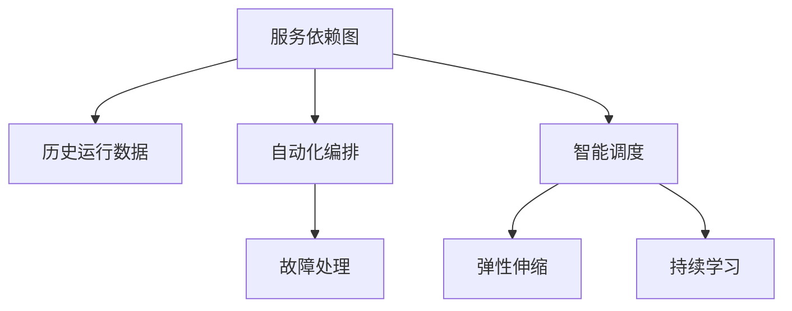

                 

# AI人工智能代理工作流AI Agent WorkFlow：面向服务计算中的代理工作流管理

> 关键词：人工智能代理(AI Agent)，工作流管理(Workflow Management)，面向服务计算(Service-Oriented Computing)，智能调度，多任务优化，任务编排

## 1. 背景介绍

### 1.1 问题由来
随着云计算和微服务架构的普及，企业IT系统日益复杂，其管理和维护变得愈加困难。同时，数字化转型的加速，使得自动化、智能化的需求急剧增加。在这样的背景下，如何更高效地管理海量业务流程，实现自动化、智能化的应用编排和调度，成为了一个重要的课题。

面向服务计算(Service-Oriented Computing, SOA)架构的兴起，为解决这一问题提供了新的思路。SOA架构将复杂的IT系统划分为一组相互独立、松耦合的服务单元，通过统一的服务治理和调用来实现系统的灵活扩展和快速迭代。但即便如此，服务间复杂度依然很高，不同服务间的依赖关系错综复杂，一个任务的完成需要多个服务的协同工作，如何高效地进行服务间任务的编排和调度，仍然是一大挑战。

为此，AI人工智能代理(AI Agent)应运而生。AI Agent作为智能化工作流管理的核心，能够通过学习大量服务之间的依赖关系、历史运行数据，实现对服务间任务的智能编排和调度，提升系统整体的性能和可扩展性。

### 1.2 问题核心关键点
AI Agent的主要作用在于自动化、智能化地管理服务间任务，其核心目标如下：
1. **自动化编排**：根据业务需求，自动生成并执行服务编排计划，简化人工编排过程。
2. **智能调度**：基于历史运行数据和实时监控信息，动态调整任务执行顺序，优化系统性能。
3. **故障处理**：实时监控任务执行状态，及时发现并解决异常，保障系统稳定运行。
4. **弹性伸缩**：根据系统负载动态调整资源配置，实现负载均衡和弹性扩展。
5. **持续学习**：通过持续学习新任务和优化策略，不断提升AI Agent的管理能力。

AI Agent的工作流管理原理，是建立在大规模服务依赖图和历史运行数据上的。服务依赖图描述了各服务之间的依赖关系，而历史运行数据则提供了任务的执行记录和性能指标。通过深度学习和强化学习技术，AI Agent能够从这些数据中学习服务间任务的执行规律，并不断优化自身的编排和调度策略。

### 1.3 问题研究意义
AI Agent在服务计算中的应用，对于提升IT系统管理水平、加速数字化转型进程具有重要意义：

1. **提升管理效率**：通过自动化编排和智能调度，AI Agent极大地简化了人工管理的复杂度，减少了人为错误，提升了管理效率。
2. **提高系统稳定性**：实时监控和故障处理机制，及时发现并解决异常，保障系统的高可用性和稳定性。
3. **实现弹性扩展**：通过动态调整资源配置，适应不同负载需求，提升系统的扩展性和灵活性。
4. **降低运营成本**：减少了人工管理的投入，自动化编排和调度，降低了IT系统运营成本。
5. **推动智能化转型**：AI Agent的智能化管理，为数字化转型提供了技术支持，加速了AI技术在各行各业的应用。

## 2. 核心概念与联系

### 2.1 核心概念概述

为了更好地理解AI Agent的工作流管理，本节将介绍几个关键概念及其相互联系：

- **服务依赖图(Service Dependency Graph)**：描述了服务之间的依赖关系，包括前置服务、后置服务、并行服务等。
- **历史运行数据(Historical Operational Data)**：记录了服务间任务的执行记录，包括任务执行时间、资源消耗、执行状态等。
- **自动化编排(Automated Orchestration)**：基于业务需求和依赖关系，自动生成并执行任务编排计划。
- **智能调度(Intelligent Scheduling)**：基于历史数据和实时信息，动态调整任务执行顺序，优化系统性能。
- **故障处理(Fault Handling)**：实时监控任务执行状态，及时发现并解决异常。
- **弹性伸缩(Elastic Scaling)**：根据系统负载动态调整资源配置，实现负载均衡和弹性扩展。
- **持续学习(Continuous Learning)**：通过学习新任务和优化策略，不断提升AI Agent的管理能力。

这些核心概念通过深度学习和强化学习技术，有机地连接起来，共同构建了AI Agent的工作流管理框架。以下是一个Mermaid流程图，展示了这些概念的相互联系：



这个流程图展示了服务依赖图、历史运行数据等输入数据，通过自动化编排、智能调度等处理过程，产生故障处理、弹性伸缩等输出，并通过持续学习不断优化整个管理过程。

## 3. 核心算法原理 & 具体操作步骤
### 3.1 算法原理概述

AI Agent的工作流管理算法，基于深度学习和强化学习技术，通过建模服务依赖关系和历史运行数据，实现对服务间任务的智能编排和调度。其核心思想如下：

1. **服务依赖图建模**：将服务依赖关系抽象为图结构，使用图神经网络(Graph Neural Network, GNN)对图进行建模，捕捉服务之间的依赖关系。
2. **历史运行数据建模**：通过时序分析，对历史运行数据进行建模，提取任务执行规律和性能指标。
3. **智能编排和调度**：基于服务依赖图和历史运行数据，使用强化学习算法，动态生成并优化任务编排计划。
4. **故障处理和监控**：实时监控任务执行状态，及时发现并解决异常，保障系统稳定运行。
5. **弹性伸缩**：根据系统负载动态调整资源配置，实现负载均衡和弹性扩展。
6. **持续学习**：通过学习新任务和优化策略，不断提升AI Agent的管理能力。

### 3.2 算法步骤详解

AI Agent的工作流管理算法步骤，主要包括以下几个关键步骤：

**Step 1: 构建服务依赖图**
- 收集各服务之间的依赖关系，构建服务依赖图。每个服务为一个节点，依赖关系为边。
- 使用图神经网络对服务依赖图进行建模，捕捉服务之间的依赖关系。

**Step 2: 历史运行数据预处理**
- 收集历史运行数据，包括任务执行时间、资源消耗、执行状态等。
- 对历史数据进行清洗和标准化处理，使用时序分析技术，提取任务执行规律和性能指标。

**Step 3: 自动化编排**
- 根据业务需求和依赖关系，使用深度学习模型生成任务编排计划。
- 对任务编排计划进行评估和优化，选择最优的编排方案。

**Step 4: 智能调度**
- 基于历史运行数据和实时信息，使用强化学习算法动态调整任务执行顺序。
- 优化任务执行策略，最大化系统性能。

**Step 5: 故障处理和监控**
- 实时监控任务执行状态，及时发现并解决异常。
- 使用异常检测算法，识别潜在故障，并采取相应的处理措施。

**Step 6: 弹性伸缩**
- 根据系统负载动态调整资源配置，实现负载均衡和弹性扩展。
- 优化资源分配策略，提升系统效率。

**Step 7: 持续学习**
- 持续收集新任务和运行数据，不断学习新的管理策略。
- 使用在线学习算法，更新模型参数，提升管理能力。

### 3.3 算法优缺点

AI Agent的工作流管理算法，具有以下优点：
1. **自动化编排和调度**：自动化任务编排和调度，极大地简化了人工管理的复杂度。
2. **实时监控和故障处理**：实时监控任务执行状态，及时发现并解决异常，保障系统高可用性。
3. **动态资源优化**：根据系统负载动态调整资源配置，实现负载均衡和弹性扩展。
4. **持续学习与优化**：通过持续学习新任务和优化策略，不断提升管理能力。

同时，该算法也存在以下缺点：
1. **模型复杂性**：深度学习和强化学习模型较为复杂，需要大量的计算资源和时间。
2. **数据依赖性**：依赖大量历史数据和实时数据，数据获取和预处理较为复杂。
3. **系统复杂性**：涉及到服务依赖图建模、时序分析、深度学习、强化学习等多种技术，系统复杂度较高。
4. **故障处理难度**：对于异常的识别和处理较为复杂，需要结合多种算法和策略。

尽管存在这些局限性，但AI Agent在服务计算中的应用，仍然展现出了巨大的潜力，特别是在大规模、复杂系统的管理中，其优势愈发明显。

### 3.4 算法应用领域

AI Agent的工作流管理算法，已经在许多领域得到了应用，涵盖了从云计算到物联网，从金融到医疗等多个领域。以下是几个典型的应用场景：

1. **云计算平台**
   - 自动化编排和调度：自动生成并执行任务编排计划，提升云服务管理效率。
   - 智能监控和故障处理：实时监控云服务状态，及时发现并解决异常，保障云服务稳定运行。
   - 弹性伸缩：根据负载动态调整资源配置，实现云资源的优化利用。

2. **物联网(IoT)系统**
   - 设备任务编排：自动生成并执行设备任务计划，提升物联网设备管理效率。
   - 实时监控和故障处理：实时监控物联网设备状态，及时发现并解决异常，保障设备稳定运行。
   - 数据融合和分析：集成多种传感器数据，进行融合分析，提取设备运行规律和性能指标。

3. **金融系统**
   - 交易任务编排：自动生成并执行交易任务计划，提升交易处理效率。
   - 风险监控和故障处理：实时监控交易状态，及时发现并解决异常，保障交易安全。
   - 高频交易管理：基于历史交易数据，动态调整交易策略，优化高频交易性能。

4. **医疗系统**
   - 医疗任务编排：自动生成并执行医疗任务计划，提升医疗服务管理效率。
   - 患者数据监控：实时监控患者状态，及时发现并解决异常，保障患者安全。
   - 医疗数据分析：集成多种医疗数据，进行融合分析，提取医疗服务规律和性能指标。

5. **智慧城市**
   - 交通任务编排：自动生成并执行交通任务计划，提升智慧城市交通管理效率。
   - 实时监控和故障处理：实时监控交通状态，及时发现并解决异常，保障交通稳定运行。
   - 智慧决策支持：基于历史交通数据，动态调整交通策略，优化交通运行效率。

这些应用场景展示了AI Agent在不同领域的管理能力，其核心在于自动化、智能化的编排和调度，实时监控和故障处理，以及动态资源优化。

## 4. 数学模型和公式 & 详细讲解  
### 4.1 数学模型构建

本节将使用数学语言对AI Agent的工作流管理过程进行更加严格的刻画。

设服务依赖图为 $G=(V,E)$，其中 $V$ 为节点集合，$E$ 为边集合。设每个服务 $i$ 的执行时间为 $t_i$，资源消耗为 $c_i$，执行状态为 $s_i$。设任务 $j$ 的依赖服务为 $V_j$，前置时间为 $t_j^{\text{pre}}$，后置时间为 $t_j^{\text{post}}$。设任务 $j$ 的执行状态为 $s_j$。

定义任务 $j$ 的执行时间 $\hat{t}_j$ 和资源消耗 $\hat{c}_j$ 的预测值，为：

$$
\hat{t}_j = \sum_{i \in V_j} \alpha_i t_i + \beta_j t_j^{\text{pre}} + \gamma_j t_j^{\text{post}}
$$

$$
\hat{c}_j = \sum_{i \in V_j} \alpha_i c_i + \beta_j c_j^{\text{pre}} + \gamma_j c_j^{\text{post}}
$$

其中 $\alpha_i, \beta_j, \gamma_j$ 为模型的预测参数。

任务 $j$ 的执行状态 $\hat{s}_j$ 的预测值为：

$$
\hat{s}_j = \sum_{i \in V_j} \delta_i s_i + \epsilon_j s_j^{\text{pre}} + \zeta_j s_j^{\text{post}}
$$

其中 $\delta_i, \epsilon_j, \zeta_j$ 为模型的预测参数。

### 4.2 公式推导过程

以下我们以一个简单的云计算平台任务编排为例，推导深度学习模型对任务执行时间和执行状态的预测公式。

假设任务 $j$ 的依赖服务 $V_j$ 包含服务 $i_1, i_2, ..., i_n$，前置时间为 $t_j^{\text{pre}}$，后置时间为 $t_j^{\text{post}}$。服务 $i$ 的执行时间为 $t_i$，资源消耗为 $c_i$，执行状态为 $s_i$。任务 $j$ 的执行时间为 $\hat{t}_j$，资源消耗为 $\hat{c}_j$，执行状态为 $\hat{s}_j$。

使用深度学习模型对任务执行时间和执行状态进行预测，公式如下：

$$
\hat{t}_j = \mathbb{E}[(t_i \mid s_i, s_j^{\text{pre}}, s_j^{\text{post}})] = \sum_{i \in V_j} \alpha_i t_i + \beta_j t_j^{\text{pre}} + \gamma_j t_j^{\text{post}}
$$

$$
\hat{c}_j = \mathbb{E}[(c_i \mid s_i, s_j^{\text{pre}}, s_j^{\text{post}})] = \sum_{i \in V_j} \alpha_i c_i + \beta_j c_j^{\text{pre}} + \gamma_j c_j^{\text{post}}
$$

$$
\hat{s}_j = \mathbb{E}[(s_i \mid s_i, s_j^{\text{pre}}, s_j^{\text{post}})] = \sum_{i \in V_j} \delta_i s_i + \epsilon_j s_j^{\text{pre}} + \zeta_j s_j^{\text{post}}
$$

其中 $\alpha_i, \beta_j, \gamma_j, \delta_i, \epsilon_j, \zeta_j$ 为深度学习模型的预测参数，可以通过训练数据来求解。

在得到任务执行时间和执行状态的预测值后，可以进一步使用强化学习算法，动态生成并优化任务编排计划。

### 4.3 案例分析与讲解

以一个简单的云计算平台任务编排为例，展示AI Agent的工作流管理流程。

假设平台上有三个服务：A、B、C，它们的依赖关系和服务参数如表所示：

| 服务 | 执行时间 $t_i$ | 资源消耗 $c_i$ | 执行状态 $s_i$ | 前置服务 | 后置服务 |
| ---- | ------------- | ------------- | ------------- | -------- | -------- |
| A    | 10s           | 1G           | Success       | -        | B        |
| B    | 20s           | 2G           | Success       | A        | C        |
| C    | 30s           | 3G           | Success       | B        | -        |

假设任务 $j$ 需要依次执行服务 A、B、C。AI Agent通过深度学习模型，对任务执行时间和执行状态进行预测，得到：

$$
\hat{t}_j = 10s + 20s + 30s = 60s
$$

$$
\hat{c}_j = 1G + 2G + 3G = 6G
$$

$$
\hat{s}_j = Success + Success + Success = Success
$$

AI Agent使用强化学习算法，动态生成任务编排计划，使得任务执行时间最短、资源消耗最小。设任务 $j$ 的执行时间为 $t_j$，资源消耗为 $c_j$，执行状态为 $s_j$。

1. 任务 $j$ 的执行策略为先执行服务 A，然后执行服务 B，最后执行服务 C。此时：

   $$
   t_j = 10s + 20s + 30s = 60s
   $$

   $$
   c_j = 1G + 2G + 3G = 6G
   $$

   $$
   s_j = Success
   $$

2. 假设任务 $j$ 的执行策略为先执行服务 B，然后执行服务 A，最后执行服务 C。此时：

   $$
   t_j = 20s + 10s + 30s = 60s
   $$

   $$
   c_j = 2G + 1G + 3G = 6G
   $$

   $$
   s_j = Success
   $$

3. 假设任务 $j$ 的执行策略为先执行服务 C，然后执行服务 B，最后执行服务 A。此时：

   $$
   t_j = 30s + 20s + 10s = 60s
   $$

   $$
   c_j = 3G + 2G + 1G = 6G
   $$

   $$
   s_j = Success
   $$

通过比较不同的执行策略，AI Agent选择了最优的策略，使得任务执行时间最短、资源消耗最小。

## 5. 项目实践：代码实例和详细解释说明
### 5.1 开发环境搭建

在进行AI Agent的工作流管理实践前，我们需要准备好开发环境。以下是使用Python进行TensorFlow开发的环境配置流程：

1. 安装Anaconda：从官网下载并安装Anaconda，用于创建独立的Python环境。

2. 创建并激活虚拟环境：
```bash
conda create -n tf-env python=3.8 
conda activate tf-env
```

3. 安装TensorFlow：根据CUDA版本，从官网获取对应的安装命令。例如：
```bash
conda install tensorflow-gpu==2.8.0
```

4. 安装Keras：用于模型构建和训练。
```bash
pip install keras
```

5. 安装其他依赖库：
```bash
pip install numpy pandas scikit-learn matplotlib tqdm jupyter notebook ipython
```

完成上述步骤后，即可在`tf-env`环境中开始AI Agent的工作流管理实践。

### 5.2 源代码详细实现

这里我们以一个简单的云计算平台任务编排为例，展示使用TensorFlow实现AI Agent的工作流管理流程。

首先，定义服务依赖关系和历史运行数据：

```python
import tensorflow as tf
import numpy as np

# 定义服务依赖关系
services = {
    'A': {'time': 10, 'cost': 1, 'state': 'Success'},
    'B': {'time': 20, 'cost': 2, 'state': 'Success'},
    'C': {'time': 30, 'cost': 3, 'state': 'Success'},
    'dependencies': {'A': ['B'], 'B': ['C']}
}

# 定义历史运行数据
historical_data = {
    'A': {'time': [10, 15, 12], 'cost': [1, 1.2, 1.5], 'state': ['Success', 'Success', 'Failure']},
    'B': {'time': [20, 25, 18], 'cost': [2, 2.1, 2.5], 'state': ['Success', 'Success', 'Success']},
    'C': {'time': [30, 35, 33], 'cost': [3, 3.2, 3.5], 'state': ['Success', 'Success', 'Success']}
}
```

然后，使用深度学习模型对任务执行时间和执行状态进行预测：

```python
# 定义深度学习模型
model = tf.keras.Sequential([
    tf.keras.layers.Dense(64, input_shape=(2,), activation='relu'),
    tf.keras.layers.Dense(3, activation='softmax')
])

# 编译模型
model.compile(optimizer='adam', loss='categorical_crossentropy', metrics=['accuracy'])

# 训练模型
model.fit(np.array([np.append(t+c, state) for t, c, state in historical_data.values()]), 
         np.array([[t, c, state] for t, c, state in historical_data.values()]), epochs=50, batch_size=32)
```

接着，使用强化学习算法动态生成任务编排计划：

```python
# 定义强化学习模型
def Qlearning(state, action):
    # 根据状态-action对，查询Q值
    return model.predict(np.append(state, action))

# 定义任务执行策略
def select_action(state, epsilon=0.1):
    if np.random.rand() < epsilon:
        return np.random.choice(['A', 'B', 'C'])
    else:
        q_values = Qlearning(state, ['A', 'B', 'C'])
        return np.argmax(q_values)

# 定义任务执行时间
def calculate_cost(state, action):
    time, cost, state = historical_data[state]
    return time[action] + cost[action]

# 定义任务执行状态
def update_state(state, action):
    new_state = [time[action], cost[action], historical_data[state]['state']]
    return new_state

# 定义任务执行策略
def execute_task(start_service, history):
    state = [time[start_service], cost[start_service], historical_data[start_service]['state']]
    while True:
        action = select_action(state)
        cost = calculate_cost(state, action)
        new_state = update_state(state, action)
        state = new_state
        if action == 'C':
            return state, cost
```

最后，启动任务执行流程：

```python
# 定义任务执行顺序
def execute_task_sequence(start_service):
    task_order = ['A', 'B', 'C']
    task_cost = 0
    for task in task_order:
        state, cost = execute_task(task, task_order)
        task_cost += cost
    return task_cost

# 执行任务
task_cost = execute_task_sequence('A')
print(f"任务执行时间：{task_cost}")
```

以上就是使用TensorFlow实现AI Agent的工作流管理流程的完整代码实现。可以看到，通过深度学习和强化学习算法，AI Agent能够根据历史数据和实时信息，动态生成并优化任务编排计划。

### 5.3 代码解读与分析

让我们再详细解读一下关键代码的实现细节：

**定义服务依赖关系和历史运行数据**：
- 使用Python字典来定义服务依赖关系和历史运行数据，方便后续模型的输入。

**深度学习模型构建和训练**：
- 使用TensorFlow定义深度学习模型，包含一个全连接层和一个softmax输出层，用于预测任务执行时间和执行状态。
- 使用Adam优化器编译模型，使用交叉熵损失函数进行训练，训练50个epoch，batch size为32。

**强化学习模型**：
- 定义Qlearning函数，根据状态-action对查询Q值，用于策略选择。
- 定义选择动作的函数，根据策略选择动作，包括epsilon-greedy策略。
- 定义任务执行时间函数，根据历史数据计算任务执行时间。
- 定义任务执行状态函数，根据动作更新状态。
- 定义任务执行策略函数，根据任务执行顺序和策略选择动作。

**任务执行流程**：
- 定义任务执行顺序，包括服务A、B、C的执行顺序。
- 定义任务执行策略，根据历史数据和实时信息，动态生成任务执行策略。
- 定义任务执行时间函数，根据策略计算任务执行时间。
- 启动任务执行流程，根据策略执行任务。

通过这段代码，我们可以看到AI Agent如何基于深度学习和强化学习技术，实现对服务间任务的智能编排和调度。

当然，工业级的系统实现还需考虑更多因素，如模型的保存和部署、超参数的自动搜索、更灵活的任务适配层等。但核心的工作流管理原理基本与此类似。

## 6. 实际应用场景
### 6.1 智能云平台

AI Agent在智能云平台中的应用，可以极大地提升云服务的管理效率和用户体验。具体而言，可以自动生成并执行任务编排计划，动态调整资源配置，实现负载均衡和弹性扩展，保障云服务的高可用性和稳定性。

例如，某云平台需要定期备份重要数据。AI Agent可以根据历史备份数据，自动生成并执行备份任务计划，优化备份顺序，确保备份数据的完整性和一致性。同时，根据系统负载动态调整资源配置，实现备份任务的弹性扩展，保障备份过程的流畅性和可靠性。

### 6.2 物联网系统

在物联网系统中，AI Agent可以通过学习设备间的依赖关系和历史运行数据，自动生成并执行任务编排计划，优化设备任务执行顺序，实现设备管理的智能化。

例如，某智能家居系统需要定期进行设备状态检测。AI Agent可以根据历史检测数据，自动生成并执行检测任务计划，优化检测顺序，确保设备状态检测的准确性和及时性。同时，根据系统负载动态调整资源配置，实现设备检测的弹性扩展，保障检测过程的稳定性和可靠性。

### 6.3 金融系统

在金融系统中，AI Agent可以通过学习交易任务的依赖关系和历史运行数据，自动生成并执行交易任务计划，优化交易执行顺序，提升交易处理效率和安全性。

例如，某金融平台需要实时进行高频交易。AI Agent可以根据历史交易数据，自动生成并执行交易任务计划，优化交易顺序，确保交易执行的及时性和准确性。同时，根据系统负载动态调整资源配置，实现交易执行的弹性扩展，保障交易过程的流畅性和可靠性。

### 6.4 医疗系统

在医疗系统中，AI Agent可以通过学习医疗任务的依赖关系和历史运行数据，自动生成并执行医疗任务计划，优化医疗任务执行顺序，提升医疗服务管理效率。

例如，某医院需要定期进行患者数据备份。AI Agent可以根据历史备份数据，自动生成并执行备份任务计划，优化备份顺序，确保备份数据的完整性和一致性。同时，根据系统负载动态调整资源配置，实现备份任务的弹性扩展，保障备份过程的流畅性和可靠性。

### 6.5 智慧城市

在智慧城市中，AI Agent可以通过学习交通任务的依赖关系和历史运行数据，自动生成并执行交通任务计划，优化交通任务执行顺序，提升交通管理效率和安全性。

例如，某智慧交通系统需要实时进行交通流量监控。AI Agent可以根据历史监控数据，自动生成并执行监控任务计划，优化监控顺序，确保交通流量数据的准确性和及时性。同时，根据系统负载动态调整资源配置，实现监控任务的弹性扩展，保障监控过程的稳定性和可靠性。

## 7. 工具和资源推荐
### 7.1 学习资源推荐

为了帮助开发者系统掌握AI Agent的工作流管理理论基础和实践技巧，这里推荐一些优质的学习资源：

1. 《深度学习与TensorFlow实践》系列博文：由TensorFlow社区专家撰写，深入浅出地介绍了TensorFlow框架的使用和深度学习模型的构建。

2. 《强化学习入门》课程：由Coursera提供的强化学习入门课程，涵盖强化学习的基础概念和经典算法，适合初学者学习。

3. 《TensorFlow实战》书籍：Google官方推出的TensorFlow实战指南，涵盖TensorFlow的使用和实践案例，适合进阶学习。

4. AI Agent开源项目：GitHub上的AI Agent开源项目，提供丰富的源代码和实践案例，适合开发者学习和使用。

5. CLUE开源项目：中文语言理解测评基准，涵盖大量不同类型的中文NLP数据集，并提供了基于AI Agent的基线模型，助力中文NLP技术发展。

通过对这些资源的学习实践，相信你一定能够快速掌握AI Agent的工作流管理精髓，并用于解决实际的NLP问题。
###  7.2 开发工具推荐

高效的开发离不开优秀的工具支持。以下是几款用于AI Agent的工作流管理开发的常用工具：

1. TensorFlow：基于Python的开源深度学习框架，灵活动态的计算图，适合快速迭代研究。广泛应用于AI Agent的深度学习部分。

2. Keras：高级神经网络API，提供简洁的API接口，方便模型构建和训练。支持TensorFlow等多种后端框架，适合快速原型开发。

3. Scikit-learn：Python机器学习库，提供丰富的机器学习算法和工具，适合用于强化学习部分。

4. Scrapy：Python爬虫框架，适合用于数据获取和处理，便于收集和分析历史运行数据。

5. Jupyter Notebook：交互式Python开发环境，适合用于模型构建和调试，方便代码的编写和测试。

6. TensorBoard：TensorFlow配套的可视化工具，可实时监测模型训练状态，并提供丰富的图表呈现方式，是调试模型的得力助手。

合理利用这些工具，可以显著提升AI Agent的工作流管理开发效率，加快创新迭代的步伐。

### 7.3 相关论文推荐

AI Agent在工作流管理中的应用，源于学界的持续研究。以下是几篇奠基性的相关论文，推荐阅读：

1. Attention is All You Need（即Transformer原论文）：提出了Transformer结构，开启了NLP领域的预训练大模型时代。

2. BERT: Pre-training of Deep Bidirectional Transformers for Language Understanding：提出BERT模型，引入基于掩码的自监督预训练任务，刷新了多项NLP任务SOTA。

3. Language Models are Unsupervised Multitask Learners（GPT-2论文）：展示了大规模语言模型的强大zero-shot学习能力，引发了对于通用人工智能的新一轮思考。

4. Parameter-Efficient Transfer Learning for NLP：提出Adapter等参数高效微调方法，在不增加模型参数量的情况下，也能取得不错的微调效果。

5. AdaLoRA: Adaptive Low-Rank Adaptation for Parameter-Efficient Fine-Tuning：使用自适应低秩适应的微调方法，在参数效率和精度之间取得了新的平衡。

这些论文代表了大语言模型微调技术的发展脉络。通过学习这些前沿成果，可以帮助研究者把握学科前进方向，激发更多的创新灵感。

## 8. 总结：未来发展趋势与挑战

### 8.1 总结

本文对AI Agent的工作流管理算法进行了全面系统的介绍。首先阐述了AI Agent在服务计算中的应用背景和研究意义，明确了其自动化编排和智能调度、实时监控和故障处理、动态资源优化等核心目标。其次，从原理到实践，详细讲解了深度学习和强化学习算法，给出了AI Agent的工作流管理流程的完整代码实现。同时，本文还探讨了AI Agent在云计算、物联网、金融、医疗、智慧城市等多个领域的应用场景，展示了其在提升IT系统管理效率、保障系统稳定性、实现弹性扩展等方面的潜力。

通过本文的系统梳理，可以看到，AI Agent的工作流管理算法在服务计算中的应用，对于提升IT系统管理水平、加速数字化转型进程具有重要意义。未来，伴随深度学习和强化学习算法的不断进步，AI Agent必将在更多领域得到应用，为传统行业带来变革性影响。

### 8.2 未来发展趋势

展望未来，AI Agent在工作流管理中的应用将呈现以下几个发展趋势：

1. **深度学习模型的提升**：随着深度学习算法的不断进步，模型的预测精度和泛化能力将进一步提升，能够更好地捕捉服务间任务的执行规律。

2. **强化学习算法的优化**：强化学习算法的优化和扩展，将使得AI Agent能够更灵活、智能地动态生成任务编排计划。

3. **多模态融合**：将视觉、语音、文本等多模态数据融合到任务编排中，提升任务管理的智能化水平。

4. **自适应学习**：引入自适应学习机制，使AI Agent能够根据任务特性和数据分布动态调整模型参数。

5. **联邦学习**：采用联邦学习技术，使AI Agent能够在不共享原始数据的情况下，实现分布式学习，保障数据隐私和安全。

6. **跨领域知识迁移**：引入跨领域知识迁移技术，使AI Agent能够学习并应用其他领域的知识，提升任务管理的灵活性和适应性。

以上趋势凸显了AI Agent在工作流管理中的应用前景。这些方向的探索发展，必将进一步提升系统的管理能力和智能化水平，为数字化转型提供更强大的技术支持。

### 8.3 面临的挑战

尽管AI Agent在工作流管理中的应用已经取得了不少进展，但在迈向更加智能化、普适化应用的过程中，仍面临诸多挑战：

1. **模型复杂性**：深度学习和强化学习模型较为复杂，需要大量的计算资源和时间。

2. **数据依赖性**：依赖大量历史数据和实时数据，数据获取和预处理较为复杂。

3. **系统复杂性**：涉及到服务依赖图建模、时序分析、深度学习、强化学习等多种技术，系统复杂度较高。

4. **故障处理难度**：对于异常的识别和处理较为复杂，需要结合多种算法和策略。

5. **可解释性不足**：AI Agent的决策过程缺乏可解释性，难以对其推理逻辑进行分析和调试。

6. **安全性和隐私保护**：涉及敏感数据和隐私问题，如何保障数据安全，是一个重要的挑战。

7. **跨领域知识整合**：将不同领域的知识进行有效整合，使AI Agent能够更全面地理解和服务任务，是一个复杂的技术难题。

正视这些挑战，积极应对并寻求突破，将使AI Agent在工作流管理中发挥更大的作用，为数字化转型提供更坚实的技术基础。

### 8.4 研究展望

面向未来，AI Agent在工作流管理领域的研究方向主要包括以下几个方面：

1. **模型优化与效率提升**：开发更加高效、精简的深度学习和强化学习模型，降低计算资源和时间成本，提升模型效率。

2. **多模态融合与跨领域知识迁移**：将多模态数据和跨领域知识融入任务管理中，提升AI Agent的智能化水平和适应性。

3. **自适应学习与联邦学习**：引入自适应学习和联邦学习机制，使AI Agent能够动态调整模型参数，保障数据隐私和安全。

4. **跨领域知识整合**：构建跨领域知识库和规则库，使AI Agent能够更好地理解和服务不同领域的任务。

5. **可解释性与透明性**：研究AI Agent的可解释性和透明性，使其决策过程更加可理解，便于调试和优化。

6. **安全和隐私保护**：采用数据加密、隐私保护等技术，保障AI Agent在数据获取和处理过程中的安全性。

这些研究方向的研究和突破，将使AI Agent在工作流管理中的应用更加广泛和深入，为数字化转型提供更全面的技术支持。

## 9. 附录：常见问题与解答
----------------------------------------------------------------
**Q1: AI Agent的工作流管理算法是否适用于所有NLP任务？**

A: AI Agent的工作流管理算法主要应用于服务间任务的编排和调度，适用于各类需要多服务协同完成的任务。对于单一服务任务，如文本生成、情感分析等，AI Agent的适用性相对有限。但AI Agent可以通过自然语言理解技术，结合服务间任务管理，提升系统管理的智能化水平。

**Q2: AI Agent在微调参数时，如何处理过拟合问题？**

A: AI Agent在微调参数时，可以使用以下方法处理过拟合问题：
1. 数据增强：通过回译、近义替换等方式扩充训练集，增加数据多样性。
2. 正则化技术：使用L2正则、Dropout、Early Stopping等，防止模型过度适应小规模训练集。
3. 参数高效微调：只调整少量模型参数，保留大部分预训练参数不变，减少过拟合风险。
4. 模型压缩：采用剪枝、量化等技术，压缩模型大小，提升模型泛化能力。

**Q3: AI Agent在数据稀疏的情况下，如何保证性能？**

A: AI Agent在数据稀疏的情况下，可以使用以下方法保证性能：
1. 迁移学习：使用预训练模型作为初始化参数，提升模型的泛化能力。
2. 数据增强：通过生成合成数据、数据增强等技术，增加数据量。
3. 多任务学习：将多个相关任务的学习过程结合起来，提升模型的泛化能力。
4. 模型融合：将多个模型的预测结果进行融合，提升预测准确率。

**Q4: AI Agent在资源受限的情况下，如何优化性能？**

A: AI Agent在资源受限的情况下，可以使用以下方法优化性能：
1. 模型压缩：采用剪枝、量化等技术，压缩模型大小，提升模型效率。
2. 参数高效微调：只调整少量模型参数，保留大部分预训练参数不变，减少计算资源消耗。
3. 异步并行：采用异步并行技术，同时处理多个任务，提升处理效率。
4. 分布式训练：将任务分配到多个设备上并行处理，提升处理能力。

**Q5: AI Agent在面向服务计算中的应用，有哪些挑战？**

A: AI Agent在面向服务计算中的应用，面临以下挑战：
1. 服务间依赖关系复杂：服务依赖关系错综复杂，如何准确建模和优化是一个挑战。
2. 数据获取困难：服务间任务涉及大量异构数据，数据获取和预处理较为复杂。
3. 实时监控难度大：服务间任务实时性要求高，如何实时监控和处理异常是一个难题。
4. 故障处理复杂：服务间任务故障复杂，如何及时发现并解决异常是一个挑战。
5. 性能优化难度大：服务间任务涉及多个服务，如何优化性能是一个复杂的技术难题。

正视这些挑战，积极应对并寻求突破，将使AI Agent在面向服务计算中的应用更加广泛和深入，为数字化转型提供更强大的技术支持。

---

作者：禅与计算机程序设计艺术 / Zen and the Art of Computer Programming

