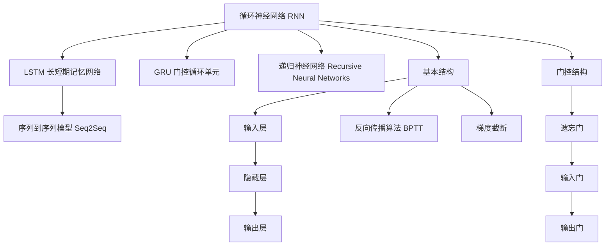

                 

# AI人工智能深度学习算法：循环神经网络的理解与使用

> 关键词：循环神经网络（RNN），长短期记忆网络（LSTM），门控循环单元（GRU），递归神经网络（Recursive Neural Networks），序列到序列模型（Seq2Seq）

## 1. 背景介绍

### 1.1 问题由来

在深度学习中，循环神经网络（Recurrent Neural Networks, RNN）作为一类重要的序列建模算法，因其能够处理变长输入序列的特性，被广泛应用于自然语言处理（Natural Language Processing, NLP）、语音识别、时间序列预测等多个领域。然而，传统的RNN存在梯度消失和梯度爆炸等问题，难以处理长序列。长短期记忆网络（Long Short-Term Memory, LSTM）和门控循环单元（Gated Recurrent Units, GRU）等改进型RNN结构应运而生，进一步提升了序列建模的效果和效率。

近年来，随着深度学习的飞速发展，基于循环神经网络的模型在多模态数据处理、自动问答系统、机器翻译等复杂任务中取得了显著的突破，成为实现深度学习目标的重要工具之一。循环神经网络作为深度学习中一个重要的子领域，不仅在学术界引起了广泛的关注，也在工业界得到了广泛的应用，其研究进展和应用前景都值得深入探讨。

### 1.2 问题核心关键点

循环神经网络的主要研究问题包括：

1. 如何处理长序列和记忆丢失问题。
2. 如何选择最优的门控结构。
3. 如何平衡模型的复杂度和泛化能力。
4. 如何在不同场景下优化模型的性能。

这些关键问题涉及循环神经网络的基础理论、架构设计和算法优化等多个方面，需要通过系统性的学习和实践才能真正掌握。

## 2. 核心概念与联系

### 2.1 核心概念概述

循环神经网络是一种特殊的神经网络，其结构允许网络中信息在时间维度上循环流动，能够处理变长序列数据。与传统的前馈神经网络不同，RNN在处理序列数据时，能够将当前时刻的输入和历史信息结合起来，形成动态的时间依赖关系，使其具有强大的序列建模能力。

循环神经网络主要包括：

1. 基本结构：由输入层、隐藏层和输出层组成，隐藏层通过循环连接，构成时间维度上的信息传递链。
2. 门控结构：LSTM、GRU等改进型结构通过引入门控机制，有效控制信息流动，提升模型性能。
3. 训练算法：常用的训练算法包括反向传播算法（Backpropagation Through Time, BPTT）、梯度截断等。

长短期记忆网络（LSTM）和门控循环单元（GRU）是循环神经网络的两种重要改进结构，其通过引入遗忘门、输入门、输出门等门控机制，解决了传统RNN在处理长序列时存在的梯度消失和梯度爆炸问题。LSTM和GRU在自然语言处理、时间序列预测等领域广泛应用。

递归神经网络（Recursive Neural Networks）是一类特殊的循环神经网络，通过树形结构递归处理序列数据，能够更有效地处理树形结构数据，如句法分析、决策树等。

序列到序列模型（Seq2Seq）是一类基于循环神经网络的模型，主要用于序列数据的转换和生成，如机器翻译、文本摘要、问答系统等。Seq2Seq模型通过编码器-解码器架构，实现序列间的转换，得到目标序列。

### 2.2 核心概念原理和架构的 Mermaid 流程图



这个流程图展示了循环神经网络的基本结构、改进型结构和训练算法之间的关系。其中，基本结构包含输入层、隐藏层和输出层，通过循环连接形成时间依赖关系。门控结构包括LSTM和GRU，通过引入遗忘门、输入门、输出门等机制控制信息流动，解决了梯度消失和梯度爆炸问题。训练算法如反向传播算法和梯度截断，用于优化模型参数，提高模型性能。

## 3. 核心算法原理 & 具体操作步骤

### 3.1 算法原理概述

循环神经网络的核心思想是通过在时间维度上的循环连接，处理变长输入序列。其基本原理是利用历史信息和当前输入，通过隐藏状态不断更新，形成动态的时间依赖关系。

循环神经网络的隐藏状态 $h_t$ 在时间 $t$ 时刻的更新公式如下：

$$
h_t = f(Ux_t + Wh_{t-1} + b)
$$

其中，$x_t$ 是当前时刻的输入，$h_{t-1}$ 是上一时刻的隐藏状态，$f$ 是激活函数，$U$、$W$、$b$ 是模型参数。

循环神经网络的输出 $y_t$ 在时间 $t$ 时刻的更新公式如下：

$$
y_t = g(Vh_t + C + d)
$$

其中，$g$ 是激活函数，$V$、$C$、$d$ 是模型参数。

循环神经网络的训练过程通常使用反向传播算法（Backpropagation Through Time, BPTT）和梯度截断等技术，通过不断更新模型参数，优化损失函数，提高模型性能。

### 3.2 算法步骤详解

循环神经网络的具体训练步骤包括：

1. 初始化模型参数：设置隐藏状态 $h_0$ 为零向量。
2. 前向传播：将输入序列 $x_1, x_2, ..., x_T$ 和隐藏状态 $h_0$ 输入模型，计算每个时刻的隐藏状态 $h_t$ 和输出 $y_t$。
3. 损失计算：根据输出 $y_t$ 和目标序列 $y_{1:T}$ 计算损失函数。
4. 反向传播：通过反向传播算法计算每个时刻的梯度，更新模型参数。
5. 梯度截断：当梯度过大使网络不稳定时，通过梯度截断技术控制梯度大小，避免梯度爆炸或消失。
6. 迭代优化：重复上述步骤，直到损失函数收敛。

### 3.3 算法优缺点

循环神经网络的主要优点包括：

1. 动态时间依赖：能够处理变长序列数据，通过历史信息和当前输入更新隐藏状态。
2. 序列建模能力强：适用于序列数据的建模和预测，如时间序列预测、语音识别等。
3. 可扩展性强：可以通过增加隐藏层、调整门控机制等方式提升模型性能。

然而，循环神经网络也存在一些缺点：

1. 梯度消失和梯度爆炸：在处理长序列时，存在梯度消失或梯度爆炸问题，难以处理长序列。
2. 参数量较大：由于循环连接的复杂性，模型参数量较大，训练过程耗时较长。
3. 计算复杂度高：由于时间维度上的循环连接，计算复杂度较高，难以处理大规模数据。

### 3.4 算法应用领域

循环神经网络广泛应用于以下几个领域：

1. 自然语言处理：如语言模型、文本生成、机器翻译、情感分析等。
2. 语音识别：如语音转文本、情感识别、说话人识别等。
3. 时间序列预测：如股票价格预测、天气预测、交通流量预测等。
4. 视频分析：如行为识别、动作识别、物体跟踪等。
5. 游戏智能：如智能游戏对战、策略生成等。

## 4. 数学模型和公式 & 详细讲解

### 4.1 数学模型构建

循环神经网络的数学模型主要包括以下部分：

1. 输入层：将序列数据 $x_1, x_2, ..., x_T$ 转换为向量形式。
2. 隐藏层：通过循环连接更新隐藏状态 $h_1, h_2, ..., h_T$。
3. 输出层：根据隐藏状态 $h_T$ 计算输出序列 $y_1, y_2, ..., y_T$。

定义输入层和输出层的映射函数为 $f$ 和 $g$，隐藏层的映射函数为 $h$，模型参数为 $\theta$，则循环神经网络的数学模型可以表示为：

$$
h_t = f(Ux_t + Wh_{t-1} + b)
$$

$$
y_t = g(Vh_t + C + d)
$$

其中，$U$、$W$、$V$、$C$、$b$、$d$ 是模型参数。

### 4.2 公式推导过程

在循环神经网络中，隐藏状态 $h_t$ 的递归更新公式如下：

$$
h_t = f(Ux_t + Wh_{t-1} + b)
$$

其中，$x_t$ 是当前时刻的输入，$h_{t-1}$ 是上一时刻的隐藏状态，$f$ 是激活函数，$U$、$W$、$b$ 是模型参数。

假设输入序列长度为 $T$，则循环神经网络的输出 $y_t$ 可以表示为：

$$
y_t = g(Vh_t + C + d)
$$

其中，$g$ 是激活函数，$V$、$C$、$d$ 是模型参数。

循环神经网络的损失函数通常为交叉熵损失函数，可以表示为：

$$
L = -\frac{1}{T} \sum_{t=1}^T \sum_{i=1}^C y_i \log(p_i)
$$

其中，$y$ 是真实标签，$p$ 是模型预测概率，$C$ 是分类数。

### 4.3 案例分析与讲解

以LSTM为例，其引入了遗忘门、输入门和输出门等门控机制，有效控制信息流动，解决了传统RNN在处理长序列时存在的梯度消失和梯度爆炸问题。LSTM的隐藏状态更新公式如下：

$$
i_t = \sigma(W_i x_t + U_i h_{t-1} + b_i)
$$

$$
f_t = \sigma(W_f x_t + U_f h_{t-1} + b_f)
$$

$$
o_t = \sigma(W_o x_t + U_o h_{t-1} + b_o)
$$

$$
g_t = \tanh(W_g x_t + U_g \odot (f_t \odot h_{t-1}) + b_g)
$$

$$
h_t = f_t \odot h_{t-1} + i_t \odot g_t
$$

其中，$i$、$f$、$o$、$g$ 分别是遗忘门、输入门、输出门和候选隐藏状态，$\sigma$ 是激活函数，$\tanh$ 是双曲正切函数，$U_g$ 和 $h_{t-1}$ 的乘积是元素乘法，$\odot$ 表示向量乘法，$W$、$U$、$b$ 是模型参数。

## 5. 项目实践：代码实例和详细解释说明

### 5.1 开发环境搭建

在进行循环神经网络的项目实践前，我们需要准备好开发环境。以下是使用Python进行TensorFlow开发的环境配置流程：

1. 安装Anaconda：从官网下载并安装Anaconda，用于创建独立的Python环境。

2. 创建并激活虚拟环境：
```bash
conda create -n rnn-env python=3.8 
conda activate rnn-env
```

3. 安装TensorFlow：根据CUDA版本，从官网获取对应的安装命令。例如：
```bash
conda install tensorflow
```

4. 安装Keras：用于简化模型构建和训练过程，可以安装最新版本的Keras。

5. 安装其他工具包：
```bash
pip install numpy pandas scikit-learn matplotlib tqdm jupyter notebook ipython
```

完成上述步骤后，即可在`rnn-env`环境中开始项目实践。

### 5.2 源代码详细实现

下面以手写数字识别任务为例，给出使用TensorFlow和Keras构建并训练LSTM模型的代码实现。

首先，导入必要的库和数据：

```python
import tensorflow as tf
from tensorflow.keras.datasets import mnist
from tensorflow.keras.models import Sequential
from tensorflow.keras.layers import Dense, LSTM, Dropout

(x_train, y_train), (x_test, y_test) = mnist.load_data()
x_train = x_train.reshape(-1, 28*28) / 255.0
x_test = x_test.reshape(-1, 28*28) / 255.0
y_train = tf.keras.utils.to_categorical(y_train)
y_test = tf.keras.utils.to_categorical(y_test)
```

然后，定义模型并编译：

```python
model = Sequential([
    LSTM(128, input_shape=(28*28,)),
    Dense(10, activation='softmax')
])

model.compile(loss='categorical_crossentropy',
              optimizer='adam',
              metrics=['accuracy'])
```

接着，训练模型并评估：

```python
model.fit(x_train, y_train, epochs=10, batch_size=64, validation_data=(x_test, y_test))
test_loss, test_acc = model.evaluate(x_test, y_test)
print('Test loss:', test_loss)
print('Test accuracy:', test_acc)
```

以上就是使用TensorFlow和Keras构建并训练LSTM模型的完整代码实现。可以看到，Keras库提供了方便的API，使得模型构建和训练过程非常简洁高效。

### 5.3 代码解读与分析

让我们再详细解读一下关键代码的实现细节：

**LSTM类**：
- 定义了一个包含128个隐藏状态的LSTM层，输入维度为28*28。
- 使用Dropout层减少过拟合，概率为0.2。
- 输出层为全连接层，输出10个分类节点。

**编译模型**：
- 使用交叉熵损失函数。
- 使用Adam优化器。
- 监控准确率。

**训练模型**：
- 在训练集上进行模型训练，设置迭代轮数为10，批次大小为64。
- 在验证集上进行模型验证，输出测试集的损失和准确率。

通过以上步骤，我们就完成了一个简单的LSTM模型训练过程，可以用于手写数字识别任务。

## 6. 实际应用场景

### 6.1 智能语音识别

循环神经网络在智能语音识别中得到了广泛应用。语音识别系统需要处理连续的语音信号，转化为文本，并从中提取出语音信息。循环神经网络能够处理变长序列，具备较强的序列建模能力，适合处理语音信号的时序特征。

在具体实现中，循环神经网络通常被嵌入到端到端（End-to-End）的语音识别模型中，通过训练获得连续语音信号到文本的映射关系，从而实现语音识别。例如，在语音识别任务中，可以使用循环神经网络将连续语音信号转换为文本，再通过文本分类器实现语音识别。

### 6.2 机器翻译

机器翻译是自然语言处理领域的重要任务，循环神经网络在机器翻译中也得到了广泛应用。循环神经网络能够处理序列数据的建模和生成，适合于文本到文本的转换任务。

在机器翻译任务中，通常使用循环神经网络构建编码器和解码器，通过端到端的训练，实现源语言文本到目标语言文本的翻译。例如，在序列到序列（Seq2Seq）模型中，编码器使用循环神经网络提取源语言文本的特征，解码器使用循环神经网络生成目标语言文本，通过联合训练，实现机器翻译。

### 6.3 时间序列预测

循环神经网络在时间序列预测中也得到了广泛应用。时间序列预测需要对历史数据进行建模，并预测未来的数据变化趋势。循环神经网络能够处理变长序列，具备较强的序列建模能力，适合于时间序列预测。

在时间序列预测任务中，通常使用循环神经网络构建模型，通过历史数据的时间依赖关系，预测未来的数据变化趋势。例如，在股票价格预测任务中，使用循环神经网络对历史股票价格数据进行建模，预测未来的股票价格走势。

## 7. 工具和资源推荐

### 7.1 学习资源推荐

为了帮助开发者系统掌握循环神经网络的理论基础和实践技巧，这里推荐一些优质的学习资源：

1. 《Deep Learning》（Goodfellow等）：经典的深度学习教材，系统介绍了深度学习的基本概念和算法，包括循环神经网络的原理和实现。
2. 《Neural Network and Deep Learning》（Goodfellow等）：深入浅出地介绍了神经网络的基本概念和算法，包括循环神经网络的原理和实现。
3. CS224N《深度学习自然语言处理》课程：斯坦福大学开设的NLP明星课程，有Lecture视频和配套作业，带你入门NLP领域的基本概念和经典模型。
4. 《Python深度学习》（Francois Chollet）：Keras的官方文档，介绍了Keras库的使用方法，包括循环神经网络的构建和训练。
5. 《Hands-On Machine Learning with Scikit-Learn, Keras, and TensorFlow》（Aurélien Géron）：系统介绍了机器学习的实现方法，包括循环神经网络的构建和训练。

通过对这些资源的学习实践，相信你一定能够快速掌握循环神经网络的精髓，并用于解决实际的NLP问题。

### 7.2 开发工具推荐

高效的开发离不开优秀的工具支持。以下是几款用于循环神经网络开发的常用工具：

1. TensorFlow：由Google主导开发的开源深度学习框架，生产部署方便，适合大规模工程应用。
2. Keras：基于TensorFlow的高级API，使用简便，适合快速原型设计和实验。
3. PyTorch：基于Python的开源深度学习框架，灵活高效，适合研究和实验。
4. Theano：由蒙特利尔大学开发的开源深度学习框架，提供了高效的数学表达式求导和数值计算。

合理利用这些工具，可以显著提升循环神经网络开发的效率，加快创新迭代的步伐。

### 7.3 相关论文推荐

循环神经网络的研究经历了几十年的发展，涉及多个领域的理论和应用。以下是几篇奠基性的相关论文，推荐阅读：

1. "Learning Phrase Representations using RNN Encoder Decoder for Statistical Machine Translation"（Cho等）：提出Seq2Seq模型，将循环神经网络用于机器翻译。
2. "Long Short-Term Memory"（Hochreiter等）：提出LSTM结构，解决了传统RNN在处理长序列时的梯度消失和梯度爆炸问题。
3. "A Gated Recurrent Unit"（Cho等）：提出GRU结构，进一步简化LSTM结构，提升模型性能。
4. "Recurrent Neural Network-based Architecture for Sentiment Analysis"（Karunasingh等）：将循环神经网络用于情感分析，提高了模型的情感识别能力。
5. "Recursive Neural Networks for Semantic Compositionality"（Zaremba等）：提出递归神经网络，用于句法分析，提高了模型的句法分析能力。

这些论文代表了大规模循环神经网络的发展脉络。通过学习这些前沿成果，可以帮助研究者把握学科前进方向，激发更多的创新灵感。

## 8. 总结：未来发展趋势与挑战

### 8.1 总结

本文对循环神经网络的基本原理和实践进行了全面系统的介绍。首先阐述了循环神经网络的基本结构、改进型结构和训练算法，明确了其在序列建模中的应用价值。其次，从原理到实践，详细讲解了循环神经网络的数学模型和算法步骤，给出了代码实例和详细解释。最后，讨论了循环神经网络在智能语音识别、机器翻译、时间序列预测等实际应用场景中的应用前景，提供了丰富的学习资源和开发工具。

通过本文的系统梳理，可以看到，循环神经网络作为深度学习中重要的序列建模算法，具备强大的动态时间依赖关系处理能力，广泛应用于自然语言处理、语音识别、时间序列预测等多个领域。随着深度学习的不断发展，循环神经网络的应用范围将更加广泛，未来前景广阔。

### 8.2 未来发展趋势

展望未来，循环神经网络的发展趋势包括：

1. 模型结构的不断优化：未来的循环神经网络将进一步提升模型的性能，优化结构设计，提高模型的泛化能力和鲁棒性。
2. 模型训练技术的进步：未来的训练技术将更加高效，更加适合大规模数据和复杂模型，提升模型的训练速度和稳定性。
3. 模型应用场景的拓展：未来的循环神经网络将应用于更多领域，如医疗、金融、制造等，解决实际问题，带来更多的应用价值。
4. 跨模态融合能力的提升：未来的循环神经网络将能够处理多模态数据，提升模型在图像、语音、文本等多种数据上的建模能力。
5. 智能化水平的提高：未来的循环神经网络将结合更多的智能技术，如强化学习、因果推理等，提升模型的智能化水平。

### 8.3 面临的挑战

尽管循环神经网络在多个领域取得了显著成果，但在迈向更加智能化、普适化应用的过程中，仍面临诸多挑战：

1. 梯度消失和梯度爆炸问题：在处理长序列时，循环神经网络仍存在梯度消失和梯度爆炸问题，难以处理大规模数据。
2. 模型复杂度和泛化能力的平衡：如何在保证模型性能的同时，减少参数量，提升模型的泛化能力，仍是一个需要解决的问题。
3. 计算资源和存储的限制：大规模循环神经网络需要大量计算资源和存储，如何优化模型结构，提升计算效率，仍是一个需要解决的问题。
4. 模型的可解释性问题：循环神经网络的内部机制和决策过程难以解释，难以进行模型的调试和优化。
5. 模型的安全性问题：循环神经网络可能会学习到有害的信息，如何确保模型的安全性，仍是一个需要解决的问题。

### 8.4 研究展望

面对循环神经网络所面临的挑战，未来的研究需要在以下几个方面寻求新的突破：

1. 研究更加高效的循环神经网络结构，提升模型的泛化能力和鲁棒性。
2. 研究更加高效的训练算法和优化策略，提升模型的训练速度和稳定性。
3. 研究更加高效的计算资源和存储技术，优化模型结构，提升计算效率。
4. 研究更加智能化的循环神经网络模型，提升模型的智能化水平。
5. 研究更加可解释的循环神经网络模型，提升模型的可解释性和可调试性。
6. 研究更加安全的循环神经网络模型，确保模型的安全性。

这些研究方向的探索，必将引领循环神经网络技术的进一步发展，为深度学习在各个领域的深入应用提供新的动力。总之，循环神经网络作为深度学习中重要的序列建模算法，具有广泛的应用前景，未来值得期待。

## 9. 附录：常见问题与解答

**Q1：循环神经网络和前馈神经网络的区别是什么？**

A: 循环神经网络是一种特殊的神经网络，其结构允许信息在时间维度上循环流动，能够处理变长输入序列。而前馈神经网络是一种标准的神经网络结构，信息只在前向传递，不具备时间依赖关系。

**Q2：循环神经网络中的梯度消失和梯度爆炸问题如何解决？**

A: 循环神经网络中的梯度消失和梯度爆炸问题通常通过改进网络结构来解决。例如，LSTM和GRU结构引入了遗忘门、输入门和输出门等门控机制，有效控制信息流动，解决了梯度消失和梯度爆炸问题。此外，还可以通过梯度截断、残差连接等技术提升模型的稳定性。

**Q3：循环神经网络的应用场景有哪些？**

A: 循环神经网络主要用于序列数据的建模和生成，适用于自然语言处理、语音识别、时间序列预测、视频分析、游戏智能等多个领域。

**Q4：如何评估循环神经网络的性能？**

A: 循环神经网络的性能评估通常包括准确率、损失函数、困惑度等指标。例如，在文本分类任务中，准确率和损失函数可以用来评估模型的分类效果；在语音识别任务中，困惑度可以用来评估模型的识别效果。

**Q5：循环神经网络的训练过程中需要注意哪些问题？**

A: 循环神经网络的训练过程中需要注意梯度消失和梯度爆炸问题、过拟合问题、模型复杂度和泛化能力的平衡等。可以通过梯度截断、正则化、Dropout等技术提升模型的泛化能力，避免过拟合。

通过本文的系统梳理，可以看到，循环神经网络作为深度学习中重要的序列建模算法，具备强大的动态时间依赖关系处理能力，广泛应用于自然语言处理、语音识别、时间序列预测等多个领域。随着深度学习的不断发展，循环神经网络的应用范围将更加广泛，未来前景广阔。未来，循环神经网络需要在模型结构、训练算法、应用场景等方面进行更多的研究和优化，以适应更加复杂和多样的应用需求。

