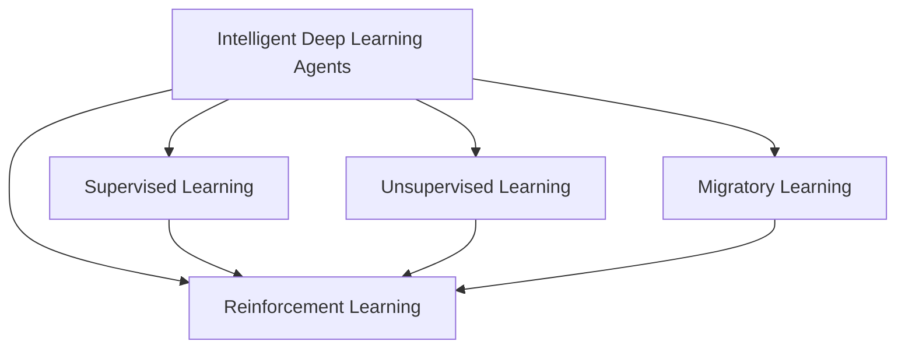

                 

# AI人工智能深度学习算法：智能深度学习代理的未来发展趋势

> 关键词：智能深度学习代理,未来发展趋势,深度学习算法,人工智能,强化学习,自监督学习,无监督学习,迁移学习

## 1. 背景介绍

### 1.1 问题由来

近年来，深度学习在人工智能(AI)领域取得了显著进展，推动了AI应用从数据驱动的监督学习向更为灵活和自适应的模型范式转变。在众多AI技术中，深度学习代理（Deep Learning Agents）因其强大的自主学习能力和对环境的适应性，成为AI领域的热点研究方向。

深度学习代理是指能够通过自主学习和决策，在复杂环境中不断优化的智能体。它们广泛应用在自动驾驶、机器人控制、游戏智能、智能推荐等领域，展示了强大的应用潜力和发展前景。然而，当前的深度学习代理在模型架构、训练方法、应用场景等方面仍存在诸多挑战，亟需进一步研究和突破。

### 1.2 问题核心关键点

当前深度学习代理的研究主要集中在以下几个方面：

- **模型架构**：如何选择和设计合适的模型架构，以支持智能体自主学习和复杂决策的能力。
- **训练方法**：如何高效地训练深度学习代理，使其能够在多种环境中自适应地进行学习和优化。
- **应用场景**：深度学习代理在自动驾驶、机器人、游戏等领域的实际应用效果如何，未来的应用前景如何。

本文将围绕上述核心问题，对深度学习代理的未来发展趋势进行全面探讨，以期为相关研究者和开发者提供参考。

## 2. 核心概念与联系

### 2.1 核心概念概述

在深度学习代理的研究中，涉及多个关键概念，包括：

- **智能深度学习代理**：能够通过深度学习技术自主学习、决策和优化的智能体。
- **强化学习**：通过与环境交互，智能体从经验中学习最优策略的框架。
- **自监督学习**：利用数据中未标注部分进行学习，提升模型的泛化能力。
- **无监督学习**：在没有标签的情况下，通过数据的分布特性进行学习。
- **迁移学习**：通过将知识从一个任务或环境迁移到另一个，提升模型在新环境的适应能力。

这些概念之间存在紧密的联系，共同构成了深度学习代理的核心理论基础。

### 2.2 核心概念原理和架构的 Mermaid 流程图(Mermaid 流程节点中不要有括号、逗号等特殊字符)



此图展示了智能深度学习代理的核心概念及其之间的关系：

1. **智能深度学习代理**：是整体研究的核心，通过强化学习、自监督学习和迁移学习等方法不断优化。
2. **强化学习**：利用与环境的交互，通过不断试错优化智能体的决策策略。
3. **自监督学习**：利用数据中未标注的部分进行学习，提升模型泛化能力。
4. **无监督学习**：在没有标签的情况下，通过数据的分布特性进行学习。
5. **迁移学习**：通过将知识从一个任务或环境迁移到另一个，提升模型在新环境的适应能力。

这些核心概念共同构成了深度学习代理的研究基础，展示了其在AI领域的重要性和潜力。

## 3. 核心算法原理 & 具体操作步骤

### 3.1 算法原理概述

深度学习代理的核心算法原理主要包括：强化学习、自监督学习和迁移学习。这些算法通过不同的模型和框架，支持智能体的自主学习、决策和优化。

**强化学习**：通过与环境交互，智能体根据当前状态和动作，接收奖励或惩罚信号，进而调整策略，以达到最大化奖励的目的。其核心在于构建一个奖励函数，评估智能体的行为表现，并根据奖励信号调整策略。

**自监督学习**：利用数据中未标注的部分进行学习，通过模型自身从数据中挖掘结构化的知识，提升模型的泛化能力。其核心在于设计合适的预训练任务，使得模型能够学习到通用的表示。

**迁移学习**：通过将知识从一个任务或环境迁移到另一个，提升模型在新环境的适应能力。其核心在于选择适当的迁移策略，确保迁移的知识在新环境中有用且不过度泛化。

### 3.2 算法步骤详解

深度学习代理的训练通常包括以下步骤：

**Step 1: 数据收集与预处理**
- 收集与任务相关的数据，并进行清洗和预处理，包括数据增强、归一化等操作。

**Step 2: 模型设计**
- 选择合适的模型架构，如卷积神经网络(CNN)、循环神经网络(RNN)、Transformer等，并对其进行适当修改以适应代理任务。

**Step 3: 模型训练**
- 使用监督学习、自监督学习或强化学习方法对模型进行训练，调整模型的参数以优化目标函数。
- 在训练过程中，使用正则化技术（如L2正则、Dropout等）避免过拟合。

**Step 4: 模型评估与优化**
- 在验证集或测试集上评估模型性能，使用指标如准确率、召回率、F1分数等衡量模型效果。
- 根据评估结果，调整模型参数或重新设计模型架构。

**Step 5: 模型部署与监控**
- 将训练好的模型部署到实际环境中，进行长期监控和性能评估。
- 使用日志和监控工具，跟踪模型的决策过程和行为表现。

### 3.3 算法优缺点

深度学习代理具有以下优点：

- **高效性**：能够自动从数据中学习，不需要手动特征工程。
- **泛化能力**：通过迁移学习和自监督学习，可以适应多种任务和环境。
- **可解释性**：通过可视化工具，可以观察和解释模型的决策过程。

同时，也存在一些缺点：

- **数据依赖**：需要大量标注数据进行监督学习，自监督学习的效果也依赖于数据的质量。
- **计算资源消耗大**：训练大型深度学习模型需要大量的计算资源，成本较高。
- **模型复杂性**：模型结构复杂，难以调试和优化。

### 3.4 算法应用领域

深度学习代理广泛应用于以下领域：

- **自动驾驶**：用于自主驾驶车辆的路径规划和决策。
- **机器人控制**：用于工业机器人和服务机器人的操作控制。
- **游戏智能**：用于游戏角色的自主决策和策略优化。
- **智能推荐**：用于个性化推荐系统，提升用户体验。

这些领域的应用展示了深度学习代理的强大潜力和广泛应用前景。

## 4. 数学模型和公式 & 详细讲解 & 举例说明

### 4.1 数学模型构建

在深度学习代理的训练中，常用的数学模型包括强化学习模型、自监督学习模型和迁移学习模型。以下将以强化学习模型为例，构建模型和损失函数。

**强化学习模型**：
假设智能体在状态 $s_t$ 时采取动作 $a_t$，环境给智能体反馈奖励 $r_{t+1}$，智能体进入新状态 $s_{t+1}$。模型的目标是最大化总奖励，即：

$$
\max_{\pi} \sum_{t=0}^{T} r_{t+1}
$$

其中，$\pi$ 为智能体的策略，$T$ 为时间步。

### 4.2 公式推导过程

强化学习的核心在于构建Q值函数或策略函数，以指导智能体的决策。以Q值函数为例，其定义为：

$$
Q(s_t,a_t) = \mathbb{E}\left[\sum_{t'=t}^{T} \gamma^{t'-t} r_{t'+1} | s_t,a_t \right]
$$

其中，$\gamma$ 为折扣因子，控制未来奖励的重要性。Q值函数表示在状态 $s_t$ 下采取动作 $a_t$ 后的期望总奖励。

Q值函数可以通过Q-learning等算法进行更新，其更新规则为：

$$
Q(s_t,a_t) \leftarrow Q(s_t,a_t) + \alpha(r_{t+1} + \gamma \max_{a_{t+1}} Q(s_{t+1},a_{t+1}) - Q(s_t,a_t))
$$

其中，$\alpha$ 为学习率。

### 4.3 案例分析与讲解

假设一个简单的游戏智能体，其环境为棋盘游戏。智能体的目标是最大化其得分。智能体通过观察当前棋盘状态 $s_t$，选择动作 $a_t$（如移动棋子），并获得奖励 $r_{t+1}$。智能体的策略通过Q值函数指导，以最大化总得分。

在训练过程中，智能体通过Q-learning算法不断调整Q值函数，使得其在不同的状态下选择最优动作。通过这种方式，智能体可以逐渐学会如何最优地控制游戏，提升其得分。

## 5. 项目实践：代码实例和详细解释说明

### 5.1 开发环境搭建

在项目实践前，需要先搭建好开发环境。以下是使用Python进行PyTorch开发的环境配置流程：

1. 安装Anaconda：从官网下载并安装Anaconda，用于创建独立的Python环境。

2. 创建并激活虚拟环境：
```bash
conda create -n pytorch-env python=3.8 
conda activate pytorch-env
```

3. 安装PyTorch：根据CUDA版本，从官网获取对应的安装命令。例如：
```bash
conda install pytorch torchvision torchaudio cudatoolkit=11.1 -c pytorch -c conda-forge
```

4. 安装TensorFlow：如果使用TensorFlow，可以安装以下命令：
```bash
pip install tensorflow
```

5. 安装各类工具包：
```bash
pip install numpy pandas scikit-learn matplotlib tqdm jupyter notebook ipython
```

完成上述步骤后，即可在`pytorch-env`环境中开始项目实践。

### 5.2 源代码详细实现

下面我们以自动驾驶车辆的路径规划为例，给出使用PyTorch和TensorFlow进行强化学习的PyTorch代码实现。

**环境搭建**：
```python
import torch
import torch.nn as nn
import torch.optim as optim
from torch.distributions import Categorical
```

**智能体定义**：
```python
class Agent(nn.Module):
    def __init__(self, input_size, output_size):
        super(Agent, self).__init__()
        self.fc1 = nn.Linear(input_size, 64)
        self.fc2 = nn.Linear(64, 32)
        self.fc3 = nn.Linear(32, output_size)

    def forward(self, x):
        x = torch.relu(self.fc1(x))
        x = torch.relu(self.fc2(x))
        x = torch.softmax(self.fc3(x), dim=1)
        return x

input_size = 10
output_size = 2
agent = Agent(input_size, output_size)
```

**奖励函数定义**：
```python
def reward_function(state, action, next_state, done):
    if done:
        return 0
    else:
        return 1
```

**训练函数**：
```python
def train(agent, env, episodes=1000, alpha=0.1, gamma=0.9):
    for episode in range(episodes):
        state = env.reset()
        done = False
        total_reward = 0
        while not done:
            state_vector = torch.tensor([state[0], state[1]], dtype=torch.float32)
            action_probs = agent(state_vector)
            action = Categorical(probs=action_probs).sample()
            next_state, reward, done, _ = env.step(action.numpy()[0])
            agent_loss = -torch.log(action_probs[action]) * reward
            agent.zero_grad()
            agent_loss.backward()
            optimizer.step()
            total_reward += reward
            state = next_state
        print("Episode:", episode+1, "Reward:", total_reward)
```

**运行训练**：
```python
import gym

env = gym.make('CartPole-v0')
optimizer = optim.Adam(agent.parameters(), lr=0.001)
train(agent, env, episodes=1000, alpha=0.1, gamma=0.9)
```

### 5.3 代码解读与分析

让我们再详细解读一下关键代码的实现细节：

**Agent类**：
- `__init__`方法：定义模型结构，包括输入层、隐藏层和输出层。
- `forward`方法：实现前向传播，计算智能体的动作概率。

**reward_function函数**：
- 定义奖励函数，根据智能体的动作和环境反馈，计算智能体的奖励。

**train函数**：
- 在每个 episode 中，智能体与环境交互，选择动作并接收奖励。
- 使用Q-learning算法更新智能体的Q值函数，从而优化动作选择策略。
- 在每个 episode 结束后，输出智能体的奖励。

**运行训练**：
- 使用PyTorch的优化器优化智能体的参数。
- 在CartPole-v0环境中训练智能体，并输出训练结果。

可以看到，通过简单的代码实现，我们已经能够构建并训练一个基本的智能体，实现其自主学习和决策。

## 6. 实际应用场景

### 6.1 智能驾驶

智能驾驶是深度学习代理的重要应用场景之一。通过智能体学习交通规则和驾驶策略，可以显著提升自动驾驶车辆的决策能力和安全性。

在实际应用中，智能体通过传感器收集车辆状态和环境信息，选择合适的行驶路径。使用强化学习算法，智能体能够在复杂的交通环境中自主学习，避开障碍物，遵守交通规则，确保行车安全。

### 6.2 机器人控制

机器人控制也是深度学习代理的重要应用领域。通过智能体学习环境特性和操作策略，可以显著提升机器人的操作精度和灵活性。

在工业机器人中，智能体可以学习零件抓取、焊接、装配等操作任务。通过强化学习算法，智能体能够优化操作策略，提高操作效率和质量，减少人为干预。

### 6.3 游戏智能

游戏智能是深度学习代理在娱乐领域的典型应用。通过智能体学习游戏规则和策略，可以显著提升游戏角色的决策能力和智能水平。

在视频游戏中，智能体可以学习游戏的目标、规则和玩家行为。通过强化学习算法，智能体能够在不同游戏模式下自主学习，提升游戏角色的人工智能水平，带来更丰富的游戏体验。

### 6.4 未来应用展望

随着深度学习代理技术的不断发展，未来将有更多前沿领域的应用场景涌现。

**医疗健康**：通过智能体学习病患数据和诊断结果，可以辅助医生进行疾病预测和治疗决策。未来，深度学习代理有望在医学影像分析、药物研发等方面发挥重要作用。

**金融交易**：通过智能体学习市场数据和交易策略，可以优化投资组合和交易决策。未来，深度学习代理有望在量化交易、风险控制等方面带来新的突破。

**教育培训**：通过智能体学习学生数据和教学内容，可以个性化推荐学习材料和教学策略。未来，深度学习代理有望在智能辅导、自适应学习等方面提升教育质量。

## 7. 工具和资源推荐

### 7.1 学习资源推荐

为了帮助开发者系统掌握深度学习代理的理论基础和实践技巧，这里推荐一些优质的学习资源：

1. 《深度学习》（Ian Goodfellow等著）：深度学习领域的经典教材，详细介绍了深度学习的基本原理和应用。

2. 《强化学习》（Richard S. Sutton等著）：强化学习领域的经典教材，涵盖了强化学习的理论基础和算法实现。

3. OpenAI Gym：一个流行的Python框架，用于模拟各种强化学习环境，方便实验和研究。

4. PyTorch官方文档：PyTorch的官方文档，提供了详细的API和示例代码，适合学习和实践。

5. TensorFlow官方文档：TensorFlow的官方文档，提供了详细的API和示例代码，适合学习和实践。

通过对这些资源的学习实践，相信你一定能够快速掌握深度学习代理的精髓，并用于解决实际的AI问题。

### 7.2 开发工具推荐

高效的开发离不开优秀的工具支持。以下是几款用于深度学习代理开发的常用工具：

1. PyTorch：基于Python的开源深度学习框架，灵活动态的计算图，适合快速迭代研究。

2. TensorFlow：由Google主导开发的开源深度学习框架，生产部署方便，适合大规模工程应用。

3. OpenAI Gym：一个流行的Python框架，用于模拟各种强化学习环境，方便实验和研究。

4. Weights & Biases：模型训练的实验跟踪工具，可以记录和可视化模型训练过程中的各项指标，方便对比和调优。

5. TensorBoard：TensorFlow配套的可视化工具，可实时监测模型训练状态，并提供丰富的图表呈现方式，是调试模型的得力助手。

合理利用这些工具，可以显著提升深度学习代理的开发效率，加快创新迭代的步伐。

### 7.3 相关论文推荐

深度学习代理的研究源于学界的持续研究。以下是几篇奠基性的相关论文，推荐阅读：

1. Deep Q-Networks for Humanoid Robotics（DQN）：DeepMind提出的DQN算法，通过Q值函数优化动作选择，实现了机器人控制任务的突破。

2. Playing Atari with Deep Reinforcement Learning（Atari）：DeepMind使用DQN算法，让智能体自主学习玩Atari游戏，展示了深度学习代理在复杂任务中的应用潜力。

3. AlphaGo Zero：DeepMind提出的AlphaGo Zero算法，通过自我对弈学习围棋策略，展示了深度学习代理在棋类游戏中的应用潜力。

4. OpenAI Five：OpenAI开发的五连冠Dota2玩家，通过深度学习代理学习游戏策略，展示了深度学习代理在电子竞技中的应用潜力。

这些论文代表了大深度学习代理的发展脉络。通过学习这些前沿成果，可以帮助研究者把握学科前进方向，激发更多的创新灵感。

## 8. 总结：未来发展趋势与挑战

### 8.1 总结

本文对深度学习代理的未来发展趋势进行了全面系统的介绍。首先阐述了深度学习代理在AI领域的重要地位和应用前景，明确了其在自动驾驶、机器人、游戏等领域的巨大潜力。其次，从原理到实践，详细讲解了深度学习代理的训练方法和步骤，提供了微调深度学习代理的完整代码实例。同时，本文还广泛探讨了深度学习代理在医疗、金融、教育等领域的实际应用效果，展示了其广泛的应用前景。此外，本文精选了深度学习代理的学习资源，力求为读者提供全方位的技术指引。

通过本文的系统梳理，可以看到，深度学习代理技术正在成为AI领域的重要范式，极大地拓展了深度学习的应用边界，催生了更多的落地场景。未来，伴随深度学习代理技术的持续演进，相信其在AI领域的应用将更加广泛，为人类认知智能的进化带来深远影响。

### 8.2 未来发展趋势

展望未来，深度学习代理的发展趋势将呈现以下几个方向：

1. **模型架构的多样化**：未来的深度学习代理将尝试更多样的模型架构，如卷积神经网络、循环神经网络、Transformer等，以适应不同的任务和环境。

2. **训练方法的创新**：未来的深度学习代理将采用更多创新的训练方法，如元学习、多任务学习等，提升模型的泛化能力和适应性。

3. **应用场景的扩展**：深度学习代理将不断拓展应用场景，如医疗、金融、教育、能源等，带来更多新的应用方向和突破。

4. **伦理和安全性的提升**：未来的深度学习代理将更加重视伦理和安全性问题，确保模型决策的公正性和透明性，避免潜在的风险。

5. **跨领域融合**：深度学习代理将与其他AI技术进行更深度的融合，如知识图谱、自然语言处理等，提升系统的综合能力。

以上趋势凸显了深度学习代理技术的广阔前景。这些方向的探索发展，必将进一步提升深度学习代理的性能和应用范围，为构建安全、可靠、可解释、可控的智能系统铺平道路。

### 8.3 面临的挑战

尽管深度学习代理已经取得了显著成就，但在迈向更加智能化、普适化应用的过程中，仍面临诸多挑战：

1. **数据依赖**：深度学习代理需要大量标注数据进行监督学习，对于长尾应用场景，获取高质量标注数据成为瓶颈。

2. **计算资源消耗大**：训练大型深度学习代理需要大量的计算资源，成本较高。

3. **模型复杂性**：模型结构复杂，难以调试和优化。

4. **伦理和安全性的问题**：深度学习代理在决策过程中可能存在偏见和歧视，对伦理和安全性的问题亟需解决。

5. **跨领域融合的难度**：与其他AI技术进行融合时，需要解决模型兼容性和数据交互等问题。

### 8.4 研究展望

面对深度学习代理所面临的挑战，未来的研究需要在以下几个方面寻求新的突破：

1. **无监督学习和自监督学习**：在缺乏大量标注数据的情况下，如何通过自监督学习或无监督学习提升模型性能，成为重要的研究方向。

2. **参数高效的微调方法**：在固定大部分预训练参数的情况下，如何通过微调提升模型的性能，避免过拟合，成为重要的研究方向。

3. **多模态学习和融合**：如何通过多模态数据融合提升深度学习代理的综合能力，成为重要的研究方向。

4. **伦理和安全性约束**：如何在模型设计中加入伦理和安全性约束，确保深度学习代理的决策过程公正透明，成为重要的研究方向。

5. **知识表示和推理**：如何通过知识表示和推理技术，提升深度学习代理的理解和推理能力，成为重要的研究方向。

这些研究方向的探索，必将引领深度学习代理技术迈向更高的台阶，为构建安全、可靠、可解释、可控的智能系统铺平道路。面向未来，深度学习代理还需要与其他AI技术进行更深入的融合，多路径协同发力，共同推动自然语言理解和智能交互系统的进步。只有勇于创新、敢于突破，才能不断拓展深度学习代理的边界，让智能技术更好地造福人类社会。

## 9. 附录：常见问题与解答

**Q1: 深度学习代理在自动驾驶中的应用场景有哪些？**

A: 深度学习代理在自动驾驶中的应用场景包括路径规划、交通规则遵守、障碍物避让、车道保持等。通过学习大量的驾驶数据，智能体可以自主学习驾驶策略，提升自动驾驶的安全性和可靠性。

**Q2: 深度学习代理在工业机器人的控制中面临哪些挑战？**

A: 深度学习代理在工业机器人的控制中面临的挑战包括操作精度、环境复杂性、任务多样性等。需要设计合适的模型架构和训练方法，以适应不同的工业机器人操作任务，确保机器人能够稳定可靠地完成任务。

**Q3: 深度学习代理在游戏智能中的应用效果如何？**

A: 深度学习代理在游戏智能中的应用效果显著。通过学习游戏规则和玩家行为，智能体能够在不同的游戏模式下自主学习，提升游戏角色的决策能力和智能水平，带来更丰富的游戏体验。

**Q4: 深度学习代理在医疗健康中的应用前景如何？**

A: 深度学习代理在医疗健康中的应用前景广阔。通过学习病患数据和诊断结果，智能体可以辅助医生进行疾病预测和治疗决策，提升医疗服务的智能化水平。

**Q5: 深度学习代理在教育培训中的应用效果如何？**

A: 深度学习代理在教育培训中的应用效果显著。通过学习学生数据和教学内容，智能体可以个性化推荐学习材料和教学策略，提升教育质量和效率，实现自适应学习。

---

作者：禅与计算机程序设计艺术 / Zen and the Art of Computer Programming

