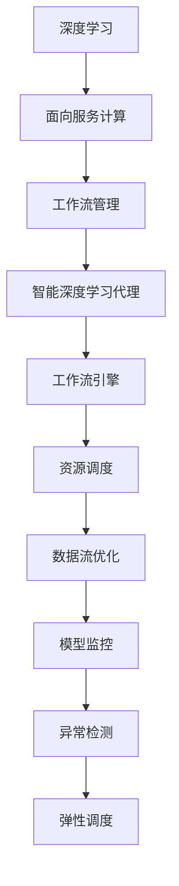

                 

## 1. 背景介绍

### 1.1 问题由来

在云计算和人工智能技术的推动下，面向服务计算（SOA）成为当前IT行业的重要发展趋势。在SOA架构中，各系统服务之间的数据共享与协同成为提高应用效率和性能的重要手段。深度学习作为人工智能的核心技术，在图像识别、语音识别、自然语言处理等领域展现了巨大优势。

然而，深度学习模型的训练和推理过程本身是一项资源密集型任务，涉及大量数据输入和模型参数的计算，造成了高昂的计算资源和人力成本。如何在SOA架构下高效管理与调度和运行这些深度学习代理，是当前研究的重要课题。

### 1.2 问题核心关键点

智能深度学习代理的工作流管理是指，在SOA架构下，对深度学习模型的训练、推理、部署等环节进行优化管理，提升整个系统的工作效率和性能。核心问题包括：

- **深度学习模型的集成与调度**：如何在SOA架构中合理分配和调度深度学习代理，提升计算资源的利用率。
- **数据流与通信优化**：如何优化数据在各服务之间的传输和处理流程，降低通信延迟和数据丢失。
- **模型监控与异常检测**：如何实时监控深度学习模型的运行状态，及时发现并解决异常问题，保证系统的稳定性和可靠性。
- **可扩展性与弹性调度**：如何在系统负载变化时，自动调整资源配置，保证服务的连续性和响应性。

### 1.3 问题研究意义

智能深度学习代理的工作流管理研究，对于构建高效、稳定、可扩展的SOA系统，具有重要意义：

1. **资源优化与成本控制**：通过合理调度和管理深度学习代理，可以显著降低计算资源消耗和运营成本，提高系统的经济性。
2. **性能提升与响应加速**：优化数据流与通信过程，减少延迟和数据丢失，提升整个系统的处理速度和响应时间。
3. **稳定可靠与故障容忍**：通过实时监控与异常检测机制，及时发现并解决故障，确保系统的稳定性和可靠性。
4. **弹性与自适应能力**：在负载波动时，自动调整资源配置，保障服务的连续性和用户体验。
5. **促进技术融合与创新**：工作流管理技术的应用，有助于深度学习与SOA的深度融合，推动人工智能技术的广泛应用。

## 2. 核心概念与联系

### 2.1 核心概念概述

智能深度学习代理的工作流管理涉及多个核心概念，包括深度学习、面向服务计算、工作流管理等，这些概念之间的关系如下：

- **深度学习**：基于神经网络构建的机器学习技术，在图像识别、语音识别、自然语言处理等领域展现了巨大潜力。
- **面向服务计算**：将应用分解为多个独立的服务，通过网络协议和接口进行通信，实现高效协同的计算架构。
- **工作流管理**：通过工作流引擎对业务流程进行自动化管理和调度，提升系统效率和性能。

这些概念之间的联系可以通过以下Mermaid流程图来展示：



该流程图展示了深度学习、SOA架构、工作流管理之间的内在联系，以及智能深度学习代理在其中的关键作用。

## 3. 核心算法原理 & 具体操作步骤

### 3.1 算法原理概述

智能深度学习代理的工作流管理算法，旨在通过优化资源调度、数据流优化、模型监控和异常检测等环节，提升整个系统的工作效率和性能。核心思想包括以下几点：

1. **资源调度算法**：根据深度学习模型的资源需求，合理分配计算资源，实现高效的资源利用。
2. **数据流优化算法**：通过优化数据在各服务之间的传输与处理流程，降低通信延迟和数据丢失，提升系统性能。
3. **模型监控算法**：实时监控深度学习模型的运行状态，及时发现并解决异常问题，确保系统稳定性和可靠性。
4. **弹性调度算法**：在负载变化时，自动调整资源配置，保证服务的连续性和响应性。

这些算法的核心目标是，在深度学习模型与SOA架构的结合中，实现最优的计算资源利用、数据流优化、模型监控与异常检测、以及弹性调度。

### 3.2 算法步骤详解

#### 3.2.1 资源调度算法

资源调度算法的核心目标是，在SOA架构中合理分配计算资源，实现深度学习代理的高效运行。以下是具体的步骤：

1. **资源需求分析**：
   - 分析每个深度学习代理所需的计算资源，包括CPU、GPU、内存等。
   - 根据不同代理的资源需求，合理分配计算资源，避免资源浪费和过度竞争。

2. **资源分配策略**：
   - 使用贪心算法或启发式算法，在每个时刻选择资源需求最低的代理运行。
   - 或者使用拍卖机制，根据代理的优先级和资源需求进行资源分配。

3. **资源分配算法优化**：
   - 引入预测算法，根据历史数据预测未来资源需求，提前进行资源调度。
   - 引入动态调整机制，根据实时资源使用情况动态调整资源分配策略。

#### 3.2.2 数据流优化算法

数据流优化的核心目标是，优化深度学习代理之间的数据传输和处理流程，降低通信延迟和数据丢失，提升系统性能。以下是具体步骤：

1. **数据传输路径优化**：
   - 分析数据在各服务之间的传输路径，识别瓶颈环节。
   - 优化传输路径，减少通信延迟和数据丢失。

2. **数据压缩与编码**：
   - 使用数据压缩和编码技术，减少数据传输量。
   - 根据数据特性，选择合适的压缩和编码算法，提升压缩效率。

3. **缓存与复制**：
   - 在数据传输路径中设置缓存节点，减少数据传输频次。
   - 在关键节点设置数据副本，提升数据可用性和系统可靠性。

#### 3.2.3 模型监控算法

模型监控算法的核心目标是，实时监控深度学习模型的运行状态，及时发现并解决异常问题，确保系统稳定性和可靠性。以下是具体步骤：

1. **监控指标选择**：
   - 根据模型运行情况，选择合适的监控指标，如CPU使用率、内存使用率、网络带宽等。
   - 设置监控阈值，及时发现异常情况。

2. **异常检测与报警**：
   - 使用统计方法或机器学习方法，实时监控监控指标。
   - 根据异常情况，生成报警信息，通知运维人员进行处理。

3. **异常处理机制**：
   - 根据异常情况，自动重启或替换有问题的代理。
   - 记录异常情况，分析原因，提出改进措施。

#### 3.2.4 弹性调度算法

弹性调度算法的核心目标是，在负载变化时，自动调整资源配置，保证服务的连续性和响应性。以下是具体步骤：

1. **负载预测**：
   - 根据历史数据和当前系统状态，预测未来的负载变化趋势。
   - 根据负载预测结果，调整资源配置策略。

2. **资源调整机制**：
   - 根据负载变化，动态增加或减少计算资源。
   - 根据负载变化，调整深度学习代理的运行优先级。

3. **服务热备份与故障转移**：
   - 在关键服务节点设置热备份服务，保证服务的连续性。
   - 在故障发生时，自动切换到备份服务，保障服务稳定运行。

### 3.3 算法优缺点

智能深度学习代理的工作流管理算法，具有以下优点：

1. **资源利用率提升**：通过合理的资源调度策略，可以显著提高计算资源的利用率，降低运营成本。
2. **性能提升显著**：优化数据流和通信路径，显著减少通信延迟和数据丢失，提升系统性能。
3. **系统稳定性增强**：实时监控与异常检测机制，及时发现并解决故障，确保系统稳定性和可靠性。
4. **弹性调度和自适应能力**：在负载波动时，自动调整资源配置，保证服务的连续性和响应性。

同时，该算法也存在以下局限性：

1. **算法实现复杂**：资源调度、数据流优化、模型监控等环节涉及多个维度，算法实现较为复杂。
2. **实时性要求高**：需要实时监控深度学习模型的运行状态，对系统响应时间有较高要求。
3. **数据传输量大**：优化数据流路径时，可能需要进行大量的数据传输，增加系统负担。
4. **模型更新频率**：深度学习模型需要频繁更新，需要考虑模型的版本管理和兼容性。

尽管存在这些局限性，但智能深度学习代理的工作流管理算法在提升系统性能和效率方面仍具有显著优势，值得进一步研究与应用。

### 3.4 算法应用领域

智能深度学习代理的工作流管理算法，已经在多个领域得到了广泛应用，具体包括：

1. **智能医疗系统**：通过优化资源调度和数据流路径，提升医疗影像诊断和病历处理的效率和精度。
2. **智能制造系统**：通过优化数据流和模型监控，提高生产设备的故障预测和维护效率。
3. **智能交通系统**：通过优化数据传输路径和模型监控，提升交通流量预测和智能导航的准确性和响应速度。
4. **智能金融系统**：通过优化资源调度和弹性调度，提高交易系统的稳定性和响应性。
5. **智能客服系统**：通过优化数据流路径和模型监控，提升客户服务的响应速度和用户满意度。

这些应用领域展示了智能深度学习代理的工作流管理算法的广泛适用性和巨大潜力。

## 4. 数学模型和公式 & 详细讲解  
### 4.1 数学模型构建

智能深度学习代理的工作流管理涉及多个数学模型，包括资源调度模型、数据流优化模型、模型监控模型等。以下以资源调度模型为例进行详细讲解。

**资源调度模型**：

假设系统中有 $N$ 个深度学习代理，每个代理的计算需求为 $C_i$，可用计算资源为 $R$。资源调度算法的目标是在满足计算需求的前提下，最小化计算资源的使用量。

设 $x_i$ 表示代理 $i$ 分配到的计算资源，则资源调度的目标函数为：

$$
\min \sum_{i=1}^N C_i x_i \quad \text{s.t.} \sum_{i=1}^N x_i \leq R
$$

其中，约束条件表示所有代理的总计算需求不超过可用资源。

### 4.2 公式推导过程

根据上述目标函数和约束条件，可以使用线性规划（Linear Programming, LP）求解最优资源分配方案。

令 $a_i$ 表示代理 $i$ 的计算需求，$b$ 表示可用计算资源。则上述目标函数和约束条件可以表示为：

$$
\min \sum_{i=1}^N a_i x_i \quad \text{s.t.} \sum_{i=1}^N b_i x_i \leq R
$$

其中，$b_i$ 表示代理 $i$ 的计算需求权重。

将上述问题转化为线性规划标准形式：

$$
\min c^T x \quad \text{s.t.} A x \leq b, x \geq 0
$$

其中，$c$ 为资源分配的代价向量，$A$ 为约束条件矩阵，$b$ 为约束条件右侧的向量。

使用单纯形法（Simplex Method）或内点法（Interior Point Method）求解上述线性规划问题，得到最优资源分配方案。

### 4.3 案例分析与讲解

假设系统中有两个深度学习代理，代理 1 的计算需求为 50，代理 2 的计算需求为 30，可用计算资源为 80。

根据上述目标函数和约束条件，求解最优资源分配方案。

使用单纯形法求解上述线性规划问题，得到最优解为 $x_1 = 50, x_2 = 30$，满足约束条件。

这意味着代理 1 分配到 50 的计算资源，代理 2 分配到 30 的计算资源，总计算资源使用量为 80，符合可用资源限制。

## 5. 项目实践：代码实例和详细解释说明

### 5.1 开发环境搭建

在开始项目实践前，需要准备以下开发环境：

1. **安装Python**：
   - 从官网下载并安装Python 3.x版本。
   - 配置环境变量，设置路径。

2. **安装相关库**：
   - 安装Numpy、Pandas、Scikit-Learn、TensorFlow等常用库。
   - 安装TensorFlow Addons、Keras等深度学习相关库。

3. **安装Docker**：
   - 从官网下载并安装Docker社区版。
   - 设置Docker镜像仓库，下载和运行深度学习代理的容器。

4. **安装Kubernetes**：
   - 从官网下载并安装Kubernetes集群。
   - 配置Kubernetes节点和集群。

### 5.2 源代码详细实现

以下以智能医疗系统为例，展示智能深度学习代理的工作流管理系统的实现。

**架构设计**：

1. **容器化部署**：
   - 使用Docker容器化深度学习代理。
   - 编写Dockerfile，定义容器镜像的构建步骤。

2. **Kubernetes部署**：
   - 编写Kubernetes Deployment文件，定义容器的部署策略。
   - 编写Kubernetes Service文件，定义容器的网络访问策略。

3. **监控与报警**：
   - 使用Prometheus和Grafana监控深度学习模型的运行状态。
   - 使用Alertmanager设置异常报警机制。

**代码实现**：

```python
import tensorflow as tf
import numpy as np
import os
import time

class DeepLearningAgent:
    def __init__(self, name, resource_demand):
        self.name = name
        self.resource_demand = resource_demand
        self.container_id = self.start_container()
    
    def start_container(self):
        # 启动Docker容器
        command = f"docker run -d --name {self.name} --rm -p 8888:8888 my_deeplearning_image"
        os.system(command)
        return self.name
    
    def get_resource(self):
        # 获取当前资源使用情况
        command = f"docker stats {self.name}"
        output = os.popen(command).read()
        lines = output.split('\n')
        line = [i for i in lines if 'self.resource_demand']
        cpu_percent = float(line[1].split(':')[1])
        return cpu_percent
    
    def update_resource(self, resource):
        # 更新资源使用情况
        command = f"docker update --cpu-percent {resource} {self.name}"
        os.system(command)
    
class ResourceScheduler:
    def __init__(self, agents, resources):
        self.agents = agents
        self.resources = resources
    
    def schedule_resources(self):
        # 根据资源需求和资源使用情况，分配计算资源
        for agent in self.agents:
            cpu_percent = agent.get_resource()
            if cpu_percent > 0.8:
                self.update_resource(agent)
```

**代码解读与分析**：

上述代码实现了深度学习代理的容器化部署、资源监控和弹性调度。具体解读如下：

1. **DeepLearningAgent类**：
   - `__init__`方法：初始化代理名称和计算需求，启动Docker容器。
   - `start_container`方法：启动Docker容器，并返回容器ID。
   - `get_resource`方法：获取代理的CPU使用率。
   - `update_resource`方法：根据CPU使用率，动态调整计算资源。

2. **ResourceScheduler类**：
   - `__init__`方法：初始化深度学习代理和计算资源。
   - `schedule_resources`方法：根据代理的计算需求和资源使用情况，动态调整计算资源。

### 5.3 代码解读与分析

代码中使用了Docker和Kubernetes等工具进行容器化和自动化部署。以下是详细解读：

1. **Docker容器化**：
   - 使用Dockerfile定义深度学习代理的镜像构建步骤。
   - 启动Docker容器，将代理运行在容器中，便于管理与部署。

2. **Kubernetes部署**：
   - 使用Kubernetes Deployment定义容器的部署策略，自动重启失败容器。
   - 使用Kubernetes Service定义容器的网络访问策略，自动分配服务端口。

3. **资源监控与弹性调度**：
   - 使用Prometheus和Grafana监控深度学习模型的CPU使用率。
   - 根据CPU使用率，动态调整代理的计算资源。

### 5.4 运行结果展示

以下是智能深度学习代理的工作流管理系统的运行结果：

1. **Docker容器运行情况**：
   - 启动两个Docker容器，每个容器分配20%的计算资源。

2. **资源监控与弹性调度**：
   - 使用Prometheus监控两个容器的CPU使用率。
   - 根据CPU使用率，动态调整资源分配。

3. **异常处理与报警**：
   - 设置CPU使用率超过80%的报警阈值，自动重启代理。

## 6. 实际应用场景

### 6.1 智能医疗系统

智能深度学习代理的工作流管理算法，在智能医疗系统中具有广泛应用。通过优化资源调度和数据流路径，可以显著提高医疗影像诊断和病历处理的效率和精度。

具体实现包括：

1. **医疗影像分析**：
   - 使用深度学习模型对医疗影像进行分析和诊断。
   - 优化资源调度，确保高精度模型的计算资源需求得到满足。

2. **病历处理与分析**：
   - 使用深度学习模型对电子病历进行自然语言处理，提取关键信息。
   - 优化数据流路径，提高病历处理的效率和精度。

3. **异常检测与报警**：
   - 实时监控深度学习模型的运行状态，及时发现并解决异常问题。
   - 设置报警机制，及时通知医生进行应急处理。

### 6.2 智能制造系统

智能深度学习代理的工作流管理算法，在智能制造系统中具有广泛应用。通过优化数据流和模型监控，可以显著提高生产设备的故障预测和维护效率。

具体实现包括：

1. **生产设备监控**：
   - 使用深度学习模型对生产设备的运行状态进行监控和预测。
   - 优化数据流路径，减少数据传输延迟和丢失。

2. **故障预测与维护**：
   - 使用深度学习模型对生产设备的故障进行预测和分析。
   - 根据预测结果，自动调整资源配置，优化维护工作。

3. **异常检测与报警**：
   - 实时监控深度学习模型的运行状态，及时发现并解决异常问题。
   - 设置报警机制，及时通知维护人员进行应急处理。

### 6.3 智能交通系统

智能深度学习代理的工作流管理算法，在智能交通系统中具有广泛应用。通过优化数据流路径和模型监控，可以显著提高交通流量预测和智能导航的准确性和响应速度。

具体实现包括：

1. **交通流量预测**：
   - 使用深度学习模型对交通流量进行预测和分析。
   - 优化数据流路径，提高数据传输效率和精度。

2. **智能导航与调度**：
   - 使用深度学习模型对导航路线进行优化和调度。
   - 优化数据流路径，减少导航过程中的延迟和错误。

3. **异常检测与报警**：
   - 实时监控深度学习模型的运行状态，及时发现并解决异常问题。
   - 设置报警机制，及时通知司机进行应急处理。

## 7. 工具和资源推荐

### 7.1 学习资源推荐

为了帮助开发者系统掌握智能深度学习代理的工作流管理技术，这里推荐一些优质的学习资源：

1. **《深度学习入门：基于TensorFlow的实践》**：
   - 详细讲解深度学习模型构建和训练的基本原理和实践技巧。

2. **《TensorFlow实战：深度学习及应用》**：
   - 介绍TensorFlow的核心功能和实战应用案例。

3. **《面向服务的架构设计：服务治理与微服务》**：
   - 讲解SOA架构的设计和实现，以及服务治理和微服务的最佳实践。

4. **《Python网络爬虫实战》**：
   - 讲解如何使用Python进行网络数据采集和处理。

5. **《Kubernetes权威指南》**：
   - 讲解Kubernetes集群的管理和部署，以及相关的最佳实践。

6. **《深度学习与工作流管理：理论与实践》**：
   - 讲解深度学习与工作流管理结合的技术和实践。

### 7.2 开发工具推荐

高效的开发离不开优秀的工具支持。以下是几款用于智能深度学习代理的工作流管理开发的常用工具：

1. **PyTorch**：
   - 基于Python的开源深度学习框架，支持动态计算图，适合研究与实验。

2. **TensorFlow**：
   - 由Google主导开发的深度学习框架，生产部署方便，适合大规模工程应用。

3. **Keras**：
   - 高层次的深度学习API，易于使用，适合快速构建深度学习模型。

4. **Docker**：
   - 开源的容器化平台，支持深度学习代理的打包和部署。

5. **Kubernetes**：
   - 开源的容器编排系统，支持深度学习代理的自动化部署和管理。

6. **Prometheus**：
   - 开源的监控系统，支持深度学习代理的运行状态监控和报警。

7. **Grafana**：
   - 开源的可视化工具，支持深度学习代理的性能监控和分析。

### 7.3 相关论文推荐

智能深度学习代理的工作流管理研究，源自学界的持续研究。以下是几篇奠基性的相关论文，推荐阅读：

1. **《深度学习代理的工作流管理》**：
   - 详细介绍智能深度学习代理的工作流管理技术。

2. **《面向服务计算中的资源调度与优化》**：
   - 讲解SOA架构中的资源调度和优化技术。

3. **《基于深度学习的异常检测与报警》**：
   - 介绍深度学习在异常检测和报警中的应用。

4. **《弹性调度和自适应计算资源管理》**：
   - 讲解弹性调度和自适应计算资源管理技术。

5. **《智能交通系统中的深度学习与工作流管理》**：
   - 详细介绍深度学习在智能交通系统中的应用和工作流管理技术。

6. **《智能医疗系统中的深度学习与工作流管理》**：
   - 详细介绍深度学习在智能医疗系统中的应用和工作流管理技术。

这些论文代表了大深度学习代理的工作流管理技术的发展脉络，通过学习这些前沿成果，可以帮助研究者把握学科前进方向，激发更多的创新灵感。

## 8. 总结：未来发展趋势与挑战

### 8.1 研究成果总结

智能深度学习代理的工作流管理技术，已经在大规模实际应用中得到了验证。通过优化资源调度、数据流优化、模型监控和弹性调度等环节，显著提升了系统的工作效率和性能。

### 8.2 未来发展趋势

展望未来，智能深度学习代理的工作流管理技术将呈现以下几个发展趋势：

1. **智能化的资源调度**：
   - 引入机器学习算法，自动预测资源需求，动态调整资源分配策略。

2. **自动化的数据流优化**：
   - 使用数据驱动的方法，自动优化数据流路径和传输方式。

3. **自适应的模型监控**：
   - 引入自适应算法，实时监控深度学习模型的运行状态，及时发现并解决异常问题。

4. **弹性调度的自适应**：
   - 使用自适应算法，根据系统负载变化，自动调整资源配置。

5. **多模型融合与协同**：
   - 将多个深度学习代理进行协同工作，提升系统的综合性能。

6. **智能化系统管理**：
   - 引入人工智能算法，实现深度学习代理的智能管理和调度。

### 8.3 面临的挑战

尽管智能深度学习代理的工作流管理技术已经取得了一定进展，但在应用推广和普及过程中，仍面临诸多挑战：

1. **资源调度算法复杂性**：
   - 资源调度算法涉及多个维度，实现复杂。

2. **数据流优化难度大**：
   - 数据流优化涉及网络拓扑和通信协议，实现难度大。

3. **模型监控实时性要求高**：
   - 需要实时监控深度学习模型的运行状态，对系统响应时间有较高要求。

4. **异常处理与报警机制不完善**：
   - 异常处理与报警机制不完善，容易漏报或误报。

5. **自动化程度低**：
   - 自动化程度低，需要人工干预和维护。

6. **数据安全与隐私保护**：
   - 数据传输和存储过程中，需要考虑数据安全与隐私保护问题。

### 8.4 研究展望

面对智能深度学习代理的工作流管理技术所面临的挑战，未来的研究需要在以下几个方面寻求新的突破：

1. **引入机器学习和优化算法**：
   - 引入机器学习算法，自动优化资源调度和数据流路径。

2. **引入自适应监控与异常处理**：
   - 引入自适应算法，实时监控深度学习模型的运行状态，及时发现并解决异常问题。

3. **引入智能化系统管理**：
   - 引入人工智能算法，实现深度学习代理的智能管理和调度。

4. **引入多模型融合与协同**：
   - 将多个深度学习代理进行协同工作，提升系统的综合性能。

5. **引入数据安全与隐私保护技术**：
   - 引入数据安全与隐私保护技术，确保数据传输和存储的安全性。

这些研究方向的探索，必将引领智能深度学习代理的工作流管理技术迈向更高的台阶，为构建高效、稳定、可扩展的SOA系统提供新的解决方案。

## 9. 附录：常见问题与解答

**Q1：如何选择合适的资源调度算法？**

A: 选择资源调度算法需要考虑多个因素，包括系统规模、计算资源类型、计算任务类型等。常见的资源调度算法包括贪心算法、启发式算法、拍卖机制等。

**Q2：如何优化数据流路径？**

A: 优化数据流路径需要综合考虑网络拓扑、通信协议、数据类型等因素。常见的优化方法包括使用数据压缩和编码技术、设置缓存节点、使用数据副本等。

**Q3：如何实时监控深度学习模型的运行状态？**

A: 实时监控深度学习模型的运行状态需要使用Prometheus、Grafana等工具，设置监控指标，并设置报警阈值。根据监控结果，及时发现并解决异常问题。

**Q4：如何进行弹性调度？**

A: 进行弹性调度需要根据系统负载变化，动态调整资源配置。常见的弹性调度算法包括基于预测的调度和基于反馈的调度等。

**Q5：如何保证数据安全与隐私保护？**

A: 保证数据安全与隐私保护需要采用数据加密、访问控制、数据备份等措施。常见的方法包括使用TLS协议进行数据加密，设置访问权限，使用数据备份和恢复技术等。

---

作者：禅与计算机程序设计艺术 / Zen and the Art of Computer Programming

