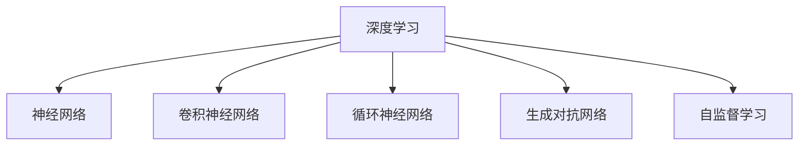

                 

# AI人工智能深度学习算法：未来应用的可能性

> 关键词：深度学习,神经网络,人工智能,未来应用,算法原理,技术前景,实际案例,开发工具

## 1. 背景介绍

### 1.1 问题由来
人工智能(AI)与深度学习(Deep Learning)技术的迅猛发展，正深刻改变着人类社会的各个领域。从医疗诊断、金融风控、智能制造，到自动驾驶、智慧城市、文化娱乐，深度学习正在为各行各业带来革命性的变革。然而，深度学习的未来发展路径仍存在诸多未知与挑战，亟待学术界与工业界的共同探索。

### 1.2 问题核心关键点
本文聚焦于深度学习在未来领域的可能应用，探讨其如何推动科学、产业与社会的进步。深度学习的核心优势在于其强大的模式识别与自动学习能力，未来应用将集中在以下几个方面：

1. **科研领域的突破**：借助深度学习，科学家能够快速处理海量数据，发现复杂生物分子结构，揭示宇宙物理规律，推动人工智能在科学前沿的应用。

2. **智能化的产业升级**：深度学习在医疗、金融、制造等关键行业中的应用，有望极大提升自动化水平与效率，优化资源配置，创造新的产业价值。

3. **社会服务的智能化**：深度学习在教育、公共安全、社会治理等方面的应用，能够提供精准、个性化的服务，提升公共服务的质量和效率。

4. **跨领域的应用创新**：深度学习在艺术、游戏、文化娱乐等领域的深度融合，将带来全新的创作模式与用户体验。

## 2. 核心概念与联系

### 2.1 核心概念概述

为更好地理解深度学习在各个领域的应用潜力，本节将介绍几个关键核心概念：

- **深度学习(Deep Learning)**：以神经网络为核心的机器学习技术，通过多层非线性变换，能够自动学习特征表示，用于分类、回归、生成等多种任务。

- **神经网络(Neural Network)**：由多个神经元组成的计算模型，通过权重参数的调整，进行数据映射与模式识别。

- **卷积神经网络(Convolutional Neural Network, CNN)**：针对图像和视频数据，通过卷积层和池化层提取局部特征，广泛应用于计算机视觉领域。

- **循环神经网络(Recurrent Neural Network, RNN)**：针对序列数据，通过循环结构捕捉时间依赖性，广泛应用于自然语言处理和语音识别领域。

- **生成对抗网络(Generative Adversarial Network, GAN)**：通过生成器和判别器的对抗训练，生成高质量的伪造数据或模型预测，在图像生成、数据增强等方面有广泛应用。

- **自监督学习(Self-Supervised Learning)**：利用数据的内在关联性，无监督地训练模型，获得数据分布的丰富知识，广泛应用于大规模预训练任务中。

这些核心概念之间的逻辑关系可以通过以下Mermaid流程图来展示：



这个流程图展示了深度学习的核心组件及其应用场景：

1. 深度学习基于神经网络结构，通过多层非线性变换，实现复杂数据映射。
2. CNN和RNN针对特定数据类型，通过卷积层和循环结构提取特征，解决视觉和序列数据的问题。
3. GAN用于生成高质量数据，辅助深度学习训练，用于数据增强、伪造图像生成等。
4. 自监督学习利用数据内部关联性，无监督地训练模型，提升模型泛化能力。

## 3. 核心算法原理 & 具体操作步骤
### 3.1 算法原理概述

深度学习的核心在于其通过多层次神经网络结构，自动学习数据的高级特征表示，从而实现模式识别与预测。其基本原理是通过反向传播算法优化神经网络的权重参数，使得模型在给定的训练数据集上达到最优的损失函数。

形式化地，假设神经网络模型为 $M_{\theta}$，其中 $\theta$ 为权重参数，训练数据集为 $D=\{(x_i,y_i)\}_{i=1}^N$，其中 $x_i$ 为输入，$y_i$ 为输出标签。模型的损失函数为 $\ell(M_{\theta}(x_i),y_i)$，则优化目标为：

$$
\hat{\theta} = \mathop{\arg\min}_{\theta} \frac{1}{N} \sum_{i=1}^N \ell(M_{\theta}(x_i),y_i)
$$

通过梯度下降等优化算法，不断更新模型参数 $\theta$，直至达到损失函数的极小值。

### 3.2 算法步骤详解

深度学习的训练通常包括以下几个步骤：

**Step 1: 准备数据集与模型架构**
- 收集并预处理训练数据集 $D$，划分为训练集、验证集和测试集。
- 设计并构建神经网络模型 $M_{\theta}$，选择合适的层数、激活函数等超参数。

**Step 2: 初始化模型参数**
- 使用随机初始化方法（如Xavier初始化）为模型参数 $\theta$ 赋初值。

**Step 3: 正向传播与损失计算**
- 前向传播输入 $x_i$ 通过模型，得到预测输出 $\hat{y}_i$。
- 计算预测输出与真实标签之间的损失 $\ell(\hat{y}_i,y_i)$。

**Step 4: 反向传播与参数更新**
- 计算损失函数对模型参数的梯度 $\nabla_{\theta} \ell$。
- 使用梯度下降等优化算法更新模型参数 $\theta$。

**Step 5: 验证与测试**
- 在验证集上评估模型性能，使用超参数调整优化模型。
- 在测试集上最终测试模型性能，评估模型泛化能力。

### 3.3 算法优缺点

深度学习算法具有以下优点：
1. 强大的表示学习能力。多层神经网络能够自动学习数据的高级特征表示，适用于各种复杂的模式识别任务。
2. 灵活的架构设计。神经网络可以根据具体任务调整层数、激活函数等超参数，适应性更强。
3. 丰富的应用领域。深度学习已广泛应用于图像识别、自然语言处理、语音识别、推荐系统等众多领域。
4. 性能提升显著。深度学习在多个任务上取得了最先进的效果，推动了各行业的智能化升级。

同时，深度学习也存在一些局限性：
1. 训练数据需求高。深度学习模型通常需要大量的标注数据进行训练，数据获取成本较高。
2. 计算资源消耗大。深度学习模型的训练与推理计算量巨大，对硬件资源要求较高。
3. 可解释性不足。深度模型往往被称为"黑箱"，难以解释其内部工作机制。
4. 过拟合风险大。深度模型容易在训练集上过拟合，泛化性能不理想。

尽管存在这些局限，但深度学习仍然是当前人工智能领域的核心技术，其强大的表示能力和广泛的适用性使其成为推动各领域智能化升级的关键力量。

### 3.4 算法应用领域

深度学习技术已经在诸多领域展现出广泛的应用前景：

- **计算机视觉**：用于图像分类、目标检测、图像生成等任务，广泛应用于自动驾驶、医学影像分析等领域。

- **自然语言处理**：用于机器翻译、文本生成、语音识别等任务，推动了智能客服、智能写作、自动摘要等应用的普及。

- **语音识别**：用于语音转文字、语音命令等任务，提升语音交互的智能化水平，广泛应用于智能家居、智能助理等场景。

- **推荐系统**：用于个性化推荐、广告投放等任务，提升用户的浏览体验，优化商业决策。

- **金融分析**：用于风险评估、投资决策等任务，提高金融机构的智能化水平，防范金融风险。

- **医疗健康**：用于疾病预测、医学图像分析等任务，提升医疗诊断的准确性和效率。

## 4. 数学模型和公式 & 详细讲解  
### 4.1 数学模型构建

本节将使用数学语言对深度学习训练过程进行详细描述。

假设神经网络模型 $M_{\theta}$ 具有 $L$ 层，其中 $L$ 表示网络深度。记第 $l$ 层的输入为 $a_l$，权重矩阵为 $W_l$，偏置向量为 $b_l$，激活函数为 $f$。前向传播过程如下：

$$
a_0 = x, \quad a_l = f(W_l a_{l-1} + b_l), \quad \text{for } l=1,\dots,L
$$

模型输出为 $a_L$，其中 $a_L$ 为输出层的激活值。假设输出层为线性层，则预测输出 $\hat{y}$ 可表示为：

$$
\hat{y} = W_y a_{L-1} + b_y
$$

其中 $W_y$ 为输出层权重矩阵，$b_y$ 为输出层偏置向量。

### 4.2 公式推导过程

对于二分类任务，模型的损失函数通常使用二元交叉熵损失函数，定义为：

$$
\ell(M_{\theta}(x),y) = -y \log \hat{y} + (1-y) \log (1-\hat{y})
$$

在训练过程中，采用梯度下降算法更新模型参数 $\theta$，更新公式为：

$$
\theta_l \leftarrow \theta_l - \eta \nabla_{\theta_l} \ell
$$

其中 $\eta$ 为学习率，$\nabla_{\theta_l} \ell$ 为损失函数对第 $l$ 层参数的梯度。

通过前向传播和反向传播，可以计算第 $l$ 层参数的梯度为：

$$
\nabla_{\theta_l} \ell = \frac{\partial \ell}{\partial a_{l+1}} \cdot \frac{\partial a_{l+1}}{\partial a_l} \cdot \frac{\partial a_l}{\partial \theta_l}
$$

结合链式法则，可以得到完整的梯度更新公式。在实际应用中，常采用Adam、SGD等优化算法进行参数更新。

### 4.3 案例分析与讲解

以图像分类任务为例，分析深度学习模型的训练过程。

假设模型由5层卷积层和2层全连接层构成。输入为 $28\times28$ 的灰度图像，输出为10个类别的概率分布。

1. **数据准备**：准备标准化的训练集和测试集，并进行预处理，如归一化、数据增强等。
2. **模型设计**：设计卷积神经网络模型，包括卷积层、池化层、全连接层等。
3. **初始化参数**：使用Xavier初始化方法对权重和偏置进行初始化。
4. **训练过程**：
   - 正向传播：输入图像通过卷积层、池化层、全连接层等，得到最终输出。
   - 损失计算：计算预测输出与真实标签之间的交叉熵损失。
   - 反向传播：通过链式法则计算各层参数的梯度，使用Adam优化算法更新参数。
5. **验证与测试**：在验证集上评估模型性能，调整超参数，最终在测试集上测试模型性能。

## 5. 项目实践：代码实例和详细解释说明
### 5.1 开发环境搭建

在进行深度学习项目实践前，需要先准备好开发环境。以下是使用Python进行TensorFlow开发的环境配置流程：

1. 安装Anaconda：从官网下载并安装Anaconda，用于创建独立的Python环境。

2. 创建并激活虚拟环境：
```bash
conda create -n tf-env python=3.8 
conda activate tf-env
```

3. 安装TensorFlow：根据CUDA版本，从官网获取对应的安装命令。例如：
```bash
conda install tensorflow tensorflow-gpu=cuda11.1 -c pytorch -c conda-forge
```

4. 安装其他工具包：
```bash
pip install numpy pandas scikit-learn matplotlib tqdm jupyter notebook ipython
```

完成上述步骤后，即可在`tf-env`环境中开始深度学习项目的开发。

### 5.2 源代码详细实现

下面我们以图像分类任务为例，给出使用TensorFlow实现卷积神经网络的代码实现。

```python
import tensorflow as tf
from tensorflow.keras import datasets, layers, models

# 加载数据集
(train_images, train_labels), (test_images, test_labels) = datasets.cifar10.load_data()

# 数据预处理
train_images, test_images = train_images / 255.0, test_images / 255.0

# 构建卷积神经网络模型
model = models.Sequential()
model.add(layers.Conv2D(32, (3, 3), activation='relu', input_shape=(32, 32, 3)))
model.add(layers.MaxPooling2D((2, 2)))
model.add(layers.Conv2D(64, (3, 3), activation='relu'))
model.add(layers.MaxPooling2D((2, 2)))
model.add(layers.Conv2D(64, (3, 3), activation='relu'))

# 添加全连接层和输出层
model.add(layers.Flatten())
model.add(layers.Dense(64, activation='relu'))
model.add(layers.Dense(10))

# 编译模型
model.compile(optimizer='adam',
              loss=tf.keras.losses.SparseCategoricalCrossentropy(from_logits=True),
              metrics=['accuracy'])

# 训练模型
history = model.fit(train_images, train_labels, epochs=10, 
                    validation_data=(test_images, test_labels))

# 评估模型
test_loss, test_acc = model.evaluate(test_images, test_labels)
print(f'Test accuracy: {test_acc}')
```

以上代码实现了基于TensorFlow的卷积神经网络模型训练和评估流程。通过简单的数据加载、模型构建、编译和训练，即可在测试集上得到较高的准确率。

### 5.3 代码解读与分析

让我们再详细解读一下关键代码的实现细节：

**数据准备**：
- 使用`datasets.cifar10.load_data()`方法加载CIFAR-10数据集，包含60000个32x32像素的彩色图像及其对应的标签。
- 将像素值归一化到[0,1]范围内，以提高模型的收敛速度和泛化性能。

**模型构建**：
- 使用`Sequential`模型定义网络结构。
- 通过`layers.Conv2D`和`layers.MaxPooling2D`构建卷积层和池化层，提取图像特征。
- 添加全连接层和输出层，用于分类任务。

**模型编译**：
- 使用`Adam`优化器，选择`SparseCategoricalCrossentropy`作为损失函数，`accuracy`作为评估指标。
- 在`compile`方法中设置`from_logits=True`，表示输出为未激活的logits。

**模型训练**：
- 使用`fit`方法对模型进行训练，设置训练轮数为10。
- `validation_data`参数指定验证集，用于监控模型训练过程中的性能变化。

**模型评估**：
- 使用`evaluate`方法对模型进行测试，返回测试集上的损失和准确率。
- 输出测试集上的准确率，显示模型性能。

可以看到，通过TensorFlow提供的高级API，深度学习的项目开发变得非常简单高效。开发者可以将更多精力放在模型设计、优化策略等高层逻辑上，而不必过多关注底层的实现细节。

当然，工业级的系统实现还需考虑更多因素，如模型的保存和部署、超参数的自动搜索、更灵活的模型架构等。但核心的深度学习训练流程基本与此类似。

## 6. 实际应用场景
### 6.1 医疗健康

深度学习在医疗健康领域的应用潜力巨大。通过分析海量医疗数据，深度学习模型可以用于疾病预测、医学图像分析、基因组学研究等任务，提升医疗服务的智能化水平，辅助医生诊疗，加速新药开发进程。

以医学影像分析为例，深度学习模型可以对X光片、CT扫描等图像进行自动分析，辅助诊断肺癌、乳腺癌等疾病。通过预训练-微调的方式，模型可以快速适应新医院的数据分布，提升诊断准确率。此外，深度学习还可以用于患者风险评估、药物副作用预测等任务，为医疗健康领域带来深远影响。

### 6.2 金融分析

深度学习在金融领域的应用主要集中在风险评估、投资决策、欺诈检测等方面。通过分析历史交易数据和市场行情，深度学习模型可以预测股票价格趋势、识别金融欺诈行为，辅助投资者制定更科学的投资策略。

例如，通过分析证券交易数据，深度学习模型可以预测股票价格的涨跌，为投资者提供实时决策支持。同时，模型还可以识别异常交易行为，实时监控市场风险，提高金融机构的风险管理水平。

### 6.3 自动驾驶

自动驾驶是深度学习在汽车领域的重要应用之一。通过分析摄像头、激光雷达等传感器数据，深度学习模型可以实现车辆定位、障碍物检测、道路标识识别等任务，提升自动驾驶的安全性和可靠性。

例如，通过分析车载摄像头拍摄的图像，深度学习模型可以识别道路交通标志、行人等障碍物，帮助车辆进行避障和导航。通过多传感器融合，模型还可以实现更准确的车辆定位和环境感知，提升自动驾驶系统的智能水平。

### 6.4 智慧教育

深度学习在教育领域的应用主要集中在个性化推荐、学习分析、智能评估等方面。通过分析学生的学习数据和行为数据，深度学习模型可以提供个性化的学习建议、实时评估学生的学习进度，提升教育质量。

例如，通过分析学生的在线学习行为，深度学习模型可以推荐适合的学习内容、评估学生的学习效果，为教师提供科学的教学支持。同时，模型还可以进行智能答疑、语音识别等任务，提升学生的学习体验。

## 7. 工具和资源推荐
### 7.1 学习资源推荐

为了帮助开发者系统掌握深度学习的基本理论和应用实践，这里推荐一些优质的学习资源：

1. **《深度学习》（Ian Goodfellow, Yoshua Bengio & Aaron Courville）**：深度学习领域的经典教材，全面介绍了深度学习的理论基础和实际应用。

2. **Coursera《深度学习专项课程》（Andrew Ng）**：斯坦福大学开设的深度学习入门课程，涵盖深度学习的基本概念和经典算法。

3. **Udacity《深度学习纳米学位》**：Udacity深度学习课程，提供系统化的深度学习实践项目，帮助学生构建实战经验。

4. **arXiv预印本平台**：深度学习领域的最新研究论文，提供丰富的学术资源和前沿动态。

5. **Kaggle数据科学竞赛平台**：全球最大的数据科学竞赛平台，提供丰富的数据集和实际问题，帮助开发者锻炼实战能力。

通过这些资源的学习实践，相信你一定能够快速掌握深度学习的基本原理和应用方法，并用于解决实际的AI问题。

### 7.2 开发工具推荐

高效的开发离不开优秀的工具支持。以下是几款用于深度学习开发的常用工具：

1. **TensorFlow**：由Google主导开发的深度学习框架，支持分布式训练、模型部署，适用于大规模工程应用。

2. **PyTorch**：由Facebook开发的深度学习框架，灵活性高，易于使用，适用于研究实验。

3. **Keras**：高级深度学习API，易于上手，支持多种深度学习框架。

4. **Jupyter Notebook**：交互式开发环境，支持Python代码的编写和执行，适用于数据探索和模型开发。

5. **TensorBoard**：可视化工具，用于监控模型训练状态，提供丰富的图表呈现方式。

6. **Weights & Biases**：实验跟踪工具，记录和可视化模型训练过程中的各项指标，方便对比和调优。

合理利用这些工具，可以显著提升深度学习项目的开发效率，加快创新迭代的步伐。

### 7.3 相关论文推荐

深度学习技术的发展源于学界的持续研究。以下是几篇奠基性的相关论文，推荐阅读：

1. **AlexNet: ImageNet Classification with Deep Convolutional Neural Networks**：提出卷积神经网络结构，用于图像分类任务。

2. **RNN: Recurrent Neural Network**：提出循环神经网络结构，用于序列数据的建模。

3. **ResNet: Deep Residual Learning for Image Recognition**：提出残差网络结构，解决深度网络训练中的梯度消失问题。

4. **GAN: Generative Adversarial Networks**：提出生成对抗网络，用于生成高质量伪造数据。

5. **AlphaGo: Mastering the Game of Go with Deep Neural Networks and Tree Search**：使用深度学习技术实现围棋AI，推动AI在复杂博弈中的应用。

6. **BERT: Pre-training of Deep Bidirectional Transformers for Language Understanding**：提出BERT模型，用于自然语言处理任务。

这些论文代表了大规模深度学习模型的发展脉络。通过学习这些前沿成果，可以帮助研究者把握深度学习的进展方向，激发更多的创新灵感。

## 8. 总结：未来发展趋势与挑战

### 8.1 总结

本文对深度学习在各个领域的可能应用进行了全面系统的介绍。首先阐述了深度学习的核心优势和应用前景，明确了深度学习在科研、产业、社会等多方面的重要价值。其次，从原理到实践，详细讲解了深度学习的数学模型和训练过程，给出了深度学习项目的代码实现。同时，本文还广泛探讨了深度学习在医疗健康、金融分析、自动驾驶、智慧教育等多个领域的应用场景，展示了深度学习技术的广阔应用空间。

通过本文的系统梳理，可以看到，深度学习技术正在深刻改变着人类社会的各个方面，推动科学、产业与社会的进步。未来，伴随深度学习算法的不断演进和应用场景的不断拓展，其对人工智能技术的贡献将更加显著。

### 8.2 未来发展趋势

展望未来，深度学习技术将呈现以下几个发展趋势：

1. **多模态融合**：深度学习模型将突破单一模态的限制，融合视觉、语音、文本等多模态信息，提升模型在复杂场景下的理解和推理能力。

2. **自监督学习**：深度学习模型将更多利用无监督学习方法，通过数据的内在关联性，自动学习丰富的数据分布知识。

3. **弱监督学习**：深度学习模型将更多采用弱监督学习方法，在仅有限标注数据的情况下，实现高效训练和泛化。

4. **迁移学习**：深度学习模型将更多采用迁移学习方法，通过知识迁移，提升在新任务上的学习速度和性能。

5. **因果推断**：深度学习模型将更多引入因果推断方法，提升模型的决策可解释性和鲁棒性。

6. **联邦学习**：深度学习模型将更多采用联邦学习方法，在保护数据隐私的前提下，实现跨设备或跨机构的模型训练。

这些趋势凸显了深度学习技术的广阔前景。这些方向的探索发展，必将进一步提升深度学习模型的表现，为人工智能技术的落地应用提供更强大的技术支持。

### 8.3 面临的挑战

尽管深度学习技术已经取得了显著成就，但在迈向更加智能化、普适化应用的过程中，仍面临诸多挑战：

1. **数据依赖**：深度学习模型需要大量标注数据进行训练，数据获取和标注成本较高。如何降低数据依赖，提高模型的自监督学习能力，将是未来的重要研究方向。

2. **计算资源**：深度学习模型的训练和推理计算量巨大，对硬件资源要求较高。如何优化模型架构，提升计算效率，是深度学习领域的重要课题。

3. **模型复杂性**：深度学习模型通常具有复杂的网络结构，难以解释其内部工作机制。如何提高模型的可解释性，赋予其更强的可解释性，将是未来的重要研究方向。

4. **鲁棒性和泛化能力**：深度学习模型在面对复杂和多样化的数据时，容易产生过拟合和泛化性能不足的问题。如何提高模型的鲁棒性和泛化能力，提升其对新数据和新场景的适应性，将是未来的重要研究方向。

5. **安全性与伦理**：深度学习模型可能会产生偏见、有害的输出，造成安全风险和伦理问题。如何在模型训练和应用中考虑安全性与伦理问题，确保模型的公平性和透明度，将是未来的重要研究方向。

6. **人机协同**：深度学习模型在实现自动化任务的同时，需要与人类协作，提升人机交互的自然性和智能化。如何设计人机协同的智能系统，提升用户体验，将是未来的重要研究方向。

正视这些挑战，积极应对并寻求突破，将是大规模深度学习技术迈向成熟的重要途径。相信随着学界和产业界的共同努力，这些挑战终将一一被克服，深度学习技术必将在构建智能化的未来社会中扮演越来越重要的角色。

### 8.4 研究展望

面对深度学习技术所面临的挑战，未来的研究需要在以下几个方面寻求新的突破：

1. **弱监督学习**：通过弱监督学习，利用少量标注数据进行高效训练，提高模型的泛化能力。

2. **多模态融合**：开发多模态深度学习模型，融合视觉、语音、文本等多模态信息，提升模型在复杂场景下的理解和推理能力。

3. **因果推断**：将因果推断方法引入深度学习模型，提升模型的决策可解释性和鲁棒性。

4. **联邦学习**：开发联邦学习算法，在保护数据隐私的前提下，实现跨设备或跨机构的模型训练。

5. **自监督学习**：更多利用自监督学习方法，通过数据的内在关联性，自动学习丰富的数据分布知识。

6. **模型压缩**：通过模型压缩、量化等技术，优化模型架构，提升计算效率。

这些研究方向的探索，必将引领深度学习技术迈向更高的台阶，为构建安全、可靠、可解释、可控的智能系统铺平道路。面向未来，深度学习技术还需要与其他人工智能技术进行更深入的融合，如知识表示、因果推理、强化学习等，多路径协同发力，共同推动人工智能技术的发展。只有勇于创新、敢于突破，才能不断拓展深度学习技术的边界，让智能技术更好地造福人类社会。

## 9. 附录：常见问题与解答

**Q1：深度学习模型为何需要大量标注数据？**

A: 深度学习模型的训练过程本质上是优化损失函数的过程。标注数据提供了模型需要预测的输出标签，是优化过程的重要参考。标注数据越多，模型可以学习到的模式和特征越丰富，泛化性能越好。然而，大规模标注数据获取成本高，存在标注偏差等问题。未来的研究方向是探索弱监督学习和自监督学习方法，在较少标注数据的情况下，提高模型的泛化能力。

**Q2：深度学习模型为何存在过拟合风险？**

A: 深度学习模型通常具有复杂的非线性结构，容易在训练集上过拟合。过拟合会导致模型在新数据上的泛化性能下降。常用的解决方法包括数据增强、正则化、早停法等。此外，模型结构设计、学习率调整等也是影响过拟合的重要因素。

**Q3：深度学习模型的训练过程为何耗时耗力？**

A: 深度学习模型的训练计算量巨大，需要大量GPU/TPU等高性能设备。同时，模型参数量巨大，梯度更新过程中需要进行大量的浮点数运算，计算效率较低。优化模型结构、采用混合精度训练、模型并行等技术可以提升训练效率，但仍需大量计算资源支持。

**Q4：深度学习模型为何难以解释？**

A: 深度学习模型通常具有复杂的网络结构，难以通过简单的特征解释其内部工作机制。模型的决策过程往往被视为"黑盒"，难以理解其推理逻辑。提高模型的可解释性，赋予其更强的可解释性，将是未来的重要研究方向。

**Q5：深度学习模型为何需要引入对抗训练？**

A: 对抗样本可以突破深度学习模型的防御机制，使其输出错误的结果。对抗训练通过引入对抗样本，提高模型的鲁棒性和泛化能力，提升模型在复杂场景下的稳定性。

总之，深度学习技术在各个领域的应用潜力巨大，但也需要面对诸多挑战。通过不断优化模型架构、改进训练策略、提高模型的可解释性和安全性，深度学习必将在构建智能化的未来社会中发挥更大的作用。

---

作者：禅与计算机程序设计艺术 / Zen and the Art of Computer Programming

