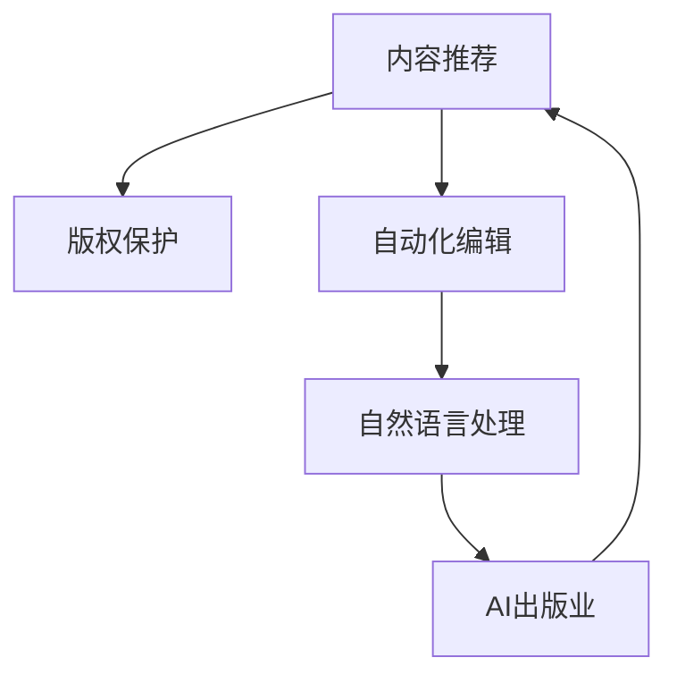

                 

# AI出版业前景：丰富的场景，强大的技术应用

> 关键词：AI出版、内容推荐、版权保护、自动化编辑、自然语言处理

## 1. 背景介绍

### 1.1 问题由来
随着信息技术的发展，出版业面临着前所未有的变革。传统出版模式以纸质书籍为核心，效率低下、成本高昂，且容易受时间和空间限制。数字化时代下，电子出版、在线阅读、知识付费等新型出版形式不断涌现，出版模式开始由传统的“内容生产-发行-销售”转向“内容生产-智能推荐-订阅”。

### 1.2 问题核心关键点
AI出版业的核心在于利用先进的AI技术，提高出版内容的质量和生产效率，实现个性化推荐，优化版权保护，提升用户阅读体验。出版业的AI应用涵盖内容推荐、版权保护、自动化编辑、自然语言处理等多个方面，有效助力出版业数字化转型。

### 1.3 问题研究意义
AI在出版业的应用，不仅提高了内容生产的效率和质量，还为出版商提供了更精准的营销和用户分析手段。通过AI技术，出版业可以更灵活、更高效地应对市场的变化，提升用户体验和粘性，最终实现业务增长。

## 2. 核心概念与联系

### 2.1 核心概念概述

为更好地理解AI出版业的潜力和应用场景，本节将介绍几个密切相关的核心概念：

- AI出版业：利用人工智能技术，在内容创作、生产、营销、管理等各个环节进行优化的出版行业。AI技术的应用，不仅提高了出版效率，还带来了新的商业模式和服务模式。

- 内容推荐：基于用户阅读行为和兴趣，自动推荐相关内容的系统。通过个性化推荐，提高用户粘性，提升出版内容的影响力和传播效果。

- 版权保护：利用技术手段，对作品进行自动化的版权登记、检测和维权，防止盗版和侵权行为，保障作者权益。

- 自动化编辑：通过自然语言处理(NLP)和机器学习技术，自动完成内容审核、校对、格式整理等编辑工作，提升内容生产效率和质量。

- 自然语言处理(NLP)：利用计算机技术，分析和处理自然语言，实现语言理解、文本生成、情感分析等任务，为出版业提供强大的技术支持。

这些核心概念之间的逻辑关系可以通过以下Mermaid流程图来展示：



这个流程图展示了大语言模型的核心概念及其之间的关系：

1. 内容推荐系统通过NLP技术理解用户阅读兴趣，基于此推荐相关内容。
2. 版权保护利用AI技术实现自动化维权，防止侵权行为。
3. 自动化编辑利用NLP和ML技术进行内容处理，提升效率。
4. AI出版业通过以上技术优化整个出版流程，推动出版业数字化转型。

## 3. 核心算法原理 & 具体操作步骤
### 3.1 算法原理概述

AI出版业的算法原理主要涉及推荐系统、版权检测、内容审核等多个领域，以下重点介绍其中几个核心算法：

- 协同过滤(Collaborative Filtering)：通过分析用户历史行为和兴趣，推荐相关内容。协同过滤算法通常分为基于用户的协同过滤和基于物品的协同过滤两种。

- 深度学习推荐系统(Deep Learning-Based Recommendation)：利用神经网络模型，学习用户和内容的潜在语义表示，实现更精准的推荐。

- 文本相似度计算(Text Similarity Calculation)：通过计算文本间的相似度，实现内容的聚类和关联推荐。

- 版权检测(Copyright Detection)：利用文本相似度算法和内容特征提取技术，检测和证明版权归属。

- 文本校对(Text Correction)：通过自然语言处理技术，自动检测并修正拼写、语法等错误，提升内容质量。

### 3.2 算法步骤详解

以下以内容推荐系统为例，详细讲解基于协同过滤的推荐算法步骤：

**Step 1: 准备数据**
- 收集用户的历史阅读记录，包括书籍名称、作者、评分等信息。
- 收集书籍的元数据，如书名、摘要、类别等。

**Step 2: 特征提取**
- 使用文本特征提取技术，将书籍和用户历史行为转化为向量表示。
- 将用户行为向量与书籍特征向量进行匹配，计算用户对不同书籍的兴趣程度。

**Step 3: 相似度计算**
- 计算用户与书籍之间的相似度，选择与用户兴趣最接近的书籍进行推荐。
- 常用的相似度计算方法包括余弦相似度、Jaccard系数等。

**Step 4: 模型训练与测试**
- 使用协同过滤算法，训练推荐模型，评估模型的预测准确率。
- 在测试集上进行验证，调整模型参数，提升推荐效果。

**Step 5: 实际应用**
- 将训练好的模型部署到推荐系统中，实时对用户进行内容推荐。
- 不断收集用户反馈，持续优化推荐算法。

### 3.3 算法优缺点

基于协同过滤的推荐算法具有以下优点：
- 简单易懂：协同过滤算法原理简单，容易理解和实现。
- 精度较高：在数据量较大、用户行为多样性较高的情况下，协同过滤算法能够实现较准确的推荐。
- 实时性强：协同过滤算法实时性较好，能够快速响应用户的阅读需求。

同时，该算法也存在一定的局限性：
- 数据稀疏性：协同过滤算法需要大量的用户行为数据，当数据稀疏时，推荐效果会大打折扣。
- 冷启动问题：新用户和新物品加入时，协同过滤算法难以推荐。
- 可扩展性：协同过滤算法通常需要较长的训练时间和较大的计算资源。

### 3.4 算法应用领域

基于协同过滤的推荐算法已经在多个出版领域得到应用，例如：

- 图书推荐：利用用户阅读历史，推荐用户可能感兴趣的书籍。
- 杂志订阅：根据用户浏览记录，推荐用户订阅的杂志。
- 电子书籍购买：基于用户阅读喜好，推荐用户可能购买的电子书籍。
- 新闻推荐：通过用户点击和浏览行为，推荐用户感兴趣的新闻文章。

除了这些经典应用外，协同过滤算法还被应用于音乐、视频等多个领域，为内容推荐提供了更广阔的解决方案。

## 4. 数学模型和公式 & 详细讲解  
### 4.1 数学模型构建

本节将使用数学语言对基于协同过滤的推荐系统进行更加严格的刻画。

假设用户集合为 $U$，书籍集合为 $I$，用户对书籍的评分矩阵为 $R \in \mathbb{R}^{U \times I}$，用户行为向量为 $x \in \mathbb{R}^I$，书籍特征向量为 $y \in \mathbb{R}^I$。协同过滤算法的数学模型如下：

$$
R_{ui} = x_u \cdot y_i
$$

其中 $R_{ui}$ 表示用户 $u$ 对书籍 $i$ 的评分。通过矩阵乘法计算用户行为向量和书籍特征向量的点积，得到用户对书籍的评分。

### 4.2 公式推导过程

以下推导基于余弦相似度计算的用户相似度公式：

设用户 $u_1$ 和 $u_2$ 对书籍 $i$ 的评分分别为 $R_{u_1i}$ 和 $R_{u_2i}$，计算用户相似度的余弦相似度公式为：

$$
sim(u_1, u_2) = \frac{\sum_{i=1}^n R_{u_1i}R_{u_2i}}{\sqrt{\sum_{i=1}^n R_{u_1i}^2}\sqrt{\sum_{i=1}^n R_{u_2i}^2}}
$$

设用户 $u_1$ 对书籍 $i$ 的评分向量为 $\mathbf{r}_{u_1} \in \mathbb{R}^n$，书籍特征向量为 $\mathbf{y} \in \mathbb{R}^n$，则用户相似度公式可进一步扩展为：

$$
sim(u_1, u_2) = \frac{\mathbf{r}_{u_1} \cdot \mathbf{r}_{u_2}}{\|\mathbf{r}_{u_1}\|\|\mathbf{r}_{u_2}\|}
$$

在实际应用中，常用矩阵分解的方法将用户行为矩阵 $R$ 分解为两个低维矩阵 $X$ 和 $Y$，即 $R \approx X \times Y$，其中 $X \in \mathbb{R}^{U \times K}, Y \in \mathbb{R}^{K \times I}$。分解后的矩阵 $X$ 和 $Y$ 即为用户行为向量和书籍特征向量。

### 4.3 案例分析与讲解

设 $K=10$，$U=1000$，$I=1000$，随机生成一个用户行为矩阵 $R$：

$$
R = \begin{bmatrix}
3 & 4 & 5 & ... & 1 \\
2 & 3 & 4 & ... & 2 \\
1 & 2 & 3 & ... & 3 \\
... & ... & ... & ... & ...
1 & 2 & 3 & ... & 4
\end{bmatrix}
$$

使用奇异值分解(SVD)进行矩阵分解：

$$
R \approx X \times Y = \begin{bmatrix}
1 & 0.5 & -0.5 & 0.1 & ... & 0.01 \\
1 & 0.2 & 0 & 0.1 & ... & 0 \\
1 & 0.3 & 0.2 & 0.1 & ... & 0 \\
... & ... & ... & ... & ... & ...
0.1 & 0.2 & 0.3 & 0.1 & ... & 0.04
\end{bmatrix}
$$

通过计算用户行为向量和书籍特征向量之间的点积，得到用户对书籍的评分：

$$
x_1 = [1, 0.5, -0.5, 0.1, ..., 0.01]^T \\
y_1 = [1, 0.2, 0, 0.1, ..., 0]^T \\
R_{u1i} = x_1 \cdot y_i
$$

设 $u_1$ 和 $u_2$ 为用户1和用户2，计算用户相似度：

$$
sim(u_1, u_2) = \frac{1 \cdot 1 + 0.5 \cdot 0.2 + (-0.5) \cdot 0 + ... + 0.01 \cdot 0}{\sqrt{1^2 + 0.5^2 + (-0.5)^2 + ... + 0.01^2}\sqrt{1^2 + 0.2^2 + 0^2 + ... + 0^2}} = 0.99
$$

通过协同过滤算法，我们可以为任意用户推荐与最相似的书籍，提升用户阅读体验。

## 5. 项目实践：代码实例和详细解释说明
### 5.1 开发环境搭建

在进行推荐系统开发前，我们需要准备好开发环境。以下是使用Python进行Scikit-learn开发的环境配置流程：

1. 安装Anaconda：从官网下载并安装Anaconda，用于创建独立的Python环境。

2. 创建并激活虚拟环境：
```bash
conda create -n recommendation-env python=3.8 
conda activate recommendation-env
```

3. 安装Scikit-learn、NumPy、Pandas等库：
```bash
conda install scikit-learn numpy pandas
```

4. 安装Flask和Gunicorn：
```bash
conda install flask gunicorn
```

完成上述步骤后，即可在`recommendation-env`环境中开始推荐系统开发。

### 5.2 源代码详细实现

下面是基于协同过滤算法的内容推荐系统的Python代码实现。

```python
import numpy as np
from sklearn.decomposition import TruncatedSVD

# 准备数据
R = np.array([[3, 4, 5, ...],
             [2, 3, 4, ...],
             [1, 2, 3, ...],
             ...,
             [1, 2, 3, ...],
             [2, 3, 4, ...]])
U, I = R.shape

# 特征提取
X = TruncatedSVD(n_components=10).fit_transform(R)

# 相似度计算
def similarity(u1, u2):
    return np.dot(X[u1], X[u2])

# 推荐书籍
def recommend_books(u, k):
    similarities = [similarity(u, u2) for u2 in range(U)]
    similarities = np.array(similarities)
    top_k = np.argsort(similarities)[::-1]
    top_k = top_k[1:k+1]
    return top_k

# 测试
u = 0
top_k = recommend_books(u, 5)
print(top_k)
```

以上代码实现了一个简单的协同过滤推荐系统，其中：

- `R`为用户的评分矩阵。
- `TruncatedSVD`实现矩阵分解，得到用户行为向量和书籍特征向量。
- `similarity(u1, u2)`计算用户之间的相似度。
- `recommend_books(u, k)`推荐用户 $u$ 最感兴趣的前 $k$ 本书籍。

### 5.3 代码解读与分析

让我们再详细解读一下关键代码的实现细节：

- `R`为用户评分矩阵，为二维NumPy数组。
- `TruncatedSVD`为sklearn库的矩阵分解算法，`n_components`参数指定分解后的维度，这里以 $K=10$ 为例。
- `similarity(u1, u2)`通过计算用户向量之间的点积，得到用户相似度。
- `recommend_books(u, k)`先计算用户与其他用户之间的相似度，再排序选取最相似的 $k$ 个用户，推荐其最感兴趣的书籍。

## 6. 实际应用场景
### 6.1 智能图书推荐

智能图书推荐系统通过用户历史阅读记录，推荐用户可能感兴趣的书籍。例如，亚马逊的推荐系统可以根据用户的浏览记录、购买记录和评分记录，推荐用户可能感兴趣的新书和热门书籍。

在技术实现上，推荐系统需要设计合适的评分模型，选择适合的用户行为数据，并设计合适的推荐算法。常见的评分模型包括基于内容的评分、协同过滤评分和混合评分等。评分模型需要通过训练，计算用户和书籍之间的相似度，实现个性化推荐。

### 6.2 在线杂志订阅

在线杂志订阅系统通过分析用户浏览和订阅历史，推荐用户可能感兴趣的新杂志。例如，Netflix可以根据用户观看历史和评分记录，推荐用户可能感兴趣的影视作品。

在技术实现上，推荐系统需要设计合适的特征提取方法，提取用户和杂志的特征向量，并选择合适的推荐算法。常见的推荐算法包括协同过滤算法、基于内容的推荐算法和混合推荐算法等。特征提取方法包括基于用户的特征、基于物品的特征和混合特征等。

### 6.3 电子书籍购买

电子书籍购买系统通过用户阅读历史和评分记录，推荐用户可能感兴趣的电子书籍。例如，Kindle可以根据用户的浏览记录和购买记录，推荐用户可能感兴趣的新书。

在技术实现上，推荐系统需要设计合适的评分模型，选择适合的用户行为数据，并设计合适的推荐算法。常见的评分模型包括基于内容的评分、协同过滤评分和混合评分等。评分模型需要通过训练，计算用户和书籍之间的相似度，实现个性化推荐。

### 6.4 新闻推荐

新闻推荐系统通过分析用户阅读历史和点击记录，推荐用户可能感兴趣的新闻文章。例如，今日头条可以根据用户的点击记录和阅读记录，推荐用户可能感兴趣的新闻文章。

在技术实现上，推荐系统需要设计合适的评分模型，选择适合的用户行为数据，并设计合适的推荐算法。常见的评分模型包括基于内容的评分、协同过滤评分和混合评分等。评分模型需要通过训练，计算用户和新闻文章之间的相似度，实现个性化推荐。

## 7. 工具和资源推荐
### 7.1 学习资源推荐

为了帮助开发者系统掌握AI出版业的技术基础和实践技巧，这里推荐一些优质的学习资源：

1. 《深度学习推荐系统》书籍：系统介绍推荐系统的基础理论和算法，提供丰富的实际案例和代码实现。
2. 《Python深度学习》书籍：介绍Python深度学习库的使用方法，涵盖推荐系统的实现细节。
3. 《自然语言处理与情感分析》课程：讲解自然语言处理技术的应用，包括文本特征提取、情感分析等。
4. 《数据科学导论》课程：介绍数据科学的基本概念和技术，涵盖数据挖掘、机器学习等方向。
5. Kaggle：提供大量推荐系统竞赛和数据集，帮助开发者实践和提升技能。

通过对这些资源的学习实践，相信你一定能够快速掌握AI出版业的技术精髓，并用于解决实际的出版问题。

### 7.2 开发工具推荐

高效的开发离不开优秀的工具支持。以下是几款用于AI出版业开发的常用工具：

1. Jupyter Notebook：Python编程环境，支持交互式编程和代码调试，适合快速迭代实验。
2. Google Colab：谷歌提供的在线Jupyter Notebook环境，免费提供GPU/TPU算力，方便开发者快速实验最新技术。
3. PyTorch：深度学习框架，支持动态计算图，适合快速迭代研究。
4. Scikit-learn：机器学习库，提供丰富的算法和工具，适合实现推荐系统等任务。
5. TensorBoard：TensorFlow配套的可视化工具，可实时监测模型训练状态，提供丰富的图表呈现方式。
6. Weights & Biases：模型训练的实验跟踪工具，可以记录和可视化模型训练过程中的各项指标，方便对比和调优。

合理利用这些工具，可以显著提升AI出版业开发效率，加快创新迭代的步伐。

### 7.3 相关论文推荐

AI出版业的发展源于学界的持续研究。以下是几篇奠基性的相关论文，推荐阅读：

1. Recommendation Systems: Introduction to Factor Models（《推荐系统：因子模型的介绍》）：介绍推荐系统的基础理论和因子模型，为推荐系统的开发提供理论基础。
2. A Comprehensive Survey on Collaborative Filtering（《协同过滤算法综述》）：全面介绍协同过滤算法的原理、应用和改进方法，提供丰富的实践案例。
3. Deep Learning for Recommender Systems: A Survey and Outlook（《深度学习在推荐系统中的应用》）：介绍深度学习在推荐系统中的应用，涵盖神经网络模型、卷积神经网络、递归神经网络等。
4. Knowledge-Based Recommender Systems: A Survey and Tutorial（《基于知识推荐系统综述》）：介绍基于知识的推荐系统，涵盖基于内容推荐、基于协同过滤推荐和混合推荐等。
5. Natural Language Processing for Recommendation Systems（《自然语言处理在推荐系统中的应用》）：介绍自然语言处理技术在推荐系统中的应用，包括文本特征提取、情感分析、实体识别等。

这些论文代表了大语言模型微调技术的发展脉络。通过学习这些前沿成果，可以帮助研究者把握学科前进方向，激发更多的创新灵感。

## 8. 总结：未来发展趋势与挑战

### 8.1 总结

本文对AI出版业的前景进行了全面系统的介绍。首先阐述了AI出版业在内容推荐、版权保护、自动化编辑和自然语言处理等方面的应用潜力，明确了AI技术在出版业数字化转型中的重要价值。其次，从原理到实践，详细讲解了基于协同过滤的推荐算法步骤，给出了推荐系统开发的完整代码实例。同时，本文还广泛探讨了AI出版业在智能图书推荐、在线杂志订阅、电子书籍购买、新闻推荐等实际应用场景中的具体实现方法，展示了AI出版业的广泛应用前景。最后，本文精选了AI出版业的学习资源、开发工具和相关论文，力求为开发者提供全方位的技术指引。

通过本文的系统梳理，可以看到，AI出版业在内容推荐、版权保护、自动化编辑和自然语言处理等方面具有广阔的应用前景。AI技术的应用，不仅提高了出版内容的质量和生产效率，还为出版商提供了更精准的营销和用户分析手段。未来，伴随AI技术的不断进步，出版业数字化转型将进一步加速，NLP技术也将与出版业深度融合，共同推动出版业迈向智能化、普适化发展的新阶段。

### 8.2 未来发展趋势

展望未来，AI出版业将呈现以下几个发展趋势：

1. 内容推荐智能化：推荐系统将更加注重个性化和智能化，利用深度学习和大数据技术，提升推荐精度和用户体验。

2. 版权保护自动化：利用区块链和AI技术，实现版权的自动检测和保护，防止盗版和侵权行为，保障作者权益。

3. 自动化编辑优化：通过自然语言处理技术，实现内容的自动审核和校对，提升内容质量，提高编辑效率。

4. 出版模式多样化：AI出版业将突破传统的出版模式，实现内容创作、生产、营销、管理等环节的全面数字化，提升出版效率和质量。

5. 多模态出版融合：将文字、图片、音频、视频等多模态内容进行融合，提升出版内容的丰富性和多样性。

以上趋势凸显了AI出版业的广阔前景。这些方向的探索发展，必将进一步提升出版业的质量和效率，推动出版业数字化转型。

### 8.3 面临的挑战

尽管AI出版业取得了显著进展，但在迈向更加智能化、普适化应用的过程中，它仍面临着诸多挑战：

1. 数据隐私问题：用户在推荐系统中留下大量行为数据，如何保护用户隐私，防止数据滥用，是亟待解决的问题。

2. 推荐算法偏见：推荐算法可能学习到用户数据中的偏见，导致推荐结果不公平。如何避免算法偏见，实现公平推荐，仍需深入研究。

3. 计算资源消耗：AI出版业需要大量的计算资源，如何优化资源消耗，实现更高效的算法实现，是关键技术难题。

4. 模型可解释性：AI出版业中的推荐系统、版权检测等模型往往是"黑盒"系统，难以解释其内部工作机制和决策逻辑。如何提高模型的可解释性，增强用户信任，是亟待解决的问题。

5. 技术与业务融合：AI出版业的实现需要技术与业务的深度融合，如何平衡技术创新和业务落地，推动产业升级，是重要的研究方向。

6. 版权纠纷风险：版权保护技术的应用可能引发新的版权纠纷，如何规范版权保护技术的应用，保障作者权益，仍需完善相关法律法规。

以上挑战将是大语言模型微调技术未来需要面对的重要课题。只有解决这些难题，才能实现AI出版业的可持续发展和广泛应用。

### 8.4 研究展望

面对AI出版业面临的种种挑战，未来的研究需要在以下几个方面寻求新的突破：

1. 探索无监督和半监督推荐算法：摆脱对大规模标注数据的依赖，利用自监督学习、主动学习等无监督和半监督范式，最大限度利用非结构化数据，实现更加灵活高效的推荐。

2. 开发更加高效、轻量级的推荐系统：优化算法实现，减少计算资源消耗，实现更高效的推荐系统部署。

3. 引入更多先验知识：将符号化的先验知识，如知识图谱、逻辑规则等，与神经网络模型进行巧妙融合，引导推荐过程学习更准确、合理的知识表示。

4. 结合因果分析和博弈论工具：将因果分析方法引入推荐系统，识别出模型决策的关键特征，增强输出解释的因果性和逻辑性。借助博弈论工具刻画人机交互过程，主动探索并规避模型的脆弱点，提高系统稳定性。

5. 纳入伦理道德约束：在推荐系统设计和应用过程中，引入伦理导向的评估指标，过滤和惩罚有偏见、有害的输出倾向。同时加强人工干预和审核，建立模型行为的监管机制，确保输出符合人类价值观和伦理道德。

这些研究方向的探索，必将引领AI出版业技术迈向更高的台阶，为出版业数字化转型提供新的动力。面向未来，AI出版业还需要与其他人工智能技术进行更深入的融合，如知识表示、因果推理、强化学习等，多路径协同发力，共同推动出版业迈向智能化、普适化发展的新阶段。

## 9. 附录：常见问题与解答

**Q1：AI出版业在内容推荐中如何处理冷启动问题？**

A: 冷启动问题是推荐系统中的常见问题。在用户和物品加入系统时，推荐系统难以为其推荐相关内容。为解决冷启动问题，推荐系统通常采用以下策略：

1. 基于物品的协同过滤：对于新物品，可以通过分析其他用户的行为，为其推荐相似的物品。

2. 基于内容的推荐：通过提取物品的特征，分析与用户兴趣匹配度，为新物品推荐相关内容。

3. 混合推荐算法：结合协同过滤和基于内容的推荐方法，实现更加灵活的推荐。

4. 利用用户标签和行为特征：为每个用户生成标签，利用标签和行为特征，为新用户推荐相关内容。

**Q2：AI出版业如何保障用户隐私？**

A: 在AI出版业中，保障用户隐私是至关重要的。以下是一些常用的隐私保护策略：

1. 数据匿名化：对用户数据进行匿名化处理，防止用户隐私泄露。

2. 差分隐私：通过添加噪声，保护用户隐私的同时，不影响推荐效果。

3. 数据加密：对用户数据进行加密处理，防止数据被非法访问。

4. 访问控制：对用户数据的访问进行严格控制，防止未经授权的访问。

5. 用户同意：在数据收集和处理过程中，获得用户的明确同意，保障用户知情权和选择权。

6. 法律监管：遵循相关法律法规，保障用户隐私权。

这些策略可以帮助AI出版业在保障用户隐私的同时，实现高效的数据利用和推荐服务。

**Q3：AI出版业如何处理版权纠纷问题？**

A: 版权纠纷问题在AI出版业中不可避免，以下是一些常用的版权保护策略：

1. 版权登记：通过版权登记，证明作品的归属权，防止侵权行为。

2. 版权检测：利用AI技术，检测侵权行为，及时采取措施。

3. 版权监控：对作品的传播和传播渠道进行监控，防止盗版行为。

4. 法律诉讼：对侵权行为采取法律诉讼，维护作者权益。

5. 技术与法律结合：利用技术手段保护版权，同时遵循相关法律法规，确保版权保护合法合规。

6. 公众教育：通过公众教育，提高版权意识，减少侵权行为。

这些策略可以帮助AI出版业在保护版权的同时，保障作者权益，推动产业健康发展。

---

作者：禅与计算机程序设计艺术 / Zen and the Art of Computer Programming

