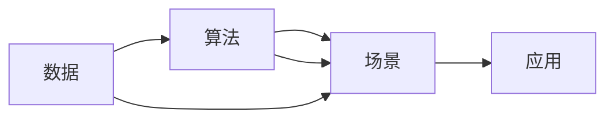

                 

# AI出版业壁垒：数据，算法和场景协同

## 1. 背景介绍

在当今信息爆炸的时代，出版业面临着前所未有的挑战和机遇。一方面，海量信息的涌入使得传统出版物的销量大幅下降，市场竞争愈发激烈；另一方面，数字技术的发展为出版业带来了新的契机，人工智能（AI）等前沿技术正逐渐渗透到出版业的各个环节，催生了新的商业模式和业务形态。然而，AI在出版业的应用并非一帆风顺，其中数据、算法和场景的协同是其主要壁垒之一。本文将从这些方面出发，探讨AI在出版业中的壁垒及其协同解决方案，以期为出版业转型提供新的思路。

## 2. 核心概念与联系

### 2.1 核心概念概述

为了深入理解AI在出版业中的应用壁垒，我们需要先明确一些核心概念：

- **数据（Data）**：AI系统的训练和优化离不开数据。出版业的数据源主要包括数字图书馆、社交媒体、在线书店等渠道产生的大量文本、图片、音频和视频等数据。这些数据为AI出版系统提供了丰富的训练素材，使得AI能够更好地理解和生成内容。

- **算法（Algorithm）**：算法是AI的核心，用于处理数据并提取特征，形成模型进行预测、分类和生成等任务。出版业中常用的AI算法包括自然语言处理（NLP）、图像识别、情感分析等。

- **场景（Scene）**：出版业的具体业务场景多种多样，如内容推荐、版权管理、营销推广等。AI在出版业中的应用必须紧密结合具体的业务场景，才能实现其价值。

- **协同（Synergy）**：数据、算法和场景之间的协同是AI在出版业中实现最优效果的关键。通过数据提供信息基础，算法进行智能处理，场景确保应用落地，三者协同工作，才能真正发挥AI的潜力。

### 2.2 核心概念原理和架构的 Mermaid 流程图

以下是一个简单的Mermaid流程图，展示了数据、算法和场景之间的协同关系：



这个图展示了数据、算法和场景之间的交互关系。数据通过算法处理后，进入场景应用，形成最终的结果。同时，数据和算法也可以根据场景的需求进行优化和调整。

## 3. 核心算法原理 & 具体操作步骤

### 3.1 算法原理概述

在出版业中，AI的算法应用主要集中在以下几个方面：

- **内容生成**：通过自然语言处理（NLP）技术，AI可以自动生成文章、新闻、评论等内容，从而提高出版效率。
- **内容推荐**：基于用户行为数据和情感分析，AI可以推荐用户感兴趣的内容，增加用户粘性。
- **版权保护**：利用图像识别和模式识别技术，AI可以自动识别和保护数字版权。
- **营销推广**：通过情感分析和社交网络分析，AI可以预测用户行为，优化营销策略。

### 3.2 算法步骤详解

AI在出版业的应用一般包括以下几个关键步骤：

1. **数据收集与预处理**：收集来自不同渠道的数据，并进行清洗和标注，为AI模型的训练提供高质量的数据集。
2. **模型训练与优化**：选择合适的算法模型，使用标注数据进行训练，并根据业务需求进行优化。
3. **场景应用与验证**：将训练好的模型应用到具体的出版场景中，如内容推荐、版权保护、营销推广等，并通过实际效果进行验证和调整。
4. **持续学习与更新**：根据实际应用中的反馈，不断调整算法和优化数据，保持AI系统的先进性和适应性。

### 3.3 算法优缺点

AI在出版业中的应用具有以下优点：

- **提高效率**：自动生成和推荐内容，可以大大提高出版效率。
- **精准推荐**：基于用户行为和情感分析，提供精准的内容推荐。
- **版权保护**：自动识别和保护数字版权，减少侵权行为。
- **优化营销**：预测用户行为，优化营销策略，提升用户满意度。

同时，AI在出版业中也有其局限性：

- **数据质量依赖**：AI模型的效果高度依赖于数据的质量和数量，数据偏差可能导致模型输出不准确。
- **算法复杂性**：高级算法模型的设计和训练复杂，需要专业知识。
- **场景适应性**：不同业务场景对AI的需求不同，算法需要针对具体场景进行优化。
- **伦理和隐私问题**：AI在处理用户数据时，可能涉及隐私和伦理问题，需要严格遵守相关法律法规。

### 3.4 算法应用领域

AI在出版业的应用领域非常广泛，包括但不限于：

- **内容生成**：自动生成新闻、文章、评论等。
- **内容推荐**：为用户推荐感兴趣的内容，如书籍、文章、视频等。
- **版权保护**：自动识别和保护数字版权，如图片、音频等。
- **营销推广**：通过预测用户行为，优化营销策略，提升用户满意度。
- **编辑辅助**：辅助编辑进行文本校正、内容筛选等。
- **销售预测**：预测销售趋势，帮助出版商优化库存和销售策略。

## 4. 数学模型和公式 & 详细讲解 & 举例说明

### 4.1 数学模型构建

在出版业中，AI的数学模型构建主要涉及以下方面：

- **内容生成模型**：如Seq2Seq、GPT-3等，用于自动生成文本。
- **推荐系统模型**：如协同过滤、基于内容的推荐等，用于推荐内容。
- **版权保护模型**：如图像识别、模式识别等，用于版权保护。
- **情感分析模型**：如文本分类、情感分类等，用于分析用户情感。

### 4.2 公式推导过程

以内容生成模型为例，Seq2Seq模型是一种基于注意力机制的神经网络模型，其基本结构如下图所示：

$$
\begin{aligned}
    x_1, x_2, \ldots, x_T &\in \mathcal{X}\\
    y_1, y_2, \ldots, y_T &\in \mathcal{Y}
\end{aligned}
$$

其中，$x_1, x_2, \ldots, x_T$ 表示输入的文本序列，$y_1, y_2, \ldots, y_T$ 表示输出的文本序列。

### 4.3 案例分析与讲解

以自然语言生成为例，我们可以使用以下公式来描述其过程：

$$
p(y_t | y_{<t}, x) = \text{Softmax}(\text{scores}(y_t | y_{<t}, x))
$$

其中，$y_t$ 表示当前生成的单词，$y_{<t}$ 表示前一个单词，$x$ 表示输入的上下文。

假设 $y_t$ 的分数函数为：

$$
\text{scores}(y_t | y_{<t}, x) = \mathbf{W}_h [h_{t-1}; \mathbf{U}_x x; \mathbf{U}_y y_{<t}]
$$

其中，$h_{t-1}$ 表示上下文编码器输出，$\mathbf{W}_h$、$\mathbf{U}_x$、$\mathbf{U}_y$ 为权重矩阵，$x$ 为输入文本，$y_{<t}$ 为前一个单词。

## 5. 项目实践：代码实例和详细解释说明

### 5.1 开发环境搭建

在进行AI出版业的开发实践时，我们需要搭建以下开发环境：

- **编程语言**：Python
- **深度学习框架**：TensorFlow、PyTorch
- **自然语言处理库**：NLTK、spaCy
- **数据处理库**：Pandas、NumPy
- **可视化工具**：Matplotlib、Seaborn

使用以下命令搭建Python开发环境：

```bash
pip install torch torchvision torchaudio cudatoolkit=11.1 -c pytorch -c conda-forge
```

### 5.2 源代码详细实现

以下是一个使用PyTorch框架进行内容生成的代码实现：

```python
import torch
import torch.nn as nn
import torch.optim as optim

class EncoderRNN(nn.Module):
    def __init__(self, input_size, hidden_size, output_size):
        super(EncoderRNN, self).__init__()
        self.hidden_size = hidden_size
        self.encoder = nn.LSTM(input_size, hidden_size, batch_first=True)
        self.fc = nn.Linear(hidden_size, output_size)
        
    def forward(self, input, hidden):
        encoder_output, hidden = self.encoder(input, hidden)
        output = self.fc(encoder_output)
        return output, hidden
    
class DecoderRNN(nn.Module):
    def __init__(self, input_size, hidden_size, output_size):
        super(DecoderRNN, self).__init__()
        self.hidden_size = hidden_size
        self.decoder = nn.LSTM(input_size, hidden_size, batch_first=True)
        self.fc = nn.Linear(hidden_size, output_size)
        self.softmax = nn.Softmax(dim=-1)
        
    def forward(self, input, hidden):
        decoder_output, hidden = self.decoder(input, hidden)
        output = self.fc(decoder_output)
        return output, hidden
    
class seq2seq(nn.Module):
    def __init__(self, encoder, decoder, device):
        super(seq2seq, self).__init__()
        self.encoder = encoder
        self.decoder = decoder
        self.device = device
        
    def forward(self, input, hidden):
        encoder_output, hidden = self.encoder(input, hidden)
        decoder_input = torch.zeros(input.size(0), input.size(1)+1, device=self.device).long()
        decoder_output, hidden = self.decoder(decoder_input, hidden)
        output = decoder_output[:, :-1]
        return output, hidden
    
# 训练代码
def train(model, input, target, criterion, optimizer, device):
    model.train()
    hidden = None
    loss = 0
    for i in range(input.size(1)):
        output, hidden = model(input[:, i, :], hidden)
        loss += criterion(output, target[:, i, :])
    optimizer.zero_grad()
    loss.backward()
    optimizer.step()
    return loss.item() / input.size(1)
    
# 预测代码
def predict(model, input, device):
    model.eval()
    hidden = None
    output = None
    for i in range(input.size(1)):
        output, hidden = model(input[:, i, :], hidden)
    return output
```

### 5.3 代码解读与分析

以上代码实现了基于RNN的内容生成模型，包括编码器、解码器和seq2seq模型。其中，编码器用于将输入的文本序列转换为隐状态，解码器用于将隐状态转换为目标文本序列，seq2seq模型则用于连接编码器和解码器。

在训练过程中，我们使用了LSTM作为编码器和解码器的基本模型，通过交叉熵损失函数对模型进行优化。在预测过程中，我们通过解码器生成目标文本序列。

## 6. 实际应用场景

### 6.1 内容推荐

内容推荐是AI在出版业中最重要的应用之一。通过分析用户的历史阅读记录和社交行为，AI可以为用户推荐感兴趣的内容，如书籍、文章等。这不仅增加了用户的粘性，还提高了出版物的销量。

以下是一个简单的内容推荐系统实现：

```python
import pandas as pd
from sklearn.decomposition import PCA
from sklearn.metrics.pairwise import cosine_similarity

# 构建用户-物品评分矩阵
ratings = pd.read_csv('ratings.csv')
user_ids = ratings['user_id'].unique()
item_ids = ratings['item_id'].unique()
rating_matrix = ratings.pivot_table(index='user_id', columns='item_id', values='rating')

# 计算用户-物品评分矩阵的奇异值分解
U, S, Vt = svd(rating_matrix.values)

# 计算用户-物品相似度矩阵
user_similarity = cosine_similarity(U, Vt)

# 为用户推荐物品
def recommend_items(user_id):
    user_vector = user_similarity[user_id]
    recommendations = []
    for item_id, similarity in enumerate(user_similarity):
        recommendations.append((item_id, similarity))
    recommendations = sorted(recommendations, key=lambda x: x[1], reverse=True)[:10]
    return recommendations
```

### 6.2 版权保护

版权保护是出版业中另一个重要的应用场景。AI可以通过图像识别和模式识别技术，自动识别和保护数字版权。

以下是一个简单的图像识别实现：

```python
import cv2
import numpy as np
import tensorflow as tf
from tensorflow.keras.applications import vgg16

# 加载预训练的VGG16模型
model = vgg16.VGG16(weights='imagenet', include_top=False, input_shape=(224, 224, 3))

# 加载图片并进行预处理
image = cv2.imread('image.jpg')
image = cv2.resize(image, (224, 224))
image = image / 255
image = np.expand_dims(image, axis=0)

# 将图片输入模型进行预测
predictions = model.predict(image)
```

### 6.3 营销推广

营销推广是出版业中AI应用的重要方向之一。通过分析用户的行为数据和情感分析，AI可以预测用户的行为，优化营销策略。

以下是一个简单的情感分析实现：

```python
import nltk
from nltk.sentiment import SentimentIntensityAnalyzer

# 加载情感分析器
analyzer = SentimentIntensityAnalyzer()

# 对文本进行情感分析
text = 'The book is very good. I highly recommend it.'
scores = analyzer.polarity_scores(text)
```

## 7. 工具和资源推荐

### 7.1 学习资源推荐

为了帮助开发者系统掌握AI在出版业中的应用，这里推荐一些优质的学习资源：

- **自然语言处理课程**：Coursera上的“Natural Language Processing with Python”课程，涵盖了NLP的基本概念和常见模型。
- **深度学习框架教程**：TensorFlow和PyTorch官方文档，提供了详细的API和使用指南。
- **出版业案例分析**：Google Books Ngram Viewer，提供了大量书籍的语料库，可以用于分析出版物的流行趋势。
- **AI在出版业的应用指南**：《AI出版业：数据、算法和场景协同》一书，详细介绍了AI在出版业中的应用案例和方法。

### 7.2 开发工具推荐

- **编程语言**：Python
- **深度学习框架**：TensorFlow、PyTorch
- **自然语言处理库**：NLTK、spaCy
- **数据处理库**：Pandas、NumPy
- **可视化工具**：Matplotlib、Seaborn

### 7.3 相关论文推荐

- **内容生成**：Attention Is All You Need（Transformer论文）
- **内容推荐**：Collaborative Filtering for Implicit Feedback Datasets
- **版权保护**：ImageNet Classification with Deep Convolutional Neural Networks
- **情感分析**：Sentiment Analysis with Recurrent Neural Networks

## 8. 总结：未来发展趋势与挑战

### 8.1 总结

本文对AI在出版业中的应用进行了系统介绍，包括数据、算法和场景的协同，并提供了详细的代码实现和应用案例。通过本文的学习，读者可以更好地理解AI在出版业中的壁垒，并掌握具体的实现方法。

### 8.2 未来发展趋势

AI在出版业的应用前景广阔，未来趋势如下：

1. **深度学习模型的应用**：随着深度学习技术的不断发展，未来的出版业将更多地依赖深度学习模型，如BERT、GPT等，以提高内容生成和推荐的效果。
2. **跨媒体内容的生成**：AI不仅可以生成文本，还可以生成图片、音频、视频等多媒体内容，为出版业提供更加丰富和多样化的内容形式。
3. **个性化推荐系统**：基于用户的行为数据和情感分析，AI可以提供更加个性化和精准的内容推荐，提升用户体验。
4. **自动化版权保护**：利用AI的图像识别和模式识别技术，实现自动化的版权保护，减少版权纠纷。
5. **情感分析与用户行为预测**：通过情感分析和用户行为预测，优化营销策略，提升用户满意度。

### 8.3 面临的挑战

尽管AI在出版业中的应用前景广阔，但也面临诸多挑战：

1. **数据质量问题**：AI模型的效果高度依赖于数据的质量和数量，数据偏差可能导致模型输出不准确。
2. **算法复杂性**：高级算法模型的设计和训练复杂，需要专业知识。
3. **场景适应性**：不同业务场景对AI的需求不同，算法需要针对具体场景进行优化。
4. **伦理和隐私问题**：AI在处理用户数据时，可能涉及隐私和伦理问题，需要严格遵守相关法律法规。

### 8.4 研究展望

未来的研究需要关注以下几个方面：

1. **数据收集与处理**：提高数据收集和处理的效率和质量，为AI模型的训练提供更好的数据基础。
2. **算法优化**：开发更加高效和准确的算法模型，提升AI系统的性能。
3. **场景应用**：将AI技术更好地应用于具体的业务场景，解决实际问题。
4. **伦理与隐私**：在AI系统的设计和应用中，注重伦理和隐私保护，确保用户的权益。

## 9. 附录：常见问题与解答

**Q1: 如何选择合适的深度学习框架？**

A: 选择合适的深度学习框架需要考虑以下因素：
- **功能**：不同框架的功能不同，如TensorFlow支持更多的分布式训练方式。
- **易用性**：Keras等高级API可以简化模型的开发和调试。
- **社区支持**：PyTorch和TensorFlow有强大的社区支持，可以方便地获取资源和帮助。

**Q2: 如何选择适合的算法模型？**

A: 选择适合的算法模型需要考虑以下因素：
- **数据特点**：根据数据的特点选择合适的模型，如文本分类适合使用RNN或CNN。
- **任务类型**：根据任务类型选择合适的模型，如内容生成适合使用Seq2Seq模型。
- **计算资源**：根据计算资源的限制选择合适的模型，如小规模项目可以使用Keras，大规模项目可以使用TensorFlow。

**Q3: 如何优化算法模型的训练？**

A: 优化算法模型的训练需要考虑以下因素：
- **学习率**：选择合适的学习率，避免过拟合和欠拟合。
- **正则化**：使用L2正则化、Dropout等技术，避免模型过拟合。
- **数据增强**：通过数据增强技术，扩充训练集，提升模型的泛化能力。
- **超参数调优**：通过网格搜索、随机搜索等方法，找到最优的超参数组合。

**Q4: 如何处理数据质量问题？**

A: 处理数据质量问题需要考虑以下因素：
- **数据清洗**：去除数据中的噪声和异常值，保证数据质量。
- **数据增强**：通过数据增强技术，扩充训练集，提升模型的泛化能力。
- **数据标注**：对数据进行标注，提高数据的准确性。

**Q5: 如何应对伦理和隐私问题？**

A: 应对伦理和隐私问题需要考虑以下因素：
- **数据匿名化**：对用户数据进行匿名化处理，保护用户隐私。
- **数据合规**：遵循相关的法律法规，如GDPR等，保护用户数据。
- **模型透明**：提高模型的透明性，让用户了解模型的决策过程。

通过以上问题的解答，读者可以更好地理解AI在出版业中的应用，并掌握具体的实现方法。希望本文能为出版业转型提供新的思路和方向。

---

作者：禅与计算机程序设计艺术 / Zen and the Art of Computer Programming

