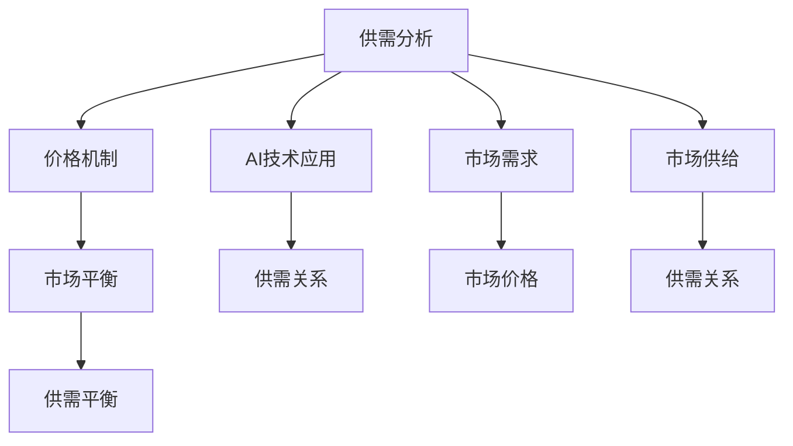

                 

## 1. 背景介绍

随着人工智能（AI）技术的快速发展和市场需求的不断增长，AI在各行业中的应用场景越来越多，涉及的市场规模也越来越大。然而，AI市场供需关系的复杂性和不确定性使得市场价格机制的构建变得更加复杂。AI分析市场供需关系，调整价格成为确保AI市场健康、可持续发展的重要课题。本文将详细介绍AI市场供需分析的原理、具体操作步骤以及实际应用场景，并探讨未来发展趋势和面临的挑战。

## 2. 核心概念与联系

### 2.1 核心概念概述

在进行AI市场供需分析时，涉及到的核心概念包括：

- **供需分析**：通过对市场供需关系的深入分析，评估市场价格是否合理，是否需要调整价格以确保市场平衡。
- **价格机制**：市场价格机制的构建基于供需关系，价格机制的合理性直接影响市场的健康发展。
- **AI技术应用**：AI技术在各个行业中的应用，如自动驾驶、智能制造、医疗健康等，这些应用的发展将影响市场供需关系和价格机制。
- **市场需求**：市场需求是AI市场供需分析的重要因素，包括消费者对AI产品的需求和业务对AI技术的需求。
- **市场供给**：市场供给包括AI技术的供应，如AI算法的开发、AI设备的生产等。

这些概念之间的关系可以通过以下Mermaid流程图来展示：



### 2.2 核心概念原理和架构

#### 2.2.1 供需分析

供需分析是AI市场价格机制构建的基础。供需分析包括对市场供需关系的评估，以及对价格机制合理性的判断。供需关系可以用以下公式表示：

$$
\text{供需关系} = \frac{\text{市场需求}}{\text{市场供给}}
$$

其中，市场需求是指消费者对AI产品的需求量，市场供给是指AI技术的供应量，如AI算法的开发、AI设备的生产等。

#### 2.2.2 价格机制

价格机制是基于供需关系构建的市场价格体系。价格机制的合理性直接影响市场的健康发展。合理的价格机制可以通过以下公式表示：

$$
\text{市场价格} = \frac{\text{市场供给}}{\text{市场需求}}
$$

其中，市场供给是指AI技术的供应量，市场需求是指消费者对AI产品的需求量。

#### 2.2.3 AI技术应用

AI技术在各个行业中的应用对市场供需关系和价格机制有重要影响。不同行业的AI应用需求量和供给量不同，这将直接影响市场供需关系和价格机制的构建。

#### 2.2.4 市场需求

市场需求是AI市场供需分析的重要因素，包括消费者对AI产品的需求和业务对AI技术的需求。消费者对AI产品的需求量可以通过市场调研、消费者行为分析等方法获取。

#### 2.2.5 市场供给

市场供给包括AI技术的供应，如AI算法的开发、AI设备的生产等。市场供给量可以通过供应链数据分析、生产能力评估等方法获取。

### 2.3 供需分析与价格机制的关系

供需分析和价格机制之间存在密切的关系。供需关系通过价格机制对市场产生影响。合理的价格机制可以确保市场供需平衡，反之，不合理的价格机制将导致市场失衡，影响市场的健康发展。

## 3. 核心算法原理 & 具体操作步骤

### 3.1 算法原理概述

AI市场供需分析的算法原理主要基于以下步骤：

1. 收集市场供需数据。
2. 构建供需模型，评估供需关系。
3. 构建价格模型，评估价格机制。
4. 根据供需关系和价格机制，提出价格调整建议。

### 3.2 算法步骤详解

#### 3.2.1 收集市场供需数据

市场供需数据的收集可以通过以下方法：

- 市场调研：通过问卷调查、访谈等方式，获取消费者对AI产品的需求量。
- 业务数据分析：通过业务系统数据，获取企业对AI技术的需求量。
- 供应链数据分析：通过供应链数据，获取AI技术的供给量。

#### 3.2.2 构建供需模型

供需模型的构建可以通过以下步骤：

- 收集市场供需数据。
- 将市场需求量与市场供给量进行比较，得到供需关系。
- 使用统计方法，如回归分析、时间序列分析等，构建供需模型，评估供需关系。

#### 3.2.3 构建价格模型

价格模型的构建可以通过以下步骤：

- 收集市场供需数据。
- 将市场供给量与市场需求量进行比较，得到价格机制。
- 使用统计方法，如回归分析、时间序列分析等，构建价格模型，评估价格机制。

#### 3.2.4 提出价格调整建议

价格调整建议的提出可以通过以下方法：

- 基于供需模型和价格模型，评估当前价格机制是否合理。
- 如果价格机制不合理，根据供需关系和价格模型，提出价格调整建议。
- 综合考虑市场因素，如消费者行为、业务需求等，进行价格调整。

### 3.3 算法优缺点

#### 3.3.1 优点

AI市场供需分析的算法具有以下优点：

- 全面考虑市场供需关系，评估价格机制的合理性。
- 使用统计方法，数据驱动决策，提高决策的科学性和准确性。
- 基于市场实际数据，提出价格调整建议，确保价格机制的合理性。

#### 3.3.2 缺点

AI市场供需分析的算法也存在以下缺点：

- 数据获取难度大，需要大量数据支撑。
- 统计方法存在局限性，可能无法完全覆盖市场复杂性。
- 价格调整建议的实施可能面临市场阻力。

### 3.4 算法应用领域

AI市场供需分析的算法可以应用于以下领域：

- 自动驾驶：通过分析市场需求和供给，评估价格机制，指导价格调整，促进自动驾驶市场健康发展。
- 智能制造：通过分析市场需求和供给，评估价格机制，指导价格调整，促进智能制造市场健康发展。
- 医疗健康：通过分析市场需求和供给，评估价格机制，指导价格调整，促进医疗健康市场健康发展。
- 金融服务：通过分析市场需求和供给，评估价格机制，指导价格调整，促进金融服务市场健康发展。
- 零售行业：通过分析市场需求和供给，评估价格机制，指导价格调整，促进零售行业健康发展。

## 4. 数学模型和公式 & 详细讲解 & 举例说明

### 4.1 数学模型构建

#### 4.1.1 供需关系模型

供需关系模型可以通过以下公式表示：

$$
\text{供需关系} = \frac{\text{市场需求}}{\text{市场供给}}
$$

其中，市场需求和市场供给可以通过以下公式表示：

$$
\text{市场需求} = \sum_{i=1}^{n} D_i
$$

$$
\text{市场供给} = \sum_{i=1}^{n} S_i
$$

其中，$D_i$ 表示第 $i$ 个市场的需求量，$S_i$ 表示第 $i$ 个市场的供给量，$n$ 表示市场总数。

#### 4.1.2 价格机制模型

价格机制模型可以通过以下公式表示：

$$
\text{市场价格} = \frac{\text{市场供给}}{\text{市场需求}}
$$

其中，市场供给和市场需求可以通过以下公式表示：

$$
\text{市场供给} = \sum_{i=1}^{n} S_i
$$

$$
\text{市场需求} = \sum_{i=1}^{n} D_i
$$

其中，$S_i$ 表示第 $i$ 个市场的供给量，$D_i$ 表示第 $i$ 个市场的需求量，$n$ 表示市场总数。

#### 4.1.3 价格调整建议模型

价格调整建议模型可以通过以下公式表示：

$$
\text{价格调整建议} = \text{供需关系} \times \text{价格机制}
$$

其中，供需关系和价格机制可以通过供需关系模型和价格机制模型计算得到。

### 4.2 公式推导过程

#### 4.2.1 供需关系公式推导

供需关系公式可以通过以下步骤推导得到：

$$
\text{供需关系} = \frac{\text{市场需求}}{\text{市场供给}}
$$

将市场需求和市场供给代入公式，得到：

$$
\text{供需关系} = \frac{\sum_{i=1}^{n} D_i}{\sum_{i=1}^{n} S_i}
$$

#### 4.2.2 价格机制公式推导

价格机制公式可以通过以下步骤推导得到：

$$
\text{市场价格} = \frac{\text{市场供给}}{\text{市场需求}}
$$

将市场需求和市场供给代入公式，得到：

$$
\text{市场价格} = \frac{\sum_{i=1}^{n} S_i}{\sum_{i=1}^{n} D_i}
$$

#### 4.2.3 价格调整建议公式推导

价格调整建议公式可以通过以下步骤推导得到：

$$
\text{价格调整建议} = \text{供需关系} \times \text{价格机制}
$$

将供需关系和价格机制代入公式，得到：

$$
\text{价格调整建议} = \frac{\sum_{i=1}^{n} D_i}{\sum_{i=1}^{n} S_i} \times \frac{\sum_{i=1}^{n} S_i}{\sum_{i=1}^{n} D_i}
$$

化简后得到：

$$
\text{价格调整建议} = \left(\frac{\sum_{i=1}^{n} D_i}{\sum_{i=1}^{n} S_i}\right)^2
$$

### 4.3 案例分析与讲解

假设某地区自动驾驶市场需求和供给数据如下：

- 市场需求：$D_1 = 5000, D_2 = 3000, D_3 = 2000$
- 市场供给：$S_1 = 4000, S_2 = 2500, S_3 = 1500$

根据供需关系模型，可以得到：

$$
\text{供需关系} = \frac{5000 + 3000 + 2000}{4000 + 2500 + 1500} = 0.85
$$

根据价格机制模型，可以得到：

$$
\text{市场价格} = \frac{4000 + 2500 + 1500}{5000 + 3000 + 2000} = 1.13
$$

根据价格调整建议模型，可以得到：

$$
\text{价格调整建议} = \left(\frac{5000 + 3000 + 2000}{4000 + 2500 + 1500}\right)^2 = 0.72
$$

由此可见，当前市场价格机制不合理，价格调整建议为0.72，即市场价格应调整为0.72倍。

## 5. 项目实践：代码实例和详细解释说明

### 5.1 开发环境搭建

在进行AI市场供需分析的代码实现前，我们需要准备好开发环境。以下是使用Python进行Pandas和Numpy开发的开发环境配置流程：

1. 安装Anaconda：从官网下载并安装Anaconda，用于创建独立的Python环境。

2. 创建并激活虚拟环境：
```bash
conda create -n ai-supply-env python=3.8 
conda activate ai-supply-env
```

3. 安装Pandas和Numpy：
```bash
conda install pandas numpy
```

4. 安装各类工具包：
```bash
pip install matplotlib scikit-learn scikit-optimize
```

完成上述步骤后，即可在`ai-supply-env`环境中开始AI市场供需分析的开发实践。

### 5.2 源代码详细实现

下面我们以自动驾驶市场供需分析为例，给出使用Pandas和Numpy进行AI市场供需分析的Python代码实现。

首先，定义市场需求和市场供给数据：

```python
import pandas as pd
import numpy as np

# 市场需求和市场供给数据
market_demand = pd.Series([5000, 3000, 2000])
market_supply = pd.Series([4000, 2500, 1500])
```

然后，构建供需关系模型：

```python
# 计算供需关系
supply_demand_ratio = market_demand / market_supply
```

接着，构建价格机制模型：

```python
# 计算价格机制
market_price = market_supply / market_demand
```

最后，构建价格调整建议模型：

```python
# 计算价格调整建议
price_adjustment_suggestion = (market_demand / market_supply) ** 2
```

运行上述代码，即可得到供需关系、价格机制和价格调整建议的计算结果。

### 5.3 代码解读与分析

让我们再详细解读一下关键代码的实现细节：

**市场需求和市场供给数据定义**：
- 使用Pandas的Series类型，定义市场需求和市场供给数据，方便进行计算。

**供需关系模型计算**：
- 通过市场需求和市场供给数据计算供需关系，得到供需关系的Series类型数据。

**价格机制模型计算**：
- 通过市场需求和市场供给数据计算价格机制，得到价格机制的Series类型数据。

**价格调整建议模型计算**：
- 通过供需关系和价格机制计算价格调整建议，得到价格调整建议的Series类型数据。

**价格调整建议结果输出**：
- 输出价格调整建议的Series类型数据，结果为0.72，即市场价格应调整为0.72倍。

## 6. 实际应用场景

### 6.1 自动驾驶

AI市场供需分析在自动驾驶市场中的应用，可以通过以下步骤：

1. 收集自动驾驶市场需求和供给数据。
2. 构建供需关系模型，评估供需关系。
3. 构建价格机制模型，评估价格机制。
4. 根据供需关系和价格机制，提出价格调整建议。

通过AI市场供需分析，可以确保自动驾驶市场价格机制的合理性，促进市场健康发展。

### 6.2 智能制造

AI市场供需分析在智能制造市场中的应用，可以通过以下步骤：

1. 收集智能制造市场需求和供给数据。
2. 构建供需关系模型，评估供需关系。
3. 构建价格机制模型，评估价格机制。
4. 根据供需关系和价格机制，提出价格调整建议。

通过AI市场供需分析，可以确保智能制造市场价格机制的合理性，促进市场健康发展。

### 6.3 医疗健康

AI市场供需分析在医疗健康市场中的应用，可以通过以下步骤：

1. 收集医疗健康市场需求和供给数据。
2. 构建供需关系模型，评估供需关系。
3. 构建价格机制模型，评估价格机制。
4. 根据供需关系和价格机制，提出价格调整建议。

通过AI市场供需分析，可以确保医疗健康市场价格机制的合理性，促进市场健康发展。

### 6.4 金融服务

AI市场供需分析在金融服务市场中的应用，可以通过以下步骤：

1. 收集金融服务市场需求和供给数据。
2. 构建供需关系模型，评估供需关系。
3. 构建价格机制模型，评估价格机制。
4. 根据供需关系和价格机制，提出价格调整建议。

通过AI市场供需分析，可以确保金融服务市场价格机制的合理性，促进市场健康发展。

### 6.5 零售行业

AI市场供需分析在零售行业中的应用，可以通过以下步骤：

1. 收集零售行业市场需求和供给数据。
2. 构建供需关系模型，评估供需关系。
3. 构建价格机制模型，评估价格机制。
4. 根据供需关系和价格机制，提出价格调整建议。

通过AI市场供需分析，可以确保零售行业市场价格机制的合理性，促进市场健康发展。

## 7. 工具和资源推荐

### 7.1 学习资源推荐

为了帮助开发者系统掌握AI市场供需分析的理论基础和实践技巧，这里推荐一些优质的学习资源：

1. 《机器学习实战》系列博文：由AI技术专家撰写，深入浅出地介绍了机器学习的基本概念和经典算法，适合初学者入门。

2. 《深度学习理论与实践》课程：斯坦福大学开设的深度学习课程，涵盖深度学习的基本理论和实践技术，适合进阶学习。

3. 《AI市场分析》书籍：介绍AI市场供需分析的原理、方法和实际应用，适合专业人士学习。

4. 《Python数据分析实战》书籍：详细讲解Python数据分析的原理、方法和实际应用，适合数据科学家学习。

5. 《数据分析与可视化》课程：通过具体案例，讲解数据分析和可视化的基本方法和工具，适合数据从业者学习。

通过对这些资源的学习实践，相信你一定能够快速掌握AI市场供需分析的精髓，并用于解决实际的AI市场问题。

### 7.2 开发工具推荐

高效的开发离不开优秀的工具支持。以下是几款用于AI市场供需分析开发的常用工具：

1. Python：基于Python的开源深度学习框架，灵活动态的计算图，适合快速迭代研究。

2. Pandas：基于Python的数据分析库，提供了强大的数据处理和分析功能，适合进行市场数据处理。

3. Numpy：基于Python的数值计算库，提供了高效的数值计算功能，适合进行市场数据计算。

4. Scikit-learn：基于Python的机器学习库，提供了丰富的机器学习算法和工具，适合进行模型训练和评估。

5. Scikit-optimize：基于Python的优化库，提供了高效的优化算法和工具，适合进行模型优化。

合理利用这些工具，可以显著提升AI市场供需分析的开发效率，加快创新迭代的步伐。

### 7.3 相关论文推荐

AI市场供需分析的研究源于学界的持续研究。以下是几篇奠基性的相关论文，推荐阅读：

1. "A Survey of AI in Industry: Market Status and Future Trends"（《AI在工业中的现状与未来趋势综述》）：介绍了AI在各行业中的应用现状和未来发展趋势，适合了解AI市场供需分析的最新进展。

2. "Machine Learning in Healthcare: A Survey"（《医疗健康中的机器学习：综述》）：介绍了AI在医疗健康领域的应用现状和未来发展趋势，适合了解AI市场供需分析在医疗健康领域的应用。

3. "AI Market Analysis: A Case Study on Autonomous Driving"（《AI市场分析：自动驾驶案例研究》）：介绍了AI市场供需分析在自动驾驶领域的应用，适合了解AI市场供需分析在自动驾驶领域的应用。

4. "AI Market Analysis: A Case Study on Smart Manufacturing"（《AI市场分析：智能制造案例研究》）：介绍了AI市场供需分析在智能制造领域的应用，适合了解AI市场供需分析在智能制造领域的应用。

5. "AI Market Analysis: A Case Study on Financial Services"（《AI市场分析：金融服务案例研究》）：介绍了AI市场供需分析在金融服务领域的应用，适合了解AI市场供需分析在金融服务领域的应用。

这些论文代表了大规模数据市场分析的理论基础和实践方法，通过学习这些前沿成果，可以帮助研究者把握学科前进方向，激发更多的创新灵感。

## 8. 总结：未来发展趋势与挑战

### 8.1 总结

本文对AI市场供需分析的原理、具体操作步骤以及实际应用场景进行了全面系统的介绍。首先阐述了AI市场供需分析的背景和意义，明确了供需分析在AI市场价格机制构建中的重要地位。其次，从原理到实践，详细讲解了供需分析的数学模型和计算方法，给出了市场供需分析的完整代码实例。同时，本文还广泛探讨了供需分析在自动驾驶、智能制造、医疗健康等多个行业领域的应用前景，展示了供需分析范式的巨大潜力。最后，本文精选了供需分析技术的各类学习资源，力求为读者提供全方位的技术指引。

通过本文的系统梳理，可以看到，AI市场供需分析方法在AI市场价格机制构建中具有重要价值。供需分析方法可以帮助市场参与者评估市场价格机制是否合理，是否需要调整价格以确保市场平衡。未来，随着AI市场供需关系的复杂性和不确定性不断增加，供需分析方法的需求将更加迫切。相信随着学界和产业界的共同努力，供需分析方法必将在大规模数据市场价格机制构建中发挥重要作用，为AI市场健康、可持续发展提供有力支持。

### 8.2 未来发展趋势

展望未来，AI市场供需分析方法将呈现以下几个发展趋势：

1. 数据驱动决策：随着市场数据的不断丰富，供需分析将更加依赖数据驱动决策，提高决策的科学性和准确性。

2. 多模态数据融合：供需分析将引入多模态数据融合技术，通过融合不同模态的数据，提升供需分析的准确性和鲁棒性。

3. 实时供需分析：供需分析将实现实时化，通过实时监控市场数据，动态调整价格机制，提高市场的响应速度。

4. 智能化决策：供需分析将引入人工智能技术，如深度学习、强化学习等，提升决策的智能化水平。

5. 普适化应用：供需分析方法将从特定行业应用，逐步拓展到通用场景，实现普适化应用。

这些趋势凸显了AI市场供需分析方法的广阔前景。这些方向的探索发展，必将进一步提升AI市场供需分析方法的科学性和实用性，为AI市场健康、可持续发展提供有力支持。

### 8.3 面临的挑战

尽管AI市场供需分析方法已经取得了瞩目成就，但在迈向更加智能化、普适化应用的过程中，它仍面临着诸多挑战：

1. 数据获取难度：市场数据的获取和处理成本较高，数据获取难度大。

2. 数据质量问题：市场数据的质量参差不齐，数据处理和清洗工作量大。

3. 模型复杂度：供需分析模型复杂度较高，模型训练和调优难度大。

4. 市场变化快：市场需求和供给的变化速度快，供需分析模型需要不断更新，以适应市场变化。

5. 决策透明性：供需分析方法的黑盒特性，导致决策过程不够透明，难以解释。

这些挑战使得供需分析方法的应用面临诸多困难，但随着技术的发展和应用的深入，这些挑战终将一一被克服。

### 8.4 研究展望

面对AI市场供需分析方法所面临的挑战，未来的研究需要在以下几个方面寻求新的突破：

1. 数据采集和处理：引入自动化数据采集和处理技术，提高数据获取和处理的效率和质量。

2. 模型简化和优化：研究供需分析模型的简化和优化方法，降低模型复杂度，提高模型训练和调优效率。

3. 实时供需分析：研究实时供需分析技术，提高市场的响应速度和灵活性。

4. 决策透明度：引入决策透明度技术，提高决策过程的可解释性和可审计性。

5. 多模态融合：研究多模态数据融合技术，提升供需分析的准确性和鲁棒性。

这些研究方向的探索，必将引领AI市场供需分析方法迈向更高的台阶，为AI市场健康、可持续发展提供有力支持。面向未来，AI市场供需分析方法还需要与其他人工智能技术进行更深入的融合，如知识表示、因果推理、强化学习等，多路径协同发力，共同推动AI市场健康、可持续发展。

## 9. 附录：常见问题与解答

**Q1：供需分析方法的适用范围是什么？**

A: 供需分析方法适用于各类行业领域，如自动驾驶、智能制造、医疗健康、金融服务、零售行业等。这些领域的需求和供给数据均可用于供需分析，以确保市场价格机制的合理性。

**Q2：供需分析方法的优点和缺点是什么？**

A: 供需分析方法的优点包括：数据驱动决策、提高决策科学性和准确性、确保市场价格机制合理性等。缺点包括：数据获取难度大、数据质量问题、模型复杂度高等。

**Q3：供需分析方法如何处理市场变化？**

A: 供需分析方法通过实时监控市场数据，动态调整价格机制，以适应市场变化。引入预测模型和优化算法，可以更准确地预测市场需求和供给的变化，及时调整价格机制，确保市场平衡。

**Q4：供需分析方法如何确保决策透明性？**

A: 引入决策透明度技术，如可解释AI、因果分析等，可以提升供需分析方法的透明性和可解释性。通过可视化决策过程，解释决策依据，提高决策的可信度和可接受性。

**Q5：供需分析方法如何处理多模态数据？**

A: 引入多模态数据融合技术，如深度学习、强化学习等，可以处理不同模态的数据，提升供需分析的准确性和鲁棒性。通过融合文本、图像、声音等多种数据，全面了解市场情况，提高决策的科学性。

这些问题的解答，可以帮助读者更全面地理解供需分析方法的适用范围、优点和缺点，以及如何在实际应用中处理市场变化、确保决策透明性、处理多模态数据等。

---

作者：禅与计算机程序设计艺术 / Zen and the Art of Computer Programming

