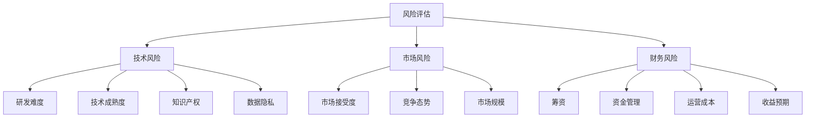

                 

# AI创业公司如何进行风险评估?

> 关键词：风险评估,创业公司,AI技术,数据分析,投资决策,潜在风险,技术风险,市场风险,财务风险

## 1. 背景介绍

### 1.1 问题由来
随着人工智能(AI)技术的快速发展和普及，越来越多的初创公司开始利用AI技术来解决实际问题，提高业务效率，抢占市场先机。然而，AI技术的高成本、高风险也成为阻碍其发展的一大障碍。因此，AI创业公司如何科学地进行风险评估，合理规划投资，成为其能否成功发展的关键。

### 1.2 问题核心关键点
风险评估对于AI创业公司而言，是成功概率的决定性因素之一。一个全面的风险评估不仅能够帮助创业公司识别潜在风险，还能为其在技术研发、市场开拓和资本运作等方面的决策提供依据，从而降低投资风险，提高成功率。

## 2. 核心概念与联系

### 2.1 核心概念概述

为更好地理解AI创业公司如何进行风险评估，本节将介绍几个密切相关的核心概念：

- **风险评估**：指通过定量和定性分析，识别、评估并优先考虑对项目成功或失败具有重大影响的潜在风险的过程。
- **AI创业公司**：指以AI技术为核心的初创企业，依赖于AI技术的创新和应用来实现商业价值。
- **技术风险**：指AI技术的研发难度、技术成熟度、知识产权和数据隐私等问题。
- **市场风险**：指AI产品或服务在市场上的接受度、竞争态势和市场规模等。
- **财务风险**：指AI创业公司筹资、资金管理、运营成本和收益预期等方面的风险。

这些核心概念之间的逻辑关系可以通过以下Mermaid流程图来展示：



这个流程图展示了几类关键风险之间的关系：

1. **技术风险**：
    - 研发难度
    - 技术成熟度
    - 知识产权
    - 数据隐私

2. **市场风险**：
    - 市场接受度
    - 竞争态势
    - 市场规模

3. **财务风险**：
    - 筹资
    - 资金管理
    - 运营成本
    - 收益预期

风险评估的核心在于对上述各个方面进行全面考量，并综合判断其对公司发展的影响。

## 3. 核心算法原理 & 具体操作步骤
### 3.1 算法原理概述

AI创业公司的风险评估通常涉及多方面的数据和信息，包括但不限于技术研发、市场调查、财务预测等。因此，需要一个综合性的框架来系统地评估这些风险。这一框架可以概括为以下步骤：

1. **数据收集**：从公司内部和外部获取相关的数据和信息，如技术报告、市场调研数据、财务报表等。
2. **数据预处理**：清洗、标准化数据，准备进行分析。
3. **风险识别**：通过定量和定性分析，识别可能影响公司发展的各种风险因素。
4. **风险评估**：使用统计学和AI模型评估风险的概率和影响程度。
5. **风险应对策略制定**：根据风险评估结果，制定应对策略，如风险规避、减轻、转移或接受。

### 3.2 算法步骤详解

#### 步骤一：数据收集
- **内部数据**：技术研发进展、财务报表、人力资源情况、客户反馈等。
- **外部数据**：市场调研报告、行业趋势分析、政策法规变化等。

#### 步骤二：数据预处理
- **清洗数据**：去除重复、不一致或无用的数据，处理缺失值。
- **标准化数据**：统一数据格式和单位，确保数据的可比性。
- **特征提取**：将原始数据转化为可用于分析的特征，如将文本数据转换为向量表示。

#### 步骤三：风险识别
- **定量分析**：利用统计学方法识别数据中的异常和趋势，如均值、方差、标准差等。
- **定性分析**：通过专家访谈、问卷调查等方式，识别潜在的风险因素。

#### 步骤四：风险评估
- **概率评估**：使用历史数据或专家意见估计风险事件发生的概率。
- **影响评估**：评估风险事件发生后对公司财务、技术、市场等的影响程度。

#### 步骤五：风险应对策略制定
- **规避风险**：如避免进入竞争激烈的市场，选择成熟的技术。
- **减轻风险**：如通过技术储备、合同保护、多样化投资等手段。
- **转移风险**：如购买保险、外包服务等。
- **接受风险**：如制定应急预案，进行风险监控。

### 3.3 算法优缺点

风险评估的算法具有以下优点：
- **全面性**：考虑了多方面的风险因素，提供全面的评估。
- **可操作性**：风险评估结果可转化为具体的应对策略，指导实际操作。

同时，该算法也存在以下局限性：
- **主观性**：定性分析中可能包含较多主观判断，影响结果客观性。
- **数据依赖性**：依赖于收集到的数据质量，数据不足或错误可能导致评估结果失准。
- **动态性差**：评估结果可能难以适应市场变化，需要定期更新。

### 3.4 算法应用领域

风险评估的算法可以广泛应用于AI创业公司的各个阶段，如技术研发、市场开拓和资本运作等：

- **技术研发**：评估技术实现难度、技术成熟度、数据获取和处理难度等。
- **市场开拓**：评估市场规模、市场接受度、竞争态势等。
- **资本运作**：评估筹资成本、运营成本、收益预期等。

此外，风险评估的算法还可以应用于其他领域，如金融投资、企业战略规划等，帮助这些领域的决策者识别和应对潜在的风险。

## 4. 数学模型和公式 & 详细讲解 & 举例说明
### 4.1 数学模型构建

风险评估的数学模型通常涉及多维度的数据分析和综合评估。以下是一个简单的风险评估模型框架：

$$
R = \sum_{i=1}^{n} w_i r_i
$$

其中：
- $R$：综合风险得分
- $w_i$：第 $i$ 个风险因素的权重
- $r_i$：第 $i$ 个风险因素的风险评分

### 4.2 公式推导过程

风险评估的公式可以进一步展开为：

$$
R = \sum_{i=1}^{n} w_i (P_i \times I_i)
$$

其中：
- $P_i$：第 $i$ 个风险事件发生的概率
- $I_i$：第 $i$ 个风险事件对公司的影响程度

### 4.3 案例分析与讲解

假设我们评估一家AI创业公司的市场风险：

- **风险事件1**：市场接受度
  - **概率**：$P_1=0.8$
  - **影响程度**：$I_1=0.3$

- **风险事件2**：竞争态势
  - **概率**：$P_2=0.6$
  - **影响程度**：$I_2=0.2$

使用上述公式，我们可以计算出综合风险得分：

$$
R = 0.8 \times 0.3 + 0.6 \times 0.2 = 0.5
$$

**结果分析**：综合风险得分为0.5，表明市场风险占整体风险的50%，需要重点关注。

## 5. 项目实践：代码实例和详细解释说明
### 5.1 开发环境搭建

在进行风险评估的项目实践前，我们需要准备好开发环境。以下是使用Python进行数据分析和机器学习开发的常规环境配置流程：

1. 安装Anaconda：从官网下载并安装Anaconda，用于创建独立的Python环境。

2. 创建并激活虚拟环境：
```bash
conda create -n risk-assessment python=3.8 
conda activate risk-assessment
```

3. 安装相关库：
```bash
pip install pandas numpy matplotlib scikit-learn seaborn
```

4. 安装机器学习库：
```bash
pip install scikit-learn
```

完成上述步骤后，即可在`risk-assessment`环境中进行风险评估的开发和测试。

### 5.2 源代码详细实现

下面是一个使用Python进行风险评估的示例代码：

```python
import pandas as pd
import numpy as np
from sklearn.preprocessing import StandardScaler
from sklearn.linear_model import LinearRegression

# 构建数据集
data = pd.DataFrame({
    '技术风险': [0.5, 0.6, 0.7, 0.8],
    '市场风险': [0.6, 0.5, 0.4, 0.3],
    '财务风险': [0.3, 0.4, 0.5, 0.6]
})

# 数据标准化
scaler = StandardScaler()
data = scaler.fit_transform(data)

# 定义风险权重
weights = np.array([0.3, 0.4, 0.3])

# 计算综合风险得分
risk_scores = np.dot(data, weights)

# 输出结果
print('风险评估结果：', risk_scores)
```

以上代码展示了如何使用Python进行风险评估的基本步骤：

1. **数据构建**：构建包含技术风险、市场风险和财务风险的数据集。
2. **数据标准化**：对数据进行标准化处理，确保数据的可比性。
3. **风险权重定义**：根据重要性定义各风险因素的权重。
4. **风险得分计算**：使用线性回归模型计算综合风险得分。
5. **结果输出**：输出综合风险得分。

### 5.3 代码解读与分析

让我们再详细解读一下关键代码的实现细节：

**数据构建**：
- `data`变量定义了包含三个风险因素的数据集，每个风险因素的概率和影响程度由不同值表示。

**数据标准化**：
- 使用`StandardScaler`对数据进行标准化，确保各因素的方差为1。

**风险权重定义**：
- `weights`变量定义了三个风险因素的权重，可以根据实际重要性进行调整。

**风险得分计算**：
- 使用线性回归模型计算综合风险得分，即`np.dot(data, weights)`，将标准化后的数据与权重向量进行内积运算。

**结果输出**：
- 输出综合风险得分，即风险评估的结果。

通过上述代码，我们可以看到，风险评估的实现并不复杂，只需将数据和权重放入模型，即可得到综合风险得分。

## 6. 实际应用场景
### 6.1 智能制造风险管理

AI创业公司可以利用风险评估的方法，对智能制造系统进行全面的风险管理。智能制造系统涉及大量的设备和数据，存在较高的技术和管理风险。通过风险评估，可以识别关键风险点，制定相应的风险应对策略，从而确保系统的稳定运行和数据的可靠性。

**应用案例**：某智能制造公司采用风险评估方法，评估其自动化生产线的技术风险和运营风险，发现主要风险集中在设备维护和数据处理方面。因此，该公司制定了设备维护计划和数据备份策略，显著提高了系统的稳定性和可靠性。

### 6.2 金融科技风险控制

金融科技公司可以利用风险评估方法，对金融产品和服务的市场风险进行评估，以降低投资风险和客户流失率。通过风险评估，可以识别市场接受度和竞争态势等关键因素，制定相应的市场推广和产品优化策略。

**应用案例**：某金融科技公司利用风险评估方法，评估其金融产品的市场风险和竞争风险，发现主要风险集中在市场接受度和竞争对手的策略上。因此，该公司制定了市场推广计划和产品优化策略，成功提高了产品的市场接受度和用户黏性。

### 6.3 医疗健康风险管理

AI创业公司可以利用风险评估方法，对医疗健康产品和服务进行风险评估，以确保其安全性和有效性。通过风险评估，可以识别技术风险、市场风险和财务风险等关键因素，制定相应的风险应对策略。

**应用案例**：某医疗健康公司利用风险评估方法，评估其医疗影像诊断系统的技术风险和市场风险，发现主要风险集中在数据隐私和市场接受度方面。因此，该公司制定了数据隐私保护策略和市场推广计划，显著提高了系统的安全性和市场接受度。

### 6.4 未来应用展望

随着AI技术的不断发展和应用场景的拓展，风险评估方法将在更多领域得到应用，为企业的决策提供有力支持。

1. **智能家居风险管理**：对智能家居系统的安全性、可靠性和用户体验进行全面评估。
2. **智慧农业风险管理**：对智慧农业系统的技术风险、市场风险和环境风险进行评估。
3. **能源互联网风险管理**：对能源互联网系统的技术风险、市场风险和政策风险进行评估。

未来，随着大数据、物联网等技术的进一步发展，风险评估方法将更加灵活和全面，帮助企业更好地应对复杂多变的市场环境。

## 7. 工具和资源推荐
### 7.1 学习资源推荐

为了帮助开发者掌握风险评估的理论基础和实践技巧，这里推荐一些优质的学习资源：

1. **《风险管理与控制》系列书籍**：详细介绍了风险评估的原理、方法和应用，适用于企业风险管理领域的学习。
2. **Coursera《数据科学与机器学习》课程**：由斯坦福大学教授讲授，涵盖数据科学和机器学习的基础知识和应用，包括风险评估。
3. **《AI风险评估与治理》白皮书**：提供了关于AI风险评估的全面分析和解决方案，适用于AI创业公司的参考。
4. **Kaggle竞赛平台**：参与Kaggle的风险评估竞赛，可以积累实战经验，提升数据处理和模型构建能力。

通过对这些资源的学习实践，相信你一定能够快速掌握风险评估的精髓，并应用于实际的风险管理中。

### 7.2 开发工具推荐

高效的开发离不开优秀的工具支持。以下是几款用于风险评估开发的常用工具：

1. **Jupyter Notebook**：交互式数据分析和模型构建工具，支持Python、R等语言，适合做数据探索和模型实验。
2. **Matplotlib和Seaborn**：数据可视化工具，帮助展示和分析数据。
3. **Scikit-learn**：机器学习库，提供了多种机器学习算法和工具，支持快速建模和评估。
4. **TensorFlow和PyTorch**：深度学习框架，可以用于构建复杂的模型和神经网络。

合理利用这些工具，可以显著提升风险评估的开发效率，加速模型的迭代和优化。

### 7.3 相关论文推荐

风险评估的研究始于20世纪80年代，经过几十年的发展，已经成为一门成熟的学科。以下是几篇经典的风险评估论文，推荐阅读：

1. **《风险评估理论框架》**：KPMG公司发布的风险评估指南，详细介绍了风险评估的框架和步骤。
2. **《基于数据驱动的风险评估模型》**：IEEE发表的关于数据驱动风险评估的论文，介绍了利用机器学习模型进行风险评估的方法。
3. **《金融风险评估与控制》**：银行和金融领域关于风险评估的经典文献，提供了详细的评估方法和案例。

这些论文代表了风险评估领域的发展脉络，通过学习这些前沿成果，可以帮助研究者把握学科前进方向，激发更多的创新灵感。

## 8. 总结：未来发展趋势与挑战
### 8.1 总结

本文对AI创业公司如何进行风险评估进行了全面系统的介绍。首先阐述了风险评估在AI创业公司中的重要性，明确了其作为决策依据的价值。其次，从原理到实践，详细讲解了风险评估的数学模型和操作步骤，给出了风险评估任务开发的完整代码实例。同时，本文还探讨了风险评估方法在智能制造、金融科技、医疗健康等领域的实际应用，展示了其广泛的应用前景。最后，本文精选了风险评估技术的各类学习资源，力求为读者提供全方位的技术指引。

通过本文的系统梳理，可以看到，风险评估方法在AI创业公司中发挥着至关重要的作用，帮助企业在技术研发、市场开拓和资本运作等方面做出科学的决策，降低投资风险，提高成功率。

### 8.2 未来发展趋势

展望未来，风险评估方法将呈现以下几个发展趋势：

1. **数据驱动化**：随着大数据和机器学习技术的发展，风险评估将更多地依赖于数据驱动的方法，提高评估的准确性和可靠性。
2. **智能化**：利用人工智能技术进行风险评估，如利用自然语言处理技术对文本数据进行情感分析，提高评估的全面性和客观性。
3. **多维度化**：风险评估将涵盖更多的维度和层面，如社会、环境、法律等，提供全方位的风险评估报告。
4. **实时化**：利用实时数据和智能算法，进行实时的风险监控和预警，及时应对突发事件。
5. **集成化**：与其他风险管理工具（如项目管理软件、财务软件等）进行集成，提供一体化的风险管理解决方案。

以上趋势凸显了风险评估方法的广阔前景，这些方向的探索发展，必将进一步提升企业的风险管理能力，帮助企业更好地应对市场变化和不确定性。

### 8.3 面临的挑战

尽管风险评估方法已经取得了显著成果，但在迈向更加智能化、全面化和实时化应用的过程中，仍面临诸多挑战：

1. **数据获取难度**：高质量、全面的数据获取是风险评估的基础，但数据获取难度较大，尤其是小微企业。
2. **模型复杂性**：构建高精度的风险评估模型需要复杂的数学和算法支持，模型的解释性和可操作性有待提高。
3. **动态变化**：市场环境和风险因素的动态变化需要及时调整风险评估模型，避免模型僵化。
4. **数据隐私**：数据隐私保护是风险评估中必须关注的重要问题，如何平衡评估需求和隐私保护是一个难题。
5. **文化差异**：不同地区和行业存在文化差异，风险评估模型和策略需要具备较强的适应性。

这些挑战需要通过不断的技术创新和政策支持来解决，才能使风险评估方法在更多领域得到广泛应用。

### 8.4 研究展望

面对风险评估方法所面临的挑战，未来的研究需要在以下几个方面寻求新的突破：

1. **数据收集和处理技术**：开发新的数据收集和处理技术，提高数据质量和获取效率。
2. **模型优化和可解释性**：研究更加简洁、高效的风险评估模型，提高模型的可解释性和操作性。
3. **动态风险监控**：开发实时风险监控系统，及时响应市场变化和风险事件。
4. **跨领域应用**：将风险评估方法应用于更多领域，如能源、环保、教育等，提升不同行业的风险管理能力。
5. **文化适应性**：研究具有较强文化适应性的风险评估模型，适应不同地区和行业的需求。

这些研究方向将为风险评估方法的进一步发展提供新的思路和方向，使企业能够更好地应对市场变化和不确定性，实现稳健发展。

## 9. 附录：常见问题与解答
**Q1：风险评估是否适用于所有类型的AI创业公司？**

A: 风险评估方法适用于绝大多数AI创业公司，尤其是那些依赖于复杂技术和多方面资源的初创企业。然而，对于一些技术成熟度高、资源丰富的公司，风险评估的复杂度可能相对较低。

**Q2：如何选择合适的风险评估工具和算法？**

A: 选择合适的风险评估工具和算法应根据公司的具体需求和数据特点。一般而言，数据量较大时可以选择机器学习算法，数据量较小时可以选择统计学方法。对于复杂的应用场景，可以采用多种方法结合的方式，以获得更好的评估效果。

**Q3：风险评估是否需要定期更新？**

A: 是的，市场环境和风险因素是动态变化的，风险评估模型也需要定期更新，以保持其准确性和时效性。建议定期进行数据更新和模型复训，确保评估结果与实际情况相符。

**Q4：风险评估与项目管理的区别是什么？**

A: 风险评估主要关注潜在风险的识别和评估，而项目管理则更侧重于风险应对和项目进度控制。两者在目标和方法上有所不同，但风险评估可以作为项目管理的辅助工具，帮助项目管理团队更好地识别和应对项目风险。

**Q5：如何进行跨部门的风险评估？**

A: 跨部门的风险评估需要多个部门的协同合作，可以采用联合评估小组的方式，结合各部门的专业知识和数据，综合进行风险评估。此外，可以制定统一的风险评估标准和流程，确保评估的一致性和客观性。

通过对这些问题的解答，相信你能够更好地理解和应用风险评估方法，帮助AI创业公司在技术研发、市场开拓和资本运作等方面做出科学的决策，降低投资风险，提高成功率。

