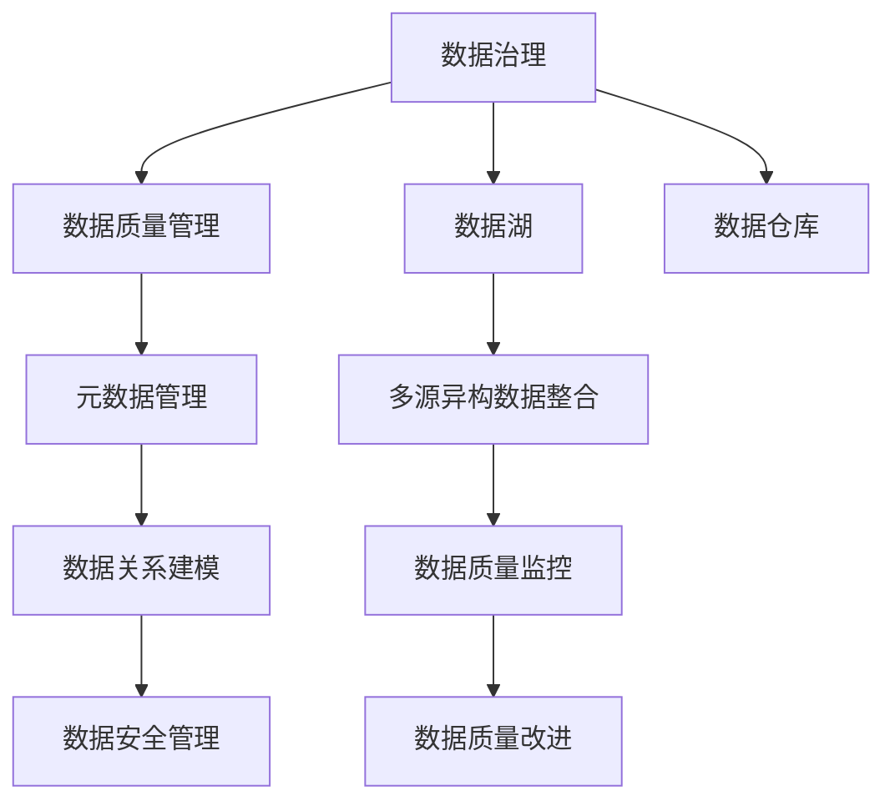

                 

# AI创业公司的数据治理策略优化

## 1. 背景介绍

在人工智能（AI）迅猛发展的今天，数据已经成为AI系统的核心资产。无论是深度学习模型的训练、推荐系统的构建，还是自然语言处理的落地，高质量的数据都是不可或缺的基础。对于AI创业公司而言，如何在数据获取、存储、治理等方面制定有效的策略，直接关系到公司的技术创新和市场竞争力。本文将深入探讨AI创业公司数据治理的策略优化，从数据质量、数据管理、数据治理工具等多个维度提供实用的指导。

### 1.1 问题由来

随着AI技术的普及和应用，越来越多的企业意识到数据的重要性。然而，高质量数据的获取和治理仍然是一个巨大的挑战。传统的数据治理策略往往集中在大型企业内部，对于中小企业和创业公司来说，如何高效地获取、存储和管理数据，常常显得力不从心。尤其在AI创业公司，数据治理的问题更加复杂，既有数据多样性、分布性带来的挑战，又有技术团队不足、预算有限等现实问题。本文旨在为AI创业公司提供一套系统化、可操作的数据治理策略，帮助其在数据管理上实现突破。

### 1.2 问题核心关键点

AI创业公司数据治理的核心问题包括：

- 如何高效获取并整合多源异构数据。
- 如何保证数据的质量和一致性，避免数据偏见和错误。
- 如何实现数据的自动化管理和生命周期管理，减少人工干预。
- 如何利用先进的数据治理工具，提升数据管理效率和可操作性。

这些问题的解决，不仅有助于提高数据治理的效率，还能确保数据的安全性和可靠性，为公司的AI产品构建坚实的数据基础。

## 2. 核心概念与联系

### 2.1 核心概念概述

为更好地理解AI创业公司数据治理的策略优化，本节将介绍几个密切相关的核心概念：

- **数据治理(Data Governance)**：一套流程、方法和工具，用于确保数据的准确性、完整性、一致性和安全性。涵盖数据的采集、清洗、存储、共享、管理和审计等多个环节。

- **数据质量管理(Data Quality Management)**：监控、评估和改进数据质量的过程。通过识别数据问题、制定改进策略，确保数据的可用性和可靠性。

- **数据湖(Data Lake)**：一个集中存储各种数据格式的系统，支持数据的批量处理和实时分析。适合处理大规模、异构数据。

- **数据仓库(Data Warehouse)**：存储、管理和查询历史数据的系统，用于支持数据报表、分析和业务智能。

- **元数据(Metadata)**：描述数据的数据，包括数据来源、格式、关系等信息。元数据管理对于理解和管理数据至关重要。

这些核心概念之间的逻辑关系可以通过以下Mermaid流程图来展示：



这个流程图展示了大数据治理的核心概念及其之间的关系：

1. 数据治理是整个数据管理的核心，涵盖数据质量、数据湖、数据仓库等多个环节。
2. 数据质量管理是数据治理的重要组成部分，监控和改进数据质量，确保数据的可靠性。
3. 数据湖用于存储和处理大规模异构数据，支持多样化的数据查询和分析。
4. 数据仓库专注于历史数据的存储和管理，支持复杂的数据报表和分析需求。
5. 元数据管理描述了数据的来源、格式、关系等信息，是数据治理的重要工具。

这些概念共同构成了数据治理的全面框架，帮助公司在数据管理上实现全面、高效的管理。

## 3. 核心算法原理 & 具体操作步骤
### 3.1 算法原理概述

AI创业公司的数据治理策略优化，本质上是通过一系列流程、方法和工具，确保数据的质量、安全性和一致性，同时提升数据管理的效率。其核心算法原理包括：

- **数据质量评估**：使用统计分析、机器学习等技术，评估数据的质量和一致性，识别数据问题和改进方向。
- **数据清洗与预处理**：根据评估结果，对数据进行清洗和预处理，如去重、填补缺失值、转换数据格式等，确保数据的完整性和准确性。
- **数据标准化与转换**：对异构数据进行标准化和转换，如将不同的数据格式转换为统一的格式，方便后续分析和使用。
- **数据治理工具集成**：使用先进的数据治理工具，如ETL工具、数据管理平台、数据可视化工具等，提升数据管理的自动化程度和效率。

### 3.2 算法步骤详解

AI创业公司的数据治理策略优化，一般包括以下几个关键步骤：

**Step 1: 数据质量评估**

- 收集数据样本，使用统计分析和机器学习算法，评估数据的完整性、准确性、一致性和时效性。
- 识别数据中的异常值、重复记录、错误标签等问题。
- 制定数据质量指标，如数据完整率、准确率、一致性等，作为后续治理的标准。

**Step 2: 数据清洗与预处理**

- 对识别出的数据问题，进行去重、填补缺失值、转换数据格式等清洗和预处理操作。
- 使用数据清洗工具，如Apache Nifi、Talend等，自动化执行清洗流程。
- 定义清洗规则，如时间戳不一致、字段格式不统一等，确保清洗后的数据符合预期。

**Step 3: 数据标准化与转换**

- 对清洗后的数据进行标准化处理，如统一字段名、数据格式转换等。
- 引入数据转换工具，如Apache Beam、Presto等，自动化执行数据转换操作。
- 制定数据标准，确保数据的一致性和规范性。

**Step 4: 数据治理工具集成**

- 选择合适的数据治理工具，如Informatica、IBM InfoSphere等。
- 配置数据源、清洗规则、转换规则等，建立数据治理工作流。
- 定期监控数据治理工作流，确保数据管理的自动化和高效性。

### 3.3 算法优缺点

AI创业公司的数据治理策略优化，具有以下优点：

1. **提高数据质量**：通过严格的数据质量评估和清洗，确保数据的一致性和准确性，提升数据的可靠性。
2. **提升数据管理效率**：使用自动化工具，减少人工干预，提高数据管理的效率和可操作性。
3. **保障数据安全**：通过数据治理工具的集成，加强数据访问控制和隐私保护，保障数据的安全性。

同时，该方法也存在一定的局限性：

1. **依赖数据质量评估**：数据质量评估的准确性直接影响治理策略的效果，需要投入大量时间和资源进行评估。
2. **工具集成复杂**：选择合适的数据治理工具并集成到现有系统中，需要技术团队的专业知识和经验。
3. **预算和资源限制**：数据治理需要投入一定的预算和资源，对于中小型创业公司来说，可能面临资金和技术上的限制。

尽管存在这些局限性，但就目前而言，数据治理策略优化仍是AI创业公司获取高质量数据的重要手段。未来相关研究的重点在于如何进一步降低数据治理的复杂度和成本，提高数据治理的自动化程度。

### 3.4 算法应用领域

AI创业公司的数据治理策略优化，已经在金融、电商、医疗等多个行业得到了广泛的应用，提升了数据管理的规范性和高效性。

- **金融行业**：使用数据治理策略优化，帮助银行和金融机构管理大量的交易数据，确保数据的准确性和完整性，提升风险控制和业务分析能力。
- **电商行业**：通过数据治理策略优化，电商平台能够更好地管理用户行为数据，提升推荐系统的精准度和用户体验。
- **医疗行业**：在医疗数据治理中，数据治理策略优化帮助医院和诊所管理电子病历和医疗影像数据，提升医疗质量和科研能力。

除了这些典型应用外，数据治理策略优化还在智能制造、智慧城市、智慧农业等诸多领域得到了应用，为各行各业的数据管理带来了新的思路和方法。

## 4. 数学模型和公式 & 详细讲解 & 举例说明

### 4.1 数学模型构建

本节将使用数学语言对AI创业公司数据治理策略优化的核心算法进行更加严格的刻画。

假设数据集为 $D=\{(x_i, y_i)\}_{i=1}^N$，其中 $x_i$ 为输入特征，$y_i$ 为标签。

**数据质量评估模型**：
- **完整性评估**：评估数据记录的完整性，定义完整性指标为 $Q_{complete} = \frac{count}{total}$，其中 $count$ 为非空记录数，$total$ 为总记录数。
- **准确性评估**：评估数据记录的准确性，定义准确性指标为 $Q_{accuracy} = \frac{\sum_{i=1}^N I(x_i = y_i)}{N}$，其中 $I(\cdot)$ 为示性函数，$x_i = y_i$ 为1，否则为0。
- **一致性评估**：评估数据记录的一致性，定义一致性指标为 $Q_{consistency} = \frac{\sum_{i=1}^N \sum_{j=i+1}^N I(x_i = x_j, y_i = y_j)}{\sum_{i=1}^N \sum_{j=i+1}^N 1}$。

**数据清洗与预处理模型**：
- **去重**：通过统计函数识别重复记录，定义去重率 $R_{dedup} = \frac{\text{去重后的记录数}}{总记录数}$。
- **填补缺失值**：定义填补缺失值的方法，如均值填补、插值填补等，定义填补效果 $Q_{fill} = \frac{\text{填补后的完整记录数}}{\text{原记录数}}$。
- **转换数据格式**：定义数据转换规则，如将日期格式转换为统一的标准格式，定义转换成功率 $Q_{convert} = \frac{\text{转换成功的记录数}}{总记录数}$。

### 4.2 公式推导过程

以下我们以数据质量评估为例，推导完整性、准确性和一致性评估的公式及其计算方法。

**完整性评估**：
- 假设数据集中共有 $N$ 条记录，其中有 $count$ 条非空记录。
- 定义完整性指标为 $Q_{complete} = \frac{count}{N}$。
- 完整性评估的计算公式为：

$$
Q_{complete} = \frac{\sum_{i=1}^N I(x_i \neq \emptyset)}{N}
$$

**准确性评估**：
- 假设数据集中有 $N$ 条记录，其中 $k$ 条记录的 $x_i = y_i$。
- 定义准确性指标为 $Q_{accuracy} = \frac{k}{N}$。
- 准确性评估的计算公式为：

$$
Q_{accuracy} = \frac{\sum_{i=1}^N I(x_i = y_i)}{N}
$$

**一致性评估**：
- 假设数据集中有 $N$ 条记录，其中 $k$ 条记录的 $x_i = x_j, y_i = y_j$。
- 定义一致性指标为 $Q_{consistency} = \frac{k}{\binom{N}{2}}$。
- 一致性评估的计算公式为：

$$
Q_{consistency} = \frac{\sum_{i=1}^N \sum_{j=i+1}^N I(x_i = x_j, y_i = y_j)}{\binom{N}{2}}
$$

这些公式展示了数据质量评估的基本计算方法，通过统计分析能够准确评估数据的质量和一致性。

### 4.3 案例分析与讲解

以一家电商平台的订单数据为例，展示数据治理策略优化的应用过程。

假设电商平台每天有 $10,000$ 条订单数据，其中 $5,000$ 条记录完整，$2,000$ 条记录准确无误，$1,500$ 条记录字段格式统一。

**完整性评估**：
- 完整性指标为 $Q_{complete} = \frac{5,000}{10,000} = 0.5$。
- 数据完整性较好，但有 $5,000$ 条记录需要清洗。

**准确性评估**：
- 准确性指标为 $Q_{accuracy} = \frac{2,000}{10,000} = 0.2$。
- 订单数据的准确性需要提升，需要进一步清洗和预处理。

**一致性评估**：
- 一致性指标为 $Q_{consistency} = \frac{1,500}{\binom{10,000}{2}} = 0.0375$。
- 数据的一致性较好，但有 $1,500$ 条记录需要标准化和转换。

通过数据质量评估，电商平台能够明确数据的当前状况和改进方向，制定具体的清洗和预处理策略。

## 5. 项目实践：代码实例和详细解释说明
### 5.1 开发环境搭建

在进行数据治理策略优化实践前，我们需要准备好开发环境。以下是使用Python进行Pandas开发的环境配置流程：

1. 安装Anaconda：从官网下载并安装Anaconda，用于创建独立的Python环境。

2. 创建并激活虚拟环境：
```bash
conda create -n py-env python=3.8 
conda activate py-env
```

3. 安装Pandas：
```bash
conda install pandas
```

4. 安装其他相关库：
```bash
conda install numpy matplotlib jupyter notebook ipython
```

完成上述步骤后，即可在`py-env`环境中开始数据治理策略优化实践。

### 5.2 源代码详细实现

我们以一个简单的订单数据清洗和预处理为例，展示数据治理策略优化的Python代码实现。

```python
import pandas as pd
import numpy as np

# 读取订单数据
orders = pd.read_csv('orders.csv')

# 数据质量评估
orders['complete'] = orders['order_id'].notna().astype(int)
orders['accuracy'] = (orders['order_id'] == orders['payment_id']).astype(int)

# 数据清洗与预处理
orders = orders.drop_duplicates('order_id')
orders = orders.fillna(method='ffill')
orders['order_date'] = pd.to_datetime(orders['order_date'], format='%Y-%m-%d')
orders = orders.dropna(subset=['order_date'])

# 数据标准化与转换
orders['amount'] = orders['amount'].astype(float)
orders['total'] = orders['amount'] * orders['quantity']
orders['item_price'] = orders['amount'] / orders['quantity']
```

上述代码实现了订单数据的读取、质量评估、清洗与预处理、标准化和转换。可以看到，通过Pandas库的强大功能，数据治理策略优化变得相对简单和高效。

### 5.3 代码解读与分析

让我们再详细解读一下关键代码的实现细节：

**数据质量评估**：
- 使用Pandas的`notna()`方法评估订单数据的完整性，并定义为`complete`列。
- 使用Pandas的`==`运算符评估订单数据的准确性，并定义为`accuracy`列。

**数据清洗与预处理**：
- 使用`drop_duplicates()`方法去除重复记录。
- 使用`fillna()`方法填补缺失值，这里使用前向填充方法`ffill`。
- 使用`to_datetime()`方法将日期字段转换为标准格式。
- 使用`dropna()`方法去除缺失值。

**数据标准化与转换**：
- 使用`astype()`方法将金额字段转换为浮点数类型。
- 使用公式计算总金额、单价等新字段。

可以看到，通过Pandas库，数据治理策略优化中的数据清洗、预处理、标准化和转换等操作变得简便易行。结合其他数据治理工具，如ETL工具、数据管理平台等，能够实现更高效、自动化、可操作的数据治理。

## 6. 实际应用场景
### 6.1 电商行业

电商平台的订单数据治理，是数据治理策略优化的典型应用场景。通过数据治理策略优化，电商平台能够高效地管理大量的订单数据，确保数据的准确性和完整性，提升推荐系统的精准度和用户体验。

### 6.2 金融行业

金融行业的交易数据治理，同样是数据治理策略优化的重要应用领域。通过数据治理策略优化，银行和金融机构能够管理大量的交易数据，确保数据的可靠性和安全性，提升风险控制和业务分析能力。

### 6.3 医疗行业

医疗数据治理策略优化，可以帮助医院和诊所管理电子病历和医疗影像数据，提升医疗质量和科研能力。通过数据治理策略优化，医疗数据的管理和分析变得更加高效和规范。

### 6.4 未来应用展望

未来，数据治理策略优化将在更多行业得到应用，为各行各业的数据管理带来新的思路和方法。

在智慧制造、智慧城市、智慧农业等领域，数据治理策略优化将帮助企业实现更高效、更智能的数据管理，提升生产效率和业务决策能力。

## 7. 工具和资源推荐
### 7.1 学习资源推荐

为了帮助开发者系统掌握数据治理策略优化的理论基础和实践技巧，这里推荐一些优质的学习资源：

1. **《数据治理实战》**：介绍数据治理的核心概念、方法论和最佳实践，适合入门和进阶学习。

2. **Kaggle**：提供丰富的数据集和数据治理挑战，通过实践提升数据治理的能力。

3. **Databricks**：提供数据治理的学习资源和实践工具，包括数据质量评估、数据清洗、数据可视化等。

4. **Informatica**：数据治理工具厂商，提供丰富的学习资源和文档，帮助理解数据治理的工具和流程。

5. **IBM Data Governance**：IBM的数据治理解决方案，提供案例研究和实践指南，适合理解数据治理的实际应用。

通过对这些资源的学习实践，相信你一定能够快速掌握数据治理策略优化的精髓，并用于解决实际的数据管理问题。

### 7.2 开发工具推荐

高效的数据治理策略优化离不开优秀的工具支持。以下是几款用于数据治理策略优化开发的常用工具：

1. **Apache Nifi**：数据流管理工具，支持数据清洗、数据转换等操作，适用于大规模数据治理。

2. **Apache Beam**：数据处理框架，支持分布式数据处理和数据转换，适合复杂的数据治理任务。

3. **Talend**：开源数据集成工具，支持数据清洗、数据转换等操作，适用于中规模数据治理。

4. **Informatica**：商业数据治理工具，支持丰富的数据治理功能，适合大型企业的数据治理需求。

5. **IBM InfoSphere**：数据治理工具，支持数据质量评估、数据清洗、数据标准化等操作，适合复杂数据治理需求。

合理利用这些工具，可以显著提升数据治理策略优化的效率和可操作性。

### 7.3 相关论文推荐

数据治理策略优化的发展源于学界的持续研究。以下是几篇奠基性的相关论文，推荐阅读：

1. **《数据治理框架：概念、技术和管理》**：介绍数据治理的基本概念、技术和管理方法，适合入门和理解。

2. **《数据质量评估和改进的机器学习方法》**：提出使用机器学习算法评估和改进数据质量的方法，适合提升数据治理的效果。

3. **《基于大数据的数据治理策略》**：讨论在大数据环境下，数据治理的策略和工具，适合理解数据治理的最新趋势。

4. **《数据治理工具的整合与应用》**：介绍多种数据治理工具的整合方法和实际应用，适合理解数据治理的实施细节。

这些论文代表了大数据治理的发展脉络。通过学习这些前沿成果，可以帮助研究者把握数据治理的未来方向，激发更多的创新灵感。

## 8. 总结：未来发展趋势与挑战
### 8.1 总结

本文对AI创业公司的数据治理策略优化进行了全面系统的介绍。首先阐述了数据治理的重要性，明确了数据质量、数据管理、数据治理工具等多个维度的关键问题。其次，从算法原理到具体操作步骤，详细讲解了数据质量评估、数据清洗与预处理、数据标准化与转换等核心算法，给出了数据治理策略优化的完整代码实例。同时，本文还广泛探讨了数据治理在电商、金融、医疗等行业的实际应用场景，展示了数据治理策略优化的巨大潜力。

通过本文的系统梳理，可以看到，数据治理策略优化对于AI创业公司而言，不仅是一种提升数据管理效率的方法，更是一种增强数据安全性和可靠性的手段。未来，伴随数据治理技术的不断演进，数据管理必将迎来新的突破，为AI创业公司带来更广阔的创新空间。

### 8.2 未来发展趋势

展望未来，数据治理策略优化将呈现以下几个发展趋势：

1. **自动化和智能化**：未来的数据治理将更多地依赖自动化工具和机器学习算法，减少人工干预，提升数据治理的效率和准确性。

2. **多源异构数据融合**：随着数据来源的多样性增加，数据治理需要更好地融合多源异构数据，确保数据的完整性和一致性。

3. **数据治理平台集成**：未来的数据治理将更多地依赖数据治理平台，通过平台化的管理，提升数据治理的可操作性和易用性。

4. **数据质量实时监控**：未来的数据治理需要实时监控数据质量，及时发现和解决数据问题，确保数据的实时可用性。

5. **数据治理与AI结合**：未来的数据治理将更多地结合AI技术，如自动数据清洗、数据标注等，提升数据治理的智能化水平。

这些趋势展示了数据治理技术的未来发展方向，有望进一步提升数据治理的效率和可靠性，为AI创业公司带来更优质的数据资源。

### 8.3 面临的挑战

尽管数据治理策略优化已经取得了显著进展，但在迈向更加智能化、自动化应用的过程中，仍面临诸多挑战：

1. **数据源多样性和异构性**：不同数据源的数据格式、编码方式、数据质量等差异，增加了数据治理的复杂性。

2. **数据质量评估的准确性**：数据质量评估需要大量的时间和技术投入，评估结果的准确性直接影响数据治理的效果。

3. **数据治理工具的复杂性**：选择合适的数据治理工具并进行集成，需要技术团队的专业知识和经验，对中小型创业公司来说可能存在一定的门槛。

4. **数据安全与隐私保护**：数据治理过程中需要考虑数据的隐私保护和安全问题，避免数据泄露和滥用。

5. **数据治理的成本与效率**：数据治理需要投入一定的成本和资源，如何在成本和效率之间找到平衡，是一个重要的问题。

尽管存在这些挑战，但通过持续的研究和实践，数据治理策略优化仍然是大数据管理的重要手段。未来，随着技术的不断进步和实践经验的积累，数据治理将变得更加高效、智能和可靠。

### 8.4 研究展望

面对数据治理所面临的挑战，未来的研究需要在以下几个方面寻求新的突破：

1. **数据治理的自动化和智能化**：开发更加自动化和智能化的数据治理工具，减少人工干预，提升数据治理的效率和准确性。

2. **数据治理的跨源融合**：研究多源异构数据的融合方法，确保数据的完整性和一致性。

3. **数据治理平台的设计与实现**：设计并实现统一的数据治理平台，提升数据治理的可操作性和易用性。

4. **实时数据监控与预警**：开发实时数据监控和预警系统，及时发现和解决数据问题，确保数据的实时可用性。

5. **数据治理与AI技术的结合**：研究数据治理与AI技术的结合方法，提升数据治理的智能化水平。

这些研究方向将进一步推动数据治理技术的演进，为AI创业公司带来更高效、可靠的数据管理能力。总之，数据治理策略优化是一个持续发展的过程，需要各方力量的共同努力，才能实现数据的全面、高效、智能管理。

## 9. 附录：常见问题与解答

**Q1：数据治理策略优化对AI创业公司有何意义？**

A: 数据治理策略优化对于AI创业公司而言，可以显著提升数据管理的效率和可靠性，确保数据的准确性和一致性。这对于提升AI产品的性能和用户满意度，以及应对复杂多变的数据管理挑战，都具有重要意义。

**Q2：数据治理策略优化的核心算法有哪些？**

A: 数据治理策略优化的核心算法包括数据质量评估、数据清洗与预处理、数据标准化与转换等。这些算法通过统计分析、机器学习等技术，实现数据的完整性、准确性、一致性和标准化，确保数据的高质量和可用性。

**Q3：数据治理策略优化在实际应用中需要注意哪些问题？**

A: 数据治理策略优化在实际应用中需要注意数据源的多样性和异构性、数据质量评估的准确性、数据治理工具的复杂性、数据安全与隐私保护等问题。这些问题需要在设计和实施过程中全面考虑，才能确保数据治理的效果和可靠性。

**Q4：数据治理工具有哪些？**

A: 常用的数据治理工具包括Apache Nifi、Apache Beam、Talend、Informatica、IBM InfoSphere等。这些工具提供丰富的数据治理功能，如数据清洗、数据转换、数据质量评估等，能够帮助企业高效地管理数据。

**Q5：数据治理的自动化和智能化如何实现？**

A: 数据治理的自动化和智能化可以通过引入机器学习算法、数据治理平台等手段实现。使用机器学习算法对数据进行自动化清洗和预处理，使用数据治理平台实现统一管理和监控，提升数据治理的效率和可靠性。

这些问题的解答展示了数据治理策略优化的重要性和实施细节，帮助读者更好地理解和使用数据治理策略优化技术。

---

作者：禅与计算机程序设计艺术 / Zen and the Art of Computer Programming

