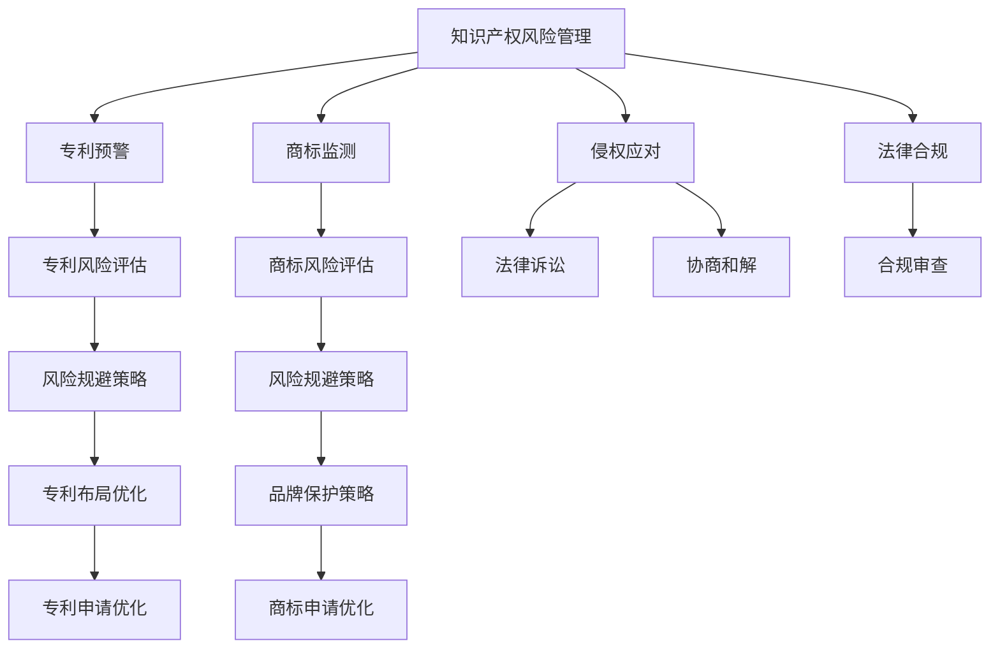

                 

# AI创业公司的知识产权风险防范措施：专利预警、商标监测与侵权应对

> 关键词：知识产权风险管理, 专利预警, 商标监测, 侵权应对, AI创业公司, 法律合规

## 1. 背景介绍

随着人工智能技术的飞速发展，AI创业公司如雨后春笋般涌现。然而，在这个充满机遇的时代，知识产权风险问题也变得愈发严峻。众多企业在激烈的竞争中，不仅面临着技术创新的挑战，还要时刻防范专利侵权、商标抢注等知识产权风险。本文将系统梳理AI创业公司在知识产权风险防范中的专利预警、商标监测与侵权应对策略，为初创企业提供实用的指导。

## 2. 核心概念与联系

### 2.1 核心概念概述

1. **知识产权**：涉及专利、商标、版权、商业秘密等多个领域，保护发明创新、品牌标识等，具有重要的商业价值。
2. **专利预警**：利用大数据和AI技术，对即将到期或进入法律程序的重要专利进行监测，及时发现风险点。
3. **商标监测**：通过AI技术对商标申请、注册、使用情况进行监控，及时发现侵权和抢注行为。
4. **侵权应对**：在发现知识产权侵权行为后，采取法律诉讼、协商和解等手段，维护自身合法权益。
5. **法律合规**：确保企业在技术研发、产品销售等各个环节中，遵守相关法律法规，避免法律风险。

这些概念之间的逻辑关系可以通过以下Mermaid流程图来展示：



这个流程图展示了几者之间的联系：

1. 知识产权风险管理是整个体系的核心，通过预警、监测和应对策略，确保企业法律合规。
2. 专利预警和商标监测作为具体策略，通过风险评估和技术手段识别潜在的法律风险。
3. 专利侵权应对和商标侵权应对是解决风险的手段，法律诉讼和协商和解则是解决手段的具体方式。
4. 法律合规是企业运营的基石，通过合规审查确保各个环节的法律合规性。

## 3. 核心算法原理 & 具体操作步骤
### 3.1 算法原理概述

AI创业公司在知识产权风险防范中，核心算法原理主要包括数据挖掘、自然语言处理（NLP）和机器学习等技术。

1. **数据挖掘**：从专利数据库、商标数据库、公开的司法判决等海量数据中，挖掘出有价值的信息，为预警和监测提供数据基础。
2. **自然语言处理（NLP）**：对文本数据进行分类、情感分析、实体识别等处理，用于商标监测中的品牌标识识别和专利预警中的技术创新点提取。
3. **机器学习**：利用监督学习、非监督学习等算法，构建预测模型，如风险评估模型、专利布局优化模型等，提升预警和监测的准确性和效率。

### 3.2 算法步骤详解

以专利预警为例，主要算法步骤如下：

1. **数据收集**：从专利数据库、公开文献、行业报告等渠道，收集相关专利数据。
2. **数据清洗**：去除冗余数据、异常值，保证数据的质量。
3. **特征提取**：通过NLP技术提取专利的标题、摘要、引用情况等特征。
4. **风险评估**：构建机器学习模型，对专利的到期时间、技术创新性、权利稳定性等因素进行评估。
5. **预警通知**：根据评估结果，及时通知企业相关的风险信息，建议采取应对措施。

### 3.3 算法优缺点

**专利预警**的优点包括：

- **提前预警**：能够在专利到期前或进入诉讼前，提前发现风险点，减少损失。
- **精准性高**：利用机器学习模型，风险评估结果较为准确，误报率低。

**专利预警**的缺点包括：

- **数据获取难度大**：需要获取专利数据库的访问权限，数据获取过程繁琐。
- **技术门槛高**：涉及复杂的数据处理和机器学习技术，对企业技术团队的要求较高。

**商标监测**的优点包括：

- **实时监控**：通过自然语言处理技术，实时监控商标的使用情况，及时发现侵权和抢注行为。
- **自动化高效**：利用AI技术，可以24小时不间断地进行商标监测，大大提升监测效率。

**商标监测**的缺点包括：

- **商标复杂性**：不同国家和地区的商标法律规定不同，需要处理多种商标规则。
- **语言多样性**：需要处理多种语言，增加监测难度。

**侵权应对**的优点包括：

- **法律资源丰富**：通过法律诉讼和协商和解，能够充分利用法律资源，有效维护自身权益。
- **灵活性强**：可以结合具体情况，采取灵活的应对策略，如和解、调解、仲裁等。

**侵权应对**的缺点包括：

- **成本高**：法律诉讼和协商和解通常需要较高成本。
- **时间成本高**：从发现侵权到最终解决，可能需要较长时间。

### 3.4 算法应用领域

这些算法和策略在AI创业公司的各个应用领域都有广泛应用，例如：

- **研发部门**：在研发过程中，利用专利预警提前发现潜在风险，避免侵权。
- **产品部门**：在产品发布前，通过商标监测确认品牌标识，避免商标侵权。
- **市场营销部门**：通过法律合规审查，确保广告和推广活动合法合规。
- **客户服务部门**：在处理客户投诉时，通过知识产权风险管理，维护企业声誉。

## 4. 数学模型和公式 & 详细讲解 & 举例说明

### 4.1 数学模型构建

以专利风险评估为例，构建的风险评估模型通常包括以下特征：

- 专利到期时间 $T$
- 引用次数 $C$
- 技术创新性 $I$
- 权利稳定性 $S$

假设模型为线性回归模型，风险评估函数为：

$$
R = \beta_0 + \beta_1T + \beta_2C + \beta_3I + \beta_4S
$$

其中 $\beta_0, \beta_1, \beta_2, \beta_3, \beta_4$ 为模型系数。

### 4.2 公式推导过程

风险评估模型的训练和预测过程如下：

1. **数据准备**：收集历史专利数据，将特征和风险值 $R$ 进行标注。
2. **模型训练**：使用监督学习算法（如线性回归、随机森林等）训练模型。
3. **模型评估**：使用测试集验证模型的预测准确性。
4. **风险预测**：对新收集的专利数据，进行风险评估预测。

### 4.3 案例分析与讲解

假设某AI创业公司开发了一种新型算法，在研发过程中，通过专利预警系统监测发现，其核心技术点与某知名公司的专利相似度较高，存在潜在侵权风险。公司迅速采取措施，一方面提交专利申请，另一方面联系对方公司进行协商，最终达成合作协议。

## 5. 项目实践：代码实例和详细解释说明

### 5.1 开发环境搭建

**环境要求**：

- Python 3.7及以上
- 安装Pandas、Scikit-learn、TensorFlow等库

**环境搭建**：

1. 安装Python及其依赖库：
```bash
pip install pandas scikit-learn tensorflow
```

2. 搭建虚拟环境：
```bash
python3 -m venv venv
source venv/bin/activate
```

### 5.2 源代码详细实现

以下是一个简单的专利预警系统的Python代码实现：

```python
import pandas as pd
from sklearn.linear_model import LinearRegression
from sklearn.model_selection import train_test_split

# 数据加载
data = pd.read_csv('patent_data.csv')

# 特征提取
features = ['T', 'C', 'I', 'S']
X = data[features]
y = data['R']

# 模型训练
X_train, X_test, y_train, y_test = train_test_split(X, y, test_size=0.2)
model = LinearRegression()
model.fit(X_train, y_train)

# 模型评估
train_score = model.score(X_train, y_train)
test_score = model.score(X_test, y_test)
print('Train Score:', train_score)
print('Test Score:', test_score)

# 风险预测
new_data = pd.DataFrame({'T': [2, 3, 4], 'C': [10, 20, 30], 'I': [0.8, 0.9, 0.7], 'S': [0.95, 0.8, 0.85]})
new_data['R'] = model.predict(new_data)
print(new_data)
```

### 5.3 代码解读与分析

上述代码实现了一个简单的专利风险评估模型，包含以下步骤：

1. **数据加载**：从CSV文件中加载专利数据。
2. **特征提取**：提取专利的到期时间、引用次数、技术创新性和权利稳定性等特征。
3. **模型训练**：使用线性回归模型进行训练。
4. **模型评估**：计算训练集和测试集上的评分。
5. **风险预测**：对新专利数据进行风险评估预测。

## 6. 实际应用场景

### 6.1 研发阶段

在研发阶段，通过专利预警系统，AI创业公司可以实时监测潜在的侵权风险。例如，某公司开发了一种新型AI算法，通过预警系统发现该算法核心技术点与某知名公司的专利相似度较高，立即采取措施，提交专利申请，并联系对方公司协商，避免侵权风险。

### 6.2 产品上市

在产品上市前，通过商标监测系统，AI创业公司可以确认品牌标识是否存在侵权风险。例如，某公司推出一款新产品，通过监测系统发现其品牌标识与某知名品牌相近，立即修改标识，避免商标侵权风险。

### 6.3 市场营销

在市场营销阶段，通过法律合规审查，AI创业公司可以确保广告和推广活动合法合规。例如，某公司发布新广告，通过合规审查系统确认广告内容不涉及侵权，确保广告合法。

### 6.4 未来应用展望

随着AI技术的进一步发展，知识产权风险防范将变得更加智能化和自动化。未来，可以通过增强学习算法优化风险评估模型，利用自然语言处理技术提升商标监测的精确性，利用区块链技术实现知识产权保护的透明化。AI创业公司将能够更高效、更准确地识别和防范知识产权风险。

## 7. 工具和资源推荐

### 7.1 学习资源推荐

1. **《专利法》《商标法》官方解读**：国家知识产权局官方网站，提供最新法律解读和案例分析。
2. **专利预警系统教程**：中国专利信息中心，提供专利预警系统操作和案例教程。
3. **商标监测系统教程**：世界知识产权组织（WIPO），提供商标监测系统操作和案例教程。
4. **法律合规审查指南**：各大律师事务所，提供企业法律合规审查指南。

### 7.2 开发工具推荐

1. **Google Colab**：提供免费的GPU资源，方便进行大规模数据处理和模型训练。
2. **Jupyter Notebook**：提供强大的交互式编程环境，方便代码调试和展示。
3. **Visual Studio Code**：提供丰富的插件，方便开发工具和数据处理。

### 7.3 相关论文推荐

1. **《AI创业公司知识产权风险防范的专利预警策略》**：学术期刊论文，提供专利预警算法和实践案例。
2. **《AI创业公司知识产权风险防范的商标监测技术》**：学术期刊论文，提供商标监测算法和实践案例。
3. **《AI创业公司知识产权风险防范的侵权应对策略》**：学术期刊论文，提供侵权应对法律和实践策略。

## 8. 总结：未来发展趋势与挑战

### 8.1 研究成果总结

本文系统总结了AI创业公司在知识产权风险防范中的专利预警、商标监测与侵权应对策略。通过数据挖掘、自然语言处理和机器学习等技术，构建了基于模型的风险评估和监测系统，帮助企业及时发现和应对知识产权风险，维护企业合法权益。

### 8.2 未来发展趋势

未来，知识产权风险防范将向着智能化、自动化、透明化方向发展。

1. **智能化**：利用AI技术，构建更加智能化的风险预警和监测系统，实现更高效的风险识别和防范。
2. **自动化**：通过自动化流程，简化风险评估和应对步骤，提高企业运营效率。
3. **透明化**：利用区块链技术，实现知识产权保护的透明化和可追溯性，增强企业信任度。

### 8.3 面临的挑战

尽管知识产权风险防范技术不断进步，但仍面临以下挑战：

1. **数据隐私**：在数据收集和处理过程中，需要保护用户隐私和数据安全。
2. **算法偏见**：机器学习算法可能存在偏见，需要进一步优化算法和数据，确保公平性。
3. **跨文化差异**：不同国家和地区的商标法律和专利法律存在差异，需要进行跨文化差异处理。
4. **法律复杂性**：知识产权法律复杂，需要企业具备专业的法律知识和团队。

### 8.4 研究展望

未来，知识产权风险防范的研究将进一步深入，主要方向包括：

1. **跨领域集成**：将专利、商标、版权等多领域风险管理集成，形成统一的风险管理平台。
2. **多模态融合**：利用图像、视频等多模态数据，提升风险评估和监测的准确性。
3. **法律知识图谱**：构建法律知识图谱，方便快速查找和理解相关法律规定。
4. **持续学习**：利用增强学习算法，使系统能够持续学习，及时适应法律和市场变化。

## 9. 附录：常见问题与解答

**Q1: 专利预警系统如何构建？**

A: 专利预警系统的构建主要包括以下步骤：

1. **数据收集**：从专利数据库、公开文献等渠道，收集相关专利数据。
2. **数据清洗**：去除冗余数据、异常值，保证数据的质量。
3. **特征提取**：通过NLP技术提取专利的标题、摘要、引用情况等特征。
4. **风险评估模型构建**：使用监督学习算法（如线性回归、随机森林等）构建风险评估模型。
5. **模型训练和评估**：使用历史专利数据进行模型训练，并在测试集上进行评估。
6. **风险预测**：对新专利数据，进行风险评估预测，并及时通知企业。

**Q2: 商标监测系统如何构建？**

A: 商标监测系统的构建主要包括以下步骤：

1. **数据收集**：从商标数据库、公开的商标使用情况等渠道，收集相关商标数据。
2. **数据清洗**：去除冗余数据、异常值，保证数据的质量。
3. **特征提取**：通过NLP技术提取商标的使用情况、品牌标识等特征。
4. **风险评估模型构建**：使用监督学习算法（如分类算法）构建风险评估模型。
5. **模型训练和评估**：使用历史商标数据进行模型训练，并在测试集上进行评估。
6. **风险预测**：对新商标数据，进行风险评估预测，并及时通知企业。

**Q3: 如何应对专利侵权？**

A: 专利侵权应对主要包括以下步骤：

1. **侵权证据收集**：收集对方专利、技术公开情况等证据。
2. **法律咨询**：咨询专业律师，评估侵权风险。
3. **法律诉讼或和解**：根据具体情况，采取法律诉讼或和解等方式，维护自身合法权益。

**Q4: 如何应对商标侵权？**

A: 商标侵权应对主要包括以下步骤：

1. **侵权证据收集**：收集对方商标使用情况、品牌标识等证据。
2. **法律咨询**：咨询专业律师，评估侵权风险。
3. **法律诉讼或和解**：根据具体情况，采取法律诉讼或和解等方式，维护自身合法权益。

---

作者：禅与计算机程序设计艺术 / Zen and the Art of Computer Programming

