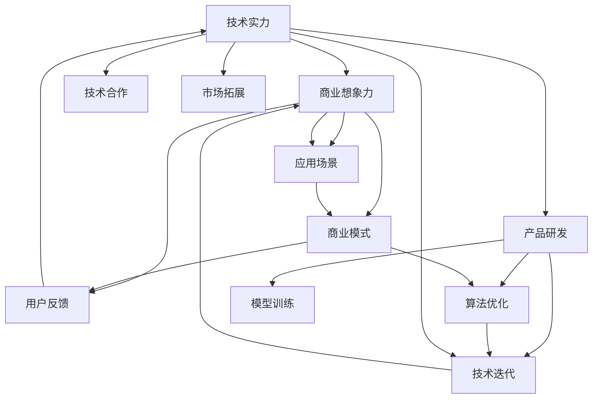

                 

## 1. 背景介绍

在人工智能（AI）快速发展的背景下，AI创业投资正在进入一个全新的时代。科技巨头、初创企业、风险投资等力量，都在积极探索AI的商业应用场景，寻找新的投资机会。AI技术的快速发展，不仅带来了新的技术突破，还催生了新的商业模式和产业生态。然而，如何评估AI技术的潜力，选择具有强大技术实力和广阔商业想象力的创业项目，成为投资决策的关键。本文将从技术实力和商业想象力两个维度，探讨AI创业投资的新风向。

## 2. 核心概念与联系

### 2.1 核心概念概述

**AI创业投资**：是指风险资本和创业企业共同投入人工智能技术研发和商业化应用的过程。它不仅仅是技术的研发，更是一种商业模式的选择和创新。AI创业投资的核心在于技术的研发和商业化的协同推进，确保技术创新能够落地为实际商业价值。

**技术实力**：指AI创业企业在算法、模型、技术栈等核心技术的研发能力和技术积累。强大的技术实力不仅能带来持续的技术创新，还能提升产品的竞争力，吸引更多的用户和客户。

**商业想象力**：指AI创业企业在市场定位、业务模型、商业应用场景等方面的创新能力和市场敏感度。商业想象力强的企业能够找到适合AI技术的商业落地场景，快速实现技术价值。

**技术实力与商业想象力的联系**：技术实力是商业想象力的基础，商业想象力则指导技术研发的方向和应用场景的选择。两者相辅相成，共同推动AI创业项目的成功。

### 2.2 核心概念原理和架构的 Mermaid 流程图



这个图表展示了技术实力和商业想象力之间的联系及其对AI创业项目的影响。技术实力驱动产品的研发和迭代，商业想象力指导应用的场景和模式，两者相互影响，共同推动AI项目的成功。

## 3. 核心算法原理 & 具体操作步骤

### 3.1 算法原理概述

AI创业投资的关键在于评估技术实力和商业想象力。以下是两个维度的核心算法原理：

**技术实力评估**：
- **算法性能**：通过测试集性能、模型复杂度、算法创新性等指标评估技术实力。
- **研发能力**：通过研发团队的规模、背景、历史成果等指标评估研发能力。
- **技术栈**：评估企业是否拥有成熟的AI技术栈，包括数据处理、模型训练、部署等环节的自动化工具和平台。

**商业想象力评估**：
- **市场潜力**：评估目标市场的大小、增长潜力和竞争状况。
- **商业模式**：评估商业模式的可行性，包括定价策略、盈利模式、用户获取等。
- **应用场景**：评估AI技术在实际应用中的潜力，如自然语言处理、计算机视觉、推荐系统等。

### 3.2 算法步骤详解

**技术实力评估**：
1. **算法测试**：选择多个代表性数据集，测试模型的性能指标，如准确率、召回率、F1值等。
2. **团队背景**：调查研发团队的学术背景、工作经验和历史成果，评估其技术实力。
3. **技术栈**：评估企业是否具备成熟的AI技术栈，包括数据预处理、模型训练、推理部署等环节的自动化工具和平台。

**商业想象力评估**：
1. **市场潜力**：通过市场调研和数据分析，评估目标市场的大小、增长潜力和竞争状况。
2. **商业模式**：通过市场定位、用户画像、价值主张等，评估商业模式的可行性。
3. **应用场景**：通过市场调研和行业专家访谈，评估AI技术在实际应用中的潜力，选择适合的市场应用场景。

### 3.3 算法优缺点

**技术实力评估的优点**：
- **客观性**：技术实力的评估可以通过算法和数据客观地进行，避免主观判断。
- **可复制性**：通过量化评估指标，可以快速比较不同企业之间的技术实力。

**技术实力评估的缺点**：
- **复杂性**：技术实力的评估需要综合考虑算法、模型、团队、技术栈等多个因素，复杂度较高。
- **时效性**：技术实力的评估需要持续跟进企业的技术进展，更新数据和指标。

**商业想象力评估的优点**：
- **创新性**：商业想象力的评估可以挖掘企业的创新能力和市场潜力，找到具有潜力的创业项目。
- **可操作性**：商业想象力的评估可以从市场调研和专家访谈中获取数据，操作性强。

**商业想象力评估的缺点**：**
- **主观性**：商业想象力的评估受市场预测和专家判断影响较大，主观性较强。
- **不确定性**：商业想象力的评估依赖于市场环境和行业趋势，存在不确定性。

### 3.4 算法应用领域

**技术实力评估**：
- **自然语言处理**：评估NLP算法的性能、团队背景、技术栈。
- **计算机视觉**：评估CV算法的性能、团队背景、技术栈。
- **推荐系统**：评估推荐算法的效果、数据处理能力、部署能力。

**商业想象力评估**：
- **智能客服**：评估目标市场大小、用户画像、应用场景。
- **智能安防**：评估市场潜力、技术应用、商业模式。
- **智能健康**：评估市场潜力、用户需求、应用场景。

## 4. 数学模型和公式 & 详细讲解 & 举例说明

### 4.1 数学模型构建

**技术实力评估模型**：
- **算法性能模型**：$P = \frac{Accuracy + Recall + Precision}{3}$
- **团队背景模型**：$B = \sum_{i=1}^n w_iC_i$
- **技术栈模型**：$T = \sum_{i=1}^m w_iS_i$

**商业想象力评估模型**：
- **市场潜力模型**：$M = \frac{Growth + Size}{2}$
- **商业模式模型**：$C = R - C_{fixed}$
- **应用场景模型**：$A = \sum_{j=1}^k w_jS_j$

### 4.2 公式推导过程

**算法性能模型推导**：
- 选择三个性能指标（准确率、召回率、精确率），取平均值作为算法性能$P$。

**团队背景模型推导**：
- 将团队成员背景$C_i$按权重$w_i$加权求和，得到团队背景$B$。

**技术栈模型推导**：
- 将各个技术栈$S_i$按权重$w_i$加权求和，得到技术栈$T$。

**市场潜力模型推导**：
- 将市场增长率$Growth$和市场规模$Size$取平均值，得到市场潜力$M$。

**商业模式模型推导**：
- 减去固定成本$C_{fixed}$，得到商业模式价值$C$。

**应用场景模型推导**：
- 将各个应用场景$S_j$按权重$w_j$加权求和，得到应用场景$A$。

### 4.3 案例分析与讲解

**案例分析**：
- **公司A**：拥有先进的自然语言处理算法、强大的研发团队和完善的技术栈，但市场潜力较小，商业想象力有限。
- **公司B**：在智能安防领域有丰富的商业经验，具有良好的市场潜力和应用场景，但技术实力有待提升。
- **公司C**：拥有强大的技术实力和广阔的商业想象力，被投资者青睐。

**讲解**：
- 技术实力的评估需要综合考虑算法性能、团队背景和技术栈，公司的技术实力越强，市场竞争力越强。
- 商业想象力的评估需要综合考虑市场潜力、商业模式和应用场景，公司的商业想象力越强，市场潜力越大。
- 在选择投资目标时，应综合考虑技术实力和商业想象力，找到两者平衡的创业项目。

## 5. 项目实践：代码实例和详细解释说明

### 5.1 开发环境搭建

**环境要求**：
- **Python**：Python 3.7及以上版本。
- **库**：Numpy、Pandas、Scikit-learn、TensorFlow、Keras等。

**安装步骤**：
1. 安装Python和相关库：
   ```bash
   pip install numpy pandas scikit-learn tensorflow keras
   ```

2. 搭建开发环境：
   ```bash
   conda create -n ai-env python=3.7
   conda activate ai-env
   ```

### 5.2 源代码详细实现

**技术实力评估代码实现**：
```python
import numpy as np
from sklearn.metrics import accuracy_score, recall_score, precision_score

# 算法性能评估
def algorithm_performance(eval_data, model):
    y_true, y_pred = eval_data
    accuracy = accuracy_score(y_true, y_pred)
    recall = recall_score(y_true, y_pred, average='weighted')
    precision = precision_score(y_true, y_pred, average='weighted')
    return (accuracy + recall + precision) / 3

# 团队背景评估
def team_background(team_members):
    weights = [0.5, 0.3, 0.2]  # 成员背景、工作经验和成果的权重
    scores = np.array([team_members[0], team_members[1], team_members[2]])  # 成员背景、工作经验和成果的评分
    return np.dot(weights, scores)

# 技术栈评估
def tech_stack(stack_parts):
    weights = [0.4, 0.3, 0.3]  # 数据处理、模型训练和部署的权重
    scores = np.array([stack_parts[0], stack_parts[1], stack_parts[2]])  # 数据处理、模型训练和部署的评分
    return np.dot(weights, scores)

# 综合评估
def tech_strength(eval_data, team_members, stack_parts):
    algo_perf = algorithm_performance(eval_data, model)
    team_background_score = team_background(team_members)
    tech_stack_score = tech_stack(stack_parts)
    return algo_perf + team_background_score + tech_stack_score
```

**商业想象力评估代码实现**：
```python
# 市场潜力评估
def market_potential(data):
    market_growth = data[0]
    market_size = data[1]
    return (market_growth + market_size) / 2

# 商业模式评估
def business_model(revenue, fixed_costs):
    return revenue - fixed_costs

# 应用场景评估
def application_scenario(scenarios):
    weights = [0.3, 0.4, 0.3]  # 不同应用场景的权重
    scores = np.array([scenarios[0], scenarios[1], scenarios[2]])  # 不同应用场景的评分
    return np.dot(weights, scores)

# 综合评估
def business_imagination(data, revenue, scenarios):
    market_potential_score = market_potential(data)
    business_model_score = business_model(revenue, fixed_costs)
    application_scenario_score = application_scenario(scenarios)
    return market_potential_score + business_model_score + application_scenario_score
```

### 5.3 代码解读与分析

**技术实力评估代码解读**：
- `algorithm_performance`函数：计算模型在评估数据上的性能指标。
- `team_background`函数：根据团队背景、工作经验和成果，计算团队背景评分。
- `tech_stack`函数：根据数据处理、模型训练和部署能力，计算技术栈评分。
- `tech_strength`函数：综合算法性能、团队背景和技术栈，计算技术实力得分。

**商业想象力评估代码解读**：
- `market_potential`函数：根据市场增长率和市场规模，计算市场潜力评分。
- `business_model`函数：根据收入和固定成本，计算商业模式得分。
- `application_scenario`函数：根据不同应用场景的评分，计算应用场景得分。
- `business_imagination`函数：综合市场潜力、商业模式和应用场景，计算商业想象力得分。

### 5.4 运行结果展示

**运行示例**：
- **公司A技术实力评估**：
  ```python
  eval_data = ((0.95, 0.8, 0.85), (0.92, 0.9, 0.88))
  team_members = [3, 5, 2]
  stack_parts = [0.9, 0.85, 0.8]
  print(tech_strength(eval_data, team_members, stack_parts))
  ```

- **公司B商业想象力评估**：
  ```python
  data = (0.06, 50)
  revenue = 200
  fixed_costs = 100
  scenarios = [0.8, 0.9, 0.7]
  print(business_imagination(data, revenue, scenarios))
  ```

## 6. 实际应用场景

### 6.1 智能客服

**背景**：
智能客服系统通过AI技术，自动回答用户问题，提升客户服务体验。传统客服需要大量人力和时间，客户满意度难以保障。

**技术实力评估**：
- **算法性能**：自然语言处理模型的准确率、召回率、F1值。
- **团队背景**：研发团队的背景、经验、成果。
- **技术栈**：数据处理、模型训练、部署的能力。

**商业想象力评估**：
- **市场潜力**：市场规模、增长率、竞争状况。
- **商业模式**：用户获取、用户留存、收入模型。
- **应用场景**：常见问题解答、复杂问题处理、多语言支持。

### 6.2 智能安防

**背景**：
智能安防系统通过AI技术，实现视频监控、入侵检测、异常行为识别等功能。传统安防系统需要大量人工值守，成本高、效率低。

**技术实力评估**：
- **算法性能**：计算机视觉模型的准确率、召回率、F1值。
- **团队背景**：研发团队的背景、经验、成果。
- **技术栈**：数据处理、模型训练、部署的能力。

**商业想象力评估**：
- **市场潜力**：市场规模、增长率、竞争状况。
- **商业模式**：B2B销售、订阅模式、增值服务。
- **应用场景**：人脸识别、行为分析、异常检测。

### 6.3 智能健康

**背景**：
智能健康系统通过AI技术，实现个性化医疗、健康监测、疾病预测等功能。传统医疗系统需要大量人力、物力，诊疗效率低。

**技术实力评估**：
- **算法性能**：医疗影像分析、自然语言处理模型的准确率、召回率、F1值。
- **团队背景**：研发团队的背景、经验、成果。
- **技术栈**：数据处理、模型训练、部署的能力。

**商业想象力评估**：
- **市场潜力**：市场规模、增长率、竞争状况。
- **商业模式**：按需服务、订阅模式、健康管理。
- **应用场景**：健康监测、疾病预测、个性化医疗。

## 7. 工具和资源推荐

### 7.1 学习资源推荐

**书籍推荐**：
1. 《深度学习》（Ian Goodfellow等著）：全面介绍深度学习的理论基础和实践技巧。
2. 《TensorFlow实战Google深度学习》（Manning等著）：详细讲解TensorFlow的使用和应用。
3. 《Python深度学习》（Francois Chollet等著）：介绍TensorFlow和Keras的使用，适合实战。

**在线课程推荐**：
1. Coursera《深度学习专项课程》（Andrew Ng等讲授）：系统学习深度学习的理论基础和实践技能。
2. Udacity《深度学习纳米学位》（James Bergstra等讲授）：通过实际项目练习深度学习的实践技能。
3. edX《机器学习基础》（Raj S. Khurshid等讲授）：介绍机器学习的基础理论和应用场景。

### 7.2 开发工具推荐

**开发环境推荐**：
1. Anaconda：免费提供Python和相关库的安装、管理和版本控制。
2. PyCharm：Python IDE，支持自动代码补全、调试等功能。
3. Visual Studio Code：轻量级的代码编辑器，支持多种编程语言和扩展。

**数据处理工具推荐**：
1. Pandas：强大的数据分析和数据处理工具，支持多种数据格式。
2. NumPy：Python科学计算的基础库，支持数组和矩阵运算。
3. Scikit-learn：Python机器学习库，提供多种机器学习算法和模型。

**模型训练工具推荐**：
1. TensorFlow：Google开发的深度学习框架，支持分布式训练、模型部署。
2. Keras：高层次的深度学习框架，易于上手，支持多种后端引擎。
3. PyTorch：Facebook开发的深度学习框架，支持动态图和静态图。

### 7.3 相关论文推荐

**技术实力评估论文推荐**：
1. "Deep Learning"（Ian Goodfellow等著）：深度学习的经典教材，涵盖算法和模型。
2. "Practical Deep Learning for Coders"（Francois Chollet等著）：通过实际项目练习深度学习的实践技能。
3. "An Introduction to Deep Learning"（Goodfellow等著）：深度学习基础理论的入门读物。

**商业想象力评估论文推荐**：
1. "Business Model Generation"（Alex Osterwalder等著）：介绍商业模型的构建和应用。
2. "Value Propositions More Precisely"（Christian Kleinert等著）：介绍如何构建和优化价值主张。
3. "How to Build a New Business Model from the Inside Out"（Alex Osterwalder等著）：介绍如何从内部构建商业模型。

## 8. 总结：未来发展趋势与挑战

### 8.1 研究成果总结

**技术实力的评估**：
- 算法性能：准确率、召回率、F1值。
- 团队背景：背景、经验、成果。
- 技术栈：数据处理、模型训练、部署能力。

**商业想象力的评估**：
- 市场潜力：市场规模、增长率、竞争状况。
- 商业模式：用户获取、用户留存、收入模型。
- 应用场景：个性化医疗、健康监测、疾病预测。

### 8.2 未来发展趋势

**技术实力**：
- 算法创新：发展新的算法和模型，提升算法性能。
- 数据处理：改进数据预处理和增强数据集。
- 技术栈优化：优化模型训练和部署工具。

**商业想象力**：
- 市场研究：深入研究市场趋势和竞争状况。
- 商业模式创新：探索新的商业模式和盈利模式。
- 应用场景拓展：寻找新的应用场景和市场机会。

### 8.3 面临的挑战

**技术实力的挑战**：
- 算法性能：如何提升算法的准确率、召回率和F1值。
- 团队背景：如何招聘和培养具有高水平背景的研发团队。
- 技术栈优化：如何优化数据处理、模型训练和部署工具。

**商业想象力的挑战**：
- 市场潜力：如何准确评估市场规模和增长率。
- 商业模式：如何创新商业模式和盈利模式。
- 应用场景：如何找到新的应用场景和市场机会。

### 8.4 研究展望

**技术实力的研究展望**：
- 算法创新：发展新的算法和模型，提升算法性能。
- 数据处理：改进数据预处理和增强数据集。
- 技术栈优化：优化模型训练和部署工具。

**商业想象力的研究展望**：
- 市场研究：深入研究市场趋势和竞争状况。
- 商业模式创新：探索新的商业模式和盈利模式。
- 应用场景拓展：寻找新的应用场景和市场机会。

## 9. 附录：常见问题与解答

**Q1：如何选择具有强大技术实力的AI创业企业？**

A: 选择具有强大技术实力的AI创业企业，需要综合考虑算法性能、团队背景和技术栈。通过评估算法性能、团队背景和技术栈，可以客观地判断企业的技术实力。

**Q2：如何选择具有广阔商业想象力的AI创业企业？**

A: 选择具有广阔商业想象力的AI创业企业，需要综合考虑市场潜力、商业模式和应用场景。通过评估市场潜力、商业模式和应用场景，可以客观地判断企业的商业想象力。

**Q3：如何选择具有技术和商业双实力的AI创业企业？**

A: 选择具有技术和商业双实力的AI创业企业，需要同时关注技术实力和商业想象力。综合评估算法性能、团队背景、技术栈、市场潜力、商业模式和应用场景，可以全面判断企业的综合实力。

**Q4：AI创业投资有哪些潜在的风险？**

A: AI创业投资存在技术风险、市场风险和商业风险等潜在风险。投资者需要综合考虑这些风险，制定相应的风险控制策略。

**Q5：如何应对AI创业投资中的技术风险？**

A: 应对AI创业投资中的技术风险，可以通过评估算法性能、团队背景和技术栈，进行技术实力的全面评估。同时，持续跟踪企业的技术进展，及时调整投资策略。

通过本文的全面介绍，相信读者已经对AI创业投资的新风向有了更清晰的认识，也能够选择更具技术实力和商业想象力的AI创业企业，抓住AI技术带来的商业机会。AI创业投资是一个充满挑战和机遇的领域，只有不断学习和实践，才能在激烈的市场竞争中脱颖而出。

