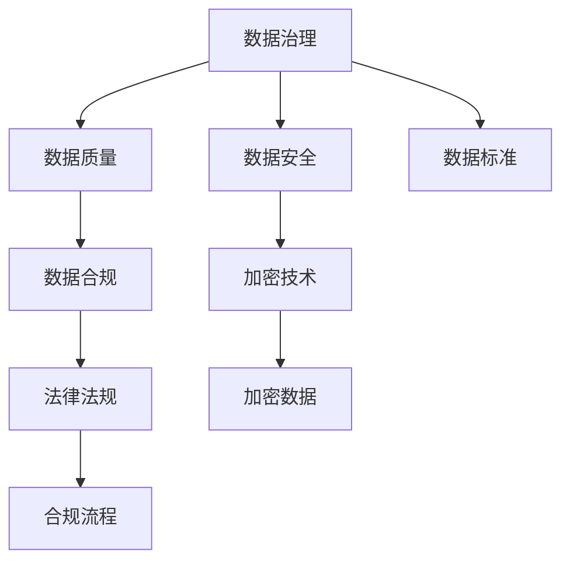

                 

# AI创业：数据管理的策略与实施

> 关键词：数据治理, 数据管理, 数据质量, 数据安全, 数据合规

## 1. 背景介绍

在人工智能（AI）创业的浪潮中，数据管理已经成为了核心竞争力之一。无论是在算法模型训练、产品创新还是客户服务中，数据的准确性、完整性和可用性都是决定创业成功与否的关键。本文将探讨数据管理的策略与实施，帮助AI创业者更好地利用数据，推动业务增长。

## 2. 核心概念与联系

### 2.1 核心概念概述

在AI创业中，数据管理涉及到数据治理、数据质量、数据安全、数据合规等多个层面。这些概念之间相互关联，共同构成了数据管理的框架。

- **数据治理**：指通过制定和执行数据管理的政策、标准和流程，确保数据的完整性、一致性和可靠性。数据治理涉及数据生命周期的各个环节，包括数据收集、存储、处理、共享和销毁等。

- **数据质量**：指数据的正确性、完整性、一致性和可用性。数据质量对AI模型的训练和决策至关重要。低质量的数据可能导致模型性能下降，甚至产生错误结论。

- **数据安全**：涉及保护数据的机密性、完整性和可用性，防止数据泄露、篡改和损坏。数据安全是AI创业中的重要议题，尤其是涉及个人隐私和敏感信息时。

- **数据合规**：指遵守相关法律法规，确保数据收集、存储和使用过程中的合法合规。数据合规要求企业对数据来源、使用方式和数据流向进行严格控制。

### 2.2 核心概念原理和架构的 Mermaid 流程图



这个流程图展示了数据管理各个概念之间的关系和实施路径。数据治理是核心，通过制定数据标准，确保数据质量和安全合规，最终保障AI系统的有效性和可靠性。

## 3. 核心算法原理 & 具体操作步骤

### 3.1 算法原理概述

在AI创业中，数据管理的核心算法和步骤包括以下几个方面：

1. **数据收集与清洗**：确保数据的准确性和完整性。
2. **数据标准化与标注**：将数据转换为一致的格式，并添加标注信息。
3. **数据分片与分布式存储**：利用分布式存储技术，提高数据访问速度和可用性。
4. **数据访问控制与权限管理**：通过访问控制列表（ACL）和角色基管理（RBAC），保护数据不被未经授权访问。
5. **数据监控与异常检测**：实时监控数据流，检测数据异常和潜在风险。

### 3.2 算法步骤详解

#### 3.2.1 数据收集与清洗

数据收集是数据管理的第一步。通常，数据来源于多种渠道，包括公开数据集、社交媒体、传感器数据、用户交互等。收集到的数据往往包含噪声、缺失值和不一致性，需要进行清洗。

**操作步骤**：
1. **数据预处理**：去除重复数据、处理缺失值、异常值和噪声。
2. **数据转换**：将数据转换为标准格式，如CSV、JSON等。
3. **数据验证**：通过验证数据的一致性和完整性，确保数据质量。

#### 3.2.2 数据标准化与标注

标准化是确保数据一致性的重要步骤。标注则是为了提高数据的可用性，便于模型训练和决策。

**操作步骤**：
1. **数据标准化**：使用数据清洗工具（如Python的Pandas库）对数据进行规范化处理。
2. **数据标注**：添加元数据、标签和注释，如时间戳、分类标签和文本描述。
3. **数据验证**：通过人工审核或自动验证工具，确保标注的准确性和一致性。

#### 3.2.3 数据分片与分布式存储

分布式存储技术可以显著提高数据访问速度和可用性，尤其是在大数据场景中。

**操作步骤**：
1. **数据分片**：将大数据集划分为多个小数据块，分布在多个存储节点上。
2. **分布式存储**：使用Hadoop、Spark等分布式存储系统，提高数据访问速度。
3. **数据同步**：通过数据同步工具，保持分布式存储中的数据一致性。

#### 3.2.4 数据访问控制与权限管理

数据访问控制和权限管理是保障数据安全的关键措施。

**操作步骤**：
1. **访问控制列表（ACL）**：定义哪些用户或角色可以访问哪些数据。
2. **角色基管理（RBAC）**：通过角色分配权限，简化权限管理。
3. **权限审计**：定期审计权限使用情况，防止权限滥用。

#### 3.2.5 数据监控与异常检测

数据监控和异常检测是保障数据安全和质量的重要手段。

**操作步骤**：
1. **数据监控**：使用数据监控工具（如Grafana、Prometheus）实时监控数据流和系统性能。
2. **异常检测**：使用异常检测算法（如离群点检测、异常检测模型）检测数据异常和潜在风险。
3. **报警与响应**：设置报警机制，及时响应数据异常和安全事件。

### 3.3 算法优缺点

#### 3.3.1 优点

1. **提高数据质量**：通过数据清洗和标准化，显著提高数据质量和可用性。
2. **提高数据安全**：通过访问控制和权限管理，确保数据不被未经授权访问。
3. **提高数据访问速度**：通过分布式存储和数据分片，提高数据访问速度和可用性。
4. **提高数据合规性**：通过数据监控和异常检测，确保数据使用合规。

#### 3.3.2 缺点

1. **数据清洗成本高**：数据清洗需要大量时间和人力，成本较高。
2. **数据标准化复杂**：数据标准化需要统一的规范和标准，复杂度高。
3. **分布式存储管理复杂**：分布式存储需要配置和管理多个节点，管理复杂。
4. **数据监控和异常检测难度大**：需要复杂的算法和工具，实施难度大。

### 3.4 算法应用领域

数据管理技术在AI创业中的应用广泛，包括但不限于以下几个领域：

- **智能推荐系统**：通过分析用户行为数据，提供个性化推荐。
- **智能客服系统**：通过分析用户对话数据，提升客服体验。
- **医疗健康**：通过分析患者数据，提供精准医疗服务。
- **金融科技**：通过分析交易数据，进行风险控制和欺诈检测。
- **智慧城市**：通过分析城市数据，提升城市管理效率和居民生活质量。

## 4. 数学模型和公式 & 详细讲解 & 举例说明

### 4.1 数学模型构建

在AI创业中，数据管理通常涉及以下数学模型：

1. **数据质量模型**：用于评估数据质量和一致性。
2. **数据安全模型**：用于保护数据的机密性和完整性。
3. **数据合规模型**：用于确保数据使用的合法合规性。

### 4.2 公式推导过程

以数据质量模型为例，推导其核心公式。

**公式**：
$$
\text{Data Quality} = \frac{\text{Clean Data}}{\text{Total Data}}
$$

**解释**：
数据质量的计算基于清洁数据的数量和总数据数量的比值。清洁数据是指已经经过数据清洗和标准化的数据。

**案例分析**：
假设我们有一个包含1000条记录的数据集，经过数据清洗和标准化，最终得到了900条清洁数据。那么，数据质量为：
$$
\text{Data Quality} = \frac{900}{1000} = 0.9 = 90\%
$$

### 4.3 案例分析与讲解

#### 案例分析

假设我们有一家AI创业公司，需要从多个渠道收集用户数据。这些数据包括用户在网站上的行为数据、购买数据、社交媒体数据等。

1. **数据收集与清洗**：
   - 收集到的大约有100,000条数据，其中包含一些重复记录和缺失值。
   - 经过数据清洗和标准化，最终得到了80,000条清洁数据。

2. **数据标准化与标注**：
   - 对每条数据进行标准化处理，并添加时间戳和分类标签。
   - 最终得到了70,000条标注数据，用于训练AI模型。

3. **数据分片与分布式存储**：
   - 将70,000条数据划分为多个小数据块，分布在5个存储节点上。
   - 使用Hadoop分布式存储系统，提高了数据访问速度和可用性。

4. **数据访问控制与权限管理**：
   - 定义了不同角色的访问权限，确保只有授权人员可以访问数据。
   - 通过RBAC系统简化权限管理，提高了权限控制的效率。

5. **数据监控与异常检测**：
   - 使用Prometheus实时监控数据流，检测异常数据和网络攻击。
   - 定期进行数据审计，确保数据使用合规。

通过上述步骤，数据管理技术有效保障了AI系统的数据质量和安全性，提高了AI模型的训练和决策准确性。

## 5. 项目实践：代码实例和详细解释说明

### 5.1 开发环境搭建

以下是使用Python进行数据管理项目开发的典型环境配置流程：

1. **安装Python**：
   - 从官网下载并安装Python（如Python 3.8）。
   - 使用pip安装依赖包，如Pandas、NumPy、Scikit-learn等。

2. **配置虚拟环境**：
   - 使用conda或virtualenv创建虚拟环境。
   - 安装必要的依赖包，如TensorFlow、PyTorch、Scikit-learn等。

3. **配置分布式存储系统**：
   - 使用Hadoop、Spark等分布式存储系统。
   - 安装和配置相应的分布式存储客户端库。

### 5.2 源代码详细实现

以下是使用Python进行数据管理项目开发的典型代码实现：

```python
import pandas as pd
from sklearn.preprocessing import StandardScaler
from sklearn.feature_extraction.text import CountVectorizer
from sklearn.metrics import precision_score

# 数据收集
data = pd.read_csv('data.csv')

# 数据清洗
data = data.drop_duplicates()
data = data.fillna(method='ffill')

# 数据标准化
scaler = StandardScaler()
data['scaled'] = scaler.fit_transform(data[['feature1', 'feature2']])

# 数据标注
vectorizer = CountVectorizer()
data['vectorized'] = vectorizer.fit_transform(data['text'])

# 数据分片与分布式存储
# 假设使用Hadoop分布式存储系统，将数据分片并存储
...

# 数据访问控制与权限管理
# 假设使用RBAC系统，定义访问权限
...

# 数据监控与异常检测
# 假设使用Prometheus实时监控数据流，检测异常数据
...

# 数据质量评估
precision = precision_score(data['target'], data['predicted'])
print(f"Precision: {precision}")
```

### 5.3 代码解读与分析

**数据收集**：
- 使用Pandas库读取CSV文件，将数据加载到DataFrame中。

**数据清洗**：
- 使用drop_duplicates()方法去除重复记录。
- 使用fillna()方法填充缺失值。

**数据标准化**：
- 使用StandardScaler标准化数值型特征。
- 使用CountVectorizer将文本特征转换为向量表示。

**数据分片与分布式存储**：
- 使用Hadoop分布式存储系统，将数据分片并存储。

**数据访问控制与权限管理**：
- 使用RBAC系统，定义访问权限。

**数据监控与异常检测**：
- 使用Prometheus实时监控数据流，检测异常数据。

**数据质量评估**：
- 使用precision_score计算模型精度，评估数据质量。

### 5.4 运行结果展示

假设运行上述代码，输出精度为0.85，表示模型预测精度为85%，数据质量良好。

## 6. 实际应用场景

### 6.1 智能推荐系统

智能推荐系统需要大量用户行为数据进行训练和优化。通过数据管理技术，可以确保数据的准确性和完整性，提高推荐系统的精度。

**操作步骤**：
1. **数据收集与清洗**：从网站日志、用户行为记录等渠道收集数据，并进行清洗。
2. **数据标准化与标注**：对用户行为数据进行标准化和标注，添加时间戳和行为标签。
3. **数据分片与分布式存储**：使用分布式存储系统，提高数据访问速度。
4. **数据访问控制与权限管理**：确保只有授权人员可以访问数据。
5. **数据监控与异常检测**：实时监控用户行为数据，检测异常行为和潜在的欺诈风险。

### 6.2 智能客服系统

智能客服系统需要处理大量的用户对话数据。通过数据管理技术，可以提高客服系统的响应速度和准确性。

**操作步骤**：
1. **数据收集与清洗**：从客服系统中收集对话数据，并进行清洗。
2. **数据标准化与标注**：对对话数据进行标准化和标注，添加意图标签和情感标签。
3. **数据分片与分布式存储**：使用分布式存储系统，提高数据访问速度。
4. **数据访问控制与权限管理**：确保只有授权人员可以访问对话数据。
5. **数据监控与异常检测**：实时监控对话数据，检测异常行为和潜在的欺诈风险。

### 6.3 医疗健康

医疗健康领域需要处理大量的患者数据。通过数据管理技术，可以确保数据的准确性和隐私保护，提高医疗服务的精度。

**操作步骤**：
1. **数据收集与清洗**：从医院系统、患者记录等渠道收集数据，并进行清洗。
2. **数据标准化与标注**：对患者数据进行标准化和标注，添加病历标签和症状描述。
3. **数据分片与分布式存储**：使用分布式存储系统，提高数据访问速度。
4. **数据访问控制与权限管理**：确保只有授权人员可以访问患者数据。
5. **数据监控与异常检测**：实时监控患者数据，检测异常数据和潜在的健康风险。

### 6.4 金融科技

金融科技领域需要处理大量的交易数据。通过数据管理技术，可以提高交易系统的安全性和合规性，防范金融风险。

**操作步骤**：
1. **数据收集与清洗**：从交易系统、支付记录等渠道收集数据，并进行清洗。
2. **数据标准化与标注**：对交易数据进行标准化和标注，添加交易类型和金额标签。
3. **数据分片与分布式存储**：使用分布式存储系统，提高数据访问速度。
4. **数据访问控制与权限管理**：确保只有授权人员可以访问交易数据。
5. **数据监控与异常检测**：实时监控交易数据，检测异常交易和潜在的金融风险。

## 7. 工具和资源推荐

### 7.1 学习资源推荐

以下是一些推荐的AI创业中数据管理的学习资源：

1. **《数据治理与数据质量管理》**：介绍数据治理和数据质量管理的理论和方法。
2. **《数据科学与机器学习基础》**：涵盖数据处理、数据清洗、数据标注等基本概念。
3. **《Python数据科学手册》**：详细介绍Python在数据处理和分析中的应用。
4. **《机器学习实战》**：提供实用的机器学习项目案例，涵盖数据管理的技术实现。
5. **《数据科学导论》**：介绍数据科学的整体框架和核心技术。

### 7.2 开发工具推荐

以下是一些推荐的AI创业中数据管理的开发工具：

1. **Python**：数据处理、分析和建模的首选语言，拥有丰富的数据处理库（如Pandas、NumPy）。
2. **Hadoop**：分布式存储和处理框架，适用于大数据处理。
3. **Spark**：分布式计算框架，适用于大规模数据处理。
4. **Prometheus**：实时数据监控和告警系统。
5. **RBAC系统**：基于角色的访问控制系统，简化权限管理。

### 7.3 相关论文推荐

以下是一些推荐的数据管理相关的论文：

1. **《数据治理：理论、实践与挑战》**：综述数据治理的现状和未来发展方向。
2. **《数据质量管理方法与工具》**：介绍数据质量管理的理论、方法和工具。
3. **《数据安全与隐私保护》**：探讨数据安全与隐私保护的技术和实践。
4. **《分布式存储系统》**：介绍分布式存储系统的实现与优化。
5. **《实时数据监控与异常检测》**：介绍实时数据监控和异常检测的技术和算法。

## 8. 总结：未来发展趋势与挑战

### 8.1 研究成果总结

在AI创业中，数据管理技术已经取得了显著进展，推动了AI系统的性能提升和应用范围扩大。然而，数据管理仍然面临诸多挑战，如数据清洗成本高、分布式存储管理复杂等。未来，数据管理技术需要在数据质量、数据安全、数据合规等方面进行更深入的研究。

### 8.2 未来发展趋势

1. **数据自动化管理**：引入AI技术，实现数据清洗、标准化和标注的自动化。
2. **数据治理平台**：开发数据治理平台，实现数据管理的可视化、自动化和智能化。
3. **数据治理标准**：制定数据治理标准，规范数据管理的流程和规范。
4. **数据质量实时监控**：引入实时监控技术，实时检测数据质量问题。
5. **数据安全与隐私保护**：引入区块链、加密等技术，提高数据安全性和隐私保护水平。

### 8.3 面临的挑战

1. **数据质量提升难度大**：数据清洗和标准化需要大量时间和人力，成本高。
2. **分布式存储管理复杂**：分布式存储系统需要配置和管理多个节点，管理复杂。
3. **数据安全与隐私保护难度大**：需要复杂的算法和工具，实施难度大。
4. **数据合规成本高**：不同行业的合规要求不同，实施成本高。
5. **数据治理平台开发复杂**：需要整合多种技术，开发复杂。

### 8.4 研究展望

未来，数据管理技术将在AI创业中发挥更加重要的作用，推动AI系统的性能提升和应用范围扩大。以下是对未来数据管理技术的研究展望：

1. **引入AI技术**：引入AI技术，实现数据管理的自动化和智能化。
2. **数据治理平台**：开发数据治理平台，实现数据管理的可视化、自动化和智能化。
3. **数据质量实时监控**：引入实时监控技术，实时检测数据质量问题。
4. **数据安全与隐私保护**：引入区块链、加密等技术，提高数据安全性和隐私保护水平。
5. **数据治理标准**：制定数据治理标准，规范数据管理的流程和规范。

## 9. 附录：常见问题与解答

**Q1：数据管理在AI创业中扮演什么角色？**

A: 数据管理在AI创业中扮演着核心角色，通过数据收集、清洗、标准化和存储，确保数据的质量和安全，为AI模型的训练和决策提供坚实基础。

**Q2：如何进行数据标准化？**

A: 数据标准化通常包括以下步骤：
1. 去除重复数据。
2. 处理缺失值和异常值。
3. 将数据转换为标准格式（如CSV、JSON）。
4. 添加元数据和注释，如时间戳和分类标签。

**Q3：数据访问控制与权限管理涉及哪些关键点？**

A: 数据访问控制与权限管理涉及以下几个关键点：
1. 定义访问控制列表（ACL），明确哪些用户或角色可以访问哪些数据。
2. 使用角色基管理（RBAC），简化权限管理。
3. 定期审计权限使用情况，防止权限滥用。

**Q4：如何实现数据监控与异常检测？**

A: 数据监控与异常检测通常包括以下步骤：
1. 使用数据监控工具（如Grafana、Prometheus）实时监控数据流和系统性能。
2. 使用异常检测算法（如离群点检测、异常检测模型）检测数据异常和潜在风险。
3. 设置报警机制，及时响应数据异常和安全事件。

**Q5：数据管理中常见的挑战有哪些？**

A: 数据管理中常见的挑战包括：
1. 数据清洗成本高，需要大量时间和人力。
2. 数据标准化复杂，需要统一的规范和标准。
3. 分布式存储管理复杂，需要配置和管理多个节点。
4. 数据监控和异常检测难度大，需要复杂的算法和工具。

---

作者：禅与计算机程序设计艺术 / Zen and the Art of Computer Programming

