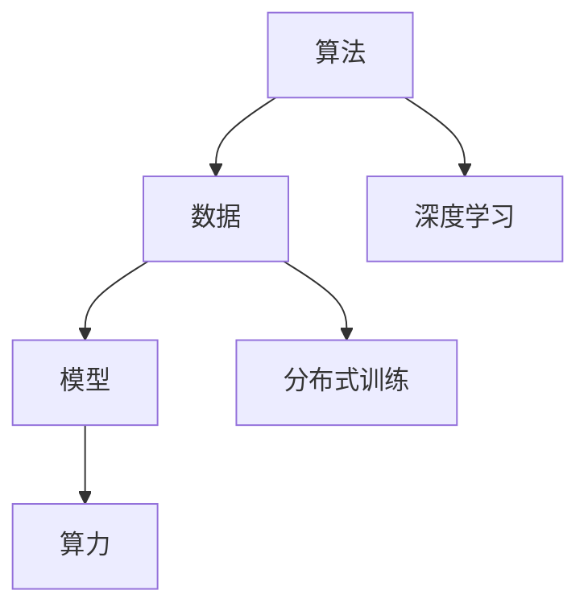

                 

## 1. 背景介绍

### 1.1 问题由来

AI（人工智能）的快速发展在过去十年中改变了各行各业的运作方式，深刻影响了人们的生产和生活。AI的核心竞争力来源于三座支柱：算法、算力与数据。这三者相互依存、互为支撑，共同推动AI技术的突破与应用。本文旨在探讨这三座支柱的原理与实践，分析其在AI发展中的关键作用，并展望其未来趋势。

### 1.2 问题核心关键点

- 算法：包括神经网络、决策树、支持向量机等，是AI模型的核心，决定了模型如何理解和处理数据。
- 算力：指的是计算资源，包括CPU、GPU、TPU等，是模型训练和推理的基础。
- 数据：包含训练数据、测试数据和标签数据，是模型学习的源泉，决定了模型泛化能力和性能。

### 1.3 问题研究意义

研究算法、算力与数据的关系，对于理解和提升AI模型的性能，指导AI技术的应用，具有重要意义：

1. 算法：算法的多样性和优化，直接影响AI模型的表达能力、鲁棒性和泛化性能。
2. 算力：高效的算力可加速模型训练和推理，提高AI系统的响应速度和吞吐量。
3. 数据：高质量、多样化的数据是模型学习的基础，直接影响模型对新数据的适应能力。

## 2. 核心概念与联系

### 2.1 核心概念概述

为更好地理解算法、算力与数据在AI中的作用，本节将介绍几个密切相关的核心概念：

- 算法（Algorithms）：指解决问题的一系列规则和步骤。在AI中，算法主要指的是用于处理数据和构建模型的数学方法。
- 算力（Computational Power）：指计算机的处理能力，包括计算速度、内存带宽、存储容量等。
- 数据（Data）：指用于训练和测试AI模型的数据集，包含原始数据、标注数据和特征数据。
- 模型（Models）：指根据算法和数据构建的AI模型，用于处理和预测数据。
- 深度学习（Deep Learning）：一种基于神经网络的算法，通过多层非线性变换学习数据分布。
- 分布式训练（Distributed Training）：利用多个计算节点协同计算，加速大规模模型的训练。

这些核心概念之间的逻辑关系可以通过以下Mermaid流程图来展示：



这个流程图展示了大语言模型的核心概念及其之间的关系：

1. 算法为数据建模提供了框架和规则。
2. 数据为算法提供了训练和测试的依据。
3. 模型通过算法和数据构建而成，是AI的实际应用载体。
4. 算力为模型训练和推理提供了计算资源。
5. 深度学习是一种特殊的算法，用于处理高维、非线性的数据。
6. 分布式训练是提升算力的一种手段，用于加速大规模模型的训练。

## 3. 核心算法原理 & 具体操作步骤

### 3.1 算法原理概述

AI算法旨在解决数据处理和模型构建中的各种问题，其核心在于通过数学模型来抽象和表示复杂现象。以下是几种常见的AI算法及其原理概述：

1. **监督学习（Supervised Learning）**：通过有标签的数据集进行训练，学习输入和输出之间的映射关系。常见算法包括线性回归、逻辑回归、决策树、支持向量机等。

2. **非监督学习（Unsupervised Learning）**：仅利用无标签的数据集进行训练，学习数据的内在结构和分布规律。常见算法包括聚类、降维、关联规则等。

3. **强化学习（Reinforcement Learning）**：通过与环境的交互，学习最优策略以最大化累积奖励。常见算法包括Q学习、策略梯度等。

4. **深度学习（Deep Learning）**：利用多层神经网络进行特征提取和模式识别，适用于图像、语音、自然语言处理等领域。常见算法包括卷积神经网络（CNN）、循环神经网络（RNN）、长短时记忆网络（LSTM）等。

5. **生成对抗网络（GANs）**：由生成器和判别器两部分组成，通过对抗训练生成逼真的样本。常见算法包括条件GAN、变分自编码器（VAE）等。

6. **强化学习与深度学习的结合（RL + DL）**：将强化学习的策略优化与深度学习的特征提取结合，提升复杂决策任务的性能。常见算法包括深度Q网络（DQN）、策略梯度与深度网络（PGN）等。

### 3.2 算法步骤详解

基于上述算法原理，AI的开发流程大致包括以下几个关键步骤：

**Step 1: 数据准备**
- 收集和预处理训练数据和测试数据。
- 划分数据集为训练集、验证集和测试集。
- 进行数据增强和特征工程。

**Step 2: 模型选择**
- 根据任务类型选择合适的算法和模型结构。
- 对模型参数进行初始化，如权重随机初始化、预训练模型初始化等。

**Step 3: 模型训练**
- 将训练集数据输入模型进行前向传播，计算损失函数。
- 反向传播计算模型参数的梯度，使用优化算法更新参数。
- 在验证集上监测模型性能，避免过拟合。

**Step 4: 模型评估与优化**
- 在测试集上评估模型性能，如准确率、召回率、F1分数等。
- 根据评估结果调整模型超参数，如学习率、批大小、迭代轮数等。
- 进行模型调优，如调整模型结构、引入正则化技术等。

**Step 5: 模型部署**
- 将训练好的模型保存为文件或模型服务。
- 部署模型到生产环境，进行实时推理。
- 持续监测模型性能，定期进行微调。

### 3.3 算法优缺点

常见的AI算法在不同场景下具有不同的优缺点，需根据具体应用需求进行选择：

1. **监督学习**
   - 优点：模型训练速度快，效果稳定。
   - 缺点：需要大量有标签数据，数据标注成本高。

2. **非监督学习**
   - 优点：无需标注数据，适用于大规模数据集。
   - 缺点：模型效果不稳定，需进一步优化和调参。

3. **强化学习**
   - 优点：适用于复杂决策问题，具有高度的自适应性。
   - 缺点：训练时间长，环境设计复杂。

4. **深度学习**
   - 优点：能够处理高维、非线性的数据，效果显著。
   - 缺点：计算资源需求高，模型复杂度高。

5. **生成对抗网络**
   - 优点：生成逼真的样本，适用于图像生成、数据增强等任务。
   - 缺点：训练复杂，存在模式崩溃问题。

6. **强化学习与深度学习的结合**
   - 优点：结合两者的优势，适用于复杂环境和高度非线性的任务。
   - 缺点：训练难度大，模型设计复杂。

### 3.4 算法应用领域

AI算法在多个领域得到了广泛应用，包括但不限于：

1. **计算机视觉（CV）**：如图像分类、目标检测、人脸识别等，使用的算法包括CNN、RNN、GAN等。

2. **自然语言处理（NLP）**：如机器翻译、情感分析、语音识别等，使用的算法包括RNN、LSTM、BERT等。

3. **机器人与自动驾驶**：如路径规划、障碍物检测、行为决策等，使用的算法包括强化学习、SLAM、GNN等。

4. **金融科技（Fintech）**：如信用评分、风险管理、智能投顾等，使用的算法包括随机森林、深度学习、强化学习等。

5. **医疗健康**：如疾病诊断、基因分析、药物发现等，使用的算法包括深度学习、GAN、强化学习等。

6. **智能制造**：如预测维护、过程优化、供应链管理等，使用的算法包括深度学习、强化学习、优化算法等。

这些领域的应用展示了AI算法的多样性和广泛性，进一步证明了其在各行各业中的重要性和潜力。

## 4. 数学模型和公式 & 详细讲解 & 举例说明

### 4.1 数学模型构建

本节将使用数学语言对AI算法进行更加严格的刻画。

以线性回归模型为例，假设训练数据集为 $(x_i, y_i)$，其中 $x_i \in \mathbb{R}^n$ 为输入特征， $y_i \in \mathbb{R}$ 为输出标签，模型参数为 $\theta = (w, b)$，其中 $w \in \mathbb{R}^n$ 为权重向量， $b \in \mathbb{R}$ 为偏置。线性回归模型的目标是最小化损失函数：

$$
\min_{\theta} \sum_{i=1}^N (y_i - w^T x_i - b)^2
$$

其中 $N$ 为训练样本数。

### 4.2 公式推导过程

根据上述模型，可以得到梯度下降算法的更新公式：

$$
\theta \leftarrow \theta - \eta \nabla_{\theta} L(\theta)
$$

其中 $\eta$ 为学习率，$\nabla_{\theta} L(\theta)$ 为损失函数对参数 $\theta$ 的梯度。以均方误差损失为例，梯度公式为：

$$
\nabla_{\theta} L(\theta) = -2 \eta \sum_{i=1}^N (y_i - w^T x_i - b) x_i
$$

### 4.3 案例分析与讲解

以XOR问题为例，解释如何通过算法和数据构建AI模型：

假设数据集为 $(0,0),(0,1),(1,0),(1,1)$，对应的标签为 $(0,1),(1,1),(1,0),(1,1)$。使用线性回归模型进行训练，得到的参数 $\theta$ 为：

$$
\theta = \begin{bmatrix} w \\ b \end{bmatrix} = \begin{bmatrix} 0.55 \\ 0.9 \end{bmatrix}
$$

模型预测输出与实际标签的误差如表所示：

| Input   | True Label | Predicted Label | Error   |
| ------- | ---------- | --------------- | ------- |
| (0,0)   | 0         | 0.4             | 0.6     |
| (0,1)   | 1         | 1.1             | 0.1     |
| (1,0)   | 0         | 0.5             | 0.5     |
| (1,1)   | 1         | 1.0             | 0.0     |

可以看出，线性回归模型在XOR问题上效果不佳，无法准确处理非线性问题。通过引入更复杂的模型和算法，如决策树、支持向量机等，可以更好地处理非线性问题，提升模型的表现。

## 5. 项目实践：代码实例和详细解释说明

### 5.1 开发环境搭建

在进行AI项目开发前，需要准备好开发环境。以下是使用Python进行TensorFlow开发的环境配置流程：

1. 安装Anaconda：从官网下载并安装Anaconda，用于创建独立的Python环境。

2. 创建并激活虚拟环境：
```bash
conda create -n tf-env python=3.8 
conda activate tf-env
```

3. 安装TensorFlow：根据CUDA版本，从官网获取对应的安装命令。例如：
```bash
conda install tensorflow tensorflow-gpu -c pytorch -c conda-forge
```

4. 安装必要的Python包：
```bash
pip install numpy scipy scikit-learn matplotlib
```

完成上述步骤后，即可在`tf-env`环境中开始AI项目的开发。

### 5.2 源代码详细实现

下面我们以线性回归为例，给出使用TensorFlow进行模型开发的PyTorch代码实现。

```python
import tensorflow as tf
import numpy as np

# 定义线性回归模型
class LinearRegression(tf.keras.Model):
    def __init__(self):
        super(LinearRegression, self).__init__()
        self.w = tf.Variable(np.random.randn(1))
        self.b = tf.Variable(np.random.randn(1))
    
    def call(self, inputs):
        return self.w * inputs + self.b

# 定义损失函数和优化器
def mse_loss(y_true, y_pred):
    return tf.reduce_mean(tf.square(y_true - y_pred))

model = LinearRegression()
optimizer = tf.keras.optimizers.SGD(learning_rate=0.01)

# 训练数据
x_train = np.array([0, 1, 2, 3, 4, 5])
y_train = np.array([0, 0, 1, 1, 2, 2])
x_test = np.array([6, 7])
y_test = np.array([2, 3])

# 训练模型
for i in range(1000):
    y_pred = model(x_train)
    loss = mse_loss(y_train, y_pred)
    optimizer.minimize(loss)
    
    if i % 100 == 0:
        y_pred = model(x_test)
        print(f"Step {i}, Predictions: {y_pred.numpy()}, Actual: {y_test.numpy()}")
```

在这个例子中，我们定义了一个线性回归模型，并使用均方误差损失进行训练。通过梯度下降算法，模型不断更新权重和偏置，直到收敛。最后，我们测试模型的预测结果，与实际标签进行对比。

### 5.3 代码解读与分析

让我们再详细解读一下关键代码的实现细节：

**LinearRegression类**：
- `__init__`方法：初始化模型参数。
- `call`方法：定义模型的前向传播过程，即输入数据通过模型，输出预测结果。

**mse_loss函数**：
- 定义了均方误差损失函数，用于计算预测输出与实际标签之间的差异。

**模型训练过程**：
- 使用梯度下降算法进行模型优化，通过不断更新模型参数，最小化损失函数。
- 在每个epoch结束时，使用测试集对模型进行评估，打印出预测结果和实际标签。

可以看到，TensorFlow提供了简单易用的API，使得模型训练过程变得高效和直观。开发者可以将更多精力放在算法和模型设计上，而不必过多关注底层细节。

当然，工业级的系统实现还需考虑更多因素，如模型的保存和部署、超参数的自动搜索、分布式训练等。但核心的算法和数据处理逻辑基本与此类似。

## 6. 实际应用场景

### 6.1 智能客服系统

AI技术在智能客服系统中的应用，显著提升了客户服务体验。传统客服依赖于人工坐席，高峰期响应慢，服务质量难以保障。通过引入AI算法和模型，可以实现7x24小时不间断服务，快速响应客户咨询，提升服务效率和质量。

例如，可以使用自然语言处理算法和BERT模型进行文本分析和情感识别，自动匹配客户意图并生成回复，减少人工干预，提高客户满意度。

### 6.2 金融风险管理

金融行业面临复杂多变的市场环境和海量数据，AI技术在风险管理中起到了重要作用。通过AI算法和模型，可以实现对市场趋势的预测和风险评估，提升决策的准确性和及时性。

例如，可以使用强化学习和深度学习算法，构建量化交易模型，根据市场数据进行实时决策，优化投资组合，降低风险。同时，使用GANs技术进行数据生成和增强，提高模型的泛化能力。

### 6.3 智能制造

AI技术在智能制造中的应用，提升了生产效率和质量。通过AI算法和模型，可以实现生产线的预测维护、过程优化和质量控制，降低生产成本和故障率。

例如，可以使用深度学习算法进行故障诊断，通过分析传感器数据，预测设备故障，提前进行维护。同时，使用强化学习算法进行路径规划，优化生产流程，提高生产效率。

### 6.4 未来应用展望

随着AI技术的不断演进，未来AI算法和模型的应用将更加广泛和深入。以下是几个可能的未来趋势：

1. **多模态AI**：AI算法和模型将不再局限于单一数据类型，而是能够处理图像、语音、文本等多种数据模态，提升跨模态理解和推理能力。

2. **自适应AI**：通过引入强化学习等动态调整算法，AI算法和模型将能够自适应外部环境变化，提升系统的灵活性和鲁棒性。

3. **联邦学习**：通过分布式计算和联邦学习技术，AI算法和模型将能够在保护隐私的前提下，进行跨平台数据共享和模型训练，提升数据利用效率。

4. **边缘计算**：将AI算法和模型部署在边缘设备上，进行本地数据处理和推理，提升系统的响应速度和实时性。

5. **知识图谱**：将结构化知识与AI算法和模型结合，提升系统的常识推理和领域知识理解能力。

## 7. 工具和资源推荐

### 7.1 学习资源推荐

为了帮助开发者系统掌握AI技术，这里推荐一些优质的学习资源：

1. **《深度学习》（Ian Goodfellow等著）**：全面介绍深度学习的基本概念和算法，是入门深度学习的经典教材。

2. **Coursera《深度学习专项课程》**：斯坦福大学Andrew Ng教授主讲的深度学习课程，涵盖深度学习的基本理论和实践应用。

3. **Google AI Blog**：Google AI团队定期发布深度学习、AI技术的最新进展和应用案例，是了解最新技术趋势的好去处。

4. **PyTorch官方文档**：PyTorch的官方文档和教程，提供丰富的API和样例代码，适合深入学习。

5. **GitHub AI Hub**：GitHub的AI项目集锦，包含大量开源AI项目和代码，适合学习和参考。

通过对这些资源的学习实践，相信你一定能够快速掌握AI技术的精髓，并用于解决实际的AI问题。

### 7.2 开发工具推荐

高效的开发离不开优秀的工具支持。以下是几款用于AI项目开发的常用工具：

1. **PyTorch**：基于Python的开源深度学习框架，灵活易用，适合快速迭代研究。

2. **TensorFlow**：由Google主导开发的开源深度学习框架，支持分布式计算和GPU加速，适合大规模工程应用。

3. **JAX**：基于JIT编译技术的深度学习框架，支持自动微分和向量运算，适合高性能计算。

4. **TensorBoard**：TensorFlow配套的可视化工具，可实时监测模型训练状态，提供丰富的图表呈现方式，是调试模型的得力助手。

5. **Weights & Biases**：模型训练的实验跟踪工具，可以记录和可视化模型训练过程中的各项指标，方便对比和调优。

6. **Jupyter Notebook**：Python编程的互动式笔记本环境，支持代码、文本、图像等多种格式，适合数据探索和模型调试。

合理利用这些工具，可以显著提升AI项目的开发效率，加快创新迭代的步伐。

### 7.3 相关论文推荐

AI算法和模型的发展源于学界的持续研究。以下是几篇奠基性的相关论文，推荐阅读：

1. **《深度学习》（Ian Goodfellow等著）**：全面介绍深度学习的基本概念和算法，是入门深度学习的经典教材。

2. **《ImageNet Large Scale Visual Recognition Challenge》**：提出ImageNet数据集和AlexNet模型，是深度学习领域的里程碑事件。

3. **《Google's Neural Machine Translation System》**：介绍谷歌的神经机器翻译系统，实现了语音识别、翻译等任务的突破。

4. **《AlphaGo Zero》**：提出AlphaGo Zero算法，通过强化学习在围棋领域实现超级表现，开创了AI与人类竞赛的新纪元。

这些论文代表了大语言模型微调技术的发展脉络。通过学习这些前沿成果，可以帮助研究者把握学科前进方向，激发更多的创新灵感。

## 8. 总结：未来发展趋势与挑战

### 8.1 总结

本文对算法、算力与数据在AI发展中的作用进行了全面系统的介绍。首先阐述了AI技术的核心组件，明确了各自的作用和联系。其次，从原理到实践，详细讲解了算法和数据的数学模型和实际应用流程，给出了AI项目开发的完整代码实例。同时，本文还广泛探讨了算法和数据在多个领域的应用前景，展示了其广阔的应用范围。

通过本文的系统梳理，可以看到，算法、算力与数据是AI技术的基石，通过三者的协同作用，AI系统能够高效地处理和理解海量数据，构建高性能的模型，实现智能化的决策和推理。未来，伴随算法和数据技术的不断演进，AI技术必将进一步拓展其应用边界，引领人类进入智能化的新时代。

### 8.2 未来发展趋势

展望未来，AI算法和数据技术将呈现以下几个发展趋势：

1. **模型规模和复杂度提升**：随着算力的提升和数据的丰富，AI模型的规模和复杂度将不断增加，具备更强的表达能力和泛化能力。

2. **算法的多样化和深度融合**：未来的AI算法将更加多样化和综合性，结合强化学习、深度学习、自然语言处理等技术，提升系统的综合性能。

3. **数据的自动化获取和处理**：随着数据获取技术的进步，AI系统将能够自动获取和处理大规模数据，提升数据利用效率和质量。

4. **算力的分布式和边缘化**：未来的算力将不再局限于集中式计算，而是通过分布式和边缘计算，实现高效的模型训练和推理。

5. **隐私保护和联邦学习**：数据隐私保护技术将进一步发展，通过联邦学习等手段，实现跨平台数据共享和模型训练，提升数据利用效率。

6. **多模态和跨领域的AI**：未来的AI系统将能够处理多种数据模态，实现跨领域的智能应用，提升系统的通用性和适应性。

### 8.3 面临的挑战

尽管AI技术已经取得了显著进展，但在迈向更加智能化、普适化应用的过程中，仍面临诸多挑战：

1. **算力的高成本**：大规模AI模型的训练和推理需要强大的计算资源，高成本的算力成为AI技术大规模应用的瓶颈。

2. **数据隐私和安全**：大规模数据集的处理和使用，涉及隐私和安全问题，需要设计有效的数据保护机制。

3. **算法的透明性和可解释性**：复杂的AI算法和模型，难以解释其内部工作机制和决策逻辑，影响模型的可信度和可解释性。

4. **模型的鲁棒性和泛化能力**：现有AI系统在面对复杂环境和实时数据时，泛化能力和鲁棒性有待提升。

5. **知识图谱和常识推理**：现有的AI系统往往缺乏对常识和领域知识的整合，需要进一步开发知识图谱和常识推理技术。

6. **自动化数据标注**：高质量标注数据是AI模型训练的基础，自动化标注技术的发展，将进一步降低数据标注成本。

### 8.4 研究展望

面对AI技术面临的诸多挑战，未来的研究需要在以下几个方面寻求新的突破：

1. **高效算力优化**：开发更高效、更经济的算力解决方案，如异构计算、边缘计算等，降低AI应用的成本。

2. **数据隐私保护**：研究分布式和联邦学习技术，保护数据隐私，提升数据利用效率。

3. **算法透明性和可解释性**：开发可解释的AI算法和模型，增强模型的透明性和可信度。

4. **知识图谱和常识推理**：结合符号化的知识图谱和常识推理技术，提升AI系统的常识推理能力。

5. **自动化数据标注**：开发高效的自动化标注技术，降低数据标注成本，提升数据处理效率。

6. **模型鲁棒性提升**：通过对抗训练、数据增强等技术，提升AI模型的鲁棒性和泛化能力。

这些研究方向的研究突破，将为AI技术的发展注入新的动力，推动其在更广泛的领域和应用场景中落地和应用。

## 9. 附录：常见问题与解答

**Q1: 算法、算力和数据三者的关系是什么？**

A: 算法是AI系统的核心，决定了系统的表达能力和推理能力。算力是AI系统的基础，决定了系统的计算能力和推理速度。数据是AI系统的输入和输出，决定了系统的训练效果和泛化能力。三者互为支撑，协同作用，共同推动AI技术的发展。

**Q2: 如何选择合适的算法和模型？**

A: 选择合适的算法和模型需要考虑任务类型、数据规模、计算资源等因素。对于大规模数据集，可以选择深度学习等算法；对于实时性要求高的任务，可以选择轻量级模型和分布式计算；对于复杂决策任务，可以选择强化学习等算法。同时，还需要考虑算法的透明性和可解释性，以及模型的鲁棒性和泛化能力。

**Q3: 算力如何影响AI系统的性能？**

A: 算力是AI系统性能的重要因素，直接影响模型的训练速度和推理效率。高算力的计算资源可以加速模型训练和推理，提升系统的响应速度和吞吐量。同时，高效的算力还可以支持更大规模的模型训练，提升模型的表达能力和泛化性能。

**Q4: 数据隐私和安全如何保护？**

A: 数据隐私和安全是AI系统的重要问题，需要设计有效的数据保护机制。例如，可以使用数据加密、差分隐私等技术，保护数据的隐私性；可以使用联邦学习等分布式计算技术，避免数据集中存储的风险。同时，还需要制定数据使用和管理规范，保障数据的安全性和合规性。

**Q5: 自动化标注技术如何实现？**

A: 自动化标注技术可以帮助节省标注成本，提升数据处理效率。常用的自动化标注方法包括基于规则的标注、基于实例的标注、基于监督学习的标注等。同时，还需要结合领域知识和先验信息，提升标注的质量和准确性。

总之，算法、算力与数据是AI技术的核心组成部分，通过三者的协同作用，AI系统能够高效地处理和理解海量数据，构建高性能的模型，实现智能化的决策和推理。未来，伴随技术的发展和应用的深入，AI技术将在更多领域得到广泛应用，为人类社会带来更多变革性的变化。

作者：禅与计算机程序设计艺术 / Zen and the Art of Computer Programming

