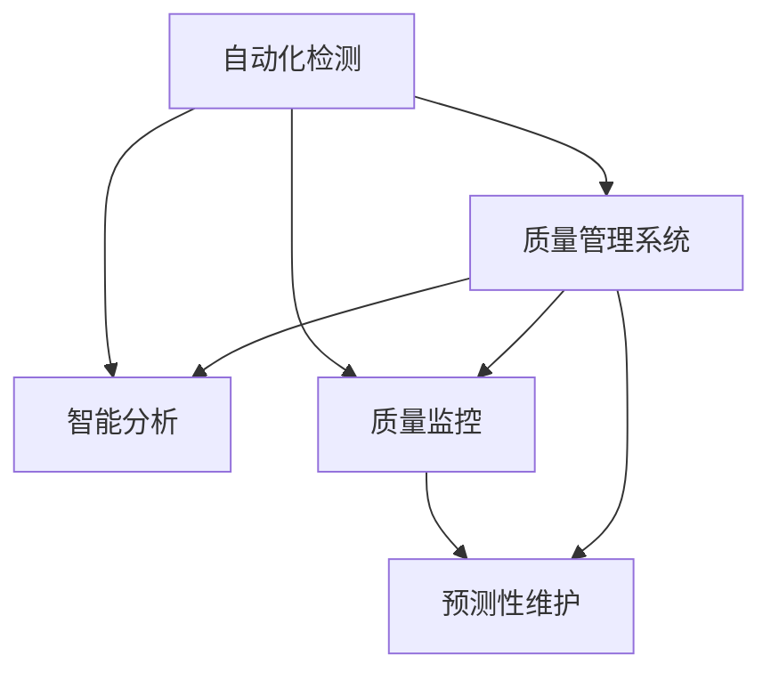

                 

# AI在产品质量控制中的作用

> 关键词：人工智能(AI), 产品质量控制, 机器学习, 深度学习, 质量控制, 缺陷检测, 生产效率, 质量管理系统, 预测性维护

## 1. 背景介绍

### 1.1 问题由来
在制造业中，产品质量控制是一个关键环节，关系到产品是否能满足客户的需求，影响着企业的市场竞争力。传统的产品质量控制主要依靠人工检测和抽样检查，但这些方法往往存在以下问题：

- **成本高**：人工检测需要大量人力投入，抽样检查也需要大量的样本。
- **效率低**：人工检测速度慢，抽样检查也无法做到全检。
- **主观性强**：人工检测和抽样检查往往受到检测人员主观因素的影响。
- **及时性差**：发现问题后无法及时反馈和调整生产过程。

面对这些问题，越来越多的企业开始探索使用人工智能(AI)技术来提升产品质量控制的效果。AI通过自动化检测、智能分析等方式，可以大幅提高检测效率和准确性，减少人力成本，实现实时监控和预测性维护。

### 1.2 问题核心关键点
AI在产品质量控制中的应用主要集中在以下几个关键点：

- **自动化检测**：使用计算机视觉和机器学习技术，实现对产品的自动化检测，减少人工检测的误判和漏判。
- **智能分析**：利用深度学习等技术，对检测结果进行智能分析和预测，提升产品缺陷的识别和分类精度。
- **质量监控**：通过实时监控生产过程，预测潜在的质量问题，及时调整生产参数，提高产品质量和生产效率。
- **预测性维护**：利用机器学习和大数据分析，预测设备故障和质量问题，实现设备的预防性维护，减少停机时间和维护成本。

### 1.3 问题研究意义
研究AI在产品质量控制中的应用，对于提升产品质量、提高生产效率、降低成本和提升企业竞争力具有重要意义：

- **提升产品质量**：AI可以实时监控和分析产品质量，提前发现和解决潜在问题，避免不合格品进入市场。
- **提高生产效率**：AI可以实现自动化检测和智能分析，减少人工干预，提升生产效率。
- **降低成本**：AI可以替代部分人工检测和抽样检查，减少人力和物力投入。
- **提升企业竞争力**：高质量的产品和服务，可以提高企业的市场竞争力，获得更多客户信任。

## 2. 核心概念与联系

### 2.1 核心概念概述

为了更好地理解AI在产品质量控制中的应用，本节将介绍几个关键概念：

- **自动化检测**：使用计算机视觉、机器学习等技术，自动检测产品的质量特征。
- **智能分析**：对自动化检测结果进行智能分析和预测，提升缺陷识别的精度和效率。
- **质量监控**：通过实时监控生产过程，预测潜在的质量问题，及时调整生产参数。
- **预测性维护**：利用机器学习和大数据分析，预测设备故障和质量问题，实现设备的预防性维护。

这些概念之间的联系可以通过以下Mermaid流程图来展示：



这个流程图展示了AI在产品质量控制中的核心概念及其之间的关系：

1. 自动化检测是基础，提供初步的产品质量数据。
2. 智能分析可以对自动化检测结果进行进一步处理，提升缺陷识别的精度。
3. 质量监控通过实时监控生产过程，预测潜在的质量问题，及时调整生产参数。
4. 预测性维护利用机器学习和大数据分析，预测设备故障和质量问题，实现设备的预防性维护。

这些概念共同构成了AI在产品质量控制中的应用框架，使得AI能够全面覆盖产品质量的各个环节，提升整体质量控制水平。

## 3. 核心算法原理 & 具体操作步骤
### 3.1 算法原理概述

AI在产品质量控制中的应用，主要基于机器学习和深度学习等技术。其核心思想是：通过数据分析和模型训练，构建出高效、准确的检测和分析模型，实现自动化检测、智能分析和质量监控。

形式化地，假设生产过程有多个质量特征 $x_1,x_2,...,x_n$，每个特征都有一个对应的检测结果 $y_1,y_2,...,y_n$。检测结果和质量特征之间的关系可以表示为一个函数 $f(x_1,x_2,...,x_n)$。通过对历史数据的分析，可以构建一个近似函数 $g(x_1,x_2,...,x_n)$，用于预测未来的检测结果。

AI在产品质量控制中的应用过程，可以概括为以下几个关键步骤：

1. **数据准备**：收集历史生产数据，标注产品质量特征和检测结果。
2. **模型训练**：使用机器学习和深度学习技术，训练出能够预测检测结果的模型。
3. **自动化检测**：利用训练好的模型，实现对新产品的自动化检测。
4. **智能分析**：对自动化检测结果进行智能分析和预测，提升缺陷识别的精度。
5. **质量监控**：实时监控生产过程，预测潜在的质量问题，及时调整生产参数。
6. **预测性维护**：利用机器学习和大数据分析，预测设备故障和质量问题，实现设备的预防性维护。

### 3.2 算法步骤详解

AI在产品质量控制中的具体应用步骤如下：

**Step 1: 数据准备**
- 收集历史生产数据，标注每个产品的质量特征和检测结果。
- 对数据进行清洗和预处理，如去除噪声、归一化等。

**Step 2: 模型训练**
- 选择适合的机器学习或深度学习模型，如线性回归、随机森林、卷积神经网络(CNN)等。
- 使用训练数据集训练模型，优化模型参数，使其能够准确预测检测结果。

**Step 3: 自动化检测**
- 将训练好的模型集成到生产流程中，实现对新产品的自动化检测。
- 对每个产品的每个质量特征进行检测，生成相应的检测结果。

**Step 4: 智能分析**
- 对自动化检测结果进行智能分析，提升缺陷识别的精度。
- 使用分类、聚类等技术，对检测结果进行分类和聚类，找出常见缺陷和异常样本。

**Step 5: 质量监控**
- 实时监控生产过程，预测潜在的质量问题。
- 使用滑动窗口等方法，对生产过程中的检测结果进行实时分析，预测可能的质量问题。

**Step 6: 预测性维护**
- 利用机器学习和大数据分析，预测设备故障和质量问题。
- 对历史数据进行分析，找出设备故障和质量问题的模式，构建预测模型。

### 3.3 算法优缺点

AI在产品质量控制中的应用，具有以下优点：

1. **高效准确**：AI可以实现自动化检测和智能分析，大幅提高检测效率和准确性。
2. **实时监控**：AI可以实时监控生产过程，及时发现和解决问题。
3. **数据驱动**：AI通过数据分析和模型训练，提升产品质量控制的科学性和可解释性。
4. **灵活适应**：AI可以根据实际情况灵活调整模型参数，适应不同的生产场景。

但AI在产品质量控制中也存在一些缺点：

1. **初始成本高**：AI在应用初期需要大量的数据和计算资源，初始成本较高。
2. **数据依赖性强**：AI的性能依赖于历史数据的质量和数量，数据不足时效果可能不佳。
3. **模型复杂度高**：AI模型通常较为复杂，需要专业的技术团队进行维护和优化。
4. **安全性和可靠性**：AI模型可能存在误判和漏判，需要结合人工干预进行校正。

### 3.4 算法应用领域

AI在产品质量控制中的应用，主要集中在以下几个领域：

- **制造业**：使用AI进行产品质量检测和控制，提升生产效率和产品质量。
- **航空航天**：利用AI进行设备故障预测和质量控制，确保安全和可靠性。
- **医疗设备**：使用AI进行医疗设备的质量检测和故障预测，提高设备精度和可靠性。
- **汽车制造**：通过AI进行零部件检测和故障预测，提升汽车制造和维护质量。
- **电子消费品**：使用AI进行产品检测和质量分析，提升电子产品的市场竞争力。

## 4. 数学模型和公式 & 详细讲解 & 举例说明

### 4.1 数学模型构建

本节将使用数学语言对AI在产品质量控制中的应用过程进行更加严格的刻画。

假设生产过程有 $n$ 个质量特征 $x_1,x_2,...,x_n$，每个特征都有一个对应的检测结果 $y_1,y_2,...,y_n$。检测结果和质量特征之间的关系可以表示为一个函数 $f(x_1,x_2,...,x_n)$。通过对历史数据的分析，可以构建一个近似函数 $g(x_1,x_2,...,x_n)$，用于预测未来的检测结果。

设训练数据集为 $D=\{(x_i,y_i)\}_{i=1}^N$，其中 $x_i=(x_{i1},x_{i2},...,x_{in})$，$y_i=(y_1,y_2,...,y_n)$。模型的训练目标是最小化预测结果和实际检测结果的误差，即：

$$
\mathcal{L}(w)=\frac{1}{N}\sum_{i=1}^N\sum_{j=1}^n (g(x_i;\theta)_j-y_i_j)^2
$$

其中 $w$ 表示模型参数，$\theta$ 表示模型权重。

### 4.2 公式推导过程

以下我们以线性回归为例，推导模型的训练过程。

设 $g(x;\theta)=\theta_1x_1+\theta_2x_2+...+\theta_nx_n+\theta_0$，则模型参数 $\theta=(\theta_1,\theta_2,...,\theta_n,\theta_0)$。

模型的损失函数为：

$$
\mathcal{L}(w)=\frac{1}{N}\sum_{i=1}^N\sum_{j=1}^n (y_i_j-\theta_1x_{i1}-\theta_2x_{i2}-...-\theta_nx_{in}-\theta_0)^2
$$

利用最小二乘法进行参数优化，对 $w$ 求偏导数并令其等于0，得到：

$$
\frac{\partial \mathcal{L}(w)}{\partial w_j}=2\frac{1}{N}\sum_{i=1}^N (y_i_j-\theta_1x_{i1}-\theta_2x_{i2}-...-\theta_nx_{in}-\theta_0)=-2\frac{1}{N}\sum_{i=1}^N (y_i_j-\theta_1x_{i1}-\theta_2x_{i2}-...-\theta_nx_{in}-\theta_0)x_{ij}
$$

解得：

$$
w_j=\frac{1}{N}\sum_{i=1}^N (y_i_j-\theta_1x_{i1}-\theta_2x_{i2}-...-\theta_nx_{in}-\theta_0)x_{ij}
$$

以上公式展示了线性回归模型的训练过程。通过不断迭代优化，可以得到最优的模型参数，用于预测新产品的质量特征和检测结果。

### 4.3 案例分析与讲解

以一家制造企业的自动化质量检测系统为例，展示AI在产品质量控制中的应用。

假设该企业生产一种电子产品，有5个关键的质量特征：尺寸、重量、性能、外观和可靠性。每个质量特征都有对应的检测结果，表示产品是否满足标准。现在使用线性回归模型对这5个质量特征进行建模，预测电子产品的总体质量。

首先，收集历史生产数据，标注每个产品的质量特征和检测结果，构建训练数据集。然后，使用线性回归模型对训练数据进行拟合，得到模型参数 $w=(\theta_1,\theta_2,...,\theta_5,\theta_0)$。最后，使用训练好的模型对新产品的质量特征进行检测，生成预测结果。

## 5. 项目实践：代码实例和详细解释说明

### 5.1 开发环境搭建

在进行质量控制系统的开发时，我们需要准备好开发环境。以下是使用Python进行TensorFlow开发的环境配置流程：

1. 安装Anaconda：从官网下载并安装Anaconda，用于创建独立的Python环境。

2. 创建并激活虚拟环境：
```bash
conda create -n tf-env python=3.8 
conda activate tf-env
```

3. 安装TensorFlow：根据CUDA版本，从官网获取对应的安装命令。例如：
```bash
conda install tensorflow==2.3 -c pytorch -c conda-forge
```

4. 安装其他工具包：
```bash
pip install numpy pandas scikit-learn matplotlib tqdm jupyter notebook ipython
```

完成上述步骤后，即可在`tf-env`环境中开始质量控制系统的开发。

### 5.2 源代码详细实现

下面以使用TensorFlow进行产品质量检测为例，给出代码实现。

首先，定义数据处理函数：

```python
import tensorflow as tf
from tensorflow.keras.preprocessing import image
import numpy as np
import os

def preprocess_image(image_path, target_size=(256, 256)):
    img = image.load_img(image_path, target_size=target_size)
    img = image.img_to_array(img)
    img = np.expand_dims(img, axis=0)
    return img

def preprocess_data(data_dir, target_size=(256, 256)):
    images = []
    labels = []
    for root, dirs, files in os.walk(data_dir):
        for file in files:
            if file.endswith('.jpg') or file.endswith('.png'):
                image_path = os.path.join(root, file)
                img = preprocess_image(image_path, target_size)
                images.append(img)
                label = root.split(os.path.sep)[-1]
                labels.append(label)
    return images, labels
```

然后，定义模型和损失函数：

```python
from tensorflow.keras.models import Sequential
from tensorflow.keras.layers import Dense, Conv2D, MaxPooling2D, Flatten

model = Sequential([
    Conv2D(32, (3, 3), activation='relu', input_shape=(256, 256, 3)),
    MaxPooling2D((2, 2)),
    Conv2D(64, (3, 3), activation='relu'),
    MaxPooling2D((2, 2)),
    Conv2D(128, (3, 3), activation='relu'),
    MaxPooling2D((2, 2)),
    Flatten(),
    Dense(256, activation='relu'),
    Dense(5, activation='softmax')
])

criterion = tf.keras.losses.CategoricalCrossentropy()

model.compile(optimizer='adam', loss=criterion, metrics=['accuracy'])
```

接着，定义训练和评估函数：

```python
from tensorflow.keras.utils import to_categorical
from sklearn.model_selection import train_test_split

def train_and_evaluate(model, train_data, train_labels, test_data, test_labels):
    model.fit(train_data, train_labels, epochs=10, validation_data=(test_data, test_labels))
    test_loss, test_acc = model.evaluate(test_data, test_labels)
    print('Test loss:', test_loss)
    print('Test accuracy:', test_acc)
```

最后，启动训练流程并在测试集上评估：

```python
train_data, test_data, train_labels, test_labels = train_test_split(images, labels, test_size=0.2, random_state=42)

train_and_evaluate(model, train_data, train_labels, test_data, test_labels)
```

以上就是使用TensorFlow进行产品质量检测的完整代码实现。可以看到，TensorFlow提供了强大的深度学习框架，可以方便地实现自动化质量检测系统。

### 5.3 代码解读与分析

让我们再详细解读一下关键代码的实现细节：

**preprocess_image函数**：
- 将输入的图像文件加载到TensorFlow中，并对其进行预处理，包括裁剪、归一化等操作。

**preprocess_data函数**：
- 遍历数据目录，将所有的图像文件和标签进行整理，生成一个图像和标签的列表。
- 使用to_categorical函数将标签进行独热编码，便于模型训练。

**model定义**：
- 定义了一个简单的卷积神经网络模型，包括多个卷积层、池化层和全连接层。
- 最后一层使用softmax激活函数，用于多分类问题。

**train_and_evaluate函数**：
- 将数据集划分为训练集和测试集，使用训练集对模型进行训练。
- 在测试集上对模型进行评估，输出测试集上的损失和精度。

**训练流程**：
- 将数据集划分为训练集和测试集，定义模型和损失函数。
- 使用训练集对模型进行训练，并在测试集上评估模型效果。
- 输出测试集上的损失和精度，展示模型的性能。

可以看到，TensorFlow框架为开发者提供了便捷的深度学习实现方式，大大降低了模型开发和训练的难度。

## 6. 实际应用场景
### 6.1 智能制造系统

智能制造系统通过自动化检测和智能分析，可以实现对产品的实时监控和预测性维护，提升生产效率和产品质量。

具体而言，可以采用工业相机和视觉识别技术，对产品进行自动检测，发现表面的划痕、缺陷等。利用深度学习模型，对检测结果进行智能分析，提升缺陷识别的精度。实时监控生产过程，预测可能的质量问题，及时调整生产参数，提高产品质量和生产效率。

### 6.2 医疗设备检测

医疗设备检测对于保证医疗质量和患者安全至关重要。使用AI进行设备检测，可以大幅提高检测精度和效率，减少人为误判。

具体而言，可以采用X射线、CT等医学影像数据，对医疗设备进行自动检测。利用深度学习模型，对影像数据进行分析和识别，发现设备故障和异常现象。实时监控医疗设备的运行状态，预测潜在的质量问题，及时进行维护和修复，确保设备的安全和可靠。

### 6.3 电子消费品质量控制

电子消费品的质量控制涉及到多种复杂工艺，传统的人工检测方法效率低、成本高。AI技术可以大幅提升电子产品的检测效率和质量控制水平。

具体而言，可以采用X光机、CT等技术，对电子产品进行自动检测。利用深度学习模型，对检测结果进行智能分析，提升缺陷识别的精度。实时监控生产过程，预测潜在的质量问题，及时调整生产参数，提高产品质量和生产效率。

### 6.4 未来应用展望

随着AI技术的不断发展，基于AI的产品质量控制将得到更广泛的应用。未来，AI在产品质量控制中的应用将呈现以下几个趋势：

1. **智能检测和分析**：使用深度学习和大数据分析技术，实现更高效的自动化检测和智能分析。
2. **实时监控和预测**：通过实时监控生产过程，预测潜在的质量问题，及时调整生产参数，提高产品质量和生产效率。
3. **设备预测性维护**：利用机器学习和大数据分析，预测设备故障和质量问题，实现设备的预防性维护，减少停机时间和维护成本。
4. **多模态融合**：结合视觉、听觉、触觉等多模态信息，提升产品质量控制的全面性和准确性。
5. **实时反馈和优化**：利用AI技术，对生产过程进行实时反馈和优化，提高生产效率和产品质量。

以上趋势展示了AI在产品质量控制中的巨大潜力，未来必将在更多领域得到广泛应用，提升产品质量控制水平。

## 7. 工具和资源推荐
### 7.1 学习资源推荐

为了帮助开发者系统掌握AI在产品质量控制中的应用，这里推荐一些优质的学习资源：

1. 《深度学习基础》系列博文：由知名深度学习专家撰写，系统介绍了深度学习的基础知识和经典模型。
2. Coursera《深度学习专项课程》：斯坦福大学开设的深度学习课程，涵盖了深度学习的基础和应用。
3. Udacity《深度学习工程师》纳米学位：涵盖深度学习的理论、实践和项目，适合深入学习和实践。
4. arXiv.org：访问最新的深度学习论文和研究成果，了解前沿技术进展。
5. TensorFlow官方文档：提供了TensorFlow框架的详细使用手册和示例代码。

通过对这些资源的学习实践，相信你一定能够掌握AI在产品质量控制中的核心技术和应用方法，实现高效、可靠的质量控制。

### 7.2 开发工具推荐

高效的开发离不开优秀的工具支持。以下是几款用于AI质量控制开发的常用工具：

1. TensorFlow：由Google主导开发的深度学习框架，提供了丰富的模型和算法库，适合大规模工程应用。
2. PyTorch：由Facebook主导开发的深度学习框架，灵活高效，适合研究和实验。
3. OpenCV：计算机视觉库，提供了大量的图像处理和分析工具，适合视觉检测应用。
4. Scikit-learn：Python的机器学习库，提供了丰富的机器学习算法和模型，适合数据预处理和特征工程。
5. Jupyter Notebook：交互式笔记本环境，方便进行数据探索和模型调试。

合理利用这些工具，可以显著提升AI质量控制系统的开发效率，加快创新迭代的步伐。

### 7.3 相关论文推荐

AI在产品质量控制中的应用源于学界的持续研究。以下是几篇奠基性的相关论文，推荐阅读：

1. Rethinking the Inception Architecture for Computer Vision（即Inception论文）：提出了Inception模块，提升了卷积神经网络的深度和宽度。
2. ImageNet Classification with Deep Convolutional Neural Networks：利用ImageNet数据集训练卷积神经网络，取得了很好的图像分类效果。
3. TensorFlow for Deep Learning（TensorFlow官方论文）：详细介绍了TensorFlow框架的设计和实现，展示了深度学习在实际应用中的广泛应用。
4. An Introduction to Statistical Learning（统计学习入门）：介绍了机器学习的基本概念和常用算法，适合初学者入门。
5. Towards AI-Enhanced Quality Control：讨论了AI在质量控制中的应用和挑战，提出了解决方案。

这些论文代表了大质量控制技术的进展和未来发展方向。通过学习这些前沿成果，可以帮助研究者把握学科前进方向，激发更多的创新灵感。

## 8. 总结：未来发展趋势与挑战

### 8.1 总结

本文对AI在产品质量控制中的应用进行了全面系统的介绍。首先阐述了AI在产品质量控制中的研究背景和意义，明确了自动化检测、智能分析和质量监控等关键技术的核心作用。其次，从原理到实践，详细讲解了AI质量控制的数学模型和关键步骤，给出了实际应用中的代码实例。同时，本文还广泛探讨了AI在智能制造、医疗设备、电子消费品等多个领域的应用前景，展示了AI质量控制的巨大潜力。此外，本文精选了学习资源、开发工具和相关论文，力求为读者提供全方位的技术指引。

通过本文的系统梳理，可以看到，AI在产品质量控制中的应用正在逐步成为制造业质量管理的重要手段。AI通过自动化检测、智能分析和实时监控，提升了质量控制的科学性和可靠性，减少了人工干预和误判，大大降低了质量控制的成本和时间。未来，伴随AI技术的不断进步，基于AI的质量控制必将在更多领域得到应用，为制造业带来变革性影响。

### 8.2 未来发展趋势

展望未来，AI在产品质量控制中的应用将呈现以下几个发展趋势：

1. **智能化升级**：利用深度学习和大数据技术，实现更高效的自动化检测和智能分析。
2. **实时监控和预测**：通过实时监控生产过程，预测潜在的质量问题，及时调整生产参数，提高产品质量和生产效率。
3. **设备预测性维护**：利用机器学习和大数据分析，预测设备故障和质量问题，实现设备的预防性维护，减少停机时间和维护成本。
4. **多模态融合**：结合视觉、听觉、触觉等多模态信息，提升产品质量控制的全面性和准确性。
5. **实时反馈和优化**：利用AI技术，对生产过程进行实时反馈和优化，提高生产效率和产品质量。

以上趋势展示了AI在产品质量控制中的巨大潜力，未来必将在更多领域得到广泛应用，提升产品质量控制水平。

### 8.3 面临的挑战

尽管AI在产品质量控制中的应用已经取得了瞩目成就，但在迈向更加智能化、普适化应用的过程中，它仍面临着诸多挑战：

1. **数据依赖性强**：AI的性能依赖于历史数据的质量和数量，数据不足时效果可能不佳。
2. **模型复杂度高**：AI模型通常较为复杂，需要专业的技术团队进行维护和优化。
3. **安全性和可靠性**：AI模型可能存在误判和漏判，需要结合人工干预进行校正。
4. **实时性和稳定性**：AI系统需要高实时性和稳定性，才能在实际应用中发挥作用。
5. **成本和资源**：AI在应用初期需要大量的计算资源和数据，初始成本较高。

### 8.4 研究展望

面对AI在产品质量控制中面临的挑战，未来的研究需要在以下几个方面寻求新的突破：

1. **数据增强和迁移学习**：探索无监督和半监督微调方法，最大利用数据资源，提升模型性能。
2. **参数高效和计算高效**：开发更加参数高效和计算高效的微调方法，提升模型效率和可扩展性。
3. **多模态融合和协同建模**：结合视觉、听觉、触觉等多模态信息，提升产品质量控制的全面性和准确性。
4. **实时性和稳定性**：优化实时处理和稳定性的技术，确保AI系统在实际应用中的可靠性和实时性。
5. **成本和资源优化**：探索低成本和高效率的数据采集和预处理方法，降低AI系统的初始成本。

这些研究方向将推动AI质量控制技术的发展，提升产品质量控制水平，实现智能制造和智慧生产。

## 9. 附录：常见问题与解答

**Q1：AI在产品质量控制中的优势是什么？**

A: AI在产品质量控制中的优势主要体现在以下几个方面：

1. **高效准确**：AI可以实现自动化检测和智能分析，大幅提高检测效率和准确性。
2. **实时监控**：AI可以实时监控生产过程，及时发现和解决问题。
3. **数据驱动**：AI通过数据分析和模型训练，提升产品质量控制的科学性和可解释性。
4. **灵活适应**：AI可以根据实际情况灵活调整模型参数，适应不同的生产场景。

**Q2：如何选择合适的AI质量控制模型？**

A: 选择合适的AI质量控制模型需要考虑以下几个因素：

1. **数据特征**：根据生产过程中数据的特点，选择适合的模型，如卷积神经网络、线性回归、支持向量机等。
2. **任务类型**：根据具体的质量控制任务类型，选择适合的模型，如分类、聚类、回归等。
3. **模型复杂度**：根据模型的复杂度和训练成本，选择合适的模型，权衡模型性能和资源消耗。
4. **实时性要求**：根据实时性要求，选择适合的模型，如卷积神经网络、深度神经网络等。

**Q3：AI在产品质量控制中的初始成本如何？**

A: AI在产品质量控制中的初始成本主要包括以下几个方面：

1. **数据准备**：收集和标注历史生产数据需要大量人力和时间，初始成本较高。
2. **模型训练**：训练深度学习模型需要高性能计算设备和大量计算资源，初始成本较高。
3. **模型部署**：将训练好的模型部署到生产环境中，需要相应的硬件和软件支持，初始成本较高。

**Q4：AI在产品质量控制中如何解决过拟合问题？**

A: 在AI质量控制中，过拟合问题可以通过以下几个方法解决：

1. **数据增强**：通过数据增强技术，扩充训练集，减少过拟合。
2. **正则化**：使用L2正则、Dropout等方法，限制模型复杂度，减少过拟合。
3. **模型集成**：通过集成多个模型，综合提升模型的泛化能力，减少过拟合。
4. **提前停止**：在模型训练过程中，实时监控验证集上的性能，一旦性能不再提升，即停止训练，避免过拟合。

**Q5：AI在产品质量控制中的应用前景如何？**

A: AI在产品质量控制中的应用前景非常广阔，主要体现在以下几个方面：

1. **智能化升级**：利用深度学习和大数据技术，实现更高效的自动化检测和智能分析。
2. **实时监控和预测**：通过实时监控生产过程，预测潜在的质量问题，及时调整生产参数，提高产品质量和生产效率。
3. **设备预测性维护**：利用机器学习和大数据分析，预测设备故障和质量问题，实现设备的预防性维护，减少停机时间和维护成本。
4. **多模态融合**：结合视觉、听觉、触觉等多模态信息，提升产品质量控制的全面性和准确性。
5. **实时反馈和优化**：利用AI技术，对生产过程进行实时反馈和优化，提高生产效率和产品质量。

以上趋势展示了AI在产品质量控制中的巨大潜力，未来必将在更多领域得到广泛应用，提升产品质量控制水平。

---

作者：禅与计算机程序设计艺术 / Zen and the Art of Computer Programming

