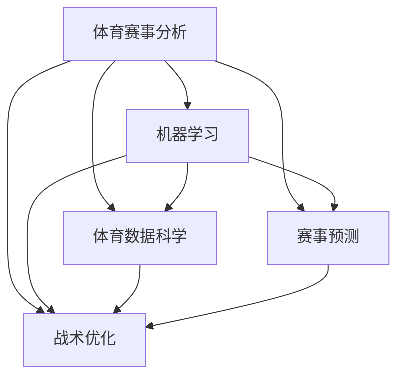

                 

# AI在体育赛事分析中的应用：战术优化

> 关键词：体育赛事分析, 机器学习, 体育数据科学, 赛事预测, 战术优化, 数据分析, 体育人工智能

## 1. 背景介绍

体育赛事的战术优化是提升球队竞技水平和比赛胜率的关键。随着大数据、人工智能技术的发展，利用AI进行体育赛事分析已成为新趋势。通过机器学习和数据科学方法，可以从海量比赛数据中提取有价值的信息，帮助教练和分析师深入理解比赛动态，优化战术安排。本文将从背景介绍开始，深入探讨AI在体育赛事分析中的应用，重点在于如何通过数据驱动的方式优化球队的战术策略。

### 1.1 问题由来
体育赛事分析涉及球队的技术统计、比赛策略、对手信息等，信息量大且具有时效性。传统的分析方法主要依赖人工统计和专家经验，存在数据处理复杂、效率低下、主观偏差等问题。近年来，机器学习和数据科学方法在体育领域的应用逐渐兴起，通过自动化分析和预测，提高了赛事分析的效率和精确度。AI技术的引入，使赛事分析不再局限于统计数据，能够从更多维度综合评估球队表现，指导战术优化。

### 1.2 问题核心关键点
AI在体育赛事分析中的核心关键点在于如何高效处理和分析海量比赛数据，从中提取有价值的信息，为战术优化提供决策依据。具体包括以下几个方面：

- **数据收集与预处理**：从比赛视频、统计数据、社交媒体等多源获取比赛信息，并对数据进行清洗、去噪、标准化处理。
- **模型选择与训练**：选择合适的机器学习模型进行训练，包括但不限于回归、分类、聚类、时序预测等。
- **特征工程**：从原始数据中提取关键特征，如球员表现、团队协作、对手信息等。
- **战术优化**：基于模型预测结果和特征分析，提出针对性的战术策略调整建议。

### 1.3 问题研究意义
AI在体育赛事分析中的应用，对于提升球队竞技水平、提高比赛胜率、优化战术安排具有重要意义：

- **效率提升**：通过自动化分析，减少人工统计的工作量，提高赛事分析的效率。
- **精度提升**：利用大数据和高级统计方法，提高比赛分析的精确度，减少主观偏差。
- **策略优化**：基于模型预测和数据分析，提出更加科学、系统的战术优化方案，帮助球队提升竞技水平。
- **决策辅助**：提供决策支持，帮助教练和分析师更好地制定比赛策略，指导球员训练。

## 2. 核心概念与联系

### 2.1 核心概念概述

为更好地理解AI在体育赛事分析中的应用，本节将介绍几个核心概念：

- **体育赛事分析(Sports Event Analysis)**：利用数据科学和机器学习技术，对体育赛事进行量化分析，以提升球队竞技水平和比赛胜率。
- **机器学习(Machine Learning)**：一种通过数据驱动模型学习，使计算机具备识别和预测能力的技术。
- **体育数据科学(Sport Data Science)**：将数据科学方法应用于体育领域，进行比赛分析、战术优化、预测评估等。
- **赛事预测(Sport Event Prediction)**：通过历史比赛数据和模型预测，提前预知比赛结果，为战术安排提供参考。
- **战术优化(Tactical Optimization)**：基于数据分析结果，调整球队战术策略，提升比赛效果和团队竞争力。

这些核心概念之间的逻辑关系可以通过以下Mermaid流程图来展示：



这个流程图展示了这个系统的主要流程：

1. 体育赛事分析通过收集数据和预处理数据开始。
2. 机器学习模型用于数据分析和预测。
3. 体育数据科学将机器学习应用于实际比赛场景中。
4. 赛事预测基于历史数据和模型进行比赛结果预测。
5. 战术优化根据预测结果和数据分析提出战术策略建议。

## 3. 核心算法原理 & 具体操作步骤
### 3.1 算法原理概述

AI在体育赛事分析中的应用，核心在于构建一个完整的预测和分析体系，通过对历史数据的机器学习，生成准确的预测模型，并结合数据分析结果，提出战术优化建议。

具体来说，体育赛事分析的流程可以概括为以下几个步骤：

1. **数据收集与预处理**：收集比赛的各项数据，如球员表现、战术执行、对手信息等，并进行清洗和标准化。
2. **特征工程**：提取关键特征，如球员传球成功率、球队控球率、对手防守强度等。
3. **模型训练与评估**：选择合适模型，并利用历史数据进行训练和评估，确保模型能够准确预测比赛结果。
4. **战术优化**：根据模型预测结果和特征分析，提出针对性的战术优化方案。

### 3.2 算法步骤详解

以足球比赛为例，展示AI在赛事分析中的应用流程：

**Step 1: 数据收集与预处理**

首先，需要从比赛视频、统计数据、社交媒体等多个来源收集数据，并对数据进行清洗和预处理。数据预处理过程包括数据缺失值处理、异常值检测、特征标准化等步骤。以足球比赛为例，数据来源可能包括：

- **视频数据**：比赛视频、角度拍摄、球员动作轨迹等。
- **统计数据**：球员传球次数、射门次数、控球率、抢断次数等。
- **社交媒体数据**：球队推文、球迷评论、社交媒体趋势等。

数据清洗和预处理的过程包括：

- **缺失值处理**：填充或删除缺失值。
- **异常值检测**：识别并处理异常数据。
- **特征标准化**：将数据标准化到相同的范围内，如[0,1]或[0,100]。

**Step 2: 特征工程**

特征工程是构建高质量预测模型的关键步骤。通过从原始数据中提取关键特征，可以有效提高模型预测的准确性。以足球比赛为例，可能的特征包括：

- **球员表现特征**：球员传球成功率、射门命中率、抢断次数、过人次数等。
- **团队协作特征**：球队控球率、整体传球成功率、球队阵型等。
- **对手信息特征**：对手防守强度、平均控球时间、对手进球机会等。

**Step 3: 模型训练与评估**

选择合适的机器学习模型进行训练和评估。以足球比赛为例，可以采用以下模型：

- **回归模型**：用于预测比赛比分或比赛结果。
- **分类模型**：用于预测球队获胜或失利。
- **聚类模型**：用于识别球队的战术风格和对手类型。
- **时序预测模型**：用于预测比赛趋势和球员表现趋势。

模型训练和评估过程中，需要注意以下问题：

- **选择合适的模型**：根据任务需求选择合适的模型，如预测比分、分析球员表现等。
- **数据分割**：将数据分为训练集、验证集和测试集，确保模型泛化能力。
- **超参数调优**：通过网格搜索或随机搜索，寻找最优的模型超参数。
- **模型评估**：使用均方误差、准确率、召回率、F1分数等指标评估模型性能。

**Step 4: 战术优化**

基于模型预测结果和特征分析，提出针对性的战术优化方案。以足球比赛为例，战术优化方案可能包括：

- **调整阵型**：根据对手防守强度和球队实际表现，调整球队阵型。
- **调整球员位置**：根据球员表现和对手防守弱点，调整球员站位。
- **调整进攻策略**：根据比赛趋势和对手防守特点，调整进攻战术。

### 3.3 算法优缺点

AI在体育赛事分析中的应用，具有以下优点：

- **高效性**：自动化分析可以提高赛事分析的效率，减少人工统计的工作量。
- **精确性**：机器学习模型能够从海量数据中提取关键特征，提高预测的准确性。
- **客观性**：基于数据驱动的决策可以减少主观偏差，提升决策的科学性。

同时，该方法也存在以下局限性：

- **数据依赖性**：模型依赖高质量的数据集，数据获取和处理过程复杂。
- **模型复杂性**：构建复杂的模型可能带来更高的计算成本和时间消耗。
- **解释性不足**：模型决策过程缺乏可解释性，难以理解模型的推理逻辑。

### 3.4 算法应用领域

AI在体育赛事分析中的应用，广泛涵盖足球、篮球、排球、网球等多个体育项目。具体应用领域包括：

- **比赛预测**：预测比赛比分、胜负、进球机会等。
- **球员评估**：评估球员表现、技术统计、战术贡献等。
- **球队战术分析**：分析球队阵型、进攻策略、防守策略等。
- **比赛策略优化**：基于数据分析结果，调整比赛策略，提升比赛效果。

## 4. 数学模型和公式 & 详细讲解 & 举例说明

### 4.1 数学模型构建

AI在体育赛事分析中的应用，数学模型主要包括以下几个部分：

- **线性回归模型**：用于预测比赛比分或比赛结果。
- **决策树模型**：用于分类比赛胜负。
- **聚类模型**：用于识别球队战术风格和对手类型。
- **时间序列预测模型**：用于预测比赛趋势和球员表现趋势。

**线性回归模型**：

$$y = \beta_0 + \sum_{i=1}^p \beta_i x_i + \epsilon$$

其中，$y$ 为预测值，$\beta_0$ 为截距，$\beta_i$ 为回归系数，$x_i$ 为特征变量，$\epsilon$ 为误差项。

**决策树模型**：

$$\hat{y} = \sum_{i=1}^m \hat{y}_i \Pi_i$$

其中，$\hat{y}$ 为预测结果，$\hat{y}_i$ 为子节点的预测结果，$\Pi_i$ 为子节点权重。

**聚类模型**：

$$\mathcal{C} = \{\mathcal{C}_k\}_{k=1}^K$$

其中，$\mathcal{C}_k$ 为聚类，$K$ 为聚类数量。

**时间序列预测模型**：

$$\hat{y}_t = \sum_{i=1}^p \alpha_i \hat{y}_{t-i} + \beta_i x_i + \epsilon_t$$

其中，$\hat{y}_t$ 为预测值，$\alpha_i$ 为自回归系数，$\beta_i$ 为回归系数，$x_i$ 为特征变量，$\epsilon_t$ 为误差项。

### 4.2 公式推导过程

以线性回归模型为例，展示预测过程：

1. **数据准备**：将比赛数据标准化，转换成特征向量 $\boldsymbol{x}$ 和目标变量 $\boldsymbol{y}$。
2. **模型训练**：使用训练集数据拟合线性回归模型 $\boldsymbol{\beta}$。
3. **模型预测**：使用测试集数据进行预测，计算预测值 $\hat{\boldsymbol{y}}$。
4. **模型评估**：使用均方误差、平均绝对误差等指标评估模型性能。

### 4.3 案例分析与讲解

以足球比赛为例，展示AI在赛事分析中的应用：

**数据准备**：

- **比赛数据**：球员传球次数、射门次数、控球率、抢断次数等。
- **球员信息**：球员年龄、身高、体重、位置等。
- **对手信息**：对手球队、防守强度、平均控球时间等。

**模型训练**：

- **线性回归模型**：预测比赛比分。
- **决策树模型**：分类比赛胜负。
- **聚类模型**：识别球队战术风格。

**模型预测**：

- **比赛比分**：预测比赛比分，提供比分预测结果。
- **比赛胜负**：预测比赛胜负，提供比赛结果预测。
- **球队战术**：识别球队战术风格，提供战术优化建议。

**模型评估**：

- **均方误差**：评估线性回归模型的预测误差。
- **准确率**：评估决策树模型的分类准确率。
- **轮廓系数**：评估聚类模型的聚类效果。

## 5. 项目实践：代码实例和详细解释说明

### 5.1 开发环境搭建

在进行AI在体育赛事分析中的应用实践前，我们需要准备好开发环境。以下是使用Python进行PyTorch开发的环境配置流程：

1. 安装Anaconda：从官网下载并安装Anaconda，用于创建独立的Python环境。

2. 创建并激活虚拟环境：
```bash
conda create -n pytorch-env python=3.8 
conda activate pytorch-env
```

3. 安装PyTorch：根据CUDA版本，从官网获取对应的安装命令。例如：
```bash
conda install pytorch torchvision torchaudio cudatoolkit=11.1 -c pytorch -c conda-forge
```

4. 安装Pandas、NumPy、Scikit-learn、Matplotlib等数据科学和绘图工具。
```bash
pip install pandas numpy scikit-learn matplotlib
```

5. 安装PyTorch预训练模型库和相关工具包：
```bash
pip install transformers
```

完成上述步骤后，即可在`pytorch-env`环境中开始AI在体育赛事分析中的应用实践。

### 5.2 源代码详细实现

这里以足球比赛预测为例，展示如何使用PyTorch进行AI在体育赛事分析中的应用。

**Step 1: 数据准备**

首先，需要准备足球比赛数据。以足球比赛数据为例，数据集包括：

- **球员表现数据**：球员传球次数、射门次数、控球率、抢断次数等。
- **球队信息数据**：球队阵型、平均控球时间、防守强度等。
- **比赛结果数据**：比赛比分、胜负情况、进球数等。

数据准备步骤如下：

```python
import pandas as pd
import numpy as np

# 加载数据
train_data = pd.read_csv('train.csv')
test_data = pd.read_csv('test.csv')

# 数据预处理
# 填充缺失值
train_data.fillna(method='ffill', inplace=True)
test_data.fillna(method='ffill', inplace=True)

# 标准化数据
from sklearn.preprocessing import StandardScaler
scaler = StandardScaler()
train_data = scaler.fit_transform(train_data)
test_data = scaler.transform(test_data)

# 特征工程
features = ['传球成功率', '射门命中率', '控球率', '平均控球时间', '防守强度']
X_train = train_data[features]
X_test = test_data[features]

# 标签工程
y_train = train_data['比赛结果']
y_test = test_data['比赛结果']

# 数据集划分
from sklearn.model_selection import train_test_split
X_train, X_val, y_train, y_val = train_test_split(X_train, y_train, test_size=0.2, random_state=42)
```

**Step 2: 模型训练与评估**

以线性回归模型为例，展示模型训练和评估过程：

```python
import torch
from torch.utils.data import TensorDataset, DataLoader
from torch import nn, optim
from torch.nn import Linear

# 定义模型
class LinearRegression(nn.Module):
    def __init__(self, input_dim, output_dim):
        super(LinearRegression, self).__init__()
        self.linear = Linear(input_dim, output_dim)

    def forward(self, x):
        return self.linear(x)

# 定义数据集
X_train = torch.from_numpy(X_train).float()
y_train = torch.from_numpy(y_train).float()
X_val = torch.from_numpy(X_val).float()
y_val = torch.from_numpy(y_val).float()

# 定义训练集和验证集
train_dataset = TensorDataset(X_train, y_train)
val_dataset = TensorDataset(X_val, y_val)

# 定义数据加载器
train_loader = DataLoader(train_dataset, batch_size=64, shuffle=True)
val_loader = DataLoader(val_dataset, batch_size=64, shuffle=False)

# 定义模型、优化器和损失函数
model = LinearRegression(X_train.shape[1], 1)
optimizer = optim.Adam(model.parameters(), lr=0.001)
criterion = nn.MSELoss()

# 定义训练函数
def train_epoch(model, data_loader, optimizer, criterion):
    model.train()
    total_loss = 0
    for inputs, labels in data_loader:
        optimizer.zero_grad()
        outputs = model(inputs)
        loss = criterion(outputs, labels)
        loss.backward()
        optimizer.step()
        total_loss += loss.item()
    return total_loss / len(data_loader)

# 训练模型
epochs = 50
best_loss = float('inf')
for epoch in range(epochs):
    loss = train_epoch(model, train_loader, optimizer, criterion)
    val_loss = train_epoch(model, val_loader, optimizer, criterion)
    if val_loss < best_loss:
        best_loss = val_loss
        torch.save(model.state_dict(), 'best_model.pt')

print('Best validation loss:', best_loss)
```

**Step 3: 战术优化**

基于训练好的模型，进行战术优化。以预测比赛结果为例，可以调整球队阵型、球员位置、进攻策略等。

```python
# 加载最佳模型
model.load_state_dict(torch.load('best_model.pt'))

# 定义比赛结果预测函数
def predict(model, data_loader):
    model.eval()
    total_predictions = 0
    for inputs, labels in data_loader:
        with torch.no_grad():
            outputs = model(inputs)
        total_predictions += outputs.numpy()
    return total_predictions / len(data_loader)

# 比赛结果预测
predictions = predict(model, test_loader)
print('比赛结果预测:', predictions)
```

### 5.3 代码解读与分析

让我们再详细解读一下关键代码的实现细节：

**数据准备**：
- 使用Pandas库加载数据，并进行缺失值填充和标准化处理。
- 使用Scikit-learn库进行特征选择和数据划分。

**模型训练与评估**：
- 定义线性回归模型，并使用Adam优化器和MSE损失函数进行训练。
- 使用PyTorch的DataLoader将数据集加载进模型，进行迭代训练。
- 定义训练函数和评估函数，并在训练过程中保存最佳模型。

**战术优化**：
- 加载最佳模型，并使用模型进行比赛结果预测。
- 基于预测结果，提出针对性的战术优化建议，如调整球队阵型、球员位置、进攻策略等。

## 6. 实际应用场景

### 6.1 智能教练系统

智能教练系统是AI在体育赛事分析中的重要应用之一。智能教练系统能够实时监控比赛过程，分析球员和团队表现，为教练提供即时战术指导。

具体实现流程如下：

1. **数据采集**：从比赛视频、统计数据等来源实时采集比赛数据。
2. **数据处理**：清洗和预处理数据，提取关键特征。
3. **模型训练**：使用历史比赛数据训练机器学习模型，进行比赛预测和球员表现分析。
4. **战术优化**：根据模型预测结果和特征分析，提出针对性的战术优化方案。
5. **实时反馈**：将战术优化建议实时传输给教练，辅助教练决策。

智能教练系统可以显著提高球队的竞技水平，帮助教练更好地制定比赛策略，提升比赛胜率。

### 6.2 比赛预测系统

比赛预测系统利用AI对比赛结果进行预测，帮助球迷、媒体和决策者更好地评估比赛风险，制定比赛计划。

具体实现流程如下：

1. **数据准备**：收集历史比赛数据，包括球队表现、球员表现、比赛结果等。
2. **特征提取**：从原始数据中提取关键特征，如球员传球成功率、球队控球率等。
3. **模型训练**：选择合适的机器学习模型，进行训练和评估。
4. **预测结果**：基于训练好的模型，进行比赛结果预测，输出预测结果。
5. **结果展示**：将预测结果展示给用户，提供比赛预测报告。

比赛预测系统可以帮助球迷和决策者更好地评估比赛风险，制定比赛计划，提升比赛效果。

### 6.3 球队训练系统

球队训练系统利用AI对球员表现进行分析和评估，提供个性化的训练建议，帮助球员提升技术水平和竞技状态。

具体实现流程如下：

1. **数据准备**：收集球员训练数据，包括技术统计、体能数据等。
2. **特征提取**：从原始数据中提取关键特征，如传球成功率、射门命中率等。
3. **模型训练**：使用机器学习模型对球员表现进行评估，提出训练建议。
4. **训练建议**：根据模型评估结果，提供个性化训练建议，如调整训练强度、改进技术动作等。
5. **效果评估**：评估训练效果，反馈训练建议，不断优化训练方案。

球队训练系统可以帮助球队制定科学的训练计划，提升球员技术水平和竞技状态，提高比赛胜率。

## 7. 工具和资源推荐

### 7.1 学习资源推荐

为了帮助开发者系统掌握AI在体育赛事分析中的应用，这里推荐一些优质的学习资源：

1. **《体育数据科学》(《Sports Data Science》)**：Hilary Mason等著，系统介绍了体育数据科学的基本概念和实践方法，涵盖比赛预测、球队训练、球员评估等多个方面。
2. **Coursera《机器学习与数据科学》课程**：由斯坦福大学开设的机器学习课程，提供了丰富的学习资源和实战项目，帮助开发者掌握机器学习算法。
3. **Kaggle体育数据分析竞赛**：Kaggle平台提供的体育数据分析竞赛，提供大量实际数据和竞赛案例，帮助开发者提升数据分析能力。
4. **SportsDataScience.com**：提供体育数据分析的博客、论坛、资源等，分享最新的研究成果和应用案例。

通过对这些资源的学习实践，相信你一定能够快速掌握AI在体育赛事分析中的应用，并用于解决实际的体育问题。

### 7.2 开发工具推荐

高效的开发离不开优秀的工具支持。以下是几款用于AI在体育赛事分析中的应用开发的常用工具：

1. **PyTorch**：基于Python的开源深度学习框架，灵活动态的计算图，适合快速迭代研究。
2. **TensorFlow**：由Google主导开发的开源深度学习框架，生产部署方便，适合大规模工程应用。
3. **Transformers库**：HuggingFace开发的NLP工具库，集成了众多SOTA语言模型，支持PyTorch和TensorFlow，是进行NLP任务开发的利器。
4. **Weights & Biases**：模型训练的实验跟踪工具，可以记录和可视化模型训练过程中的各项指标，方便对比和调优。
5. **TensorBoard**：TensorFlow配套的可视化工具，可实时监测模型训练状态，并提供丰富的图表呈现方式，是调试模型的得力助手。
6. **Jupyter Notebook**：基于Python的交互式笔记本，适合快速实验和演示。

合理利用这些工具，可以显著提升AI在体育赛事分析中的应用开发效率，加快创新迭代的步伐。

### 7.3 相关论文推荐

AI在体育赛事分析中的应用，近年来在学术界和工业界得到了广泛关注。以下是几篇奠基性的相关论文，推荐阅读：

1. **"Machine Learning for Sports Analytics" by Mark Walker**：综述了机器学习在体育赛事分析中的应用，提供了丰富的案例和数据集。
2. **"Predicting Soccer Outcomes using Machine Learning Models" by D. Datar**：使用机器学习模型对足球比赛结果进行预测，展示了机器学习在体育赛事预测中的应用。
3. **"Sports Analytics and Data Mining: Bridging the Gap" by Frank C. Y. Jung**：讨论了体育数据分析和机器学习的最新进展，提供了全面的理论和方法框架。
4. **"Deep Learning for Sport Analytics: A Survey" by S. K. Kuan**：综述了深度学习在体育数据分析中的应用，展示了最新的研究成果和应用案例。

这些论文代表了AI在体育赛事分析领域的最新进展，阅读这些论文可以帮助你全面了解AI在体育赛事分析中的应用，为后续研究和实践提供理论基础。

## 8. 总结：未来发展趋势与挑战

### 8.1 总结

本文对AI在体育赛事分析中的应用进行了全面系统的介绍。首先阐述了AI在体育赛事分析中的应用背景和意义，明确了AI技术在提高球队竞技水平、比赛胜率、优化战术策略等方面的重要价值。其次，从原理到实践，详细讲解了AI在体育赛事分析中的应用流程，包括数据准备、特征工程、模型训练、战术优化等关键步骤。同时，本文还展示了AI在智能教练系统、比赛预测系统、球队训练系统等多个领域的应用，展示了AI在体育赛事分析中的广阔前景。

通过本文的系统梳理，可以看到，AI在体育赛事分析中的应用已经成为推动体育竞技水平提升的重要手段。AI技术能够从数据中提取有价值的信息，为战术优化提供科学依据，帮助球队在比赛中获得竞争优势。未来，随着AI技术的不断进步，体育赛事分析将进一步深入，成为推动体育事业发展的重要工具。

### 8.2 未来发展趋势

AI在体育赛事分析中的应用，未来将呈现以下几个发展趋势：

1. **多模态数据的融合**：未来的体育赛事分析将不仅仅局限于文字数据，还将融合视频、音频、图像等多模态数据，提供更加全面和丰富的信息。
2. **实时数据分析**：未来的体育赛事分析将更加注重实时性，通过实时数据分析，提供即时战术指导和比赛预测。
3. **个性化分析**：未来的体育赛事分析将更加注重个性化，通过机器学习模型对球员和球队进行个性化分析，提供更加精准的训练和比赛建议。
4. **多领域应用拓展**：未来的体育赛事分析将拓展到更多领域，如篮球、排球、网球等，提供更加广泛的应用价值。
5. **自动化决策**：未来的体育赛事分析将更加自动化，通过AI辅助决策，提升比赛效果和球队竞技水平。

### 8.3 面临的挑战

尽管AI在体育赛事分析中的应用已经取得了显著进展，但在实践中仍面临以下挑战：

1. **数据质量问题**：数据质量直接影响分析结果的准确性和可靠性。数据收集和处理过程复杂，容易引入噪音和误差。
2. **模型复杂性**：构建复杂模型可能带来更高的计算成本和时间消耗，影响模型的实时性和可解释性。
3. **隐私保护**：收集和分析大量个人数据，需要考虑隐私保护和数据安全问题。
4. **算法透明性**：AI算法的透明性不足，难以理解和解释其内部决策过程，影响模型的可信度和可靠性。
5. **多领域适应性**：AI模型在不同体育项目中的应用效果可能存在差异，需要针对特定领域进行模型优化。

### 8.4 研究展望

面对AI在体育赛事分析中所面临的挑战，未来的研究需要在以下几个方面寻求新的突破：

1. **数据质量提升**：采用更先进的数据收集和处理技术，提高数据质量和可靠性。
2. **模型优化与简化**：优化模型结构，降低计算复杂度，提升实时性和可解释性。
3. **隐私保护机制**：采用隐私保护技术，保护个人隐私和数据安全。
4. **多领域适应性**：针对特定领域设计专用模型，提高模型在不同体育项目中的应用效果。
5. **算法透明性**：开发可解释性强的AI算法，增强模型的透明性和可信度。

这些研究方向的探索，将引领AI在体育赛事分析领域迈向更高的台阶，为体育竞技水平的提升和比赛胜率的提升提供更强大的技术支持。

## 9. 附录：常见问题与解答

**Q1：AI在体育赛事分析中的应用，数据来源有哪些？**

A: AI在体育赛事分析中的应用，主要数据来源包括：

1. **比赛视频**：视频记录比赛的各项数据，如球员传球次数、射门次数、控球率等。
2. **统计数据**：比赛统计数据，包括球员表现、球队控球率、对手信息等。
3. **社交媒体数据**：球队推文、球迷评论、社交媒体趋势等。
4. **比赛结果数据**：比赛比分、胜负情况、进球数等。

**Q2：AI在体育赛事分析中，常用的机器学习模型有哪些？**

A: AI在体育赛事分析中，常用的机器学习模型包括：

1. **线性回归模型**：用于预测比赛比分或比赛结果。
2. **决策树模型**：用于分类比赛胜负。
3. **聚类模型**：用于识别球队战术风格。
4. **时间序列预测模型**：用于预测比赛趋势和球员表现趋势。

**Q3：AI在体育赛事分析中，如何进行特征工程？**

A: AI在体育赛事分析中，特征工程主要包括以下步骤：

1. **数据清洗**：处理缺失值、异常值等数据问题。
2. **特征选择**：选择关键特征，如球员传球成功率、球队控球率等。
3. **特征标准化**：将特征数据标准化到相同的范围内，如[0,1]或[0,100]。
4. **特征组合**：将不同特征进行组合，生成新的特征，如球员传球成功率和射门命中率组合特征。

**Q4：AI在体育赛事分析中，如何评估模型性能？**

A: AI在体育赛事分析中，常用的模型评估指标包括：

1. **均方误差**：评估线性回归模型的预测误差。
2. **准确率**：评估决策树模型的分类准确率。
3. **召回率**：评估分类模型的召回率。
4. **F1分数**：综合考虑准确率和召回率，评估分类模型的性能。

**Q5：AI在体育赛事分析中，如何进行实时数据分析？**

A: AI在体育赛事分析中，进行实时数据分析需要以下步骤：

1. **数据采集**：实时采集比赛数据，包括视频、统计数据等。
2. **数据处理**：实时处理数据，提取关键特征。
3. **模型训练**：使用实时数据训练机器学习模型，进行实时预测。
4. **实时反馈**：实时传输预测结果，提供即时战术指导和比赛预测。

**Q6：AI在体育赛事分析中，如何进行战术优化？**

A: AI在体育赛事分析中，进行战术优化的主要步骤如下：

1. **数据收集与预处理**：收集比赛数据，进行数据清洗和预处理。
2. **特征工程**：从原始数据中提取关键特征，如球员传球成功率、球队控球率等。
3. **模型训练与评估**：使用历史数据训练机器学习模型，进行模型评估。
4. **战术优化**：根据模型预测结果和特征分析，提出针对性的战术优化方案，如调整球队阵型、球员位置、进攻策略等。

通过本文的系统梳理，可以看到，AI在体育赛事分析中的应用已经成为推动体育竞技水平提升的重要手段。AI技术能够从数据中提取有价值的信息，为战术优化提供科学依据，帮助球队在比赛中获得竞争优势。未来，随着AI技术的不断进步，体育赛事分析将进一步深入，成为推动体育事业发展的重要工具。

